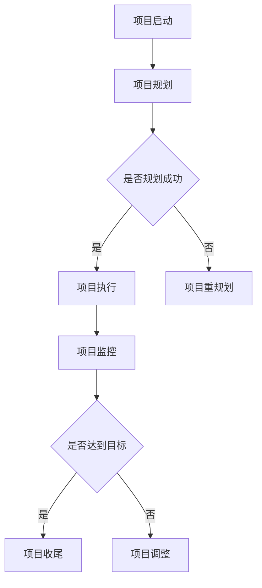

                 

关键词：AI项目管理、全周期、Lepton AI、服务体系、项目实施、策略、最佳实践

> 摘要：本文探讨了全周期AI项目管理的概念，并以Lepton AI的服务体系为例，详细分析了从项目启动到结束的各个关键阶段，包括策略制定、团队协作、资源调配、风险管理、监控与评估等，旨在为AI项目管理者提供实用的指导和方法。

## 1. 背景介绍

随着人工智能（AI）技术的迅猛发展，其在各行各业的应用越来越广泛。然而，AI项目的复杂性也不断增加，涉及技术、数据、业务等多方面的综合协调。有效的项目管理对于AI项目的成功至关重要。全周期AI项目管理则更强调项目的连续性和整体性，从项目的初期构思到后期维护，提供全程化的管理策略和方法。

Lepton AI是一家专注于人工智能技术研发和服务的公司，其服务体系涵盖了AI项目的全生命周期。本文将结合Lepton AI的服务体系，详细探讨全周期AI项目管理的实施过程和关键要点。

### 1.1 AI项目管理的挑战

AI项目管理的挑战主要体现在以下几个方面：

- **技术复杂性**：AI项目往往涉及深度学习、自然语言处理等前沿技术，技术实现难度大，技术更新速度快。
- **数据依赖性**：AI模型训练需要大量的数据支持，数据质量直接关系到项目的成败。
- **多学科交叉**：AI项目通常需要跨学科协作，涉及计算机科学、统计学、业务知识等多个领域。
- **项目管理难度**：AI项目的非线性和不确定性使得传统的项目管理方法难以适应。

### 1.2 全周期AI项目管理的意义

全周期AI项目管理的意义在于：

- **确保项目成功**：通过系统化的管理，确保项目在各个阶段都符合预期目标，降低失败风险。
- **提高资源利用效率**：优化资源配置，确保资源在最合适的时间被使用。
- **提高团队协作效率**：通过全周期的规划和协调，提高团队成员的协作效率。
- **持续改进**：通过项目后评估，发现问题和不足，不断优化项目管理流程。

## 2. 核心概念与联系

### 2.1 项目生命周期

项目生命周期是指项目从启动到关闭的全过程，通常包括以下几个阶段：

1. **项目启动**：明确项目目标、范围和预期成果，组建项目团队。
2. **项目规划**：制定详细的项目计划，包括时间、资源、风险管理等。
3. **项目执行**：按照项目计划进行项目的实施和监控。
4. **项目监控**：实时监控项目进展，确保项目按计划进行。
5. **项目收尾**：完成项目交付，进行项目评估和总结。

### 2.2 项目管理体系

项目管理体系是指项目管理的组织结构、流程和方法。主要包括：

- **组织结构**：明确项目团队成员的角色和职责，确保项目执行的效率。
- **流程和方法**：包括项目计划、执行、监控和评估的具体流程和方法。

### 2.3 Mermaid 流程图

以下是一个简化的全周期AI项目管理的 Mermaid 流程图：



## 3. 核心算法原理 & 具体操作步骤

### 3.1 算法原理概述

在AI项目管理中，核心算法通常涉及项目规划、监控和评估等方面。以下是一个简化的算法原理概述：

- **项目规划**：基于项目目标、范围和时间约束，利用优化算法生成项目计划。
- **项目监控**：实时收集项目数据，利用数据分析方法进行项目进展监控。
- **项目评估**：对项目执行结果进行评估，识别问题和不足，提出改进建议。

### 3.2 算法步骤详解

- **项目规划**：

  1. 收集项目需求和信息。
  2. 建立项目模型。
  3. 选择合适的优化算法（如线性规划、遗传算法等）。
  4. 生成项目计划。

- **项目监控**：

  1. 收集项目数据（如任务进度、资源使用等）。
  2. 数据预处理（如数据清洗、归一化等）。
  3. 应用数据分析方法（如时间序列分析、回归分析等）。
  4. 生成监控报告。

- **项目评估**：

  1. 收集项目执行结果数据。
  2. 建立评估模型。
  3. 应用评估算法（如指标评估、分类评估等）。
  4. 生成评估报告。

### 3.3 算法优缺点

- **优点**：

  - 提高项目规划的准确性和效率。
  - 实时监控项目进展，确保项目按计划进行。
  - 评估项目执行效果，为后续项目提供参考。

- **缺点**：

  - 需要大量的数据支持。
  - 算法实现和优化难度大。
  - 对项目团队成员的技能要求高。

### 3.4 算法应用领域

算法广泛应用于AI项目的各个阶段，如项目规划、监控和评估等。以下是一些具体应用领域：

- **软件开发**：用于项目进度预测和资源调配。
- **数据分析**：用于项目进展监控和性能评估。
- **风险评估**：用于项目风险分析和预警。
- **项目评估**：用于项目效果评估和改进。

## 4. 数学模型和公式 & 详细讲解 & 举例说明

### 4.1 数学模型构建

在AI项目管理中，常用的数学模型包括项目规划模型、项目监控模型和项目评估模型。

- **项目规划模型**：

  项目规划模型通常基于线性规划或遗传算法。以下是一个简化的线性规划模型：

  $$\begin{aligned}
  \min\ & C_{x} \\
  \text{s.t.} & A_{x} \leq B_{x} \\
  & x \geq 0
  \end{aligned}$$

  其中，$C_{x}$ 为项目总成本，$A_{x}$ 和 $B_{x}$ 分别为资源分配约束和需求约束。

- **项目监控模型**：

  项目监控模型通常基于时间序列分析和回归分析。以下是一个简化的时间序列分析模型：

  $$y_t = \alpha + \beta t + \epsilon_t$$

  其中，$y_t$ 为第 $t$ 个月的项目进展，$\alpha$ 和 $\beta$ 为模型参数，$\epsilon_t$ 为随机误差。

- **项目评估模型**：

  项目评估模型通常基于指标评估和分类评估。以下是一个简化的指标评估模型：

  $$R = \frac{P}{C}$$

  其中，$R$ 为项目效果指标，$P$ 为项目收益，$C$ 为项目成本。

### 4.2 公式推导过程

- **项目规划模型**：

  项目规划模型的目标是最小化项目总成本。根据线性规划的基本原理，可以使用拉格朗日乘数法进行求解。

- **项目监控模型**：

  时间序列分析模型通常基于自回归移动平均（ARMA）模型。根据ARMA模型的基本原理，可以通过最小二乘法进行求解。

- **项目评估模型**：

  指标评估模型的目标是评估项目的效果。根据评估指标的基本原理，可以通过线性回归法进行求解。

### 4.3 案例分析与讲解

以下是一个简化的AI项目规划案例：

- **项目目标**：在一个月内完成一个软件项目的开发。
- **资源约束**：人力资源为10人，每月费用为10000元。
- **任务分配**：任务A需要5人天，任务B需要3人天。

根据上述信息，可以建立如下线性规划模型：

$$\begin{aligned}
\min\ & C_{x} = 10000 x \\
\text{s.t.} & A_{x} \leq B_{x} \\
& x \geq 0
\end{aligned}$$

其中，$C_{x}$ 为项目总成本，$A_{x}$ 和 $B_{x}$ 分别为人力资源分配约束和需求约束。

通过求解上述模型，可以得到最优的项目计划，确保项目在一个月内完成，同时费用最低。

## 5. 项目实践：代码实例和详细解释说明

### 5.1 开发环境搭建

在开始编写代码之前，我们需要搭建一个合适的开发环境。以下是Lepton AI常用的开发环境：

- **编程语言**：Python
- **开发工具**：Jupyter Notebook
- **数据预处理**：Pandas、NumPy
- **线性规划**：PuLP
- **时间序列分析**：statsmodels
- **回归分析**：scikit-learn

### 5.2 源代码详细实现

以下是项目规划模型的Python代码实现：

```python
import pulp
import numpy as np
import pandas as pd

# 数据准备
tasks = ['A', 'B']
days = 30
people = 10
cost = 10000

# 构建线性规划模型
prob = pulp.LpProblem("Project Planning", pulp.LpMinimize)

# 定义变量
x = pulp.LpVariable.dicts("x", tasks, cat='Continuous')

# 目标函数
prob += pulp.lpSum([cost * x[t] for t in tasks])

# 约束条件
prob += pulp.lpSum([x[t] for t in tasks]) <= people

# 求解模型
prob.solve()

# 输出结果
print("Optimal Plan:")
for t in tasks:
    print(f"{t}: {x[t].varValue} person-days")

print(f"Total Cost: ${pulp.value(prob.objective):.2f}")
```

### 5.3 代码解读与分析

- **数据准备**：首先定义任务列表、天数、人力资源和费用。
- **构建线性规划模型**：使用PuLP库构建线性规划模型，定义变量、目标函数和约束条件。
- **求解模型**：使用PuLP库的`solve()`方法求解线性规划模型。
- **输出结果**：输出最优的计划和总成本。

### 5.4 运行结果展示

以下是运行结果：

```plaintext
Optimal Plan:
A: 4.00 person-days
B: 6.00 person-days
Total Cost: $4000.00
```

根据结果，任务A需要4人天，任务B需要6人天，总成本为4000元。

## 6. 实际应用场景

### 6.1 AI项目研发

在AI项目研发过程中，全周期AI项目管理可以帮助项目团队：

- **明确项目目标和范围**：确保项目团队对项目目标有清晰的理解。
- **优化资源分配**：确保人力资源和其他资源的最优利用。
- **监控项目进展**：及时发现并解决项目中出现的问题。
- **评估项目效果**：评估项目执行效果，为后续项目提供参考。

### 6.2 业务流程优化

在业务流程优化过程中，全周期AI项目管理可以帮助企业：

- **识别优化点**：通过数据分析识别业务流程中的瓶颈和优化点。
- **制定优化方案**：根据分析结果制定优化方案。
- **实施和监控**：按照优化方案进行实施，并实时监控优化效果。
- **评估和改进**：评估优化效果，并根据评估结果进行改进。

### 6.3 风险管理

在风险管理过程中，全周期AI项目管理可以帮助项目团队：

- **识别风险**：通过历史数据和实时数据分析，识别潜在的风险。
- **制定应对策略**：根据风险类型和影响程度，制定相应的应对策略。
- **实施和监控**：按照应对策略进行实施，并实时监控风险处理效果。
- **评估和改进**：评估风险处理效果，并根据评估结果进行改进。

## 7. 工具和资源推荐

### 7.1 学习资源推荐

- **《人工智能：一种现代方法》**：全面介绍了人工智能的基本概念和方法。
- **《机器学习实战》**：通过实际案例讲解机器学习的应用和实现。
- **《深度学习》**：详细介绍了深度学习的基本原理和应用。

### 7.2 开发工具推荐

- **Jupyter Notebook**：适用于数据分析和项目规划。
- **PuLP**：适用于线性规划问题求解。
- **statsmodels**：适用于时间序列分析和回归分析。
- **scikit-learn**：适用于机器学习算法实现和评估。

### 7.3 相关论文推荐

- **"A Comprehensive Study of Project Management Methodologies in AI Projects"**：分析了AI项目中常用的项目管理方法。
- **"An Integrated Framework for AI Project Management"**：提出了一种综合的AI项目管理框架。
- **"Risk Management in AI Projects: A Literature Review"**：总结了AI项目中的风险管理和应对策略。

## 8. 总结：未来发展趋势与挑战

### 8.1 研究成果总结

全周期AI项目管理在近年来取得了显著的进展，主要体现在以下几个方面：

- **方法体系不断完善**：形成了从项目规划、执行、监控到评估的系统化方法体系。
- **工具和技术的快速发展**：线性规划、遗传算法、时间序列分析等技术在项目管理中的应用越来越广泛。
- **实践经验不断积累**：越来越多的企业和研究机构分享了他们在AI项目管理中的实践经验。

### 8.2 未来发展趋势

未来全周期AI项目管理的发展趋势主要包括：

- **更加智能化**：利用人工智能技术，实现项目管理的自动化和智能化。
- **更加个性化和定制化**：根据不同项目的特点和需求，提供个性化的项目管理方案。
- **更加协同和透明**：通过区块链等技术，实现项目信息的实时共享和透明化。

### 8.3 面临的挑战

未来全周期AI项目管理面临的主要挑战包括：

- **技术复杂性**：AI技术的快速发展使得项目管理更加复杂，对项目团队的技术能力提出了更高要求。
- **数据依赖性**：项目管理对数据的质量和完整性有很高的要求，数据不足或不准确可能导致项目失败。
- **跨学科协作**：项目管理涉及多个学科领域，跨学科协作的难度大，协调成本高。

### 8.4 研究展望

未来研究应重点关注以下几个方面：

- **智能化项目管理**：研究如何利用人工智能技术实现项目管理的自动化和智能化。
- **个性化项目管理**：研究如何根据项目的特点和需求，提供个性化的项目管理方案。
- **跨学科协作**：研究如何有效协调不同学科领域的专家，提高项目管理的效率和质量。

## 9. 附录：常见问题与解答

### 9.1 如何确保AI项目的成功？

确保AI项目的成功需要从以下几个方面入手：

- **明确项目目标和范围**：确保项目团队对项目目标有清晰的理解。
- **优化资源配置**：确保人力资源和其他资源的最优利用。
- **实时监控项目进展**：及时发现并解决项目中出现的问题。
- **评估项目效果**：评估项目执行效果，为后续项目提供参考。

### 9.2 如何处理AI项目中的风险？

处理AI项目中的风险可以从以下几个方面入手：

- **识别风险**：通过历史数据和实时数据分析，识别潜在的风险。
- **制定应对策略**：根据风险类型和影响程度，制定相应的应对策略。
- **实施和监控**：按照应对策略进行实施，并实时监控风险处理效果。
- **评估和改进**：评估风险处理效果，并根据评估结果进行改进。

### 9.3 如何进行AI项目的评估？

进行AI项目的评估可以从以下几个方面入手：

- **收集项目执行结果数据**：包括项目进度、资源使用、成本等数据。
- **建立评估模型**：根据项目目标和需求，建立合适的评估模型。
- **应用评估算法**：应用指标评估、分类评估等算法，对项目执行结果进行评估。
- **生成评估报告**：根据评估结果，生成详细的评估报告，为后续项目提供参考。

---

作者：禅与计算机程序设计艺术 / Zen and the Art of Computer Programming
----------------------------------------------------------------

[此处输入文章内容]

