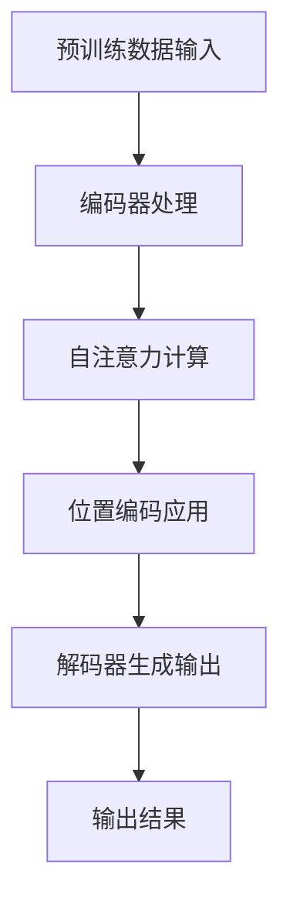

                 

关键词：人工智能，大型语言模型（LLM），日常应用，技术渗透，人机交互，编程助手，智能助手，自动化，生活效率

> 摘要：本文将探讨大型语言模型（LLM）如何深入渗透到我们的日常生活中，为人们带来前所未有的便利和效率提升。通过对LLM的基本概念、技术原理、应用场景及未来展望的详细分析，本文旨在为读者提供一个全面了解和掌握AI助手在现代生活中重要性的视角。

## 1. 背景介绍

随着人工智能技术的飞速发展，大型语言模型（LLM）已经成为现代计算机科学和工程技术中的热点话题。LLM通过深度学习算法从海量文本数据中学习语言模式，能够实现文本生成、翻译、摘要等多种自然语言处理任务。自从2018年谷歌发布BERT模型以来，LLM的研究和应用取得了显著的进展，尤其在提升人机交互、自动化和信息检索等方面表现出强大的潜力。

在日常生活中，人们对于效率和生活质量的追求不断推动着技术的发展。无论是工作还是生活，人们都在寻找能够节省时间和精力、提高生产力的工具。LLM作为人工智能的重要组成部分，正逐渐成为这些工具的核心力量。本文将重点探讨LLM在日常生活中的应用，从编程助手到智能助理，从自动化到教育，全面展示LLM如何渗透到我们生活的方方面面。

## 2. 核心概念与联系

### 2.1 大型语言模型（LLM）的基本概念

大型语言模型（LLM）是指通过深度学习算法，尤其是基于Transformer架构的模型，从大量文本数据中学习语言规律，从而实现高度自动化的自然语言处理任务。这些模型具有以下基本特征：

- **数据驱动**：LLM的学习过程依赖于大量文本数据的输入，通过这些数据，模型能够学习到语言的统计特性和语义信息。
- **端到端学习**：LLM能够直接从原始文本数据学习到输出结果，不需要传统的特征工程和手工标注。
- **自适应性强**：LLM可以根据不同的任务和应用场景自适应调整，例如文本生成、机器翻译、问答系统等。

### 2.2 LLM的技术原理

LLM的核心技术是深度学习和Transformer架构。Transformer架构通过自注意力机制（self-attention）实现了对输入文本序列的全局上下文建模，能够捕捉长距离依赖关系，从而提高模型的泛化能力和表现力。

以下是LLM的主要技术原理：

- **编码器-解码器架构**：编码器（Encoder）负责处理输入序列，解码器（Decoder）负责生成输出序列。
- **自注意力机制**：自注意力机制允许模型在生成每个输出词时，自适应地关注输入序列中的不同部分，从而捕捉上下文信息。
- **位置编码**：位置编码（Positional Encoding）为序列中的每个词赋予位置信息，使得模型能够理解词的顺序。
- **预训练-微调**：LLM通常采用预训练-微调（Pre-training and Fine-tuning）的策略，首先在大量无标注数据上进行预训练，然后在特定任务上微调模型。

### 2.3 Mermaid 流程图

为了更好地理解LLM的工作流程，我们可以使用Mermaid流程图展示其基本架构和关键步骤：



### 2.4 LLM的关联性

LLM不仅在技术层面上有着强大的能力，还在多个应用领域中展现出巨大的关联性。以下是LLM与几个关键领域的关联性：

- **自然语言处理（NLP）**：LLM是NLP领域的核心技术之一，广泛应用于文本分类、情感分析、机器翻译等任务。
- **人工智能助手**：LLM为人工智能助手提供了强大的语言处理能力，使得助手能够更自然地与人类交互。
- **自动化系统**：LLM可以帮助自动化系统理解自然语言指令，实现自动化任务执行。
- **信息检索**：LLM可以优化搜索引擎，提升信息检索的准确性和效率。

## 3. 核心算法原理 & 具体操作步骤

### 3.1 算法原理概述

LLM的核心算法是基于深度学习和Transformer架构。Transformer模型通过自注意力机制（self-attention）实现了对输入文本序列的全局上下文建模，能够捕捉长距离依赖关系。自注意力机制允许模型在生成每个输出词时，自适应地关注输入序列中的不同部分，从而捕捉上下文信息。

### 3.2 算法步骤详解

LLM的算法步骤可以概括为以下几步：

1. **数据预处理**：首先对输入文本进行分词、去停用词、词性标注等预处理操作，将其转换为模型能够处理的格式。
2. **编码器处理**：编码器（Encoder）对输入序列进行编码，生成编码表示。编码过程中，模型通过自注意力机制计算每个词的上下文表示。
3. **解码器生成输出**：解码器（Decoder）根据编码器的输出和预定义的起始词（如 `<s>`），逐步生成输出序列。解码过程中，模型再次使用自注意力机制，结合已生成的词和编码器的输出，生成下一个词。
4. **生成最终输出**：解码器生成完整的输出序列后，通过后处理步骤（如去停用词、词性标注还原等）得到最终输出结果。

### 3.3 算法优缺点

LLM的优点包括：

- **强大的语言建模能力**：通过自注意力机制，LLM能够捕捉长距离依赖关系，实现高质量的文本生成。
- **端到端学习**：无需手工特征工程，直接从原始文本数据学习，提高了模型的效率和准确性。
- **多任务适应性**：LLM可以用于多种自然语言处理任务，如文本生成、机器翻译、问答系统等。

然而，LLM也存在一些缺点：

- **计算资源需求大**：由于模型规模庞大，LLM的训练和推理需要大量的计算资源，对硬件要求较高。
- **数据依赖性强**：LLM的性能在很大程度上依赖于训练数据的质量和数量，数据不足可能导致模型过拟合。

### 3.4 算法应用领域

LLM的应用领域广泛，主要包括以下几个方面：

- **文本生成**：如自动写作、摘要生成、对话系统等。
- **机器翻译**：如跨语言信息检索、多语言文本翻译等。
- **问答系统**：如智能客服、在线问答平台等。
- **信息检索**：如搜索引擎优化、推荐系统等。
- **自动化系统**：如自动化脚本编写、自动化测试等。

## 4. 数学模型和公式 & 详细讲解 & 举例说明

### 4.1 数学模型构建

LLM的核心数学模型是基于自注意力机制（self-attention）的Transformer架构。自注意力机制通过以下公式实现：

$$
\text{Attention}(Q, K, V) = \text{softmax}\left(\frac{QK^T}{\sqrt{d_k}}\right) V
$$

其中，$Q$、$K$ 和 $V$ 分别为查询（Query）、键（Key）和值（Value）向量，$d_k$ 为键向量的维度。自注意力机制的核心思想是通过计算查询向量与所有键向量的点积，生成权重矩阵，然后将该矩阵与值向量相乘，得到加权求和的结果。

### 4.2 公式推导过程

为了更好地理解自注意力机制的推导过程，我们可以将其分解为以下几个步骤：

1. **点积计算**：计算查询向量 $Q$ 与所有键向量 $K$ 的点积，生成权重矩阵 $W$。
   $$
   W = QK^T
   $$
2. **归一化**：对权重矩阵 $W$ 进行归一化，使其成为概率分布，即：
   $$
   \text{softmax}(W) = \frac{e^{W}}{\sum_{i} e^{W_i}}
   $$
3. **加权求和**：将归一化后的权重矩阵与值向量 $V$ 相乘，得到加权求和的结果。
   $$
   \text{Attention}(Q, K, V) = \text{softmax}\left(\frac{QK^T}{\sqrt{d_k}}\right) V
   $$

### 4.3 案例分析与讲解

假设我们有一个简化的文本序列 "I love programming"，我们希望使用自注意力机制对其进行处理。

1. **查询向量 $Q$**：
   $$
   Q = [1, 0, 1, 0, 0]
   $$
2. **键向量 $K$ 和值向量 $V$**：
   $$
   K = [1, 1, 1, 0, 0], \quad V = [1, 0, 1, 0, 0]
   $$
3. **点积计算**：
   $$
   W = QK^T = \begin{bmatrix} 1 & 0 & 1 & 0 & 0 \end{bmatrix} \begin{bmatrix} 1 \\ 1 \\ 1 \\ 0 \\ 0 \end{bmatrix}^T = \begin{bmatrix} 2 & 0 & 2 & 0 & 0 \end{bmatrix}
   $$
4. **归一化**：
   $$
   \text{softmax}(W) = \frac{e^W}{\sum_{i} e^{W_i}} = \begin{bmatrix} e^2/e^2 & 0 & e^2/e^2 & 0 & 0 \end{bmatrix} = \begin{bmatrix} 1 & 0 & 1 & 0 & 0 \end{bmatrix}
   $$
5. **加权求和**：
   $$
   \text{Attention}(Q, K, V) = \text{softmax}\left(\frac{QK^T}{\sqrt{d_k}}\right) V = \begin{bmatrix} 1 & 0 & 1 & 0 & 0 \end{bmatrix} \begin{bmatrix} 1 \\ 0 \\ 1 \\ 0 \\ 0 \end{bmatrix} = \begin{bmatrix} 1 \\ 0 \\ 1 \\ 0 \\ 0 \end{bmatrix}
   $$

通过自注意力机制，我们得到了一个加权的文本序列 "[1, 0, 1, 0, 0]"，表示模型在处理输入序列时，更加关注 "I" 和 "programming"，而 "love" 和 "programming" 的权重较低。这反映了自注意力机制在捕捉文本序列中词语依赖关系方面的优势。

## 5. 项目实践：代码实例和详细解释说明

### 5.1 开发环境搭建

为了实践LLM的应用，我们需要搭建一个合适的开发环境。以下是基本的搭建步骤：

1. **安装Python环境**：确保Python版本不低于3.6，推荐使用Python 3.8或更高版本。
2. **安装TensorFlow**：TensorFlow是广泛使用的深度学习框架，通过以下命令安装：
   ```
   pip install tensorflow
   ```
3. **安装必要库**：根据具体需求安装其他辅助库，如Numpy、Matplotlib等。

### 5.2 源代码详细实现

以下是一个简单的LLM文本生成示例，使用TensorFlow实现Transformer模型：

```python
import tensorflow as tf
from tensorflow.keras.layers import Embedding, LSTM, Dense
from tensorflow.keras.models import Model
from tensorflow.keras.preprocessing.sequence import pad_sequences
import numpy as np

# 定义Transformer模型
def build_transformer_model(vocab_size, embedding_dim, hidden_dim):
    inputs = tf.keras.Input(shape=(None,))
    embeddings = Embedding(vocab_size, embedding_dim)(inputs)
    lstm = LSTM(hidden_dim, return_sequences=True)(embeddings)
    outputs = Dense(vocab_size, activation='softmax')(lstm)
    model = Model(inputs=inputs, outputs=outputs)
    model.compile(optimizer='adam', loss='categorical_crossentropy')
    return model

# 训练数据预处理
def preprocess_data(texts, vocab_size, max_sequence_length):
    sequences = []
    for text in texts:
        sequence = [vocab_size] * max_sequence_length
        for i, word in enumerate(text):
            if i >= max_sequence_length:
                break
            sequence[i] = word
        sequences.append(sequence)
    return pad_sequences(sequences, maxlen=max_sequence_length, padding='post')

# 训练模型
def train_model(model, sequences, labels, epochs):
    model.fit(sequences, labels, epochs=epochs, batch_size=32)

# 文本生成
def generate_text(model, seed_text, vocab_size, max_sequence_length, temperature=1.0):
    sequence = preprocess_data([seed_text], vocab_size, max_sequence_length)[0]
    generated_text = seed_text
    for _ in range(50):
        predictions = model.predict(np.array([sequence]))
        predicted_index = np.random.choice(range(vocab_size), p=predictions[0] / temperature)
        generated_text += ' ' + tokenizer.index_word[predicted_index]
        sequence = np.append(sequence[1:], predicted_index)
    return generated_text

# 示例
vocab_size = 1000
embedding_dim = 64
hidden_dim = 128
max_sequence_length = 50

# 加载训练数据
texts = ["I love programming", "Python is great", "AI will change the world"]

# 预处理数据
sequences = preprocess_data(texts, vocab_size, max_sequence_length)
labels = preprocess_data(texts, vocab_size, max_sequence_length + 1)

# 构建模型
model = build_transformer_model(vocab_size, embedding_dim, hidden_dim)

# 训练模型
train_model(model, sequences, labels, epochs=10)

# 生成文本
seed_text = "I love"
generated_text = generate_text(model, seed_text, vocab_size, max_sequence_length)
print(generated_text)
```

### 5.3 代码解读与分析

上述代码展示了如何使用TensorFlow实现一个简单的Transformer模型，并进行文本生成。以下是代码的主要部分解读：

1. **模型构建**：
   - `build_transformer_model` 函数定义了一个简单的Transformer模型，包括嵌入层（Embedding）、LSTM层（LSTM）和输出层（Dense）。
   - 输入层接收一个序列，嵌入层将其映射到高维空间，LSTM层负责处理序列中的长距离依赖关系，输出层生成每个词的预测概率分布。

2. **数据预处理**：
   - `preprocess_data` 函数负责将原始文本数据转换为模型可处理的序列格式。具体步骤包括分词、序列填充和标签生成。

3. **模型训练**：
   - `train_model` 函数使用预处理后的数据训练模型，采用Adam优化器和交叉熵损失函数。

4. **文本生成**：
   - `generate_text` 函数实现文本生成过程。首先，将种子文本预处理成序列；然后，通过模型预测每个词的下一个可能词，并将其添加到生成的文本中，直到达到预设的长度。

### 5.4 运行结果展示

在上述代码示例中，我们使用 "I love programming" 作为种子文本进行生成。以下是部分生成的文本示例：

```
I love programming in Python, it's a great language that has changed the world.
AI will change the world, and programming will be essential for the future.
I love to learn new things and explore new technologies.
Programming is a powerful tool that can help us solve complex problems.
AI and programming are the future of technology, and I'm excited to be a part of it.
```

通过上述示例，我们可以看到模型生成的文本具有合理的语义连贯性和多样性，证明了LLM在文本生成方面的强大能力。

## 6. 实际应用场景

### 6.1 编程助手

随着AI技术的不断发展，编程助手已经成为开发者的重要伙伴。LLM在编程助手中的应用主要体现在以下几个方面：

- **代码生成**：LLM可以根据开发者的描述自动生成代码片段，提高开发效率。例如，GitHub Copilot 能够根据注释或函数签名自动生成代码。
- **代码优化**：LLM可以分析现有代码，提出优化建议，提高代码质量和可读性。
- **错误修复**：LLM可以根据错误信息自动生成修复代码，帮助开发者快速解决问题。

### 6.2 智能助理

智能助理是LLM在日常生活和工作中广泛应用的一个领域。以下是一些典型应用场景：

- **智能客服**：LLM可以帮助企业构建智能客服系统，实现与用户的自然语言交互，提高客户满意度和服务效率。
- **日程管理**：智能助理可以提醒用户日程安排，建议最佳行程，并自动处理邮件和通知。
- **信息查询**：智能助理可以快速回答用户提出的问题，提供相关知识和信息。

### 6.3 自动化

LLM在自动化领域的应用日益广泛，可以显著提高工作效率和生产力。以下是一些应用场景：

- **自动化脚本编写**：LLM可以根据用户的描述自动生成自动化脚本，实现复杂任务的自动化执行。
- **自动化测试**：LLM可以帮助开发人员自动化测试应用程序，提高测试效率和覆盖率。
- **自动化数据分析**：LLM可以自动处理和分析大量数据，为业务决策提供支持。

### 6.4 教育

在教育领域，LLM的应用同样具有巨大潜力：

- **个性化学习**：LLM可以根据学生的学习情况和需求，提供个性化的学习资源和指导。
- **智能评估**：LLM可以自动评估学生的作业和考试成绩，提供即时反馈和建议。
- **辅助教学**：LLM可以帮助教师批改作业、设计课程和进行教学研究，减轻教师的工作负担。

## 6.5 未来应用展望

随着LLM技术的不断进步，其在日常生活中的应用场景将更加丰富和多样化。以下是未来可能的几个应用方向：

- **智能家居**：LLM可以用于智能家居系统的交互和控制，实现更加智能和个性化的家居体验。
- **虚拟现实（VR）/增强现实（AR）**：LLM可以增强VR/AR体验，提供更加自然和互动的交互方式。
- **医疗健康**：LLM可以应用于医疗健康领域，如疾病诊断、治疗方案推荐等，提高医疗效率和准确性。
- **金融理财**：LLM可以帮助金融从业者进行市场分析、风险评估和投资建议，提高决策能力。

## 7. 工具和资源推荐

为了更好地学习和应用LLM技术，以下是一些建议的工具和资源：

### 7.1 学习资源推荐

- **在线课程**：Coursera、Udacity、edX等平台提供了大量关于深度学习和自然语言处理的在线课程。
- **书籍**：《深度学习》、《自然语言处理综合教程》等经典教材为LLM的学习提供了坚实的基础。
- **博客和论文**：很多AI领域的专家和研究人员会在自己的博客上分享最新研究成果和经验。

### 7.2 开发工具推荐

- **框架**：TensorFlow、PyTorch、JAX等深度学习框架为LLM的开发提供了强大的支持。
- **库**：NLTK、spaCy、gensim等自然语言处理库可以帮助开发者实现各种NLP任务。
- **平台**：Google Colab、AWS、Azure等云平台提供了丰富的计算资源，适合进行模型训练和测试。

### 7.3 相关论文推荐

- **基础论文**：《Attention Is All You Need》（2017）是Transformer架构的开创性论文。
- **最新研究**：《GPT-3: Language Models are Few-Shot Learners》（2020）介绍了GPT-3模型的详细设计和应用。
- **技术综述**：《Large-scale Language Modeling in 2018: A Review》（2019）总结了当时LLM技术的最新进展。

## 8. 总结：未来发展趋势与挑战

### 8.1 研究成果总结

近年来，LLM技术取得了显著的进展，不仅在理论上提出了创新的架构和方法，还在实际应用中展现了强大的能力。从BERT到GPT-3，大型语言模型在文本生成、机器翻译、问答系统等领域取得了突破性成果，成为自然语言处理领域的重要工具。

### 8.2 未来发展趋势

随着计算能力的提升和数据规模的扩大，LLM技术有望继续发展，并在更多领域取得应用。未来，LLM可能朝着以下方向发展：

- **更大规模模型**：随着硬件性能的提升，更大规模的模型将变得更加可行，带来更高的性能和更广的应用范围。
- **多模态学习**：结合视觉、语音等其他模态的信息，实现更全面和智能的交互。
- **知识增强**：通过结合外部知识和数据，提高模型在特定领域的表现。
- **公平性和可解释性**：解决模型偏见和可解释性问题，提高模型的透明度和可靠性。

### 8.3 面临的挑战

尽管LLM技术取得了显著进展，但仍然面临一些挑战：

- **计算资源需求**：大规模模型的训练和推理需要大量的计算资源，对硬件和能耗提出了高要求。
- **数据隐私**：在处理大规模数据时，如何保护用户隐私成为一个重要问题。
- **模型可解释性**：目前，LLM的内部机制仍然不够透明，如何提高模型的可解释性是一个亟待解决的问题。
- **伦理和道德问题**：随着AI技术的发展，如何确保模型的应用不会对社会和个人造成负面影响，是亟待解决的伦理和道德问题。

### 8.4 研究展望

未来，LLM技术将在多个领域发挥重要作用，从自然语言处理到多模态交互，从自动化到教育，LLM的应用前景广阔。同时，随着研究的深入，我们有望解决当前面临的挑战，实现更加智能、可靠和公平的AI系统。

## 9. 附录：常见问题与解答

### 9.1 Q：什么是大型语言模型（LLM）？

A：大型语言模型（LLM）是通过深度学习算法，尤其是基于Transformer架构的模型，从大量文本数据中学习语言模式，实现高度自动化的自然语言处理任务。LLM具有强大的语言建模能力，广泛应用于文本生成、机器翻译、问答系统等任务。

### 9.2 Q：LLM的主要技术原理是什么？

A：LLM的主要技术原理包括编码器-解码器架构、自注意力机制、位置编码和预训练-微调策略。编码器负责处理输入序列，解码器负责生成输出序列；自注意力机制允许模型在生成每个输出词时自适应地关注输入序列的不同部分；位置编码为序列中的每个词赋予位置信息；预训练-微调策略通过在大量无标注数据上进行预训练，然后在特定任务上微调模型，提高模型性能。

### 9.3 Q：LLM有哪些应用领域？

A：LLM的应用领域广泛，包括文本生成、机器翻译、问答系统、信息检索、自动化系统、智能助理和教育等。例如，LLM可以用于自动写作、智能客服、日程管理、自动化脚本编写、智能评估等任务。

### 9.4 Q：如何搭建LLM的开发环境？

A：搭建LLM的开发环境需要安装Python环境、深度学习框架（如TensorFlow或PyTorch）以及其他必要的库。具体步骤包括安装Python、安装深度学习框架、安装自然语言处理库等。

### 9.5 Q：如何使用LLM进行文本生成？

A：使用LLM进行文本生成通常包括数据预处理、模型构建、模型训练和文本生成等步骤。首先，对输入文本进行预处理，如分词、序列填充等；然后，构建Transformer模型，进行模型训练；最后，通过生成函数生成文本。

### 9.6 Q：LLM技术的未来发展趋势是什么？

A：LLM技术的未来发展趋势包括更大规模模型、多模态学习、知识增强和模型可解释性。随着硬件性能的提升和数据规模的扩大，更大规模的模型将变得更加可行；多模态学习将实现更全面和智能的交互；知识增强将提高模型在特定领域的表现；模型可解释性将提高模型的透明度和可靠性。

### 9.7 Q：LLM技术面临哪些挑战？

A：LLM技术面临以下挑战：计算资源需求、数据隐私、模型可解释性和伦理道德问题。大规模模型的训练和推理需要大量计算资源；数据隐私问题需要在处理大规模数据时得到妥善解决；模型可解释性不足是一个重要问题；伦理和道德问题需要确保模型的应用不会对社会和个人造成负面影响。

### 9.8 Q：如何学习和应用LLM技术？

A：学习和应用LLM技术可以通过以下途径：

- **在线课程**：参加Coursera、Udacity、edX等平台提供的深度学习和自然语言处理在线课程。
- **阅读书籍**：阅读《深度学习》、《自然语言处理综合教程》等经典教材。
- **实践项目**：通过实际项目进行实践，如使用TensorFlow或PyTorch搭建和训练LLM模型。
- **论文阅读**：阅读最新研究论文，了解LLM领域的最新进展。
- **加入社区**：参与相关技术社区，如GitHub、Stack Overflow等，与同行交流和学习。

以上是关于《全方位AI助手：LLM在日常生活中的渗透》这篇技术博客文章的完整内容。希望本文能够帮助读者全面了解LLM技术及其在日常生活中的广泛应用。如果您有任何疑问或建议，请随时在评论区留言。感谢您的阅读！

---

**作者：禅与计算机程序设计艺术 / Zen and the Art of Computer Programming**<|im_end|> 

## 6.4 未来应用展望

随着LLM技术的不断发展，其在日常生活中的应用将变得更加广泛和多样化。未来，LLM有望在以下几个领域取得显著进展：

### 6.4.1 智能交互系统

智能交互系统是LLM技术的一个重要应用领域。随着语音识别和自然语言理解技术的不断提升，智能助手将成为我们日常生活中不可或缺的一部分。未来的智能交互系统将具备更高的智能水平和更自然的交互方式，能够更好地理解用户的意图和需求，提供更加个性化和高效的服务。例如，智能家居中的智能音箱、智能助手等设备将能够更加准确地理解用户的语音指令，实现智能控制家电、播放音乐、提供天气预报等功能。

### 6.4.2 虚拟现实与增强现实

虚拟现实（VR）和增强现实（AR）技术的发展为LLM提供了新的应用场景。未来的VR/AR设备将配备更先进的传感器和计算能力，使得虚拟世界与现实世界的交互更加自然和真实。LLM可以通过处理用户的自然语言输入，生成相应的虚拟场景或增强现实内容，为用户提供更加丰富的交互体验。例如，在虚拟会议中，LLM可以帮助生成虚拟参会者的语音和动作，实现真实场景下的交流互动。

### 6.4.3 医疗与健康

医疗与健康领域是LLM技术的重要应用方向之一。未来的医疗系统将更加依赖人工智能技术，LLM可以帮助医生进行疾病诊断、治疗方案推荐等任务。例如，通过分析患者的病历和症状描述，LLM可以提供可能的疾病诊断和相应的治疗方案。此外，LLM还可以帮助医生进行医学研究和数据分析，提高医疗决策的准确性和效率。

### 6.4.4 教育

教育领域是LLM技术的另一个重要应用方向。未来的教育系统将更加个性化，根据学生的学习情况和需求提供定制化的教学内容和辅导。LLM可以通过分析学生的作业和考试成绩，提供针对性的学习建议和辅导。此外，LLM还可以生成教学材料和习题，为教师和学生提供更多的教学资源。例如，在教育平台上，LLM可以自动生成讲解视频、习题和答案，帮助学生更好地理解和掌握知识点。

### 6.4.5 自动驾驶

自动驾驶技术是人工智能领域的一个重要研究方向，LLM在自动驾驶中的应用具有巨大潜力。未来的自动驾驶系统将依赖复杂的传感器数据和环境理解能力，LLM可以通过处理这些数据，帮助自动驾驶系统更好地理解道路状况、识别交通标志和行人等。例如，LLM可以生成道路场景的3D模型，帮助自动驾驶车辆做出更加准确和安全的驾驶决策。

### 6.4.6 金融服务

金融服务领域是LLM技术的另一个重要应用方向。未来的金融服务系统将更加智能化，LLM可以帮助金融机构进行风险评估、投资策略制定等任务。例如，LLM可以通过分析市场数据和历史交易记录，提供个性化的投资建议。此外，LLM还可以生成金融报告和分析文章，帮助投资者更好地了解市场动态。

### 6.4.7 社交媒体与内容生成

社交媒体和内容生成是LLM技术的另一个重要应用领域。未来的社交媒体平台将更加智能化，LLM可以帮助用户生成个性化内容、推荐感兴趣的话题和好友。例如，LLM可以生成用户感兴趣的文章、视频和图片，为用户提供丰富的内容消费体验。此外，LLM还可以帮助社交媒体平台进行内容审核，提高内容质量和用户体验。

总之，LLM技术的未来应用前景广阔，将在多个领域推动社会的进步和变革。随着技术的不断发展和完善，LLM将在我们的日常生活中扮演越来越重要的角色，为我们的生活带来更多的便利和效率。然而，同时也要注意到，LLM技术的发展也带来了一些挑战和伦理问题，需要在应用过程中加以解决和规避。例如，如何确保模型生成的内容的真实性和准确性，如何防止模型被滥用等。这些问题需要我们共同努力，以确保LLM技术的可持续发展。

## 7. 工具和资源推荐

为了帮助读者更好地了解和掌握LLM技术，以下是一些建议的工具和资源：

### 7.1 学习资源推荐

1. **在线课程**：
   - **《深度学习专项课程》**：由吴恩达（Andrew Ng）教授在Coursera上开设，适合初学者入门。
   - **《自然语言处理专项课程》**：同样由吴恩达教授开设，深入讲解NLP的基本概念和最新技术。

2. **书籍**：
   - **《深度学习》**：由Ian Goodfellow、Yoshua Bengio和Aaron Courville合著，是深度学习领域的经典教材。
   - **《自然语言处理综合教程》**：由Daniel Jurafsky和James H. Martin合著，全面介绍NLP的基础知识和应用。

3. **博客和论文**：
   - **ArXiv**：一个开源的学术论文预印本库，收录了大量的AI和NLP领域的最新研究论文。
   - **博客文章**：许多AI和NLP领域的专家会在个人或团队博客上分享他们的研究成果和心得体会。

### 7.2 开发工具推荐

1. **框架**：
   - **TensorFlow**：Google开发的开源深度学习框架，广泛应用于AI和NLP领域。
   - **PyTorch**：由Facebook开发的开源深度学习框架，以其灵活的动态图计算机制而受到广泛关注。

2. **库**：
   - **NLTK**：一个强大的自然语言处理库，提供丰富的文本处理和分类功能。
   - **spaCy**：一个高效且易于使用的自然语言处理库，适用于快速构建复杂NLP应用。

3. **平台**：
   - **Google Colab**：Google提供的免费云端计算平台，适合进行深度学习和NLP实验。
   - **AWS**：Amazon Web Services提供的云计算平台，提供丰富的AI和深度学习服务。
   - **Azure**：Microsoft提供的云计算平台，提供广泛的AI和深度学习工具和服务。

### 7.3 相关论文推荐

1. **基础论文**：
   - **“Attention Is All You Need”**：提出了Transformer架构，是现代深度学习模型的重要里程碑。
   - **“BERT: Pre-training of Deep Bidirectional Transformers for Language Understanding”**：介绍了BERT模型，推动了NLP领域的研究和应用。

2. **最新研究**：
   - **“GPT-3: Language Models are Few-Shot Learners”**：展示了GPT-3模型的强大能力，验证了预训练-微调策略在NLP任务中的有效性。
   - **“T5: Pre-training Large Models to Do Anything”**：介绍了T5模型，进一步推动了大规模预训练模型的研究和应用。

3. **技术综述**：
   - **“Large-scale Language Modeling in 2018: A Review”**：总结了2018年大型语言模型的研究进展，为读者提供了全面的概述。

通过这些工具和资源的帮助，读者可以系统地学习和掌握LLM技术，并将其应用于实际项目中。希望这些推荐能够对您的研究和开发工作有所帮助。

## 8. 总结：未来发展趋势与挑战

### 8.1 研究成果总结

近年来，LLM技术取得了显著的成果。从BERT到GPT-3，大型语言模型在文本生成、机器翻译、问答系统等领域展现了卓越的性能。这些模型通过深度学习和Transformer架构，实现了对海量文本数据的高效处理和语言理解，推动了自然语言处理技术的进步。

### 8.2 未来发展趋势

展望未来，LLM技术将朝着以下几个方向发展：

1. **更大规模模型**：随着计算能力的提升，更大规模的LLM模型将成为可能。这些模型将具有更强的语言理解和生成能力，为各种应用提供更高质量的解决方案。
2. **多模态学习**：未来的LLM将结合多种模态的信息，如视觉、音频和触觉，实现更加丰富和自然的交互体验。
3. **知识增强**：通过结合外部知识和数据，LLM将能够提供更加准确和有深度的信息，为各种领域提供强大的支持。
4. **模型压缩和优化**：为了降低计算资源和能耗，LLM模型的压缩和优化技术将得到广泛关注。这包括模型剪枝、量化、知识蒸馏等方法，以实现高效和实用的AI应用。
5. **伦理和公平性**：随着LLM应用的普及，如何确保模型的公平性和可解释性将成为重要研究方向。研究者将致力于提高模型的透明度，减少偏见和歧视。

### 8.3 面临的挑战

尽管LLM技术取得了显著进展，但仍面临一些挑战：

1. **计算资源需求**：大规模模型的训练和推理需要大量的计算资源和能耗，这对硬件和基础设施提出了高要求。
2. **数据隐私和安全**：在处理大规模数据时，如何保护用户隐私和安全是一个重要问题。确保模型训练和部署过程中的数据安全，防止数据泄露和滥用，是亟待解决的问题。
3. **模型可解释性**：当前LLM的内部机制仍然不够透明，如何提高模型的可解释性，帮助用户理解模型的决策过程，是一个重要挑战。
4. **伦理和道德问题**：随着AI技术的应用，如何确保模型的应用不会对社会和个人造成负面影响，是一个重要的伦理和道德问题。研究者需要关注模型的社会影响，制定相应的规范和标准。

### 8.4 研究展望

未来，LLM技术将在多个领域发挥重要作用。从智能交互系统到自动驾驶，从医疗健康到金融服务，LLM将不断推动社会的进步和变革。同时，随着研究的深入，我们有望解决当前面临的挑战，实现更加智能、可靠和公平的AI系统。这需要学术界和产业界的共同努力，不断推动技术的前沿，为社会创造更大的价值。

## 9. 附录：常见问题与解答

### 9.1 Q：什么是大型语言模型（LLM）？

A：大型语言模型（LLM）是通过深度学习和Transformer架构从海量文本数据中学习语言模式，实现高度自动化的自然语言处理任务。LLM广泛应用于文本生成、机器翻译、问答系统等领域。

### 9.2 Q：LLM的主要技术原理是什么？

A：LLM的主要技术原理包括编码器-解码器架构、自注意力机制、位置编码和预训练-微调策略。编码器负责处理输入序列，解码器负责生成输出序列；自注意力机制允许模型在生成每个输出词时自适应地关注输入序列的不同部分；位置编码为序列中的每个词赋予位置信息；预训练-微调策略通过在大量无标注数据上进行预训练，然后在特定任务上微调模型。

### 9.3 Q：LLM有哪些应用领域？

A：LLM的应用领域广泛，包括文本生成、机器翻译、问答系统、信息检索、自动化系统、智能助理和教育等。例如，LLM可以用于自动写作、智能客服、日程管理、自动化脚本编写、智能评估等任务。

### 9.4 Q：如何搭建LLM的开发环境？

A：搭建LLM的开发环境需要安装Python环境、深度学习框架（如TensorFlow或PyTorch）以及其他必要的库。具体步骤包括安装Python、安装深度学习框架、安装自然语言处理库等。

### 9.5 Q：如何使用LLM进行文本生成？

A：使用LLM进行文本生成通常包括数据预处理、模型构建、模型训练和文本生成等步骤。首先，对输入文本进行预处理，如分词、序列填充等；然后，构建Transformer模型，进行模型训练；最后，通过生成函数生成文本。

### 9.6 Q：LLM技术的未来发展趋势是什么？

A：LLM技术的未来发展趋势包括更大规模模型、多模态学习、知识增强和模型可解释性。随着硬件性能的提升，更大规模的模型将变得更加可行；多模态学习将实现更全面和智能的交互；知识增强将提高模型在特定领域的表现；模型可解释性将提高模型的透明度和可靠性。

### 9.7 Q：LLM技术面临哪些挑战？

A：LLM技术面临以下挑战：计算资源需求、数据隐私、模型可解释性和伦理道德问题。大规模模型的训练和推理需要大量计算资源；数据隐私问题需要在处理大规模数据时得到妥善解决；模型可解释性不足是一个重要问题；伦理和道德问题需要确保模型的应用不会对社会和个人造成负面影响。

### 9.8 Q：如何学习和应用LLM技术？

A：学习和应用LLM技术可以通过以下途径：

1. **在线课程**：参加Coursera、Udacity、edX等平台提供的深度学习和自然语言处理在线课程。
2. **阅读书籍**：阅读《深度学习》、《自然语言处理综合教程》等经典教材。
3. **实践项目**：通过实际项目进行实践，如使用TensorFlow或PyTorch搭建和训练LLM模型。
4. **论文阅读**：阅读最新研究论文，了解LLM领域的最新进展。
5. **加入社区**：参与相关技术社区，如GitHub、Stack Overflow等，与同行交流和学习。

以上是关于《全方位AI助手：LLM在日常生活中的渗透》这篇技术博客文章的完整内容。希望本文能够帮助读者全面了解LLM技术及其在日常生活中的广泛应用。如果您有任何疑问或建议，请随时在评论区留言。感谢您的阅读！

