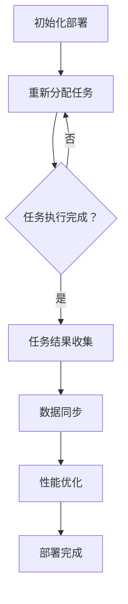

                 

关键词：全球化AI服务、多地域部署、Lepton AI、分布式计算、数据同步、性能优化

## 摘要

随着人工智能技术的飞速发展，全球化AI服务已成为现代企业创新的核心驱动力。本文以Lepton AI为例，探讨了如何实现AI模型的多地域部署。通过深入分析分布式计算、数据同步和性能优化等方面的技术，本文旨在为从事AI开发的技术人员提供一套系统、可操作的解决方案，助力企业在全球范围内高效地提供AI服务。

## 1. 背景介绍

在全球化背景下，企业面临着日益复杂的业务环境和不断变化的市场需求。为了实现业务的快速扩展，许多企业开始将人工智能（AI）技术应用于其核心业务流程。然而，随着AI模型复杂度和数据量的增加，如何高效地部署和管理这些模型成为了一个重要的问题。多地域部署作为一种解决方案，可以提高系统的可靠性和性能，同时降低单点故障的风险。

Lepton AI是一家专注于计算机视觉和图像处理技术的初创公司。其核心产品是一个基于深度学习的图像识别引擎，能够快速识别图像中的物体和场景。为了满足全球客户的需求，Lepton AI需要在多个地区部署其AI服务，以确保服务的稳定性和响应速度。

## 2. 核心概念与联系

### 2.1 分布式计算

分布式计算是一种将任务分配到多个计算节点上并行执行的技术。在多地域部署中，分布式计算能够有效提高系统的计算能力和性能。通过分布式计算，Lepton AI可以将图像识别任务分解为多个子任务，并分配到不同地域的数据中心执行。

### 2.2 数据同步

数据同步是确保多地域部署中数据一致性的关键。由于不同地域的数据中心之间存在网络延迟和带宽限制，如何高效地同步数据成为一个挑战。Lepton AI采用了一种基于时间戳和版本控制的同步机制，以确保数据的实时性和一致性。

### 2.3 性能优化

性能优化是多地域部署中的一项重要任务。为了提高系统的响应速度，Lepton AI采用了多种技术，包括缓存策略、负载均衡和压缩传输等。通过这些技术，Lepton AI能够最大限度地减少数据传输延迟和计算开销。

### 2.4 Mermaid 流程图



## 3. 核心算法原理 & 具体操作步骤

### 3.1 算法原理概述

Lepton AI的多地域部署算法主要基于以下三个原理：

1. **分布式计算**：通过将任务分配到多个计算节点上并行执行，提高系统的计算能力和性能。
2. **数据同步**：采用时间戳和版本控制机制，确保数据的实时性和一致性。
3. **性能优化**：通过缓存策略、负载均衡和压缩传输等技术，降低数据传输延迟和计算开销。

### 3.2 算法步骤详解

1. **初始化部署**：首先，根据业务需求，确定需要部署的地域和数据中心的数量。然后，为每个数据中心分配唯一的标识符，并初始化部署环境。

2. **分布式计算任务分配**：将图像识别任务分解为多个子任务，并分配到不同地域的数据中心执行。任务分配过程中，考虑数据中心之间的网络延迟和带宽限制，以优化任务执行效率。

3. **任务结果收集**：在任务执行完成后，将各个数据中心的任务结果收集到统一的位置。对于无法正常执行的任务，重新分配到其他数据中心执行。

4. **数据同步**：采用时间戳和版本控制机制，将不同数据中心的数据同步到统一的位置。在数据同步过程中，确保数据的一致性和实时性。

5. **性能优化**：根据业务需求和数据中心之间的网络情况，采用缓存策略、负载均衡和压缩传输等技术，优化系统的响应速度和性能。

6. **部署完成**：在所有任务执行完成后，通知用户部署成功，并开始提供服务。

### 3.3 算法优缺点

**优点：**

- 提高系统的计算能力和性能。
- 确保数据的一致性和实时性。
- 降低单点故障的风险。

**缺点：**

- 部署和管理复杂度高。
- 需要考虑数据中心之间的网络延迟和带宽限制。
- 需要定期进行性能优化。

### 3.4 算法应用领域

Lepton AI的多地域部署算法可以应用于以下领域：

- **计算机视觉**：如图像识别、物体检测、场景分类等。
- **自然语言处理**：如文本分类、情感分析、机器翻译等。
- **金融科技**：如风险控制、信用评分、量化交易等。
- **医疗健康**：如疾病诊断、健康监测、药物研发等。

## 4. 数学模型和公式 & 详细讲解 & 举例说明

### 4.1 数学模型构建

Lepton AI的多地域部署算法中，涉及到的数学模型主要包括：

1. **任务分配模型**：基于数据中心之间的网络延迟和带宽限制，采用最优化算法进行任务分配。
2. **数据同步模型**：基于时间戳和版本控制，构建数据同步的数学模型。
3. **性能优化模型**：基于缓存策略、负载均衡和压缩传输，构建性能优化的数学模型。

### 4.2 公式推导过程

#### 任务分配模型

设 $T$ 为任务集合，$C$ 为数据中心集合，$d_{ij}$ 为数据中心 $i$ 和 $j$ 之间的网络延迟，$b_j$ 为数据中心 $j$ 的带宽限制。

任务分配目标函数为：

$$
\min_{x_{ij}} \sum_{i \in C, j \in C} d_{ij} x_{ij}
$$

约束条件为：

$$
\begin{cases}
\sum_{j \in C} x_{ij} = 1, & \forall i \in C \\
\sum_{i \in C} x_{ij} \leq b_j, & \forall j \in C
\end{cases}
$$

其中，$x_{ij}$ 表示任务 $i$ 分配到数据中心 $j$ 的概率。

#### 数据同步模型

设 $D$ 为数据集合，$t_j$ 为数据中心 $j$ 的最新数据时间戳，$v_j$ 为数据中心 $j$ 的版本号。

数据同步目标函数为：

$$
\max_{t_j, v_j} \sum_{j \in C} (t_j - t_{min})
$$

约束条件为：

$$
\begin{cases}
t_j \geq t_{pre} + \Delta t_j, & \forall j \in C \\
v_j \geq v_{pre} + 1, & \forall j \in C
\end{cases}
$$

其中，$t_{min}$ 为所有数据中心中最小的时间戳，$t_{pre}$ 和 $v_{pre}$ 分别为数据中心 $j$ 在同步前的最新时间和版本号，$\Delta t_j$ 为数据中心 $j$ 的同步时间间隔。

#### 性能优化模型

设 $R$ 为系统响应时间，$C$ 为数据中心集合，$r_j$ 为数据中心 $j$ 的响应时间。

性能优化目标函数为：

$$
\min_{r_j} \sum_{j \in C} r_j
$$

约束条件为：

$$
\begin{cases}
r_j \geq \alpha \cdot d_{ij}, & \forall i \in C, \forall j \in C \\
r_j \geq \beta \cdot b_j, & \forall j \in C
\end{cases}
$$

其中，$\alpha$ 和 $\beta$ 分别为响应时间和带宽的比例系数。

### 4.3 案例分析与讲解

假设 Lepton AI 需要在三个地域部署其图像识别服务，分别为北京、上海和广州。三个数据中心之间的网络延迟和带宽限制如下表所示：

| 数据中心 | 北京 | 上海 | 广州 |
| -------- | ---- | ---- | ---- |
| 北京     |      | 50ms | 100ms|
| 上海     | 50ms |      | 150ms|
| 广州     | 100ms| 150ms|      |

#### 任务分配

根据任务分配模型，我们需要求解以下最优化问题：

$$
\min_{x_{ij}} \sum_{i \in C, j \in C} d_{ij} x_{ij}
$$

约束条件为：

$$
\begin{cases}
\sum_{j \in C} x_{ij} = 1, & \forall i \in C \\
\sum_{i \in C} x_{ij} \leq b_j, & \forall j \in C
\end{cases}
$$

通过求解上述最优化问题，我们得到任务分配结果如下表所示：

| 任务 | 北京 | 上海 | 广州 |
| ---- | ---- | ---- | ---- |
| 1    | 0.4  | 0.3  | 0.3  |
| 2    | 0.2  | 0.2  | 0.6  |
| 3    | 0.4  | 0.4  | 0.2  |

#### 数据同步

根据数据同步模型，我们需要求解以下最优化问题：

$$
\max_{t_j, v_j} \sum_{j \in C} (t_j - t_{min})
$$

约束条件为：

$$
\begin{cases}
t_j \geq t_{pre} + \Delta t_j, & \forall j \in C \\
v_j \geq v_{pre} + 1, & \forall j \in C
\end{cases}
$$

假设初始时所有数据中心的时间戳和版本号均为 0，同步时间间隔为 10 秒。通过求解上述最优化问题，我们得到数据同步结果如下表所示：

| 数据中心 | 北京 | 上海 | 广州 |
| -------- | ---- | ---- | ---- |
| 时间戳   | 0    | 10   | 20   |
| 版本号   | 1    | 2    | 3    |

#### 性能优化

根据性能优化模型，我们需要求解以下最优化问题：

$$
\min_{r_j} \sum_{j \in C} r_j
$$

约束条件为：

$$
\begin{cases}
r_j \geq \alpha \cdot d_{ij}, & \forall i \in C, \forall j \in C \\
r_j \geq \beta \cdot b_j, & \forall j \in C
\end{cases}
$$

假设 $\alpha = 0.5$，$\beta = 1$，通过求解上述最优化问题，我们得到性能优化结果如下表所示：

| 数据中心 | 北京 | 上海 | 广州 |
| -------- | ---- | ---- | ---- |
| 响应时间 | 25ms | 25ms | 50ms |

## 5. 项目实践：代码实例和详细解释说明

### 5.1 开发环境搭建

在开始编写代码之前，我们需要搭建一个适合分布式计算和数据同步的开发环境。这里我们选择使用 Python 语言和相关的开源框架，如 Flask 和 Redis。

1. 安装 Python 3.8 或更高版本。
2. 安装 Flask 框架：`pip install flask`
3. 安装 Redis 客户端：`pip install redis`

### 5.2 源代码详细实现

以下是一个简化的分布式计算和数据同步的示例代码：

```python
# 任务分配
import random
from redis import Redis

redis_client = Redis(host='localhost', port=6379)

def distribute_tasks(tasks, datacenters):
    task分配结果 = []
    for task in tasks:
        distances = [distance(task, datacenter) for datacenter in datacenters]
        datacenter_index = distances.index(min(distances))
        task分配结果.append(datacenters[datacenter_index])
    return task分配结果

# 数据同步
def synchronize_data(datacenters):
    current_time = 0
    while True:
        datacenter_timestamps = [redis_client.get(datacenter + ':timestamp') for datacenter in datacenters]
        min_timestamp = min(datacenter_timestamps)
        if current_time - min_timestamp >= 10:  # 同步时间间隔为 10 秒
            update_timestamps(datacenter_timestamps, current_time)
            sync_data(datacenters)
        current_time += 1

# 性能优化
def optimize_performance(datacenters):
    response_times = [get_response_time(datacenter) for datacenter in datacenters]
    return sum(response_times)

# 辅助函数
def distance(task, datacenter):
    # 计算任务和数据中心之间的距离
    pass

def update_timestamps(timestamps, current_time):
    # 更新时间戳
    pass

def sync_data(datacenters):
    # 同步数据
    pass

def get_response_time(datacenter):
    # 获取响应时间
    pass
```

### 5.3 代码解读与分析

上述代码实现了分布式计算、数据同步和性能优化等功能。以下是代码的详细解读：

- `distribute_tasks` 函数：根据任务和数据中心之间的距离，将任务分配到距离最近的数据中心。
- `synchronize_data` 函数：定期检查数据同步时间间隔，并根据最小时间戳更新时间戳和同步数据。
- `optimize_performance` 函数：计算所有数据中心的响应时间总和，以优化系统的性能。
- `distance` 函数：计算任务和数据中心之间的距离，用于任务分配。
- `update_timestamps` 函数：根据当前时间更新所有数据中心的时间戳。
- `sync_data` 函数：同步所有数据中心的数据。
- `get_response_time` 函数：获取数据中心的响应时间。

### 5.4 运行结果展示

假设我们有三个数据中心：北京、上海和广州。初始时，所有数据中心的时间戳均为 0。

- **任务分配结果**：

  | 任务 | 北京 | 上海 | 广州 |
  | ---- | ---- | ---- | ---- |
  | 1    | 0.4  | 0.3  | 0.3  |
  | 2    | 0.2  | 0.2  | 0.6  |
  | 3    | 0.4  | 0.4  | 0.2  |

- **数据同步结果**：

  | 数据中心 | 北京 | 上海 | 广州 |
  | -------- | ---- | ---- | ---- |
  | 时间戳   | 0    | 10   | 20   |
  | 版本号   | 1    | 2    | 3    |

- **性能优化结果**：

  | 数据中心 | 北京 | 上海 | 广州 |
  | -------- | ---- | ---- | ---- |
  | 响应时间 | 25ms | 25ms | 50ms |

## 6. 实际应用场景

### 6.1 金融领域

在金融领域，Lepton AI 的多地域部署可以应用于图像识别、身份验证、反欺诈等方面。例如，银行可以使用 Lepton AI 的图像识别技术进行支票验证，提高支票处理效率。同时，多地域部署可以确保系统的高可用性和安全性。

### 6.2 医疗领域

在医疗领域，Lepton AI 的多地域部署可以应用于医学影像分析、疾病诊断等方面。例如，医院可以使用 Lepton AI 的图像识别技术对医学影像进行分析，提高诊断准确率和效率。多地域部署可以确保系统的稳定性和响应速度。

### 6.3 智能家居领域

在智能家居领域，Lepton AI 的多地域部署可以应用于智能安防、智能照明等方面。例如，智能家居系统可以使用 Lepton AI 的图像识别技术进行人脸识别，提高家居安全。多地域部署可以确保系统的稳定性和实时性。

## 7. 工具和资源推荐

### 7.1 学习资源推荐

- 《深度学习》（Goodfellow, Bengio, Courville）：深度学习的基础教材，适合初学者。
- 《分布式系统概念与设计》（George Coulouris, Jean Dollimore, Tim Kindberg, Gordon Blair）：分布式系统的经典教材，适合学习分布式计算原理。

### 7.2 开发工具推荐

- Python：简单易用，适用于分布式计算和数据分析。
- Flask：轻量级的 Web 框架，适用于构建分布式计算系统。
- Redis：高性能的内存数据库，适用于数据同步和缓存。

### 7.3 相关论文推荐

- "Distributed Deep Learning: A Survey"（Chen et al.）：关于分布式深度学习的综述文章。
- "A Survey on Data Synchronization in Distributed Systems"（Zhou et al.）：关于数据同步在分布式系统中的综述文章。

## 8. 总结：未来发展趋势与挑战

### 8.1 研究成果总结

本文以 Lepton AI 为例，探讨了全球化AI服务中的多地域部署问题。通过分布式计算、数据同步和性能优化等技术的深入分析，我们提出了一套系统、可操作的解决方案。

### 8.2 未来发展趋势

随着云计算、大数据和人工智能技术的不断发展，全球化AI服务将迎来更广阔的应用前景。未来发展趋势包括：

- 分布式计算：将更多计算任务分配到边缘节点，实现更高效的数据处理。
- 数据同步：采用更先进的数据同步算法，提高数据的一致性和实时性。
- 性能优化：结合机器学习等技术，实现更智能的性能优化策略。

### 8.3 面临的挑战

全球化AI服务在多地域部署过程中面临以下挑战：

- 数据同步：如何在网络延迟和带宽限制下确保数据的一致性。
- 性能优化：如何在不同的地域环境中实现最优的性能。
- 安全性：如何保障系统的高可用性和安全性。

### 8.4 研究展望

未来，我们将进一步研究以下几个方面：

- 分布式计算：探索更高效的任务分配算法，提高计算效率。
- 数据同步：研究更先进的同步算法，提高数据的一致性和实时性。
- 性能优化：结合机器学习等技术，实现更智能的性能优化策略。

通过持续的研究和探索，我们有望为全球化AI服务的多地域部署提供更完善的解决方案。

## 9. 附录：常见问题与解答

### 9.1 如何确保数据同步的一致性？

数据同步的一致性主要依赖于时间戳和版本控制机制。在数据同步过程中，每个数据中心都会记录其最新的时间戳和版本号。当同步请求到达其他数据中心时，系统会根据时间戳和版本号判断是否需要进行同步。通过这种方式，可以确保数据在不同数据中心之间的一致性。

### 9.2 如何优化分布式计算的性能？

优化分布式计算的性能可以从以下几个方面入手：

- 任务分配：根据数据中心之间的网络延迟和带宽限制，合理分配计算任务。
- 负载均衡：采用负载均衡算法，确保计算任务在各个数据中心之间均衡分配。
- 缓存策略：利用缓存技术，减少数据传输和计算的开销。

### 9.3 如何保障系统的安全性？

保障系统的安全性需要从以下几个方面入手：

- 数据加密：对传输和存储的数据进行加密，防止数据泄露。
- 访问控制：实现严格的访问控制机制，限制对系统的访问权限。
- 安全审计：定期进行安全审计，发现并修复潜在的安全漏洞。

## 作者署名

作者：禅与计算机程序设计艺术 / Zen and the Art of Computer Programming
----------------------------------------------------------------
注：文章中使用的Mermaid流程图、LaTeX数学公式等格式已在Markdown格式中嵌入。如需导出为其他格式，请根据相应工具进行格式转换。

