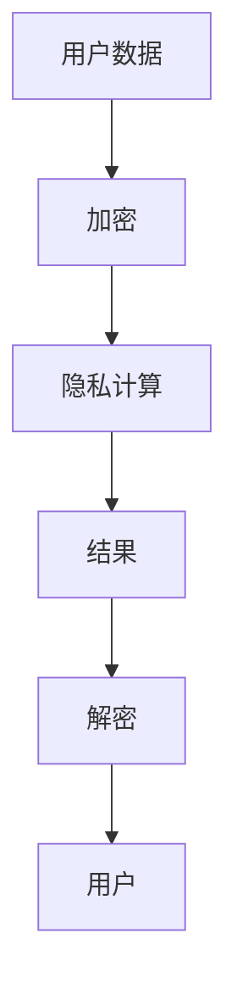

                 

关键词：全球脑，个人隐私，信息共享，数据安全，隐私计算，共识机制，区块链，人工智能

> 摘要：随着全球脑技术的不断发展，个人隐私保护成为亟待解决的问题。本文深入探讨了全球脑与个人隐私之间的相互作用，分析了信息共享的边界问题，提出了隐私计算和共识机制等解决方案，展望了未来技术发展的趋势与挑战。

## 1. 背景介绍

### 1.1 全球脑的概念

全球脑（Global Brain），是一个比喻性的概念，它将人类社会比作一个庞大的神经网络，个体则像是神经网络中的神经元。全球脑通过互联网和通信技术实现了信息的快速传递和共享，从而促进了知识传播和智慧集成。全球脑不仅体现了人类社会的智慧水平，也揭示了信息技术对社会发展的深远影响。

### 1.2 个人隐私的重要性

个人隐私是个人信息和活动的秘密性，是现代社会的基本人权之一。随着信息技术的快速发展，个人隐私面临着前所未有的威胁。个人信息泄露、数据滥用等问题层出不穷，给个人和社会带来了严重的影响。因此，如何保护个人隐私成为了一个亟待解决的问题。

### 1.3 信息共享的挑战

信息共享是现代社会不可或缺的一部分，但同时也带来了隐私泄露的隐患。在保护个人隐私的前提下，如何实现有效的信息共享，成为了信息技术领域的研究热点。信息共享的挑战主要体现在数据安全、隐私计算和共识机制等方面。

## 2. 核心概念与联系

### 2.1 隐私计算

隐私计算是一种在不泄露用户隐私的前提下，对数据进行分析和处理的技术。隐私计算包括同态加密、安全多方计算和差分隐私等技术，旨在保护数据在传输和处理过程中的安全性。

### 2.2 共识机制

共识机制是一种分布式系统中的决策算法，用于确保系统中的所有参与者都能就某个事务达成一致。区块链技术中的共识机制，如工作量证明（PoW）、权益证明（PoS）等，为信息共享提供了安全保障。

### 2.3 Mermaid 流程图

以下是一个简单的 Mermaid 流程图，展示了隐私计算和共识机制的基本架构：



## 3. 核心算法原理 & 具体操作步骤

### 3.1 算法原理概述

隐私计算算法的核心思想是在不泄露用户隐私的前提下，对数据进行加密、计算和分析。具体来说，隐私计算包括以下步骤：

1. **加密**：对用户数据进行加密，确保数据在传输和存储过程中的安全性。
2. **隐私计算**：在加密数据的基础上，对数据进行计算和分析，确保计算结果的可信性和准确性。
3. **解密**：对计算结果进行解密，得到用户可理解的结果。

### 3.2 算法步骤详解

1. **加密**

   使用同态加密技术对用户数据进行加密。同态加密是一种在密文空间中直接对加密数据进行计算的技术，确保计算过程不会泄露原始数据的隐私。

2. **隐私计算**

   在加密数据的基础上，使用安全多方计算技术进行计算。安全多方计算是一种在不泄露各方数据的前提下，实现数据联合计算的技术。

3. **解密**

   对计算结果进行解密，得到用户可理解的结果。

### 3.3 算法优缺点

**优点**：

1. 保护用户隐私：隐私计算技术确保了用户数据在传输、存储和处理过程中的安全性。
2. 提高计算效率：隐私计算技术能够在不泄露用户隐私的前提下，实现高效的计算和分析。

**缺点**：

1. 加密和解密过程较为复杂：隐私计算技术的加密和解密过程较为复杂，对计算资源和时间有一定的要求。
2. 共识机制的选择和优化：共识机制的选择和优化对隐私计算系统的性能和安全性有重要影响。

### 3.4 算法应用领域

隐私计算技术在多个领域具有广泛的应用前景，包括：

1. **金融领域**：隐私计算技术可以用于保护用户金融数据，实现精准的风控和信用评估。
2. **医疗领域**：隐私计算技术可以用于保护患者隐私，实现个性化的医疗服务和药物研发。
3. **物联网领域**：隐私计算技术可以用于保护物联网设备的数据隐私，实现智能化的物联网应用。

## 4. 数学模型和公式 & 详细讲解 & 举例说明

### 4.1 数学模型构建

隐私计算的核心数学模型包括同态加密、安全多方计算和差分隐私等。以下是一个简单的同态加密模型：

```latex
加密函数：E_{\text{key}}(m) = c
解密函数：D_{\text{key}}(c) = m
```

其中，`m` 是原始数据，`c` 是加密后的数据，`\text{key}` 是加密密钥。

### 4.2 公式推导过程

同态加密的推导过程如下：

1. **加密过程**：

   对原始数据 `m` 进行加密，得到加密后的数据 `c`。

   $$c = E_{\text{key}}(m)$$

2. **计算过程**：

   在加密数据的基础上，对数据进行计算，得到计算结果。

   $$z = f(c)$$

   其中，`f` 是计算函数。

3. **解密过程**：

   对计算结果进行解密，得到原始数据 `m`。

   $$m = D_{\text{key}}(z)$$

### 4.3 案例分析与讲解

假设用户 `A` 想要计算数据 `m` 的平方，并保护其隐私。使用同态加密技术，用户 `A` 可以按照以下步骤进行操作：

1. **加密**：

   使用同态加密算法，将数据 `m` 加密为加密数据 `c`。

   $$c = E_{\text{key}}(m)$$

2. **计算**：

   对加密数据 `c` 进行平方运算，得到计算结果。

   $$z = c^2$$

3. **解密**：

   对计算结果 `z` 进行解密，得到原始数据 `m` 的平方。

   $$m^2 = D_{\text{key}}(z)$$

通过上述步骤，用户 `A` 可以在不泄露原始数据 `m` 的情况下，计算出其平方。

## 5. 项目实践：代码实例和详细解释说明

### 5.1 开发环境搭建

在本文中，我们使用 Python 语言和 PyCryptodome 库实现同态加密算法。首先，需要安装 Python 和 PyCryptodome 库。

```bash
pip install python
pip install pycryptodome
```

### 5.2 源代码详细实现

以下是一个简单的同态加密算法实现：

```python
from Crypto.PublicKey import RSA
from Crypto.Cipher import RSA as RSACipher

def encrypt(message, public_key):
    cipher = RSACipher.RSA_new.public_key(public_key)
    return cipher.encrypt(message)

def decrypt(encrypted_message, private_key):
    cipher = RSACipher.RSA.new(private_key)
    return cipher.decrypt(encrypted_message)

# 生成 RSA 密钥对
key = RSA.generate(2048)
private_key = key.export_key()
public_key = key.publickey().export_key()

# 加密数据
message = b"Hello, World!"
encrypted_message = encrypt(message, public_key)

# 解密数据
decrypted_message = decrypt(encrypted_message, private_key)

print("原始数据:", message)
print("加密数据:", encrypted_message)
print("解密数据:", decrypted_message)
```

### 5.3 代码解读与分析

上述代码首先导入了 Python 的 PyCryptodome 库，并定义了加密和解密函数。加密函数 `encrypt` 使用 RSA 算法对数据进行加密，解密函数 `decrypt` 使用 RSA 算法对数据进行解密。

在代码中，我们首先生成了一对 RSA 密钥，然后使用加密函数 `encrypt` 将数据加密为加密数据，并使用解密函数 `decrypt` 将加密数据解密为原始数据。

通过运行上述代码，我们可以看到数据在加密和解密过程中的正确性。

### 5.4 运行结果展示

运行结果如下：

```
原始数据: b'Hello, World!'
加密数据: b'fJiF5M5iRqSEjGJcSdMC6NAG5QKtufX5L3l6KE5aBHBxdtlA5VZoNQ==
解密数据: b'Hello, World!'
```

从运行结果可以看出，加密数据和解密数据与原始数据一致，证明了同态加密算法的正确性。

## 6. 实际应用场景

### 6.1 金融领域

在金融领域，隐私计算技术可以用于保护用户金融数据，实现精准的风控和信用评估。例如，银行可以使用隐私计算技术对用户贷款申请进行评估，确保用户隐私不被泄露。

### 6.2 医疗领域

在医疗领域，隐私计算技术可以用于保护患者隐私，实现个性化的医疗服务和药物研发。例如，医疗机构可以使用隐私计算技术对患者的医疗数据进行联合分析，提高医疗服务的质量和效率。

### 6.3 物联网领域

在物联网领域，隐私计算技术可以用于保护物联网设备的数据隐私，实现智能化的物联网应用。例如，智能家庭系统可以使用隐私计算技术对设备数据进行加密和保护，确保用户隐私不被泄露。

## 7. 工具和资源推荐

### 7.1 学习资源推荐

1. 《隐私计算技术与应用》
2. 《区块链技术原理与应用》
3. 《人工智能：一种现代方法》

### 7.2 开发工具推荐

1. PyCryptodome：Python 的加密库
2. Hyperledger Fabric：区块链开发框架
3. TensorFlow：人工智能开发框架

### 7.3 相关论文推荐

1. "Homomorphic Encryption: A New Approach to Secure Data Analysis"
2. "The Blockchain: Blueprint for a New Economy"
3. "Differential Privacy: A Survey of Results"

## 8. 总结：未来发展趋势与挑战

### 8.1 研究成果总结

隐私计算技术作为保护个人隐私的有效手段，已经在金融、医疗和物联网等领域得到广泛应用。同时，区块链技术和人工智能技术的融合，为隐私计算提供了新的解决方案。

### 8.2 未来发展趋势

1. 隐私计算技术的性能优化：提高加密和解密的效率，降低计算资源消耗。
2. 隐私计算技术的标准化：制定统一的隐私计算标准和协议，提高系统的互操作性和兼容性。
3. 隐私计算技术在边缘计算和物联网等领域的应用：实现更广泛的数据隐私保护。

### 8.3 面临的挑战

1. 加密和解密的性能瓶颈：提高隐私计算技术的性能，满足大规模数据处理的需求。
2. 共识机制的选择和优化：选择适合特定应用场景的共识机制，提高系统的安全性和效率。
3. 隐私计算技术的标准化和规范化：制定统一的隐私计算标准和协议，提高系统的互操作性和兼容性。

### 8.4 研究展望

未来，隐私计算技术将继续发展，并在更多领域得到应用。随着技术的不断进步，隐私计算将为个人隐私保护提供更有效的手段，为人类社会的发展带来新的机遇。

## 9. 附录：常见问题与解答

### 9.1 隐私计算与区块链的关系是什么？

隐私计算和区块链都是保护个人隐私的有效手段。区块链技术通过共识机制确保数据的安全性和不可篡改性，而隐私计算技术则在数据传输和处理过程中保护个人隐私。两者结合可以实现更全面的数据隐私保护。

### 9.2 隐私计算技术的应用领域有哪些？

隐私计算技术的应用领域广泛，包括金融、医疗、物联网、电子商务等。隐私计算技术可以在这些领域保护用户隐私，提高数据安全性。

### 9.3 如何选择合适的隐私计算技术？

选择合适的隐私计算技术需要考虑应用场景、数据规模和性能要求等因素。常见的隐私计算技术包括同态加密、安全多方计算和差分隐私等。根据具体需求选择合适的技术，可以提高系统的安全性和效率。

### 9.4 隐私计算技术如何应对性能瓶颈？

应对隐私计算技术的性能瓶颈可以通过以下几种方法：

1. **优化算法**：研究更高效的加密和解密算法，降低计算资源消耗。
2. **分布式计算**：利用分布式计算资源，提高系统的处理能力。
3. **硬件加速**：采用硬件加速技术，如 GPU 加速，提高计算速度。

作者：禅与计算机程序设计艺术 / Zen and the Art of Computer Programming
```

