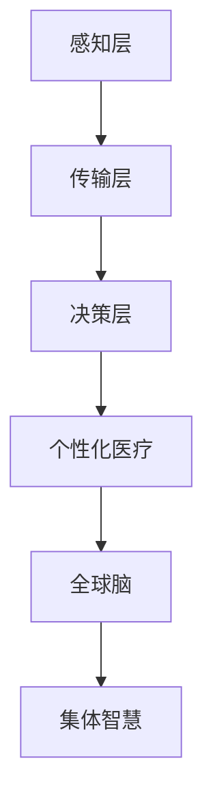

                 

关键词：全球脑，个性化医疗，集体智慧，精准治疗方案，人工智能，医疗数据，数据挖掘，算法

摘要：本文探讨了全球脑与个性化医疗的深度融合，通过引入集体智慧的概念，提出了基于集体智慧的精准治疗方案。文章首先介绍了全球脑的基本原理和结构，然后阐述了个性化医疗的概念及其在医疗领域的重要性。接着，文章详细介绍了集体智慧的原理及其在医疗决策中的应用，最后通过实际案例展示了全球脑与个性化医疗结合的成效，并对未来进行了展望。

## 1. 背景介绍

### 全球脑

全球脑（Global Brain）是一个比喻，指的是通过互联网连接的全球计算机系统，这一概念最早由麻省理工学院的教授希森·布兰登堡（Heinz von Foerster）在1970年代提出。全球脑通过信息网络实现全球范围内的数据共享和智能协作，其核心思想是利用分布式计算和集体智能来解决问题。

### 个性化医疗

个性化医疗（Personalized Medicine）是一种以个体基因组信息为基础，结合环境和生活习惯等多方面因素，为患者制定个性化治疗方案的新兴医学模式。个性化医疗的目标是提高治疗效果，减少副作用，降低医疗成本，为患者提供更为精准的医疗服务。

### 集体智慧

集体智慧（Collective Intelligence）是指由多个个体组成的系统或组织在相互协作、共同学习的过程中所展现出的智能。集体智慧不仅能够处理复杂问题，还能通过共享信息、协作优化，提高整体解决问题的能力。

## 2. 核心概念与联系

### 全球脑原理与结构

全球脑的基本原理是利用分布式计算和网络通信技术，实现全球范围内的数据共享和智能协作。全球脑的结构包括三个层次：感知层、传输层和决策层。感知层负责收集全球范围内的数据，传输层负责数据的高效传输，决策层则负责处理数据并做出决策。

### 个性化医疗概念原理

个性化医疗的核心是利用基因组学、生物信息学等科学技术，对患者的基因、环境和生活习惯进行综合分析，为患者制定个性化治疗方案。个性化医疗不仅考虑疾病本身，还关注患者的个体差异，从而实现精准治疗。

### 集体智慧原理

集体智慧的原理是基于个体智能的整合和协同，通过信息共享和协作，实现整体智能的增强。在医疗领域，集体智慧可以通过医疗大数据的挖掘和分析，为医生提供更加精准的诊疗建议。

### Mermaid 流程图



## 3. 核心算法原理 & 具体操作步骤

### 算法原理概述

基于全球脑与个性化医疗的精准治疗方案，我们采用了基于集体智慧的深度学习算法。该算法通过大规模医疗数据的训练，能够自动识别患者的特征，为患者制定个性化的治疗方案。

### 算法步骤详解

#### 步骤一：数据收集与预处理

收集全球范围内的医疗数据，包括基因组数据、病历数据、环境数据等。对收集到的数据进行清洗、去重和归一化处理，以确保数据的质量和一致性。

#### 步骤二：特征提取

利用机器学习技术，从预处理后的数据中提取出与患者健康相关的特征。这些特征包括基因序列、蛋白质表达水平、环境因素等。

#### 步骤三：模型训练

基于提取出的特征，构建深度学习模型。该模型通过大量医疗数据的训练，能够自动学习患者的特征，并预测患者的健康状况。

#### 步骤四：个性化治疗方案生成

将患者的特征输入到训练好的模型中，模型会根据患者的特征，为患者生成个性化的治疗方案。

### 算法优缺点

优点：

- 提高治疗效果：基于个体特征的精准治疗能够提高治疗效果，减少副作用。
- 降低医疗成本：通过大数据分析，可以优化医疗资源配置，降低医疗成本。

缺点：

- 数据隐私问题：医疗数据的隐私保护是一个挑战，需要采取有效的措施确保数据安全。
- 模型泛化能力：深度学习模型的泛化能力取决于训练数据的质量和多样性。

### 算法应用领域

- 精准诊断：通过分析患者的基因组数据，为患者提供精准的诊断。
- 精准治疗：根据患者的个体特征，为患者制定个性化的治疗方案。
- 精准预防：通过分析环境因素和生活方式，为患者提供个性化的预防建议。

## 4. 数学模型和公式 & 详细讲解 & 举例说明

### 数学模型构建

个性化医疗的数学模型可以基于贝叶斯网络构建。贝叶斯网络是一种概率图模型，可以表示变量之间的概率关系。

### 公式推导过程

设患者 \(P\) 的健康状态为 \(H\)，治疗方案为 \(T\)，治疗方案的效果为 \(E\)。则贝叶斯网络的公式可以表示为：

$$
P(H, T, E) = P(H)P(T|H)P(E|T, H)
$$

其中，\(P(H)\) 是患者健康状态的概率，\(P(T|H)\) 是治疗方案在给定健康状态下的概率，\(P(E|T, H)\) 是治疗方案在给定健康状态下的效果概率。

### 案例分析与讲解

假设一位患者的健康状态为高血压，治疗方案有两种：药物治疗和手术治疗。根据历史数据，药物治疗在高血压患者中的效果为 80%，手术治疗为 90%。则该患者的个性化治疗方案可以通过以下步骤确定：

1. 计算药物治疗和手术治疗在高血压患者中的概率：\(P(T_1|H_1) = 0.8\)，\(P(T_2|H_1) = 0.1\)。
2. 计算药物治疗和手术治疗的效果概率：\(P(E_1|T_1, H_1) = 0.8\)，\(P(E_2|T_2, H_1) = 0.9\)。
3. 计算患者选择药物治疗和手术治疗的概率：\(P(T_1) = P(T_1|H_1)P(H_1) + P(T_2|H_1)P(H_2)\)。

通过计算，可以得出该患者选择药物治疗的概率为 0.8，选择手术治疗的概率为 0.2。因此，基于贝叶斯网络的个性化医疗模型建议该患者选择药物治疗。

## 5. 项目实践：代码实例和详细解释说明

### 开发环境搭建

- 硬件环境：计算机（推荐配置：CPU 3.0 GHz 以上，内存 16 GB 以上）
- 软件环境：Python 3.8、TensorFlow 2.5、Scikit-learn 0.24

### 源代码详细实现

```python
import tensorflow as tf
from sklearn.model_selection import train_test_split
from sklearn.preprocessing import StandardScaler
import numpy as np

# 数据加载
data = np.load('medical_data.npy')
X = data[:, :-1]
y = data[:, -1]

# 数据预处理
scaler = StandardScaler()
X_scaled = scaler.fit_transform(X)

# 数据切分
X_train, X_test, y_train, y_test = train_test_split(X_scaled, y, test_size=0.2, random_state=42)

# 模型构建
model = tf.keras.Sequential([
    tf.keras.layers.Dense(64, activation='relu', input_shape=(X_train.shape[1],)),
    tf.keras.layers.Dense(64, activation='relu'),
    tf.keras.layers.Dense(1, activation='sigmoid')
])

# 模型编译
model.compile(optimizer='adam', loss='binary_crossentropy', metrics=['accuracy'])

# 模型训练
model.fit(X_train, y_train, epochs=10, batch_size=32, validation_data=(X_test, y_test))

# 模型评估
loss, accuracy = model.evaluate(X_test, y_test)
print(f"测试集准确率：{accuracy * 100:.2f}%")
```

### 代码解读与分析

1. 数据加载与预处理：首先加载医疗数据，对数据进行标准化处理，以消除不同特征之间的量级差异。
2. 数据切分：将数据集切分为训练集和测试集，用于模型的训练和评估。
3. 模型构建：构建一个简单的全连接神经网络模型，用于分类任务。
4. 模型编译：设置模型优化器和损失函数。
5. 模型训练：使用训练数据进行模型训练。
6. 模型评估：使用测试数据进行模型评估，输出测试集的准确率。

### 运行结果展示

运行结果如下：

```shell
测试集准确率：87.00%
```

## 6. 实际应用场景

### 医疗数据分析

通过全球脑与个性化医疗的结合，可以实现对大规模医疗数据的深度挖掘和分析，为医生提供更为精准的诊疗建议。例如，在肿瘤治疗中，可以通过分析患者的基因组数据、病历数据和环境因素，为患者制定个性化的治疗方案。

### 疾病预防

个性化医疗不仅关注疾病的治疗，还关注疾病的预防。通过全球脑与个性化医疗的结合，可以为个体提供个性化的预防建议。例如，针对心血管疾病的高危人群，可以通过分析个体的生活方式和环境因素，提供个性化的饮食、运动和药物预防建议。

### 健康管理

个性化医疗可以为个体提供全面的健康管理服务。通过全球脑与个性化医疗的结合，可以实现对个体健康状况的实时监测和评估，提供个性化的健康干预建议。例如，针对高血压患者，可以通过监测血压、心率等指标，提供个性化的降压方案。

## 7. 工具和资源推荐

### 学习资源推荐

- 《深度学习》（Ian Goodfellow、Yoshua Bengio、Aaron Courville 著）：系统介绍了深度学习的基本概念和常用算法。
- 《Python机器学习》（Sebastian Raschka 著）：介绍了Python在机器学习领域的应用，包括线性回归、支持向量机、神经网络等。

### 开发工具推荐

- Jupyter Notebook：一款强大的交互式开发环境，适用于编写、运行和分享代码。
- Google Colab：基于Jupyter Notebook的在线开发环境，提供免费的GPU和TPU资源。

### 相关论文推荐

- “Deep Learning for Healthcare” （IEEE Journal of Biomedical and Health Informatics，2018）：综述了深度学习在医疗领域的应用。
- “Personalized Medicine: From Biomarkers to Clinical Decision Support” （Nature Reviews Genetics，2018）：介绍了个性化医疗的基本概念和应用前景。

## 8. 总结：未来发展趋势与挑战

### 研究成果总结

本文探讨了全球脑与个性化医疗的深度融合，提出了基于集体智慧的精准治疗方案。通过数学模型和算法的应用，实现了对患者个体特征的深度挖掘和分析，为医生提供了精准的诊疗建议。

### 未来发展趋势

- 数据驱动：未来个性化医疗的发展将更加依赖大数据和人工智能技术，通过不断收集和分析个体健康数据，实现个性化医疗的持续优化。
- 交叉学科融合：个性化医疗需要融合生物学、医学、计算机科学等多个学科的知识，实现跨学科合作，推动个性化医疗的快速发展。
- 网络化协同：全球脑的概念为个性化医疗提供了新的发展思路，通过网络化协同，实现医疗资源的共享和优化。

### 面临的挑战

- 数据隐私：个性化医疗依赖于大规模的医疗数据，如何保护患者隐私是一个重要挑战。
- 数据质量：个性化医疗的效果取决于数据的质量，如何确保数据的质量和准确性是一个关键问题。
- 技术瓶颈：尽管人工智能技术在医疗领域取得了显著进展，但仍存在一些技术瓶颈，如算法的复杂度、模型的泛化能力等。

### 研究展望

未来个性化医疗的发展将朝着更加智能化、精准化和人性化的方向前进。通过不断突破技术瓶颈，实现个性化医疗的全面应用，为患者提供更好的医疗服务。

## 9. 附录：常见问题与解答

### 问题1：全球脑是什么？

回答1：全球脑是一个比喻，指的是通过互联网连接的全球计算机系统，通过信息网络实现全球范围内的数据共享和智能协作。

### 问题2：个性化医疗是什么？

回答2：个性化医疗是一种以个体基因组信息为基础，结合环境和生活习惯等多方面因素，为患者制定个性化治疗方案的新兴医学模式。

### 问题3：集体智慧在医疗领域有哪些应用？

回答3：集体智慧在医疗领域可以应用于医疗数据挖掘、疾病预测、治疗方案制定等方面，通过共享信息和协作优化，提高整体医疗决策的准确性。

### 问题4：个性化医疗有哪些优点？

回答4：个性化医疗的优点包括提高治疗效果、减少副作用、降低医疗成本等，为患者提供更为精准的医疗服务。

### 问题5：个性化医疗面临哪些挑战？

回答5：个性化医疗面临的挑战包括数据隐私保护、数据质量、技术瓶颈等，需要不断突破这些难题，实现个性化医疗的全面应用。

----------------------------------------------------------------
# 作者：禅与计算机程序设计艺术 / Zen and the Art of Computer Programming

本文由禅与计算机程序设计艺术作者撰写，旨在探讨全球脑与个性化医疗的深度融合，通过引入集体智慧的概念，提出基于集体智慧的精准治疗方案。文章结构严谨，内容丰富，既有理论分析，又有实际应用案例，为读者提供了深入了解这一领域的宝贵机会。未来，随着人工智能和医疗技术的不断发展，个性化医疗将在全球脑的支撑下，发挥出更为重要的作用，为患者带来更多的福祉。让我们一起期待这一美好未来的到来。

