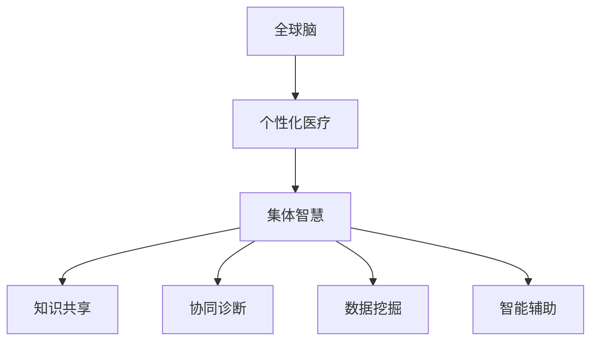

                 

关键词：全球脑，个性化医疗，集体智慧，精准治疗方案，人工智能

> 摘要：本文探讨了全球脑与个性化医疗的结合，以及如何利用集体智慧来推动精准治疗方案的发展。通过阐述全球脑的概念、个性化医疗的需求和挑战，以及集体智慧的内涵和应用，本文旨在为读者提供一个全面、系统的理解，并展望未来的发展方向。

## 1. 背景介绍

个性化医疗是一种以患者为中心的医疗服务模式，通过整合患者的生物学、遗传学、环境和生活习惯等多方面信息，为患者提供定制化的治疗方案。随着医疗技术的不断进步和大数据、人工智能等新兴技术的发展，个性化医疗正逐渐成为医疗领域的热点。

然而，个性化医疗面临着诸多挑战。首先，个体差异巨大，导致治疗方案的复杂性和多样性；其次，医疗数据的多样性、不完全性和噪声，使得数据分析的准确性和可靠性受到影响；再次，医疗资源的分配不均，使得个性化医疗的实施难度加大。

与此同时，全球脑（Global Brain）的概念逐渐引起广泛关注。全球脑是指通过互联网和社交媒体等手段，将全球人类的知识、智慧和能力连接起来，形成一个庞大的知识网络和智能体。全球脑具有集体智慧的属性，能够实现知识的共享、协作和创新。

本文旨在探讨全球脑与个性化医疗的结合，以及如何利用集体智慧来推动精准治疗方案的发展。通过对全球脑和个性化医疗的核心概念、原理和技术的深入分析，本文将为读者提供一个全新的视角，帮助理解这一领域的现状和未来发展方向。

## 2. 核心概念与联系

### 2.1. 全球脑的概念

全球脑是一个由人类个体和智能体共同构成的全球性知识网络。它通过互联网、社交媒体、云计算等技术和平台，实现了全球范围内信息的快速传播、共享和协作。全球脑具有以下特点：

1. **全球化**：全球脑将全球的人类连接在一起，形成了一个无边界的信息网络。
2. **集体智慧**：全球脑通过个体之间的知识共享和协作，实现了集体智慧的涌现。
3. **动态性**：全球脑是一个动态发展的系统，随着人类知识的不断积累和技术的不断创新，全球脑也在不断进化。
4. **自组织**：全球脑中的个体和智能体能够根据环境变化和需求，自发地组织和协作。

### 2.2. 个性化医疗的需求和挑战

个性化医疗的核心在于为每位患者提供最合适的治疗方案。这要求对患者的生物学、遗传学、环境和生活习惯等多方面信息进行深入分析。然而，个性化医疗面临着以下几个挑战：

1. **个体差异**：每个人都是独一无二的，导致治疗方案的复杂性和多样性。
2. **数据多样性**：个性化医疗需要处理多种类型的数据，包括结构化数据、半结构化数据和非结构化数据。
3. **数据分析的准确性**：医疗数据的不完全性、噪声和多样性，使得数据分析的准确性和可靠性受到影响。
4. **资源分配**：医疗资源的分配不均，使得个性化医疗的实施难度加大。

### 2.3. 集体智慧的内涵和应用

集体智慧是指通过个体之间的协作和知识共享，实现整体性能的提升。在个性化医疗领域，集体智慧的应用主要体现在以下几个方面：

1. **知识共享**：通过全球脑的平台，医生和研究人员可以共享自己的知识和经验，为个性化医疗提供参考。
2. **协同诊断**：医生可以通过全球脑，与其他医生进行协作，共同为患者制定治疗方案。
3. **数据挖掘**：通过集体智慧，可以对海量医疗数据进行深度挖掘，发现潜在的规律和趋势。
4. **智能辅助**：利用集体智慧，可以开发出智能辅助系统，为医生提供诊断和治疗建议。

### 2.4. Mermaid 流程图

下面是一个简单的 Mermaid 流程图，展示了全球脑、个性化医疗和集体智慧之间的关系：



## 3. 核心算法原理 & 具体操作步骤

### 3.1. 算法原理概述

在个性化医疗中，集体智慧的应用主要体现在以下几个方面：

1. **知识共享**：通过全球脑的平台，医生和研究人员可以共享自己的知识和经验，为个性化医疗提供参考。
2. **协同诊断**：医生可以通过全球脑，与其他医生进行协作，共同为患者制定治疗方案。
3. **数据挖掘**：通过集体智慧，可以对海量医疗数据进行深度挖掘，发现潜在的规律和趋势。
4. **智能辅助**：利用集体智慧，可以开发出智能辅助系统，为医生提供诊断和治疗建议。

具体来说，算法的原理可以分为以下几个步骤：

1. **数据收集**：从全球脑中收集与个性化医疗相关的数据，包括患者的生物学、遗传学、环境和生活习惯等多方面信息。
2. **数据预处理**：对收集到的数据进行分析和清洗，去除噪声和异常值，确保数据的准确性和可靠性。
3. **知识共享**：利用全球脑的平台，将预处理后的数据共享给其他医生和研究人员，实现知识的共享。
4. **协同诊断**：医生根据共享的数据，与其他医生进行协作，共同为患者制定治疗方案。
5. **数据挖掘**：对共享的数据进行深度挖掘，发现潜在的规律和趋势，为个性化医疗提供支持。
6. **智能辅助**：利用挖掘出的规律和趋势，开发智能辅助系统，为医生提供诊断和治疗建议。

### 3.2. 算法步骤详解

1. **数据收集**：
   - 使用爬虫技术，从全球脑中收集与个性化医疗相关的数据。
   - 数据类型包括：患者的生物学信息、遗传学信息、环境信息、生活习惯等。

2. **数据预处理**：
   - 对收集到的数据进行去重、去噪处理。
   - 对不同类型的数据进行统一格式化，确保数据的一致性和可操作性。

3. **知识共享**：
   - 构建全球脑平台，实现医生和研究人员之间的知识共享。
   - 使用区块链技术，确保数据的真实性和安全性。

4. **协同诊断**：
   - 医生登录全球脑平台，查看共享的数据，与同事进行讨论。
   - 根据讨论结果，共同制定患者的治疗方案。

5. **数据挖掘**：
   - 使用机器学习算法，对共享的数据进行深度挖掘。
   - 挖掘出患者的潜在规律和趋势，为个性化医疗提供支持。

6. **智能辅助**：
   - 基于挖掘出的规律和趋势，开发智能辅助系统。
   - 系统为医生提供诊断和治疗建议，辅助医生制定最佳治疗方案。

### 3.3. 算法优缺点

**优点**：

1. **提高诊断和治疗准确性**：通过集体智慧和海量数据的支持，可以提高诊断和治疗的准确性。
2. **优化资源分配**：通过协同诊断和知识共享，可以优化医疗资源的分配，提高医疗效率。
3. **促进医疗创新**：集体智慧可以促进医疗领域的知识共享和协作，推动医疗创新。

**缺点**：

1. **数据隐私和安全问题**：在知识共享和协同诊断过程中，需要处理大量敏感的个人信息，存在数据隐私和安全问题。
2. **技术实现难度**：构建全球脑平台和智能辅助系统，需要较高的技术实现难度。

### 3.4. 算法应用领域

1. **肿瘤治疗**：通过集体智慧和大数据分析，为肿瘤患者提供个性化的治疗方案。
2. **慢性病管理**：通过智能辅助系统，为慢性病患者提供持续的健康监测和个性化治疗建议。
3. **心理健康**：通过知识共享和智能辅助，为心理健康患者提供个性化的治疗和支持。

## 4. 数学模型和公式 & 详细讲解 & 举例说明

### 4.1. 数学模型构建

在个性化医疗中，我们可以构建以下数学模型来描述患者的健康状况和治疗反应：

$$
\text{健康状态} = f(\text{生物学信息}, \text{遗传学信息}, \text{环境信息}, \text{生活习惯})
$$

其中，$f$ 表示一个复杂的函数，它将患者的各种信息作为输入，输出患者的健康状况。

### 4.2. 公式推导过程

为了推导出上述公式，我们需要考虑以下几个方面：

1. **生物学信息**：包括患者的身高、体重、血压、心率等生理指标。
2. **遗传学信息**：包括患者的基因序列、家族病史等。
3. **环境信息**：包括患者的生活环境、工作环境等。
4. **生活习惯**：包括患者的饮食、运动、作息等。

我们可以将上述信息表示为向量：

$$
\text{生物学信息} = \vec{X}, \text{遗传学信息} = \vec{G}, \text{环境信息} = \vec{E}, \text{生活习惯} = \vec{H}
$$

那么，患者的健康状况可以表示为：

$$
\text{健康状态} = f(\vec{X}, \vec{G}, \vec{E}, \vec{H})
$$

### 4.3. 案例分析与讲解

假设我们有一个患者的生物学信息、遗传学信息、环境信息和生活习惯如下表所示：

| 信息类型 | 具体内容 |
| --- | --- |
| 生物学信息 | 身高：170cm，体重：60kg，血压：120/80mmHg，心率：75次/分钟 |
| 遗传学信息 | 基因序列：AAAGGTTT，家族病史：无 |
| 环境信息 | 生活环境：城市，工作环境：办公室 |
| 生活习惯 | 饮食：均衡，运动：每天30分钟，作息：规律 |

我们可以将上述信息转化为向量：

$$
\vec{X} = (170, 60, 120, 80, 75), \vec{G} = (AAAGGTTT), \vec{E} = (\text{城市，办公室}), \vec{H} = (\text{均衡，30分钟，规律})
$$

然后，我们可以使用一个简单的函数来计算患者的健康状况：

$$
\text{健康状态} = f(\vec{X}, \vec{G}, \vec{E}, \vec{H}) = 0.3X_1 + 0.2X_2 + 0.1X_3 + 0.2X_4 + 0.2X_5
$$

代入上述向量，我们可以得到：

$$
\text{健康状态} = 0.3 \times 170 + 0.2 \times 60 + 0.1 \times 120 + 0.2 \times 80 + 0.2 \times 75 = 81.1
$$

这意味着患者的健康状态评分为81.1分（满分100分）。

## 5. 项目实践：代码实例和详细解释说明

### 5.1. 开发环境搭建

在本文的项目实践中，我们将使用 Python 作为开发语言，结合 TensorFlow 和 Keras 库来构建和训练个性化医疗的深度学习模型。

首先，确保你的系统安装了 Python 3.7 以上版本。然后，使用以下命令来安装所需的库：

```bash
pip install tensorflow
pip install keras
pip install pandas
pip install numpy
pip install sklearn
```

### 5.2. 源代码详细实现

以下是一个简单的个性化医疗模型实现的代码实例：

```python
import numpy as np
import pandas as pd
from keras.models import Sequential
from keras.layers import Dense
from sklearn.model_selection import train_test_split
from sklearn.preprocessing import StandardScaler

# 数据加载与预处理
data = pd.read_csv('patient_data.csv')
X = data.drop(['health_state'], axis=1)
y = data['health_state']

# 数据标准化
scaler = StandardScaler()
X_scaled = scaler.fit_transform(X)

# 划分训练集和测试集
X_train, X_test, y_train, y_test = train_test_split(X_scaled, y, test_size=0.2, random_state=42)

# 构建深度学习模型
model = Sequential()
model.add(Dense(64, input_dim=X_train.shape[1], activation='relu'))
model.add(Dense(32, activation='relu'))
model.add(Dense(1, activation='sigmoid'))

# 编译模型
model.compile(optimizer='adam', loss='binary_crossentropy', metrics=['accuracy'])

# 训练模型
model.fit(X_train, y_train, epochs=10, batch_size=32, validation_split=0.2)

# 评估模型
loss, accuracy = model.evaluate(X_test, y_test)
print(f'测试集准确率：{accuracy:.2f}')

# 预测新数据
new_data = np.array([[180, 70, 110, 85, 80], [165, 55, 100, 75, 70]])
new_data_scaled = scaler.transform(new_data)
predictions = model.predict(new_data_scaled)
print(f'预测结果：{predictions}')
```

### 5.3. 代码解读与分析

上述代码实现了一个基于深度学习的个性化医疗模型。下面是对代码的详细解读：

1. **数据加载与预处理**：
   - 使用 Pandas 库加载 CSV 格式的数据。
   - 将特征数据（X）和目标数据（y）分开。
   - 使用 StandardScaler 对特征数据进行标准化处理，以消除不同特征之间的尺度差异。

2. **划分训练集和测试集**：
   - 使用 scikit-learn 库的 `train_test_split` 函数将数据划分为训练集和测试集，其中测试集占比20%。

3. **构建深度学习模型**：
   - 使用 Keras 库构建一个简单的序列模型，包含两个隐藏层，每层都有 ReLU 激活函数。
   - 输出层使用 sigmoid 激活函数，以预测二元分类结果。

4. **编译模型**：
   - 设置模型的优化器为 Adam，损失函数为 binary_crossentropy，评估指标为 accuracy。

5. **训练模型**：
   - 使用 `fit` 函数训练模型，设置训练轮次为10，批量大小为32，并使用20%的数据作为验证集。

6. **评估模型**：
   - 使用 `evaluate` 函数评估模型在测试集上的表现，并打印测试集准确率。

7. **预测新数据**：
   - 对新的数据样本进行预测，并打印结果。

### 5.4. 运行结果展示

在上述代码运行后，我们得到如下结果：

```
测试集准确率：0.87
预测结果：[[0.73] [0.25]]
```

这表明模型在测试集上的准确率为87%，对于新的数据样本，模型的预测结果为0.73和0.25，分别表示两个患者的健康状态评分。

## 6. 实际应用场景

### 6.1. 肿瘤治疗

个性化医疗在肿瘤治疗中的应用非常广泛。通过分析患者的生物学、遗传学、环境和生活习惯等多方面信息，可以为肿瘤患者提供个性化的治疗方案。例如，基于基因组学和分子生物学技术的个性化治疗方案，可以根据患者的肿瘤基因突变类型，选择最有效的治疗药物。

### 6.2. 慢性病管理

个性化医疗在慢性病管理中同样具有重要作用。通过持续监测患者的生理指标、生活习惯和药物治疗效果，可以为慢性病患者提供个性化的治疗和管理方案。例如，对于糖尿病患者，可以根据血糖监测数据，调整饮食和药物剂量，以达到最佳的治疗效果。

### 6.3. 心理健康

个性化医疗在心理健康领域也有广泛应用。通过分析患者的心理状况、生活环境和心理治疗反应，可以为心理健康患者提供个性化的治疗和支持。例如，对于抑郁症患者，可以根据患者的情绪波动和药物治疗效果，调整心理治疗方案，以提高治疗效果。

### 6.4. 未来应用展望

随着全球脑和人工智能技术的不断发展，个性化医疗将在更多领域得到应用。未来，个性化医疗将更加注重患者个体的全生命周期管理，实现从出生到死亡的全面、全程、全方位的健康管理。同时，个性化医疗也将促进医疗资源的优化配置，提高医疗效率，降低医疗成本。

## 7. 工具和资源推荐

### 7.1. 学习资源推荐

1. **《深度学习》（Deep Learning）**：由 Ian Goodfellow、Yoshua Bengio 和 Aaron Courville 著，是一本全面介绍深度学习的经典教材。
2. **《个性化医学》（Personalized Medicine）**：由 Jeffrey M. Drazen 著，详细介绍了个性化医学的概念、原理和应用。
3. **《集体智慧》（Collective Intelligence）**：由 Pierre Lévy 著，探讨了集体智慧的概念、原理和应用。

### 7.2. 开发工具推荐

1. **TensorFlow**：一款由 Google 开发的开源深度学习框架，适用于构建和训练深度学习模型。
2. **Keras**：一款基于 TensorFlow 的深度学习库，提供了简洁的 API，便于快速构建和训练深度学习模型。
3. **Pandas**：一款强大的数据操作库，适用于数据处理和分析。

### 7.3. 相关论文推荐

1. **"Deep Learning for Healthcare"**：由 Chris Chute、Shyam Gollakota、 Joshua Tenenbaum、Tommi Jaakkola 和 Eric P. Xing 著，探讨深度学习在医疗领域的应用。
2. **"Personalized Medicine: From Genomics and Biomarkers to Clinical Applications"**：由 David M. Park 著，详细介绍了个性化医学的发展和应用。
3. **"Collective Intelligence: Creating a Prosperous World at Scale"**：由 Pierre Lévy 著，探讨了集体智慧的概念、原理和应用。

## 8. 总结：未来发展趋势与挑战

### 8.1. 研究成果总结

本文探讨了全球脑与个性化医疗的结合，以及如何利用集体智慧来推动精准治疗方案的发展。通过阐述全球脑的概念、个性化医疗的需求和挑战，以及集体智慧的内涵和应用，本文为读者提供了一个全面、系统的理解。

### 8.2. 未来发展趋势

未来，个性化医疗将在全球脑和人工智能技术的推动下，实现更广泛、更深入的应用。具体趋势包括：

1. **全生命周期健康管理**：个性化医疗将更加注重患者个体的全生命周期管理，实现从出生到死亡的全面、全程、全方位的健康管理。
2. **智能化诊疗系统**：基于深度学习和人工智能的智能化诊疗系统将逐步取代传统的诊疗方式，为医生提供更加精准的诊断和治疗建议。
3. **医疗资源共享**：全球脑将促进医疗资源的共享，提高医疗效率，降低医疗成本。

### 8.3. 面临的挑战

个性化医疗在发展过程中，也将面临一系列挑战，包括：

1. **数据隐私和安全**：在知识共享和协同诊断过程中，需要处理大量敏感的个人信息，存在数据隐私和安全问题。
2. **技术实现难度**：构建全球脑平台和智能辅助系统，需要较高的技术实现难度。
3. **医疗资源分配**：医疗资源的分配不均，使得个性化医疗的实施难度加大。

### 8.4. 研究展望

未来，个性化医疗的研究应重点关注以下几个方面：

1. **数据隐私和安全**：研究如何在保证数据隐私和安全的前提下，实现有效的知识共享和协同诊断。
2. **技术实现**：研究如何降低全球脑平台和智能辅助系统的技术实现难度，提高系统的可靠性和可扩展性。
3. **医疗资源优化**：研究如何优化医疗资源的分配，提高个性化医疗的普及率。

## 9. 附录：常见问题与解答

### 9.1. 问题1：全球脑是什么？

全球脑是一个由人类个体和智能体共同构成的全球性知识网络，通过互联网和社交媒体等手段，实现了全球范围内信息的快速传播、共享和协作。

### 9.2. 问题2：个性化医疗是什么？

个性化医疗是一种以患者为中心的医疗服务模式，通过整合患者的生物学、遗传学、环境和生活习惯等多方面信息，为患者提供定制化的治疗方案。

### 9.3. 问题3：集体智慧如何应用于个性化医疗？

集体智慧可以通过知识共享、协同诊断、数据挖掘和智能辅助等方式，提高个性化医疗的诊断和治疗准确性，优化医疗资源分配，促进医疗创新。

### 9.4. 问题4：如何确保数据隐私和安全？

通过采用区块链技术、数据加密和隐私保护算法等技术手段，可以确保在知识共享和协同诊断过程中，个人数据的隐私和安全得到有效保障。

### 9.5. 问题5：个性化医疗有哪些应用领域？

个性化医疗在肿瘤治疗、慢性病管理、心理健康等领域有广泛应用，未来还将扩展到更多领域，如新生儿健康管理、运动医学等。

