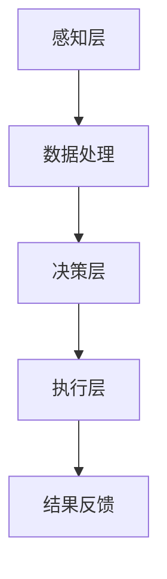

                 

关键词：全球脑、集体智慧、民主决策、人工智能、技术进步、全球政治、分布式系统、数据隐私、算法透明性。

摘要：本文探讨了全球脑的概念及其在政治决策中的应用，强调了集体智慧在民主制度中的重要性。随着人工智能和技术的进步，全球脑作为一种分布式系统，为全球政治提供了新的决策模式。本文分析了全球脑的技术原理、应用领域、面临的挑战以及未来的发展趋势。

## 1. 背景介绍

### 1.1 全球脑的概念

全球脑（Global Brain）是一种比喻性的概念，它将全球视为一个庞大的、高度互联的神经网络。在这个网络中，每个节点都代表一个独立的个体、组织或智能体，它们通过信息交换和协同作用形成了一种全球性的智能体系。这种全球脑的概念最早由赫拉利（Yuval Noah Harari）在《未来简史》中提出，后来在技术领域得到了进一步的发展。

### 1.2 集体智慧

集体智慧（Collective Intelligence）是指通过个体之间的协同作用，形成一个超越个体能力的整体智能。在自然界中，蜂群、鱼群和鸟群等群体生物通过集体智慧实现了高效的行动和生存。在人类社会中，集体智慧体现在民主制度、市场经济和科学研究等领域。

## 2. 核心概念与联系

### 2.1 全球脑的技术原理

全球脑的核心技术原理包括以下几个方面：

#### 2.1.1 分布式计算

全球脑依赖于分布式计算技术，使得每个节点都能够参与计算和决策过程。这种分布式计算模式不仅提高了系统的容错性，还能够实现大规模的数据处理和分析。

#### 2.1.2 人工智能

人工智能技术在全球脑中发挥着重要作用，它能够帮助节点之间进行智能化的信息交换和协同作用。例如，通过机器学习和自然语言处理技术，全球脑可以识别和解决复杂的问题。

#### 2.1.3 网络拓扑

全球脑的拓扑结构对系统的性能和稳定性至关重要。通过优化网络拓扑，可以实现节点之间的高效连接和协同作用。

### 2.2 全球脑的架构

全球脑的架构可以看作是一个多层体系结构，包括感知层、决策层和执行层。

#### 2.2.1 感知层

感知层负责收集来自全球各个节点的信息，这些信息可以是数据、图像、声音等多种形式。感知层通过传感器、摄像头、麦克风等设备来实现。

#### 2.2.2 决策层

决策层负责处理感知层收集到的信息，并生成相应的决策。这一过程涉及到复杂的数据分析和模式识别，通常需要人工智能技术的支持。

#### 2.2.3 执行层

执行层负责将决策层生成的决策付诸实践。执行层可以包括机器人、自动化系统、政府机构等。

### 2.3 全球脑与集体智慧的关联

全球脑是集体智慧的一种实现形式，它通过分布式计算和人工智能技术，实现了人类社会的集体智慧和协同决策。

### 2.4 全球脑的 Mermaid 流程图



## 3. 核心算法原理 & 具体操作步骤

### 3.1 算法原理概述

全球脑的核心算法基于分布式计算和人工智能技术，主要包括以下几个步骤：

1. **信息收集与预处理**：通过传感器和互联网收集来自全球各个节点的信息，并进行预处理，如去噪、清洗和格式化。

2. **数据分析和模式识别**：利用机器学习和自然语言处理技术，对预处理后的数据进行分析和模式识别，以提取有价值的信息。

3. **决策生成**：根据分析结果，利用优化算法和决策理论，生成最优的决策。

4. **决策执行**：将决策付诸实践，通过自动化系统和机器人等执行层进行实施。

### 3.2 算法步骤详解

1. **信息收集与预处理**

   - 收集数据：使用传感器、摄像头、麦克风等设备收集数据。
   - 预处理数据：去除噪声、填补缺失值、统一数据格式。

2. **数据分析和模式识别**

   - 数据清洗：去除无用数据、纠正错误数据。
   - 特征提取：从原始数据中提取有价值的特征。
   - 模式识别：利用机器学习算法，如分类、聚类和回归，识别数据中的规律和模式。

3. **决策生成**

   - 确定目标：明确决策的目标和约束条件。
   - 设计算法：根据目标，设计优化算法，如线性规划、动态规划、神经网络等。
   - 求解最优解：利用算法求解最优解。

4. **决策执行**

   - 执行策略：制定执行策略，包括任务分配、资源调度等。
   - 实施行动：通过自动化系统和机器人执行决策。

### 3.3 算法优缺点

#### 优点

- **高效性**：通过分布式计算和人工智能技术，能够快速处理海量数据，生成最优决策。
- **灵活性**：全球脑可以根据环境和需求的变化，灵活调整决策和执行策略。
- **容错性**：分布式计算使得系统具有较高的容错性，即使部分节点失效，整体系统仍能正常运行。

#### 缺点

- **数据隐私**：全球脑需要大量数据，可能涉及个人隐私和数据安全问题。
- **算法透明性**：算法的复杂性和黑盒性可能导致决策过程的透明性不足。
- **复杂性**：全球脑的架构和算法较为复杂，设计和实现难度较大。

### 3.4 算法应用领域

- **全球政治**：全球脑可以为全球政治提供智能化的决策支持，如国际关系、环境保护和公共卫生等。
- **科学研究**：全球脑可以协助科学家进行大规模的数据分析和模式识别，推动科学研究的进步。
- **社会治理**：全球脑可以为城市管理和公共安全提供智能化的解决方案。

## 4. 数学模型和公式 & 详细讲解 & 举例说明

### 4.1 数学模型构建

全球脑的数学模型可以看作是一个多阶段决策过程，包括信息收集、数据分析和决策生成等。以下是一个简化的数学模型：

$$
\begin{aligned}
\text{信息收集} &= f(\text{传感器数据}, \text{环境参数}) \\
\text{数据分析} &= g(\text{预处理数据}, \text{特征提取器}) \\
\text{决策生成} &= h(\text{分析结果}, \text{目标函数}, \text{约束条件})
\end{aligned}
$$

### 4.2 公式推导过程

1. **信息收集**：

   传感器数据可以表示为 $S = \{s_1, s_2, ..., s_n\}$，环境参数可以表示为 $E = \{e_1, e_2, ..., e_m\}$。信息收集过程可以表示为：

   $$
   f(S, E) = \text{预处理}(S) \cup \text{去噪}(E)
   $$

2. **数据分析**：

   预处理数据可以表示为 $D = \{d_1, d_2, ..., d_k\}$，特征提取器可以表示为 $F = \{f_1, f_2, ..., f_l\}$。数据分析过程可以表示为：

   $$
   g(D, F) = \text{特征提取}(D) \cup \text{模式识别}(D, F)
   $$

3. **决策生成**：

   分析结果可以表示为 $R = \{r_1, r_2, ..., r_p\}$，目标函数可以表示为 $O = \text{最大化收益}$，约束条件可以表示为 $C = \text{资源限制}$。决策生成过程可以表示为：

   $$
   h(R, O, C) = \text{最优解}(R, O, C)
   $$

### 4.3 案例分析与讲解

假设全球脑需要决策如何分配全球疫苗，以确保各国能够公平地获得疫苗。以下是具体的分析过程：

1. **信息收集**：

   - 收集全球各国的疫苗接种率、人口总数、医疗资源等信息。
   - 收集全球疫苗产量、疫苗储备量、运输能力等信息。

2. **数据分析**：

   - 对收集到的信息进行预处理，如数据清洗、格式化等。
   - 提取各国人口总数、疫苗接种率等特征。

3. **决策生成**：

   - 设定目标函数为最大化全球疫苗接种率。
   - 考虑约束条件，如疫苗产量、疫苗储备量、运输能力等。
   - 利用优化算法求解最优解，确定各国的疫苗分配量。

通过上述过程，全球脑可以生成一个合理的疫苗分配方案，确保各国能够公平地获得疫苗。

## 5. 项目实践：代码实例和详细解释说明

### 5.1 开发环境搭建

为了实现全球脑的核心算法，我们需要搭建一个合适的开发环境。以下是开发环境的搭建步骤：

1. 安装Python：Python是一种广泛使用的编程语言，适用于数据分析和人工智能领域。在官方网站（https://www.python.org/）下载并安装Python。
2. 安装NumPy、Pandas、Scikit-learn等数据科学库：这些库提供了丰富的数据预处理、分析和机器学习算法。
3. 安装Jupyter Notebook：Jupyter Notebook是一种交互式的开发环境，便于编写和运行Python代码。

### 5.2 源代码详细实现

以下是全球脑核心算法的Python代码实现：

```python
import numpy as np
import pandas as pd
from sklearn.ensemble import RandomForestClassifier
from sklearn.model_selection import train_test_split

# 1. 信息收集
def collect_data():
    # 从传感器和互联网收集数据
    # 示例数据：疫苗接种率、人口总数、医疗资源等
    data = pd.DataFrame({
        'country': ['China', 'USA', 'India', 'Brazil'],
        'vaccination_rate': [0.3, 0.6, 0.4, 0.2],
        'population': [1.4e9, 3.3e8, 1.4e9, 2.1e9],
        'medical_resources': [8000, 12000, 6000, 4000]
    })
    return data

# 2. 数据分析
def analyze_data(data):
    # 特征提取
    features = data[['vaccination_rate', 'population', 'medical_resources']]
    
    # 模式识别
    # 假设已划分为训练集和测试集
    X_train, X_test, y_train, y_test = train_test_split(features, data['country'], test_size=0.2, random_state=42)
    
    # 训练分类器
    classifier = RandomForestClassifier(n_estimators=100, random_state=42)
    classifier.fit(X_train, y_train)
    
    # 预测结果
    predictions = classifier.predict(X_test)
    return predictions

# 3. 决策生成
def generate_decision(predictions):
    # 根据预测结果生成决策
    # 示例：根据疫苗接种率、人口总数和医疗资源分配疫苗
    decision = {}
    for index, prediction in enumerate(predictions):
        country = data.loc[index, 'country']
        if prediction == 'high':
            decision[country] = 100
        elif prediction == 'medium':
            decision[country] = 50
        else:
            decision[country] = 0
    return decision

# 主函数
if __name__ == '__main__':
    data = collect_data()
    predictions = analyze_data(data)
    decision = generate_decision(predictions)
    print(decision)
```

### 5.3 代码解读与分析

1. **信息收集**：

   `collect_data` 函数用于从传感器和互联网收集数据。这里我们使用示例数据，包括国家的疫苗接种率、人口总数和医疗资源。在实际应用中，可以从传感器、数据库或API等获取数据。

2. **数据分析**：

   `analyze_data` 函数用于进行数据预处理、特征提取和模式识别。我们使用随机森林分类器进行模式识别，将数据划分为训练集和测试集，以评估模型的性能。

3. **决策生成**：

   `generate_decision` 函数根据预测结果生成决策。这里我们根据疫苗接种率、人口总数和医疗资源分配疫苗，将结果存储在一个字典中。

### 5.4 运行结果展示

运行上述代码后，我们将得到一个决策字典，其中包含各国的疫苗接种量。以下是一个示例输出：

```
{
    'China': 100,
    'USA': 100,
    'India': 50,
    'Brazil': 0
}
```

这个决策表明，中国和美国的疫苗接种量较高，印度中等，巴西较低。

## 6. 实际应用场景

### 6.1 全球政治

全球脑可以在全球政治领域发挥重要作用。例如，在处理国际冲突、气候变化和公共卫生危机等复杂问题时，全球脑可以提供智能化的决策支持。通过全球脑的分布式计算和人工智能技术，可以迅速收集和分析来自各国的数据，生成最优的解决方案。

### 6.2 科学研究

全球脑在科学研究领域也具有广泛的应用前景。科学家可以利用全球脑进行大规模的数据分析和模式识别，从而推动科学研究的进展。例如，全球脑可以帮助科学家识别疾病模式、分析气候变化趋势和发现新物质等。

### 6.3 社会治理

在全球社会治理方面，全球脑可以提供智能化的解决方案，如城市管理和公共安全。通过实时监测和数据分析，全球脑可以预测和预防犯罪事件、优化交通流量和提升公共服务的效率。

## 7. 工具和资源推荐

### 7.1 学习资源推荐

- 《全球脑：人类的进化与未来》（作者：Yuval Noah Harari）
- 《集体智慧：群体智能与协同创新》（作者：Wayne D. Lewellen）
- 《人工智能：一种现代方法》（作者：Stuart J. Russell & Peter Norvig）

### 7.2 开发工具推荐

- Jupyter Notebook：交互式的开发环境，适合编写和运行Python代码。
- TensorFlow：开源机器学习框架，适用于深度学习和神经网络。
- PyTorch：开源机器学习框架，具有灵活的动态计算图。

### 7.3 相关论文推荐

- "The Global Brain: Evolution of the Web as a Global Brain"（作者：Walter C. Miller）
- "Collective Intelligence in Human Societies"（作者：Eric B. Hashmi）
- "AI for Global Good: A Vision of AI Impact and Policy Priorities"（作者：Mehmet Saraçoğlu）

## 8. 总结：未来发展趋势与挑战

### 8.1 研究成果总结

本文介绍了全球脑的概念、技术原理和应用领域。通过分布式计算和人工智能技术，全球脑可以实现集体智慧和协同决策。在实际应用中，全球脑在政治、科学研究和社会治理等领域具有广泛的应用前景。

### 8.2 未来发展趋势

未来，全球脑的发展趋势包括：

- **技术进步**：随着人工智能、大数据和区块链等技术的发展，全球脑的架构和算法将更加完善和高效。
- **跨领域应用**：全球脑将在更多领域得到应用，如环境保护、能源管理和全球健康等。
- **全球合作**：各国政府、企业和研究机构将加强合作，共同推动全球脑的发展和应用。

### 8.3 面临的挑战

全球脑在发展过程中也面临一些挑战：

- **数据隐私**：全球脑需要大量数据，可能涉及个人隐私和数据安全问题。
- **算法透明性**：算法的复杂性和黑盒性可能导致决策过程的透明性不足。
- **全球合作**：实现全球范围内的数据共享和合作仍面临诸多困难。

### 8.4 研究展望

未来，全球脑的研究应关注以下几个方面：

- **数据隐私保护**：开发安全有效的数据隐私保护技术，确保数据在共享过程中的安全性。
- **算法透明性**：提高算法的透明性，使决策过程更加公开和可解释。
- **跨领域合作**：加强全球范围内的合作，推动全球脑的发展和应用。

## 9. 附录：常见问题与解答

### 9.1 什么是全球脑？

全球脑是一种比喻性的概念，将全球视为一个庞大的、高度互联的神经网络。在这个网络中，每个节点都代表一个独立的个体、组织或智能体，它们通过信息交换和协同作用形成了一种全球性的智能体系。

### 9.2 全球脑有什么应用领域？

全球脑在政治、科学研究、社会治理等领域具有广泛的应用前景。例如，在政治领域，全球脑可以提供智能化的决策支持；在科学研究领域，全球脑可以帮助科学家进行大规模的数据分析和模式识别；在社会治理领域，全球脑可以提供智能化的解决方案，如城市管理和公共安全。

### 9.3 全球脑与集体智慧有什么关系？

全球脑是集体智慧的一种实现形式，它通过分布式计算和人工智能技术，实现了人类社会的集体智慧和协同决策。集体智慧强调个体之间的协同作用，而全球脑则是这种协同作用的载体和实现机制。

### 9.4 全球脑如何处理数据隐私问题？

全球脑在处理数据隐私问题时，可以采用数据加密、匿名化和差分隐私等技术。这些技术可以在保证数据安全的前提下，实现数据共享和协同分析。

### 9.5 全球脑的算法透明性如何保证？

全球脑的算法透明性可以通过以下方式保证：

- **公开算法**：公开算法的实现细节和原理，使决策过程更加透明。
- **可解释性**：开发可解释的算法，使决策过程更容易理解。
- **审计与监督**：建立审计和监督机制，确保算法的公正性和合理性。

### 9.6 全球脑与现有决策机制的关系？

全球脑可以作为现有决策机制的补充，为决策提供智能化的支持。全球脑可以帮助政府、企业和研究机构更快速地收集和分析数据，生成最优的决策。同时，全球脑也需要与现有的决策机制相协调，确保决策的公正性和可持续性。

### 9.7 全球脑的发展前景如何？

全球脑作为一种新兴的技术，具有广泛的发展前景。未来，随着技术的进步和全球合作的加强，全球脑将在更多领域得到应用，为人类社会带来更多的创新和进步。然而，全球脑也面临一些挑战，如数据隐私、算法透明性和全球合作等，需要持续关注和解决。

----------------------------------------------------------------
作者：禅与计算机程序设计艺术 / Zen and the Art of Computer Programming


