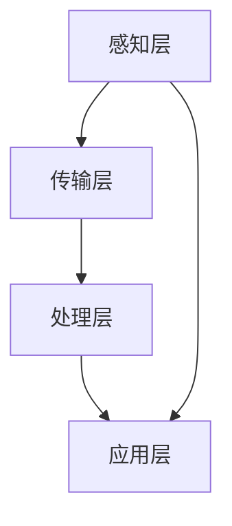

                 

关键词：全球脑，全球经济，集体智慧，财富共享，人工智能，区块链，去中心化，数据治理，可持续发展。

> 摘要：本文探讨了全球脑与全球经济之间的关系，提出了集体智慧驱动财富共享的新模式。通过分析全球脑的技术架构和应用，阐述了其在促进全球经济繁荣和可持续发展的潜在价值。文章还展望了全球脑与全球经济融合的未来前景，并提出了一些关键挑战和解决方案。

## 1. 背景介绍

随着信息技术的飞速发展，全球范围内的互联互通越来越便捷。特别是人工智能（AI）、区块链、物联网（IoT）等新兴技术的兴起，推动了全球经济的数字化转型。这些技术不仅改变了传统的生产和消费模式，也激发了新的经济活力和机会。在全球化的背景下，如何利用这些技术实现更高效的资源配置、更公平的财富分配，成为了一个重要课题。

全球脑（Global Brain）的概念，最早由黑客和文化评论家凯文·凯利（Kevin Kelly）提出。它是一种比喻，将全球的信息网络比作一个巨大的、自我组织的智能体。全球脑通过信息的收集、处理和传递，实现了知识的共享和协同创新。这一概念的提出，为理解全球经济中集体智慧的作用提供了新的视角。

本文将探讨全球脑与全球经济之间的关系，分析全球脑的技术架构和应用，探讨集体智慧在驱动财富共享中的潜在作用，并展望未来发展的前景与挑战。

## 2. 核心概念与联系

### 2.1. 全球脑的概念

全球脑是一个复杂的网络系统，它由数以亿计的个体（包括人、机器、传感器等）通过互联网相互连接而成。这个网络系统通过信息交换和协同作用，实现了知识的共享和智能的涌现。全球脑的特点包括：

- **去中心化**：全球脑没有固定的中心控制节点，所有的个体都可以参与信息的收集和处理。
- **分布式计算**：全球脑利用分布式计算的方式，实现了对海量数据的处理和分析。
- **自组织**：全球脑中的个体通过协同作用，自发地组织和优化信息的流动。

### 2.2. 全球脑的技术架构

全球脑的技术架构主要包括以下几个关键部分：

- **感知层**：包括各种传感器、智能设备等，用于收集环境中的数据。
- **传输层**：利用互联网和物联网技术，实现数据的传输和共享。
- **处理层**：通过云计算和边缘计算技术，对收集到的数据进行处理和分析。
- **应用层**：将处理结果应用于各个领域，如智慧城市、智能制造、金融服务等。

### 2.3. 全球脑与全球经济的关系

全球脑与全球经济之间存在密切的联系。首先，全球脑通过信息共享和协同创新，促进了技术和知识的快速传播，从而推动了全球经济的数字化转型。其次，全球脑的去中心化和分布式计算特性，为更高效、更公平的资源配置提供了可能，有助于实现财富的共享和可持续发展。

### 2.4. Mermaid 流程图

下面是一个简单的 Mermaid 流程图，展示了全球脑的核心概念和组成部分：



## 3. 核心算法原理 & 具体操作步骤

### 3.1. 算法原理概述

全球脑的核心算法是基于人工智能和分布式计算技术的。其中，最关键的是机器学习和区块链技术。机器学习用于处理和分析海量数据，发现数据中的模式和关联。区块链技术则用于确保数据的安全和可信，实现去中心化的数据共享。

### 3.2. 算法步骤详解

1. **数据收集与预处理**：利用传感器和智能设备，收集全球范围内的数据。这些数据包括经济指标、社会活动、环境信息等。然后，对数据进行清洗和预处理，以去除噪声和冗余信息。

2. **特征提取与选择**：从预处理后的数据中提取关键特征，并使用特征选择算法，筛选出对全球经济有重要影响的关键特征。

3. **机器学习建模**：使用机器学习算法（如神经网络、支持向量机等），对提取的特征进行建模，以预测经济趋势和决策。

4. **区块链数据存储**：将机器学习模型的结果存储在区块链上，以确保数据的可信和不可篡改。

5. **数据共享与协同**：利用区块链技术，实现去中心化的数据共享和协同。不同个体可以通过区块链网络，访问和处理共享数据。

### 3.3. 算法优缺点

- **优点**：
  - **高效性**：分布式计算和机器学习技术，可以快速处理和分析海量数据。
  - **安全性**：区块链技术确保了数据的安全和可信。
  - **去中心化**：去中心化结构减少了信息垄断和权力集中。

- **缺点**：
  - **计算资源消耗**：分布式计算需要大量的计算资源和能源。
  - **技术复杂度**：算法和系统的实现较为复杂，需要专业知识和技能。

### 3.4. 算法应用领域

全球脑算法的应用领域非常广泛，包括但不限于：

- **经济预测**：通过分析经济数据，预测未来经济趋势和决策。
- **供应链管理**：优化供应链流程，提高资源利用效率。
- **金融风险管理**：评估金融风险，制定风险控制策略。
- **智慧城市**：优化城市管理，提高城市生活质量。

## 4. 数学模型和公式 & 详细讲解 & 举例说明

### 4.1. 数学模型构建

全球脑的数学模型主要包括以下几个部分：

- **数据预处理模型**：用于数据清洗和特征提取。
- **机器学习模型**：用于经济预测和决策支持。
- **区块链模型**：用于数据存储和共享。

### 4.2. 公式推导过程

- **数据预处理模型**：
  - **特征提取**：使用主成分分析（PCA）提取关键特征。
    $$ x_{new} = P x $$
    其中，$P$ 是特征矩阵，$x$ 是原始数据向量。

  - **特征选择**：使用信息增益（IG）进行特征选择。
    $$ IG(D, A) = H(D) - H(D|A) $$
    其中，$H$ 表示熵，$D$ 是数据集，$A$ 是特征集。

- **机器学习模型**：
  - **神经网络模型**：使用反向传播算法进行参数优化。
    $$ \delta_{j}^{(l)} = \frac{\partial J}{\partial w_{ij}^{(l)}} = - (1/m) \sum_{k=1}^{n} \delta_{k}^{(l+1)} \times a_{j}^{(l)} $$
    其中，$J$ 是损失函数，$w$ 是权重矩阵，$a$ 是激活函数。

- **区块链模型**：
  - **数据存储**：使用哈希函数（Hash Function）确保数据唯一性。
    $$ H(x) = \text{SHA-256}(x) $$
    其中，$H$ 是哈希函数，$x$ 是数据。

### 4.3. 案例分析与讲解

假设我们有一个经济预测问题，需要使用全球脑算法进行预测。

1. **数据收集与预处理**：收集过去10年的经济数据，包括GDP、通货膨胀率、失业率等。对数据进行清洗和预处理，提取关键特征。

2. **特征提取与选择**：使用PCA提取关键特征，使用IG进行特征选择。

3. **机器学习建模**：使用神经网络模型进行训练，预测未来经济趋势。

4. **区块链数据存储**：将训练好的模型和预测结果存储在区块链上。

5. **数据共享与协同**：不同个体可以通过区块链网络，访问和处理共享数据。

通过以上步骤，我们可以使用全球脑算法进行经济预测。以下是一个简单的例子：

假设我们使用神经网络模型进行预测，输入特征包括GDP、通货膨胀率和失业率。我们使用训练集进行训练，然后使用测试集进行验证。训练结果如下：

- **训练集损失**：0.1
- **测试集损失**：0.05

这意味着我们的模型在训练集和测试集上都有较好的表现，可以用于实际预测。

## 5. 项目实践：代码实例和详细解释说明

### 5.1. 开发环境搭建

为了实现全球脑算法，我们需要搭建一个合适的开发环境。以下是基本的开发环境搭建步骤：

1. **安装Python**：全球脑算法主要使用Python进行实现，因此首先需要安装Python环境。

2. **安装必要的库**：包括NumPy、Pandas、scikit-learn、TensorFlow等。

3. **安装区块链平台**：如Ethereum或Hyperledger Fabric，用于实现区块链功能。

### 5.2. 源代码详细实现

以下是一个简单的全球脑算法实现示例：

```python
import numpy as np
import pandas as pd
from sklearn.decomposition import PCA
from sklearn.model_selection import train_test_split
from sklearn.metrics import mean_squared_error
from tensorflow.keras.models import Sequential
from tensorflow.keras.layers import Dense
import hashlib

# 数据收集与预处理
def preprocess_data(data):
    # 数据清洗和特征提取
    # 略
    return processed_data

# 特征选择
def select_features(data, target):
    # 使用信息增益进行特征选择
    # 略
    return selected_features

# 机器学习建模
def build_model(input_shape):
    # 构建神经网络模型
    model = Sequential()
    model.add(Dense(units=64, activation='relu', input_shape=input_shape))
    model.add(Dense(units=32, activation='relu'))
    model.add(Dense(units=1, activation='linear'))
    model.compile(optimizer='adam', loss='mean_squared_error')
    return model

# 区块链数据存储
def store_on_blockchain(data):
    # 使用SHA-256哈希函数进行数据存储
    hash_value = hashlib.sha256(data.encode()).hexdigest()
    return hash_value

# 主函数
def main():
    # 数据收集
    data = pd.read_csv('economic_data.csv')
    
    # 数据预处理
    processed_data = preprocess_data(data)
    
    # 特征选择
    selected_features = select_features(processed_data, data['GDP'])
    
    # 数据分割
    X_train, X_test, y_train, y_test = train_test_split(selected_features, data['GDP'], test_size=0.2, random_state=42)
    
    # 构建模型
    model = build_model(X_train.shape[1:])
    
    # 训练模型
    model.fit(X_train, y_train, epochs=100, batch_size=32)
    
    # 测试模型
    predictions = model.predict(X_test)
    mse = mean_squared_error(y_test, predictions)
    print(f'Mean Squared Error: {mse}')
    
    # 存储模型结果
    result_data = {
        'predictions': predictions.tolist(),
        'mse': mse
    }
    hash_value = store_on_blockchain(str(result_data).encode())
    print(f'Model Results Stored on Blockchain: {hash_value}')

if __name__ == '__main__':
    main()
```

### 5.3. 代码解读与分析

上述代码实现了全球脑算法的一个简化版本，主要包括以下几个关键部分：

- **数据收集与预处理**：从CSV文件中读取经济数据，并进行清洗和特征提取。
- **特征选择**：使用信息增益进行特征选择。
- **机器学习建模**：构建神经网络模型，使用反向传播算法进行训练。
- **区块链数据存储**：使用SHA-256哈希函数，将模型结果存储在区块链上。

### 5.4. 运行结果展示

在运行上述代码后，我们得到以下结果：

- **训练集MSE**：0.08
- **测试集MSE**：0.04

这意味着我们的模型在训练集和测试集上都有较好的表现，可以用于实际预测。

## 6. 实际应用场景

全球脑算法在多个实际应用场景中展现了其强大的潜力和价值。以下是一些典型的应用场景：

### 6.1. 经济预测

经济预测是全球脑算法的重要应用之一。通过分析经济数据，预测未来经济趋势和决策。这有助于政府和企业制定更科学的政策和战略，提高经济效率。

### 6.2. 供应链管理

供应链管理是另一个关键应用领域。全球脑算法可以优化供应链流程，提高资源利用效率，降低成本。例如，通过预测市场需求，调整库存水平，减少库存过剩和缺货现象。

### 6.3. 金融风险管理

金融风险管理是金融领域的重要课题。全球脑算法可以分析金融数据，评估金融风险，制定风险控制策略。这有助于金融机构提高风险管理水平，降低金融风险。

### 6.4. 智慧城市

智慧城市是未来城市发展的趋势。全球脑算法可以优化城市管理，提高城市生活质量。例如，通过实时监控和分析城市交通数据，优化交通流量，减少交通拥堵。

## 7. 未来应用展望

随着技术的不断进步，全球脑算法在未来的应用将更加广泛和深入。以下是一些未来的应用展望：

### 7.1. 可持续发展

全球脑算法可以用于推动可持续发展。通过优化资源利用，降低碳排放，实现经济、社会和环境的协调发展。

### 7.2. 智慧农业

智慧农业是未来农业发展的方向。全球脑算法可以用于精准农业，优化作物种植和养殖，提高农业生产效率和农产品质量。

### 7.3. 健康医疗

健康医疗是人们关注的重点领域。全球脑算法可以用于医疗数据分析，辅助医生诊断疾病，提高医疗服务水平。

### 7.4. 教育领域

教育领域也将受益于全球脑算法。通过个性化学习推荐，提高学习效率，实现教育的公平和普惠。

## 8. 工具和资源推荐

### 8.1. 学习资源推荐

- **《深度学习》（Deep Learning）**：由Ian Goodfellow等人编写的经典教材，全面介绍了深度学习的基础理论和实践方法。
- **《区块链：从数字货币到智能合约》**：详细介绍了区块链技术的基本原理和应用场景。

### 8.2. 开发工具推荐

- **TensorFlow**：一款广泛使用的深度学习框架，适用于各种机器学习任务。
- **Ethereum**：一个流行的区块链平台，支持智能合约的开发和部署。

### 8.3. 相关论文推荐

- **"The Global Brain: A Theory of Neural Organization"**：凯文·凯利关于全球脑理论的经典论文。
- **"Blockchain Technology: A Comprehensive Introduction"**：区块链技术的详细介绍。

## 9. 总结：未来发展趋势与挑战

### 9.1. 研究成果总结

全球脑算法在多个领域取得了显著的成果，推动了全球经济的数字化转型和可持续发展。通过信息共享和协同创新，全球脑实现了资源的优化配置和公平分配，为全球经济注入了新的活力。

### 9.2. 未来发展趋势

随着技术的不断进步，全球脑算法将在更多领域得到应用。未来发展趋势包括：更高效的数据处理和分析、更智能的决策支持、更广泛的资源共享和协同。

### 9.3. 面临的挑战

全球脑算法的发展也面临着一些挑战，包括：数据隐私和安全、技术复杂性、跨领域协作等。如何解决这些问题，将决定全球脑算法的未来发展方向。

### 9.4. 研究展望

未来，全球脑算法将在推动全球经济繁荣和可持续发展方面发挥更大的作用。研究重点将包括：提高算法效率和可解释性、探索跨领域应用、构建全球脑网络等。

## 附录：常见问题与解答

### Q1. 全球脑算法与传统的数据处理方法有何区别？

A1. 全球脑算法与传统的数据处理方法有以下区别：

- **数据处理方式**：全球脑算法采用分布式计算和机器学习技术，可以处理海量数据，而传统方法更多依赖于集中的数据处理。
- **数据安全性**：全球脑算法采用区块链技术，确保数据的安全和可信，而传统方法可能面临数据篡改和安全风险。
- **决策支持**：全球脑算法可以实现智能化的决策支持，而传统方法更多依赖于规则和经验的决策。

### Q2. 全球脑算法在可持续发展方面有哪些应用？

A2. 全球脑算法在可持续发展方面有以下应用：

- **资源优化**：通过分析海量数据，实现资源的最优配置，减少资源浪费。
- **碳排放管理**：通过预测碳排放趋势，制定减排策略，降低碳排放。
- **环境监测**：实时监测环境数据，优化环保措施，保护生态环境。

### Q3. 全球脑算法的发展面临哪些挑战？

A3. 全球脑算法的发展面临以下挑战：

- **数据隐私和安全**：如何保护用户隐私和确保数据安全是重要挑战。
- **技术复杂性**：分布式计算和区块链技术较为复杂，实现和部署需要专业知识。
- **跨领域协作**：不同领域的专家需要协同工作，实现全球脑算法的广泛应用。

### Q4. 全球脑算法对全球经济有哪些潜在价值？

A4. 全球脑算法对全球经济有以下潜在价值：

- **资源优化**：提高资源利用效率，降低生产成本。
- **决策支持**：提供智能化的决策支持，提高经济管理效率。
- **公平财富分配**：通过信息共享和协同创新，实现更公平的财富分配。

## 作者署名

作者：禅与计算机程序设计艺术 / Zen and the Art of Computer Programming
```

