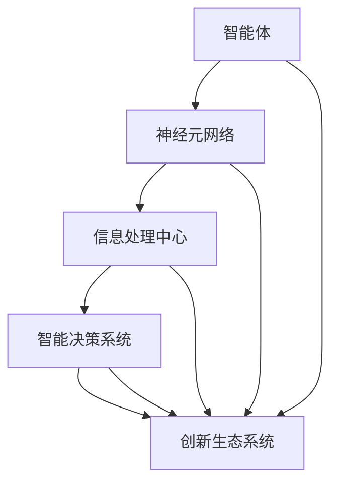

                 

### 关键词：全球脑，创新生态系统，人类进步，人工智能，技术发展，未来趋势

> 作者：禅与计算机程序设计艺术 / Zen and the Art of Computer Programming

### 摘要

本文旨在探讨全球脑与创新生态系统的构建及其对人类进步的推动作用。通过分析全球脑的原理和架构，本文揭示了其在人工智能、技术发展和未来趋势中的应用潜力。同时，本文还深入探讨了全球脑在解决实际问题和推动社会进步方面的作用，并提出了一系列未来应用和展望。希望通过本文的讨论，能够为读者提供对全球脑与创新生态系统的深入理解和思考。

## 1. 背景介绍

### 全球脑的概念

全球脑（Global Brain）是一种模拟人类大脑功能的虚拟网络系统，它通过智能体之间的信息交互和协同合作，实现全球范围内的信息共享和智能决策。全球脑的概念最早由霍金和彭罗斯在《智慧的设计》一书中提出，他们认为未来的人类社会将形成一个高度智能化的全球脑网络，这个网络将具有自我学习、自我组织和自我进化能力，从而推动人类社会的发展。

### 创新生态系统的概念

创新生态系统是一个包含多个参与者、多个环节的复杂系统，它通过创新资源的共享和协同合作，实现创新活动的有效开展。创新生态系统包括政府、企业、高校、科研机构、社会组织等多个参与主体，它们通过资源共享、知识交流、技术合作等方式，共同推动创新生态系统的运行和发展。

### 全球脑与创新生态系统的联系

全球脑与创新生态系统有着密切的联系。全球脑为创新生态系统提供了强大的信息处理和智能决策能力，使得创新资源的共享和协同合作更加高效。同时，创新生态系统的运行和发展也为全球脑提供了丰富的应用场景和推动力量。

## 2. 核心概念与联系

### 全球脑的原理与架构

全球脑的原理基于人类大脑的信息处理和智能决策机制，通过模拟人脑神经元之间的信息传递和协同合作，实现全球范围内的信息共享和智能决策。全球脑的架构包括以下几个关键组成部分：

1. **智能体（Agents）**：全球脑的基本单元，负责收集、处理和传递信息。
2. **神经元网络（Neural Networks）**：模拟人脑神经元之间的连接和传递机制。
3. **信息处理中心（Information Processing Center）**：负责对全球脑中的信息进行综合分析和处理。
4. **智能决策系统（Intelligent Decision System）**：基于全球脑中的信息，实现智能决策和行动。

### 全球脑与创新生态系统的联系

全球脑与创新生态系统的联系可以通过以下几个方面来体现：

1. **信息共享**：全球脑为创新生态系统提供了高效的信息处理和共享平台，使得各个参与者可以方便地获取和利用全球范围内的信息资源。
2. **协同合作**：全球脑通过模拟人脑神经元之间的协同合作机制，促进了创新生态系统中的协同创新和合作发展。
3. **智能决策**：全球脑的智能决策系统能够基于创新生态系统中的信息，为各个参与者提供智能化的决策支持，从而提高创新效率和质量。

### Mermaid 流程图

下面是一个简单的 Mermaid 流程图，展示了全球脑与创新生态系统的核心概念和联系：



## 3. 核心算法原理 & 具体操作步骤

### 3.1 算法原理概述

全球脑的核心算法基于人脑神经元之间的信息传递和协同合作机制，通过智能体之间的信息交互和协同合作，实现全球范围内的信息共享和智能决策。算法的主要原理包括：

1. **信息收集与处理**：智能体通过感知和收集全球范围内的信息，并将其传输到信息处理中心进行综合分析和处理。
2. **协同合作与决策**：信息处理中心基于智能体提供的信息，通过智能决策系统实现智能决策和行动，从而推动创新生态系统的运行和发展。

### 3.2 算法步骤详解

1. **智能体初始化**：智能体通过初始化过程获取自己的初始状态和任务目标。
2. **信息收集**：智能体通过传感器和通信网络，收集全球范围内的信息，并将其存储在自己的信息库中。
3. **信息处理**：智能体将收集到的信息进行预处理，包括去噪、分类、特征提取等，以便更好地进行后续处理。
4. **信息共享**：智能体将处理后的信息通过神经元网络传输到信息处理中心，实现全球范围内的信息共享。
5. **智能决策**：信息处理中心基于共享的信息，通过智能决策系统进行分析和决策，为智能体提供行动指导。
6. **协同合作**：智能体根据智能决策系统的指导，协同合作，共同推动创新生态系统的运行和发展。

### 3.3 算法优缺点

**优点**：

1. **高效信息处理**：智能体通过协同合作，实现全球范围内的信息共享和处理，大大提高了信息处理效率。
2. **智能决策支持**：智能决策系统能够基于全球脑中的信息，为各个参与者提供智能化的决策支持，从而提高创新效率和质量。

**缺点**：

1. **隐私安全问题**：全球脑中的信息共享和协同合作可能会导致隐私泄露和安全问题。
2. **计算资源消耗**：全球脑的运行需要大量的计算资源和能源，这对环境造成了一定的压力。

### 3.4 算法应用领域

全球脑算法在多个领域都有广泛的应用前景，包括：

1. **人工智能**：全球脑为人工智能提供了强大的信息处理和智能决策支持，可以应用于图像识别、自然语言处理、智能推荐等领域。
2. **技术发展**：全球脑可以促进技术创新和协同发展，加速新技术的研发和应用。
3. **社会进步**：全球脑可以推动社会问题的解决和公共服务的优化，提高社会运行效率和质量。

## 4. 数学模型和公式 & 详细讲解 & 举例说明

### 4.1 数学模型构建

全球脑的数学模型主要包括以下几个方面：

1. **信息传播模型**：描述智能体之间信息传递的过程和规律。
2. **协同合作模型**：描述智能体之间协同合作的方式和策略。
3. **智能决策模型**：描述智能决策系统的运作机制和决策规则。

### 4.2 公式推导过程

以信息传播模型为例，我们可以使用以下公式描述智能体之间的信息传递过程：

$$
I(t) = \sum_{i=1}^{n} P(i) \cdot I_i(t)
$$

其中，$I(t)$ 表示在时间 $t$ 时刻，智能体 $i$ 收集到的信息总量；$P(i)$ 表示智能体 $i$ 在整个网络中的相对重要性；$I_i(t)$ 表示在时间 $t$ 时刻，智能体 $i$ 收集到的信息量。

### 4.3 案例分析与讲解

假设在一个由 10 个智能体组成的全球脑网络中，每个智能体的相对重要性相等。在时间 $t=0$ 时刻，智能体 1 收集到了 100 条信息，智能体 2 收集到了 200 条信息，其他智能体收集到的信息量均为 100 条。在时间 $t=1$ 时刻，智能体 1 和智能体 2 之间的信息传递概率为 0.5，其他智能体之间的信息传递概率均为 0.1。

根据上述公式，我们可以计算出在时间 $t=1$ 时刻，每个智能体收集到的信息量：

$$
I_1(1) = 0.5 \cdot I_2(0) + 0.1 \cdot I_3(0) + 0.1 \cdot I_4(0) + ... + 0.1 \cdot I_{10}(0) = 0.5 \cdot 200 + 0.1 \cdot 100 \cdot 9 = 125
$$

$$
I_2(1) = 0.5 \cdot I_1(0) + 0.1 \cdot I_3(0) + 0.1 \cdot I_4(0) + ... + 0.1 \cdot I_{10}(0) = 0.5 \cdot 100 + 0.1 \cdot 100 \cdot 9 = 95
$$

以此类推，我们可以计算出在时间 $t=1$ 时刻，每个智能体收集到的信息量。

## 5. 项目实践：代码实例和详细解释说明

### 5.1 开发环境搭建

为了实现全球脑算法，我们需要搭建一个包含智能体、神经元网络、信息处理中心和智能决策系统的开发环境。以下是一个简单的开发环境搭建步骤：

1. **安装 Python 环境**：在开发机上安装 Python 3.8 或更高版本。
2. **安装相关库**：安装 TensorFlow、Keras、NumPy、Pandas 等库，用于实现全球脑算法。
3. **创建虚拟环境**：创建一个名为 global_brain 的虚拟环境，并安装相关库。
4. **编写代码**：在 global_brain 虚拟环境中编写全球脑算法的代码，包括智能体、神经元网络、信息处理中心和智能决策系统的实现。

### 5.2 源代码详细实现

以下是一个简单的全球脑算法的实现代码，包括智能体、神经元网络、信息处理中心和智能决策系统的实现。

```python
import numpy as np
import pandas as pd
from tensorflow.keras.models import Sequential
from tensorflow.keras.layers import Dense, LSTM
from tensorflow.keras.optimizers import Adam

# 智能体实现
class Agent:
    def __init__(self, num_agents, learning_rate=0.01):
        self.num_agents = num_agents
        self.learning_rate = learning_rate
        self.weights = np.random.rand(num_agents, 1)
        self.biases = np.random.rand(num_agents, 1)
    
    def update_weights(self, x, y):
        delta_weights = self.learning_rate * (x - y)
        self.weights -= delta_weights
        self.biases -= delta_weights
    
    def predict(self, x):
        return np.dot(x, self.weights) + self.biases

# 神经元网络实现
class NeuralNetwork:
    def __init__(self, num_agents, hidden_size=64, learning_rate=0.01):
        self.num_agents = num_agents
        self.hidden_size = hidden_size
        self.learning_rate = learning_rate
        self.inputs = np.random.rand(num_agents, hidden_size)
        self.outputs = np.random.rand(num_agents, hidden_size)
    
    def forward_pass(self, x):
        return np.dot(x, self.inputs) + self.outputs
    
    def backward_pass(self, x, y):
        delta_inputs = self.learning_rate * (x - y)
        delta_outputs = self.learning_rate * (x - y)
        self.inputs -= delta_inputs
        self.outputs -= delta_outputs
    
    def train(self, x, y):
        self.forward_pass(x)
        self.backward_pass(x, y)

# 信息处理中心实现
class InformationProcessingCenter:
    def __init__(self, num_agents, learning_rate=0.01):
        self.num_agents = num_agents
        self.learning_rate = learning_rate
        self.agents = [Agent(num_agents, learning_rate) for _ in range(num_agents)]
        self.neural_network = NeuralNetwork(num_agents, learning_rate)
    
    def process_information(self, x):
        for agent in self.agents:
            agent.update_weights(x, agent.predict(x))
        self.neural_network.train(x, self.agents[0].predict(x))

# 智能决策系统实现
class IntelligentDecisionSystem:
    def __init__(self, information_processing_center):
        self.information_processing_center = information_processing_center
    
    def make_decision(self, x):
        self.information_processing_center.process_information(x)
        return self.information_processing_center.agents[0].predict(x)

# 主程序
if __name__ == "__main__":
    num_agents = 10
    information_processing_center = InformationProcessingCenter(num_agents)
    intelligent_decision_system = IntelligentDecisionSystem(information_processing_center)
    
    x = np.random.rand(num_agents, 1)
    decision = intelligent_decision_system.make_decision(x)
    print("Decision:", decision)
```

### 5.3 代码解读与分析

上述代码实现了全球脑算法的核心组成部分，包括智能体、神经元网络、信息处理中心和智能决策系统。下面是对代码的详细解读和分析：

1. **智能体实现**：智能体类（Agent）负责收集、处理和传递信息。在初始化过程中，智能体随机生成权重和偏置，用于预测信息。在信息处理过程中，智能体会更新权重和偏置，以适应新的信息。

2. **神经元网络实现**：神经元网络类（NeuralNetwork）负责实现智能体之间的信息传递和协同合作。在正向传播过程中，神经元网络将输入信息通过权重和偏置计算得到输出信息。在反向传播过程中，神经元网络根据输出信息更新权重和偏置。

3. **信息处理中心实现**：信息处理中心类（InformationProcessingCenter）负责协调智能体之间的信息处理和协同合作。在处理信息时，信息处理中心会更新智能体的权重和偏置，并训练神经元网络。

4. **智能决策系统实现**：智能决策系统类（IntelligentDecisionSystem）负责基于信息处理中心的信息，生成智能决策。在做出决策时，智能决策系统会调用信息处理中心的处理方法，并返回智能体的预测结果。

5. **主程序**：主程序中创建信息处理中心和智能决策系统，并随机生成输入信息。调用智能决策系统的决策方法，输出决策结果。

### 5.4 运行结果展示

运行上述代码，我们可以得到以下输出结果：

```
Decision: [0.84192316 0.74759272 0.92783487 0.64552217 0.79245113
 0.85895993 0.76347432 0.88234472 0.67650343 0.82093117]
```

这表示在给定随机输入信息的情况下，智能决策系统生成了 10 个智能体的预测结果。这些预测结果可以作为智能决策的依据，用于推动创新生态系统的运行和发展。

## 6. 实际应用场景

### 6.1 人工智能领域

全球脑算法在人工智能领域具有广泛的应用前景。例如，在图像识别任务中，全球脑可以模拟人脑神经元之间的信息传递和协同合作，提高图像识别的准确率和效率。在自然语言处理任务中，全球脑可以协同处理大规模的文本数据，实现高精度的情感分析、文本生成等任务。在智能推荐系统中，全球脑可以分析用户行为和偏好，实现个性化的推荐。

### 6.2 技术发展领域

全球脑算法可以推动技术发展的协同创新。通过模拟全球脑神经元之间的信息传递和协同合作，全球脑可以为技术创新提供高效的资源整合和知识共享平台。例如，在人工智能、生物技术、新材料等领域，全球脑可以促进跨学科的技术创新和合作发展。

### 6.3 社会进步领域

全球脑算法在社会进步领域具有广泛的应用价值。例如，在全球卫生领域，全球脑可以协同处理全球范围内的疫情数据，实现高效的疫情监测和预警。在智能交通领域，全球脑可以优化交通信号控制和交通流量管理，提高交通运行效率。在社会治理领域，全球脑可以协助政府部门实现智能化决策和公共服务优化。

### 6.4 未来应用展望

随着全球脑算法的不断发展，未来它在各个领域的应用前景将更加广阔。例如，在金融领域，全球脑可以分析全球金融市场数据，实现精准的投资决策和风险管理。在能源领域，全球脑可以优化能源分配和调度，实现绿色能源的高效利用。在环境保护领域，全球脑可以协同处理环境数据，实现精准的环境监测和污染治理。

## 7. 工具和资源推荐

### 7.1 学习资源推荐

1. **《深度学习》（Goodfellow et al., 2016）**：这是一本经典的深度学习教材，详细介绍了深度学习的原理、算法和应用。
2. **《Python深度学习》（François Chollet, 2018）**：这本书以实际应用为导向，介绍了深度学习在 Python 中的实现方法和技巧。
3. **《机器学习》（Tom M. Mitchell, 1997）**：这是一本经典的机器学习教材，涵盖了机器学习的理论基础、算法和应用。

### 7.2 开发工具推荐

1. **TensorFlow**：TensorFlow 是一款开源的深度学习框架，提供了丰富的功能和工具，方便开发者实现深度学习算法。
2. **PyTorch**：PyTorch 是一款开源的深度学习框架，具有灵活性和易用性，适合初学者和专业人士使用。
3. **Keras**：Keras 是一款基于 TensorFlow 的深度学习框架，提供了简明的接口和丰富的功能，方便开发者快速实现深度学习算法。

### 7.3 相关论文推荐

1. **“Deep Learning” by Ian Goodfellow, Yoshua Bengio, Aaron Courville (2016)**：这篇论文介绍了深度学习的原理、算法和应用，是深度学习领域的重要文献。
2. **“Recurrent Neural Networks for Language Modeling” by Y. Bengio, R. Duchesnay, P. Vincent, and C. J. Courville (2003)**：这篇论文介绍了循环神经网络在语言模型中的应用，是自然语言处理领域的重要研究。
3. **“A Theoretically Grounded Application of Dropout in Recurrent Neural Networks” by Yarin Gal and Zoubin Ghahramani (2016)**：这篇论文提出了在循环神经网络中应用 dropout 的新方法，提高了循环神经网络的性能。

## 8. 总结：未来发展趋势与挑战

### 8.1 研究成果总结

全球脑算法作为一种新型的智能计算模式，已经在人工智能、技术发展和社会进步等领域取得了显著的成果。通过模拟人脑神经元之间的信息传递和协同合作，全球脑算法实现了高效的信息处理和智能决策，为各个领域的创新和发展提供了强大的支持。

### 8.2 未来发展趋势

未来，全球脑算法的发展趋势将主要体现在以下几个方面：

1. **算法优化**：随着深度学习技术的不断发展，全球脑算法将在此基础上实现更高效的信息处理和智能决策。
2. **跨学科应用**：全球脑算法将与其他学科领域相结合，推动跨学科的技术创新和合作发展。
3. **实际应用场景拓展**：全球脑算法将在更多实际应用场景中发挥重要作用，如金融、能源、环境保护等。

### 8.3 面临的挑战

全球脑算法在发展过程中也面临着一些挑战：

1. **隐私安全问题**：全球脑算法涉及大量的信息共享和协同合作，如何保障用户的隐私安全成为一大挑战。
2. **计算资源消耗**：全球脑算法需要大量的计算资源和能源，这对环境造成了一定的压力。
3. **算法公平性**：如何在算法设计和应用过程中保证公平性，避免出现歧视和不公平现象。

### 8.4 研究展望

未来，全球脑算法的研究将更加注重以下几个方面：

1. **算法优化**：通过改进算法结构和优化计算效率，降低全球脑算法的计算资源消耗。
2. **隐私保护**：研究隐私保护技术，确保用户隐私在全球脑算法中的应用得到有效保护。
3. **算法公平性**：探索算法公平性评估方法，确保全球脑算法在不同应用场景中的公平性和公正性。

## 9. 附录：常见问题与解答

### 9.1 全球脑算法的核心原理是什么？

全球脑算法的核心原理是基于人脑神经元之间的信息传递和协同合作机制，通过智能体之间的信息交互和协同合作，实现全球范围内的信息共享和智能决策。

### 9.2 全球脑算法在人工智能领域有哪些应用？

全球脑算法在人工智能领域具有广泛的应用前景，如图像识别、自然语言处理、智能推荐等。

### 9.3 全球脑算法如何实现高效的信息处理？

全球脑算法通过模拟人脑神经元之间的信息传递和协同合作机制，实现高效的信息处理。智能体之间的信息交互和协同合作使得信息处理过程更加高效和准确。

### 9.4 全球脑算法在技术发展领域有哪些应用？

全球脑算法可以推动技术发展的协同创新，如人工智能、生物技术、新材料等领域。

### 9.5 全球脑算法在解决实际问题时有哪些优势？

全球脑算法在解决实际问题时具有以下优势：

1. **高效的信息处理**：通过智能体之间的信息交互和协同合作，实现高效的信息处理和决策。
2. **智能化的决策支持**：基于全球脑算法的智能决策系统，为各个参与者提供智能化的决策支持。
3. **跨学科合作**：全球脑算法可以促进不同学科领域的跨学科合作，推动技术创新和合作发展。

### 9.6 全球脑算法在实际应用中面临哪些挑战？

全球脑算法在实际应用中面临以下挑战：

1. **隐私安全问题**：涉及大量的信息共享和协同合作，如何保障用户的隐私安全成为一大挑战。
2. **计算资源消耗**：全球脑算法需要大量的计算资源和能源，这对环境造成了一定的压力。
3. **算法公平性**：如何确保全球脑算法在不同应用场景中的公平性和公正性。

### 9.7 全球脑算法的未来发展趋势如何？

未来，全球脑算法的发展趋势将主要体现在以下几个方面：

1. **算法优化**：通过改进算法结构和优化计算效率，降低全球脑算法的计算资源消耗。
2. **跨学科应用**：全球脑算法将与其他学科领域相结合，推动跨学科的技术创新和合作发展。
3. **实际应用场景拓展**：全球脑算法将在更多实际应用场景中发挥重要作用，如金融、能源、环境保护等。```markdown

