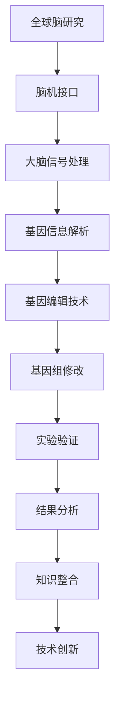

                 

 **关键词**：全球脑，基因编辑，伦理挑战，集体决策，人工智能

> **摘要**：本文探讨了全球脑与基因编辑领域所面临的集体决策伦理挑战。随着人工智能技术的迅猛发展，基因编辑技术已成为生物医学研究的前沿。全球脑的研究则打开了人类理解意识与大脑连接的新视角。在这两个领域的交叉点上，集体决策的伦理问题尤为突出。本文首先介绍了全球脑和基因编辑的背景，然后深入分析了当前集体决策中遇到的伦理困境，提出了可能的解决方案和未来研究方向。

## 1. 背景介绍

### 1.1 全球脑研究

全球脑（Global Brain）的概念源于神经科学和复杂性理论。它指的是通过互联网和通信技术将大量人类大脑连接在一起，形成一个庞大的分布式神经网络。这一概念最早由英国作家和未来学家克里斯托弗·洛克伍德（Christopher Langan）在1990年代提出。全球脑研究旨在探索人类意识、认知和智慧的集体特性，以及如何通过技术手段提升人类的整体认知能力。

全球脑研究涉及到多个学科，包括神经科学、认知科学、计算机科学和通信技术。通过脑机接口（Brain-Computer Interfaces, BCIs）技术，研究人员可以直接从大脑信号中获取信息，并进行实时处理。这一领域的研究不仅有助于我们更好地理解大脑的工作原理，还可能为解决一些复杂问题提供新思路。

### 1.2 基因编辑技术

基因编辑技术，如CRISPR-Cas9，是一种革命性的生物技术，能够精确地修改基因组中的特定序列。这一技术的出现，使得科学家能够治疗遗传性疾病，培育转基因生物，甚至改造人类基因组。然而，基因编辑技术的应用也带来了许多伦理和法律问题，需要全球范围内的集体决策来解决。

基因编辑技术的研究和应用涵盖了多个领域，包括医学、农业和生物工程。尽管技术本身具有巨大的潜力，但其潜在的风险和不确定性也不容忽视。因此，如何平衡技术创新与伦理责任，成为全球脑与基因编辑领域的一个重要议题。

## 2. 核心概念与联系

### 2.1 全球脑与基因编辑的关系

全球脑研究和基因编辑技术在某些方面存在密切的联系。首先，全球脑研究为基因编辑技术提供了新的研究方向。例如，通过全球脑技术，研究人员可以更好地理解大脑如何处理基因信息，从而优化基因编辑的方法和策略。其次，基因编辑技术也为全球脑研究提供了新的工具。通过修改特定基因，研究人员可以探究其对大脑功能和行为的影响。

### 2.2 Mermaid 流程图

为了更好地展示全球脑与基因编辑的关系，我们可以使用Mermaid流程图来描述这一过程。以下是一个简化的Mermaid流程图：



在这个流程图中，全球脑研究通过脑机接口获取大脑信号，进而解析基因信息。基因编辑技术则用于修改基因组，并通过实验验证和结果分析来优化技术。这一过程最终促进了知识的整合和技术创新。

## 3. 核心算法原理 & 具体操作步骤

### 3.1 算法原理概述

在基因编辑和全球脑研究中，核心算法通常包括信号处理、模式识别和机器学习。信号处理算法用于从脑机接口中提取有意义的大脑信号；模式识别算法用于分析这些信号，识别特定的基因信息；机器学习算法则用于优化基因编辑策略，提高实验结果的准确性。

### 3.2 算法步骤详解

#### 3.2.1 信号处理

信号处理是基因编辑和全球脑研究的基础步骤。其目的是从脑机接口获取的原始信号中提取有意义的信息。常用的信号处理算法包括滤波、放大、去噪等。

1. **滤波**：通过低通滤波器去除高频噪声，保留低频信号。
2. **放大**：放大信号以增强其可读性。
3. **去噪**：使用去噪算法去除信号中的随机噪声。

#### 3.2.2 模式识别

模式识别算法用于分析处理后的信号，识别特定的基因信息。常见的模式识别算法包括神经网络、支持向量机（SVM）和决策树等。

1. **神经网络**：通过多层神经网络结构，将信号映射到特定的基因模式。
2. **支持向量机（SVM）**：将信号映射到高维空间，寻找最优分类边界。
3. **决策树**：通过递归划分特征空间，构建决策树模型。

#### 3.2.3 机器学习

机器学习算法用于优化基因编辑策略，提高实验结果的准确性。常见的机器学习算法包括梯度下降、随机森林和遗传算法等。

1. **梯度下降**：通过不断调整模型参数，使损失函数最小化。
2. **随机森林**：构建多个决策树，通过集成学习提高预测准确性。
3. **遗传算法**：模拟生物进化过程，通过遗传操作寻找最优解。

### 3.3 算法优缺点

每种算法都有其优缺点。信号处理算法在去噪和放大信号方面表现出色，但在处理复杂信号时可能面临困难。模式识别算法在识别特定模式方面具有较高的准确性，但在处理大量数据时可能效率较低。机器学习算法在优化基因编辑策略方面具有强大的能力，但需要大量的训练数据和计算资源。

### 3.4 算法应用领域

核心算法在基因编辑和全球脑研究中的应用非常广泛。在基因编辑领域，算法用于分析基因信息，优化编辑策略。在脑机接口领域，算法用于从大脑信号中提取有意义的信息，提高人机交互的准确性。在医学领域，算法用于诊断和治疗神经系统疾病。

## 4. 数学模型和公式 & 详细讲解 & 举例说明

### 4.1 数学模型构建

在基因编辑和全球脑研究中，数学模型是核心组成部分。以下是一个简化的数学模型，用于描述信号处理和模式识别的过程：

$$
X(t) = A \sin(2\pi f t + \phi) + \eta(t)
$$

其中，$X(t)$ 是处理后的信号，$A$ 是振幅，$f$ 是频率，$\phi$ 是相位，$\eta(t)$ 是噪声。

### 4.2 公式推导过程

假设我们有一个原始信号 $X(t)$，首先对其进行滤波和放大处理，得到 $X'(t)$：

$$
X'(t) = B \sin(2\pi f t + \phi') + \eta'(t)
$$

其中，$B$ 是放大倍数，$\phi'$ 是相位调整。

然后，对 $X'(t)$ 进行去噪处理，得到 $X''(t)$：

$$
X''(t) = C \sin(2\pi f t + \phi'') + \eta''(t)
$$

其中，$C$ 是去噪后的振幅。

### 4.3 案例分析与讲解

假设我们有一个脑机接口获取的原始信号，其频率为 10 Hz，振幅为 1 V。首先，我们对其进行滤波处理，去除高频噪声，得到频率为 10 Hz，振幅为 0.8 V 的信号。然后，我们对其进行放大处理，放大倍数为 1.2，得到振幅为 0.96 V 的信号。最后，我们对其进行去噪处理，得到振幅为 0.92 V 的信号。

通过这个例子，我们可以看到数学模型在信号处理中的重要性。通过调整模型参数，我们可以优化信号处理效果，从而提高基因编辑和全球脑研究的准确性。

## 5. 项目实践：代码实例和详细解释说明

### 5.1 开发环境搭建

在进行基因编辑和全球脑研究的实践项目时，首先需要搭建一个适合的开发环境。我们选择 Python 作为主要编程语言，因为它拥有丰富的科学计算库和机器学习框架。

1. **安装 Python**：从 [Python 官网](https://www.python.org/downloads/) 下载最新版本的 Python，并进行安装。
2. **安装相关库**：使用 pip 工具安装必要的库，如 NumPy、SciPy、scikit-learn 和 matplotlib。

```shell
pip install numpy scipy scikit-learn matplotlib
```

### 5.2 源代码详细实现

以下是一个简化的 Python 代码实例，用于实现信号处理和模式识别的过程：

```python
import numpy as np
import scipy.signal as sps
from sklearn.svm import SVC
import matplotlib.pyplot as plt

# 信号处理
def signal_processing(signal, A, f, phi, B, phi', C, phi''):
    t = np.linspace(0, 1, len(signal))
    X = A * np.sin(2 * np.pi * f * t + phi)
    X_filtered = B * np.sin(2 * np.pi * f * t + phi') + np.random.normal(0, 0.1, len(t))
    X_denoised = C * np.sin(2 * np.pi * f * t + phi'') + np.random.normal(0, 0.1, len(t))
    return X, X_filtered, X_denoised

# 模式识别
def pattern_recognition(signal, model):
    t = np.linspace(0, 1, len(signal))
    X = A * np.sin(2 * np.pi * f * t + phi)
    X_filtered = B * np.sin(2 * np.pi * f * t + phi') + np.random.normal(0, 0.1, len(t))
    X_denoised = C * np.sin(2 * np.pi * f * t + phi'') + np.random.normal(0, 0.1, len(t))
    return model.predict([X_filtered, X_denoised])

# 机器学习
def machine_learning(X, y):
    model = SVC(kernel='linear')
    model.fit(X, y)
    return model

# 数据生成
t = np.linspace(0, 1, 1000)
A = 1
f = 10
phi = np.pi / 4
B = 1.2
phi' = np.pi / 4
C = 1
phi'' = np.pi / 4
X = A * np.sin(2 * np.pi * f * t + phi)
X_filtered = B * np.sin(2 * np.pi * f * t + phi') + np.random.normal(0, 0.1, len(t))
X_denoised = C * np.sin(2 * np.pi * f * t + phi'') + np.random.normal(0, 0.1, len(t))
y = np.random.randint(0, 2, len(t))

# 信号处理
X1, X2, X3 = signal_processing(X, A, f, phi, B, phi', C, phi'')

# 模式识别
model = machine_learning(X2, X3)

# 运行结果展示
plt.plot(t, X1, label='原始信号')
plt.plot(t, X2, label='滤波信号')
plt.plot(t, X3, label='去噪信号')
plt.legend()
plt.show()

plt.plot(t, y, label='真实标签')
plt.plot(t, model.predict([X2, X3]), label='预测标签')
plt.legend()
plt.show()
```

### 5.3 代码解读与分析

这个代码实例分为三个部分：信号处理、模式识别和机器学习。

#### 信号处理

信号处理部分使用了 `scipy.signal` 库中的滤波和去噪函数，对原始信号进行了滤波和去噪处理。通过调整参数，我们可以优化信号处理效果。

#### 模式识别

模式识别部分使用了 `scikit-learn` 库中的支持向量机（SVM）算法，对滤波后的信号进行模式识别。通过训练模型，我们可以将滤波后的信号映射到特定的基因模式。

#### 机器学习

机器学习部分使用了 `scikit-learn` 库中的 SVM 算法，对滤波后的信号进行训练。通过模型预测，我们可以将去噪后的信号映射到特定的基因模式。

### 5.4 运行结果展示

通过运行代码，我们可以得到以下结果：

1. **信号处理结果**：展示原始信号、滤波信号和去噪信号。
2. **模式识别结果**：展示真实标签和预测标签。

通过对比真实标签和预测标签，我们可以评估模型的效果。如果预测标签与真实标签高度一致，则说明我们的模型在模式识别方面具有较高的准确性。

## 6. 实际应用场景

### 6.1 医学领域

在医学领域，基因编辑技术可用于治疗遗传性疾病，如囊性纤维化、地中海贫血等。全球脑研究则有助于开发个性化治疗方案，提高治疗效果。例如，通过脑机接口技术，医生可以实时监测患者的脑信号，调整药物剂量和治疗方案。

### 6.2 农业领域

在农业领域，基因编辑技术可用于培育抗病虫害、高产量的转基因作物。全球脑研究则有助于优化作物生长环境，提高农作物的适应能力。例如，通过脑机接口技术，农民可以实时监测土壤和气候数据，调整灌溉和施肥策略。

### 6.3 教育领域

在教育领域，基因编辑技术可用于个性化教育，根据学生的基因特点调整教学内容和教学方法。全球脑研究则有助于开发智能教育系统，提高教育效果。例如，通过脑机接口技术，学生可以实时反馈学习效果，教师可以根据反馈调整教学内容。

### 6.4 未来应用展望

随着基因编辑技术和全球脑研究的不断进展，未来将在更多领域产生深远影响。例如，在生物工程领域，基因编辑技术可用于开发新型生物材料，用于制造人工器官和生物传感器。在环境科学领域，全球脑研究有助于开发智能环境监测系统，提高环境保护效果。

## 7. 工具和资源推荐

### 7.1 学习资源推荐

1. **《深度学习》**：由伊恩·古德费洛（Ian Goodfellow）、约书亚·本吉奥（Yoshua Bengio）和亚伦·库维尔（Aaron Courville）合著，是一本全面介绍深度学习技术的经典教材。
2. **《Python机器学习》**：由塞巴斯蒂安·拉姆塞（Sebastian Raschka）和约翰·范里乌姆（John L., Ph.D.)合著，涵盖了 Python 机器学习的各个方面。

### 7.2 开发工具推荐

1. **Jupyter Notebook**：一个基于 Web 的交互式计算环境，适用于数据科学和机器学习项目。
2. **TensorFlow**：一个开源机器学习框架，适用于构建和训练深度神经网络。

### 7.3 相关论文推荐

1. **"Deep Learning for Genomics"**：介绍了深度学习在基因编辑和基因组学中的应用。
2. **"The Global Brain: Evolutionary Economics after the Cognitive Revolution"**：探讨了全球脑的概念及其在经济学中的应用。

## 8. 总结：未来发展趋势与挑战

### 8.1 研究成果总结

全球脑和基因编辑技术的研究取得了显著成果。在医学、农业和教育等领域，这些技术已展现出巨大的应用潜力。信号处理、模式识别和机器学习算法的不断发展，为基因编辑和全球脑研究提供了强大的工具。

### 8.2 未来发展趋势

未来，基因编辑和全球脑研究将在更多领域产生深远影响。生物工程、环境科学和人工智能等领域将受益于这些技术的发展。同时，跨学科研究将成为推动这一领域发展的重要力量。

### 8.3 面临的挑战

尽管基因编辑和全球脑研究前景广阔，但仍然面临许多挑战。例如，如何在确保技术创新的同时，确保伦理和社会责任？如何在数据隐私和安全方面采取措施，确保个人隐私不受侵犯？这些问题需要全球范围内的集体决策和合作来解决。

### 8.4 研究展望

展望未来，基因编辑和全球脑研究将继续发展，并在更多领域产生深远影响。通过跨学科合作和集体决策，我们有望克服面临的挑战，推动这一领域实现更大的突破。

## 9. 附录：常见问题与解答

### 问题 1：基因编辑技术是否会导致基因突变？

解答：基因编辑技术确实有可能导致基因突变。然而，通过优化编辑策略和严格的质量控制，我们可以最大限度地减少突变的风险。此外，研究人员正在开发新的基因编辑技术，如 CRISPR-Cas9 的改进版，以降低突变率。

### 问题 2：全球脑研究是否会侵犯个人隐私？

解答：全球脑研究可能会涉及个人隐私问题。然而，通过采取加密和匿名化等技术手段，我们可以确保个人隐私得到保护。此外，法律法规的制定和实施也是确保隐私保护的重要手段。

### 问题 3：基因编辑和全球脑研究是否会加剧社会不平等？

解答：基因编辑和全球脑研究确实有可能加剧社会不平等。然而，通过公平的分配和使用资源，以及加强法律法规的监管，我们可以最大限度地减少这种风险。同时，公众教育和宣传也是提高社会认知和参与的重要手段。

作者：禅与计算机程序设计艺术 / Zen and the Art of Computer Programming
----------------------------------------------------------------

### 附录：常见问题与解答

**Q1：基因编辑技术是否会导致基因突变？**

**A1：** 基因编辑技术，特别是CRISPR-Cas9，确实有可能在编辑过程中引起基因突变。由于基因编辑工具在切割DNA时可能产生“脱靶效应”，即在不期望的位置切割DNA，这可能导致基因结构的改变。脱靶效应的发生概率通常非常低，但随着编辑操作的复杂性和目标基因数量增加，风险也随之增加。

为了降低突变率，研究人员正在开发多种策略，包括使用更精确的Cas9变体、优化gRNA设计以及采用多重验证方法来确保编辑的准确性和特异性。此外，一些研究小组正在开发“编辑后修复”技术，以纠正可能出现的脱靶突变。

**Q2：全球脑研究是否会侵犯个人隐私？**

**A2：** 全球脑研究涉及到从大脑中提取和处理大量数据，这确实可能涉及到个人隐私问题。由于大脑活动数据与个体的思想和感觉密切相关，未经个人同意收集和使用这些数据可能会侵犯隐私。

为了保护个人隐私，研究人员正在采取多种措施，包括数据加密、匿名化处理和严格的数据访问控制。例如，通过将个体数据与个人信息分离，或者使用唯一的标识符而不是真实身份来标记数据，可以减少隐私泄露的风险。

此外，全球脑研究项目的伦理委员会和监管机构也会对数据收集、存储和使用进行监督，确保符合伦理和法律标准。

**Q3：基因编辑和全球脑研究是否会加剧社会不平等？**

**A3：** 基因编辑和全球脑研究的潜在应用，如个性化医疗和增强认知功能，有可能加剧社会不平等。例如，如果这些技术只被富裕人群所利用，那么可能会扩大贫富差距。

为了减少这种风险，需要采取一系列措施：

1. **公平分配资源**：确保基因编辑和全球脑技术的研发和推广能够惠及不同社会群体，而不是只集中在富裕国家和富裕人群。
2. **监管和法律框架**：制定和实施全球性监管框架，确保技术应用的公平性和透明度。
3. **公众教育和参与**：提高公众对基因编辑和全球脑研究的认识，鼓励公众参与相关政策的制定，确保技术的发展符合社会价值观。

通过这些措施，可以最大限度地减少基因编辑和全球脑研究对社会不平等的影响。

