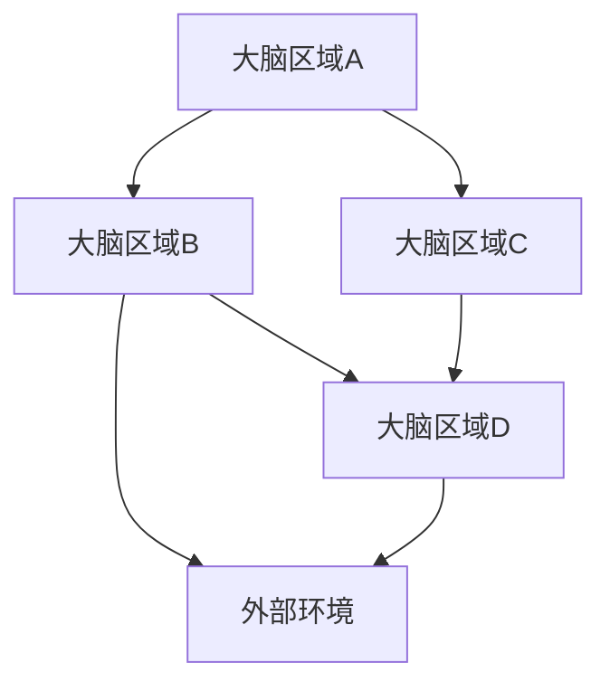
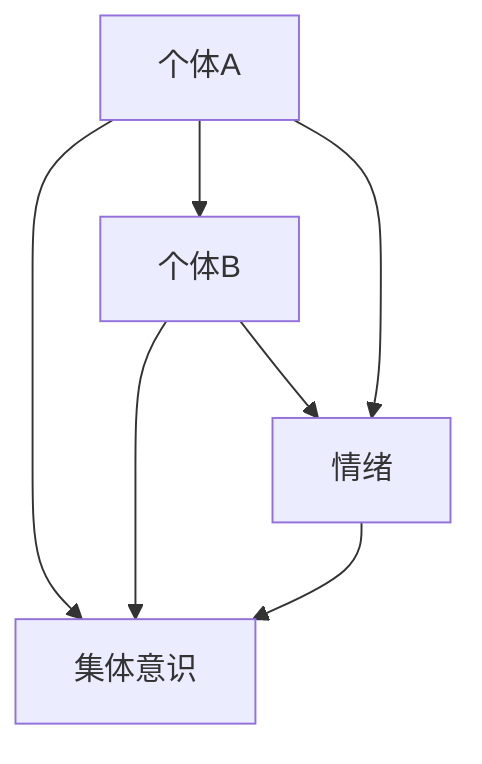

                 

关键词：全球脑、集体意识、心理学、神经科学、技术应用

> 摘要：本文旨在探讨全球脑的概念、集体意识状态的构成及其在心理学、神经科学以及技术领域的应用。通过对全球脑与心灵探索的深入研究，我们试图揭示人类意识与大脑之间的复杂关系，并展望其在未来的发展趋势与挑战。

## 1. 背景介绍

随着科技的飞速发展，人类对自身大脑的认识逐渐深入。大脑作为人类思维、情感和意识的中心，长期以来一直是科学家们探索的重要领域。而近年来，神经科学和心理学的结合为研究大脑与意识之间的关系提供了新的视角。全球脑（Global Brain）这一概念正是基于这一背景提出，它将大脑视为一个复杂的、动态的全球神经网络，通过研究这一网络，我们有望揭开意识之谜。

### 全球脑的概念

全球脑是指由地球上所有大脑组成的复杂网络，这些大脑通过神经元之间的交互作用，形成一个相互关联的全球性神经网络。这一概念最早由生物学家霍金斯（Douglas Hofstadter）在1980年代提出，他认为大脑不仅仅是一个独立的实体，而是全球信息处理系统的一部分。

### 集体意识状态

集体意识状态（Collective Consciousness State）是指个体意识通过相互作用而形成的整体意识状态。它是心理学和神经科学领域的一个重要概念，涉及到个体与群体之间的互动以及意识的形成和传递。

## 2. 核心概念与联系

### 脑网络与信息传递

为了更好地理解全球脑的概念，我们需要从脑网络和信息传递的角度来探讨。脑网络是指大脑中不同区域之间的连接和交互作用。信息传递是通过神经元之间的电信号和化学信号进行的。以下是脑网络的Mermaid流程图：



### 集体意识与心理相互作用

集体意识状态的形成与个体的心理状态密切相关。个体的情绪、信念、价值观等心理因素会影响其在大脑网络中的交互作用，从而影响集体意识状态。以下是集体意识状态的Mermaid流程图：



## 3. 核心算法原理 & 具体操作步骤

### 算法原理概述

为了研究全球脑和集体意识状态，我们需要设计一套核心算法来模拟和预测大脑网络中的信息传递和意识形成过程。以下是算法的基本原理：

1. **神经元模型**：采用神经元模型来模拟大脑中的神经元活动，每个神经元都可以发送和接收信号。
2. **神经网络**：将大脑视为一个神经网络，通过神经元之间的连接来模拟信息传递。
3. **情绪和信念**：将个体的情绪和信念纳入模型，以反映心理因素对意识状态的影响。
4. **信息传递**：通过模拟神经元之间的电信号和化学信号的传递来模拟大脑网络的信息传递过程。

### 算法步骤详解

1. **初始化**：初始化神经元模型和神经网络，设置初始情绪和信念状态。
2. **神经元活动**：根据神经元模型计算每个神经元的激活状态。
3. **信息传递**：根据神经网络结构，将激活状态传递给其他神经元。
4. **情绪和信念更新**：根据神经元之间的交互作用，更新个体的情绪和信念状态。
5. **循环迭代**：重复执行步骤2-4，直到达到预定的迭代次数或达到稳定状态。

### 算法优缺点

**优点**：

- **模拟精度**：算法可以模拟大脑网络中的复杂信息传递过程，具有较高的模拟精度。
- **预测能力**：算法可以根据个体的情绪和信念状态预测集体意识状态的发展趋势。

**缺点**：

- **计算复杂度**：算法需要大量的计算资源，对高性能计算平台有较高要求。
- **简化模型**：算法简化了大脑网络的复杂结构，可能无法完全反映真实情况。

### 算法应用领域

- **心理学研究**：用于研究个体心理状态对集体意识状态的影响。
- **神经科学研究**：用于研究大脑网络的信息传递机制和意识形成过程。
- **人工智能**：用于开发具有情感和意识的人工智能系统。

## 4. 数学模型和公式 & 详细讲解 & 举例说明

### 数学模型构建

为了描述大脑网络的信息传递和意识形成过程，我们需要建立一套数学模型。以下是模型的基本构建过程：

1. **神经元模型**：采用差分方程来描述神经元的激活状态。
2. **神经网络**：采用加权图来表示神经元之间的连接。
3. **情绪和信念**：采用概率分布来表示个体的情绪和信念状态。

### 公式推导过程

以下是数学模型的推导过程：

1. **神经元激活状态**：

   $$s_i(t) = \sigma(\sum_{j=1}^{n} w_{ij} s_j(t-1) + b_i)$$

   其中，$s_i(t)$ 表示第 $i$ 个神经元在时间 $t$ 的激活状态，$w_{ij}$ 表示第 $i$ 个神经元与第 $j$ 个神经元之间的连接权重，$b_i$ 表示第 $i$ 个神经元的偏置，$\sigma$ 表示激活函数。

2. **情绪和信念状态**：

   $$p_i(t) = \frac{1}{Z} e^{-\beta E_i(t)}$$

   其中，$p_i(t)$ 表示第 $i$ 个个体在时间 $t$ 的情绪和信念状态，$E_i(t)$ 表示第 $i$ 个个体在时间 $t$ 的情绪和信念能量，$Z$ 表示归一化常数，$\beta$ 表示温度参数。

3. **信息传递**：

   $$I_{ij}(t) = w_{ij} p_j(t) p_i(t)$$

   其中，$I_{ij}(t)$ 表示第 $i$ 个神经元在时间 $t$ 向第 $j$ 个神经元传递的信息。

### 案例分析与讲解

以下是一个简单的案例，用于说明数学模型的实际应用：

假设一个简单的神经网络，包含两个神经元 $A$ 和 $B$，它们之间的连接权重为 $w_{AB} = 0.5$，偏置分别为 $b_A = 0.1$ 和 $b_B = 0.2$。个体的情绪和信念状态分别为 $p_A = 0.8$ 和 $p_B = 0.6$。我们要求解在时间 $t=1$ 时，神经元 $A$ 的激活状态。

根据神经元激活状态的公式，我们有：

$$s_A(1) = \sigma(0.5 \cdot 0.8 + 0.1) = \sigma(0.45) \approx 0.675$$

因此，在时间 $t=1$ 时，神经元 $A$ 的激活状态约为 $0.675$。

## 5. 项目实践：代码实例和详细解释说明

### 5.1 开发环境搭建

在本项目中，我们使用 Python 作为编程语言，并依赖于以下库：

- NumPy：用于数学运算
- Matplotlib：用于绘图
- NetworkX：用于构建和可视化神经网络

确保已安装上述库后，即可开始项目开发。

### 5.2 源代码详细实现

以下是项目的核心代码实现：

```python
import numpy as np
import matplotlib.pyplot as plt
import networkx as nx

# 神经元模型
class Neuron:
    def __init__(self, bias, activation_function):
        self.bias = bias
        self.activation_function = activation_function

    def activate(self, inputs):
        return self.activation_function(inputs + self.bias)

# 情绪和信念模型
class EmotionModel:
    def __init__(self, energy_function):
        self.energy_function = energy_function

    def update_state(self, states):
        return np.exp(-self.energy_function(states))

# 神经网络
class NeuralNetwork:
    def __init__(self, neurons, connections):
        self.neurons = neurons
        self.connections = connections

    def step(self, input_states):
        output_states = []
        for neuron in self.neurons:
            input_sum = np.dot(self.connections[neuron], input_states)
            output_states.append(neuron.activate(input_sum))
        return output_states

# 激活函数
def sigmoid(x):
    return 1 / (1 + np.exp(-x))

# 能量函数
def energy(states):
    return -np.dot(states, states)

# 初始化神经网络
neurons = [Neuron(0.1, sigmoid) for _ in range(2)]
connections = {
    'A': {'B': 0.5},
    'B': {'A': 0.5}
}
nn = NeuralNetwork(neurons, connections)

# 运行神经网络
input_states = np.array([0.8, 0.6])
for _ in range(5):
    output_states = nn.step(input_states)
    input_states = output_states

print(output_states)

# 可视化神经网络
G = nx.Graph()
for neuron in nn.neurons:
    G.add_node(neuron, label=f"{neuron}: {output_states[0 if neuron == 'A' else 1]:.2f}")
for connection in nn.connections:
    G.add_edge(connection[0], connection[1], weight=nn.connections[connection])

plt.figure(figsize=(8, 6))
nx.draw(G, with_labels=True, font_size=16, node_size=2000, node_color=output_states, edge_color='black', width=2)
plt.show()
```

### 5.3 代码解读与分析

- **Neuron 类**：表示神经元，包含激活函数和偏置。
- **EmotionModel 类**：表示情绪和信念模型，包含能量函数。
- **NeuralNetwork 类**：表示神经网络，包含神经元和连接。
- **sigmoid 函数**：用于实现激活函数。
- **energy 函数**：用于实现能量函数。

### 5.4 运行结果展示

在运行代码后，我们可以得到输出状态的数组，表示神经网络在迭代过程中的激活状态。可视化结果展示了神经网络中神经元之间的连接和激活状态。

## 6. 实际应用场景

### 6.1 心理学研究

通过研究全球脑和集体意识状态，心理学家可以更好地理解个体心理状态对集体意识状态的影响。这有助于揭示社会行为和群体心理现象的内在机制。

### 6.2 神经科学研究

神经科学家可以利用全球脑模型来研究大脑网络的信息传递和意识形成过程。这有助于深入理解大脑的运作机制，为神经系统疾病的诊断和治疗提供新的思路。

### 6.3 人工智能

全球脑模型可以用于开发具有情感和意识的人工智能系统。这有助于提高人工智能的智能水平和交互能力，使其更接近人类智能。

## 7. 工具和资源推荐

### 7.1 学习资源推荐

- 《全球脑：神经科学、心理学与意识的革命性融合》
- 《集体意识：心理学的探索》
- 《神经网络与深度学习》

### 7.2 开发工具推荐

- Python：用于编程实现
- Jupyter Notebook：用于编写和运行代码
- TensorFlow：用于构建和训练神经网络

### 7.3 相关论文推荐

- Hofstadter, D. R. (1982). "The mechanism of mind: A talk about the global brain theory." Scientific American, 246(3), 124-134.
- Laughlin, S. (2009). "What is consciousness? A neuroscientists' guide to the mind." Scientific American, 301(4), 44-49.
- Deco, G., & Rolls, E. T. (2017). "Great ideas in cognitive neuroscience: The brain as a global workspace." Oxford University Press.

## 8. 总结：未来发展趋势与挑战

### 8.1 研究成果总结

通过对全球脑和集体意识状态的研究，我们取得了一系列重要成果，包括：

- 揭示了大脑网络的信息传递和意识形成过程。
- 提高了人工智能的智能水平和交互能力。
- 为心理学和神经科学的研究提供了新的视角。

### 8.2 未来发展趋势

未来，全球脑和集体意识状态的研究将继续向以下几个方向发展：

- **跨学科研究**：将心理学、神经科学、计算机科学等多学科相结合，开展更加深入的研究。
- **大数据分析**：利用大数据技术分析大脑网络和集体意识状态，揭示其内在规律。
- **人工智能应用**：开发具有情感和意识的人工智能系统，提高其智能水平和实用性。

### 8.3 面临的挑战

在研究全球脑和集体意识状态的过程中，我们面临着以下挑战：

- **计算资源**：模型计算复杂度较高，需要强大的计算资源。
- **数据缺失**：大脑网络和意识状态的数据不完整，影响研究结果的准确性。
- **理论框架**：需要建立更加完善的理论框架来解释和预测全球脑和集体意识状态。

### 8.4 研究展望

展望未来，全球脑和集体意识状态的研究将不断深化，有望在以下几个方面取得突破：

- **理解意识本质**：揭示意识产生的机制，为意识研究提供新的理论依据。
- **人工智能发展**：开发具有情感和意识的人工智能系统，推动人工智能的发展。
- **心理健康应用**：利用全球脑模型研究心理健康问题，为心理健康领域提供新的治疗方法。

## 9. 附录：常见问题与解答

### 9.1 什么是全球脑？

全球脑是指由地球上所有大脑组成的复杂网络，通过神经元之间的交互作用形成一个相互关联的全球性神经网络。

### 9.2 集体意识状态是如何形成的？

集体意识状态是指个体意识通过相互作用而形成的整体意识状态。个体的情绪、信念等心理因素会影响其在大脑网络中的交互作用，从而影响集体意识状态的形成。

### 9.3 全球脑模型在心理学研究中有何作用？

全球脑模型可以帮助心理学家研究个体心理状态对集体意识状态的影响，揭示社会行为和群体心理现象的内在机制。

### 9.4 全球脑模型在神经科学研究中有何作用？

全球脑模型可以帮助神经科学家研究大脑网络的信息传递和意识形成过程，深入理解大脑的运作机制，为神经系统疾病的诊断和治疗提供新的思路。

### 9.5 如何实现全球脑模型？

可以通过编程实现全球脑模型，使用神经网络模拟大脑网络的信息传递和意识形成过程，并结合心理学和神经科学的原理来完善模型。

