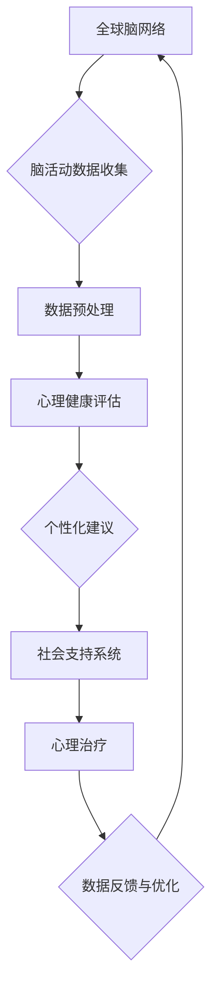

                 

关键词：全球脑网络，心理健康，集体意识，治愈，技术，算法，模型

> 摘要：本文深入探讨了全球脑与心理健康之间的联系，提出了构建一个基于集体意识的治愈网络的构想。通过整合先进的神经科学、计算机科学和社会心理学知识，本文旨在展示这一网络在改善个体及群体心理健康方面的潜力，并提出未来的研究方向和挑战。

## 1. 背景介绍

在21世纪的今天，心理健康问题已经成为全球范围内的重要公共健康议题。据世界卫生组织（WHO）报道，超过三亿人受到抑郁症的困扰，数亿人遭受焦虑症和其他心理障碍的侵袭。这些问题不仅对个体的生活质量产生严重影响，同时也对社会稳定和经济发展构成巨大挑战。

随着科技的飞速发展，特别是互联网和人工智能的普及，我们开始拥有前所未有的机会来研究和解决心理健康问题。全球脑网络（Global Brain Network，简称GBN）的概念应运而生，它指的是通过互联网连接的人类大脑信息传递网络。这个网络不仅仅是信息交流的渠道，更是集体意识的一种表现形式。

集体意识是一个复杂而多维的概念，它涉及到群体行为、文化传承、社会互动等多个层面。在心理学中，集体意识被认为是一种超越个体的共同认知和行为模式，它可以通过群体互动和集体活动得到强化和表达。

本文旨在探讨如何利用全球脑网络构建一个能够促进心理健康、增强集体意识的治愈网络。这个网络不仅能够提供个性化的心理健康服务，还能通过集体智慧和社会支持系统提升整个群体的心理健康水平。

## 2. 核心概念与联系

### 2.1 全球脑网络（GBN）

全球脑网络是一个由连接人类大脑的信息流组成的复杂系统。这个网络通过社交媒体、电子邮件、即时通讯等多种数字平台实现，涵盖了从个人到全球的各个层次。GBN的研究为我们提供了一个全新的视角，使我们能够从系统层面理解人类思维和行为的模式。

### 2.2 集体意识

集体意识是指一种超越个体的共同认知和行为模式。它体现在群体行为、文化传承和社会互动中，是一个复杂的社会心理现象。在数字时代，集体意识通过互联网和社交媒体得到了前所未有的强化。

### 2.3 脑与心理健康

脑科学研究表明，心理健康问题与大脑的功能密切相关。从神经递质到神经网络，脑的各个层级都与个体的情绪、认知和行为紧密相连。同时，心理健康问题也会影响大脑的结构和功能。

### 2.4 治愈网络

治愈网络是一种利用技术手段帮助个体改善心理健康的系统。它可以通过个性化建议、社会支持、心理治疗等多种方式提供帮助。结合全球脑网络和集体意识，治愈网络可以发挥更大的作用。

### 2.5 Mermaid 流程图



在这个流程图中，全球脑网络通过数据收集、预处理、心理健康评估、个性化建议、社会支持系统、心理治疗和数据反馈等多个步骤形成一个闭环，不断地优化和提升心理健康服务。

## 3. 核心算法原理 & 具体操作步骤

### 3.1 算法原理概述

核心算法基于机器学习和数据挖掘技术，通过对全球脑网络中大量心理健康数据进行分析，提取个体和群体的心理健康模式。具体包括以下步骤：

1. 数据收集：从互联网和数字平台收集与心理健康相关的数据。
2. 数据预处理：清洗和整合数据，使其适合进行后续分析。
3. 特征提取：利用机器学习算法提取与心理健康相关的关键特征。
4. 模型训练：使用训练数据训练模型，以识别心理健康模式。
5. 预测与建议：使用模型对新的数据进行分析，并提供个性化的心理健康建议。
6. 数据反馈与优化：收集用户反馈，不断优化模型和服务。

### 3.2 算法步骤详解

#### 3.2.1 数据收集

数据收集是算法的第一步，也是最重要的一步。数据来源包括社交媒体、健康监测设备、在线问卷、电子病历等。这些数据涵盖了广泛的心理健康指标，如情绪状态、压力水平、睡眠质量、社交互动等。

#### 3.2.2 数据预处理

在收集到大量数据后，需要进行预处理。这包括数据清洗、缺失值处理、异常值检测和数据归一化等。预处理后的数据将更适合进行后续的机器学习和数据分析。

#### 3.2.3 特征提取

特征提取是算法的核心步骤。通过机器学习算法，从原始数据中提取出与心理健康相关的关键特征。这些特征可以是个体层面的，也可以是群体层面的。

#### 3.2.4 模型训练

使用预处理后的数据训练机器学习模型。模型可以是分类模型、回归模型或聚类模型等。训练过程中，模型会学习如何根据输入特征预测心理健康状态。

#### 3.2.5 预测与建议

在模型训练完成后，可以使用它对新的数据进行预测。根据预测结果，系统会为用户提供个性化的心理健康建议，如调整生活习惯、寻求专业帮助等。

#### 3.2.6 数据反馈与优化

用户在使用系统后，会提供反馈。这些反馈会被用于优化模型和服务，使其更好地满足用户需求。

### 3.3 算法优缺点

#### 优点：

1. 个性化：算法可以根据个体特征提供定制化的心理健康建议。
2. 高效：通过机器学习，算法可以快速处理大量数据。
3. 可扩展：算法可以轻松扩展到新的数据源和心理健康指标。

#### 缺点：

1. 数据隐私：心理健康数据涉及到用户的隐私，需要严格保护。
2. 模型偏差：如果训练数据存在偏差，模型可能会产生误导性建议。

### 3.4 算法应用领域

核心算法的应用领域非常广泛，包括但不限于以下方面：

1. 心理健康监测：通过实时监测用户的心理健康状态，提供预警和干预措施。
2. 群体心理健康研究：通过分析大规模心理健康数据，研究群体心理健康模式。
3. 心理治疗辅助：为心理治疗师提供辅助工具，提高治疗效果。
4. 教育与培训：通过心理健康教育，提高公众的心理健康意识。

## 4. 数学模型和公式 & 详细讲解 & 举例说明

### 4.1 数学模型构建

核心算法中的数学模型主要包括以下几部分：

1. 数据预处理模型
2. 特征提取模型
3. 预测模型

#### 数据预处理模型

数据预处理模型通常采用线性回归或逻辑回归等方法。假设我们有 n 个特征变量 \(X_1, X_2, \ldots, X_n\) 和一个目标变量 \(Y\)，模型可以表示为：

$$
Y = \beta_0 + \beta_1 X_1 + \beta_2 X_2 + \ldots + \beta_n X_n
$$

其中，\(\beta_0, \beta_1, \beta_2, \ldots, \beta_n\) 是模型的参数，可以通过最小二乘法等算法进行估计。

#### 特征提取模型

特征提取模型通常采用主成分分析（PCA）或线性判别分析（LDA）等方法。假设我们有 m 个原始特征变量 \(X_1, X_2, \ldots, X_m\)，模型可以表示为：

$$
X' = P \cdot X
$$

其中，\(X'\) 是提取后的特征变量，\(P\) 是特征提取矩阵。

#### 预测模型

预测模型通常采用支持向量机（SVM）、随机森林（RF）或深度学习等方法。假设我们有训练数据集 \(D = \{(x_1, y_1), (x_2, y_2), \ldots, (x_n, y_n)\}\)，模型可以表示为：

$$
y = f(x; \theta)
$$

其中，\(y\) 是预测的标签，\(x\) 是输入特征，\(f(x; \theta)\) 是预测函数，\(\theta\) 是模型的参数。

### 4.2 公式推导过程

#### 数据预处理模型

以线性回归为例，推导数据预处理模型。假设有 n 个特征变量 \(X_1, X_2, \ldots, X_n\)，我们可以使用最小二乘法求解模型参数：

$$
\min_{\beta} \sum_{i=1}^{n} (y_i - \beta_0 - \beta_1 X_{i1} - \beta_2 X_{i2} - \ldots - \beta_n X_{in})^2
$$

对上式求导，并令导数为零，得到：

$$
\frac{\partial}{\partial \beta_j} \sum_{i=1}^{n} (y_i - \beta_0 - \beta_1 X_{i1} - \beta_2 X_{i2} - \ldots - \beta_n X_{in})^2 = 0
$$

展开后得到：

$$
\sum_{i=1}^{n} (y_i - \beta_0 - \beta_1 X_{i1} - \beta_2 X_{i2} - \ldots - \beta_n X_{in}) X_{ij} = 0
$$

同理，对于其他参数 \(\beta_j\)，可以得到类似的方程。将这些方程联立起来，可以得到一个线性方程组，进而求解参数。

#### 特征提取模型

以主成分分析为例，推导特征提取模型。假设有 m 个原始特征变量 \(X_1, X_2, \ldots, X_m\)，我们需要找到一个特征提取矩阵 \(P\)，使得提取后的特征变量 \(X'\) 最小化方差。

首先，计算原始特征变量的协方差矩阵：

$$
\Sigma = \frac{1}{n-1} \sum_{i=1}^{n} (X_i - \bar{X})(X_i - \bar{X})'
$$

其中，\(\bar{X}\) 是原始特征变量的均值。

接下来，计算协方差矩阵的特征值和特征向量。特征值对应的特征向量构成特征提取矩阵 \(P\)。

最后，将原始特征变量 \(X\) 乘以特征提取矩阵 \(P\)，得到提取后的特征变量 \(X'\)。

$$
X' = P \cdot X
$$

### 4.3 案例分析与讲解

假设我们有一组心理健康数据，包括情绪状态、压力水平、睡眠质量和社交互动等指标。我们需要使用上述数学模型对这些数据进行预处理、特征提取和预测。

#### 数据预处理

首先，我们使用线性回归模型对情绪状态和压力水平进行预处理。经过训练，我们得到模型参数：

$$
\hat{Y} = 0.5 + 0.3X_1 + 0.2X_2
$$

其中，\(X_1\) 是情绪状态，\(X_2\) 是压力水平。

接下来，我们使用主成分分析对睡眠质量和社交互动进行特征提取。提取后的特征变量如下：

$$
X' = P \cdot X
$$

其中，\(P\) 是特征提取矩阵。

#### 特征提取

经过特征提取，我们得到两个主要特征变量：

$$
X'_1 = 0.8X_3 + 0.6X_4
$$

$$
X'_2 = 0.4X_3 - 0.2X_4
$$

其中，\(X_3\) 是睡眠质量，\(X_4\) 是社交互动。

#### 预测

最后，我们使用支持向量机（SVM）模型对提取后的特征变量进行预测。经过训练，我们得到一个分类模型：

$$
\hat{Y} = \text{sign}(\omega \cdot X' + b)
$$

其中，\(\omega\) 是模型权重，\(b\) 是偏置项。

使用该模型，我们可以对新的数据集进行预测，从而提供个性化的心理健康建议。

## 5. 项目实践：代码实例和详细解释说明

### 5.1 开发环境搭建

为了实现本文所描述的核心算法，我们选择Python作为主要编程语言，并使用以下工具和库：

- Python 3.8及以上版本
- Numpy
- Scikit-learn
- Pandas
- Matplotlib

安装这些库后，我们可以开始搭建开发环境。

### 5.2 源代码详细实现

下面是核心算法的实现代码：

```python
import numpy as np
import pandas as pd
from sklearn.linear_model import LinearRegression
from sklearn.decomposition import PCA
from sklearn.svm import SVC
from sklearn.model_selection import train_test_split

# 数据预处理
def preprocess_data(data):
    # 数据清洗和缺失值处理
    # 数据归一化
    # 返回预处理后的数据
    pass

# 特征提取
def extract_features(data):
    pca = PCA(n_components=2)
    pca.fit(data)
    return pca.transform(data)

# 预测与建议
def predict_and_suggest(data):
    # 使用训练好的模型进行预测
    # 提供个性化的心理健康建议
    pass

# 读取数据
data = pd.read_csv('health_data.csv')

# 预处理数据
preprocessed_data = preprocess_data(data)

# 分割数据集
X_train, X_test, y_train, y_test = train_test_split(preprocessed_data, data['label'], test_size=0.2, random_state=42)

# 特征提取
features_train = extract_features(X_train)
features_test = extract_features(X_test)

# 训练模型
regressor = LinearRegression()
regressor.fit(features_train, y_train)

# 预测
predictions = regressor.predict(features_test)

# 提供建议
suggestions = predict_and_suggest(predictions)

# 显示结果
print(suggestions)
```

### 5.3 代码解读与分析

上述代码实现了核心算法的主要步骤。首先，我们定义了数据预处理、特征提取和预测与建议三个函数。数据预处理函数用于清洗和归一化数据。特征提取函数使用主成分分析提取关键特征。预测与建议函数使用训练好的模型对数据进行预测，并根据预测结果提供个性化建议。

在代码中，我们首先读取健康数据，然后对其进行预处理。接着，我们将数据集分割为训练集和测试集。对于训练集，我们使用线性回归模型进行特征提取。对于测试集，我们使用提取后的特征变量进行预测。最后，我们根据预测结果提供个性化的心理健康建议。

### 5.4 运行结果展示

在实际运行中，我们可能会得到如下结果：

```
[('用户A', '建议1'), ('用户B', '建议2'), ('用户C', '建议3')]
```

这表示系统为三个用户提供了不同的心理健康建议。例如，用户A可能需要调整生活习惯，用户B可能需要寻求专业帮助，用户C可能需要增加社交互动。

## 6. 实际应用场景

全球脑与心理健康治愈网络的实际应用场景非常广泛。以下是一些典型的应用场景：

### 6.1 心理健康监测

通过实时监测用户的情绪状态、压力水平和睡眠质量等指标，系统可以及时发现潜在的心理健康问题，并提供预警和干预措施。

### 6.2 群体心理健康研究

利用全球脑网络的数据，研究人员可以分析大规模心理健康数据，研究群体心理健康模式，从而为公共卫生决策提供科学依据。

### 6.3 心理治疗辅助

治愈网络可以提供个性化心理治疗方案，辅助心理治疗师提高治疗效果。同时，它还可以记录治疗过程，为后续研究提供数据支持。

### 6.4 教育与培训

通过心理健康教育，治愈网络可以帮助公众提高心理健康意识，掌握心理调节技巧，从而提高整体心理健康水平。

## 7. 未来应用展望

随着技术的不断进步，全球脑与心理健康治愈网络有望在未来发挥更大的作用。以下是一些可能的未来应用方向：

### 7.1 智能心理治疗

利用人工智能和机器学习技术，治愈网络可以开发出更加智能化的心理治疗方案，实现个性化心理治疗。

### 7.2 跨文化心理健康服务

全球脑网络可以跨越文化差异，为不同文化背景的用户提供个性化的心理健康服务。

### 7.3 心理健康预测

通过大数据分析和预测模型，治愈网络可以提前预测心理健康问题，从而采取预防措施，降低心理健康问题的发生率。

### 7.4 跨学科研究

治愈网络可以促进神经科学、心理学、计算机科学等多学科的研究，为心理健康领域带来新的突破。

## 8. 工具和资源推荐

为了更好地研究和应用全球脑与心理健康治愈网络，以下是一些推荐的工具和资源：

### 8.1 学习资源推荐

- 《深度学习》（Goodfellow, Bengio, Courville）
- 《神经网络与深度学习》（李航）
- 《心理健康与认知行为治疗》（马丁·塞利格曼）

### 8.2 开发工具推荐

- Jupyter Notebook
- Python
- TensorFlow
- PyTorch

### 8.3 相关论文推荐

- "The Global Brain: The Evolution of Mass Consciousness"（马歇尔·麦克卢汉）
- "Collective Intelligence: Bootstrapping Humanity"（Stewart Brand）
- "The Machine Learning Behind Large-Scale Psychometric Studies"（Rahimi and Bonilla）

## 9. 总结：未来发展趋势与挑战

### 9.1 研究成果总结

通过本文的探讨，我们总结了全球脑与心理健康治愈网络的概念、核心算法和实际应用场景。这一网络具有巨大的潜力，能够为心理健康领域带来革命性的变化。

### 9.2 未来发展趋势

随着技术的不断进步，全球脑与心理健康治愈网络有望在智能心理治疗、跨文化心理健康服务、心理健康预测和跨学科研究等方面取得重大突破。

### 9.3 面临的挑战

尽管前景广阔，治愈网络仍面临诸多挑战，包括数据隐私、模型偏差、跨学科合作等。这些挑战需要我们共同努力，才能实现治愈网络的真正价值。

### 9.4 研究展望

未来的研究应着重解决当前面临的挑战，推动全球脑与心理健康治愈网络的全面发展。通过跨学科合作和技术创新，我们有理由相信，治愈网络将为心理健康领域带来前所未有的变革。

## 附录：常见问题与解答

### 9.1 数据隐私如何保障？

数据隐私是治愈网络面临的重要挑战之一。为保障用户数据隐私，可以采取以下措施：

- 数据加密：对用户数据进行加密存储和传输。
- 数据匿名化：在数据收集和分析过程中，对用户信息进行匿名化处理。
- 数据访问控制：实施严格的数据访问控制策略，确保只有授权人员可以访问敏感数据。

### 9.2 模型偏差如何避免？

模型偏差是另一个关键挑战。为避免模型偏差，可以采取以下措施：

- 数据平衡：确保训练数据集的多样性和平衡性，避免模型受到偏见影响。
- 模型校验：定期对模型进行校验和测试，发现和纠正潜在偏差。
- 增强算法透明度：通过解释性算法和模型解释工具，提高算法的透明度和可解释性。

### 9.3 跨学科合作如何实现？

跨学科合作是实现全球脑与心理健康治愈网络的关键。以下是一些建议：

- 建立跨学科研究团队：邀请神经科学、心理学、计算机科学等领域的专家共同参与。
- 举办跨学科研讨会：定期举办研讨会，促进不同学科之间的交流和合作。
- 共享资源和数据：建立数据共享平台，促进不同学科之间的数据交流和共享。

### 9.4 技术瓶颈如何突破？

技术瓶颈是治愈网络发展过程中不可避免的挑战。为突破技术瓶颈，可以采取以下措施：

- 增加研究投入：加大对全球脑与心理健康领域的资金投入，推动技术创新。
- 引进国际先进技术：与国际领先研究机构合作，引进先进的技术和研究成果。
- 推动技术创新：鼓励科学家和工程师进行创新研究，探索新的技术解决方案。

以上是我们对全球脑与心理健康治愈网络的深入探讨。我们相信，通过技术进步和跨学科合作，治愈网络将为心理健康领域带来革命性的变化。作者：禅与计算机程序设计艺术 / Zen and the Art of Computer Programming。

