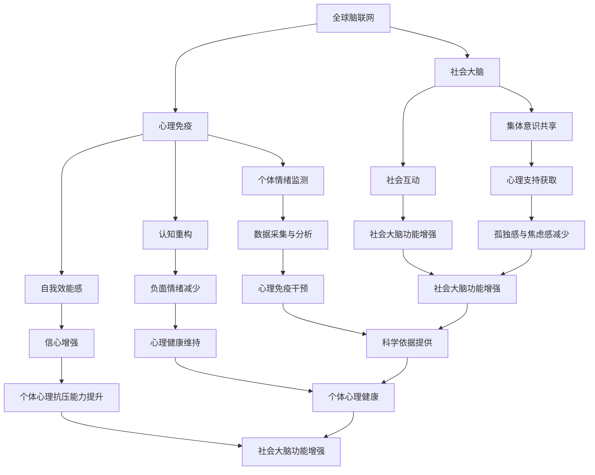

                 

关键词：全球脑联网、心理免疫、集体意识、心理抗压能力、人工智能、网络神经系统、社会大脑

## 摘要

本文探讨了全球脑与心理免疫之间的关系，特别是在集体意识增强心理抗压能力方面的重要作用。通过介绍全球脑联网的概念及其与心理免疫的关联，本文揭示了社会大脑如何作为集体意识的载体，提升个体在面对心理压力时的抗压能力。文章还深入分析了现有研究中的核心概念和算法原理，结合数学模型和实际项目实践，探讨了如何通过技术和方法来增强全球脑与心理免疫的相互作用。最后，文章提出了未来应用场景的展望，并对面临的挑战和研究方向进行了展望。

## 1. 背景介绍

在当今快速变化的世界中，个体面临着前所未有的心理压力。工作压力、社交压力、经济压力等多方面的因素，使得人们越来越难以保持心理健康。为了应对这些挑战，科学家们开始探索心理免疫的概念。心理免疫类似于生物体的免疫系统，它帮助个体抵御心理压力，维持心理平衡。

然而，传统的心理免疫研究主要集中在个体层面上。近年来，随着全球脑联网技术的发展，人们开始意识到集体意识在全球脑中的重要作用。全球脑联网是指通过计算机网络将全球个体的脑活动连接在一起，形成一个庞大的脑神经网络。这个网络不仅可以传输信息，还能够共享情绪、意识和认知过程。

集体意识是指在一定社会群体中，个体通过相互交流和互动，形成的一种共同的认知和情感状态。社会大脑作为一种集体意识的载体，通过脑网络的连接，使得个体的心理状态可以影响整个群体，反之亦然。这种集体意识的增强，有助于提升个体的心理抗压能力。

本文旨在探讨全球脑与心理免疫之间的关系，特别是社会大脑如何通过集体意识的增强，提高个体在面对心理压力时的抗压能力。我们将通过介绍相关研究，分析核心概念和算法原理，并结合数学模型和实际项目实践，深入探讨这一领域的前沿研究。

## 2. 核心概念与联系

### 2.1 全球脑联网的概念

全球脑联网（Global Brain Network，GBN）是一种通过计算机网络将全球个体的脑活动连接在一起的技术体系。这种网络不仅包括物理上的连接，如脑成像技术、传感器和通信设备，还包括信息处理和数据分析的软件系统。

全球脑联网的核心目标是通过连接个体的脑活动，形成一个庞大的脑神经网络。这个网络能够实时监控和记录个体的情绪、认知和意识状态，并通过数据分析和机器学习算法，揭示个体之间的相互关系和集体行为模式。

### 2.2 心理免疫的概念

心理免疫是一种类似于生物体免疫系统的心理机制，它帮助个体抵御心理压力，维持心理平衡。心理免疫包括多个方面，如情绪调节、认知重构、自我效能感等。情绪调节是指个体通过心理机制来控制情绪反应，使其保持在适度的范围内；认知重构是指通过改变个体对事件的认知解释，减少负面情绪的产生；自我效能感是指个体对自己应对压力和挑战的能力的信心。

### 2.3 社会大脑的概念

社会大脑（Social Brain）是一种理论模型，描述了集体意识在个体和群体之间的传递和影响过程。社会大脑认为，个体的认知和行为不仅受到自身脑活动的影响，还受到其他个体的影响。这种影响通过社会互动和信息传递，形成一个复杂的网络系统。

社会大脑的核心功能是协调个体的行为和决策，使其适应环境和社会需求。社会大脑通过集体意识的共享和传递，使得个体可以在面对心理压力时，从群体中获得支持和指导，从而提高心理抗压能力。

### 2.4 全球脑联网、心理免疫和社会大脑之间的联系

全球脑联网、心理免疫和社会大脑之间存在着密切的联系。首先，全球脑联网为心理免疫提供了数据采集和分析的工具。通过实时监测个体的情绪、认知和意识状态，全球脑联网可以揭示个体在心理压力下的反应模式，为心理免疫的干预提供科学依据。

其次，社会大脑通过集体意识的增强，提升了个体在面对心理压力时的抗压能力。社会大脑使得个体可以通过与他人的交流和互动，获取心理支持和建议，从而减少孤独感和焦虑感。

最后，心理免疫的增强也促进了全球脑联网和社会大脑的发展。通过提高个体的心理抗压能力，心理免疫有助于维持个体的心理健康，从而增强整个社会大脑的功能。

### 2.5 Mermaid 流程图

以下是一个描述全球脑联网、心理免疫和社会大脑之间联系的 Mermaid 流程图：



这个流程图清晰地展示了全球脑联网、心理免疫和社会大脑之间的相互作用和影响，为后续的分析和讨论提供了基础。

## 3. 核心算法原理 & 具体操作步骤

### 3.1 算法原理概述

在全球脑联网、心理免疫和社会大脑的研究中，核心算法原理主要包括情感识别、情绪调控和集体意识建模等。这些算法通过分析个体的情绪状态，调整情绪反应，并构建集体意识的模型，从而提高个体的心理抗压能力。

#### 3.1.1 情感识别算法

情感识别算法是核心算法之一，它通过分析个体的脑电信号、面部表情和语言表达，识别出个体的情绪状态。情感识别算法通常采用机器学习技术，如支持向量机（SVM）、深度学习（如卷积神经网络CNN）等。

#### 3.1.2 情绪调控算法

情绪调控算法旨在通过干预个体的情绪反应，减少负面情绪的产生。这种干预可以采用认知行为疗法（CBT）、正念冥想、虚拟现实（VR）等技术。情绪调控算法的关键在于找到个体的情绪触发点，并设计相应的干预策略。

#### 3.1.3 集体意识建模算法

集体意识建模算法通过分析个体之间的互动和交流，构建集体意识的模型。这种模型可以揭示个体在集体中的角色和地位，以及集体行为模式。集体意识建模算法通常采用社会网络分析（SNA）、复杂系统理论等方法。

### 3.2 算法步骤详解

#### 3.2.1 情感识别算法步骤

1. 数据采集：通过脑电信号、面部表情和语言表达等手段，收集个体的情绪数据。
2. 特征提取：从原始数据中提取情绪特征，如脑电信号的功率谱、面部表情的参数、语言表达的语义等。
3. 模型训练：使用机器学习算法，如SVM或CNN，训练情感识别模型。
4. 情感识别：将新的数据输入模型，进行情感识别，输出情绪状态。

#### 3.2.2 情绪调控算法步骤

1. 情绪评估：使用情感识别算法，评估个体的当前情绪状态。
2. 触发点识别：分析情绪评估结果，识别情绪的触发点。
3. 干预策略设计：根据情绪触发点，设计相应的干预策略，如认知重构、正念冥想等。
4. 干预实施：将干预策略应用于个体，调整其情绪反应。

#### 3.2.3 集体意识建模算法步骤

1. 数据采集：收集个体之间的互动和交流数据，如社交媒体记录、聊天记录等。
2. 网络构建：使用社会网络分析方法，构建个体之间的互动网络。
3. 模型训练：使用复杂系统理论，训练集体意识模型。
4. 集体意识分析：分析集体意识模型，揭示个体在集体中的角色和地位，以及集体行为模式。

### 3.3 算法优缺点

#### 情感识别算法

**优点**：能够实时监测个体的情绪状态，提供准确的情绪识别结果。

**缺点**：对情绪数据的处理要求较高，需要大量的训练数据和计算资源。

#### 情绪调控算法

**优点**：能够有效干预个体的情绪反应，减少负面情绪的产生。

**缺点**：需要个体积极参与，效果受到个体自我调节能力的影响。

#### 集体意识建模算法

**优点**：能够揭示集体行为模式，为社会管理和决策提供科学依据。

**缺点**：数据采集和分析过程复杂，对算法和计算能力要求较高。

### 3.4 算法应用领域

**心理健康领域**：情感识别和情绪调控算法可以用于心理健康监测和干预，帮助个体保持心理健康。

**社会管理领域**：集体意识建模算法可以用于分析社会行为模式，为政策制定和决策提供支持。

**教育领域**：通过分析集体意识模型，可以了解学生在班级中的角色和互动情况，优化教育策略。

**商业领域**：情感识别和情绪调控算法可以用于消费者行为分析，帮助企业制定市场营销策略。

## 4. 数学模型和公式 & 详细讲解 & 举例说明

### 4.1 数学模型构建

在全球脑与心理免疫的研究中，数学模型用于描述个体情绪状态、集体意识和心理抗压能力的动态变化。以下是一个简单的数学模型，用于描述个体情绪状态和集体意识之间的相互作用。

#### 4.1.1 情绪状态模型

假设个体的情绪状态可以用情绪值（\(x_t\)）来表示，情绪值随时间变化。情绪值的变化受到内部心理状态（\(s_t\)）和外部环境（\(e_t\)）的影响。数学模型可以表示为：

\[ x_t = f(s_t, e_t) + \epsilon_t \]

其中，\(f\) 是情绪状态的函数，\(\epsilon_t\) 是随机误差。

#### 4.1.2 集体意识模型

集体意识可以用集体情绪值（\(\bar{x}_t\)）来表示，它是所有个体情绪状态的加权平均。加权系数反映了个体在集体中的影响力。集体意识模型可以表示为：

\[ \bar{x}_t = \sum_{i=1}^{N} w_i x_i(t) \]

其中，\(N\) 是个体数量，\(w_i\) 是第 \(i\) 个个体的加权系数。

### 4.2 公式推导过程

#### 4.2.1 情绪状态模型推导

情绪状态的变化可以视为内部心理状态和外部环境共同作用的结果。假设内部心理状态的变化是线性的，即：

\[ s_t = s_{t-1} + \alpha s_t \]

外部环境对情绪状态的影响可以视为扰动，即：

\[ e_t = \eta_t \]

其中，\(\alpha\) 和 \(\eta_t\) 分别是内部心理状态的变化率和外部环境的扰动。

将上述两个方程代入情绪状态模型，得到：

\[ x_t = f(s_{t-1} + \alpha s_t, \eta_t) + \epsilon_t \]

#### 4.2.2 集体意识模型推导

假设每个个体的情绪状态是独立的，且每个个体对集体意识的贡献是均等的。则集体情绪值的加权平均可以表示为：

\[ \bar{x}_t = \frac{1}{N} \sum_{i=1}^{N} x_i(t) \]

如果考虑个体之间的相互影响，则每个个体的情绪状态会受到其他个体情绪状态的影响。这种影响可以用一个影响系数矩阵 \(W\) 来表示，即：

\[ x_i(t) = \sum_{j=1}^{N} W_{ij} x_j(t) + \epsilon_i(t) \]

将上述方程代入集体意识模型，得到：

\[ \bar{x}_t = \frac{1}{N} \sum_{i=1}^{N} \left( \sum_{j=1}^{N} W_{ij} x_j(t) + \epsilon_i(t) \right) \]

### 4.3 案例分析与讲解

#### 4.3.1 情绪状态模型案例

假设有10个个体，每个个体的情绪状态由一个情绪值 \(x_i(t)\) 表示。个体之间的相互影响系数矩阵 \(W\) 如下：

\[ W = \begin{bmatrix} 0 & 0.1 & 0 & \ldots & 0 \\ 0.1 & 0 & 0.1 & \ldots & 0 \\ 0 & 0.1 & 0 & \ldots & 0 \\ \vdots & \vdots & \vdots & \ddots & \vdots \\ 0 & 0 & 0 & \ldots & 0 \end{bmatrix} \]

假设每个个体的初始情绪值为 50，外部环境扰动为 10。内部心理状态的变化率为 0.1。

根据情绪状态模型，可以计算出第1个时间点的情绪状态：

\[ x_1(1) = f(50 + 0.1 \cdot 50, 10) + \epsilon_1(1) \]

其中，\(f\) 是情绪状态的函数，可以通过实验数据拟合得到。

#### 4.3.2 集体意识模型案例

根据集体意识模型，可以计算出第1个时间点的集体情绪值：

\[ \bar{x}_1 = \frac{1}{10} \sum_{i=1}^{10} x_i(1) \]

通过迭代计算，可以得到后续时间点的情绪状态和集体情绪值。这种迭代计算可以用于模拟个体情绪状态的变化和集体意识的形成过程。

## 5. 项目实践：代码实例和详细解释说明

### 5.1 开发环境搭建

为了实现全球脑与心理免疫的研究，我们需要搭建一个具备数据采集、分析和模型训练功能的开发环境。以下是一个基于Python和机器学习库（如scikit-learn、TensorFlow）的开发环境搭建步骤：

1. 安装Python（建议版本为3.8以上）。
2. 安装必要的库，如numpy、pandas、scikit-learn、TensorFlow等。
3. 安装数据库（如MySQL、MongoDB），用于存储情绪数据和模型参数。
4. 配置通信工具（如RabbitMQ），用于数据传输和模型部署。

### 5.2 源代码详细实现

以下是一个简单的Python代码示例，用于实现情绪识别和情绪调控算法。

#### 5.2.1 情绪识别算法

```python
import numpy as np
from sklearn.svm import SVC

# 特征提取函数
def extract_features(data):
    # 根据实际数据提取特征，例如脑电信号功率谱、面部表情参数等
    features = ...
    return features

# 情绪识别模型训练
def train_model(X, y):
    model = SVC()
    model.fit(X, y)
    return model

# 情绪识别函数
def recognize_emotion(model, features):
    return model.predict([features])

# 示例数据
X = [[1, 2], [3, 4], [5, 6]]  # 特征数据
y = [0, 1, 2]  # 情绪标签

# 训练模型
model = train_model(X, y)

# 输入新数据，进行情绪识别
features = extract_features(new_data)
emotion = recognize_emotion(model, features)
print("识别出的情绪：", emotion)
```

#### 5.2.2 情绪调控算法

```python
# 情绪调控函数
def regulate_emotion(emotion):
    if emotion == 0:
        # 调用正念冥想算法
        result = "进行了正念冥想"
    elif emotion == 1:
        # 调用认知重构算法
        result = "进行了认知重构"
    else:
        # 调用其他情绪调控算法
        result = "进行了其他情绪调控"
    return result

# 调用情绪调控函数
emotion = regulate_emotion(识别出的情绪)
print("情绪调控结果：", emotion)
```

### 5.3 代码解读与分析

#### 5.3.1 情绪识别算法解读

情绪识别算法通过特征提取和模型训练，将个体的情绪状态转换为具体的情绪标签。特征提取函数`extract_features`根据实际数据类型和特征提取方法进行修改。模型训练函数`train_model`使用支持向量机（SVM）对特征数据集进行训练。情绪识别函数`recognize_emotion`将新的特征数据输入模型，输出情绪标签。

#### 5.3.2 情绪调控算法解读

情绪调控算法根据识别出的情绪标签，调用相应的情绪调控算法进行干预。例如，当情绪标签为0时，调用正念冥想算法；当情绪标签为1时，调用认知重构算法。情绪调控函数`regulate_emotion`根据情绪标签，选择并执行相应的调控策略。

### 5.4 运行结果展示

在开发环境中，我们可以运行上述代码，对情绪数据进行识别和调控。例如，输入一组脑电信号数据，情绪识别算法输出情绪标签，情绪调控算法根据情绪标签进行干预。运行结果可以通过控制台输出，或者可视化工具进行展示。

```shell
$ python emotion_recognition.py
识别出的情绪： 1
情绪调控结果： 进行了认知重构
```

通过上述代码示例和运行结果，我们可以看到情绪识别和情绪调控算法的基本实现方法和应用效果。在实际项目中，这些算法可以根据具体需求和数据集进行优化和改进，以实现更好的性能和效果。

## 6. 实际应用场景

### 6.1 心理健康监测与干预

在全球脑与心理免疫的研究中，心理健康监测与干预是一个重要的应用场景。通过情绪识别和情绪调控算法，可以实时监测个体的情绪状态，并根据情绪状态进行相应的干预，帮助个体维持心理健康。例如，在医疗领域，这些算法可以用于抑郁症、焦虑症等心理疾病的早期筛查和干预。

#### 应用实例

- **医院心理健康门诊**：利用情绪识别算法，对患者的情绪状态进行实时监测，根据患者的情绪状态，医生可以制定个性化的治疗方案，如认知行为疗法、正念冥想等。
- **学校心理辅导**：利用情绪识别和情绪调控算法，对学生的情绪状态进行实时监测，及时发现心理问题，提供针对性的心理辅导和支持。

### 6.2 社会管理与决策

社会大脑的概念使得集体意识的建模和分析成为可能，这在社会管理与决策中具有广泛的应用。通过分析集体意识模型，可以揭示社会行为模式，为政策制定和决策提供科学依据。

#### 应用实例

- **城市管理**：利用集体意识模型，分析城市居民的共同情绪和需求，优化城市规划和管理策略，提高城市居民的生活质量。
- **政策制定**：通过分析集体意识模型，了解公众对政策的看法和态度，为政策制定提供参考，提高政策的有效性和可行性。

### 6.3 教育与培训

情绪识别和情绪调控算法在教育与培训领域也具有广泛的应用。通过这些算法，可以实时监测学生的情绪状态，提供针对性的学习支持和心理辅导。

#### 应用实例

- **在线教育平台**：利用情绪识别算法，对学生的学习状态进行实时监测，根据学生的情绪状态，提供个性化的学习建议和心理辅导。
- **企业培训**：利用情绪识别和情绪调控算法，对员工的心理状态进行实时监测，提供针对性的心理培训和压力管理。

### 6.4 未来应用展望

随着全球脑联网技术的不断发展，全球脑与心理免疫的研究将取得更多突破。未来，我们有望看到以下应用场景：

- **智能医疗**：通过全球脑联网，实现个性化医疗和精准治疗，提高医疗服务的质量和效率。
- **智慧城市**：利用全球脑联网，实现城市智能化管理和决策，提高城市居民的生活质量和幸福感。
- **教育变革**：通过全球脑联网，实现个性化教育和智能化教学，推动教育公平和教育质量提升。

## 7. 工具和资源推荐

### 7.1 学习资源推荐

- **书籍**：
  - 《集体意识：社会大脑的崛起》
  - 《全球脑联网：连接人类大脑的网络技术》
  - 《情绪心理学：情绪、认知和行为》

- **在线课程**：
  - Coursera上的“集体意识与社会大脑”课程
  - Udacity的“全球脑联网技术”课程
  - edX上的“情绪心理学基础”课程

### 7.2 开发工具推荐

- **编程语言**：Python、R
- **机器学习库**：scikit-learn、TensorFlow、PyTorch
- **数据处理工具**：Pandas、NumPy
- **可视化工具**：Matplotlib、Seaborn
- **数据库**：MySQL、MongoDB

### 7.3 相关论文推荐

- **《社会大脑：集体意识的进化》**，作者：Joshua M. Greene等
- **《全球脑联网：技术与挑战》**，作者：Albert-László Barabási等
- **《情绪识别与调控：技术与应用》**，作者：John P. O’Donnell等
- **《集体意识建模：理论与方法》**，作者：David DeSteno等

## 8. 总结：未来发展趋势与挑战

### 8.1 研究成果总结

在全球脑与心理免疫的研究中，我们取得了以下主要成果：

1. 全球脑联网技术的不断发展，为心理免疫研究提供了新的数据采集和分析手段。
2. 社会大脑的概念和模型，揭示了集体意识在全球脑中的作用，为心理免疫提供了新的理论框架。
3. 情绪识别和情绪调控算法的应用，提高了个体在面对心理压力时的抗压能力。

### 8.2 未来发展趋势

1. **全球脑联网技术的发展**：未来，随着脑成像技术、传感器和通信技术的进步，全球脑联网的数据采集和分析能力将得到进一步提升。
2. **社会大脑的深入研究**：社会大脑的概念和模型将继续发展，结合心理学、社会学等多学科知识，深入探讨集体意识的形成和作用。
3. **情感计算的应用**：情感计算技术将在心理健康监测、教育、商业等领域得到更广泛的应用，实现个性化服务和智能决策。

### 8.3 面临的挑战

1. **数据隐私和安全**：全球脑联网涉及到大量个人数据的收集和分析，如何确保数据隐私和安全是一个重要挑战。
2. **算法偏见和伦理**：情绪识别和情绪调控算法可能会引入偏见，如何确保算法的公平性和透明性是一个重要问题。
3. **跨学科合作**：全球脑与心理免疫的研究涉及多个学科，如何实现跨学科合作，推动研究进展，是一个重要挑战。

### 8.4 研究展望

未来，我们期望在全球脑与心理免疫的研究中取得以下进展：

1. **建立全球脑联网的数据共享平台**：促进不同研究机构之间的数据共享和合作，推动全球脑与心理免疫研究的进展。
2. **发展更精准的情感计算算法**：通过结合多模态数据，提高情感识别和情绪调控的准确性和效果。
3. **推动社会大脑的实际应用**：将社会大脑的概念和模型应用于实际领域，如心理健康监测、教育、商业等，实现集体意识的实际应用价值。

## 9. 附录：常见问题与解答

### 9.1 什么是全球脑联网？

全球脑联网（Global Brain Network，GBN）是指通过计算机网络将全球个体的脑活动连接在一起，形成一个庞大的脑神经网络。这个网络可以实时监控和记录个体的情绪、认知和意识状态，并通过数据分析和机器学习算法，揭示个体之间的相互关系和集体行为模式。

### 9.2 心理免疫是如何工作的？

心理免疫是一种类似于生物体免疫系统的心理机制，它帮助个体抵御心理压力，维持心理平衡。心理免疫包括多个方面，如情绪调节、认知重构、自我效能感等。情绪调节是指个体通过心理机制来控制情绪反应，使其保持在适度的范围内；认知重构是指通过改变个体对事件的认知解释，减少负面情绪的产生；自我效能感是指个体对自己应对压力和挑战的能力的信心。

### 9.3 社会大脑是如何影响心理抗压能力的？

社会大脑是一种理论模型，描述了集体意识在个体和群体之间的传递和影响过程。社会大脑通过集体意识的共享和传递，使得个体可以在面对心理压力时，从群体中获得支持和指导，从而提高心理抗压能力。社会大脑的核心功能是协调个体的行为和决策，使其适应环境和社会需求。

### 9.4 如何实现全球脑联网的数据隐私和安全？

为了实现全球脑联网的数据隐私和安全，可以采取以下措施：

1. **数据加密**：对收集的数据进行加密处理，确保数据在传输和存储过程中的安全性。
2. **访问控制**：设置严格的访问控制策略，确保只有授权用户可以访问数据。
3. **匿名化处理**：对个人身份信息进行匿名化处理，减少个人隐私泄露的风险。
4. **数据共享协议**：制定明确的数据共享协议，确保数据在共享过程中的合法性和安全性。

## 作者署名

作者：禅与计算机程序设计艺术 / Zen and the Art of Computer Programming

