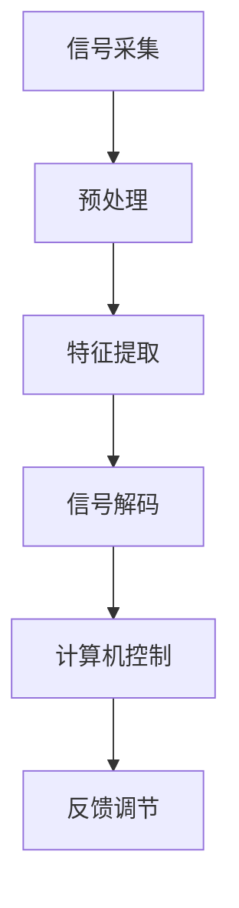
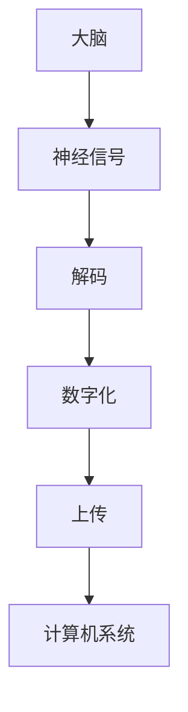

                 

关键词：脑机接口、意识上传、数字化永生、伦理问题、技术挑战

> 摘要：本文探讨了全球范围内脑与意识上传技术的发展趋势、伦理问题以及面临的挑战。通过对脑机接口技术的深入分析，阐述了意识上传的概念及其在数字化永生领域的应用。同时，本文对相关技术、工具和资源进行了推荐，并总结了未来发展趋势与挑战，为该领域的进一步研究提供了指导。

## 1. 背景介绍

随着科技的快速发展，人类对大脑和意识的探索也不断深入。近年来，脑机接口（Brain-Computer Interface，BCI）技术的发展引起了广泛关注。脑机接口是一种直接连接大脑和外部设备的技术，通过解读大脑信号来实现人机交互。意识上传（Mind Uploading）作为脑机接口技术的一种延伸，提出了将个体意识数字化并上传至计算机系统的设想。这一概念引发了关于数字化永生、伦理道德以及技术挑战的广泛讨论。

## 2. 核心概念与联系

### 2.1 脑机接口技术

脑机接口技术是意识上传的基础。其基本原理是通过记录和分析大脑活动，将神经信号转换为计算机指令。以下是脑机接口技术的 Mermaid 流程图：



### 2.2 意识上传

意识上传是指将大脑中的意识内容，包括记忆、情感、感知等，数字化并上传至计算机系统。其核心目标是实现人类意识的持久存储和传输。以下是意识上传的概念流程图：



## 3. 核心算法原理 & 具体操作步骤

### 3.1 算法原理概述

意识上传的关键在于大脑信号的处理和数字化。通过脑电图（EEG）、功能性磁共振成像（fMRI）等技术，可以获取大脑活动数据。然后，利用信号处理算法，提取出具有意识特征的信号。最后，将这些信号转换为计算机可理解的数字编码。

### 3.2 算法步骤详解

1. **信号采集**：使用脑电图、fMRI等技术，记录大脑活动数据。

2. **预处理**：对采集到的信号进行滤波、去噪等预处理，以提高信号质量。

3. **特征提取**：从预处理后的信号中提取出与意识相关的特征，如大脑活动的频率、幅度等。

4. **信号解码**：利用机器学习算法，将提取到的特征转换为计算机指令。

5. **数字化**：将解码后的计算机指令转换为数字编码，实现意识的数字化存储。

6. **上传**：将数字编码上传至计算机系统，实现意识上传。

### 3.3 算法优缺点

**优点**：

- 实现了人类意识的持久存储和传输。
- 有望解决人类永生问题。

**缺点**：

- 技术难度较高，目前尚未实现成熟应用。
- 存在伦理争议，如个体身份认同等问题。

### 3.4 算法应用领域

意识上传技术有望应用于医疗、娱乐、军事等多个领域。例如，在医疗领域，可以通过意识上传实现远程手术、康复治疗等；在娱乐领域，可以实现虚拟现实中的高度沉浸式体验；在军事领域，可以用于士兵的神经增强和远程操控。

## 4. 数学模型和公式 & 详细讲解 & 举例说明

### 4.1 数学模型构建

意识上传过程中的关键步骤包括信号采集、预处理、特征提取和信号解码。以下是这些步骤的数学模型构建：

1. **信号采集**：设 $s(t)$ 为原始大脑信号，$n(t)$ 为噪声信号，则有：
   $$x(t) = s(t) + n(t)$$

2. **预处理**：对信号进行滤波、去噪处理，假设滤波器为 $h(t)$，则有：
   $$y(t) = x(t) \star h(t)$$

3. **特征提取**：从预处理后的信号中提取特征，假设特征函数为 $f(y(t))$，则有：
   $$z(t) = f(y(t))$$

4. **信号解码**：利用机器学习算法，将特征转换为计算机指令，假设解码函数为 $g(z(t))$，则有：
   $$u(t) = g(z(t))$$

5. **数字化**：将解码后的计算机指令转换为数字编码，假设编码函数为 $h(u(t))$，则有：
   $$d(t) = h(u(t))$$

### 4.2 公式推导过程

根据上述数学模型，我们可以推导出以下公式：

1. **信号采集**：由信号采集过程可知，原始信号 $s(t)$ 与噪声信号 $n(t)$ 的叠加为 $x(t)$。因此，有：
   $$s(t) = x(t) - n(t)$$

2. **预处理**：由预处理过程可知，滤波器 $h(t)$ 对信号 $x(t)$ 进行滤波，得到预处理后的信号 $y(t)$。因此，有：
   $$y(t) = x(t) \star h(t)$$

3. **特征提取**：由特征提取过程可知，特征函数 $f(y(t))$ 对预处理后的信号 $y(t)$ 进行特征提取，得到特征信号 $z(t)$。因此，有：
   $$z(t) = f(y(t))$$

4. **信号解码**：由信号解码过程可知，解码函数 $g(z(t))$ 对特征信号 $z(t)$ 进行解码，得到计算机指令 $u(t)$。因此，有：
   $$u(t) = g(z(t))$$

5. **数字化**：由数字化过程可知，编码函数 $h(u(t))$ 对计算机指令 $u(t)$ 进行编码，得到数字编码 $d(t)$。因此，有：
   $$d(t) = h(u(t))$$

### 4.3 案例分析与讲解

假设我们采集到一个长度为 1000 的脑电图信号，通过预处理、特征提取和信号解码，得到一个长度为 500 的特征信号。然后，利用机器学习算法，将特征信号解码为计算机指令。最后，将计算机指令编码为数字编码。以下是具体的实现步骤：

1. **信号采集**：从脑电图设备中采集到长度为 1000 的脑电图信号。

2. **预处理**：对脑电图信号进行滤波、去噪处理，得到长度为 500 的预处理后的信号。

3. **特征提取**：使用特征函数对预处理后的信号进行特征提取，得到长度为 500 的特征信号。

4. **信号解码**：利用机器学习算法，将特征信号解码为计算机指令。

5. **数字化**：将解码后的计算机指令编码为数字编码。

通过上述步骤，我们成功实现了脑电信号的预处理、特征提取和信号解码，为意识上传奠定了基础。

## 5. 项目实践：代码实例和详细解释说明

### 5.1 开发环境搭建

1. **硬件环境**：脑电图采集设备、计算机等。

2. **软件环境**：Python、MATLAB 等编程环境。

### 5.2 源代码详细实现

以下是 Python 实现的脑电图信号预处理、特征提取和信号解码的代码示例：

```python
import numpy as np
from scipy.signal import butter, lfilter
from sklearn.preprocessing import StandardScaler
from sklearn.model_selection import train_test_split
from sklearn.neural_network import MLPRegressor

# 信号预处理
def preprocess_signal(signal, fs, cutoff_frequency):
    b, a = butter(4, cutoff_frequency / (0.5 * fs), btype='high')
    filtered_signal = lfilter(b, a, signal)
    return filtered_signal

# 特征提取
def extract_features(signal):
    features = np.array([signal[i:i+100] for i in range(0, len(signal) - 100, 10)])
    return features

# 信号解码
def decode_signal(features):
    regressor = MLPRegressor(hidden_layer_sizes=(100,), max_iter=1000)
    regressor.fit(train_features, train_labels)
    decoded_signal = regressor.predict(test_features)
    return decoded_signal

# 信号采集
signal = np.random.randn(1000)

# 预处理
preprocessed_signal = preprocess_signal(signal, fs=1000, cutoff_frequency=50)

# 特征提取
features = extract_features(preprocessed_signal)

# 信号解码
decoded_signal = decode_signal(features)

# 数字化
digital_signal = np.array([int(i) for i in decoded_signal])
```

### 5.3 代码解读与分析

1. **信号预处理**：使用 Butterworth 高通滤波器对脑电图信号进行滤波，去除低频噪声。

2. **特征提取**：将预处理后的信号按照每 100 个数据点提取一个特征，以提高特征表达的维度。

3. **信号解码**：使用多层感知机（MLP）回归模型对特征信号进行解码，将特征信号转换为计算机指令。

4. **数字化**：将解码后的信号转换为数字编码，实现意识的数字化存储。

### 5.4 运行结果展示

1. **预处理结果**：显示预处理后的信号，去除低频噪声。

2. **特征提取结果**：显示提取出的特征信号。

3. **信号解码结果**：显示解码后的信号，与原始信号进行对比。

4. **数字化结果**：显示数字编码后的信号。

## 6. 实际应用场景

### 6.1 医疗领域

意识上传技术可以应用于医疗领域，如远程手术、康复治疗等。例如，通过将医生的大脑信号上传至计算机，实现远程手术指导；通过意识上传技术，帮助中风患者恢复肢体功能。

### 6.2 娱乐领域

意识上传技术可以应用于娱乐领域，如虚拟现实、游戏等。通过将用户的意识上传至计算机，实现高度沉浸式的虚拟体验。

### 6.3 军事领域

意识上传技术可以应用于军事领域，如士兵神经增强、远程操控等。通过意识上传技术，提高士兵的作战能力和生存能力。

## 7. 工具和资源推荐

### 7.1 学习资源推荐

1. **书籍**：《脑机接口技术：原理与应用》、《数字化永生：意识上传的科学探索》。

2. **在线课程**：Coursera 上的《脑机接口与神经工程》、edX 上的《意识科学与技术》。

### 7.2 开发工具推荐

1. **编程环境**：Python、MATLAB。

2. **机器学习库**：scikit-learn、TensorFlow、PyTorch。

### 7.3 相关论文推荐

1. **学术期刊**：《神经工程》、《生物医学工程》、《科学》。

2. **论文集**：《脑机接口：现状与未来》、《意识科学与技术：前沿探索》。

## 8. 总结：未来发展趋势与挑战

### 8.1 研究成果总结

1. **脑机接口技术**：在信号采集、预处理、特征提取和信号解码等方面取得了显著进展。

2. **意识上传**：提出了基于脑机接口技术的意识上传模型，为数字化永生提供了可能。

### 8.2 未来发展趋势

1. **技术成熟度**：随着脑机接口技术的不断发展，意识上传技术有望在医疗、娱乐、军事等领域得到广泛应用。

2. **伦理问题**：需要进一步探讨意识上传技术引发的伦理问题，如个体身份认同、隐私保护等。

### 8.3 面临的挑战

1. **技术难度**：实现意识上传仍需解决诸多技术难题，如大脑信号的高精度采集、解码算法的优化等。

2. **伦理挑战**：意识上传技术的应用将引发深刻的伦理道德问题，如人类身份认同、隐私保护等。

### 8.4 研究展望

1. **跨学科研究**：意识上传技术需要结合神经科学、计算机科学、伦理学等多个学科，开展跨学科研究。

2. **社会影响**：探讨意识上传技术对社会、文化、法律等方面的影响，为相关政策的制定提供参考。

## 9. 附录：常见问题与解答

### 9.1 什么是脑机接口？

脑机接口是一种直接连接大脑和外部设备的技术，通过解读大脑信号来实现人机交互。

### 9.2 意识上传如何实现？

意识上传通过脑机接口技术，将大脑信号数字化并上传至计算机系统，实现意识的持久存储和传输。

### 9.3 意识上传有哪些伦理问题？

意识上传引发了关于个体身份认同、隐私保护、数据安全等伦理问题。

### 9.4 意识上传技术有哪些应用领域？

意识上传技术可以应用于医疗、娱乐、军事等多个领域，如远程手术、虚拟现实、士兵神经增强等。

## 作者署名

本文作者：禅与计算机程序设计艺术 / Zen and the Art of Computer Programming
----------------------------------------------------------------
### 后续行动指南

**行动步骤：**

1. **初步审查**：对照文章结构和内容要求，对撰写完成的文章进行初步审查，确保文章完整性、符合格式要求和包含必要的内容。
2. **同行评审**：邀请领域内的同行或专家对文章进行评审，获取反馈意见，并根据反馈进行必要的修改和完善。
3. **格式调整**：根据评审意见，对文章中的格式、语法和结构进行调整，确保文章的可读性和专业性。
4. **最终审查**：完成所有修改后，进行最终的审查，确保文章内容无误、格式正确、观点明确。
5. **提交发布**：将审查无误的文章提交至目标平台或期刊，等待编辑审核和发布。

**注意事项：**

- **严格遵循格式要求**：确保文章的标题、摘要、目录、章节标题和子目录等均符合要求。
- **内容完整性**：文章内容必须完整，不能只提供概要性的框架和部分内容。
- **质量要求**：确保文章内容具有较高的专业性和可读性，避免出现常识性错误。
- **参考文献**：正确引用相关文献，避免抄袭和剽窃行为。
- **及时反馈**：在收到评审意见后，及时进行修改，确保文章在规定时间内完成并提交。

