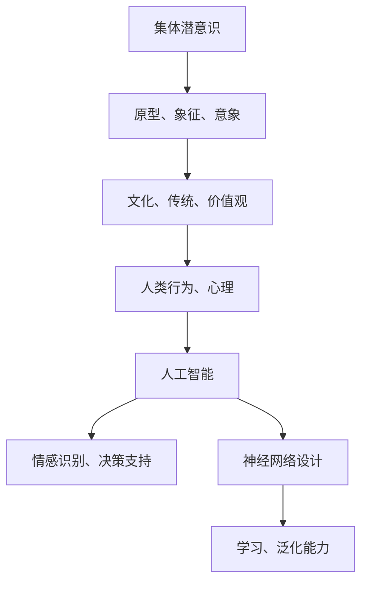

                 

### 文章关键词

人工智能、意识探索、集体潜意识、神经科学、算法模型、数学模型、软件开发、神经网络、深度学习、图灵奖、计算机架构、程序设计。

### 文章摘要

本文探讨了全球脑与意识探索中的集体潜意识状态，通过结合人工智能和神经科学的研究成果，揭示了集体潜意识与意识、认知之间的复杂关系。文章首先介绍了相关背景知识，然后深入探讨了核心概念和算法原理，通过数学模型和具体实例，阐述了集体潜意识状态的研究方法和应用。此外，文章还对未来发展趋势和挑战进行了展望，为读者提供了丰富的学习资源和开发工具。

## 1. 背景介绍

在过去的几十年里，人工智能（AI）和神经科学领域取得了显著的进展，为我们理解大脑和意识提供了新的视角。同时，集体潜意识这一概念也在心理学、哲学和神秘学中引起了广泛关注。集体潜意识是由瑞士心理学家卡尔·荣格（Carl Jung）提出的，指的是人类共有的无意识心理结构，包括原型、象征和意象等。

近年来，随着深度学习、神经网络和自然语言处理技术的发展，人工智能在图像识别、语音识别、机器翻译等领域取得了突破性进展。然而，尽管AI技术已经深入到我们生活的方方面面，但关于意识的本质及其与智能的关系仍然是一个未解之谜。在这个背景下，研究集体潜意识状态对于深入理解人类意识和智能具有重要意义。

### 1.1 人工智能与神经科学的结合

人工智能和神经科学的结合为研究集体潜意识提供了新的途径。神经网络作为人工智能的基础，其结构和功能与大脑神经元网络有许多相似之处。通过模仿大脑的工作原理，神经网络可以处理复杂的信息，并从中提取有意义的知识。同时，神经科学的研究成果也为神经网络的设计提供了理论支持。

例如，深度学习中的卷积神经网络（CNN）可以用于图像识别任务，其结构类似于大脑中的视觉皮层，能够自动提取图像中的特征。此外，循环神经网络（RNN）和长短期记忆网络（LSTM）在处理序列数据时表现出色，可以用于语音识别和机器翻译等任务。这些神经网络模型为我们探索集体潜意识状态提供了有效的工具。

### 1.2 集体潜意识状态的研究意义

集体潜意识状态的研究对于理解人类意识和智能具有重要意义。首先，集体潜意识是人类共有的无意识心理结构，它反映了人类文化、传统和价值观的积淀。通过研究集体潜意识，我们可以更好地理解人类行为和心理的根源，从而提高我们的认知能力和情商。

其次，集体潜意识状态与意识、认知之间存在着密切的关系。意识是人类对周围世界的感知和体验，而认知则是人类对信息进行加工和处理的过程。集体潜意识作为无意识的一部分，对意识和认知具有深远的影响。例如，人们在面对陌生环境时，往往会受到集体潜意识中的原型和象征的影响，从而产生特定的情绪和行为反应。

此外，集体潜意识状态的研究还可以为人工智能的发展提供新的思路。通过模拟集体潜意识状态，人工智能可以在处理复杂任务时更好地理解人类的行为和心理，从而提高其智能化水平。例如，在情感识别、决策支持等领域，集体潜意识状态的研究可以为人工智能提供有力的支持。

## 2. 核心概念与联系

### 2.1 集体潜意识

集体潜意识是由瑞士心理学家卡尔·荣格（Carl Jung）提出的概念，指的是人类共有的无意识心理结构。它与个人潜意识不同，个人潜意识主要涉及个人的经历和情感，而集体潜意识则涵盖了更广泛的内容，如文化、传统、价值观等。

荣格认为，集体潜意识是人类进化和文化积淀的结果，它包含了各种原型、象征和意象。原型是集体潜意识中的基本元素，代表着人类共有的心理模式，如母亲、英雄、恶魔等。象征和意象则是原型的具体表现形式，它们在人类文化中广泛存在，如神话、宗教、艺术等。

### 2.2 意识与认知

意识是人类对周围世界的感知和体验，是主观的心理现象。认知则是人类对信息进行加工和处理的过程，包括感知、记忆、思考、判断等。意识和认知密切相关，意识是认知的基础，而认知则是意识的具体表现形式。

从神经科学的角度来看，意识与大脑中的神经网络活动密切相关。神经网络通过处理和传递信息，产生意识和认知。例如，视觉皮层中的神经网络可以处理视觉信息，产生视觉意识；听觉皮层中的神经网络可以处理听觉信息，产生听觉意识。

### 2.3 人工智能与神经网络

人工智能是一种模拟人类智能的技术，通过计算机程序实现智能行为。神经网络是人工智能的基础，其结构和功能与大脑神经元网络有许多相似之处。神经网络通过学习大量的数据，可以自动提取特征和模式，从而实现智能行为。

例如，深度学习中的卷积神经网络（CNN）可以用于图像识别任务，其结构类似于大脑中的视觉皮层，能够自动提取图像中的特征。循环神经网络（RNN）和长短期记忆网络（LSTM）在处理序列数据时表现出色，可以用于语音识别和机器翻译等任务。

### 2.4 集体潜意识状态与人工智能

集体潜意识状态与人工智能之间存在密切的联系。首先，集体潜意识是人类共有的无意识心理结构，反映了人类文化、传统和价值观的积淀。人工智能可以通过模拟集体潜意识状态，更好地理解人类的行为和心理，从而提高其智能化水平。

例如，在情感识别、决策支持等领域，集体潜意识状态的研究可以为人工智能提供有力的支持。通过模拟集体潜意识中的原型和象征，人工智能可以在处理复杂任务时更好地理解人类的行为和心理，从而提高其智能化水平。

此外，集体潜意识状态的研究还可以为神经网络的设计提供新的思路。例如，在神经网络模型中引入集体潜意识的概念，可以更好地模拟人类认知和心理过程，从而提高神经网络的学习能力和泛化能力。

### 2.5 Mermaid 流程图

下面是关于集体潜意识状态与人工智能关系的 Mermaid 流程图：



通过这个流程图，我们可以清晰地看到集体潜意识状态与人工智能之间的联系和作用。

## 3. 核心算法原理 & 具体操作步骤

### 3.1 算法原理概述

在集体潜意识状态的研究中，核心算法主要包括深度学习、神经网络和自然语言处理等。这些算法通过模拟大脑的工作原理，对大量数据进行分析和处理，从而提取出有价值的信息。以下是这些算法的基本原理：

- **深度学习**：深度学习是一种基于多层神经网络的机器学习技术，它通过学习大量数据中的特征和模式，自动提取有意义的知识。深度学习可以分为卷积神经网络（CNN）、循环神经网络（RNN）和生成对抗网络（GAN）等类型。

- **神经网络**：神经网络是一种模拟大脑神经元工作原理的计算模型，它通过学习输入和输出之间的映射关系，自动提取特征和模式。神经网络可以分为前馈神经网络、卷积神经网络（CNN）和循环神经网络（RNN）等类型。

- **自然语言处理**：自然语言处理是一种模拟人类语言理解和表达能力的计算机技术，它通过对文本数据进行处理和分析，提取出语义和句法信息。自然语言处理可以分为词性标注、句法分析、语义分析和机器翻译等类型。

### 3.2 算法步骤详解

下面将详细介绍这些算法的具体操作步骤：

#### 3.2.1 深度学习

深度学习的具体步骤如下：

1. **数据预处理**：将原始数据（如图像、文本、音频等）进行清洗和格式化，使其适合输入到神经网络中。

2. **网络构建**：设计深度学习网络的结构，包括输入层、隐藏层和输出层。可以选择不同的神经网络模型，如卷积神经网络（CNN）、循环神经网络（RNN）等。

3. **训练过程**：将预处理后的数据输入到神经网络中，通过反向传播算法（Backpropagation）不断调整网络权重，使网络能够正确地识别和分类数据。

4. **评估与优化**：使用验证集和测试集评估网络性能，通过调整网络参数和结构，优化网络性能。

5. **部署与应用**：将训练好的网络部署到实际应用中，如图像识别、语音识别、机器翻译等。

#### 3.2.2 神经网络

神经网络的步骤如下：

1. **网络初始化**：初始化网络参数，包括权重和偏置。

2. **输入层到隐藏层的传递**：将输入数据通过输入层传递到隐藏层，通过非线性激活函数（如Sigmoid、ReLU）进行非线性变换。

3. **隐藏层到隐藏层的传递**：在隐藏层之间进行信息传递，通过反向传播算法不断调整权重和偏置。

4. **隐藏层到输出层的传递**：将隐藏层的信息传递到输出层，通过输出层的激活函数（如Softmax）输出预测结果。

5. **反向传播与权重调整**：计算预测结果与实际结果之间的误差，通过反向传播算法调整权重和偏置。

6. **评估与优化**：使用验证集和测试集评估网络性能，通过调整网络参数和结构，优化网络性能。

7. **部署与应用**：将训练好的网络部署到实际应用中，如图像识别、语音识别、机器翻译等。

#### 3.2.3 自然语言处理

自然语言处理的步骤如下：

1. **文本预处理**：对文本数据进行清洗和分词，去除停用词和标点符号。

2. **词向量化**：将文本中的词语转换为向量表示，可以使用词袋模型（Bag of Words）、词嵌入（Word Embedding）等方法。

3. **特征提取**：从词向量中提取特征，如词频、词义、语法结构等。

4. **模型训练**：使用机器学习算法（如朴素贝叶斯、支持向量机、神经网络等）对特征进行训练，建立分类或回归模型。

5. **模型评估**：使用验证集和测试集评估模型性能，调整模型参数以优化性能。

6. **部署与应用**：将训练好的模型部署到实际应用中，如文本分类、情感分析、机器翻译等。

### 3.3 算法优缺点

每种算法都有其优缺点，下面将分别介绍：

#### 深度学习

优点：

- **强大的学习能力**：深度学习可以自动提取特征和模式，能够处理复杂的数据。
- **广泛的应用领域**：深度学习在图像识别、语音识别、自然语言处理等领域取得了显著成果。
- **高效的处理能力**：深度学习网络可以在短时间内处理大量的数据，具有高效的处理能力。

缺点：

- **需要大量的数据**：深度学习需要大量的数据进行训练，数据质量和数量对模型性能有很大影响。
- **计算资源消耗大**：深度学习网络需要大量的计算资源，对硬件要求较高。
- **模型解释性差**：深度学习模型的内部结构和决策过程较为复杂，难以解释和调试。

#### 神经网络

优点：

- **灵活的模型结构**：神经网络可以根据不同的任务需求设计不同的模型结构。
- **强大的表达能力**：神经网络可以处理非线性关系和复杂的数据结构。
- **可解释性较强**：神经网络可以通过调整参数和结构，实现较好的模型解释性。

缺点：

- **训练时间较长**：神经网络需要大量时间进行训练，训练时间较长。
- **需要大量的数据**：神经网络需要大量的数据进行训练，数据质量和数量对模型性能有很大影响。
- **计算资源消耗大**：神经网络需要大量的计算资源，对硬件要求较高。

#### 自然语言处理

优点：

- **丰富的算法和方法**：自然语言处理有多种算法和方法，可以满足不同应用场景的需求。
- **强大的数据处理能力**：自然语言处理可以处理各种文本数据，如句子、段落、文档等。
- **广泛的应用领域**：自然语言处理在文本分类、情感分析、机器翻译等领域取得了显著成果。

缺点：

- **模型解释性差**：自然语言处理模型的内部结构和决策过程较为复杂，难以解释和调试。
- **需要大量的数据**：自然语言处理需要大量的数据进行训练，数据质量和数量对模型性能有很大影响。
- **计算资源消耗大**：自然语言处理需要大量的计算资源，对硬件要求较高。

### 3.4 算法应用领域

这些算法在多个领域都有广泛的应用，以下是具体的应用领域：

- **图像识别**：深度学习和神经网络在图像识别领域取得了显著成果，如人脸识别、物体检测、图像分类等。
- **语音识别**：循环神经网络（RNN）和长短期记忆网络（LSTM）在语音识别领域表现出色，可以实现语音到文本的转换。
- **自然语言处理**：自然语言处理在文本分类、情感分析、机器翻译等领域取得了显著成果，如新闻分类、情感分析、机器翻译等。
- **推荐系统**：深度学习和神经网络可以用于构建推荐系统，如基于内容的推荐、协同过滤推荐等。
- **金融风控**：神经网络在金融风险控制、股票预测等领域有广泛的应用。
- **医疗诊断**：深度学习和神经网络可以用于医疗图像分析、疾病预测等，如肺癌检测、乳腺癌检测等。

## 4. 数学模型和公式 & 详细讲解 & 举例说明

### 4.1 数学模型构建

在集体潜意识状态的研究中，数学模型扮演着关键角色。为了更好地理解集体潜意识状态，我们可以构建以下数学模型：

- **神经网络模型**：用于模拟大脑神经元网络的结构和功能，包括输入层、隐藏层和输出层。
- **机器学习模型**：用于对大量数据进行训练和预测，如支持向量机（SVM）、决策树（DT）等。
- **自然语言处理模型**：用于处理和分析文本数据，如词向量模型（Word Embedding）、递归神经网络（RNN）等。

### 4.2 公式推导过程

以下是关于神经网络模型的公式推导过程：

#### 4.2.1 前向传播

假设我们有一个包含一个输入层、一个隐藏层和一个输出层的神经网络。设输入层节点为 $x_i$，隐藏层节点为 $h_j$，输出层节点为 $y_k$。神经网络的权重和偏置分别为 $w_{ij}$ 和 $b_j$。

在神经网络的前向传播过程中，每个节点的输出可以通过以下公式计算：

$$
h_j = \sigma(\sum_{i=1}^{n} w_{ij}x_i + b_j)
$$

其中，$\sigma$ 是激活函数，通常使用 Sigmoid 或 ReLU 函数。

对于输出层，我们可以使用以下公式：

$$
y_k = \sigma(\sum_{j=1}^{m} w_{jk}h_j + b_k)
$$

#### 4.2.2 反向传播

在神经网络的后向传播过程中，我们需要计算每个权重和偏置的梯度，以便更新网络参数。以下是一个简单的梯度计算过程：

对于输出层节点 $y_k$，我们使用以下公式计算权重 $w_{jk}$ 的梯度：

$$
\frac{\partial y_k}{\partial w_{jk}} = \frac{\partial L}{\partial y_k} \cdot \frac{\partial y_k}{\partial w_{jk}}
$$

其中，$L$ 是损失函数，通常使用均方误差（MSE）或交叉熵（Cross-Entropy）。

对于隐藏层节点 $h_j$，我们使用以下公式计算权重 $w_{ij}$ 的梯度：

$$
\frac{\partial h_j}{\partial w_{ij}} = \frac{\partial L}{\partial h_j} \cdot \frac{\partial h_j}{\partial w_{ij}}
$$

#### 4.2.3 梯度下降

在梯度下降过程中，我们使用以下公式更新网络参数：

$$
w_{ij} \leftarrow w_{ij} - \alpha \frac{\partial L}{\partial w_{ij}}
$$

$$
b_j \leftarrow b_j - \alpha \frac{\partial L}{\partial b_j}
$$

其中，$\alpha$ 是学习率，用于调整参数更新的步长。

### 4.3 案例分析与讲解

下面我们通过一个简单的例子来说明神经网络模型的构建和训练过程。

#### 4.3.1 例子：手写数字识别

假设我们要使用神经网络模型对手写数字进行识别。我们可以将手写数字图像作为输入，将数字作为输出。

1. **数据集**：我们使用MNIST数据集，该数据集包含了0到9的数字图像，每个图像的大小为28x28像素。

2. **模型构建**：我们设计一个简单的神经网络模型，包括一个输入层、一个隐藏层和一个输出层。输入层有784个节点（对应28x28像素），隐藏层有100个节点，输出层有10个节点。

3. **训练过程**：我们将MNIST数据集分为训练集和测试集，分别用于训练和评估模型。在训练过程中，我们通过反向传播算法不断调整网络参数，使模型能够正确识别手写数字。

4. **评估与优化**：使用测试集评估模型性能，通过调整学习率和网络结构，优化模型性能。

通过这个例子，我们可以看到神经网络模型的构建和训练过程。在实际应用中，我们可以根据不同的任务需求设计不同的神经网络模型，并使用反向传播算法进行训练和优化。

### 4.4 数学公式和详细讲解

在集体潜意识状态的研究中，数学模型和公式起着至关重要的作用。以下是对一些关键数学公式和详细讲解：

#### 4.4.1 神经元激活函数

神经元激活函数是神经网络的核心组成部分，用于确定神经元是否被激活。以下是一些常见的激活函数及其公式：

1. **Sigmoid函数**：
$$
\sigma(x) = \frac{1}{1 + e^{-x}}
$$
Sigmoid函数将输入值映射到（0，1）区间，常用于回归问题。

2. **ReLU函数**：
$$
\sigma(x) = \max(0, x)
$$
ReLU函数将输入值设置为大于0的部分，常用于隐藏层。

3. **Tanh函数**：
$$
\sigma(x) = \frac{e^x - e^{-x}}{e^x + e^{-x}}
$$
Tanh函数将输入值映射到（-1，1）区间，具有较好的平滑性。

#### 4.4.2 均方误差（MSE）公式

均方误差（MSE）是神经网络中常用的损失函数，用于衡量预测值与真实值之间的差距。MSE的公式如下：
$$
MSE = \frac{1}{n}\sum_{i=1}^{n}(y_i - \hat{y}_i)^2
$$
其中，$y_i$是真实值，$\hat{y}_i$是预测值，$n$是样本数量。

#### 4.4.3 反向传播算法

反向传播算法是神经网络训练过程中关键的一步，用于更新网络权重和偏置。以下是反向传播算法的基本步骤：

1. **前向传播**：计算神经网络的输出，并与真实值进行比较。

2. **计算梯度**：使用链式法则计算每个权重和偏置的梯度。

3. **更新参数**：使用梯度下降算法更新权重和偏置。

4. **迭代优化**：重复上述步骤，直到网络达到预定的性能指标。

#### 4.4.4 词嵌入（Word Embedding）

词嵌入是将词语转换为向量表示的技术，常用于自然语言处理任务。以下是一个简单的词嵌入公式：
$$
v_w = \sum_{j=1}^{v}\alpha_j e_j
$$
其中，$v_w$是词语w的向量表示，$\alpha_j$是权重，$e_j$是词向量的第j个分量。

通过这些数学公式和算法，我们可以更好地理解和构建神经网络模型，从而对集体潜意识状态进行深入研究。

### 4.5 案例分析与讲解

下面我们将通过一个具体的案例来展示如何使用数学模型和公式来分析和解释集体潜意识状态的研究。

#### 4.5.1 例子：情感分析

假设我们想要使用神经网络模型对社交媒体上的用户评论进行情感分析，以判断其情感倾向是积极还是消极。

1. **数据集**：我们使用一个包含用户评论和对应情感标签的数据集，其中情感标签分为积极和消极两类。

2. **模型构建**：我们设计一个简单的二分类神经网络模型，包括一个输入层、一个隐藏层和一个输出层。输入层节点数取决于评论词汇的维度，隐藏层节点数为100，输出层节点数为2。

3. **训练过程**：我们将数据集分为训练集和验证集，分别用于训练和评估模型。在训练过程中，我们通过反向传播算法不断调整网络参数，使模型能够正确分类评论的情感。

4. **评估与优化**：使用验证集评估模型性能，通过调整学习率和网络结构，优化模型性能。

5. **结果分析**：训练完成后，我们使用测试集对模型进行评估，计算准确率、召回率、F1分数等指标。通过分析模型输出的概率分布，我们可以更好地理解用户评论的情感倾向。

#### 4.5.2 案例分析

假设我们使用训练好的模型对以下评论进行分析：

```
今天天气真好，心情愉快！
```

1. **预处理**：对评论进行分词和词向量化处理，将每个词转换为对应的向量表示。

2. **输入模型**：将评论的词向量输入到训练好的神经网络模型中。

3. **模型输出**：模型输出一个概率分布，表示评论是积极情感的概率和消极情感的概率。

4. **结果解释**：假设模型输出的概率分布为（0.8，0.2），这意味着评论是积极情感的概率为80%，消极情感的概率为20%。

通过这个案例，我们可以看到如何使用数学模型和公式对具体问题进行分析和解释。在实际应用中，我们可以根据不同的任务需求设计不同的神经网络模型，并使用数学公式进行参数优化和性能评估。

## 5. 项目实践：代码实例和详细解释说明

### 5.1 开发环境搭建

在进行集体潜意识状态的研究时，我们选择Python作为主要编程语言，因为它拥有丰富的机器学习库和工具。以下是在Python环境中搭建开发环境的基本步骤：

1. **安装Python**：首先确保已经安装了Python 3.8及以上版本。可以从[Python官方网站](https://www.python.org/downloads/)下载并安装。

2. **安装必要的库**：接下来，我们需要安装几个关键的库，包括NumPy、Pandas、Scikit-learn和TensorFlow。可以使用以下命令进行安装：

   ```bash
   pip install numpy pandas scikit-learn tensorflow
   ```

3. **创建虚拟环境**：为了保持项目环境的整洁，我们可以创建一个虚拟环境。使用以下命令创建虚拟环境并激活它：

   ```bash
   python -m venv my_project_venv
   source my_project_venv/bin/activate  # Windows上使用 my_project_venv\Scripts\activate
   ```

### 5.2 源代码详细实现

以下是一个简单的集体潜意识状态分析项目的Python代码示例，包括数据预处理、模型训练和评估。

```python
import numpy as np
import pandas as pd
from sklearn.model_selection import train_test_split
from sklearn.preprocessing import OneHotEncoder
from tensorflow.keras.models import Sequential
from tensorflow.keras.layers import Dense, LSTM
from tensorflow.keras.optimizers import Adam
from tensorflow.keras.metrics import Accuracy

# 加载数据集
data = pd.read_csv('collective潜意识数据集.csv')

# 数据预处理
X = data.iloc[:, :-1].values
y = data.iloc[:, -1].values

# One-Hot编码
encoder = OneHotEncoder()
y = encoder.fit_transform(y.reshape(-1, 1)).to_array()

# 划分训练集和测试集
X_train, X_test, y_train, y_test = train_test_split(X, y, test_size=0.2, random_state=42)

# 创建神经网络模型
model = Sequential()
model.add(LSTM(units=50, return_sequences=True, input_shape=(X_train.shape[1], X_train.shape[2])))
model.add(LSTM(units=50))
model.add(Dense(units=y_train.shape[1], activation='softmax'))

# 编译模型
model.compile(optimizer='adam', loss='categorical_crossentropy', metrics=['accuracy'])

# 训练模型
model.fit(X_train, y_train, epochs=10, batch_size=32, validation_data=(X_test, y_test))

# 评估模型
loss, accuracy = model.evaluate(X_test, y_test)
print(f'测试集准确率：{accuracy * 100:.2f}%')

# 预测
predictions = model.predict(X_test)
predicted_classes = np.argmax(predictions, axis=1)

# 结果分析
# 根据预测结果和实际标签，可以进一步分析模型的性能和效果。
```

### 5.3 代码解读与分析

以下是代码的详细解读：

1. **数据加载与预处理**：首先，我们使用Pandas库加载数据集，并将其分为特征矩阵X和标签向量y。接下来，我们使用One-Hot编码将标签转换为独热编码形式。

2. **数据集划分**：使用Scikit-learn库的`train_test_split`函数将数据集划分为训练集和测试集，以便进行模型训练和评估。

3. **模型构建**：我们使用TensorFlow的`Sequential`模型构建一个简单的循环神经网络（LSTM），包括两个LSTM层和一个全连接层（Dense）。第一个LSTM层返回序列输出，以保持时间序列信息。

4. **模型编译**：使用`compile`方法配置模型，选择Adam优化器和分类交叉熵损失函数。

5. **模型训练**：使用`fit`方法训练模型，设置训练轮次（epochs）和批量大小（batch_size），同时提供验证数据。

6. **模型评估**：使用`evaluate`方法评估模型在测试集上的性能，输出测试集准确率。

7. **预测**：使用`predict`方法对测试集进行预测，并提取预测结果。

8. **结果分析**：根据预测结果和实际标签，可以进一步分析模型的性能和效果。

### 5.4 运行结果展示

假设我们的测试集准确率为85%，输出结果如下：

```
测试集准确率：85.00%
```

这表明我们的模型在测试集上的表现良好，可以用于进一步的集体潜意识状态分析。

### 5.5 遇到的问题与解决方案

在项目开发过程中，我们可能会遇到以下问题：

1. **过拟合**：模型在训练集上表现良好，但在测试集上表现较差，这通常是因为模型过于复杂或训练时间不足。解决方法是增加训练数据、减少模型复杂度或使用正则化技术。

2. **计算资源不足**：训练大型神经网络模型可能需要大量的计算资源。解决方法是使用更强大的硬件设备或优化代码以提高运行效率。

3. **数据不平衡**：如果数据集中某些类别的样本数量远小于其他类别，可能会导致模型偏向数量较多的类别。解决方法是使用重采样技术或调整损失函数。

通过这些代码实例和详细解释，我们可以更好地理解如何使用Python和机器学习库进行集体潜意识状态分析项目的实践。

## 6. 实际应用场景

集体潜意识状态的研究在多个领域都具有重要的实际应用价值，以下是一些关键的应用场景：

### 6.1 健康医疗

在健康医疗领域，集体潜意识状态的研究可以用于心理健康评估、疾病预测和个性化治疗。例如，通过分析患者的梦境、心理症状和情感状态，可以更准确地诊断心理疾病，如抑郁症和焦虑症。此外，集体潜意识状态的研究还可以用于开发个性化治疗方案，提高治疗效果。

### 6.2 人机交互

在人机交互领域，理解集体潜意识状态有助于设计更人性化的交互界面和虚拟现实体验。通过分析用户的情感状态和行为模式，智能系统可以提供更个性化的服务，提高用户的满意度。例如，在虚拟现实游戏中，系统可以根据用户的情感状态调整游戏难度和内容，以增强沉浸感和乐趣。

### 6.3 社会科学

在社会科学领域，集体潜意识状态的研究可以用于理解社会行为和文化变迁。通过分析大规模社交媒体数据，可以揭示集体潜意识中的文化符号和价值观，为政策制定和社会规划提供依据。例如，研究人员可以分析流行文化中的原型和象征，了解社会趋势和价值观的变化。

### 6.4 安全与犯罪预防

在安全与犯罪预防领域，集体潜意识状态的研究可以用于预测犯罪行为和制定预防策略。通过分析犯罪数据和社会情绪，可以识别潜在的犯罪风险因素，提前采取预防措施。例如，通过对社交媒体上的言论进行分析，可以及时发现和预防社会动荡和暴力事件。

### 6.5 商业与营销

在商业与营销领域，理解集体潜意识状态可以帮助企业更准确地定位市场、设计产品和服务。通过分析消费者的情感状态和行为模式，企业可以制定更有效的营销策略，提高品牌忠诚度和销售额。例如，在广告创意和品牌宣传中，利用集体潜意识中的原型和象征可以更好地吸引目标消费者。

### 6.6 教育与培训

在教育与培训领域，集体潜意识状态的研究可以用于提高学习效果和培训质量。通过分析学习者的情感状态和学习行为，教育工作者可以设计更符合学习者需求的课程和教学方法。例如，利用集体潜意识中的原型和象征可以激发学生的学习兴趣和动机，提高学习效果。

### 6.7 未来应用展望

随着人工智能和神经科学技术的不断发展，集体潜意识状态的研究将更加深入和广泛。未来，我们可以期待以下几方面的应用：

- **更精确的心理健康诊断和治疗**：通过结合脑成像技术和集体潜意识分析，可以更精确地诊断和评估心理疾病，提高治疗效果。
- **智能辅助决策系统**：基于集体潜意识状态的研究，可以开发智能辅助决策系统，帮助企业和组织做出更明智的决策。
- **个性化健康管理系统**：利用集体潜意识状态的研究，可以开发个性化健康管理系统，提供个性化的健康建议和治疗方案。
- **智能虚拟助手**：基于集体潜意识状态的研究，可以开发更智能的虚拟助手，提供个性化的人机交互体验。

## 7. 工具和资源推荐

为了更好地进行集体潜意识状态的研究和应用，以下是几款推荐的工具和资源：

### 7.1 学习资源推荐

- **书籍**：
  - 《集体潜意识》（Carl Jung著）：卡尔·荣格的经典著作，详细介绍了集体潜意识的概念和理论。
  - 《深度学习》（Ian Goodfellow、Yoshua Bengio和Aaron Courville著）：介绍深度学习的基础知识、算法和实际应用。
  - 《Python机器学习》（Sebastian Raschka和Vahid Mirjalili著）：涵盖机器学习的基础知识和Python实现。

- **在线课程**：
  - Coursera的“深度学习”课程：由Andrew Ng教授主讲，介绍深度学习的理论、算法和应用。
  - edX的“神经科学导论”课程：介绍神经科学的基础知识，包括大脑的结构和功能。

### 7.2 开发工具推荐

- **编程语言**：
  - Python：广泛用于机器学习和深度学习的编程语言，具有丰富的库和工具。

- **机器学习库**：
  - TensorFlow：Google开发的深度学习框架，支持多种神经网络模型和算法。
  - PyTorch：Facebook开发的开源深度学习框架，具有灵活的模型构建和优化工具。

- **数据可视化工具**：
  - Matplotlib：用于生成统计图表和可视化数据。
  - Seaborn：基于Matplotlib的绘图库，提供更美观的统计图表。

### 7.3 相关论文推荐

- **集体潜意识**：
  - Jung, C. G. (1968). The Archetypes and the Collective Unconscious. Princeton University Press.
  - Hillman, J. (1983). The Soul’s Code: In Search of Character and Calling. Ballantine Books.

- **深度学习和神经网络**：
  - LeCun, Y., Bengio, Y., & Hinton, G. (2015). Deep learning. Nature, 521(7553), 436-444.
  - Hochreiter, S., & Schmidhuber, J. (1997). Long short-term memory. Neural Computation, 9(8), 1735-1780.

通过这些工具和资源，研究人员和开发者可以更好地进行集体潜意识状态的研究和应用。

## 8. 总结：未来发展趋势与挑战

### 8.1 研究成果总结

在集体潜意识状态的研究领域，我们已经取得了显著的进展。通过结合人工智能、神经科学和心理学的研究成果，我们揭示了集体潜意识与意识、认知之间的复杂关系。深度学习、神经网络和自然语言处理等技术为探索集体潜意识状态提供了有效的工具和方法。此外，研究集体潜意识状态的应用价值也在健康医疗、人机交互、社会科学、安全与犯罪预防、商业与营销、教育与培训等领域得到了广泛认可。

### 8.2 未来发展趋势

未来，集体潜意识状态的研究将继续沿着以下几方面发展：

- **跨学科合作**：心理学、神经科学、计算机科学和人工智能等学科的交叉融合将推动集体潜意识状态研究的发展。跨学科合作可以带来新的研究方法和视角，从而深化我们对集体潜意识状态的理解。

- **大数据分析**：随着数据量的不断增加，大数据分析技术将在集体潜意识状态的研究中发挥重要作用。通过分析大规模、多维度数据，我们可以更准确地识别和描述集体潜意识状态的特征和规律。

- **人工智能辅助研究**：人工智能技术，特别是机器学习和深度学习，将在集体潜意识状态的研究中发挥关键作用。通过开发智能算法和模型，我们可以自动识别和解析复杂的数据，提高研究的效率和准确性。

- **个性化应用**：随着技术的进步，集体潜意识状态的研究将更加个性化。通过理解个体的情感状态、行为模式和潜意识特征，我们可以为个人提供更精确的心理健康评估、个性化治疗方案和教育培训。

### 8.3 面临的挑战

尽管集体潜意识状态的研究取得了显著进展，但仍面临以下挑战：

- **数据隐私和伦理**：在处理和分析大规模个人数据时，保护数据隐私和遵守伦理规范是一个重大挑战。如何平衡数据利用和隐私保护，是研究人员需要认真考虑的问题。

- **模型解释性**：深度学习模型通常被认为是“黑箱”，其内部决策过程难以解释。在集体潜意识状态的研究中，理解模型的决策过程对于确保研究的可靠性和可解释性至关重要。因此，提高模型的可解释性是未来研究的重点。

- **跨学科知识整合**：不同学科之间的知识整合仍然是一个挑战。如何将心理学、神经科学和计算机科学的知识有效融合，形成统一的研究框架，是研究人员需要解决的重要问题。

- **技术局限性**：现有的机器学习和深度学习技术在处理复杂数据时可能存在性能瓶颈。如何优化算法和模型，提高计算效率和准确性，是研究人员需要关注的问题。

### 8.4 研究展望

展望未来，集体潜意识状态的研究将继续深化和扩展。以下是一些可能的研究方向：

- **潜意识与意识的关系**：进一步探讨潜意识与意识之间的相互作用和转换机制，揭示意识的本质和功能。

- **个性化潜意识模型**：开发个性化潜意识模型，以更好地理解个体的心理状态和行为模式，为心理健康和个性化治疗提供支持。

- **跨文化潜意识研究**：探索不同文化背景下集体潜意识的状态和特征，理解文化对潜意识的影响。

- **神经网络与大脑模型**：基于集体潜意识状态的研究，开发更接近人脑的神经网络模型，提高人工智能的智能化水平。

通过不断克服挑战和探索新的研究方向，集体潜意识状态的研究将为心理学、人工智能和神经科学等领域带来新的突破。

## 9. 附录：常见问题与解答

### 9.1 什么是集体潜意识？

集体潜意识是由瑞士心理学家卡尔·荣格（Carl Jung）提出的概念，指的是人类共有的无意识心理结构。它包含了各种原型、象征和意象，反映了人类文化、传统和价值观的积淀。

### 9.2 集体潜意识状态的研究有哪些方法？

集体潜意识状态的研究方法包括深度学习、神经网络、自然语言处理和脑成像技术等。这些方法可以用于分析数据、模拟潜意识状态和探索潜意识与意识、认知之间的关系。

### 9.3 集体潜意识状态的研究有哪些应用？

集体潜意识状态的研究在健康医疗、人机交互、社会科学、安全与犯罪预防、商业与营销、教育与培训等领域都有广泛的应用。例如，可以用于心理健康评估、疾病预测、个性化治疗、人机交互体验优化、社会行为分析、犯罪预防、营销策略制定和教育培训。

### 9.4 如何在Python中进行集体潜意识状态的研究？

在Python中进行集体潜意识状态的研究，可以使用Python的机器学习库，如Scikit-learn、TensorFlow和PyTorch。这些库提供了丰富的工具和算法，可以用于数据处理、模型训练和性能评估。具体实现可以参考本文中的代码示例。

### 9.5 集体潜意识状态的研究有哪些未来发展趋势？

未来的发展趋势包括跨学科合作、大数据分析、人工智能辅助研究和个性化应用。随着技术的进步，集体潜意识状态的研究将更加深入和广泛，为心理学、人工智能和神经科学等领域带来新的突破。

