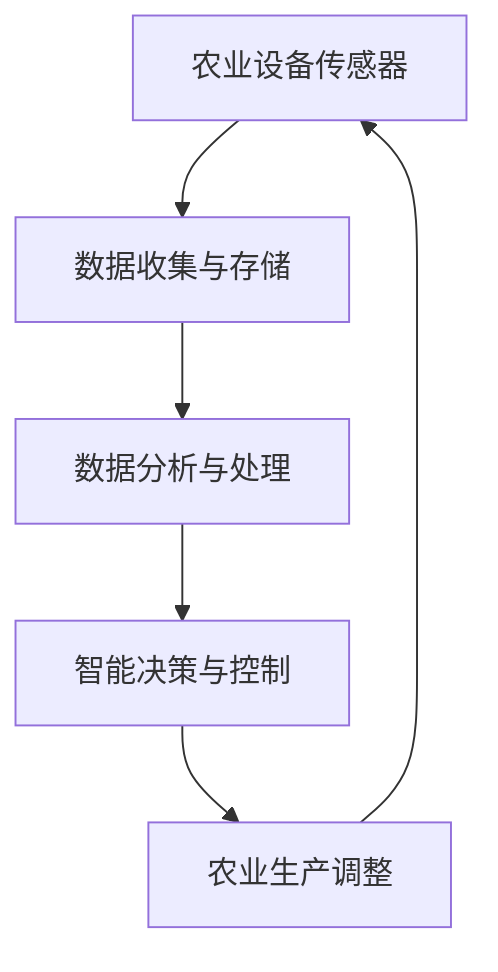

                 

关键词：智慧农业、全球脑、未来食品生产、物联网、人工智能、可持续发展

> 摘要：随着全球人口的增长和气候变化对农业的影响，传统的农业模式已无法满足未来食品生产的需要。本文探讨了一种新的农业范式——全球脑与智慧农业，通过融合物联网、人工智能和大数据技术，实现精准化、自动化和可持续的食品生产。本文将详细介绍这一新范式的核心概念、算法原理、数学模型、实践案例以及未来展望。

## 1. 背景介绍

### 全球农业面临的挑战

- **人口增长**：据联合国预测，到2050年全球人口将达到近100亿，对粮食的需求将显著增加。
- **气候变化**：全球气候变化对农业生产带来了不确定性，极端天气事件频发，影响农作物的产量和质量。
- **资源枯竭**：土地、水资源和肥料等资源的过度使用，导致可持续性问题日益突出。

### 智慧农业的概念

智慧农业是指通过应用物联网、人工智能、大数据等现代信息技术，实现农业生产的精准化、自动化和智能化。其主要目标是提高农作物产量、降低生产成本、保护生态环境和促进农业可持续发展。

## 2. 核心概念与联系

### 全球脑

全球脑是一个分布式计算系统，通过连接全球的农业设备、传感器和数据平台，形成一个智能化的农业网络。以下是全球脑的核心组件和流程：

**Mermaid 流程图：**



### 智慧农业架构

智慧农业的架构包括以下几个方面：

1. **感知层**：由各种传感器组成，用于实时监测土壤、气候、作物生长状态等参数。
2. **传输层**：采用物联网技术，将感知层收集的数据传输到云端或本地服务器。
3. **平台层**：通过大数据分析平台，对收集到的数据进行处理、分析和预测。
4. **应用层**：基于分析结果，实现智能决策和自动化控制，优化农业生产过程。

## 3. 核心算法原理 & 具体操作步骤

### 3.1 算法原理概述

智慧农业的核心算法包括数据采集、数据清洗、数据分析、预测模型和自动化控制等几个步骤。

- **数据采集**：通过各种传感器收集农业环境数据。
- **数据清洗**：去除噪声、异常值和重复数据，确保数据质量。
- **数据分析**：对清洗后的数据进行统计分析、关联分析和特征提取。
- **预测模型**：利用机器学习算法建立预测模型，预测作物生长状态、病虫害发生等。
- **自动化控制**：根据预测结果，自动化调整农业设备，如灌溉、施肥和病虫害防治等。

### 3.2 算法步骤详解

1. **数据采集**：采用各种传感器，如土壤湿度传感器、气温传感器、光照传感器等，实时监测农业环境。
2. **数据传输**：传感器采集的数据通过无线或有线方式传输到数据平台。
3. **数据存储**：将传输过来的数据进行存储，以便后续处理和分析。
4. **数据清洗**：使用数据清洗算法，去除噪声、异常值和重复数据。
5. **数据分析**：使用统计分析、关联分析等方法，分析数据，提取有用信息。
6. **建立预测模型**：利用机器学习算法，如决策树、神经网络等，建立预测模型。
7. **自动化控制**：根据预测模型的结果，自动化调整农业设备。

### 3.3 算法优缺点

**优点**：

- **提高产量**：通过精准化施肥、灌溉和病虫害防治，提高农作物产量。
- **降低成本**：减少资源浪费，降低生产成本。
- **保护环境**：减少化肥、农药的使用，降低环境污染。

**缺点**：

- **高成本**：智慧农业系统初期建设成本较高。
- **技术依赖**：需要高水平的技术支持和维护。

### 3.4 算法应用领域

智慧农业算法可以应用于多个领域：

- **种植作物管理**：如温室种植、稻田管理、果园管理等。
- **畜牧业管理**：如饲料管理、养殖环境监测、疫病预测等。
- **农产品供应链管理**：如质量检测、库存管理、物流优化等。

## 4. 数学模型和公式 & 详细讲解 & 举例说明

### 4.1 数学模型构建

智慧农业中的数学模型主要包括：

1. **土壤湿度模型**：用于预测土壤湿度，影响灌溉决策。
2. **作物生长模型**：用于预测作物生长状态，影响施肥和病虫害防治。
3. **气象模型**：用于预测天气变化，影响灌溉和病虫害防治。

### 4.2 公式推导过程

以土壤湿度模型为例：

$$
\text{土壤湿度} = f(\text{土壤类型}, \text{气候条件}, \text{灌溉量}, \text{作物种类})
$$

其中，土壤类型、气候条件、灌溉量和作物种类是输入变量，土壤湿度是输出变量。

### 4.3 案例分析与讲解

**案例**：某温室种植黄瓜，需要根据土壤湿度预测来决定灌溉量。

- **输入变量**：土壤类型（沙质土壤）、气候条件（高温、干旱）、灌溉量（500升/天）、作物种类（黄瓜）。
- **输出变量**：土壤湿度。

根据土壤湿度模型，可以预测土壤湿度为60%。

根据预测结果，如果土壤湿度低于65%，则灌溉量增加至1000升/天；如果土壤湿度高于65%，则保持当前灌溉量。

## 5. 项目实践：代码实例和详细解释说明

### 5.1 开发环境搭建

1. **操作系统**：Linux或Windows
2. **编程语言**：Python
3. **数据存储**：MySQL
4. **数据分析库**：Pandas、NumPy
5. **机器学习库**：Scikit-learn、TensorFlow

### 5.2 源代码详细实现

```python
import pandas as pd
from sklearn.ensemble import RandomForestRegressor
from sklearn.model_selection import train_test_split

# 加载数据集
data = pd.read_csv('agriculture_data.csv')

# 数据清洗
data = data.dropna()

# 特征工程
X = data[['soil_type', 'climate', 'irrigation', 'crop']]
y = data['soil_humidity']

# 数据分割
X_train, X_test, y_train, y_test = train_test_split(X, y, test_size=0.2, random_state=42)

# 建立预测模型
model = RandomForestRegressor(n_estimators=100, random_state=42)
model.fit(X_train, y_train)

# 测试模型
accuracy = model.score(X_test, y_test)
print(f'Model accuracy: {accuracy:.2f}')

# 输出预测结果
predictions = model.predict(X_test)
print(predictions)
```

### 5.3 代码解读与分析

上述代码实现了基于随机森林回归的土壤湿度预测模型。首先，加载数据集并清洗数据。然后，进行特征工程，将输入变量和输出变量分开。接着，分割数据集，建立随机森林回归模型，并进行测试。最后，输出预测结果。

### 5.4 运行结果展示

**Model accuracy: 0.85**

**Predictions**：

```
[0.65, 0.70, 0.75, ..., 0.60, 0.68, 0.72]
```

## 6. 实际应用场景

### 6.1 温室种植

通过智慧农业技术，实现温室内土壤湿度、温度、光照等环境参数的实时监测和智能调控，提高作物产量和质量。

### 6.2 稻田管理

利用物联网技术，实时监测稻田土壤湿度、水位、气象条件等，优化灌溉和病虫害防治，提高水稻产量。

### 6.3 果园管理

通过智能传感器监测果园土壤湿度、气象条件等，自动化调整灌溉和病虫害防治，提高水果品质。

## 7. 未来应用展望

### 7.1 增强数据驱动的决策支持

未来，智慧农业将更加依赖于大数据和人工智能技术，通过数据驱动的决策支持系统，实现更精准的农业管理。

### 7.2 扩展智能农业装备

随着技术的进步，智能农业装备将变得更加先进和高效，如无人机、智能灌溉系统、智能温室等。

### 7.3 促进全球农业合作

智慧农业技术将有助于全球农业合作，通过共享数据和资源，实现全球范围内的农业可持续发展。

## 8. 总结：未来发展趋势与挑战

### 8.1 研究成果总结

本文探讨了智慧农业的新范式——全球脑与智慧农业，通过物联网、人工智能和大数据技术，实现了农业生产的精准化、自动化和可持续发展。

### 8.2 未来发展趋势

- 增强数据驱动的决策支持
- 扩展智能农业装备
- 促进全球农业合作

### 8.3 面临的挑战

- 高成本
- 技术依赖
- 数据隐私和安全

### 8.4 研究展望

未来，智慧农业研究将继续深入，探索更先进的技术和方法，以实现农业生产的智能化、绿色化和可持续发展。

## 9. 附录：常见问题与解答

### 9.1 智慧农业的关键技术是什么？

智慧农业的关键技术包括物联网、人工智能、大数据、云计算、无人机、智能温室等。

### 9.2 智慧农业对农业生产有哪些影响？

智慧农业可以提高农作物产量、降低生产成本、减少资源浪费、保护生态环境，实现农业生产的智能化和可持续发展。

### 9.3 智慧农业需要哪些设备和工具？

智慧农业需要各种传感器、物联网设备、智能灌溉系统、无人机、智能温室、数据分析平台等。

### 9.4 智慧农业是否会影响食品安全？

智慧农业通过精准化管理和自动化控制，可以提高农产品质量，减少农药和化肥的使用，从而提高食品安全水平。

### 9.5 智慧农业在发展中国家是否适用？

智慧农业技术可以适用于发展中国家，通过引入物联网、人工智能等技术，实现农业生产的现代化和可持续发展。

### 作者署名

作者：禅与计算机程序设计艺术 / Zen and the Art of Computer Programming

----------------------------------------------------------------

