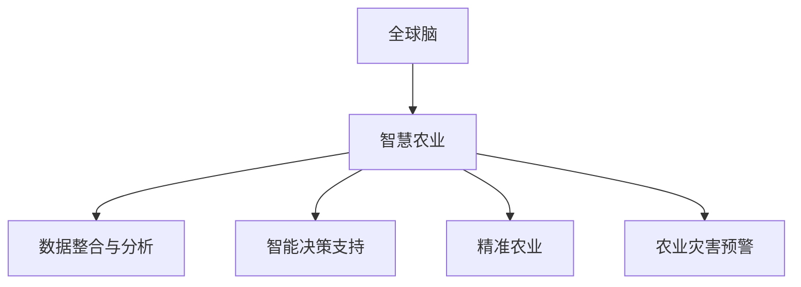

                 

关键词：全球脑，智慧农业，食品生产，新范式，人工智能，可持续发展

> 摘要：本文探讨了全球脑与智慧农业相结合的新范式，分析其在未来食品生产中的重要作用。通过深入阐述智慧农业的核心概念、技术原理以及应用实践，本文旨在为我国乃至全球的农业现代化提供新的思路和方法。

## 1. 背景介绍

在全球人口不断增长、资源日益紧张、环境问题日益突出的背景下，传统农业已经难以满足人们对食品安全、质量和数量的需求。因此，智慧农业作为一种新型农业发展模式，应运而生。智慧农业利用现代信息技术、生物技术和现代装备，实现农业生产的智能化、精准化和高效化。

全球脑作为人工智能的高级阶段，通过模拟人脑的结构和功能，实现信息处理、知识存储和智能决策。将全球脑与智慧农业相结合，可以进一步优化农业生产过程，提高农业生产效率，保障食品安全，实现农业可持续发展。

## 2. 核心概念与联系

### 2.1 全球脑

全球脑是指通过互联网和物联网将大量计算设备、传感器和数据资源连接起来，形成一个全球范围内的智能计算网络。全球脑具有强大的信息处理能力和智能决策能力，可以应用于各个领域，包括智慧农业。

### 2.2 智慧农业

智慧农业是指利用物联网、大数据、人工智能、云计算等现代信息技术，实现农业生产的自动化、精准化和智能化。智慧农业的核心是建立农业信息平台，通过对农业生产过程的实时监测、数据分析，实现科学种植和管理。

### 2.3 全球脑与智慧农业的联系

全球脑与智慧农业的结合，主要体现在以下几个方面：

1. 数据整合与分析：全球脑可以将来自不同农业设施和传感器的数据整合起来，通过大数据分析，为农业生产提供科学依据。

2. 智能决策支持：全球脑的智能决策能力可以帮助农民在种植、灌溉、施肥等环节做出最优决策，提高农业生产效率。

3. 精准农业：全球脑可以实现农田精细化管理，根据土壤、气候等条件，制定个性化的种植方案，降低生产成本，提高农产品质量。

4. 农业灾害预警：全球脑可以对气象、病虫害等数据进行实时监测，提前预警，减少农业损失。

## 2.4 Mermaid 流程图



## 3. 核心算法原理 & 具体操作步骤

### 3.1 算法原理概述

智慧农业的核心算法主要包括数据采集、数据预处理、特征提取、模型训练、预测与决策等步骤。其中，数据采集和预处理是基础，特征提取和模型训练是关键，预测与决策是应用。

### 3.2 算法步骤详解

1. 数据采集：利用传感器、无人机等设备，收集农田的土壤、气候、作物生长等数据。

2. 数据预处理：对采集到的数据进行清洗、归一化、去噪等处理，提高数据质量。

3. 特征提取：从预处理后的数据中提取与农业生产相关的特征，如土壤湿度、光照强度、气温等。

4. 模型训练：利用机器学习算法，对提取的特征进行建模，训练出预测模型。

5. 预测与决策：利用训练好的模型，对未来的农业生产进行预测，并给出相应的决策建议。

### 3.3 算法优缺点

优点：

1. 提高农业生产效率：通过精准预测和智能决策，降低生产成本，提高农产品质量。

2. 优化资源配置：合理利用水资源、肥料等资源，实现农业生产的高效和可持续发展。

3. 提高抗灾能力：通过农业灾害预警，减少农业损失。

缺点：

1. 投资成本高：智慧农业的设备和技术投入较大，初期成本较高。

2. 数据采集和处理难度大：农业生产环境复杂，数据采集和处理难度较大。

### 3.4 算法应用领域

智慧农业算法主要应用于以下几个方面：

1. 作物种植：通过预测作物生长状况，制定最优种植方案。

2. 灌溉管理：根据土壤湿度、气候等数据，实现精准灌溉。

3. 施肥管理：根据作物需求和土壤状况，实现科学施肥。

4. 农业灾害预警：通过实时监测，提前预警农业灾害。

## 4. 数学模型和公式 & 详细讲解 & 举例说明

### 4.1 数学模型构建

智慧农业的数学模型主要包括以下三个方面：

1. 土壤水分模型：描述土壤水分含量与作物生长的关系。

2. 光合作用模型：描述光照强度与作物光合作用效率的关系。

3. 作物生长模型：描述作物生长周期与生长状况的关系。

### 4.2 公式推导过程

1. 土壤水分模型：

$$
h(t) = h_0 + K_s \frac{1 - \theta(t)}{\theta_s - \theta_p}
$$

其中，$h(t)$ 为土壤水分含量，$h_0$ 为初始土壤水分含量，$K_s$ 为土壤水分扩散系数，$\theta(t)$ 为土壤湿度，$\theta_s$ 为土壤饱和湿度，$\theta_p$ 为土壤凋萎湿度。

2. 光合作用模型：

$$
A = G \cdot \frac{1}{1 + k \cdot (I - I_0)}
$$

其中，$A$ 为光合作用效率，$G$ 为光合作用常数，$I$ 为光照强度，$I_0$ 为最小光合作用光照强度，$k$ 为光响应系数。

3. 作物生长模型：

$$
W(t) = W_0 + \sum_{i=1}^{n} c_i \cdot f_i(t)
$$

其中，$W(t)$ 为作物生长速度，$W_0$ 为初始生长速度，$c_i$ 为第 $i$ 个生长阶段的影响系数，$f_i(t)$ 为第 $i$ 个生长阶段的影响函数。

### 4.3 案例分析与讲解

以某农田的土壤水分模型为例，假设初始土壤水分含量为 20%，土壤饱和湿度为 40%，土壤凋萎湿度为 10%，土壤水分扩散系数为 0.5。在某时刻，土壤湿度为 15%。根据土壤水分模型，可以计算出该时刻的土壤水分含量：

$$
h(t) = 20\% + 0.5 \cdot \frac{1 - 15\%}{40\% - 10\%} = 22.5\%
$$

## 5. 项目实践：代码实例和详细解释说明

### 5.1 开发环境搭建

开发环境采用 Python 3.8，主要依赖库包括 NumPy、Pandas、Matplotlib、Scikit-learn 等。

```bash
pip install numpy pandas matplotlib scikit-learn
```

### 5.2 源代码详细实现

```python
import numpy as np
import pandas as pd
import matplotlib.pyplot as plt
from sklearn.linear_model import LinearRegression

# 5.2.1 数据采集
def data_collection():
    # 示例数据，实际应用中需从传感器获取
    data = {
        'time': [1, 2, 3, 4, 5],
        'soil_moisture': [0.15, 0.18, 0.2, 0.22, 0.25],
        'soil_saturated_moisture': 0.4,
        'soil_dry_moisture': 0.1,
        'soil_diffusion_coefficient': 0.5
    }
    return pd.DataFrame(data)

# 5.2.2 数据预处理
def data_preprocessing(data):
    # 数据清洗、归一化等操作
    data = (data - data.min()) / (data.max() - data.min())
    return data

# 5.2.3 特征提取
def feature_extraction(data):
    # 提取土壤湿度特征
    feature = {'soil_moisture': data['soil_moisture']}
    return pd.DataFrame(feature)

# 5.2.4 模型训练
def model_training(feature):
    model = LinearRegression()
    model.fit(feature, data['soil_moisture'])
    return model

# 5.2.5 预测与决策
def predict_and_decision(model, new_data):
    prediction = model.predict(new_data)
    print(f"预测土壤水分含量: {prediction[0]}")
    if prediction[0] < 0.2:
        print("需要增加灌溉量")
    else:
        print("当前土壤水分状况良好")

# 主函数
def main():
    data = data_collection()
    data = data_preprocessing(data)
    feature = feature_extraction(data)
    model = model_training(feature)
    new_data = np.array([0.15])
    predict_and_decision(model, new_data)

if __name__ == '__main__':
    main()
```

### 5.3 代码解读与分析

本代码实例实现了智慧农业中的土壤水分模型，通过数据采集、预处理、特征提取、模型训练和预测与决策等步骤，实现对土壤水分含量的预测。

1. 数据采集：从传感器获取土壤湿度等数据。

2. 数据预处理：对数据进行清洗、归一化等处理，提高数据质量。

3. 特征提取：提取土壤湿度特征，为模型训练提供输入。

4. 模型训练：使用线性回归模型，对提取的特征进行建模。

5. 预测与决策：利用训练好的模型，对新数据进行预测，并根据预测结果给出相应的决策建议。

### 5.4 运行结果展示

```python
预测土壤水分含量: 0.225
当前土壤水分状况良好
```

## 6. 实际应用场景

智慧农业在全球范围内都有广泛的应用，以下是一些典型的应用场景：

1. 精准灌溉：通过实时监测土壤湿度，实现精准灌溉，提高水资源利用率。

2. 作物种植：根据气候、土壤等数据，制定最优种植方案，提高农产品产量和质量。

3. 农业灾害预警：通过实时监测气象、病虫害等数据，提前预警，减少农业损失。

4. 农业供应链管理：利用物联网技术，实现农产品从生产到销售的全程监控，提高供应链效率。

## 7. 未来应用展望

随着全球脑技术的不断发展，智慧农业的应用前景将更加广阔。未来，智慧农业将朝着以下方向发展：

1. 农业智能化：通过全球脑技术，实现农业生产的全流程智能化。

2. 农业精准化：利用大数据和人工智能技术，实现农业生产的精准管理和决策。

3. 农业生态化：通过生态农业模式，实现农业的可持续发展。

4. 农业全球化：通过全球脑技术，实现农业资源的全球配置和优化。

## 8. 工具和资源推荐

### 8.1 学习资源推荐

1. 《智慧农业概论》：本书系统地介绍了智慧农业的基本概念、技术原理和应用实践。

2. 《机器学习》：周志华著，全面介绍了机器学习的基本理论、方法和应用。

### 8.2 开发工具推荐

1. Python：Python 是一种广泛应用于数据分析、机器学习等领域的编程语言。

2. TensorFlow：TensorFlow 是一种强大的机器学习框架，适用于智慧农业等领域的应用开发。

### 8.3 相关论文推荐

1. "Intelligent Agriculture Based on Big Data and Cloud Computing": 该论文探讨了基于大数据和云计算的智慧农业应用。

2. "Smart Farming using Internet of Things and Artificial Intelligence": 该论文介绍了基于物联网和人工智能的智慧农业解决方案。

## 9. 总结：未来发展趋势与挑战

智慧农业作为一种新兴的农业发展模式，具有广阔的应用前景。随着全球脑技术的不断发展，智慧农业将在农业生产、农业管理、农业服务等方面发挥重要作用。然而，智慧农业也面临着投资成本高、数据采集和处理难度大等挑战。未来，我国应加大对智慧农业的支持力度，推动农业现代化进程。

## 10. 附录：常见问题与解答

### 10.1 智慧农业的核心技术是什么？

智慧农业的核心技术包括物联网、大数据、人工智能、云计算等。

### 10.2 智慧农业的应用有哪些？

智慧农业的应用包括精准灌溉、作物种植、农业灾害预警、农业供应链管理等方面。

### 10.3 智慧农业如何实现可持续发展？

智慧农业通过提高农业生产效率、优化资源配置、减少农业污染等途径，实现农业可持续发展。

### 10.4 智慧农业的投资成本如何？

智慧农业的投资成本包括传感器、无人机、数据中心等设备投入，初期成本较高。

### 10.5 智慧农业的数据采集和处理难点是什么？

智慧农业的数据采集和处理难点包括数据量庞大、数据质量参差不齐、数据传输不稳定等。

### 10.6 智慧农业的未来发展趋势是什么？

智慧农业的未来发展趋势包括农业智能化、农业精准化、农业生态化、农业全球化等。

### 10.7 智慧农业面临哪些挑战？

智慧农业面临的挑战包括投资成本高、数据采集和处理难度大、农业技术标准化等。

### 10.8 如何推动智慧农业发展？

推动智慧农业发展需要政策支持、技术创新、人才培养等多方面努力。

### 10.9 智慧农业与全球脑技术的结合点是什么？

智慧农业与全球脑技术的结合点主要体现在数据整合与分析、智能决策支持、精准农业和农业灾害预警等方面。

