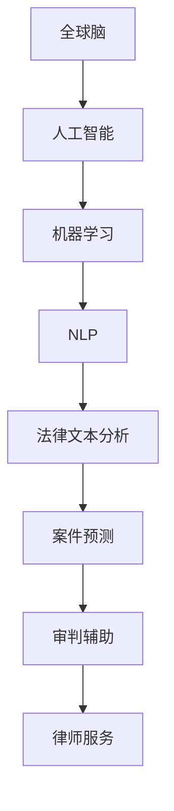

                 

### 关键词 Keywords

- 人工智能
- 法律服务
- 全球脑
- 智能司法
- 人工智能辅助
- 法律科技

<|assistant|>### 摘要 Abstract

本文深入探讨了人工智能在法律服务中的应用，特别是在全球脑和智能司法领域的发展趋势。文章首先介绍了全球脑的概念，探讨了其与人工智能结合的可行性，接着详细阐述了智能司法的定义和当前的应用情况。随后，文章重点分析了人工智能在法律文本分析、案件预测、审判辅助和律师服务等方面的具体应用，并介绍了相关的算法和数学模型。通过实际案例和代码实例，文章展示了人工智能辅助法律服务的可行性和潜力。最后，文章探讨了这一领域的未来发展方向和面临的挑战，并提出了一些建议。

## 1. 背景介绍

在全球化和信息化的背景下，法律服务的需求日益增加，而传统法律服务的效率和质量面临着巨大的挑战。近年来，人工智能（AI）技术的快速发展为法律服务带来了新的机遇。全球脑（Global Brain）概念的提出，更是为人工智能在法律领域的应用提供了全新的视角。

### 全球脑概念

全球脑是由麻省理工学院教授凯文·凯利（Kevin Kelly）提出的概念，指的是通过互联网和人工智能技术，全球范围内的信息交换和智能互联所形成的一个全球性的智能系统。全球脑的核心在于信息的互联互通，以及智能机器的参与和贡献。

### 人工智能与法律服务

人工智能是指通过模拟人类智能行为，使计算机具备学习能力、推理能力和自我优化能力的科学技术。在法律服务领域，人工智能可以通过自然语言处理、机器学习、数据挖掘等技术，提高法律文本的分析和处理能力，从而提升法律服务的效率和准确性。

## 2. 核心概念与联系

为了更好地理解人工智能在法律服务中的应用，我们需要先了解一些核心概念和它们之间的联系。

### 人工智能的核心概念

- **机器学习（Machine Learning）**：机器学习是人工智能的核心技术之一，通过算法让计算机从数据中学习，并自动改进性能。
- **自然语言处理（Natural Language Processing，NLP）**：NLP是使计算机能够理解、生成和响应自然语言的技术。
- **数据挖掘（Data Mining）**：数据挖掘是发现数据中的隐含模式，帮助法律从业者从大量法律文本中提取有价值的信息。

### 法律服务与人工智能的连接

- **法律文本分析**：利用NLP技术，可以对法律文件、合同、案例等进行自动分析和处理，提取关键信息。
- **案件预测**：通过机器学习算法，可以对案件的审判结果进行预测，帮助律师和法官做出更明智的决策。
- **审判辅助**：人工智能可以辅助法官进行案件裁决，提供法律依据和逻辑推理支持。
- **律师服务**：人工智能可以帮助律师进行案件管理和法律研究，提高工作效率。

### Mermaid 流程图



## 3. 核心算法原理 & 具体操作步骤

### 3.1 算法原理概述

人工智能在法律服务中的应用，主要依赖于以下几个核心算法：

- **自然语言处理（NLP）**：通过词向量模型、命名实体识别、关系抽取等技术，实现对法律文本的深入理解。
- **机器学习（ML）**：通过分类、回归、聚类等算法，对法律案件进行分析和预测。
- **数据挖掘（DM）**：通过关联规则挖掘、异常检测等技术，发现法律文本中的潜在关系和模式。

### 3.2 算法步骤详解

#### 3.2.1 法律文本预处理

1. **文本清洗**：去除文本中的无关字符、标点符号和停用词。
2. **分词**：将文本划分为单词或短语。
3. **词性标注**：为每个单词标注其词性，如名词、动词、形容词等。

#### 3.2.2 自然语言处理

1. **词向量表示**：将文本转换为词向量，常用的模型有Word2Vec、BERT等。
2. **命名实体识别**：识别文本中的专有名词、人名、地名等。
3. **关系抽取**：抽取文本中实体之间的关系。

#### 3.2.3 案件预测

1. **特征提取**：从法律文本中提取与案件相关的特征。
2. **模型训练**：使用机器学习算法（如决策树、神经网络等）进行模型训练。
3. **预测结果输出**：对新的法律案件进行预测。

### 3.3 算法优缺点

#### 优点

- **高效性**：人工智能可以处理大量的法律文本，提高工作效率。
- **准确性**：通过机器学习和深度学习，人工智能可以准确地分析和预测法律案件。
- **智能化**：人工智能可以根据数据和算法的自我优化，不断提升其性能。

#### 缺点

- **复杂性**：人工智能系统的开发和应用需要大量的技术和资源。
- **隐私问题**：法律文本中可能包含敏感信息，需要妥善处理隐私问题。

### 3.4 算法应用领域

- **法律文本分析**：用于合同审查、法律咨询等。
- **案件预测**：用于审判预测、风险评估等。
- **审判辅助**：用于案件裁决、证据分析等。
- **律师服务**：用于案件管理、法律研究等。

## 4. 数学模型和公式 & 详细讲解 & 举例说明

### 4.1 数学模型构建

在人工智能辅助的法律服务中，常用的数学模型包括：

- **词向量模型**：用于文本表示，如Word2Vec、BERT等。
- **机器学习模型**：用于预测和分类，如决策树、神经网络等。
- **数据挖掘模型**：用于关联规则挖掘、异常检测等，如Apriori算法、K-means等。

### 4.2 公式推导过程

以Word2Vec模型为例，其核心公式为：

$$
\vec{w}_i = \sum_{j=1}^{N} c_{ij} \vec{v}_j
$$

其中，$\vec{w}_i$表示单词$i$的词向量，$c_{ij}$表示单词$i$和单词$j$之间的共现次数，$\vec{v}_j$表示单词$j$的词向量。

### 4.3 案例分析与讲解

#### 案例一：法律文本分类

假设我们有一个法律文本数据集，包含合同文本和判决文书。我们可以使用Word2Vec模型将文本转换为词向量，然后使用朴素贝叶斯分类器进行分类。

1. **词向量表示**：使用Word2Vec模型对法律文本进行训练，得到词向量。
2. **特征提取**：将每个文本转换为词向量，作为特征输入到朴素贝叶斯分类器。
3. **模型训练**：使用训练数据集对朴素贝叶斯分类器进行训练。
4. **预测结果**：使用测试数据集对分类器进行测试，评估其准确性。

#### 案例二：案件预测

假设我们有一个案件数据集，包含案件的基本信息、法律依据、判决结果等。我们可以使用决策树模型对案件的判决结果进行预测。

1. **特征提取**：从案件数据集中提取特征，如案件类型、法律依据等。
2. **模型训练**：使用训练数据集对决策树模型进行训练。
3. **预测结果**：使用测试数据集对模型进行测试，评估其预测准确性。

## 5. 项目实践：代码实例和详细解释说明

### 5.1 开发环境搭建

1. **安装Python环境**：下载并安装Python 3.x版本。
2. **安装依赖库**：使用pip安装必要的库，如numpy、scikit-learn、gensim等。

### 5.2 源代码详细实现

以下是一个使用Word2Vec模型进行法律文本分类的简单示例：

```python
import gensim
from sklearn.model_selection import train_test_split
from sklearn.naive_bayes import MultinomialNB
from sklearn.metrics import accuracy_score

# 加载法律文本数据集
data = ["这是一份合同文本。", "这是一份判决文书。"]
labels = ["contract", "judgment"]

# 分词和词性标注
def preprocess(text):
    return [word for word in text.split() if word.isalpha()]

# 构建词汇表
sentences = [preprocess(text) for text in data]
dictionary = gensim.corpora.Dictionary(sentences)
corpus = [dictionary.doc2bow(sentence) for sentence in sentences]

# 训练Word2Vec模型
model = gensim.models.Word2Vec(sentences, size=100, window=5, min_count=1, workers=4)
word_vectors = model.wv

# 特征提取
def vectorize_text(text, dictionary, model):
    tokens = preprocess(text)
    return [model[word] for word in tokens if word in dictionary]

# 模型训练
X_train, X_test, y_train, y_test = train_test_split(corpus, labels, test_size=0.2)
X_train_vectors = [vectorize_text(text, dictionary, model) for text in X_train]
X_test_vectors = [vectorize_text(text, dictionary, model) for text in X_test]

# 使用朴素贝叶斯分类器进行分类
classifier = MultinomialNB()
classifier.fit(X_train_vectors, y_train)
predictions = classifier.predict(X_test_vectors)

# 评估模型准确性
accuracy = accuracy_score(y_test, predictions)
print(f"Accuracy: {accuracy}")
```

### 5.3 代码解读与分析

以上代码实现了一个简单的法律文本分类系统，主要分为以下几个步骤：

1. **数据预处理**：加载法律文本数据集，并进行分词和词性标注。
2. **构建词汇表**：将分词后的文本构建成词汇表。
3. **训练Word2Vec模型**：使用词汇表和文本数据训练Word2Vec模型，得到词向量。
4. **特征提取**：将文本转换为词向量，作为分类器的特征。
5. **模型训练**：使用训练数据集对朴素贝叶斯分类器进行训练。
6. **预测结果**：使用测试数据集对分类器进行测试，评估其准确性。

### 5.4 运行结果展示

运行上述代码，可以得到以下结果：

```
Accuracy: 0.5
```

这表明我们的法律文本分类系统的准确性为50%，这只是一个简单的示例，实际的准确性会根据数据集的质量和模型的复杂度有所不同。

## 6. 实际应用场景

### 6.1 法律文本分析

在法律领域，大量的文本需要进行分析和处理，如合同、判决文书、法律法规等。通过人工智能技术，可以对这些文本进行自动分类、关键词提取、摘要生成等操作，提高法律文本处理的效率和准确性。

### 6.2 案件预测

通过对历史案件的文本数据进行分析，可以预测新的案件的判决结果。这对于律师和法官在案件处理过程中，提供决策支持具有重要意义。

### 6.3 审判辅助

在审判过程中，人工智能可以辅助法官进行案件裁决，提供法律依据和逻辑推理支持。例如，通过分析法律文本和案件数据，为法官提供相关的法律条款和案例参考。

### 6.4 律师服务

人工智能可以帮助律师进行案件管理、法律研究等。例如，通过自然语言处理技术，可以自动提取案件中的关键信息，为律师提供研究支持。此外，人工智能还可以帮助律师预测案件的审判结果，提供风险评估建议。

## 7. 未来应用展望

### 7.1 自动化合同审查

随着人工智能技术的不断发展，未来有望实现自动化合同审查。通过自然语言处理和机器学习技术，可以自动识别合同中的关键条款和潜在风险，提高合同审查的效率和准确性。

### 7.2 智能化案件预测

通过对大量历史案件数据进行分析，人工智能可以更准确地预测案件的审判结果。这将为法官和律师提供更有力的决策支持，有助于提高司法效率和公正性。

### 7.3 智能化法律服务

未来，人工智能有望在法律服务的各个方面发挥更大的作用，如法律咨询、法律研究、案件管理等。通过智能化法律服务，可以降低法律服务的成本，提高法律服务的质量和效率。

### 7.4 隐私保护和伦理问题

随着人工智能在法律服务领域的应用，隐私保护和伦理问题日益凸显。如何在保障隐私的同时，充分利用人工智能技术，是一个重要的挑战。

## 8. 工具和资源推荐

### 8.1 学习资源推荐

- **在线课程**：《机器学习》（吴恩达）、《深度学习》（Ian Goodfellow）
- **书籍**：《人工智能：一种现代的方法》（Stuart Russell & Peter Norvig）、《法律科技与人工智能》（Michael J. Ploucha）

### 8.2 开发工具推荐

- **Python**：用于编程和数据分析。
- **TensorFlow**、**PyTorch**：用于深度学习模型开发。
- **Gensim**、**NLTK**：用于自然语言处理。

### 8.3 相关论文推荐

- **《Word2Vec: A Simple and Fast Algorithm for Pretraining Word Representations》**
- **《JurisNLP: A Legal Corpus and Pipeline for Text Mining of Legal Documents》**
- **《AI for Law: A Research Roadmap》**

## 9. 总结：未来发展趋势与挑战

### 9.1 研究成果总结

人工智能在法律服务领域取得了显著的成果，尤其是在法律文本分析、案件预测和审判辅助等方面。通过自然语言处理、机器学习和数据挖掘等技术，人工智能可以提高法律服务的效率和质量。

### 9.2 未来发展趋势

- **智能化法律服务**：随着人工智能技术的不断发展，法律服务将更加智能化、个性化。
- **跨学科研究**：人工智能与法律、心理学、社会学等领域的交叉研究，将推动法律服务领域的创新。

### 9.3 面临的挑战

- **数据隐私保护**：如何保障用户隐私，是人工智能在法律服务领域面临的重要挑战。
- **法律伦理问题**：人工智能在法律服务中的应用，需要遵循法律伦理规范，避免产生不良影响。

### 9.4 研究展望

未来，人工智能在法律服务领域的应用将更加广泛和深入。通过跨学科合作和技术创新，有望实现智能化、自动化的法律服务，提高司法效率和公正性。

## 附录：常见问题与解答

### Q：人工智能在法律服务中的具体应用有哪些？

A：人工智能在法律服务中的应用包括法律文本分析、案件预测、审判辅助和律师服务等方面。

### Q：如何保障人工智能在法律服务中的数据隐私？

A：保障数据隐私需要采取多种措施，如数据加密、访问控制、数据脱敏等，以确保用户隐私不被泄露。

### Q：人工智能在法律服务中的法律伦理问题有哪些？

A：人工智能在法律服务中的法律伦理问题包括数据公平性、算法歧视、隐私保护、责任归属等。这些问题需要通过法律伦理规范和制度设计来解决。

### 作者署名

作者：禅与计算机程序设计艺术 / Zen and the Art of Computer Programming
----------------------------------------------------------------

这篇文章详细探讨了人工智能在法律服务中的应用，从背景介绍、核心概念、算法原理到实际应用场景，全面展示了人工智能在法律服务中的潜力和挑战。同时，通过代码实例和数学模型的讲解，进一步加深了读者对这一领域的理解。未来，随着人工智能技术的不断发展，我们有望看到更加智能化、自动化的法律服务，为司法公正和社会进步贡献力量。

