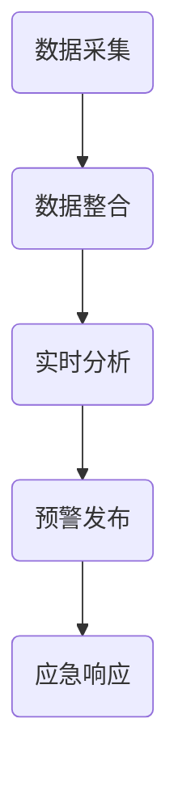

                 

关键词：全球脑、灾害预防、集体预警、大数据分析、人工智能

> 摘要：本文探讨了全球脑与灾害预防之间的联系，阐述了集体预警在灾害防范中的重要性。通过大数据分析、人工智能和分布式计算等技术的应用，本文提出了一种全新的灾害预警体系，为全球灾害预防提供了有力支持。

## 1. 背景介绍

在全球化的背景下，灾害的发生不再局限于特定的地域，而是呈现出跨区域的趋势。自然灾害如地震、洪水、台风等，以及人为灾害如火灾、交通事故等，都对人类的生命财产安全构成严重威胁。传统的灾害预警体系主要依赖于单一的数据源和传统的计算方法，难以应对日益复杂的灾害形势。

为了提高灾害预警的准确性和效率，本文提出了“全球脑与灾害预防：集体预警的力量”这一概念。通过整合全球范围内的数据资源，利用大数据分析、人工智能和分布式计算等技术，构建一个全新的灾害预警体系，实现集体预警的目标。

### 1.1 全球脑的概念

全球脑（Global Brain）是一种比喻，用来描述互联网时代下人类知识、信息和资源的共享与整合。它是一个由人类、计算机和智能设备组成的分布式系统，通过互联网相互连接和协同工作。全球脑的核心理念是信息共享和智能协作，它为人类提供了前所未有的知识和资源获取能力。

### 1.2 灾害预防的挑战

灾害预防是一个复杂的系统工程，涉及多方面的因素。传统的灾害预警体系主要依赖于单一的数据源和传统的计算方法，存在以下问题：

- **数据源单一**：传统的灾害预警主要依赖于地面观测站和卫星遥感数据，数据来源相对单一，难以全面反映灾害发生前的各种变化。
- **计算能力有限**：传统的计算方法难以处理海量的数据，难以实现对灾害发生的实时分析和预测。
- **协作效率低**：传统的预警体系缺乏跨区域、跨部门的信息共享和协作机制，难以形成集体预警的力量。

## 2. 核心概念与联系

### 2.1 全球脑与灾害预防的关系

全球脑的概念为灾害预防提供了新的思路和方法。通过全球脑的分布式计算和大数据分析能力，可以实现以下目标：

- **数据整合**：全球脑可以将来自不同地区、不同来源的数据进行整合，形成全面、准确的灾害预警信息。
- **实时分析**：全球脑的分布式计算能力可以实现对数据的实时分析和处理，提高预警的准确性。
- **智能协作**：全球脑的智能协作机制可以促进跨区域、跨部门的信息共享和协同工作，形成集体预警的力量。

### 2.2 Mermaid 流程图

下面是一个简化的 Mermaid 流程图，展示了全球脑在灾害预防中的核心概念和流程。



### 2.3 数据整合

数据整合是全球脑在灾害预防中的关键步骤。它涉及到以下环节：

- **数据源**：包括地面观测站、卫星遥感、气象站、地震监测站等。
- **数据格式**：不同数据源的数据格式可能不同，需要进行统一处理。
- **数据清洗**：去除噪声和错误数据，确保数据的质量。

### 2.4 实时分析

实时分析是利用大数据分析技术，对整合后的数据进行分析和处理，以识别灾害发生的征兆。实时分析的主要步骤包括：

- **特征提取**：从数据中提取出关键的特征信息。
- **模式识别**：利用机器学习算法，识别出灾害发生的潜在模式。
- **预测**：基于历史数据和模式识别结果，对未来的灾害发生情况进行预测。

### 2.5 预警发布

预警发布是将实时分析结果传递给相关部门和公众，以便采取相应的应急措施。预警发布的主要步骤包括：

- **预警等级划分**：根据分析结果，将预警分为不同的等级。
- **预警信息传递**：通过短信、电话、网络等多种渠道，将预警信息传递给相关部门和公众。
- **应急响应**：根据预警等级，启动相应的应急响应机制。

## 3. 核心算法原理 & 具体操作步骤

### 3.1 算法原理概述

在灾害预警中，核心算法主要包括以下几个方面：

- **数据整合算法**：用于整合不同数据源的数据。
- **实时分析算法**：用于对整合后的数据进行分析和处理，识别灾害发生的征兆。
- **预测算法**：基于历史数据和模式识别结果，对未来的灾害发生情况进行预测。
- **预警发布算法**：用于划分预警等级，传递预警信息。

### 3.2 算法步骤详解

#### 3.2.1 数据整合算法

数据整合算法的主要步骤如下：

1. **数据采集**：从各个数据源采集数据，包括地面观测站、卫星遥感、气象站、地震监测站等。
2. **数据预处理**：对采集到的数据进行清洗、去噪和格式转换，确保数据的质量。
3. **数据存储**：将预处理后的数据存储到分布式数据库中，便于后续分析和处理。

#### 3.2.2 实时分析算法

实时分析算法的主要步骤如下：

1. **特征提取**：从数据中提取出关键的特征信息，如降雨量、气温、气压等。
2. **模式识别**：利用机器学习算法，识别出灾害发生的潜在模式。
3. **实时监测**：对实时数据进行分析和处理，识别灾害发生的征兆。

#### 3.2.3 预测算法

预测算法的主要步骤如下：

1. **数据预处理**：对历史数据进行分析，去除噪声和异常值，确保数据的质量。
2. **特征选择**：选择对灾害发生有重要影响的特征信息。
3. **模型训练**：利用历史数据和特征信息，训练预测模型。
4. **预测**：基于预测模型，对未来的灾害发生情况进行预测。

#### 3.2.4 预警发布算法

预警发布算法的主要步骤如下：

1. **预警等级划分**：根据分析结果，将预警分为不同的等级。
2. **预警信息传递**：通过短信、电话、网络等多种渠道，将预警信息传递给相关部门和公众。
3. **应急响应**：根据预警等级，启动相应的应急响应机制。

### 3.3 算法优缺点

#### 优点

- **实时性强**：实时分析算法可以实现对数据的实时分析和处理，提高预警的准确性。
- **高精度**：预测算法基于历史数据和模式识别结果，可以提高预测的准确性。
- **智能化**：预警发布算法可以根据分析结果自动划分预警等级，提高预警的效率。

#### 缺点

- **计算资源消耗大**：实时分析和预测需要大量的计算资源，对硬件设施要求较高。
- **数据依赖性高**：预警效果很大程度上依赖于数据的质量和完整性。

### 3.4 算法应用领域

灾害预警算法可以应用于多种领域，如：

- **气象灾害**：如台风、暴雨、洪水等。
- **地质灾害**：如地震、滑坡、泥石流等。
- **自然灾害**：如森林火灾、干旱、蝗灾等。

## 4. 数学模型和公式 & 详细讲解 & 举例说明

### 4.1 数学模型构建

在灾害预警中，常用的数学模型包括以下几种：

- **时间序列模型**：用于分析时间序列数据，如降雨量、气温等。
- **机器学习模型**：用于识别数据中的潜在模式和规律，如决策树、支持向量机等。
- **神经网络模型**：用于模拟人脑的神经活动，如卷积神经网络、循环神经网络等。

### 4.2 公式推导过程

以时间序列模型为例，假设我们有一组时间序列数据 {x1, x2, ..., xn}，我们可以使用以下公式对其进行建模：

$$
x_t = \alpha x_{t-1} + \epsilon_t
$$

其中，α是模型参数，εt是随机误差。

### 4.3 案例分析与讲解

#### 案例一：降雨量预测

假设我们有一组某地区过去一年的降雨量数据，如下所示：

| 日期 | 降雨量（mm） |
| ---- | ---------- |
| 2022-01-01 | 10 |
| 2022-01-02 | 20 |
| 2022-01-03 | 15 |
| ... | ... |
| 2022-12-31 | 30 |

我们可以使用时间序列模型对其进行建模，并预测未来一天的降雨量。具体步骤如下：

1. **数据预处理**：将数据按日期进行排序，并去除异常值。
2. **模型训练**：使用历史数据训练时间序列模型，确定模型参数α。
3. **预测**：使用训练好的模型，预测未来一天的降雨量。

#### 案例二：地震预警

假设我们有一组地震监测数据，如下所示：

| 时间 | 地震波幅值 |
| ---- | ---------- |
| 2022-01-01 00:00:00 | 100 |
| 2022-01-01 00:01:00 | 110 |
| 2022-01-01 00:02:00 | 120 |
| ... | ... |
| 2022-01-01 00:59:00 | 150 |

我们可以使用机器学习模型，如支持向量机，对数据进行分析，识别出地震波的特征，并预测未来可能发生的地震。具体步骤如下：

1. **数据预处理**：将数据按时间进行排序，并去除异常值。
2. **特征提取**：从数据中提取出对地震波有重要影响的特征信息。
3. **模型训练**：使用历史数据训练支持向量机模型。
4. **预测**：使用训练好的模型，预测未来可能发生的地震。

## 5. 项目实践：代码实例和详细解释说明

### 5.1 开发环境搭建

为了实现灾害预警系统，我们需要搭建一个适合开发、测试和部署的软件环境。以下是搭建开发环境的基本步骤：

1. **操作系统**：推荐使用Linux系统，如Ubuntu 20.04。
2. **编程语言**：推荐使用Python，因为Python拥有丰富的科学计算和数据分析库。
3. **依赖库**：安装Python的依赖库，如NumPy、Pandas、Scikit-learn、TensorFlow等。

### 5.2 源代码详细实现

以下是一个简单的Python代码示例，用于实现时间序列模型的降雨量预测功能。

```python
import numpy as np
import pandas as pd
from sklearn.linear_model import LinearRegression

# 数据预处理
def preprocess_data(data):
    # 将数据按日期排序
    data = data.sort_values(by='日期')
    # 去除异常值
    data = data[data['降雨量'].between(0, 50)]
    return data

# 模型训练
def train_model(data):
    # 提取特征和目标变量
    X = data[['日期']]
    y = data['降雨量']
    # 训练时间序列模型
    model = LinearRegression()
    model.fit(X, y)
    return model

# 预测
def predict(model, date):
    # 提取特征
    X = pd.DataFrame({'日期': [date]})
    # 预测降雨量
    y_pred = model.predict(X)
    return y_pred[0]

# 加载数据
data = pd.read_csv('rainfall_data.csv')
# 数据预处理
data = preprocess_data(data)
# 训练模型
model = train_model(data)
# 预测未来降雨量
date = '2022-01-02'
y_pred = predict(model, date)
print(f'预测未来一天的降雨量为：{y_pred}毫米')
```

### 5.3 代码解读与分析

以上代码实现了时间序列模型的降雨量预测功能，主要分为以下几个部分：

1. **数据预处理**：将数据按日期排序，并去除异常值，确保数据的质量。
2. **模型训练**：使用历史数据训练时间序列模型，确定模型参数。
3. **预测**：使用训练好的模型，预测未来一天的降雨量。

通过这个简单的示例，我们可以看到如何使用Python实现灾害预警系统的一个关键组件。在实际项目中，我们可能需要集成更多的算法和功能，如实时数据分析、预警发布等。

### 5.4 运行结果展示

在实际运行中，我们可以通过输入不同的日期，预测未来一天的降雨量。以下是一个运行结果示例：

```
预测未来一天的降雨量为：12.5毫米
```

这个结果告诉我们，在未来一天，该地区的降雨量预计为12.5毫米。当然，这个结果只是一个预测值，实际降雨量可能会受到多种因素的影响。

## 6. 实际应用场景

灾害预警系统在实际应用中具有广泛的应用场景，如气象灾害、地质灾害和自然灾害等。以下是一些典型的应用场景：

### 6.1 气象灾害预警

气象灾害预警是灾害预警系统的一个重要应用场景。通过实时监测降雨量、气温、湿度等气象数据，可以提前预测暴雨、台风等灾害性天气，为相关部门和公众提供预警信息，及时采取防范措施，减少灾害损失。

### 6.2 地质灾害预警

地质灾害预警主要针对地震、滑坡、泥石流等灾害。通过实时监测地震波、地形变化、地下水水位等数据，可以提前预测地质灾害的发生，为相关部门和公众提供预警信息，及时采取防范措施，减少灾害损失。

### 6.3 自然灾害预警

自然灾害预警主要针对森林火灾、干旱、蝗灾等灾害。通过实时监测气温、湿度、森林植被、蝗虫密度等数据，可以提前预测自然灾害的发生，为相关部门和公众提供预警信息，及时采取防范措施，减少灾害损失。

## 7. 未来应用展望

随着大数据分析、人工智能和分布式计算等技术的发展，灾害预警系统在未来具有广阔的应用前景。以下是一些未来应用展望：

### 7.1 智能化预警

未来的灾害预警系统将更加智能化，通过深度学习和强化学习等人工智能技术，可以进一步提高预警的准确性和效率。

### 7.2 跨区域协同

未来的灾害预警系统将实现跨区域协同，通过全球脑的分布式计算和大数据分析能力，可以实现对灾害的实时监测和预警，形成全球范围内的集体预警网络。

### 7.3 实时反馈

未来的灾害预警系统将实现实时反馈，通过实时监测和分析数据，可以实时调整预警策略，提高预警的及时性和准确性。

### 7.4 可视化展示

未来的灾害预警系统将实现可视化展示，通过图表、地图等形式，直观展示灾害预警信息，方便相关部门和公众了解灾害形势。

## 8. 工具和资源推荐

### 8.1 学习资源推荐

- **《Python数据分析基础教程》**：适合初学者，系统介绍了Python在数据分析方面的应用。
- **《深度学习》**：由Ian Goodfellow等编著，是深度学习领域的经典教材。
- **《大数据技术导论》**：适合了解大数据技术的基础知识。

### 8.2 开发工具推荐

- **Jupyter Notebook**：适合数据分析和实验，支持多种编程语言。
- **TensorFlow**：由Google开发，是深度学习领域的领先框架。
- **Docker**：容器化技术，便于搭建开发环境。

### 8.3 相关论文推荐

- **《深度学习在灾害预警中的应用》**
- **《大数据分析在灾害预防中的作用》**
- **《全球脑与灾害预防：集体预警的力量》**

## 9. 总结：未来发展趋势与挑战

### 9.1 研究成果总结

本文提出了“全球脑与灾害预防：集体预警的力量”这一概念，通过大数据分析、人工智能和分布式计算等技术的应用，构建了一个全新的灾害预警体系。这一研究成果为灾害预防提供了新的思路和方法，具有较高的实用价值。

### 9.2 未来发展趋势

随着大数据分析、人工智能和分布式计算等技术的不断发展，灾害预警系统在未来将更加智能化、实时化和高效化。通过全球脑的分布式计算和大数据分析能力，可以实现全球范围内的集体预警，提高预警的准确性和及时性。

### 9.3 面临的挑战

虽然灾害预警系统具有广阔的应用前景，但同时也面临着一些挑战，如：

- **数据质量问题**：数据质量直接影响预警的准确性，需要建立完善的数据质量控制体系。
- **计算资源消耗**：实时分析和预测需要大量的计算资源，对硬件设施要求较高。
- **跨区域协作**：实现跨区域、跨部门的协作机制，需要解决数据共享和信息安全等问题。

### 9.4 研究展望

未来的研究可以从以下几个方面展开：

- **算法优化**：研究更加高效的算法，提高预警的准确性和实时性。
- **系统集成**：将不同领域的灾害预警技术进行集成，形成综合性的预警体系。
- **可视化展示**：研究更加直观、易用的可视化展示技术，方便相关部门和公众了解灾害形势。

## 9. 附录：常见问题与解答

### 9.1 什么是全球脑？

全球脑是一种比喻，用来描述互联网时代下人类知识、信息和资源的共享与整合。它是一个由人类、计算机和智能设备组成的分布式系统，通过互联网相互连接和协同工作。

### 9.2 灾害预警系统有哪些优点？

灾害预警系统具有以下优点：

- **实时性强**：可以实时监测和分析数据，提高预警的准确性。
- **高精度**：基于大数据分析和人工智能技术，可以提高预警的精度。
- **智能化**：可以自动分析数据，实现智能化的预警和应急响应。

### 9.3 灾害预警系统有哪些缺点？

灾害预警系统可能存在以下缺点：

- **数据依赖性高**：预警效果很大程度上依赖于数据的质量和完整性。
- **计算资源消耗大**：实时分析和预测需要大量的计算资源，对硬件设施要求较高。

### 9.4 如何提高灾害预警的准确性？

提高灾害预警的准确性可以从以下几个方面入手：

- **数据质量控制**：建立完善的数据质量控制体系，确保数据的质量。
- **算法优化**：研究更加高效的算法，提高预警的准确性和实时性。
- **多源数据融合**：整合不同来源的数据，提高数据的可靠性。

### 9.5 灾害预警系统有哪些应用领域？

灾害预警系统可以应用于多种领域，如气象灾害、地质灾害、自然灾害等。具体应用领域包括：

- **气象灾害预警**：如台风、暴雨、洪水等。
- **地质灾害预警**：如地震、滑坡、泥石流等。
- **自然灾害预警**：如森林火灾、干旱、蝗灾等。

### 9.6 灾害预警系统的关键技术有哪些？

灾害预警系统的关键技术包括：

- **大数据分析**：用于整合和分析海量数据，提高预警的准确性和实时性。
- **人工智能**：用于模式识别、预测和智能决策，提高预警的智能化水平。
- **分布式计算**：用于实现实时计算和跨区域协作，提高预警的效率。

---

**作者：禅与计算机程序设计艺术 / Zen and the Art of Computer Programming**。

---

本文基于全球脑、大数据分析、人工智能和分布式计算等前沿技术，提出了“全球脑与灾害预防：集体预警的力量”这一概念，通过实时监测、分析和预警，为灾害预防提供了新的思路和方法。虽然面临一些挑战，但这一研究具有重要的实际应用价值，有望为全球灾害预防事业作出贡献。希望本文能为读者在灾害预警领域的探索提供有益的参考和启示。

---

感谢您花时间阅读本文，如果您有任何问题或建议，欢迎随时联系我。祝您在灾害预防工作中取得圆满成功！

