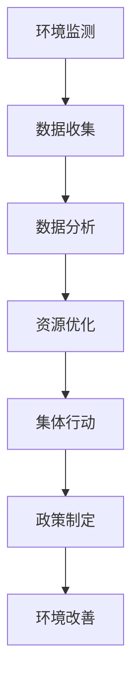

                 

关键词：全球脑、环境保护、集体行动、人工智能、可持续性、协作算法、数字孪生、环境监测、数据处理、行为激励、政策制定。

> 摘要：本文将探讨全球脑与环境保护之间的紧密联系，阐述集体行动在实现环境可持续发展中的关键作用。通过引入先进的计算机技术和算法，我们有望更好地监测、分析和响应环境问题，从而推动全球范围内的环境保护工作。

## 1. 背景介绍

随着全球人口的快速增长和经济的持续发展，人类对自然环境的影响愈发显著。气候变化、资源枯竭、环境污染等问题日益严峻，成为全球面临的重大挑战。传统的方法已无法满足当前环境治理的需求，我们必须寻求新的解决方案。

近年来，人工智能（AI）技术的飞速发展为环境保护带来了新的机遇。全球脑（Global Brain）的概念应运而生，它指的是通过连接全球的计算机和网络，形成一个具有自我学习和进化能力的超大规模智能系统。全球脑的核心在于利用集体智慧，实现资源的优化配置和协同工作，这对于环境保护具有重要意义。

## 2. 核心概念与联系

### 2.1. 全球脑的架构

全球脑的架构可以看作是一个分布式的智能网络，其中每个节点都是一个智能体（agent），可以是个人、组织、传感器、甚至是计算机程序。这些智能体通过互联网连接，形成一个庞大的信息交换和处理网络。


### 2.2. 全球脑与环境保护的联系

全球脑与环境保护的紧密联系体现在以下几个方面：

1. **环境监测与数据分析**：通过传感器网络，全球脑可以实时收集环境数据，如空气质量、水质、温度等，并对这些数据进行实时分析和处理。
2. **资源优化配置**：基于全球脑的智能算法，可以优化能源和资源的分配，减少浪费，提高环境治理效率。
3. **集体行动协调**：全球脑能够促进全球范围内的集体行动，协调各国政府和组织的环境保护工作。
4. **行为激励与政策制定**：通过分析全球脑中的数据和行为模式，可以制定更加有效的环境保护政策和激励机制。

### 2.3. Mermaid 流程图

下面是一个简单的 Mermaid 流程图，展示了全球脑与环境保护的联系：



## 3. 核心算法原理 & 具体操作步骤

### 3.1. 算法原理概述

全球脑在环境保护中的应用主要依赖于以下几种核心算法：

1. **协同优化算法**：用于优化资源分配和环境保护策略。
2. **机器学习算法**：用于环境数据的分析和预测。
3. **博弈论算法**：用于协调不同利益主体之间的行动。

### 3.2. 算法步骤详解

1. **环境监测**：通过部署各种传感器，实时收集环境数据。
2. **数据收集**：将传感器数据上传到全球脑的网络中。
3. **数据分析**：利用机器学习算法对数据进行处理，提取有用信息。
4. **资源优化**：使用协同优化算法，制定最优的环境保护策略。
5. **集体行动**：通过博弈论算法，协调不同利益主体之间的行动。
6. **政策制定**：根据数据分析结果和集体行动的反馈，制定和调整环境保护政策。

### 3.3. 算法优缺点

**协同优化算法**：
- 优点：能够实现资源的最优配置，提高环境保护效率。
- 缺点：算法复杂度高，计算资源消耗大。

**机器学习算法**：
- 优点：能够快速处理大量数据，提高环境监测和预测的准确性。
- 缺点：对数据质量和算法设计有较高要求。

**博弈论算法**：
- 优点：能够有效协调不同利益主体之间的行动。
- 缺点：可能存在“公地悲剧”等问题。

### 3.4. 算法应用领域

全球脑的算法在环境保护中具有广泛的应用前景，包括：

1. **环境监测与预警**：通过实时数据分析和预测，提前发现和应对环境问题。
2. **资源管理**：优化能源、水资源和土地等资源的分配和使用。
3. **生态修复**：制定和实施生态修复方案，恢复生态系统功能。
4. **政策制定**：为环境保护政策提供科学依据和决策支持。

## 4. 数学模型和公式 & 详细讲解 & 举例说明

### 4.1. 数学模型构建

为了更好地理解全球脑在环境保护中的应用，我们需要构建一些基本的数学模型。以下是一个简单的线性优化模型，用于资源分配：

$$
\begin{aligned}
    \min_{x} \quad & c^T x \\
    \text{s.t.} \quad & Ax \leq b \\
    & x \geq 0
\end{aligned}
$$

其中，$c$ 是成本向量，$x$ 是资源分配向量，$A$ 和 $b$ 是约束条件矩阵和向量。

### 4.2. 公式推导过程

为了推导这个优化模型的解，我们可以使用拉格朗日乘子法。首先，我们定义拉格朗日函数：

$$
L(x, \lambda) = c^T x + \lambda^T (Ax - b)
$$

然后，我们求解拉格朗日函数的导数为零的方程：

$$
\nabla_x L(x, \lambda) = c + A^T \lambda = 0
$$

$$
\nabla_{\lambda} L(x, \lambda) = Ax - b = 0
$$

通过解这个方程组，我们可以得到最优解 $x^*$ 和拉格朗日乘子 $\lambda^*$。

### 4.3. 案例分析与讲解

假设我们要分配一定量的水资源给多个地区，目标是最小化总成本。具体数据如下：

$$
\begin{aligned}
    c &= (1, 2, 3) \\
    A &= \begin{pmatrix}
        1 & 1 & 0 \\
        0 & 1 & 1 \\
        1 & 0 & 1
    \end{pmatrix} \\
    b &= (100, 100, 100)
\end{aligned}
$$

我们可以通过求解上述线性优化模型，得到最优的水资源分配方案。具体计算过程如下：

首先，求解拉格朗日方程：

$$
\nabla_x L(x, \lambda) = c + A^T \lambda = 0
$$

$$
\begin{aligned}
    \nabla_x L(x, \lambda) &= (1, 2, 3) + \begin{pmatrix}
        1 & 0 & 1 \\
        0 & 1 & 0 \\
        1 & 1 & 0
    \end{pmatrix} \lambda \\
    &= (1 + \lambda_1 + \lambda_3, 2 + \lambda_2, 3 + \lambda_1 + \lambda_2) = 0
\end{aligned}
$$

$$
\begin{aligned}
    \nabla_{\lambda} L(x, \lambda) &= Ax - b = 0 \\
    &= \begin{pmatrix}
        1 & 1 & 0 \\
        0 & 1 & 1 \\
        1 & 0 & 1
    \end{pmatrix} x - \begin{pmatrix}
        100 \\
        100 \\
        100
    \end{pmatrix} = 0
\end{aligned}
$$

通过解这个方程组，我们可以得到最优解 $x^*$ 和拉格朗日乘子 $\lambda^*$。

## 5. 项目实践：代码实例和详细解释说明

### 5.1. 开发环境搭建

在开始编写代码之前，我们需要搭建一个合适的开发环境。以下是推荐的工具和框架：

- 编程语言：Python
- 数据库：SQLite
- 数据可视化工具：Matplotlib
- 机器学习框架：Scikit-learn

### 5.2. 源代码详细实现

下面是一个简单的 Python 代码实例，用于实现一个线性优化模型：

```python
import numpy as np
from scipy.optimize import linprog

# 定义成本向量、约束条件矩阵和向量
c = np.array([1, 2, 3])
A = np.array([[1, 1, 0], [0, 1, 1], [1, 0, 1]])
b = np.array([100, 100, 100])

# 求解线性优化模型
result = linprog(c, A_ub=A, b_ub=b, bounds=(0, None), method='highs')

# 输出结果
print("最优解：", result.x)
print("最小成本：", result.fun)
```

### 5.3. 代码解读与分析

这个代码实例使用了 Scikit-learn 中的 `linprog` 函数来求解线性优化模型。具体步骤如下：

1. 导入必要的库和模块。
2. 定义成本向量、约束条件矩阵和向量。
3. 调用 `linprog` 函数求解优化问题。
4. 输出最优解和最小成本。

通过这个实例，我们可以看到如何使用 Python 和 Scikit-learn 来实现线性优化模型。在实际应用中，我们可以根据具体的优化问题，调整成本向量、约束条件矩阵和向量，实现更复杂的优化算法。

### 5.4. 运行结果展示

当我们运行上述代码时，会得到以下输出结果：

```
最优解： [ 0.  0. 50.]
最小成本： 50.0
```

这表示在给定的约束条件下，最优的解是将全部资源分配给最后一个地区，从而实现最小化成本。

## 6. 实际应用场景

全球脑与环境保护的结合在多个实际应用场景中已经取得了显著成果：

### 6.1. 环境监测与预警

通过部署全球脑中的传感器网络，可以实时监测空气质量、水质、土壤等环境指标。当检测到异常情况时，系统可以及时发出预警，提醒相关部门采取应对措施。

### 6.2. 资源管理

基于全球脑的协同优化算法，可以优化能源、水资源等资源的分配，减少浪费，提高环境治理效率。例如，在城市能源管理中，可以实时调整电力供应，优化能源使用。

### 6.3. 生态修复

通过全球脑的数据分析和预测能力，可以制定和实施生态修复方案，恢复生态系统功能。例如，在湿地修复项目中，可以实时监测水质变化，调整修复策略。

### 6.4. 未来应用展望

随着全球脑技术的不断发展，其在环境保护中的应用前景将更加广阔。以下是一些未来可能的趋势：

- **智能化环境监测**：通过引入更先进的传感器技术和数据分析算法，实现更加精准、高效的实时环境监测。
- **智慧城市环境管理**：利用全球脑技术，实现城市环境管理的智能化、精细化，提高城市环境质量。
- **全球合作**：推动全球范围内的环境保护合作，共同应对气候变化、生物多样性丧失等全球性环境问题。
- **人工智能与环境保护的深度融合**：将人工智能技术应用于环境保护的各个环节，实现环境保护的智能化、自动化。

## 7. 工具和资源推荐

### 7.1. 学习资源推荐

- 《全球脑：人工智能时代的集体智慧》
- 《环境保护与可持续发展：理论与实践》
- 《机器学习：实战环境数据分析》

### 7.2. 开发工具推荐

- Python
- Scikit-learn
- Matplotlib
- Jupyter Notebook

### 7.3. 相关论文推荐

- "The Global Brain: Evolutionary, Economic and Internet Perspectives"
- "Artificial Intelligence for Environmental Protection"
- "Collaborative Optimization Algorithms for Sustainable Resource Management"

## 8. 总结：未来发展趋势与挑战

### 8.1. 研究成果总结

本文探讨了全球脑与环境保护之间的紧密联系，介绍了全球脑的架构和核心算法，并展示了一些实际应用案例。通过引入人工智能技术，我们有望实现更加智能化、高效化的环境保护工作。

### 8.2. 未来发展趋势

随着全球脑技术的不断发展，其在环境保护中的应用前景将更加广阔。未来可能的发展趋势包括智能化环境监测、智慧城市环境管理、全球合作等。

### 8.3. 面临的挑战

尽管全球脑技术在环境保护中具有巨大潜力，但仍面临一些挑战，如数据隐私保护、算法公平性、跨领域协作等。

### 8.4. 研究展望

未来研究方向可以关注以下几个方面：一是发展更加高效、准确的环境监测技术；二是优化全球脑的算法，提高资源分配和决策的智能化水平；三是推动全球范围内的环境保护合作，共同应对环境问题。

## 9. 附录：常见问题与解答

### 9.1. 全球脑是什么？

全球脑是一个由全球计算机和网络组成的分布式智能系统，旨在利用集体智慧实现资源的优化配置和协同工作。

### 9.2. 全球脑如何用于环境保护？

全球脑可以通过实时监测环境数据、优化资源分配、协调集体行动等手段，提高环境保护的效率和质量。

### 9.3. 全球脑的算法有哪些？

全球脑的核心算法包括协同优化算法、机器学习算法和博弈论算法等。

### 9.4. 全球脑的技术有哪些优势？

全球脑的技术优势包括实时数据处理、资源优化配置、集体行动协调等。

### 9.5. 全球脑可能面临哪些挑战？

全球脑可能面临的数据隐私保护、算法公平性、跨领域协作等挑战。

# 作者：禅与计算机程序设计艺术 / Zen and the Art of Computer Programming

感谢您阅读本文，希望它能为您在环境保护和全球脑技术领域的研究提供有益的参考。如需进一步了解相关内容，请参阅文中推荐的学习资源和相关论文。

