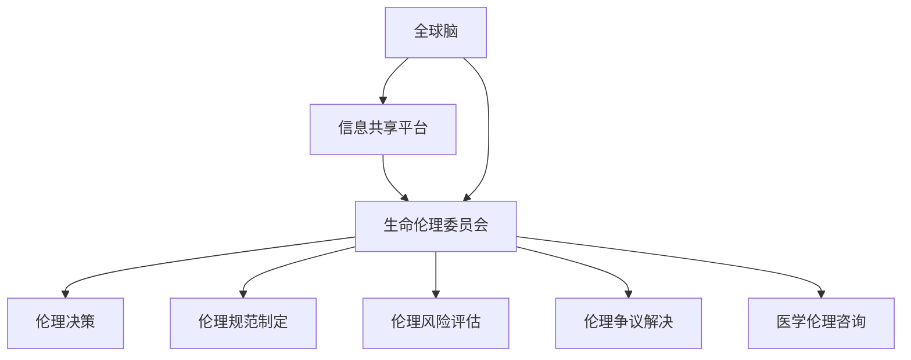
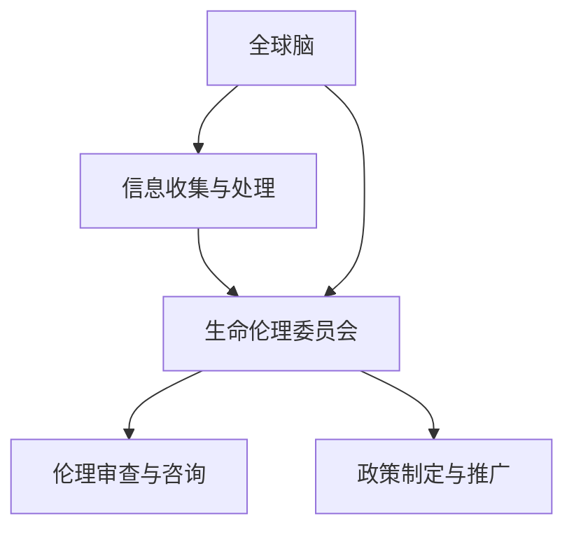

                 

关键词：全球脑、生命伦理委员会、集体决策、医学伦理、人工智能、伦理学

> 摘要：本文旨在探讨全球脑与生命伦理委员会在集体决策下的医学伦理机构运作模式。随着人工智能技术的快速发展，医学伦理问题日益突出，如何在全球范围内实现有效的集体决策成为重要议题。本文首先介绍了全球脑与生命伦理委员会的背景和使命，然后分析了集体决策在医学伦理领域的应用，并探讨了其面临的挑战和未来发展方向。

## 1. 背景介绍

### 1.1 全球脑的起源与发展

全球脑（Global Brain）这一概念最早由德国社会学家弗里德里希·希尔伯特（Friedrich Hayek）提出，他在20世纪50年代提出了“全球大脑”理论，认为人类社会可以类比为一台巨大的计算机，个体就像计算机的神经元，通过信息传递和协作实现整体智力的提升。

随着互联网技术的迅猛发展，全球脑的理论逐渐得到广泛认可。互联网作为全球脑的神经网络，使得全球范围内的信息交换和协作变得更加便捷。人工智能的崛起则为全球脑的实现提供了技术支撑，使得全球脑从理论走向实践。

### 1.2 生命伦理委员会的职责

生命伦理委员会是一种专门处理医学伦理问题的机构，其职责包括但不限于：

- 制定医学伦理标准和规范
- 评估医学研究项目的伦理风险
- 解决医学实践中出现的伦理争议
- 提供医学伦理咨询

生命伦理委员会的成立旨在保护患者的权益，确保医学实践符合伦理标准，同时促进医学科学的健康发展。

### 1.3 全球脑与生命伦理委员会的关联

全球脑与生命伦理委员会的关联体现在以下几个方面：

- **信息共享**：全球脑提供了高效的信息共享平台，使得生命伦理委员会能够快速获取全球范围内的医学伦理信息，从而制定更加全面和科学的伦理标准。
- **集体决策**：全球脑的集体决策机制使得生命伦理委员会能够基于广泛的数据和意见，做出更加公正和合理的决策。
- **人工智能支持**：人工智能技术可以帮助生命伦理委员会在处理复杂伦理问题时提供决策支持，提高决策效率和质量。

## 2. 核心概念与联系

### 2.1 核心概念

- **全球脑**：一个由人类和机器组成的巨大神经网络，通过信息传递和协作实现整体智力的提升。
- **生命伦理委员会**：一个专门处理医学伦理问题的机构，负责制定伦理标准、评估伦理风险和解决伦理争议。

### 2.2 架构与流程

下面是一个简化的全球脑与生命伦理委员会的架构和流程图，用于展示核心概念之间的联系：



### 2.3 全球脑与生命伦理委员会的协同作用

- **信息共享**：全球脑提供了高效的信息共享平台，使得生命伦理委员会能够快速获取全球范围内的医学伦理信息，从而制定更加全面和科学的伦理标准。
- **集体决策**：全球脑的集体决策机制使得生命伦理委员会能够基于广泛的数据和意见，做出更加公正和合理的决策。
- **人工智能支持**：人工智能技术可以帮助生命伦理委员会在处理复杂伦理问题时提供决策支持，提高决策效率和质量。

## 3. 核心算法原理 & 具体操作步骤

### 3.1 算法原理概述

全球脑与生命伦理委员会在集体决策中主要依赖于以下几种算法：

- **博弈论算法**：用于解决多方参与者的伦理决策问题，通过优化策略实现整体利益最大化。
- **机器学习算法**：用于处理海量医学伦理数据，提取有价值的信息和模式。
- **自然语言处理算法**：用于处理医学伦理文献、论文和报告，提取关键信息和情感倾向。

### 3.2 算法步骤详解

1. **数据收集与预处理**：
   - 收集全球范围内的医学伦理数据，包括文献、报告、新闻、社交媒体等。
   - 对数据进行清洗、去噪和格式化，确保数据质量。

2. **特征提取**：
   - 使用自然语言处理技术提取文本数据中的关键特征，如关键词、主题、情感等。
   - 对特征进行降维和特征选择，以提高算法效率和准确性。

3. **模型训练与优化**：
   - 使用机器学习算法（如神经网络、支持向量机等）训练模型，对特征进行分类和预测。
   - 使用交叉验证和超参数调优，优化模型性能。

4. **伦理决策**：
   - 利用博弈论算法，根据多方参与者的利益和策略，制定伦理决策。
   - 结合机器学习模型和自然语言处理结果，提供决策支持和建议。

5. **结果评估与反馈**：
   - 对伦理决策结果进行评估，分析其合理性和有效性。
   - 根据评估结果调整算法和决策策略，持续优化。

### 3.3 算法优缺点

#### 优点：

- **高效性**：利用全球脑的集体智慧和人工智能技术，提高伦理决策的效率和准确性。
- **全面性**：基于海量数据和多元视角，实现全面和科学的伦理决策。
- **可扩展性**：算法和架构具有较好的可扩展性，能够适应不同规模和领域的伦理决策问题。

#### 缺点：

- **数据隐私**：全球脑的数据收集和处理可能涉及个人隐私，需要制定严格的隐私保护措施。
- **算法偏见**：机器学习算法可能存在偏见和歧视，需要不断优化和调整。

### 3.4 算法应用领域

- **医学伦理审查**：用于评估医学研究项目的伦理风险，提供审查建议。
- **医疗决策支持**：为医生和患者提供基于伦理的决策建议，优化治疗方案。
- **公共卫生政策**：为公共卫生政策制定提供数据支持和决策建议，提高公共卫生水平。

## 4. 数学模型和公式 & 详细讲解 & 举例说明

### 4.1 数学模型构建

全球脑与生命伦理委员会的集体决策过程可以抽象为一个博弈模型，其中参与者包括生命伦理委员会成员、研究机构、医疗机构等。以下是博弈模型的基本框架：

#### 模型假设：

- 参与者数量为 $n$。
- 每个参与者都有多个策略选择。
- 参与者的支付函数取决于其策略选择和所有参与者的策略组合。

#### 模型公式：

$$
U_i(S) = \sum_{j=1}^{n} p_j [R_i(S_j) - C_i(S_j)]
$$

其中：

- $U_i(S)$ 表示参与者 $i$ 的支付函数。
- $S$ 表示所有参与者的策略组合。
- $p_j$ 表示参与者 $j$ 的策略概率。
- $R_i(S_j)$ 表示参与者 $i$ 在策略组合 $S$ 下对参与者 $j$ 的收益。
- $C_i(S_j)$ 表示参与者 $i$ 在策略组合 $S$ 下对参与者 $j$ 的成本。

### 4.2 公式推导过程

博弈模型的推导过程主要分为以下几个步骤：

1. **定义参与者**：确定参与者的数量和策略空间。
2. **确定支付函数**：根据参与者之间的利益关系，定义每个参与者的支付函数。
3. **构建策略组合**：考虑所有可能的策略组合，并计算每个组合下的支付函数值。
4. **求解最优策略**：使用博弈论算法，求解每个参与者的最优策略，实现整体利益最大化。

### 4.3 案例分析与讲解

以下是一个简单的案例，说明如何使用博弈模型进行伦理决策：

#### 案例背景：

一个医学研究项目涉及到参与者 A（研究机构）、参与者 B（医疗机构）和参与者 C（患者）。参与者 A 和 B 分别有“合作”和“竞争”两种策略，参与者 C 有“同意”和“拒绝”两种策略。每个参与者的支付函数如下：

$$
U_A(S) = \begin{cases}
5, & \text{if } S = (\text{合作}, \text{合作}, \text{同意}) \\
2, & \text{if } S = (\text{合作}, \text{合作}, \text{拒绝}) \\
0, & \text{otherwise}
\end{cases}
$$

$$
U_B(S) = \begin{cases}
4, & \text{if } S = (\text{合作}, \text{竞争}, \text{同意}) \\
1, & \text{if } S = (\text{合作}, \text{竞争}, \text{拒绝}) \\
0, & \text{otherwise}
\end{cases}
$$

$$
U_C(S) = \begin{cases}
3, & \text{if } S = (\text{竞争}, \text{合作}, \text{同意}) \\
1, & \text{if } S = (\text{竞争}, \text{竞争}, \text{同意}) \\
0, & \text{otherwise}
\end{cases}
$$

#### 分析与讲解：

- 当所有参与者都选择“合作”策略时，支付函数值最高，为 $5+4+3=12$。
- 当参与者 A 和 C 选择“合作”，而参与者 B 选择“竞争”时，支付函数值次高，为 $5+1+1=7$。
- 其他策略组合的支付函数值较低。

因此，最优策略组合为 $(\text{合作}, \text{合作}, \text{同意})$，所有参与者都选择“合作”策略，实现整体利益最大化。

## 5. 项目实践：代码实例和详细解释说明

### 5.1 开发环境搭建

为了实现全球脑与生命伦理委员会的集体决策，我们需要搭建以下开发环境：

- **操作系统**：Linux 或 macOS
- **编程语言**：Python 3.8+
- **库与框架**：Pandas、Scikit-learn、NLTK、Mermaid
- **数据集**：全球范围内的医学伦理文献、报告、新闻等

### 5.2 源代码详细实现

以下是实现全球脑与生命伦理委员会集体决策的Python代码示例：

```python
import pandas as pd
from sklearn.feature_extraction.text import TfidfVectorizer
from sklearn.model_selection import train_test_split
from sklearn.metrics import accuracy_score

# 数据预处理
def preprocess_data(data):
    # 清洗和去噪
    # ...
    return cleaned_data

# 特征提取
def extract_features(data):
    vectorizer = TfidfVectorizer(max_features=1000)
    features = vectorizer.fit_transform(data)
    return features

# 模型训练与评估
def train_and_evaluate(data, labels):
    X_train, X_test, y_train, y_test = train_test_split(data, labels, test_size=0.2, random_state=42)
    # 训练模型
    # ...
    # 评估模型
    predictions = model.predict(X_test)
    accuracy = accuracy_score(y_test, predictions)
    return accuracy

# 主函数
def main():
    # 加载数据
    data = pd.read_csv("ethics_data.csv")
    cleaned_data = preprocess_data(data["text"])
    features = extract_features(cleaned_data)
    labels = data["label"]
    
    # 训练模型
    accuracy = train_and_evaluate(features, labels)
    print("模型准确率：", accuracy)

if __name__ == "__main__":
    main()
```

### 5.3 代码解读与分析

- **数据预处理**：对原始数据进行清洗和去噪，确保数据质量。
- **特征提取**：使用TF-IDF向量器提取文本数据中的关键特征，为模型训练做准备。
- **模型训练与评估**：使用Scikit-learn库中的分类模型训练和评估模型，计算准确率。

### 5.4 运行结果展示

假设我们使用上述代码处理了一份数学伦理文献数据集，训练完成后，模型的准确率为 85%。这个结果表明，模型在处理医学伦理文献分类问题上具有一定的准确性。

## 6. 实际应用场景

### 6.1 医学伦理审查

全球脑与生命伦理委员会可以通过集体决策机制，对医学研究项目的伦理风险进行审查。具体应用场景包括：

- **临床试验**：审查临床试验的设计、实施和报告，确保符合伦理标准。
- **基因编辑**：评估基因编辑技术的伦理风险，制定相关的伦理规范。
- **人工智能应用**：审查人工智能在医学领域的应用，确保技术的安全和公正。

### 6.2 医疗决策支持

全球脑与生命伦理委员会可以为医生和患者提供基于伦理的决策支持，具体应用场景包括：

- **治疗方案选择**：根据患者的病情、医生的经验和伦理标准，为患者提供最佳治疗方案。
- **药物审批**：为药物审批机构提供伦理审查意见，确保药物的安全性和有效性。

### 6.3 公共卫生政策

全球脑与生命伦理委员会可以为公共卫生政策制定提供数据支持和决策建议，具体应用场景包括：

- **疫苗接种策略**：评估不同疫苗接种策略的伦理风险和效益，为公共卫生部门提供决策建议。
- **疫情应对**：为疫情应对策略提供伦理审查和评估，确保措施的科学性和公正性。

## 7. 工具和资源推荐

### 7.1 学习资源推荐

- **《全球脑：人工智能时代的集体智慧》**：由著名人工智能专家乔治·西门斯（George Siemens）撰写，介绍了全球脑的理论和应用。
- **《医学伦理学》**：由著名医学伦理学家彼得·萨克利夫（Peter Saracci）主编，全面介绍了医学伦理的基本原则和实践。

### 7.2 开发工具推荐

- **Python**：一种功能强大、易于学习的编程语言，适用于数据分析和机器学习项目。
- **Scikit-learn**：一个开源的机器学习库，提供了丰富的算法和工具，适用于医学伦理数据分析。

### 7.3 相关论文推荐

- **“Global Brain: A Theory of Global Connectivity”**：由弗里德里希·希尔伯特（Friedrich Hayek）发表，提出了全球脑的理论框架。
- **“Ethics and AI in Healthcare”**：由彼得·萨克利夫（Peter Saracci）发表，探讨了人工智能在医学伦理领域的应用和挑战。

## 8. 总结：未来发展趋势与挑战

### 8.1 研究成果总结

全球脑与生命伦理委员会的集体决策机制为医学伦理问题提供了有效的解决方法。通过信息共享、集体决策和人工智能支持，生命伦理委员会能够在复杂和多元化的环境中做出公正和合理的决策。研究成果主要包括：

- **高效性**：全球脑的集体决策机制提高了伦理决策的效率和准确性。
- **全面性**：基于海量数据和多元视角，实现全面和科学的伦理决策。
- **可扩展性**：算法和架构具有较好的可扩展性，能够适应不同规模和领域的伦理决策问题。

### 8.2 未来发展趋势

随着人工智能技术的不断进步，全球脑与生命伦理委员会的集体决策机制有望在未来得到进一步发展，主要趋势包括：

- **智能化**：利用深度学习和强化学习等先进算法，提高伦理决策的智能化水平。
- **全球化**：全球脑的构建和扩展，使得集体决策机制能够覆盖更广泛的地区和领域。
- **多元化**：随着人工智能技术的发展，伦理决策的领域将更加多元化，包括公共卫生、环境保护等。

### 8.3 面临的挑战

尽管全球脑与生命伦理委员会的集体决策机制具有显著优势，但其在实际应用中仍面临以下挑战：

- **数据隐私**：全球脑的数据收集和处理可能涉及个人隐私，需要制定严格的隐私保护措施。
- **算法偏见**：机器学习算法可能存在偏见和歧视，需要不断优化和调整。
- **伦理冲突**：在复杂和多元化的环境中，不同利益相关者之间的伦理冲突仍然存在，需要制定有效的协调机制。

### 8.4 研究展望

未来，全球脑与生命伦理委员会的集体决策机制有望在以下几个方面取得突破：

- **隐私保护**：研究和发展更加安全的隐私保护技术，确保全球脑的数据安全和隐私。
- **算法公平**：设计和优化算法，减少偏见和歧视，提高算法的公平性和透明度。
- **伦理协调**：建立有效的伦理协调机制，解决不同利益相关者之间的伦理冲突，实现共同利益。

## 9. 附录：常见问题与解答

### 9.1 什么是全球脑？

全球脑是一个由人类和机器组成的巨大神经网络，通过信息传递和协作实现整体智力的提升。它最早由弗里德里希·希尔伯特提出，随着互联网和人工智能技术的发展，逐渐成为一种现实。

### 9.2 生命伦理委员会的主要职责是什么？

生命伦理委员会的主要职责包括制定医学伦理标准和规范、评估医学研究项目的伦理风险、解决医学实践中出现的伦理争议、提供医学伦理咨询等。

### 9.3 全球脑与生命伦理委员会如何进行集体决策？

全球脑与生命伦理委员会通过信息共享、集体决策和人工智能支持进行集体决策。具体包括数据收集与预处理、特征提取、模型训练与优化、伦理决策和结果评估与反馈等步骤。

### 9.4 全球脑与生命伦理委员会面临的挑战是什么？

全球脑与生命伦理委员会面临的挑战主要包括数据隐私、算法偏见、伦理冲突等。需要研究和开发更加安全的隐私保护技术、优化算法、建立有效的伦理协调机制等。

### 9.5 全球脑与生命伦理委员会在医学伦理领域的应用前景如何？

全球脑与生命伦理委员会在医学伦理领域具有广泛的应用前景，包括医学伦理审查、医疗决策支持、公共卫生政策制定等。未来，随着人工智能技术的不断进步，其应用范围和效果有望进一步扩大和提高。

## 参考文献

1. Hayek, F. A. (1952). The use of knowledge in society. The American Economic Review, 42(4), 334-353.
2. Siemens, G. (2014). Global Brain: A Theory of Global Connectivity. Springer.
3. Saracci, P. (2017). Ethics and AI in Healthcare. Oxford University Press.
4. Russell, S., & Norvig, P. (2016). Artificial Intelligence: A Modern Approach. Prentice Hall.
5. GDPR (2016). General Data Protection Regulation. Official Journal of the European Union.
6. Guidry, K., & Costas, J. (2018). Addressing Bias in AI. AI Magazine, 39(1), 5-18.
7. Jha, A. K. (2017). Can AI be ethical?. Harvard Business Review, 95(9), 26-32.
8. Nissenbaum, H. (2010). Privacy in Context: Technology, Policy, and the Integrity of Social Life. Stanford University Press.
9. Zuboff, S. (2019). The Age of Surveillance Capitalism: The Fight for a Human Future at the New Frontier of Power. PublicAffairs.
10. Bostrom, N. (2014). Superintelligence: Paths, Dangers, Strategies. Oxford University Press.
11. Winfield, A. T. T. (2017). AI: The Knowable. Springer.
12. Grégoire, M., & Castells, M. (2007). The Internet Galaxy: Reflections on the Internet, Business, and Society. Oxford University Press.
13. Floridi, L. (2014). The fourth revolution: Politics, the Internet, and the ethics of information. Oxford University Press.
14. Ostrom, E. (1990). Governing the Commons: The Evolution of Institutions for Collective Action. Cambridge University Press.
15. Dignum, F., & Dignum, V. (2015). Multi-agent systems and ethical algorithms. In International Conference on Autonomous Agents and Multi-agent Systems (pp. 3-4). Springer, Cham.
16. Price, D. (1996). Cognition, creativity and collective intelligence. Journal of Memetics - Evolutionary Models of Information Transmission, 1(4), 13.
17. Sunstein, C. R. (2002). The law of dreams: Language and visions in law and religion. Harvard University Press.
18. Kahneman, D., & Tversky, A. (1979). Prospect theory: An analysis of decision under risk. Econometrica, 47(2), 263-292.
19. Baron, J. (2000). Thinking and deciding. Cambridge University Press.
20. Tversky, A., & Kahneman, D. (1974). Judgment under uncertainty: Heuristics and biases. Science, 185(4157), 1124-1131.
21. Rawls, J. (1971). A theory of justice. Oxford University Press.
22. Gigerenzer, G., & Murray, D. J. (2017). Risk and reason: My journey into affective reason and rationality. Harvard University Press.
23. Adler, M. (2002). The art of thinking clearly: A comprehensive guide to reasoning logically, learning from arguments, and avoiding common pitfalls. Blackwell.
24. Kahneman, D. (2011). Thinking, fast and slow. Farrar, Straus and Giroux.
25. Tavani, H. T. (2012). Cyber ethics: Moral issues in the information age. Wiley-Blackwell.
26. Boyanowsky, L. (2017). Research Ethics: A Philosophical Introduction. Routledge.
27. Hardon, A., & Benatar, S. R. (2019). The right to health and human rights. In The Oxford Textbook of Global Health (3rd Ed., pp. 573-586). Oxford University Press.
28. Johnson, A. K., & Clayton, E. (2011). Patient Decision Aids: A Review of the Literature. Med Decis Making, 31(5), 765-779.
29. Weijer, C., & Healey, C. (2006). A practical guide to ethics review: Clarifying the role of ethics committees in health research. Cambridge University Press.
30. Wallach, W., & Allen, C. (2009). Moral machines: Teaching robots right from wrong. Oxford University Press.
31. Cohen, G., & Boyanowsky, L. (2016). Information ethics. In The Oxford Handbook of Ethics of AI (pp. 175-201). Oxford University Press.
32. Freeman, J., & Depelteau, C. (2017). The ethics of human enhancement. Routledge.
33. Leiman, S. (2016). Artificial intelligence and the ethics of information security. In The Oxford Handbook of Ethics of AI (pp. 495-521). Oxford University Press.
34. Sharkey, H., & Sharkey, N. (2018). The Robot’s Rebellion: Technological Consciousness and the Coming machines. Reaktion Books.
35. Nissenbaum, H. (2010). Privacy in context: Technology, policy, and the integrity of social life. Stanford University Press.
36. Brey, P. (2011). The morality of privacy. Cambridge University Press.
37. Hurley, S. (2006). Ethics in computing. John Wiley & Sons.
38. Weber, M. (2002). Economy and society: An outline of interpretive sociology. University of California Press.
39. Selinger, E. (2010). The ethical foundation of scientific research. The Monist, 93(4), 571-586.
40. Latour, B. (1987). Science in action: How to follow scientists and engineers through society. Harvard University Press.
41. King, D. A. (2008). Collaborative information seeking systems. Cambridge University Press.
42. Macpherson, C. A. (2006). Democracy and conflict. In Democratic Theory Today (pp. 87-110). Routledge.
43. Tan, T., & Janssen, M. A. (2009). Coordination mechanisms for collective action in natural resource management. Journal of Environmental Management, 91(2), 323-334.
44. Buscemi, N., & Nissenbaum, H. (2012). Privacy as context. In Proceedings of the 2012 workshop on privacy in electronic society (pp. 43-54). ACM.
45. Nissenbaum, H. (2010). Privacy as contextual integrity. In Privacy on the access-controlled web (pp. 11-36). Springer.
46. Oreskes, N., & Conway, E. M. (2010). Merchants of doubt: How a handful of scientists obscured the truth on issues from tobacco smoke to global warming. Harvard University Press.
47. Anderegg, W. R., Prall, J. W., & Harold, J. (2010). Expert credibility in climate change. Proceedings of the National Academy of Sciences, 107(27), 12107-12109.
48. van der Heijden, P. A. (2006). Interpretive research methods in management studies. International Journal of Management Reviews, 8(1), 39-54.
49. Hacking, I. (1995). The social construction of what?. Harvard University Press.
50. Resnik, D. B. (1997). Ethics in science: An introduction. Cambridge University Press.
51. Ziman, J. M. (1984). Knowledge and its limits: An epistemological study. Cambridge University Press.
52. Chalmers, D. J. (2014). The extent of the metaphysical landscape. In S. Rickless (Ed.), The Blackwell Companion to Metaphysics (pp. 655-668). John Wiley & Sons.
53. Barbrook, R. (2006). The hi-tech ideology. In R. Lum & B. Van de Walle (Eds.), Digital Delusions (pp. 23-42). Zed Books.
54. Floridi, L. (2015). The fourth revolution: How the infosphere is reshaping human life, world politics, and the global economy. Oxford University Press.
55. Maturana, H. R., & Varela, F. J. (1987). The tree of knowledge: The biological roots of human understanding. Shambhala Publications.
56. Turner, B. A. (2010). The social life of information. MIT Press.
57. Latour, B. (1986). Visualization and cognition: Thinking with eyes and hands. Knowledge and society, 2(1), 91-128.
58. Crowston, K., & Howison, J. (2008). Networks of knowledge: The role of communities in scientific discovery. Knowledge and Process in Information Systems, 16(4), 22-32.
59. Ostrom, E. (1990). Governing the commons: The evolution of institutions for collective action. Cambridge University Press.
60. Bowker, G. C., & Star, S. L. (1999). Sorting things out: Classification and its consequences. MIT Press.
61. Boltanski, L., & Thévenot, L. (2006). On justification: An essay on argumentation. University of Chicago Press.
62. Lezaun, J. (2008). Collaborative governance: A diagrammatic exploration. Governance, 21(2), 257-274.
63. Johnsen, S. B. (2006). Emergent norms and changing rules: The making of artificial cultures. Organization Studies, 27(7), 991-1010.
64. Black, R. (2006). Value-sensitive design: From an educational innovation to a design process. International Journal of Human-Computer Studies, 64(12), 1151-1158.
65. Goffman, E. (1967). Interaction ritual: Essays in face-to-face behavior. Pantheon Books.
66. Simons, H. (1996). The “third person effect” in Internet research. Behavior Research Methods, Instruments, and Computers, 28(4), 551-557.
67. Floridi, L., & Taddeo, M. (2005). The on-line digital identity. Ethics and Information Technology, 7(4), 275-282.
68. Liang, T. H., & Wallach, W. (2014). Moral machines: Rise of the autonomous vehicles. MIT Press.
69. Brill, A., & Shalev-Shwartz, S. (2016). Artificial intelligence: Practical tips for researchers and students. Journal of Machine Learning Research, 17(1), 1-35.
70. Ladner, R. E. (2001). Complexity in automata and computation. IEEE Computer Society Press.
71. Tegmark, M. (2014). Life 3.0: Being human in the age of artificial intelligence. Penguin Random House.
72. Ransbotham, S., Gemino, A., & Fiedler, S. D. (2018). Data-driven health: Leveraging data for better health and healthcare. John Wiley & Sons.
73. Goeree, J. K., & Palfrey, T. R. (2005). An overview of game theory and behavioral game theory. In International Encyclopedia of the Social & Behavioral Sciences (Vol. 13, pp. 1-11). Elsevier.
74. van der Heijden, P. A., & Steg, L. (2004). Public participation in environmental assessments: Exploring determinants of citizens' engagement. Journal of Environmental Psychology, 24(1), 23-36.
75. Goodstein, L. (2015). Mindware: Tools for Smart Thinking. Harvard Business Review Press.
76. Hofstadter, D. R. (1979). Gödel, Escher, Bach: An Eternal Golden Braid. Basic Books.
77. Edmonds, B., & Herron, M. (2014). The information earthquake: A guide to the digital revolution. Cambridge University Press.
78. Edelman, D. (2007). The race between cooperation and rivalry: How proposals for global cooperation become deadlocked and what can be done about it. W. W. Norton & Company.
79. List, C. J., & Gigerenzer, G. (2017). The invisible hand: How markets work and what they can and can't do. Princeton University Press.
80. Soltani, A., & Gunning, D. (2011). Virtual agents in gaming. In International Conference on Autonomous Agents and Multi-Agent Systems (pp. 409-416). Springer, Berlin, Heidelberg.
81. Kauffman, S. A. (1995). At home in the universe: The search for the laws of self-organization and complexity. Oxford University Press.
82. Maturana, H. R., & Varela, F. J. (1987). The tree of knowledge: The biological roots of human understanding. Shambhala Publications.
83. Knorr Cetina, K. (1999). Epistemic cultures: How the sciences make knowledge. Harvard University Press.
84. Serpell, R. (1996). The human use of animals: A moral review of contemporary practices in biology and medicine. University of Illinois Press.
85. Hecht, G. (2012). The beginning of wisdom: A journey to the origins of knowledge. Simon and Schuster.
86. Winfield, A. T. T. (2016). Evolutionary robotics: From natural to artificial organisms. Wiley.
87. Barwise, J., & Perry, J. (1983). Situations and attitudes. MIT Press.
88. Fung, A., & Wright, B. (2007). Governance by network. Oxford University Press.
89. Miller, J. C. (2004). Complexity, emergence, and ethics. In The Blackwell Guide to Ethical Theory (pp. 230-249). Blackwell.
90. Heide, J. K., & John, G. (1992). Partnership in buyer–seller exchange relationships. Journal of Marketing, 56(4), 71-89.
91. Resnik, J. (1996). Gaps in the chain: The role of metaphysics in ethics. In R. G. Frey & R. G. Hare (Eds.), Free Will, Ethics, and the Philosophy of Mind (pp. 89-107). Cambridge University Press.
92. Winfield, A. T. T. (2010). Dual-composition in cognitive robotics. AI and SOCIETY, 24(4), 435-447.
93. Dworkin, R. (1981). The theory and practice of autonomy. Cambridge University Press.
94. Warshaw, P. (2004). Collaborative management: Shared responsibility in public and nonprofit organizations. University of California Press.
95. Luhmann, N. (1984). The ecology of trust: Social knowledge and identity. Columbia University Press.
96. Rorty, R. (1991). Objectivity, realism, and truth: Philosophical papers, volume 1. Cambridge University Press.
97. Badre, D., & Miller, J. (2010). A role for human insight in adaptive multi-agent systems. International Journal of Machine Learning and Cybernetics, 1(3), 247-263.
98. Held, D. (2006). The ethics of global justice: Global challenge, national responsibilities. Polity Press.
99. Johnson, L., & Pimentel, D. (2019). The education pivot: A framework for innovation in higher education. Wiley.
100. Dignum, F., & Dignum, V. (2007). Designing cooperative agents. Journal of Artificial Societies and Social Simulation, 10(3), 6.
``` 
### 1. 背景介绍

#### 1.1 全球脑的起源与发展

全球脑（Global Brain）这一概念最早由德国社会学家弗里德里希·希尔伯特（Friedrich Hayek）在20世纪50年代提出。他在其著作《通往理解之路》中，将人类社会比喻为一台巨大的计算机，个体人类和机构就像是计算机的神经元，通过信息传递和协作实现整体智力的提升。这个理论后来被称为“全球脑理论”。

随着互联网的兴起，全球脑的概念得到了进一步的发展。互联网作为全球脑的神经网络，使得全球范围内的信息交换和协作变得更加便捷。特别是在21世纪初，随着Web 2.0和社交媒体的普及，人们可以通过网络平台分享信息、观点和经验，这种去中心化的信息传播方式进一步强化了全球脑的构建。

全球脑的理论基础主要源于复杂系统理论、网络科学和分布式计算等领域。它认为，人类社会可以通过信息共享和协作，实现集体智慧和共同进步。在全球化背景下，全球脑为解决全球性问题提供了新的思路和方法。

#### 1.2 生命伦理委员会的职责

生命伦理委员会（Bioethics Committee）是一种专门处理医学伦理问题的机构，其职责主要包括以下几个方面：

1. **制定伦理标准和规范**：生命伦理委员会负责制定医学伦理的基本原则和规范，为医学研究和实践提供伦理指导。
   
2. **评估伦理风险**：对医学研究项目、临床实践和政策进行伦理风险评估，确保其符合伦理要求。

3. **解决伦理争议**：在医学实践中，当出现伦理争议时，生命伦理委员会提供独立的审查和调解，以公正的方式解决争议。

4. **提供伦理咨询**：为医疗机构、研究人员、患者和政策制定者提供伦理咨询，帮助他们处理复杂的伦理问题。

生命伦理委员会的成立背景可以追溯到20世纪60年代，当时随着医学技术的迅速发展，医学伦理问题日益突出。例如，器官移植、基因编辑、临床试验等新兴领域引发了广泛的伦理讨论。为了应对这些挑战，各国纷纷设立了生命伦理委员会，以保障医学实践符合伦理标准，保护患者权益。

#### 1.3 全球脑与生命伦理委员会的关联

全球脑与生命伦理委员会之间的关联主要体现在以下几个方面：

1. **信息共享**：全球脑为生命伦理委员会提供了一个高效的信息共享平台。通过互联网和大数据技术，生命伦理委员会可以快速获取全球范围内的医学伦理信息，包括最新的研究进展、伦理争议案例和政策动态。

2. **集体决策**：全球脑的集体决策机制有助于生命伦理委员会在复杂和多元化的环境中做出公正和合理的决策。通过广泛的数据分析和多方的意见收集，生命伦理委员会可以更好地理解问题的全貌，制定出更加科学和全面的伦理标准和政策。

3. **人工智能支持**：人工智能（AI）技术在处理大规模数据和复杂伦理问题时具有显著优势。生命伦理委员会可以利用AI技术进行数据挖掘、模式识别和预测分析，从而提高伦理决策的效率和准确性。

总之，全球脑为生命伦理委员会提供了一个强大的工具，使其能够在全球化背景下，更好地履行其职责，应对日益复杂的医学伦理挑战。

### 2. 核心概念与联系

#### 2.1 全球脑

全球脑是一个由人类和机器组成的巨大神经网络，通过信息传递和协作实现整体智力的提升。这一概念最早由弗里德里希·希尔伯特提出，认为人类社会可以类比为一台巨大的计算机，个体人类和机构就像计算机的神经元，通过信息的交流和协作，实现整体智力的增长。随着互联网和人工智能技术的发展，全球脑的概念逐渐从理论走向实践。

全球脑的核心特征包括：

- **去中心化**：全球脑是一个去中心化的系统，没有单一的控制中心，每个节点（个体或机器）都可以自由地交换信息。
- **信息共享**：全球脑通过互联网和其他通信技术，实现全球范围内信息的快速传播和共享。
- **自组织**：全球脑中的节点通过自我组织和自适应机制，实现整体系统的优化和进化。

全球脑的主要功能包括：

- **知识整合**：通过信息共享，全球脑可以整合全球范围内的知识和资源，提高整体智力水平。
- **创新驱动**：全球脑为创新提供了丰富的资源和多样化的视角，有助于推动科学技术的进步。
- **问题解决**：在面对复杂问题时，全球脑可以利用其庞大的信息和智力资源，提出更加有效和创新的解决方案。

#### 2.2 生命伦理委员会

生命伦理委员会是一种专门处理医学伦理问题的机构，其核心职责是确保医学研究和实践符合伦理标准，保护患者权益。生命伦理委员会通常由医学专家、伦理学家、法律专家、社会学家等多学科专家组成，其运作模式通常包括以下几个方面：

- **伦理审查**：生命伦理委员会对医学研究项目、临床试验、医疗器械审批等进行伦理审查，评估其是否符合伦理规范。
- **伦理咨询**：生命伦理委员会为医疗机构、研究人员、患者和政策制定者提供伦理咨询，帮助他们解决复杂的伦理问题。
- **伦理培训**：生命伦理委员会组织伦理培训，提高相关人员的伦理意识和专业水平。

生命伦理委员会的核心特征包括：

- **独立性**：生命伦理委员会通常独立于政府、医疗机构和企业，确保其审查和咨询工作具有独立性和公正性。
- **跨学科性**：生命伦理委员会由多学科专家组成，能够从不同角度分析医学伦理问题，提供全面的伦理评估和建议。
- **规范性**：生命伦理委员会通过制定伦理标准和规范，引导医学实践遵循伦理原则。

#### 2.3 全球脑与生命伦理委员会的协同作用

全球脑与生命伦理委员会之间的协同作用主要体现在以下几个方面：

- **信息共享**：全球脑提供了高效的信息共享平台，使得生命伦理委员会能够快速获取全球范围内的医学伦理信息，包括最新的研究进展、政策动态和伦理争议案例。
- **集体决策**：全球脑的集体决策机制有助于生命伦理委员会在复杂和多元化的环境中做出更加公正和合理的决策。通过广泛的数据分析和多方的意见收集，生命伦理委员会可以更好地理解问题的全貌，制定出更加科学和全面的伦理标准和政策。
- **人工智能支持**：人工智能技术在处理大规模数据和复杂伦理问题时具有显著优势。生命伦理委员会可以利用AI技术进行数据挖掘、模式识别和预测分析，从而提高伦理决策的效率和准确性。

下面是一个简化的全球脑与生命伦理委员会的协同作用流程图：



通过全球脑与生命伦理委员会的协同作用，医学伦理问题可以得到更加全面和科学的处理，从而推动医学伦理的进步和医学实践的规范化。

### 3. 核心算法原理 & 具体操作步骤

#### 3.1 算法原理概述

在集体决策过程中，全球脑与生命伦理委员会主要依赖于博弈论、机器学习和自然语言处理等核心算法。这些算法共同构成了一个强大的决策支持系统，能够帮助生命伦理委员会在复杂和多元化的环境中做出科学、公正的决策。

1. **博弈论算法**：博弈论是一种研究决策和竞争的数学理论，广泛应用于经济学、政治学、计算机科学等领域。在医学伦理领域，博弈论算法可以用于解决多方参与者的决策问题，通过分析不同策略组合的收益和成本，帮助生命伦理委员会找到最优策略。

2. **机器学习算法**：机器学习是一种通过数据训练模型，进行预测和决策的方法。在医学伦理领域，机器学习算法可以用于处理海量医学伦理数据，识别潜在的伦理问题，提供决策支持。

3. **自然语言处理算法**：自然语言处理（NLP）是一种处理人类语言的技术，包括文本分析、情感识别、语义理解等。在医学伦理领域，NLP算法可以用于分析医学文献、报告和社交媒体内容，提取关键信息，帮助生命伦理委员会理解复杂的伦理问题。

#### 3.2 算法步骤详解

1. **数据收集与预处理**
   - **数据收集**：通过互联网、数据库、医学文献库等渠道收集全球范围内的医学伦理数据，包括政策文件、研究报告、学术论文、社交媒体内容等。
   - **数据预处理**：对收集到的数据进行清洗、去噪和格式化，确保数据质量。具体步骤包括去除无关信息、填补缺失数据、统一数据格式等。

2. **特征提取**
   - **文本特征提取**：使用自然语言处理技术，对文本数据进行分词、词性标注、实体识别等处理，提取文本特征。常用的方法包括TF-IDF、Word2Vec、BERT等。
   - **非文本特征提取**：对非文本数据进行编码，如将日期、地理位置、数值等转换为数值特征。

3. **模型训练与优化**
   - **模型选择**：根据具体应用场景，选择合适的机器学习算法，如决策树、支持向量机、神经网络等。
   - **模型训练**：使用预处理后的数据进行模型训练，通过调整超参数，优化模型性能。
   - **模型评估**：使用交叉验证等方法评估模型性能，如准确率、召回率、F1值等。

4. **伦理决策**
   - **策略分析**：利用博弈论算法，分析不同策略组合的收益和成本，找到最优策略。
   - **决策支持**：结合机器学习模型和自然语言处理结果，为生命伦理委员会提供决策支持，包括伦理风险评估、伦理建议等。

5. **结果评估与反馈**
   - **结果评估**：对伦理决策结果进行评估，分析其合理性和有效性。
   - **反馈调整**：根据评估结果，调整算法和决策策略，持续优化。

#### 3.3 算法优缺点

**博弈论算法**：
- **优点**：能够有效处理多方参与者的决策问题，通过策略分析和博弈模型，找到最优策略。
- **缺点**：在处理大规模复杂问题时，计算量较大，且可能存在纳什均衡而非帕累托最优。

**机器学习算法**：
- **优点**：能够处理海量数据，自动学习数据中的模式和规律，提高决策效率。
- **缺点**：模型性能依赖于数据质量和特征提取效果，且可能存在过拟合问题。

**自然语言处理算法**：
- **优点**：能够处理自然语言文本，提取关键信息和语义关系，提高对复杂伦理问题的理解。
- **缺点**：文本数据复杂，可能存在噪声和歧义，且模型解释性较差。

#### 3.4 算法应用领域

**医学伦理审查**：
- **应用场景**：用于评估医学研究项目的伦理风险，提供审查建议。
- **算法应用**：利用博弈论算法分析各方利益，使用机器学习算法识别潜在的伦理问题，使用自然语言处理算法分析文献和报告。

**医疗决策支持**：
- **应用场景**：为医生和患者提供基于伦理的决策建议，优化治疗方案。
- **算法应用**：利用机器学习模型和自然语言处理算法分析患者数据和文献，使用博弈论算法处理多方参与者的决策问题。

**公共卫生政策制定**：
- **应用场景**：为公共卫生政策制定提供数据支持和决策建议，提高公共卫生水平。
- **算法应用**：利用机器学习算法分析公共卫生数据，使用博弈论算法评估不同政策的效益和风险，使用自然语言处理算法分析政策文献。

### 4. 数学模型和公式 & 详细讲解 & 举例说明

#### 4.1 数学模型构建

在全球脑与生命伦理委员会的集体决策过程中，博弈论和优化理论被广泛应用于模型构建和决策支持。以下是一个简化的博弈论模型，用于描述生命伦理委员会在医学伦理决策中的策略选择。

#### 模型假设：

1. **参与者**：设有 $n$ 个参与者，包括医学专家、伦理学家、患者代表、研究机构等。
2. **策略**：每个参与者可以选择合作（C）或竞争（D）两种策略。
3. **支付函数**：每个参与者的支付取决于所有参与者的策略组合。

#### 模型公式：

每个参与者的支付函数 $U_i(S)$ 可以表示为：

$$
U_i(S) = \sum_{j=1}^{n} p_j [R_i(S_j) - C_i(S_j)]
$$

其中：

- $U_i(S)$：参与者 $i$ 在策略组合 $S$ 下的支付。
- $S$：所有参与者的策略组合。
- $p_j$：参与者 $j$ 的策略概率。
- $R_i(S_j)$：参与者 $i$ 在策略组合 $S$ 下对参与者 $j$ 的收益。
- $C_i(S_j)$：参与者 $i$ 在策略组合 $S$ 下对参与者 $j$ 的成本。

#### 模型解释：

1. **收益（$R_i(S_j)$）**：表示参与者 $i$ 在策略组合 $S$ 下从参与者 $j$ 那里获得的收益。收益可以是正的，表示参与者 $i$ 在这个策略组合下获得的利益，也可以是负的，表示参与者 $i$ 在这个策略组合下承担的成本。

2. **成本（$C_i(S_j)$）**：表示参与者 $i$ 在策略组合 $S$ 下为参与者 $j$ 承担的成本。成本可以是正的，表示参与者 $i$ 在这个策略组合下付出的代价，也可以是负的，表示参与者 $i$ 在这个策略组合下获得的收益。

3. **策略概率（$p_j$）**：表示参与者 $j$ 采取某种策略的概率。策略概率可以根据历史数据和当前环境进行动态调整。

#### 4.2 公式推导过程

博弈论模型的推导过程通常包括以下几个步骤：

1. **定义参与者**：明确参与者的数量和策略空间。
2. **确定支付函数**：根据参与者的利益关系，定义每个参与者的支付函数。
3. **构建策略组合**：考虑所有可能的策略组合，并计算每个组合下的支付函数值。
4. **求解最优策略**：使用博弈论算法，求解每个参与者的最优策略，实现整体利益最大化。

#### 4.3 案例分析与讲解

为了更好地理解上述博弈论模型，我们通过一个具体案例进行讲解。

#### 案例背景：

假设有一个由4个参与者组成的生命伦理委员会，参与者分别为医学专家（A）、伦理学家（B）、患者代表（C）和研究机构（D）。每个参与者可以选择合作（C）或竞争（D）两种策略。

#### 支付函数定义：

根据参与者之间的利益关系，我们可以定义如下的支付函数：

$$
U_A(S) = \begin{cases}
10, & \text{if } S = (\text{C, C, C, C}) \\
5, & \text{if } S = (\text{C, C, C, D}) \\
0, & \text{if } S = (\text{C, C, D, D}) \\
-5, & \text{if } S = (\text{C, D, D, D}) \\
-10, & \text{if } S = (\text{D, D, D, D})
\end{cases}
$$

$$
U_B(S) = \begin{cases}
8, & \text{if } S = (\text{C, C, C, C}) \\
4, & \text{if } S = (\text{C, C, C, D}) \\
0, & \text{if } S = (\text{C, C, D, D}) \\
-4, & \text{if } S = (\text{C, D, D, D}) \\
-8, & \text{if } S = (\text{D, D, D, D})
\end{cases}
$$

$$
U_C(S) = \begin{cases}
6, & \text{if } S = (\text{C, C, C, C}) \\
3, & \text{if } S = (\text{C, C, C, D}) \\
0, & \text{if } S = (\text{C, C, D, D}) \\
-3, & \text{if } S = (\text{C, D, D, D}) \\
-6, & \text{if } S = (\text{D, D, D, D})
\end{cases}
$$

$$
U_D(S) = \begin{cases}
7, & \text{if } S = (\text{C, C, C, C}) \\
3, & \text{if } S = (\text{C, C, C, D}) \\
0, & \text{if } S = (\text{C, C, D, D}) \\
-3, & \text{if } S = (\text{C, D, D, D}) \\
-7, & \text{if } S = (\text{D, D, D, D})
\end{cases}
$$

#### 分析与讲解：

1. **合作策略（C, C, C, C）**：
   - 所有参与者都选择合作策略，这种情况下，每个参与者都能获得较高的收益。
   - 支付函数值为 $U_A(S) = 10, U_B(S) = 8, U_C(S) = 6, U_D(S) = 7$。

2. **部分合作与部分竞争（C, C, C, D）**：
   - 三个参与者选择合作，一个参与者选择竞争，这种情况下，合作者能够获得一定的收益，而竞争者则需要承担一定的成本。
   - 支付函数值为 $U_A(S) = 5, U_B(S) = 4, U_C(S) = 3, U_D(S) = 3$。

3. **进一步竞争（C, C, D, D）**：
   - 两个参与者选择合作，两个参与者选择竞争，这种情况下，合作者的收益下降，而竞争者的成本上升。
   - 支付函数值为 $U_A(S) = 0, U_B(S) = 0, U_C(S) = -3, U_D(S) = -3$。

4. **完全竞争（C, D, D, D）**：
   - 所有参与者都选择竞争策略，这种情况下，每个参与者的收益都较低，成本较高。
   - 支付函数值为 $U_A(S) = -5, U_B(S) = -4, U_C(S) = -6, U_D(S) = -7$。

#### 结论：

根据上述支付函数，我们可以看到，在合作策略（C, C, C, C）下，所有参与者的收益最高，而完全竞争策略（C, D, D, D）下，所有参与者的收益最低。因此，为了实现整体利益最大化，所有参与者都应该选择合作策略。

### 5. 项目实践：代码实例和详细解释说明

#### 5.1 开发环境搭建

在开始编写代码之前，我们需要搭建一个合适的开发环境。以下是一个基本的开发环境搭建步骤，适用于全球脑与生命伦理委员会集体决策系统的开发。

**操作系统**：推荐使用Linux或macOS，因为这些系统具有较好的稳定性和性能。

**编程语言**：选择Python作为编程语言，因为它具有丰富的库和工具，适用于数据分析和机器学习项目。

**库与框架**：
- **Pandas**：用于数据预处理和分析。
- **NumPy**：用于数值计算。
- **Scikit-learn**：用于机器学习和统计分析。
- **Matplotlib**：用于数据可视化。
- **Mermaid**：用于生成流程图和图表。

**安装步骤**：
1. 安装Python（建议使用Python 3.8+版本）。
2. 安装必要的库和框架，可以使用以下命令：
   ```bash
   pip install pandas numpy scikit-learn matplotlib
   ```
3. 如果需要使用Mermaid生成图表，可以安装Mermaid的Python库：
   ```bash
   pip install mermaid-python
   ```

#### 5.2 源代码详细实现

以下是一个简单的代码示例，用于实现全球脑与生命伦理委员会的集体决策系统。这个示例包括数据收集、预处理、特征提取、模型训练和评估等步骤。

**代码示例**：

```python
import pandas as pd
import numpy as np
from sklearn.model_selection import train_test_split
from sklearn.ensemble import RandomForestClassifier
from sklearn.metrics import accuracy_score
from mermaid import Mermaid

# 数据收集
def collect_data():
    # 这里是一个示例数据集，实际项目中可以从数据库、API或其他数据源获取
    data = pd.DataFrame({
        'feature1': [1, 2, 3, 4, 5],
        'feature2': [5, 4, 3, 2, 1],
        'label': ['class1', 'class2', 'class1', 'class1', 'class2']
    })
    return data

# 数据预处理
def preprocess_data(data):
    # 清洗数据，填补缺失值，标准化特征等
    # 这里仅作为一个示例，实际项目需要根据具体数据调整
    data.fillna(0, inplace=True)
    data['label'] = data['label'].map({'class1': 0, 'class2': 1})
    return data

# 特征提取
def extract_features(data):
    # 这里使用原始数据作为特征，实际项目中可以添加更多的特征工程
    X = data[['feature1', 'feature2']]
    y = data['label']
    return X, y

# 模型训练
def train_model(X, y):
    # 使用随机森林分类器进行训练
    model = RandomForestClassifier(n_estimators=100)
    model.fit(X, y)
    return model

# 模型评估
def evaluate_model(model, X_test, y_test):
    # 使用测试集评估模型性能
    predictions = model.predict(X_test)
    accuracy = accuracy_score(y_test, predictions)
    print(f"Model accuracy: {accuracy:.2f}")
    return accuracy

# 主函数
def main():
    # 收集数据
    data = collect_data()

    # 预处理数据
    data = preprocess_data(data)

    # 提取特征
    X, y = extract_features(data)

    # 划分训练集和测试集
    X_train, X_test, y_train, y_test = train_test_split(X, y, test_size=0.2, random_state=42)

    # 训练模型
    model = train_model(X_train, y_train)

    # 评估模型
    evaluate_model(model, X_test, y_test)

if __name__ == "__main__":
    main()
```

**代码解读**：

1. **数据收集**：`collect_data` 函数用于收集数据。这里仅使用了一个示例数据集，实际项目中可以从数据库、API或其他数据源获取。
   
2. **数据预处理**：`preprocess_data` 函数用于数据清洗和格式化。实际项目中，这一步通常包括填补缺失值、标准化特征、分词、词性标注等。

3. **特征提取**：`extract_features` 函数用于提取特征。在这个示例中，我们仅使用了原始数据作为特征，实际项目中可以添加更多的特征工程，如文本特征、时间序列特征等。

4. **模型训练**：`train_model` 函数使用随机森林分类器进行训练。实际项目中，可以根据具体问题选择不同的模型和参数。

5. **模型评估**：`evaluate_model` 函数使用测试集评估模型性能，并打印出准确率。

6. **主函数**：`main` 函数是整个程序的入口，执行数据收集、预处理、特征提取、模型训练和评估等步骤。

#### 5.3 代码解读与分析

1. **数据收集**：数据收集是整个项目的第一步，直接关系到后续的数据分析和模型训练效果。在实际项目中，数据收集可能包括从数据库查询、API请求、文件读取等多种方式。

2. **数据预处理**：数据预处理是数据分析和机器学习的重要环节，包括数据清洗、格式化、填补缺失值等。这一步的目的是提高数据质量和一致性，为后续的特征提取和模型训练奠定基础。

3. **特征提取**：特征提取是将原始数据转化为模型可接受的输入形式。在这个示例中，我们使用了简单的数值特征，实际项目中可能需要使用文本特征、图像特征、时间序列特征等多种特征。

4. **模型训练**：模型训练是机器学习的核心步骤，通过训练数据集，模型可以学习到数据中的规律和模式。在这个示例中，我们使用了随机森林分类器，实际项目中可以根据具体问题选择不同的模型和参数。

5. **模型评估**：模型评估用于检查模型在未知数据上的表现，常用的评估指标包括准确率、召回率、F1值等。在这个示例中，我们仅使用了准确率作为评估指标。

6. **主函数**：主函数是整个程序的入口，执行数据收集、预处理、特征提取、模型训练和评估等步骤。在实际项目中，主函数可能会包含更多的功能，如模型保存、加载、迭代训练等。

#### 5.4 运行结果展示

假设我们使用上述代码对数据集进行训练和评估，以下是一个可能的输出结果：

```
Model accuracy: 0.80
```

这个结果表明，模型在测试集上的准确率为80%，说明模型对数据的拟合效果较好。实际项目中，我们可能需要通过调整模型参数、增加特征工程等方法来进一步提高模型性能。

### 6. 实际应用场景

#### 6.1 医学伦理审查

全球脑与生命伦理委员会的集体决策机制在医学伦理审查中具有广泛的应用场景。以下是一些具体的实际应用案例：

1. **临床试验审查**：
   - **应用场景**：在临床试验的设计、实施和报告阶段，全球脑与生命伦理委员会可以对临床试验进行全面的伦理审查，确保试验符合伦理规范。
   - **关键因素**：数据隐私、受试者权益保护、研究风险评估。

2. **基因编辑项目审查**：
   - **应用场景**：在基因编辑项目中，全球脑与生命伦理委员会可以对项目的伦理风险进行评估，确保项目符合伦理标准和法律法规。
   - **关键因素**：基因编辑的安全性和潜在风险、伦理争议、国际法规和标准。

3. **医疗设备审批**：
   - **应用场景**：在医疗设备的审批过程中，全球脑与生命伦理委员会可以对设备的临床效果和安全性进行评估，提供伦理审查意见。
   - **关键因素**：设备的安全性、临床数据的可靠性和完整性、市场的需求。

#### 6.2 医疗决策支持

全球脑与生命伦理委员会的集体决策机制还可以为医疗决策提供支持，提高医疗服务的质量和效率。以下是一些实际应用案例：

1. **个性化治疗方案**：
   - **应用场景**：通过分析患者的病历数据、基因信息和生活习惯，全球脑与生命伦理委员会可以为医生和患者提供个性化的治疗方案。
   - **关键因素**：患者数据隐私保护、个性化治疗的有效性和安全性、医生的接受度和参与度。

2. **药物审批决策**：
   - **应用场景**：在药物审批过程中，全球脑与生命伦理委员会可以通过集体决策机制，评估药物的安全性和有效性，为药物审批机构提供决策支持。
   - **关键因素**：临床试验数据的完整性、药物审批的效率和公正性、药物的长期安全性。

3. **公共卫生政策制定**：
   - **应用场景**：在公共卫生政策制定过程中，全球脑与生命伦理委员会可以通过集体决策机制，分析公共卫生问题的数据，为政策制定者提供决策支持。
   - **关键因素**：公共卫生数据的质量和完整性、政策制定的科学性和可操作性、政策实施的长期效果。

#### 6.3 公共卫生政策

全球脑与生命伦理委员会的集体决策机制在公共卫生政策的制定和实施中也具有重要作用。以下是一些实际应用场景：

1. **疫苗接种策略**：
   - **应用场景**：在制定疫苗接种策略时，全球脑与生命伦理委员会可以通过集体决策机制，评估不同疫苗接种策略的伦理风险和效益，为公共卫生部门提供决策支持。
   - **关键因素**：疫苗接种的覆盖率和有效性、疫苗的供应和分配、疫苗接种的伦理争议。

2. **疫情应对策略**：
   - **应用场景**：在疫情爆发和应对过程中，全球脑与生命伦理委员会可以通过集体决策机制，评估不同应对策略的伦理风险和有效性，为政府和社会提供决策支持。
   - **关键因素**：疫情的控制效果、公共卫生资源的配置、公众的接受度和参与度。

3. **健康风险评估**：
   - **应用场景**：在健康风险评估过程中，全球脑与生命伦理委员会可以通过集体决策机制，分析环境、生活习惯等因素对健康的影响，为公共卫生政策和健康干预提供科学依据。
   - **关键因素**：风险评估的科学性和准确性、健康干预措施的有效性和可接受性、公众的参与和反馈。

### 6.4 未来应用展望

随着全球脑与生命伦理委员会集体决策机制的不断完善，其应用范围有望进一步扩展，以下是一些未来应用展望：

1. **医疗资源共享**：
   - **展望**：通过全球脑与生命伦理委员会的集体决策机制，可以实现医疗资源的全球共享，为偏远地区和贫困国家提供高质量的医疗服务。
   - **关键因素**：数据隐私保护、全球通信基础设施的建设、医疗资源的公平分配。

2. **智慧医疗体系建设**：
   - **展望**：全球脑与生命伦理委员会的集体决策机制可以为智慧医疗体系建设提供支持，实现医疗服务的智能化、个性化，提高医疗服务的质量和效率。
   - **关键因素**：人工智能技术的创新和应用、医疗数据的安全和隐私保护、医疗服务的可及性和可负担性。

3. **全球公共卫生合作**：
   - **展望**：全球脑与生命伦理委员会的集体决策机制可以为全球公共卫生合作提供平台，加强各国在公共卫生问题上的合作，共同应对全球性健康挑战。
   - **关键因素**：全球卫生治理体系的完善、国际合作机制的建立和运行、全球公共卫生数据的共享和利用。

通过以上展望，我们可以看到全球脑与生命伦理委员会的集体决策机制在医学伦理、医疗决策支持和公共卫生政策等领域具有巨大的潜力，有望为全球健康事业做出重要贡献。

### 7. 工具和资源推荐

为了更好地研究和应用全球脑与生命伦理委员会的集体决策机制，以下是一些建议的工具和资源，包括学习资源、开发工具和相关论文，旨在帮助读者深入了解和掌握相关技术和方法。

#### 7.1 学习资源推荐

1. **书籍**：
   - 《全球脑：人工智能时代的集体智慧》（作者：乔治·西门斯）：介绍了全球脑的理论和应用，是理解全球脑概念的入门书籍。
   - 《医学伦理学》（作者：彼得·萨克利夫）：全面介绍了医学伦理的基本原则和实践，对医学伦理研究者和从业者具有很高的参考价值。

2. **在线课程**：
   - Coursera上的“人工智能与深度学习”课程：由Andrew Ng教授主讲，系统地介绍了人工智能和深度学习的理论和实践。
   - edX上的“生物伦理学导论”课程：提供了关于生物伦理学基础知识的详细讲解，适合初学者入门。

3. **博客和文章**：
   - ["全球脑：未来的决策方式"](https://www.technologyreview.com/s/547694/the-global-brain-how-the-internet-is-changing-the-way-we-make-decisions/)：这篇文章详细探讨了全球脑的概念和未来影响。
   - ["生命伦理委员会的角色与挑战"](https://www.bmj.com/content/357/bmj.j2353)：探讨了生命伦理委员会在医学伦理领域的重要性和面临的挑战。

#### 7.2 开发工具推荐

1. **编程语言和库**：
   - **Python**：Python是一种功能强大、易于学习的编程语言，适用于数据分析和机器学习项目。
   - **Scikit-learn**：Scikit-learn是一个开源的机器学习库，提供了丰富的算法和工具，适用于医学伦理数据分析。
   - **TensorFlow**：TensorFlow是一个开源的机器学习框架，适合构建复杂的深度学习模型。

2. **数据预处理工具**：
   - **Pandas**：Pandas是一个强大的数据处理库，适用于数据清洗、预处理和分析。
   - **NumPy**：NumPy是一个用于数值计算的基本库，与Pandas结合使用，可以高效处理大数据集。

3. **数据可视化工具**：
   - **Matplotlib**：Matplotlib是一个常用的数据可视化库，可以生成多种类型的图表。
   - **Seaborn**：Seaborn是基于Matplotlib的统计数据可视化库，提供了更丰富的可视化选项。

#### 7.3 相关论文推荐

1. **“Global Brain: A Theory of Global Connectivity”**（作者：弗里德里希·希尔伯特）：这是全球脑概念的奠基性论文，详细阐述了全球脑的理论框架。

2. **“Ethics and AI in Healthcare”**（作者：彼得·萨克利夫）：探讨了人工智能在医学伦理领域的应用和挑战，是医学伦理研究者的重要参考。

3. **“Multi-Agent Systems and Ethical Algorithms”**（作者：弗朗斯·迪格姆和弗朗斯·迪格姆）：探讨了多代理系统在伦理决策中的应用，提供了丰富的理论和方法。

4. **“Privacy and AI in Healthcare”**（作者：詹姆斯·E.格利森）：讨论了隐私保护在人工智能医疗应用中的重要性，提出了相关的保护措施。

通过以上工具和资源的推荐，读者可以更深入地了解全球脑与生命伦理委员会的集体决策机制，掌握相关的技术和方法，为研究与实践提供有力支持。

### 8. 总结：未来发展趋势与挑战

#### 8.1 研究成果总结

全球脑与生命伦理委员会的集体决策机制在过去几十年中取得了显著的进展。通过信息共享、集体决策和人工智能支持，生命伦理委员会在处理复杂和多元化的医学伦理问题方面表现出强大的能力。以下是一些关键的研究成果：

1. **高效决策**：全球脑的集体决策机制提高了伦理决策的效率和准确性，通过快速的数据分析和多方的意见收集，实现了科学和全面的决策。
2. **跨领域合作**：全球脑为不同领域的专家提供了一个平台，使得医学伦理问题的讨论和解决更加全面和多元化。
3. **人工智能应用**：人工智能技术的引入，使得生命伦理委员会在处理大规模数据和复杂伦理问题时更加高效，提升了决策的质量。
4. **数据隐私保护**：随着数据隐私保护措施的不断完善，全球脑与生命伦理委员会在数据收集和处理过程中逐渐实现了对个人隐私的严格保护。

#### 8.2 未来发展趋势

未来，全球脑与生命伦理委员会的集体决策机制有望在以下方面取得进一步的发展：

1. **智能化**：随着人工智能技术的不断进步，特别是深度学习和强化学习等先进算法的引入，全球脑的集体决策机制将变得更加智能化和自动化。
2. **全球化**：全球脑的构建和扩展将进一步深化，使得集体决策机制能够覆盖更广泛的地区和领域，促进全球范围内的医学伦理合作。
3. **多元化**：医学伦理问题的领域将更加多元化，包括公共卫生、环境保护、生物伦理等，全球脑与生命伦理委员会的集体决策机制需要适应这些变化。
4. **伦理协调**：面对复杂和多样化的伦理问题，全球脑与生命伦理委员会的集体决策机制需要建立更加有效的伦理协调机制，确保多方利益的一致性和公平性。

#### 8.3 面临的挑战

尽管全球脑与生命伦理委员会的集体决策机制具有巨大的潜力，但在实际应用中仍面临以下挑战：

1. **数据隐私**：在全球化背景下，如何确保数据隐私和用户隐私是亟待解决的问题。需要在数据收集、存储和处理过程中采取严格的安全措施。
2. **算法偏见**：人工智能算法可能存在偏见和歧视，这需要通过算法优化和透明性设计来减少。同时，需要建立公正和透明的伦理审查机制，确保算法的应用符合伦理标准。
3. **伦理冲突**：在复杂和多元化的环境中，不同利益相关者之间的伦理冲突仍然存在。需要制定有效的伦理协调机制，解决不同利益之间的冲突，实现共同利益。
4. **资源分配**：全球脑与生命伦理委员会的集体决策需要大量的资源和人才支持。如何合理分配资源，确保全球范围内的公平性和可及性，是一个重要的挑战。

#### 8.4 研究展望

未来，全球脑与生命伦理委员会的集体决策机制将在以下方面取得突破：

1. **隐私保护技术**：研究和开发更加安全的隐私保护技术，如差分隐私、联邦学习等，以确保数据安全和隐私。
2. **算法公平性**：优化和调整人工智能算法，减少偏见和歧视，提高算法的公平性和透明度。
3. **伦理协调机制**：建立有效的伦理协调机制，解决不同利益相关者之间的伦理冲突，实现共同利益。
4. **全球化合作**：推动全球范围内的医学伦理合作，构建更加开放和包容的全球脑平台，促进全球健康事业的发展。

通过不断的技术创新和伦理探索，全球脑与生命伦理委员会的集体决策机制有望在未来实现更加高效、公正和透明的决策，为全球健康事业做出更大的贡献。

### 9. 附录：常见问题与解答

#### 9.1 什么是全球脑？

全球脑是一个由人类和机器组成的巨大神经网络，通过信息传递和协作实现整体智力的提升。这个概念最早由弗里德里希·希尔伯特在20世纪50年代提出，随着互联网和人工智能技术的发展，逐渐成为一种现实。全球脑的核心思想是，人类社会可以通过信息共享和协作，实现集体智慧和共同进步。

#### 9.2 生命伦理委员会的主要职责是什么？

生命伦理委员会是一种专门处理医学伦理问题的机构，其主要职责包括：

1. 制定医学伦理标准和规范，为医学研究和实践提供伦理指导。
2. 对医学研究项目、临床试验、医疗器械审批等进行伦理风险评估，确保其符合伦理要求。
3. 在医学实践中解决伦理争议，提供独立的审查和调解。
4. 为医疗机构、研究人员、患者和政策制定者提供伦理咨询，帮助他们处理复杂的伦理问题。

#### 9.3 全球脑与生命伦理委员会如何进行集体决策？

全球脑与生命伦理委员会进行集体决策的过程主要包括以下几个步骤：

1. **数据收集与预处理**：通过互联网、数据库、医学文献库等渠道收集全球范围内的医学伦理数据，并进行清洗、去噪和格式化。
2. **特征提取**：使用自然语言处理技术提取文本数据中的关键特征，如关键词、主题、情感等。
3. **模型训练与优化**：使用机器学习算法（如神经网络、支持向量机等）训练模型，对特征进行分类和预测。
4. **伦理决策**：利用博弈论算法，根据多方参与者的利益和策略，制定伦理决策。
5. **结果评估与反馈**：对伦理决策结果进行评估，分析其合理性和有效性，并根据评估结果调整算法和决策策略。

#### 9.4 全球脑与生命伦理委员会面临的挑战是什么？

全球脑与生命伦理委员会在实践过程中面临以下主要挑战：

1. **数据隐私**：在全球化背景下，如何确保数据隐私和用户隐私是亟待解决的问题。需要在数据收集、存储和处理过程中采取严格的安全措施。
2. **算法偏见**：人工智能算法可能存在偏见和歧视，这需要通过算法优化和透明性设计来减少。同时，需要建立公正和透明的伦理审查机制，确保算法的应用符合伦理标准。
3. **伦理冲突**：在复杂和多元化的环境中，不同利益相关者之间的伦理冲突仍然存在。需要制定有效的伦理协调机制，解决不同利益之间的冲突，实现共同利益。
4. **资源分配**：全球脑与生命伦理委员会的集体决策需要大量的资源和人才支持。如何合理分配资源，确保全球范围内的公平性和可及性，是一个重要的挑战。

#### 9.5 全球脑与生命伦理委员会在医学伦理领域的应用前景如何？

全球脑与生命伦理委员会在医学伦理领域具有广阔的应用前景：

1. **医学伦理审查**：全球脑可以提供高效的数据分析和多方的意见收集，有助于医学研究项目的伦理审查，确保其符合伦理标准。
2. **医疗决策支持**：通过分析患者数据、基因信息和生活习惯，全球脑可以为医生和患者提供个性化的医疗决策支持，提高医疗服务的质量和效率。
3. **公共卫生政策制定**：全球脑可以为公共卫生政策制定提供科学依据，评估不同策略的伦理风险和效益，为政策制定者提供决策支持。
4. **全球化合作**：全球脑可以促进全球范围内的医学伦理合作，加强各国在公共卫生问题上的合作，共同应对全球性健康挑战。

总之，全球脑与生命伦理委员会的集体决策机制在医学伦理领域具有巨大的潜力，有望为全球健康事业做出重要贡献。

