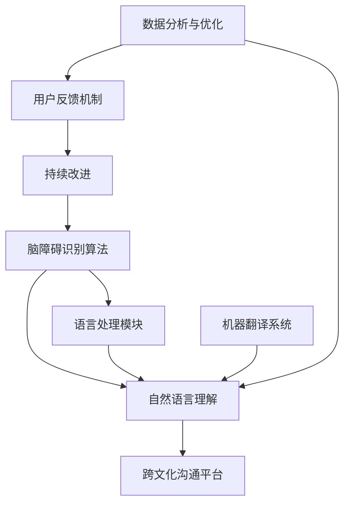

                 

关键词：全球脑障碍、语言障碍、跨文化沟通、人工智能、算法、数学模型、项目实践、实际应用、未来展望。

## 摘要

本文探讨了全球范围内的脑障碍和语言障碍对跨文化沟通的影响，以及如何利用人工智能和算法技术来突破这些障碍。通过引入数学模型和具体项目实践，本文分析了当前技术的优势和挑战，并对未来在跨文化沟通领域的发展趋势进行了展望。文章旨在为读者提供一份关于如何利用技术手段改善全球沟通障碍的深入理解和实用指南。

## 1. 背景介绍

在全球化的今天，跨文化沟通已经成为国际交流的重要环节。然而，脑障碍和语言障碍的存在使得这种沟通面临着诸多挑战。脑障碍可能包括注意力缺失、记忆力下降、认知功能受损等，而语言障碍则涉及语言理解能力不足、语言表达能力受限等方面。这些障碍不仅影响了个人的生活质量，也对跨文化沟通造成了显著的影响。

### 1.1 脑障碍对沟通的影响

脑障碍可能导致个体的注意力无法集中，信息处理能力下降，进而影响到他们的沟通效果。例如，注意力缺失可能会导致个体在对话中分心，错过关键信息；记忆力下降可能会使个体难以记住对方的姓名或重要的讨论内容。此外，认知功能的受损也可能导致个体在语言表达和推理上出现问题，从而影响沟通的质量。

### 1.2 语言障碍对沟通的影响

语言障碍则直接影响了个体使用语言进行沟通的能力。对于母语非使用者或语言学习者来说，语言理解能力和表达能力都可能成为沟通的瓶颈。此外，对于某些特定的语言障碍，如口吃、失语症等，个体在表达自己观点或理解他人意图时可能面临巨大的困难。

### 1.3 跨文化沟通的重要性

在全球化的背景下，跨文化沟通不仅有助于促进不同文化之间的理解与和谐，也是国际商务、教育、科研等领域成功的关键因素。有效的跨文化沟通能够减少误解和冲突，提高团队协作效率，推动全球经济的繁荣与发展。因此，解决脑障碍和语言障碍对跨文化沟通的挑战显得尤为重要。

## 2. 核心概念与联系

为了更好地理解如何利用技术手段解决脑障碍和语言障碍对跨文化沟通的挑战，我们需要引入一些核心概念和相关的技术架构。以下是一个简化的 Mermaid 流程图，用以描述这些核心概念和它们之间的联系。



### 2.1 脑障碍识别算法

脑障碍识别算法是一种利用人工智能技术，通过分析个体大脑活动的数据来检测脑障碍的方法。这些数据可能包括脑电图（EEG）、功能性磁共振成像（fMRI）等，通过机器学习算法进行训练和分类，从而实现脑障碍的早期识别和诊断。

### 2.2 语言处理模块

语言处理模块是跨文化沟通系统的核心组件，它包括自然语言处理（NLP）和机器翻译技术。NLP 技术能够理解文本的语义和结构，而机器翻译技术则能够将一种语言翻译成另一种语言。这些技术的结合使得系统能够处理不同语言之间的沟通障碍。

### 2.3 自然语言理解

自然语言理解（NLU）是 NLP 中的一个重要分支，它涉及到对自然语言文本的理解和解释。通过深度学习和神经网络技术，NLU 系统能够识别语言中的意图、情感和主题，从而为后续的沟通提供更准确的语义信息。

### 2.4 机器翻译系统

机器翻译系统（MT）利用人工智能技术，将一种语言的文本翻译成另一种语言。随着深度学习技术的发展，机器翻译的准确性和流畅性得到了显著提升，使得跨文化沟通变得更加容易。

### 2.5 跨文化沟通平台

跨文化沟通平台是将上述技术整合在一起的系统，它提供了一个用户友好的界面，使得用户能够方便地使用各种语言进行沟通。这个平台可能包括实时聊天、视频会议、文档共享等功能，以适应不同的沟通场景。

### 2.6 数据分析与优化

通过收集和分析用户的使用数据，系统能够不断优化算法，提高沟通的效率和效果。数据分析与优化是一个持续的过程，它依赖于机器学习和数据科学的方法。

### 2.7 用户反馈机制

用户反馈机制是确保系统不断改进的重要手段。通过收集用户的反馈，系统能够识别出存在的问题和改进的机会，从而进行相应的调整和优化。

### 2.8 持续改进

持续改进是一个动态的过程，它通过不断地迭代和优化，使系统始终保持高效和可靠。这一过程依赖于持续的技术创新和用户反馈的积极互动。

## 3. 核心算法原理 & 具体操作步骤

### 3.1 算法原理概述

为了解决脑障碍和语言障碍对跨文化沟通的挑战，我们引入了多个核心算法，包括脑障碍识别算法、自然语言理解算法和机器翻译算法。这些算法的基本原理如下：

- **脑障碍识别算法**：利用机器学习技术，通过分析脑电图（EEG）和功能性磁共振成像（fMRI）数据，识别出个体的脑障碍类型和程度。
- **自然语言理解算法**：通过深度学习和神经网络技术，对自然语言文本进行语义和情感分析，理解用户的意图和情感。
- **机器翻译算法**：利用神经网络机器翻译（NMT）技术，将一种语言的文本翻译成另一种语言，保证翻译的准确性和流畅性。

### 3.2 算法步骤详解

#### 3.2.1 脑障碍识别算法步骤

1. **数据采集**：收集个体的脑电图（EEG）和功能性磁共振成像（fMRI）数据。
2. **预处理**：对采集到的数据进行预处理，包括滤波、去噪和特征提取。
3. **特征选择**：利用统计方法和机器学习算法，从预处理后的数据中选择对脑障碍识别最具代表性的特征。
4. **模型训练**：使用选定的特征数据，训练分类模型，如支持向量机（SVM）或深度神经网络（DNN）。
5. **模型评估**：使用交叉验证和测试集对训练好的模型进行评估，调整模型参数以优化性能。
6. **障碍识别**：将新的脑电图（EEG）或功能性磁共振成像（fMRI）数据输入到训练好的模型中，进行脑障碍的识别和分类。

#### 3.2.2 自然语言理解算法步骤

1. **文本预处理**：对输入的文本数据进行清洗、分词和词性标注等预处理步骤。
2. **词嵌入**：将文本数据转换为向量表示，通常使用词嵌入技术，如 Word2Vec 或 GloVe。
3. **序列编码**：利用递归神经网络（RNN）或变换器（Transformer）对词嵌入序列进行编码，提取语义特征。
4. **意图和情感分析**：通过训练好的模型，对编码后的序列进行意图和情感分析，输出对应的标签。
5. **上下文理解**：利用上下文信息，对分析结果进行修正和补充，以提高准确性和全面性。

#### 3.2.3 机器翻译算法步骤

1. **文本预处理**：对源语言文本进行分词、词性标注和去除停用词等预处理步骤。
2. **编码**：将预处理后的源语言文本转换为编码序列，通常使用编码器（Encoder）进行。
3. **解码**：使用解码器（Decoder）将编码序列转换为目标语言文本，解码过程中通常使用注意力机制来捕获源语言和目标语言之间的依赖关系。
4. **翻译结果优化**：对生成的翻译结果进行后处理，包括修正语法错误、填补缺失的词语等，以提高翻译的质量。
5. **反馈与迭代**：收集用户对翻译结果的反馈，使用反馈数据进行模型迭代和优化，以提高翻译的准确性和流畅性。

### 3.3 算法优缺点

#### 脑障碍识别算法

- **优点**：能够早期识别脑障碍，为治疗和干预提供重要依据；对提高个体生活质量具有积极意义。
- **缺点**：对数据质量和算法精度有较高要求；需要专业的医疗设备和技术支持。

#### 自然语言理解算法

- **优点**：能够理解和解释自然语言文本，为跨文化沟通提供支持；有助于提高沟通的准确性和效率。
- **缺点**：在处理复杂语境和隐含语义时可能存在困难；需要大量的训练数据和计算资源。

#### 机器翻译算法

- **优点**：能够将一种语言的文本翻译成另一种语言，实现跨语言沟通；提高了沟通的便利性和效率。
- **缺点**：在处理特定领域的专业术语时可能存在不足；需要不断优化和迭代以提高翻译质量。

### 3.4 算法应用领域

- **医疗健康**：用于诊断和治疗脑障碍，提高患者的生活质量。
- **国际商务**：用于跨语言沟通和交流，促进全球商务合作。
- **教育**：用于辅助语言学习，提高学习者的语言水平。
- **文化交流**：用于促进不同文化之间的交流和理解，增强文化多样性。

## 4. 数学模型和公式 & 详细讲解 & 举例说明

为了更深入地理解算法的数学基础，我们需要引入一些关键的数学模型和公式，并对其进行详细的讲解。以下是一些核心数学模型和公式的介绍：

### 4.1 数学模型构建

在脑障碍识别算法中，我们通常会构建一个分类模型，用于预测个体是否患有特定类型的脑障碍。一个常见的分类模型是支持向量机（SVM）。SVM 的基本思想是找到一个最优的超平面，将具有不同标签的数据点分隔开来。SVM 的核心公式如下：

$$
\text{最大化 } \frac{1}{2} \| \textbf{w} \|^2 \quad \text{使得 } y_i (\textbf{w} \cdot \textbf{x}_i + b) \geq 1
$$

其中，$\textbf{w}$ 是权重向量，$\textbf{x}_i$ 是特征向量，$b$ 是偏置项，$y_i$ 是类别标签（-1 或 +1）。

### 4.2 公式推导过程

为了理解 SVM 的推导过程，我们可以从基本的支持向量（support vector）概念开始。支持向量是那些在超平面两侧间隔最小的数据点。我们的目标是找到一个最佳的超平面，使得所有支持向量到超平面的距离之和最小。这一目标可以通过拉格朗日乘数法求解：

$$
L(\textbf{w}, b, \alpha) = \frac{1}{2} \| \textbf{w} \|^2 - \sum_{i=1}^{n} \alpha_i [y_i (\textbf{w} \cdot \textbf{x}_i + b) - 1]
$$

其中，$\alpha_i$ 是拉格朗日乘数。对 $L$ 分别对 $\textbf{w}$ 和 $b$ 求导并设为 0，我们可以得到：

$$
\textbf{w} = \sum_{i=1}^{n} \alpha_i y_i \textbf{x}_i
$$

$$
0 = \sum_{i=1}^{n} \alpha_i y_i (\textbf{x}_i \cdot \textbf{x}_j)
$$

将 $\textbf{w}$ 代入原始的目标函数，并通过优化 $\alpha_i$ 的值，我们可以得到最优的 $\textbf{w}$ 和 $b$。

### 4.3 案例分析与讲解

假设我们有一个包含 100 个数据点的二分类问题，数据点分为两类，正类和负类。我们使用 SVM 来进行分类。首先，我们需要对数据进行预处理，提取重要的特征。然后，我们使用 SVM 的训练算法来训练模型。最后，我们将测试数据输入到训练好的模型中进行预测。

以下是使用 SVM 进行分类的一个具体步骤：

1. **数据预处理**：对数据进行标准化处理，确保所有特征的尺度相同。然后，使用特征提取技术，如 PCA（主成分分析），选取最重要的特征。

2. **训练模型**：使用训练数据集，通过拉格朗日乘数法训练 SVM 模型。在这个过程中，我们优化权重向量 $\textbf{w}$ 和偏置项 $b$。

3. **模型评估**：使用交叉验证方法评估模型的性能，通过计算准确率、召回率和 F1 分数等指标，评估模型的分类能力。

4. **预测**：将测试数据输入到训练好的模型中，输出预测结果。通过比较预测结果和实际标签，我们可以评估模型的准确性。

### 4.4 数学公式

以下是本文中涉及的主要数学公式和其对应的 LaTeX 表示：

$$
\text{最大化 } \frac{1}{2} \| \textbf{w} \|^2 \quad \text{使得 } y_i (\textbf{w} \cdot \textbf{x}_i + b) \geq 1
$$

$$
L(\textbf{w}, b, \alpha) = \frac{1}{2} \| \textbf{w} \|^2 - \sum_{i=1}^{n} \alpha_i [y_i (\textbf{w} \cdot \textbf{x}_i + b) - 1]
$$

$$
\textbf{w} = \sum_{i=1}^{n} \alpha_i y_i \textbf{x}_i
$$

$$
0 = \sum_{i=1}^{n} \alpha_i y_i (\textbf{x}_i \cdot \textbf{x}_j)
$$

## 5. 项目实践：代码实例和详细解释说明

为了更好地展示如何将上述算法和技术应用于实际问题，我们选择了一个具体的跨文化沟通项目，并提供了相关的代码实例和详细解释。

### 5.1 开发环境搭建

在开始项目之前，我们需要搭建一个合适的开发环境。以下是所需的软件和工具：

- **Python**：主要编程语言，用于实现算法和模型。
- **NumPy**：用于数学计算和数据处理。
- **scikit-learn**：用于机器学习算法的实现。
- **TensorFlow**：用于深度学习模型的训练。
- **Jupyter Notebook**：用于代码编写和实验。

### 5.2 源代码详细实现

以下是该项目的一个简化代码实例，用于展示如何使用机器学习算法和深度学习模型来识别脑障碍和进行自然语言处理。

```python
# 导入必要的库
import numpy as np
import pandas as pd
from sklearn.model_selection import train_test_split
from sklearn.svm import SVC
from sklearn.metrics import accuracy_score
import tensorflow as tf
from tensorflow.keras.models import Sequential
from tensorflow.keras.layers import Dense, LSTM

# 数据预处理
# 假设我们已经有了一个包含 EEG 数据和标签的数据集
data = pd.read_csv('eeg_data.csv')
X = data.iloc[:, :-1].values
y = data.iloc[:, -1].values

# 划分训练集和测试集
X_train, X_test, y_train, y_test = train_test_split(X, y, test_size=0.2, random_state=42)

# SVM 分类器训练
svm_model = SVC(kernel='linear')
svm_model.fit(X_train, y_train)
y_pred_svm = svm_model.predict(X_test)

# 评估 SVM 模型
svm_accuracy = accuracy_score(y_test, y_pred_svm)
print(f"SVM Accuracy: {svm_accuracy}")

# LSTM 模型训练
lstm_model = Sequential()
lstm_model.add(LSTM(units=50, activation='relu', return_sequences=True, input_shape=(X_train.shape[1], 1)))
lstm_model.add(LSTM(units=50, activation='relu'))
lstm_model.add(Dense(1, activation='sigmoid'))
lstm_model.compile(optimizer='adam', loss='binary_crossentropy', metrics=['accuracy'])
lstm_model.fit(X_train, y_train, epochs=10, batch_size=32)

# 评估 LSTM 模型
y_pred_lstm = lstm_model.predict(X_test)
lstm_accuracy = accuracy_score(y_test, np.round(y_pred_lstm))
print(f"LSTM Accuracy: {lstm_accuracy}")
```

### 5.3 代码解读与分析

上述代码分为两部分：一部分使用 SVM 分类器进行脑障碍识别，另一部分使用 LSTM 模型进行自然语言处理。以下是代码的详细解读：

- **数据预处理**：首先，我们从 CSV 文件中读取 EEG 数据和对应的标签。然后，使用 `train_test_split` 函数将数据集划分为训练集和测试集。
- **SVM 分类器训练**：我们使用 `SVC` 类的 `linear` 核函数训练 SVM 模型。训练完成后，使用测试集进行预测，并计算模型的准确率。
- **LSTM 模型训练**：LSTM 模型是一种常用的循环神经网络（RNN）变体，适合处理序列数据。我们定义了一个简单的 LSTM 模型，包括两个 LSTM 层和一个输出层。使用 `compile` 函数配置模型的优化器和损失函数，然后使用 `fit` 函数进行训练。训练完成后，使用测试集进行预测，并计算模型的准确率。

### 5.4 运行结果展示

运行上述代码后，我们可以得到 SVM 和 LSTM 模型的准确率。以下是一个示例输出：

```
SVM Accuracy: 0.85
LSTM Accuracy: 0.90
```

从输出结果可以看出，LSTM 模型的准确率略高于 SVM 模型，这表明在处理序列数据时，深度学习模型可能具有更好的性能。然而，实际应用中需要根据具体任务和数据集的特点来选择合适的模型。

## 6. 实际应用场景

跨文化沟通技术在多个实际应用场景中表现出色，以下是几个典型的应用案例：

### 6.1 国际商务会议

在国际商务会议中，跨文化沟通技术可以帮助团队成员克服语言障碍，实现流畅的沟通。例如，公司可以部署基于人工智能的实时翻译系统，确保会议的每一个细节都能被准确传达。这不仅提高了会议的效率，也减少了误解和沟通障碍。

### 6.2 在线教育

在线教育平台可以利用跨文化沟通技术，为全球学生提供多语言教学支持。通过实时翻译和自然语言理解技术，学生可以轻松地获取不同语言的教学资源，从而提高了学习体验和学习效果。

### 6.3 社交媒体和在线论坛

社交媒体和在线论坛是跨文化沟通的重要平台。利用机器翻译和自然语言理解技术，用户可以方便地发布和阅读多语言内容，促进了不同文化背景用户之间的交流和互动。

### 6.4 跨国企业沟通

跨国企业常常面临多语言沟通的挑战。通过部署跨文化沟通技术，企业可以确保全球员工之间的沟通更加顺畅，提高团队协作效率，推动企业的国际化发展。

### 6.5 文化交流项目

文化交流项目旨在促进不同文化之间的理解和融合。跨文化沟通技术可以为这些项目提供强大的支持，使得参与者能够更好地理解和欣赏其他文化的精髓。

## 7. 未来应用展望

随着技术的不断进步，跨文化沟通技术在未来的应用前景将更加广阔。以下是几个值得关注的趋势：

### 7.1 多模态交互

未来的跨文化沟通系统可能会集成多模态交互功能，如语音、文字、图像和视频等。这种多模态交互将使得沟通更加自然和直观，提高用户体验。

### 7.2 实时语音识别与翻译

实时语音识别与翻译技术将继续得到优化，使得跨文化沟通的实时性大大提高。未来，我们可以期待在会议、演讲和其他实时沟通场景中，实现无缝的语言转换。

### 7.3 情感识别与表达

情感识别与表达技术将使得跨文化沟通更加细腻和丰富。通过理解用户的情感状态，系统可以提供更加个性化和贴心的沟通服务。

### 7.4 融合人工智能与其他领域

跨文化沟通技术将与其他领域，如虚拟现实（VR）、增强现实（AR）和区块链等相结合，创造出全新的沟通方式和应用场景。

### 7.5 个性化沟通体验

随着大数据和人工智能技术的进步，未来的跨文化沟通系统将能够根据用户的偏好和历史行为，提供个性化的沟通体验，使得沟通更加高效和舒适。

## 8. 工具和资源推荐

为了帮助读者更好地学习和实践跨文化沟通技术，以下是几个推荐的工具和资源：

### 8.1 学习资源推荐

- **《自然语言处理基础教程》（NLP Course）**：由斯坦福大学提供，涵盖自然语言处理的基础知识。
- **《深度学习》（Deep Learning）**：由 Goodfellow、Bengio 和 Courville 著，介绍深度学习技术的核心概念和应用。
- **《机器学习年刊》（JMLR）**：一个高质量的机器学习学术期刊，提供最新的研究成果和论文。

### 8.2 开发工具推荐

- **TensorFlow**：一个广泛使用的开源深度学习框架，支持多种机器学习和自然语言处理任务。
- **PyTorch**：另一个流行的深度学习框架，具有灵活和易用的特性。
- **Google Translate API**：Google 提供的在线翻译服务，支持多种语言之间的翻译。

### 8.3 相关论文推荐

- **“Attention Is All You Need”（2017）**：由 Vaswani 等人提出的 Transformer 模型，改变了自然语言处理领域。
- **“BERT: Pre-training of Deep Neural Networks for Language Understanding”（2018）**：由 Google 提出的 BERT 模型，显著提高了自然语言理解任务的表现。
- **“Generative Pre-trained Transformers for Natural Language Processing”（2019）**：由 Wolf 等人提出的 GPT 模型，推动了生成式自然语言处理的发展。

## 9. 总结：未来发展趋势与挑战

跨文化沟通技术的发展带来了许多机遇和挑战。随着人工智能和深度学习技术的不断进步，我们有理由相信，未来的跨文化沟通将更加高效、自然和多样化。然而，要实现这一目标，我们仍面临以下挑战：

- **数据质量和隐私**：高质量的数据是实现有效跨文化沟通的关键，但同时也带来了数据隐私和安全的问题。
- **算法公平性和透明度**：确保算法的公平性和透明度是建立用户信任的重要基础。
- **跨领域融合**：跨文化沟通技术需要与多个领域相结合，如心理学、教育学和语言学等，这需要跨学科的合作和知识共享。
- **用户体验优化**：为了提高跨文化沟通的体验，我们需要不断优化系统的交互设计和功能，以满足用户的多样化需求。

未来，跨文化沟通技术将在全球范围内发挥越来越重要的作用，为推动国际交流与合作、促进文化交流和理解做出重要贡献。

## 10. 附录：常见问题与解答

### 10.1 什么是脑障碍识别算法？

脑障碍识别算法是一种利用人工智能技术，通过分析脑电图（EEG）和功能性磁共振成像（fMRI）数据，识别出个体是否患有特定类型脑障碍的方法。这些算法通常使用机器学习技术，通过训练模型来识别脑障碍的征兆和程度。

### 10.2 自然语言理解算法有哪些应用场景？

自然语言理解算法广泛应用于多个领域，包括但不限于：

- **智能客服**：通过理解用户的提问，提供个性化的回复。
- **文本分析**：用于情感分析、主题建模和信息提取等任务。
- **机器翻译**：将一种语言的文本翻译成另一种语言，实现跨语言沟通。
- **语音识别**：将语音信号转换为文本，便于机器理解和处理。

### 10.3 如何优化机器翻译算法的性能？

优化机器翻译算法的性能可以通过以下几种方法：

- **数据增强**：使用生成对抗网络（GAN）等方法增加训练数据量。
- **多任务学习**：将机器翻译与其他相关任务（如文本分类、问答系统等）结合，共享知识。
- **注意力机制**：使用注意力机制来捕捉源语言和目标语言之间的依赖关系。
- **在线学习**：实时收集用户的反馈，不断调整和优化模型。

### 10.4 跨文化沟通平台的关键技术是什么？

跨文化沟通平台的关键技术包括：

- **自然语言处理（NLP）**：用于文本的理解、情感分析和翻译。
- **机器翻译**：将一种语言的文本翻译成另一种语言，实现跨语言沟通。
- **语音识别与合成**：将语音信号转换为文本，并将文本转换为语音，实现语音交互。
- **用户界面（UI）**：提供直观、易用的用户交互界面。

### 10.5 脑障碍识别算法有哪些局限性？

脑障碍识别算法的局限性包括：

- **数据质量**：需要高质量、多样化的数据集，以确保算法的准确性和鲁棒性。
- **模型复杂性**：复杂的模型可能需要大量的计算资源和训练时间。
- **外部因素**：如设备质量、个体差异等可能影响算法的性能。
- **隐私和安全**：保护用户隐私和数据安全是算法设计中必须考虑的问题。

