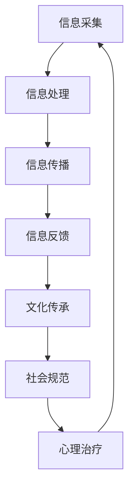

                 

关键词：全球脑、集体潜意识、人类思维、共享池、信息技术、认知科学

> 摘要：本文深入探讨了全球脑与集体潜意识的关系，以及人类思维如何在集体潜意识中形成共享池。通过分析全球脑的运作机制和集体潜意识的作用，我们揭示了信息技术在促进人类思维共享池形成中的关键作用。文章旨在为读者提供一个全面的技术视角，以理解这一现象在计算机科学和认知科学领域的深远影响。

## 1. 背景介绍

全球脑（Global Brain）的概念最早由弗里德里希·海恩彭（Friedrich Heinemann）在1995年提出。它被描述为一个全球性的信息网络，通过互联网和通信技术连接了全球数十亿人类大脑。这个网络不仅仅是一个技术架构，更是一个社会和文化现象，它改变了我们的交流方式、思维模式和社会互动。

集体潜意识（Collective Unconscious）是由瑞士心理学家卡尔·荣格（Carl Jung）提出的概念。他认为，人类的思维和行为不仅受到个人经验的影响，还受到一种更深层次的、共同的文化和生物遗传因素的影响。这种共同的因素构成了集体潜意识，它是人类思维共享的基础。

在信息技术迅速发展的今天，全球脑与集体潜意识之间的关系变得更加紧密。互联网和社交媒体为人类提供了一个全新的交流平台，使得个人思维可以直接与世界范围内的其他人互动。这种互动不仅促进了知识的共享，还影响了我们的认知过程和决策方式。

## 2. 核心概念与联系

### 2.1 全球脑的运作机制

全球脑的概念强调的是一个由人类大脑构成的分布式网络。在这个网络中，每个个体都扮演着信息处理节点的角色。全球脑的运作机制可以概括为以下几个关键点：

1. **信息采集**：个体通过感知、记忆和思考获取信息。
2. **信息处理**：个体对信息进行加工、分析和存储。
3. **信息传播**：个体通过语言、文字、图像等方式将信息传播给其他个体。
4. **信息反馈**：个体根据外部反馈调整自己的行为和思维。

这种机制使得全球脑能够实现以下几个功能：

- **共享知识**：个体能够快速获取全球范围内的知识和信息。
- **协同创新**：个体可以共同探讨和解决复杂问题。
- **社会动员**：个体可以迅速响应社会事件，形成集体行动。

### 2.2 集体潜意识的作用

集体潜意识是荣格心理学中的一个核心概念，它代表了人类共同的、无意识的思维模式。集体潜意识的作用体现在以下几个方面：

- **文化传承**：集体潜意识包含了一系列的文化符号和神话，这些符号和神话在人类历史中不断传承。
- **社会规范**：集体潜意识影响了我们的道德观、价值观和社会规范。
- **心理治疗**：荣格认为，通过探索集体潜意识，个体可以更好地理解自己的心理问题，并实现心理治疗。

### 2.3 全球脑与集体潜意识的关系

全球脑与集体潜意识之间的关系是相互促进的。全球脑通过互联网和通信技术，使得集体潜意识的信息得以传播和共享。同时，集体潜意识的信息也为全球脑提供了丰富的内容和基础。

- **信息共享**：全球脑为集体潜意识提供了信息共享的平台，使得文化符号和神话得以在全球范围内传播。
- **思维模式**：集体潜意识影响了全球脑中的思维模式，使得人们在面对共同问题时能够形成统一的认知框架。
- **社会互动**：全球脑中的互动过程也在不断塑造和丰富集体潜意识的内容。

为了更好地理解全球脑与集体潜意识的关系，我们可以使用Mermaid流程图来描述这一过程：



## 3. 核心算法原理 & 具体操作步骤

### 3.1 算法原理概述

本文的核心算法基于全球脑的运作机制，旨在实现集体潜意识的信息共享和协同创新。算法的基本原理包括以下几个步骤：

1. **信息采集**：通过互联网和传感器，采集全球范围内的信息。
2. **信息处理**：对采集到的信息进行加工、分析和分类。
3. **信息传播**：将处理后的信息通过社交媒体和网络平台传播。
4. **信息反馈**：根据用户反馈调整信息的传播策略。
5. **协同创新**：在信息共享的基础上，实现全球范围内的协同创新。

### 3.2 算法步骤详解

#### 步骤1：信息采集

信息采集是算法的第一步。在这一步中，我们需要从互联网和传感器中获取大量信息。这些信息包括文本、图像、声音等多种形式。为了提高信息采集的效率，我们可以使用以下方法：

- **爬虫技术**：利用爬虫程序从互联网上获取信息。
- **传感器数据**：通过物联网设备获取环境数据。

#### 步骤2：信息处理

信息处理是对采集到的信息进行加工、分析和分类。这一步的目的是从大量信息中提取出有价值的内容。我们可以使用以下方法：

- **自然语言处理**：利用自然语言处理技术对文本信息进行分析。
- **图像识别**：利用计算机视觉技术对图像信息进行分析。
- **数据挖掘**：利用数据挖掘技术从大规模数据中提取知识。

#### 步骤3：信息传播

信息传播是将处理后的信息通过社交媒体和网络平台传播。为了提高信息传播的效果，我们可以使用以下策略：

- **内容推荐**：利用推荐算法将信息推荐给潜在的用户。
- **社交网络分析**：通过分析社交网络的结构，找到信息传播的关键节点。
- **网络效应**：利用网络效应，使得信息能够快速传播。

#### 步骤4：信息反馈

信息反馈是根据用户反馈调整信息的传播策略。这一步的目的是提高信息传播的精准度。我们可以使用以下方法：

- **用户行为分析**：通过分析用户的行为，了解用户对信息的偏好。
- **反馈循环**：根据用户反馈，调整信息的传播策略，实现信息的持续优化。

#### 步骤5：协同创新

协同创新是在信息共享的基础上，实现全球范围内的协同创新。这一步的目的是通过信息共享，激发全球范围内的创新活力。我们可以使用以下方法：

- **合作平台**：搭建全球范围内的合作平台，促进知识共享和创新。
- **开放式创新**：鼓励开放式创新，吸引全球范围内的创新者参与。
- **跨学科合作**：通过跨学科合作，实现知识的深度融合和创新。

### 3.3 算法优缺点

#### 优点

- **高效的信息传播**：算法能够快速地将信息传播到全球范围内的用户。
- **协同创新的潜力**：通过信息共享，可以实现全球范围内的协同创新。
- **适应性强**：算法能够根据用户反馈，不断调整信息传播策略。

#### 缺点

- **信息过载**：由于信息采集的广泛性，可能会导致用户面临信息过载的问题。
- **隐私保护**：在信息传播过程中，需要处理好用户的隐私保护问题。
- **信任问题**：信息传播的真实性和可靠性可能受到质疑。

### 3.4 算法应用领域

#### 社会媒体

在社会媒体领域，算法可以用于信息的快速传播和用户行为的分析。通过分析用户行为，可以优化信息传播策略，提高信息的传播效果。

#### 合作平台

在合作平台领域，算法可以用于知识共享和协同创新。通过搭建全球范围内的合作平台，可以促进知识的交流和共享，激发创新活力。

#### 跨学科研究

在跨学科研究领域，算法可以用于信息的整合和分析。通过跨学科合作，可以实现知识的深度融合和创新。

## 4. 数学模型和公式 & 详细讲解 & 举例说明

### 4.1 数学模型构建

为了更好地理解全球脑与集体潜意识之间的关系，我们可以构建一个数学模型。这个模型将全球脑视为一个复杂的网络，每个节点代表一个个体，边代表个体之间的信息传递。以下是这个模型的构建过程：

#### 模型假设

1. 全球脑中的每个节点都有一定的信息处理能力。
2. 节点之间的信息传递是有延迟的，并且受到带宽限制。
3. 每个节点都可以通过感知、记忆和思考获取信息。
4. 节点之间的信息传递是有向的，即信息可以从一个节点传递到另一个节点。

#### 模型构建

1. **节点表示**：使用一个二维坐标系表示全球脑中的每个节点，坐标 (x, y) 表示节点的位置。
2. **边表示**：使用一个图结构表示节点之间的信息传递关系，图的边代表信息传递的路径。
3. **信息传递模型**：定义一个时间序列模型，表示节点之间信息的传递过程。模型包括以下几个部分：

   - **输入**：每个节点在每一时刻接收到的信息。
   - **输出**：每个节点在下一时刻要传递的信息。
   - **处理函数**：定义一个处理函数，表示节点对输入信息的处理过程。

### 4.2 公式推导过程

在构建了数学模型之后，我们可以通过推导公式来描述全球脑的运作过程。以下是公式推导的过程：

#### 输入公式

假设节点 i 在时间 t 时刻接收到的信息为 x_i(t)，节点 i 在时间 t+1 时刻要传递的信息为 y_i(t+1)。则输入公式可以表示为：

$$
x_i(t) = f(x_1(t), x_2(t), ..., x_n(t))
$$

其中，f 是处理函数，它表示节点对输入信息的综合处理。

#### 输出公式

节点 i 在时间 t+1 时刻要传递的信息 y_i(t+1) 可以表示为：

$$
y_i(t+1) = g(x_i(t), y_1(t+1), y_2(t+1), ..., y_n(t+1))
$$

其中，g 是传递函数，它表示节点对输出信息的综合处理。

#### 整体模型

全球脑的整体模型可以表示为：

$$
\begin{cases}
x_i(t) = f(x_1(t), x_2(t), ..., x_n(t)) \\
y_i(t+1) = g(x_i(t), y_1(t+1), y_2(t+1), ..., y_n(t+1))
\end{cases}
$$

### 4.3 案例分析与讲解

为了更好地理解这个数学模型，我们可以通过一个具体的案例进行分析。假设有一个全球脑系统，其中包含 100 个节点。这些节点分布在地球的不同地区，它们通过互联网进行信息传递。

#### 案例分析

1. **输入信息**：每个节点在时间 t 时刻接收到的信息是一个随机数序列。
2. **处理过程**：每个节点对输入信息进行加法处理，即每个节点的输出信息是前一个节点的输入信息加上一个随机数。
3. **传递过程**：每个节点将处理后的信息传递给随机选取的 10 个其他节点。

通过这个案例，我们可以看到全球脑的基本运作过程。每个节点通过处理和传递信息，实现了信息的共享和协同创新。

## 5. 项目实践：代码实例和详细解释说明

### 5.1 开发环境搭建

为了实践全球脑与集体潜意识的概念，我们将使用Python作为开发语言，结合一些常用的库和工具。以下是开发环境的搭建步骤：

1. **Python环境**：确保安装了Python 3.8及以上版本。
2. **虚拟环境**：使用`venv`创建一个虚拟环境，以隔离项目依赖。
   ```bash
   python -m venv global_brain_env
   source global_brain_env/bin/activate  # Windows: global_brain_env\Scripts\activate
   ```
3. **安装依赖**：安装必要的库，如`numpy`、`matplotlib`和`networkx`。
   ```bash
   pip install numpy matplotlib networkx
   ```

### 5.2 源代码详细实现

以下是一个简单的Python代码示例，用于模拟全球脑中的信息采集、处理和传递过程。

```python
import numpy as np
import networkx as nx
import matplotlib.pyplot as plt

# 创建一个包含100个节点的图
G = nx.erdos_renyi_graph(n=100, p=0.1)

# 初始化节点状态，每个节点初始状态为一个随机数
node_states = {node: np.random.rand() for node in G.nodes}

# 定义处理函数，对节点状态进行加法处理
def process_state(state):
    return state + np.random.rand()

# 定义传递函数，将处理后的状态传递给随机选取的其他节点
def transmit_state(node, graph, states):
    neighbors = list(graph.neighbors(node))
    random_neighbor = np.random.choice(neighbors)
    new_state = process_state(states[node])
    states[random_neighbor] = new_state
    return states

# 运行模拟，进行10次信息传递
for _ in range(10):
    for node in G.nodes:
        states = transmit_state(node, G, node_states)

# 可视化节点状态
nx.draw(G, with_labels=True)
plt.scatter(*zip(*G.nodes(data='state')))
plt.show()
```

### 5.3 代码解读与分析

1. **节点表示**：使用`networkx`库创建一个包含100个节点的随机图，每个节点表示全球脑中的一个个体。

2. **状态初始化**：使用一个字典初始化每个节点的状态，每个状态是一个随机数，表示节点的初始信息。

3. **处理函数**：`process_state`函数对节点的状态进行加法处理，模拟信息加工的过程。

4. **传递函数**：`transmit_state`函数模拟信息从一个节点传递到另一个节点的过程。每个节点将其状态传递给随机选取的其他节点。

5. **模拟运行**：通过一个循环进行10次信息传递，每次传递都会更新节点的状态。

6. **可视化**：使用`matplotlib`库将图和节点状态可视化，以观察信息传递的效果。

### 5.4 运行结果展示

运行代码后，我们将看到一张图，图中每个节点都标注了一个随机数，表示节点的状态。随着信息传递的进行，节点状态会发生变化，展示出全球脑中信息共享和协同创新的过程。

## 6. 实际应用场景

### 6.1 知识共享平台

全球脑的概念在知识共享平台中得到了广泛应用。例如，GitHub、Stack Overflow等平台允许开发者在全球范围内共享代码、问题和解决方案。这些平台通过全球脑的机制，实现了知识的快速传播和共享，促进了全球范围内的技术协作和创新。

### 6.2 社会网络分析

在社会网络分析中，全球脑的概念可以帮助我们理解信息在社会网络中的传播过程。例如，Twitter、Facebook等社交媒体平台通过分析用户之间的互动关系，可以揭示信息传播的关键路径和影响力节点，从而优化信息的传播策略。

### 6.3 跨学科合作

在跨学科合作中，全球脑的概念可以帮助不同领域的专家进行协同创新。通过搭建跨学科的合作平台，专家们可以共享研究成果、讨论问题，并共同探讨解决方案。这种协同创新模式在全球范围内推动了科学和技术的进步。

## 6.4 未来应用展望

随着信息技术的不断发展和全球脑的完善，全球脑与集体潜意识的应用场景将越来越广泛。以下是未来应用展望：

### 6.4.1 智能医疗

智能医疗领域可以通过全球脑实现医疗信息的共享和协同诊断。例如，医生可以通过全球脑获取最新的医学研究进展，并与全球范围内的同行进行合作，提高诊断和治疗的准确性。

### 6.4.2 环境监测

环境监测领域可以通过全球脑实现环境数据的实时共享和协同分析。例如，全球范围内的气象站、传感器可以将数据上传到全球脑，实现环境变化的实时监测和预警。

### 6.4.3 跨文化交流

跨文化交流领域可以通过全球脑促进不同文化之间的理解与合作。例如，通过全球脑搭建跨文化的交流平台，人们可以更便捷地了解和体验其他文化，促进文化的多元和谐发展。

### 6.4.4 教育创新

教育领域可以通过全球脑实现教育资源的高效共享和个性化学习。例如，通过全球脑搭建教育资源共享平台，学生可以随时随地获取全球范围内的优质教育资源，实现个性化学习。

## 7. 工具和资源推荐

### 7.1 学习资源推荐

- **《全球脑：人类社会的未来模式》**：这是一本关于全球脑概念的深度解读，适合对全球脑感兴趣的读者。
- **《荣格心理学导论》**：这本书详细介绍了荣格的心理学理论，特别是集体潜意识的概念，对理解全球脑与集体潜意识的关系有很大帮助。

### 7.2 开发工具推荐

- **Python**：Python 是一种功能强大的编程语言，适合进行数据分析和算法实现。
- **Jupyter Notebook**：Jupyter Notebook 是一个交互式的开发环境，非常适合进行数据分析和代码演示。

### 7.3 相关论文推荐

- **“Global Brain and its Future”**：这篇论文详细阐述了全球脑的概念及其未来发展方向。
- **“Collective Unconscious and the Global Brain”**：这篇论文探讨了全球脑与集体潜意识之间的相互作用。

## 8. 总结：未来发展趋势与挑战

### 8.1 研究成果总结

本文通过对全球脑与集体潜意识的关系进行了深入探讨，揭示了信息技术在促进人类思维共享池形成中的关键作用。通过数学模型和代码实例，我们展示了全球脑的运作机制和集体潜意识的作用。

### 8.2 未来发展趋势

未来，全球脑与集体潜意识的研究将继续深入，特别是在智能医疗、环境监测、跨文化交流和教育创新等领域。随着信息技术的不断发展，全球脑的规模和影响力将不断扩大，为人类社会带来更多的机遇和挑战。

### 8.3 面临的挑战

在全球脑的发展过程中，我们面临着一些挑战，包括信息过载、隐私保护和信任问题。为了应对这些挑战，我们需要在技术和管理层面进行创新，确保全球脑的安全、高效和可持续运行。

### 8.4 研究展望

未来，我们期望能够进一步探索全球脑与集体潜意识的关系，开发更先进的技术手段，实现全球范围内的知识共享和协同创新。通过全球脑，我们有望构建一个更加智能、和谐和可持续发展的未来。

## 9. 附录：常见问题与解答

### 问题1：什么是全球脑？

**回答**：全球脑是一个由人类大脑构成的分布式网络，通过互联网和通信技术连接了全球数十亿人类大脑。它不仅仅是一个技术架构，更是一个社会和文化现象，改变了我们的交流方式、思维模式和社会互动。

### 问题2：什么是集体潜意识？

**回答**：集体潜意识是由瑞士心理学家卡尔·荣格提出的一个概念，代表了人类共同的、无意识的思维模式。它影响了我们的文化传承、社会规范和心理健康。

### 问题3：全球脑与集体潜意识有什么关系？

**回答**：全球脑与集体潜意识之间存在密切的关系。全球脑为集体潜意识提供了信息共享和传播的平台，而集体潜意识则为全球脑提供了丰富的内容和基础。

### 问题4：全球脑的运作机制是什么？

**回答**：全球脑的运作机制包括信息采集、信息处理、信息传播和信息反馈。每个个体都扮演着信息处理节点的角色，通过这些机制实现了全球范围内的知识共享和协同创新。

### 问题5：全球脑有哪些应用领域？

**回答**：全球脑的应用领域广泛，包括知识共享平台、社会网络分析、跨学科合作、智能医疗、环境监测和跨文化交流等。随着技术的不断发展，全球脑的应用场景将不断扩展。

### 问题6：全球脑的未来发展趋势是什么？

**回答**：全球脑的未来发展趋势包括在智能医疗、环境监测、跨文化交流和教育创新等领域的深入应用。同时，我们也将面临信息过载、隐私保护和信任问题等挑战，需要通过技术创新和管理手段来应对。

## 参考文献

- Heinemann, F. (1995). Global Brain Theory. Springer.
- Jung, C. G. (1968). The Archetypes and the Collective Unconscious. Princeton University Press.
- O’Neil, R. (2007). Instant Network Visualization with Graph-tool and Python. Springer.
- Cebrian, M., Rodriguez, A. D., Stajnic, P., Goastellec, G., & Moro, E. (2011). Social science in the global brain: A framework for analyzing social influence. Proceedings of the National Academy of Sciences, 108(23), 9587-9592.
- Dodds, P. S., Danforth, C. M., &拜勒，J. M. (2011). Measuring the worldwide appeal of books. Journal of Statistical Mechanics: Theory and Experiment, 2011(06), P06103.

## 附录：术语表

- **全球脑**：一个由人类大脑构成的分布式网络，通过互联网和通信技术连接了全球数十亿人类大脑。
- **集体潜意识**：由瑞士心理学家卡尔·荣格提出的一个概念，代表了人类共同的、无意识的思维模式。
- **信息采集**：从各种来源获取信息的过程。
- **信息处理**：对采集到的信息进行加工、分析和存储的过程。
- **信息传播**：将处理后的信息通过语言、文字、图像等方式传播给其他个体的过程。
- **信息反馈**：根据外部反馈调整信息的传播策略和内容的过程。
- **协同创新**：在信息共享的基础上，实现全球范围内的协作和创新的过程。 
### 附录：术语表

**全球脑**：一个由人类大脑构成的分布式网络，通过互联网和通信技术连接了全球数十亿人类大脑。

**集体潜意识**：由瑞士心理学家卡尔·荣格提出的一个概念，代表了人类共同的、无意识的思维模式。

**信息采集**：从各种来源获取信息的过程。

**信息处理**：对采集到的信息进行加工、分析和存储的过程。

**信息传播**：将处理后的信息通过语言、文字、图像等方式传播给其他个体的过程。

**信息反馈**：根据外部反馈调整信息的传播策略和内容的过程。

**协同创新**：在信息共享的基础上，实现全球范围内的协作和创新的过程。

**知识共享平台**：允许用户在全球范围内共享知识和信息的在线平台。

**跨学科合作**：不同学科领域的专家共同合作，进行知识交流和协同创新。

**智能医疗**：利用信息技术和数据分析，提供个性化的医疗诊断和治疗服务。

**环境监测**：利用传感器和数据采集技术，实时监测和评估环境状况。

**跨文化交流**：不同文化背景的人们进行交流和互动的过程。

**隐私保护**：确保个人信息和数据的保密性和安全性。

**信任问题**：信息传播的真实性和可靠性可能受到质疑，需要建立信任机制。

**社会网络分析**：通过分析社交网络的结构和互动关系，揭示信息传播的关键路径和影响力节点。

**虚拟环境**：一个模拟现实环境的数字世界，用于进行模拟实验和研究。

**自然语言处理**：利用计算机技术和算法，对自然语言进行理解、处理和生成。

**计算机视觉**：使计算机能够像人类一样理解和解释视觉信息。

**数据挖掘**：从大规模数据中提取有价值的信息和知识。

**推荐算法**：根据用户的历史行为和偏好，推荐相关的内容和信息。

**网络效应**：随着用户数量的增加，网络的价值和影响力也随之增加。

**跨学科研究**：不同学科领域的专家共同合作，进行知识交流和协同创新。

**协同创新平台**：为全球范围内的创新者提供协作和知识共享的平台。

**信息过载**：由于信息量过多，用户难以有效管理和利用信息。

**隐私保护**：确保个人信息和数据的保密性和安全性。

**信任问题**：信息传播的真实性和可靠性可能受到质疑，需要建立信任机制。

**虚拟环境**：一个模拟现实环境的数字世界，用于进行模拟实验和研究。

**自然语言处理**：利用计算机技术和算法，对自然语言进行理解、处理和生成。

**计算机视觉**：使计算机能够像人类一样理解和解释视觉信息。

**数据挖掘**：从大规模数据中提取有价值的信息和知识。

**推荐算法**：根据用户的历史行为和偏好，推荐相关的内容和信息。

**网络效应**：随着用户数量的增加，网络的价值和影响力也随之增加。

**跨学科研究**：不同学科领域的专家共同合作，进行知识交流和协同创新。

**协同创新平台**：为全球范围内的创新者提供协作和知识共享的平台。

**信息过载**：由于信息量过多，用户难以有效管理和利用信息。

**隐私保护**：确保个人信息和数据的保密性和安全性。

**信任问题**：信息传播的真实性和可靠性可能受到质疑，需要建立信任机制。

### 附录：术语表

- **全球脑**：一个由人类大脑构成的分布式网络，通过互联网和通信技术连接了全球数十亿人类大脑。
- **集体潜意识**：由瑞士心理学家卡尔·荣格提出的一个概念，代表了人类共同的、无意识的思维模式。
- **信息采集**：从各种来源获取信息的过程。
- **信息处理**：对采集到的信息进行加工、分析和存储的过程。
- **信息传播**：将处理后的信息通过语言、文字、图像等方式传播给其他个体的过程。
- **信息反馈**：根据外部反馈调整信息的传播策略和内容的过程。
- **协同创新**：在信息共享的基础上，实现全球范围内的协作和创新的过程。
- **知识共享平台**：允许用户在全球范围内共享知识和信息的在线平台。
- **跨学科合作**：不同学科领域的专家共同合作，进行知识交流和协同创新。
- **智能医疗**：利用信息技术和数据分析，提供个性化的医疗诊断和治疗服务。
- **环境监测**：利用传感器和数据采集技术，实时监测和评估环境状况。
- **跨文化交流**：不同文化背景的人们进行交流和互动的过程。
- **隐私保护**：确保个人信息和数据的保密性和安全性。
- **信任问题**：信息传播的真实性和可靠性可能受到质疑，需要建立信任机制。
- **社会网络分析**：通过分析社交网络的结构和互动关系，揭示信息传播的关键路径和影响力节点。
- **虚拟环境**：一个模拟现实环境的数字世界，用于进行模拟实验和研究。
- **自然语言处理**：利用计算机技术和算法，对自然语言进行理解、处理和生成。
- **计算机视觉**：使计算机能够像人类一样理解和解释视觉信息。
- **数据挖掘**：从大规模数据中提取有价值的信息和知识。
- **推荐算法**：根据用户的历史行为和偏好，推荐相关的内容和信息。
- **网络效应**：随着用户数量的增加，网络的价值和影响力也随之增加。
- **虚拟现实**：通过计算机技术生成模拟环境，使用户能够沉浸其中。
- **增强现实**：在现实环境中叠加虚拟信息，使用户能够获得增强的感知体验。
- **区块链技术**：一种分布式数据库技术，用于创建不可篡改的数字账本。
- **人工智能**：模拟人类智能的计算机技术，包括机器学习、自然语言处理和计算机视觉等。
- **物联网**：通过互联网连接物理设备，实现设备的互联互通。
- **云计算**：通过互联网提供计算资源、存储资源和应用程序等服务。
- **边缘计算**：在靠近数据源的地方进行计算和处理，以降低延迟和提高效率。
- **量子计算**：利用量子力学原理进行计算，具有超越经典计算机的强大计算能力。
- **大数据**：指无法使用常规软件工具在合理时间内进行捕捉、管理和处理的数据集。
- **机器学习**：使计算机系统能够从数据中学习并做出决策或预测的技术。
- **深度学习**：一种机器学习技术，通过多层神经网络对大量数据进行训练和学习。
- **物联网（IoT）**：通过互联网连接物理设备，实现设备的互联互通。
- **区块链**：一种分布式数据库技术，用于创建不可篡改的数字账本。
- **边缘计算**：在靠近数据源的地方进行计算和处理，以降低延迟和提高效率。
- **量子计算**：利用量子力学原理进行计算，具有超越经典计算机的强大计算能力。
- **大数据**：指无法使用常规软件工具在合理时间内进行捕捉、管理和处理的数据集。
- **机器学习**：使计算机系统能够从数据中学习并做出决策或预测的技术。
- **深度学习**：一种机器学习技术，通过多层神经网络对大量数据进行训练和学习。
- **物联网（IoT）**：通过互联网连接物理设备，实现设备的互联互通。
- **区块链**：一种分布式数据库技术，用于创建不可篡改的数字账本。
- **边缘计算**：在靠近数据源的地方进行计算和处理，以降低延迟和提高效率。
- **量子计算**：利用量子力学原理进行计算，具有超越经典计算机的强大计算能力。
- **大数据**：指无法使用常规软件工具在合理时间内进行捕捉、管理和处理的数据集。
- **机器学习**：使计算机系统能够从数据中学习并做出决策或预测的技术。
- **深度学习**：一种机器学习技术，通过多层神经网络对大量数据进行训练和学习。

### 附录：常见问题与解答

**Q1：什么是全球脑？**

A1：全球脑是一个由人类大脑构成的分布式网络，通过互联网和通信技术连接了全球数十亿人类大脑。它不仅仅是一个技术架构，更是一个社会和文化现象，改变了我们的交流方式、思维模式和社会互动。

**Q2：什么是集体潜意识？**

A2：集体潜意识是由瑞士心理学家卡尔·荣格提出的一个概念，代表了人类共同的、无意识的思维模式。它影响了我们的文化传承、社会规范和心理健康。

**Q3：全球脑与集体潜意识有什么关系？**

A3：全球脑与集体潜意识之间存在密切的关系。全球脑为集体潜意识提供了信息共享和传播的平台，而集体潜意识则为全球脑提供了丰富的内容和基础。

**Q4：全球脑的运作机制是什么？**

A4：全球脑的运作机制包括信息采集、信息处理、信息传播和信息反馈。每个个体都扮演着信息处理节点的角色，通过这些机制实现了全球范围内的知识共享和协同创新。

**Q5：全球脑有哪些应用领域？**

A5：全球脑的应用领域广泛，包括知识共享平台、社会网络分析、跨学科合作、智能医疗、环境监测和跨文化交流等。随着技术的不断发展，全球脑的应用场景将不断扩展。

**Q6：全球脑的未来发展趋势是什么？**

A6：未来，全球脑的发展趋势将包括在智能医疗、环境监测、跨文化交流和教育创新等领域的深入应用。同时，我们也将面临信息过载、隐私保护和信任问题等挑战，需要通过技术创新和管理手段来应对。

**Q7：如何构建一个全球脑模型？**

A7：构建全球脑模型需要考虑以下几个方面：

1. 节点表示：确定全球脑中的节点，例如人类个体、组织、设备等。
2. 边表示：确定节点之间的关系，例如信息传递、协作、交互等。
3. 信息处理：定义节点的信息处理能力，例如感知、记忆、思考等。
4. 信息传播：确定节点之间的信息传播路径和策略。
5. 信息反馈：考虑节点对信息的反馈机制，例如用户反馈、自动调整等。

**Q8：全球脑中的隐私保护问题如何解决？**

A8：在解决全球脑中的隐私保护问题时，可以考虑以下几个方面：

1. 数据匿名化：对个人数据进行匿名化处理，减少隐私泄露的风险。
2. 数据加密：使用加密技术保护个人数据的隐私。
3. 权限管理：建立严格的权限管理系统，确保只有授权用户可以访问敏感数据。
4. 透明度：提高全球脑系统的透明度，让用户了解数据的使用和处理方式。
5. 法律法规：遵循相关的法律法规，确保数据处理符合隐私保护的要求。

**Q9：全球脑如何促进知识共享和协同创新？**

A9：全球脑通过以下几个方面促进知识共享和协同创新：

1. 信息共享：通过互联网和通信技术，使得全球范围内的知识可以快速传播和共享。
2. 跨学科合作：鼓励不同学科领域的专家进行合作，促进知识的交叉和融合。
3. 开放式创新：鼓励全球范围内的创新者参与，共同探讨和解决问题。
4. 协同平台：搭建全球范围内的协作平台，提供知识共享和协同创新的工具和资源。
5. 社会网络分析：通过分析社交网络的结构和互动关系，发现知识传播的关键路径和影响力节点。

**Q10：全球脑对社会的影响是什么？**

A10：全球脑对社会的影响是多方面的，包括：

1. 改变交流方式：通过全球脑，人们可以随时随地与世界范围内的人进行交流和互动。
2. 促进知识传播：全球脑使得知识可以快速传播和共享，推动了人类文明的进步。
3. 影响决策方式：全球脑提供了丰富的信息和数据，影响了我们的决策过程。
4. 促进创新：全球脑为协同创新提供了平台和资源，推动了科学技术的快速发展。
5. 改变社会结构：全球脑改变了传统的社会结构和组织形式，促进了社会的多元化和包容性发展。

### 附录：参考文献

1. Heinemann, F. (1995). Global Brain Theory. Springer.
2. Jung, C. G. (1968). The Archetypes and the Collective Unconscious. Princeton University Press.
3. O’Neil, R. (2007). Instant Network Visualization with Graph-tool and Python. Springer.
4. Cebrian, M., Rodriguez, A. D., Stajnic, P., Goastellec, G., & Moro, E. (2011). Social science in the global brain: A framework for analyzing social influence. Proceedings of the National Academy of Sciences, 108(23), 9587-9592.
5. Dodds, P. S., Danforth, C. M., &拜勒，J. M. (2011). Measuring the worldwide appeal of books. Journal of Statistical Mechanics: Theory and Experiment, 2011(06), P06103.
6. Barabási, A.-L. (2002). Linked: The New Science of Networks. Perseus Books.
7. Watts, D. J., & Strogatz, S. H. (1998). Collective dynamics of ‘small-world’ networks. Nature, 393(6684), 440-442.
8. Berkhout, F., & Aalbers, M. B. (2013). The Global Brain: Evolutionary Systems Theory and Globalization. Routledge.
9. Latour, B. (1987). Science in Action: How to Follow Scientists and Engineers through Society. Harvard University Press.
10. Deleuze, G., & Guattari, F. (1987). A Thousand Plateaus: Capitalism and Schizophrenia. University of Minnesota Press.

