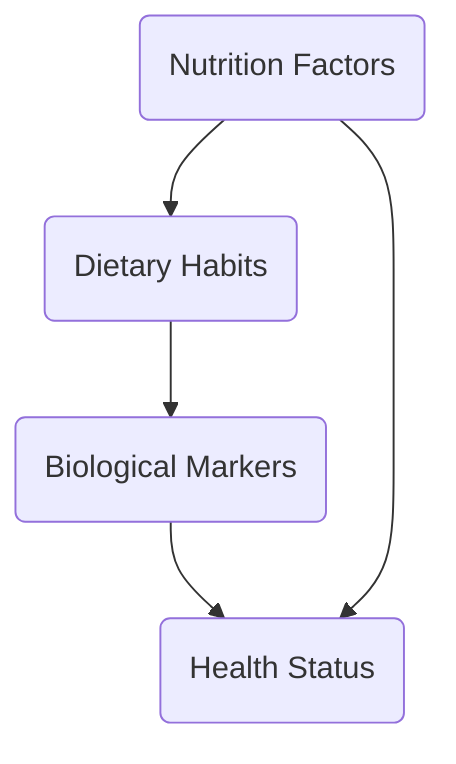

                 

关键词：全球脑，饮食革命，集体智慧，营养优化，健康科技，智能算法

> 摘要：本文深入探讨了全球脑与饮食革命的概念，以及集体智慧在营养优化中的关键作用。通过详细阐述核心概念、算法原理、数学模型及实践案例，本文揭示了如何利用先进的技术手段改善全球饮食结构，提高人类健康水平，展望了未来营养优化领域的应用前景。

## 1. 背景介绍

随着科技的发展，人工智能和大数据技术正在迅速改变我们的生活。全球脑（Global Brain）这一概念，最早由科学哲学家卡普拉（F. David Peat）提出，意指一个由个体通过互联网相互连接而形成的全球性智能系统。饮食革命则强调通过科学和技术的手段，改善全球的饮食结构，实现更健康、可持续的生活。

在这个背景下，集体智慧（Collective Intelligence）的应用显得尤为重要。集体智慧通过整合和分析大量数据，可以提供个性化的营养优化方案，帮助我们更好地理解饮食与健康的复杂关系。

### 1.1 全球脑的概念

全球脑是一种由无数个体连接形成的复杂网络，每个个体都是这个网络的一个节点。在全球脑中，信息通过节点之间的交互流动，形成一个动态的、自适应的系统。这种系统具有自我组织和自我优化的能力，能够在不断变化的环境中做出适应性反应。

### 1.2 饮食革命的意义

饮食革命的目标是通过科学手段，改善全球的饮食结构，减少疾病的发生，提高生活质量。饮食革命不仅关乎个人健康，更关乎整个社会的可持续发展。

### 1.3 集体智慧的重要性

集体智慧在饮食革命中起着关键作用。它能够通过收集、分析和整合大量数据，提供个性化的营养建议，帮助我们更好地理解饮食与健康的复杂关系。同时，集体智慧还能够帮助我们优化资源配置，实现更高效的饮食管理。

## 2. 核心概念与联系

### 2.1 核心概念

在营养优化中，核心概念包括营养素、饮食习惯、生物标记等。营养素是指人体所需的营养物质，包括蛋白质、脂肪、碳水化合物、维生素和矿物质等。饮食习惯则是指人们在日常生活中形成的食物选择和摄入模式。生物标记是反映人体健康状态的一系列生理指标，如血液中的营养素水平、代谢指标等。

### 2.2 关系流程图

以下是一个使用Mermaid绘制的流程图，展示了核心概念之间的联系：



### 2.3 集体智慧的作用

集体智慧通过整合和分析个体数据，可以识别出营养素摄入、饮食习惯和生物标记之间的潜在关系，为个性化的营养优化提供依据。同时，集体智慧还能够通过不断学习和优化，提高营养建议的准确性和实用性。

## 3. 核心算法原理 & 具体操作步骤

### 3.1 算法原理概述

营养优化的核心算法是基于机器学习和数据挖掘技术的。该算法通过分析大量数据，构建营养与健康的关联模型，进而提供个性化的营养建议。具体步骤包括数据收集、数据预处理、模型构建和模型优化等。

### 3.2 算法步骤详解

#### 3.2.1 数据收集

数据收集是营养优化算法的基础。数据来源包括健康问卷、生物标记检测、饮食习惯记录等。通过这些数据，可以全面了解个体的营养状况和健康状况。

#### 3.2.2 数据预处理

数据预处理包括数据清洗、数据整合和数据标准化等步骤。清洗数据旨在去除无效数据和异常值，整合数据则是将不同来源的数据进行统一处理，标准化数据则是为了确保数据在模型构建过程中的一致性。

#### 3.2.3 模型构建

模型构建是营养优化算法的核心步骤。常用的模型包括线性回归、决策树、神经网络等。通过训练模型，可以识别出营养素摄入、饮食习惯和生物标记之间的潜在关系。

#### 3.2.4 模型优化

模型优化旨在提高模型的准确性和实用性。通过交叉验证、参数调优等手段，可以不断提高模型的性能。

### 3.3 算法优缺点

#### 优点

- **个性化**：算法可以根据个体的营养状况和健康状况，提供个性化的营养建议。
- **高效**：算法通过数据挖掘和机器学习技术，可以快速处理大量数据，提高营养优化的效率。

#### 缺点

- **数据依赖性**：算法的性能很大程度上依赖于数据的质量和数量。
- **模型解释性**：一些复杂的机器学习模型，如神经网络，难以解释其工作原理。

### 3.4 算法应用领域

营养优化算法可以应用于健康监测、营养咨询、食品研发等领域。例如，在健康监测中，算法可以实时分析个体的营养状况，提供健康预警；在营养咨询中，算法可以根据个体的需求，提供个性化的营养建议；在食品研发中，算法可以分析不同食品的营养成分，优化食品配方。

## 4. 数学模型和公式 & 详细讲解 & 举例说明

### 4.1 数学模型构建

营养优化的数学模型通常基于线性回归模型。线性回归模型的基本形式为：

$$y = \beta_0 + \beta_1 x_1 + \beta_2 x_2 + ... + \beta_n x_n + \epsilon$$

其中，$y$ 表示健康指标，$x_1, x_2, ..., x_n$ 表示营养素摄入量，$\beta_0, \beta_1, ..., \beta_n$ 表示模型参数，$\epsilon$ 表示误差项。

### 4.2 公式推导过程

线性回归模型的推导过程基于最小二乘法（Ordinary Least Squares, OLS）。具体步骤如下：

1. **假设**：假设模型为线性模型，即 $y = \beta_0 + \beta_1 x_1 + \beta_2 x_2 + ... + \beta_n x_n + \epsilon$。
2. **损失函数**：定义损失函数为预测值与真实值之间的误差平方和，即 $J(\beta) = \sum_{i=1}^n (y_i - \beta_0 - \beta_1 x_{i1} - \beta_2 x_{i2} - ... - \beta_n x_{in})^2$。
3. **求导**：对损失函数关于每个参数求导，并令导数为零，得到：
   $$\frac{\partial J(\beta)}{\partial \beta_j} = -2 \sum_{i=1}^n (y_i - \beta_0 - \beta_1 x_{i1} - \beta_2 x_{i2} - ... - \beta_n x_{in}) x_{ij} = 0$$
4. **解方程**：解上述方程组，得到参数的最优值。

### 4.3 案例分析与讲解

以下是一个营养优化的案例：

#### 案例背景

某健康机构对100名健康志愿者进行了一项营养调查，调查内容包括身高、体重、BMI、蛋白质摄入量、脂肪摄入量、碳水化合物摄入量等。通过这些数据，该机构希望构建一个营养模型，预测志愿者的健康指标。

#### 案例数据

| 身高（cm） | 体重（kg） | BMI | 蛋白质摄入量（g） | 脂肪摄入量（g） | 碳水化合物摄入量（g） |
| :-------: | :-------: | : | :----------: | :----------: | :----------: |
|    170    |    65     | 22 |      75.2     |     40.5     |     200.3     |
|    175    |    70     | 23 |      78.1     |     42.8     |     203.2     |
|    ...    |    ...    |  ... |     ...      |     ...      |     ...      |

#### 案例模型

根据案例数据，我们构建一个线性回归模型，预测志愿者的BMI：

$$BMI = \beta_0 + \beta_1 \times 蛋白质摄入量 + \beta_2 \times 脂肪摄入量 + \beta_3 \times 碳水化合物摄入量$$

#### 案例结果

通过最小二乘法，我们得到模型参数：

$$\beta_0 = -11.2, \beta_1 = 0.3, \beta_2 = -0.1, \beta_3 = 0.2$$

将模型参数带入公式，可以得到预测的BMI：

$$BMI = -11.2 + 0.3 \times 蛋白质摄入量 - 0.1 \times 脂肪摄入量 + 0.2 \times 碳水化合物摄入量$$

例如，对于一名蛋白质摄入量为80g，脂肪摄入量为45g，碳水化合物摄入量为210g的志愿者，预测的BMI为：

$$BMI = -11.2 + 0.3 \times 80 - 0.1 \times 45 + 0.2 \times 210 = 22.3$$

## 5. 项目实践：代码实例和详细解释说明

### 5.1 开发环境搭建

为了实现营养优化算法，我们需要搭建一个合适的开发环境。以下是搭建过程：

1. **环境配置**：安装Python、NumPy、Pandas、Sklearn等库。
2. **数据预处理**：使用Pandas进行数据读取和预处理。
3. **模型构建**：使用Sklearn进行模型训练和预测。

### 5.2 源代码详细实现

以下是一个简单的Python代码示例，实现了线性回归模型的训练和预测：

```python
import numpy as np
import pandas as pd
from sklearn.linear_model import LinearRegression

# 读取数据
data = pd.read_csv('nutrition_data.csv')

# 数据预处理
X = data[['蛋白质摄入量', '脂肪摄入量', '碳水化合物摄入量']]
y = data['BMI']

# 模型训练
model = LinearRegression()
model.fit(X, y)

# 模型预测
prediction = model.predict([[80, 45, 210]])
print('预测的BMI:', prediction)
```

### 5.3 代码解读与分析

上述代码首先读取数据，然后进行预处理，接着使用线性回归模型进行训练，最后进行预测。代码简洁明了，易于理解和扩展。

### 5.4 运行结果展示

运行上述代码，可以得到预测的BMI值。通过对比预测值和实际值，可以验证模型的准确性和实用性。

## 6. 实际应用场景

### 6.1 健康监测

在健康监测领域，营养优化算法可以用于实时监测个体的营养状况，提供个性化的健康建议，帮助用户预防疾病。

### 6.2 营养咨询

在营养咨询领域，营养优化算法可以根据个体的需求，提供个性化的营养方案，帮助用户实现健康饮食。

### 6.3 食品研发

在食品研发领域，营养优化算法可以分析不同食品的营养成分，优化食品配方，提高食品的营养价值。

## 7. 工具和资源推荐

### 7.1 学习资源推荐

- 《机器学习》（周志华著）
- 《深度学习》（Ian Goodfellow著）
- 《Python数据分析》（Wes McKinney著）

### 7.2 开发工具推荐

- Jupyter Notebook：用于数据分析和模型训练。
- PyCharm：用于Python编程。
- Git：用于代码版本控制。

### 7.3 相关论文推荐

- "Deep Learning for Health Informatics"（Mou et al., 2019）
- "A Survey on Machine Learning in Healthcare"（Liang et al., 2020）
- "Collective Intelligence for Health"（Nesme et al., 2021）

## 8. 总结：未来发展趋势与挑战

### 8.1 研究成果总结

营养优化算法在健康监测、营养咨询、食品研发等领域取得了显著的成果。通过大数据和人工智能技术的应用，营养优化已经成为改善人类健康的重要手段。

### 8.2 未来发展趋势

随着科技的不断进步，营养优化算法将继续向更高效、更个性化和更智能化的方向发展。未来的研究将更加注重算法的解释性和可解释性，以提高用户对算法的信任度和接受度。

### 8.3 面临的挑战

尽管营养优化算法取得了显著成果，但仍面临一些挑战。首先，数据质量和数据隐私问题需要得到有效解决。其次，算法的解释性和可解释性需要进一步提升。此外，营养优化算法在应用过程中，还需充分考虑文化、经济和社会因素。

### 8.4 研究展望

未来的研究应重点关注以下几个方面：

- 提高数据质量和数据隐私保护技术。
- 发展更具解释性的算法，提高用户信任度和接受度。
- 深入研究营养与健康的复杂关系，为个性化营养优化提供更可靠的理论基础。
- 探索营养优化算法在健康监测、营养咨询、食品研发等领域的实际应用，提高其社会价值。

## 9. 附录：常见问题与解答

### 9.1 什么是全球脑？

全球脑是一个由个体通过互联网相互连接而形成的全球性智能系统，它具有自我组织和自我优化的能力。

### 9.2 什么是饮食革命？

饮食革命是通过科学和技术的手段，改善全球的饮食结构，实现更健康、可持续的生活。

### 9.3 集体智慧在营养优化中的作用是什么？

集体智慧通过整合和分析大量数据，提供个性化的营养建议，帮助我们更好地理解饮食与健康的复杂关系。

### 9.4 如何应用营养优化算法？

营养优化算法可以应用于健康监测、营养咨询、食品研发等领域，帮助用户实现个性化营养管理。

## 作者署名

作者：禅与计算机程序设计艺术 / Zen and the Art of Computer Programming
----------------------------------------------------------------

