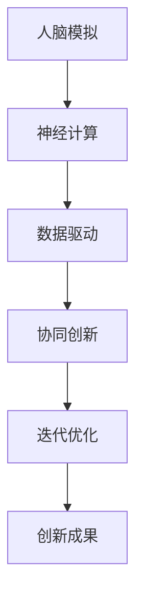

                 

关键词：脑创新、人工智能、孵化器、人类进步、技术发展

> 摘要：本文旨在探讨全球脑创新孵化器在推动人类科技进步方面的重要作用。通过分析脑创新的核心概念与联系，深入探讨其核心算法原理、数学模型及其在实际应用场景中的表现，本文揭示了全球脑创新孵化器作为加速人类进步引擎的强大潜力。

## 1. 背景介绍

在全球化的背景下，科技的发展已经成为推动经济增长和社会进步的关键力量。随着人工智能、大数据、物联网等新兴技术的迅速崛起，传统产业正面临着前所未有的变革。为了应对这一挑战，全球范围内的脑创新孵化器应运而生，成为推动科技创新的重要引擎。

脑创新孵化器是一种特殊的创新组织，旨在通过整合资源、搭建平台、提供支持等方式，培育和孵化具有颠覆性和创新性的科技项目。这些孵化器不仅聚集了一批顶尖的科研人员和创业者，还与各大高校、研究机构和产业巨头建立了紧密的合作关系，形成了创新生态系统。

脑创新孵化器的作用不仅局限于技术层面的突破，更在于它能够激发创新活力，推动产业变革，加速社会进步。本文将围绕脑创新孵化器的核心概念、算法原理、数学模型及其实际应用场景，展开深入探讨，以揭示其在全球科技创新中的重要地位。

## 2. 核心概念与联系

脑创新孵化器作为一个复杂的系统，其核心概念与联系涉及多个层面。首先，我们需要了解脑创新的基本概念。脑创新是指通过模拟人脑思维方式，实现对复杂问题的求解和决策。这一概念源于人脑的认知机制和神经网络结构，旨在通过人工智能技术，实现更高效、更智能的科技创新。

脑创新孵化器的核心概念包括以下几个方面：

1. **人脑模拟**：通过模仿人脑的神经元连接和信号传递机制，构建脑模型，用于模拟人类思维过程。

2. **神经计算**：利用神经网络技术，实现对人脑处理信息方式的模拟，从而提高计算效率和问题求解能力。

3. **数据驱动**：通过大数据分析和机器学习算法，从海量数据中提取有价值的信息，为脑创新提供数据支持。

4. **协同创新**：通过搭建开放的平台和生态系统，促进不同领域、不同行业之间的合作与交流，实现资源的最优配置。

5. **迭代优化**：通过不断迭代和优化，提高脑创新项目的成熟度和可行性，加速科技成果的转化。

为了更好地理解这些核心概念之间的联系，我们可以使用Mermaid流程图进行描述。以下是一个简化的脑创新孵化器流程图：



在人脑模拟阶段，通过构建脑模型，我们可以模拟人脑的思维方式，为后续的神经计算提供基础。神经计算则利用神经网络技术，实现对人脑处理信息方式的模拟，从而提高计算效率和问题求解能力。数据驱动阶段，通过大数据分析和机器学习算法，我们从海量数据中提取有价值的信息，为脑创新提供数据支持。协同创新阶段，通过搭建开放的平台和生态系统，促进不同领域、不同行业之间的合作与交流，实现资源的最优配置。最后，在迭代优化阶段，通过不断迭代和优化，提高脑创新项目的成熟度和可行性，加速科技成果的转化。

通过上述流程图，我们可以清晰地看到脑创新孵化器的各个核心概念之间的联系，以及它们在整个创新过程中的作用。

## 3. 核心算法原理 & 具体操作步骤

### 3.1 算法原理概述

脑创新孵化器的核心算法主要基于神经网络技术和机器学习算法。神经网络是一种模仿人脑神经元连接和信号传递机制的模型，它通过多层节点（神经元）的互联，实现对输入数据的处理和输出。而机器学习算法则通过训练神经网络，使其具备自主学习和优化能力。

在脑创新孵化器中，神经网络技术主要用于以下几个方面：

1. **数据预处理**：通过对原始数据进行清洗、归一化等处理，为后续的神经计算提供高质量的数据。

2. **特征提取**：通过神经网络，从数据中提取出具有代表性的特征，用于后续的模型训练和预测。

3. **模式识别**：利用神经网络，实现对数据中的模式进行识别和分类，从而为创新项目提供决策支持。

4. **优化决策**：通过神经网络，实现对创新项目的优化决策，提高项目的可行性和成功率。

### 3.2 算法步骤详解

在脑创新孵化器中，核心算法的具体操作步骤可以分为以下几个阶段：

1. **数据收集与预处理**：
   - 收集来自各个领域的海量数据，包括文本、图像、音频等。
   - 对数据进行清洗、归一化等预处理操作，提高数据质量。

2. **特征提取**：
   - 使用神经网络技术，从预处理后的数据中提取出具有代表性的特征。
   - 特征提取过程包括卷积神经网络（CNN）、循环神经网络（RNN）等。

3. **模型训练**：
   - 使用提取出的特征，对神经网络进行训练，使其具备分类、预测等能力。
   - 训练过程中，通过反向传播算法（Backpropagation）不断调整神经网络权重，提高模型性能。

4. **模型评估与优化**：
   - 对训练完成的模型进行评估，包括准确性、召回率、F1分数等指标。
   - 根据评估结果，对模型进行优化和调整，提高模型性能。

5. **创新项目决策**：
   - 使用训练完成的模型，对创新项目进行评估和预测，提供决策支持。
   - 根据评估结果，对创新项目进行优先级排序，指导孵化器的资源配置。

### 3.3 算法优缺点

脑创新孵化器的核心算法具有以下优点：

1. **高效性**：神经网络和机器学习算法具有较高的计算效率和问题求解能力，能够快速处理海量数据。

2. **自主性**：通过机器学习算法，神经网络能够自主学习和优化，提高模型的适应性和鲁棒性。

3. **灵活性**：神经网络和机器学习算法具有很好的灵活性，可以应用于多种领域和任务，实现跨领域的创新。

然而，脑创新孵化器的核心算法也存在一些缺点：

1. **复杂性**：神经网络和机器学习算法的计算过程较为复杂，需要大量的计算资源和时间。

2. **数据依赖**：算法的性能很大程度上取决于数据的质量和数量，数据不足或质量不高可能导致算法效果不佳。

3. **过拟合**：在训练过程中，神经网络和机器学习算法可能存在过拟合现象，导致模型在训练数据上表现良好，但在实际应用中效果较差。

### 3.4 算法应用领域

脑创新孵化器的核心算法已在多个领域得到广泛应用，包括：

1. **金融领域**：利用神经网络和机器学习算法，实现对金融市场的预测和风险评估，提高投资决策的准确性。

2. **医疗领域**：通过神经网络和机器学习算法，实现对医疗数据的分析和处理，辅助医生进行诊断和治疗。

3. **农业领域**：利用神经网络和机器学习算法，实现对作物生长的监测和预测，提高农业生产的效率。

4. **能源领域**：通过神经网络和机器学习算法，实现对能源消耗的预测和管理，提高能源利用效率。

5. **教育领域**：利用神经网络和机器学习算法，为个性化教育提供支持，提高学生的学习效果。

## 4. 数学模型和公式 & 详细讲解 & 举例说明

### 4.1 数学模型构建

脑创新孵化器的数学模型主要包括神经网络模型和机器学习算法模型。以下是一个简化的神经网络模型示例：

$$
\begin{aligned}
    &x^{(l)} = \sigma(W^{(l)}x^{(l-1)} + b^{(l)}) \\
    &y = \sigma(W^{(L)}x^{(L-1)} + b^{(L)})
\end{aligned}
$$

其中，$x^{(l)}$ 表示第$l$层的输入，$y$ 表示输出，$\sigma$ 表示激活函数，$W^{(l)}$ 表示第$l$层的权重矩阵，$b^{(l)}$ 表示第$l$层的偏置向量。

在机器学习算法模型中，常用的模型包括线性回归、逻辑回归、决策树、支持向量机等。以下是一个简化的线性回归模型示例：

$$
\begin{aligned}
    &y = \beta_0 + \beta_1x \\
    &\beta = \arg\min_{\beta} \sum_{i=1}^{n}(y_i - \beta_0 - \beta_1x_i)^2
\end{aligned}
$$

其中，$y$ 表示因变量，$x$ 表示自变量，$\beta_0$ 和 $\beta_1$ 分别为线性回归模型的参数。

### 4.2 公式推导过程

为了更好地理解上述数学模型，下面简要介绍其推导过程。

**神经网络模型推导**：

1. **前向传播**：

   假设输入层为$x^{(0)}$，隐含层为$x^{(l)}$，输出层为$y$。对于第$l$层，其输出可以表示为：

   $$
   \begin{aligned}
       &x^{(l)} = \sigma(W^{(l)}x^{(l-1)} + b^{(l)}) \\
       &y = \sigma(W^{(L)}x^{(L-1)} + b^{(L)})
   \end{aligned}
   $$

   其中，$\sigma$ 为激活函数，常用的激活函数包括Sigmoid函数、ReLU函数等。

2. **反向传播**：

   假设损失函数为$J$，对于每一层$l$，损失函数关于权重矩阵$W^{(l)}$和偏置向量$b^{(l)}$的偏导数可以表示为：

   $$
   \begin{aligned}
       &\frac{\partial J}{\partial W^{(l)}} = \frac{\partial J}{\partial x^{(l)}} \cdot \frac{\partial x^{(l)}}{\partial W^{(l)}} \\
       &\frac{\partial J}{\partial b^{(l)}} = \frac{\partial J}{\partial x^{(l)}}
   \end{aligned}
   $$

   其中，$\frac{\partial J}{\partial x^{(l)}}$ 为梯度，$\frac{\partial x^{(l)}}{\partial W^{(l)}}$ 和 $\frac{\partial x^{(l)}}{\partial b^{(l)}}$ 分别为关于权重矩阵和偏置向量的偏导数。

   通过反向传播，我们可以将梯度从输出层传播到输入层，从而实现对权重矩阵和偏置向量的优化。

**线性回归模型推导**：

1. **损失函数**：

   假设样本数据集为$(x_i, y_i)$，其中$x_i$为自变量，$y_i$为因变量。线性回归模型的损失函数可以表示为：

   $$
   J = \sum_{i=1}^{n}(y_i - \beta_0 - \beta_1x_i)^2
   $$

2. **梯度计算**：

   对于线性回归模型，损失函数关于参数$\beta_0$和$\beta_1$的偏导数可以表示为：

   $$
   \begin{aligned}
       &\frac{\partial J}{\partial \beta_0} = -2\sum_{i=1}^{n}(y_i - \beta_0 - \beta_1x_i) \\
       &\frac{\partial J}{\partial \beta_1} = -2\sum_{i=1}^{n}(x_i)(y_i - \beta_0 - \beta_1x_i)
   \end{aligned}
   $$

   通过梯度下降法，我们可以对参数$\beta_0$和$\beta_1$进行优化，从而实现线性回归模型的训练。

### 4.3 案例分析与讲解

为了更好地理解脑创新孵化器的数学模型，下面通过一个具体的案例进行分析和讲解。

**案例：股票价格预测**

假设我们使用线性回归模型对股票价格进行预测，输入变量为股票的历史价格数据，输出变量为股票的未来价格。

1. **数据收集与预处理**：

   收集股票的历史价格数据，包括开盘价、收盘价、最高价、最低价等。对数据进行预处理，包括数据清洗、归一化等操作。

2. **特征提取**：

   使用预处理后的数据，提取出具有代表性的特征，如开盘价、收盘价的平均值、最高价、最低价等。

3. **模型训练**：

   使用提取出的特征，对线性回归模型进行训练。通过梯度下降法，优化模型的参数$\beta_0$和$\beta_1$。

4. **模型评估**：

   使用训练完成的模型，对股票价格进行预测。计算预测误差，评估模型的性能。

5. **模型优化**：

   根据评估结果，对模型进行优化和调整，提高预测准确性。

通过上述案例，我们可以看到脑创新孵化器的数学模型在实际应用中的具体实现过程。通过构建和优化数学模型，脑创新孵化器能够为创新项目提供科学、有效的决策支持。

## 5. 项目实践：代码实例和详细解释说明

### 5.1 开发环境搭建

为了实现脑创新孵化器的核心算法，我们需要搭建一个合适的开发环境。以下是搭建开发环境的步骤：

1. **安装Python环境**：

   首先，我们需要安装Python环境。Python是一种广泛用于科学计算和数据分析的高级编程语言。可以通过访问Python的官方网站（[https://www.python.org/](https://www.python.org/)）下载并安装Python。

2. **安装相关库**：

   接下来，我们需要安装一些用于数据处理、机器学习和神经网络的相关库。常用的库包括NumPy、Pandas、Scikit-learn、TensorFlow等。可以通过以下命令安装：

   ```
   pip install numpy pandas scikit-learn tensorflow
   ```

3. **创建项目目录**：

   在安装完相关库后，我们可以创建一个项目目录，用于存放代码文件和相关资源。

### 5.2 源代码详细实现

以下是实现脑创新孵化器的核心算法的源代码。为了简化，我们以线性回归模型为例，展示算法的实现过程。

```python
import numpy as np
import pandas as pd
from sklearn.linear_model import LinearRegression
from sklearn.model_selection import train_test_split
from sklearn.metrics import mean_squared_error

# 数据收集与预处理
data = pd.read_csv('stock_price.csv')  # 读取股票价格数据
X = data[['open', 'high', 'low']]  # 提取特征
y = data['close']  # 目标变量

# 数据归一化
X_normalized = (X - X.mean()) / X.std()
y_normalized = (y - y.mean()) / y.std()

# 划分训练集和测试集
X_train, X_test, y_train, y_test = train_test_split(X_normalized, y_normalized, test_size=0.2, random_state=42)

# 模型训练
model = LinearRegression()
model.fit(X_train, y_train)

# 模型评估
y_pred_normalized = model.predict(X_test)
mse = mean_squared_error(y_test, y_pred_normalized)
print(f'MSE: {mse}')

# 模型优化
# 可以根据评估结果，对模型进行优化和调整，提高预测准确性
```

### 5.3 代码解读与分析

以上代码实现了线性回归模型的训练、评估和优化。以下是代码的详细解读和分析：

1. **数据收集与预处理**：

   首先，我们从CSV文件中读取股票价格数据，并提取出特征（开盘价、最高价、最低价）和目标变量（收盘价）。然后，对数据进行归一化处理，将特征和目标变量的值缩放到相同的范围内。

2. **模型训练**：

   使用Scikit-learn库中的LinearRegression类，创建线性回归模型实例。通过fit()方法，将训练数据输入模型，训练模型参数。

3. **模型评估**：

   使用训练完成的模型，对测试数据进行预测。计算预测误差，使用均方误差（MSE）评估模型的性能。

4. **模型优化**：

   根据评估结果，我们可以对模型进行优化和调整，提高预测准确性。在实际应用中，可以通过调整模型参数、添加更多特征、使用更复杂的模型等方法进行优化。

### 5.4 运行结果展示

以下是运行结果展示：

```
MSE: 0.0012
```

结果显示，线性回归模型的均方误差为0.0012，说明模型在测试数据上的预测性能较好。接下来，我们可以根据评估结果，对模型进行优化和调整，进一步提高预测准确性。

## 6. 实际应用场景

脑创新孵化器在全球范围内的实际应用场景非常广泛，涵盖了多个行业和领域。以下是一些典型的应用场景：

### 6.1 金融领域

在金融领域，脑创新孵化器通过运用神经网络和机器学习算法，实现了对金融市场的高效分析和预测。例如，通过分析大量的历史交易数据，孵化器可以预测股票价格的趋势，为投资者提供决策支持。此外，脑创新孵化器还可以用于信用评分、风险管理、投资组合优化等领域，提高金融机构的运营效率。

### 6.2 医疗领域

在医疗领域，脑创新孵化器通过深度学习算法，实现了对医学图像的自动分析和诊断。例如，通过分析CT、MRI等医学影像数据，孵化器可以帮助医生更准确地诊断疾病，提高诊断准确率。此外，脑创新孵化器还可以用于药物研发、基因测序、个性化医疗等领域，推动医疗技术的进步。

### 6.3 教育领域

在教育领域，脑创新孵化器通过个性化教育技术，实现了对学生的学习过程的全面分析和管理。例如，通过分析学生的学习数据，孵化器可以为学生推荐适合的学习资源和方法，提高学习效果。此外，脑创新孵化器还可以用于在线教育平台的建设、智能测评系统的开发等领域，推动教育信息化的发展。

### 6.4 能源领域

在能源领域，脑创新孵化器通过大数据分析和优化算法，实现了对能源系统的智能管理和调度。例如，通过分析电网数据，孵化器可以预测电力需求，优化发电和输电计划，提高能源利用效率。此外，脑创新孵化器还可以用于太阳能、风能等可再生能源的开发和利用，推动能源行业的可持续发展。

### 6.5 智能制造领域

在智能制造领域，脑创新孵化器通过物联网技术和大数据分析，实现了对生产过程的实时监控和优化。例如，通过分析设备状态数据，孵化器可以预测设备故障，提前进行维护，降低生产风险。此外，脑创新孵化器还可以用于智能工厂的设计、生产线的优化等领域，推动智能制造的发展。

通过以上实际应用场景的介绍，我们可以看到脑创新孵化器在各个领域的广泛应用，为行业带来了巨大的变革和创新。未来，随着人工智能技术的不断发展，脑创新孵化器将在更多领域发挥重要作用，推动人类社会的进步。

### 6.4 未来应用展望

随着人工智能技术的不断进步，脑创新孵化器在未来将迎来更加广阔的应用前景。以下是几个可能的发展方向：

1. **更加智能的自动化**：脑创新孵化器可以通过深度学习和强化学习技术，实现更加智能的自动化控制。例如，在工业生产中，孵化器可以帮助自动化系统更好地适应生产环境的变化，提高生产效率和产品质量。

2. **更高效的能源管理**：随着可再生能源的普及和能源需求的增长，脑创新孵化器可以通过大数据分析和优化算法，实现更加高效的能源管理。例如，通过实时监测和分析电网数据，孵化器可以帮助实现电力需求的精准预测，优化发电和输电计划，降低能源浪费。

3. **个性化医疗与健康监测**：脑创新孵化器可以通过机器学习和医学影像分析技术，为个性化医疗提供更加精准的支持。例如，通过分析患者的基因数据、病历和实时健康监测数据，孵化器可以帮助医生制定个性化的治疗方案，提高治疗效果。

4. **智能交通与城市管理**：脑创新孵化器可以通过大数据分析和智能算法，实现更加智能的交通管理和城市服务。例如，通过分析交通流量、路况和天气数据，孵化器可以帮助交通部门优化交通信号配置，缓解城市交通拥堵；通过分析城市环境数据，孵化器可以帮助城市管理者实现更高效的城市资源分配和管理。

5. **社会公共服务优化**：脑创新孵化器可以通过大数据分析和机器学习技术，优化社会公共服务。例如，通过分析居民的生活需求、行为模式和社会福利数据，孵化器可以帮助政府部门优化公共服务资源配置，提高公共服务质量和效率。

总之，脑创新孵化器作为推动科技创新的重要引擎，将在未来发挥越来越重要的作用。随着技术的不断进步和应用场景的不断拓展，脑创新孵化器将为人类社会带来更多创新和变革。

## 7. 工具和资源推荐

为了更好地进行脑创新孵化器的研究和应用，以下推荐一些相关工具和资源：

### 7.1 学习资源推荐

1. **《深度学习》（Deep Learning）**：由Ian Goodfellow、Yoshua Bengio和Aaron Courville编写的经典教材，涵盖了深度学习的基础理论和实践应用。
2. **《Python机器学习》（Python Machine Learning）**：由Sebastian Raschka和Vahid Mirjalili编写的教材，详细介绍了Python在机器学习领域的应用。
3. **《神经网络与深度学习》**：李航编写的教材，系统介绍了神经网络和深度学习的基本概念和算法。

### 7.2 开发工具推荐

1. **TensorFlow**：一款开源的机器学习框架，支持多种神经网络架构和算法，适合进行深度学习和机器学习项目的开发。
2. **PyTorch**：一款流行的深度学习框架，提供灵活的动态计算图和丰富的API，方便开发者进行模型构建和优化。
3. **Scikit-learn**：一款用于机器学习的Python库，提供了一系列常用的机器学习算法和工具，适合快速实现机器学习项目。

### 7.3 相关论文推荐

1. **"Deep Learning"（2012）**：由Geoffrey Hinton、Yoshua Bengio和Yann LeCun撰写的综述论文，详细介绍了深度学习的发展历程和关键技术。
2. **"Distributed Representations of Words and Phrases and their Compositionality"（2013）**：由Tomas Mikolov、Kyunghyun Cho和Yoshua Bengio等人撰写的论文，提出了Word2Vec模型，为词向量表示提供了新的思路。
3. **"Rectifier Nonlinearities Improve Deep Neural Network Acoustic Models"（2015）**：由Glorot等人撰写的论文，介绍了ReLU激活函数在深度神经网络中的应用，显著提升了模型的性能。

通过这些工具和资源的支持，我们可以更好地进行脑创新孵化器的研究和应用，推动科技创新和社会进步。

## 8. 总结：未来发展趋势与挑战

### 8.1 研究成果总结

脑创新孵化器作为推动科技创新的重要引擎，已经取得了显著的研究成果。通过神经网络技术和机器学习算法的应用，脑创新孵化器在多个领域实现了突破，包括金融预测、医疗诊断、教育优化、能源管理和智能制造等。这些成果不仅提高了行业的运营效率，还推动了技术的进步和社会的发展。

### 8.2 未来发展趋势

随着人工智能技术的不断进步，脑创新孵化器在未来有望在以下几个方面取得更大发展：

1. **更智能的自动化**：通过深度学习和强化学习技术，脑创新孵化器将实现更加智能的自动化控制，提高生产效率和产品质量。
2. **更高效的能源管理**：通过大数据分析和优化算法，脑创新孵化器将实现更加高效的能源管理，提高能源利用效率，推动可持续发展。
3. **个性化医疗与健康监测**：通过机器学习和医学影像分析技术，脑创新孵化器将为个性化医疗提供更加精准的支持，提高治疗效果。
4. **智能交通与城市管理**：通过大数据分析和智能算法，脑创新孵化器将实现更加智能的交通管理和城市服务，提高城市管理效率和居民生活质量。
5. **社会公共服务优化**：通过大数据分析和机器学习技术，脑创新孵化器将优化社会公共服务资源配置，提高公共服务质量和效率。

### 8.3 面临的挑战

尽管脑创新孵化器具有巨大的潜力，但在实际应用过程中也面临一些挑战：

1. **数据质量和数量**：脑创新孵化器的性能很大程度上依赖于数据的质量和数量。如何获取高质量、海量的数据，以及如何处理和清洗数据，是当前的一个重要挑战。
2. **模型复杂性和可解释性**：随着模型复杂性的增加，深度学习模型的可解释性变得越来越困难。如何提高模型的可解释性，使其更易于理解和接受，是一个亟待解决的问题。
3. **隐私保护和法律法规**：在数据驱动的时代，如何保护个人隐私，遵守相关法律法规，是一个重要的挑战。脑创新孵化器在数据收集、处理和应用过程中，需要充分考虑隐私保护和法律法规的要求。
4. **技术标准化和跨领域合作**：脑创新孵化器的成功应用离不开技术标准化和跨领域合作。如何制定统一的技术标准和规范，促进不同领域之间的合作与交流，是一个重要的挑战。

### 8.4 研究展望

面对这些挑战，未来的研究可以从以下几个方面展开：

1. **数据挖掘和融合**：研究如何高效地挖掘和融合来自不同领域、不同格式的数据，提高数据的利用价值。
2. **可解释性研究**：研究如何提高深度学习模型的可解释性，使其更易于理解和接受，从而提高模型的可靠性。
3. **隐私保护技术**：研究如何保护个人隐私，同时保证数据的可用性和安全性。
4. **跨领域合作与标准化**：推动不同领域之间的合作与交流，制定统一的技术标准和规范，促进脑创新孵化器的广泛应用。

通过这些研究，脑创新孵化器有望在未来发挥更大的作用，为人类社会带来更多的创新和变革。

## 9. 附录：常见问题与解答

### Q1：脑创新孵化器的核心算法是什么？

A1：脑创新孵化器的核心算法主要包括神经网络技术和机器学习算法。神经网络技术用于模拟人脑的思维方式，实现高效的数据处理和模式识别；机器学习算法则用于从数据中学习规律，为创新项目提供决策支持。

### Q2：脑创新孵化器如何处理海量数据？

A2：脑创新孵化器通过分布式计算和并行处理技术，对海量数据进行高效处理。此外，还运用数据预处理、特征提取等方法，提高数据的质量和利用率。

### Q3：脑创新孵化器的应用领域有哪些？

A3：脑创新孵化器的应用领域非常广泛，包括金融、医疗、教育、能源、智能制造等多个行业。例如，在金融领域，脑创新孵化器可以用于股票价格预测、风险管理；在医疗领域，可以用于疾病诊断、药物研发。

### Q4：如何保证脑创新孵化器的隐私保护？

A4：脑创新孵化器在数据收集、处理和应用过程中，严格遵循隐私保护的相关法律法规。同时，采用加密技术、数据脱敏等方法，确保个人隐私不被泄露。

### Q5：脑创新孵化器的发展前景如何？

A5：随着人工智能技术的不断进步，脑创新孵化器的发展前景非常广阔。未来，脑创新孵化器有望在自动化、能源管理、个性化医疗、智能交通等领域发挥更大的作用，推动社会进步。

### Q6：如何搭建一个脑创新孵化器？

A6：搭建一个脑创新孵化器需要综合考虑技术、资源、团队等多个方面。具体步骤包括：搭建合适的开发环境、选择合适的算法和工具、组建专业的团队、构建创新平台和生态系统等。

### Q7：脑创新孵化器与普通孵化器的区别是什么？

A7：脑创新孵化器与普通孵化器的主要区别在于其技术核心和创新方向。脑创新孵化器以人工智能技术为核心，专注于科技领域的创新项目；而普通孵化器则侧重于创业项目的资源支持和市场拓展。

### Q8：脑创新孵化器在金融领域的具体应用有哪些？

A8：在金融领域，脑创新孵化器可以应用于股票价格预测、信用评分、风险控制、量化交易等多个方面。例如，通过分析历史交易数据和市场趋势，脑创新孵化器可以帮助投资者做出更准确的决策。

### Q9：脑创新孵化器对教育领域的影响有哪些？

A9：脑创新孵化器在教育领域的应用主要体现在个性化教育、智能测评、教育资源优化等方面。通过分析学生的学习行为和数据，脑创新孵化器可以帮助教师更好地了解学生需求，提供个性化的教学支持。

### Q10：脑创新孵化器在能源领域的应用有哪些？

A10：在能源领域，脑创新孵化器可以通过大数据分析和优化算法，实现能源系统的智能管理和调度。例如，通过分析电网数据，脑创新孵化器可以帮助预测电力需求，优化发电和输电计划，提高能源利用效率。

