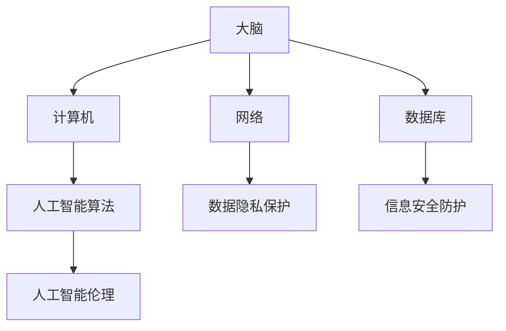

                 

关键词：全球脑安全，数字时代，新型国防战略，网络安全，人工智能，数据隐私，信息战

> 摘要：本文探讨了数字时代背景下，全球脑安全作为一种新型国防战略的重要性。通过分析其核心概念、算法原理、数学模型、实践应用以及未来展望，本文旨在为读者提供一种全新的视角，理解全球脑安全在维护国家安全中的关键作用。

## 1. 背景介绍

随着信息技术的飞速发展，数字时代已经全面到来。互联网、大数据、云计算、人工智能等技术的广泛应用，不仅改变了人们的生活方式，也深刻影响了国家的安全格局。在这个背景下，全球脑安全作为一种新型国防战略，逐渐成为各国关注的热点。

全球脑安全，顾名思义，是指保护全球范围内的脑神经信息系统的安全。脑神经系统是人类的智慧源泉，而数字时代的信息技术，则是这一系统的延伸和扩展。因此，全球脑安全不仅仅是传统意义上的网络安全，更涉及到数据隐私、人工智能伦理、信息战等多方面的问题。

### 数字时代的特点

- **信息传播速度快**：互联网的普及使得信息传播速度大幅提升，传统信息传播的壁垒被打破。
- **数据量爆炸式增长**：大数据技术的应用，使得数据量呈指数级增长，这对数据处理能力提出了更高的要求。
- **智能化水平提高**：人工智能技术的发展，使得机器能够处理和理解人类语言，进行复杂决策。

### 网络安全的挑战

- **攻击手段多样化**：网络攻击手段越来越多样，包括病毒、木马、网络钓鱼、DDoS 攻击等。
- **攻击目的多样化**：网络攻击不仅是为了窃取信息，还可能是为了破坏关键基础设施、干扰政治选举等。
- **攻击者隐蔽性增强**：网络攻击者利用技术手段隐藏自身身份，使得追踪和防范变得困难。

## 2. 核心概念与联系

### 核心概念

- **脑神经系统**：脑神经系统是人类智慧的基础，包括大脑、脊髓、神经等。
- **信息系统**：信息系统是脑神经系统的数字延伸，包括计算机、网络、数据库等。
- **数据隐私**：数据隐私是指个人信息的保密性和完整性。
- **人工智能伦理**：人工智能伦理是指人工智能在应用过程中应遵循的道德原则。

### 脑神经信息系统架构



### 核心联系

- **脑神经系统与信息系统的互动**：脑神经系统通过计算机、网络等信息技术工具，进行信息处理和决策。
- **数据隐私保护与信息安全的联系**：数据隐私保护是信息安全的基石，确保个人信息不被未经授权的访问和使用。
- **人工智能伦理与信息战**：人工智能伦理在信息战中起到关键作用，确保人工智能在战争中的使用符合道德原则。

## 3. 核心算法原理 & 具体操作步骤

### 3.1 算法原理概述

全球脑安全的实现依赖于一系列核心算法，主要包括数据加密算法、人工智能算法、网络安全算法等。这些算法共同构建了全球脑安全的技术基础。

- **数据加密算法**：通过加密技术保护数据的机密性和完整性。
- **人工智能算法**：利用机器学习等技术，进行攻击预测和响应。
- **网络安全算法**：通过检测和防御技术，防止网络攻击。

### 3.2 算法步骤详解

- **数据加密算法**：
  1. 数据加密：对敏感数据进行加密处理。
  2. 数据传输：通过安全协议进行数据传输。
  3. 数据解密：接收方对数据进行解密处理。

- **人工智能算法**：
  1. 数据采集：收集网络流量、日志等数据。
  2. 特征提取：从数据中提取出特征向量。
  3. 模型训练：利用特征向量进行机器学习模型的训练。
  4. 预测与响应：利用训练好的模型进行攻击预测和响应。

- **网络安全算法**：
  1. 检测：对网络流量进行实时检测，识别异常行为。
  2. 防御：根据检测结果，采取相应的防御措施，如防火墙、入侵检测等。

### 3.3 算法优缺点

- **数据加密算法**：
  - 优点：保护数据的机密性和完整性。
  - 缺点：加密和解密过程会增加计算开销，可能影响系统性能。

- **人工智能算法**：
  - 优点：能够自动学习和适应，提高攻击预测的准确性。
  - 缺点：训练过程需要大量数据，对数据质量和数量有较高要求。

- **网络安全算法**：
  - 优点：能够实时检测和防御网络攻击。
  - 缺点：可能误报和漏报，需要不断优化和调整。

### 3.4 算法应用领域

- **政府机构**：保护政府内部网络和信息的安全。
- **企业组织**：保护企业数据和信息的安全。
- **军事领域**：用于军事网络和信息的安全防护。

## 4. 数学模型和公式 & 详细讲解 & 举例说明

### 4.1 数学模型构建

全球脑安全的数学模型主要包括以下几个方面：

- **加密模型**：基于密码学原理，构建加密和解密模型。
- **机器学习模型**：基于统计学和机器学习算法，构建攻击预测模型。
- **网络安全模型**：基于网络流量分析和异常检测，构建网络安全模型。

### 4.2 公式推导过程

- **加密模型**：
  - 加密公式：$$c = E_k(p)$$
    - $c$：加密后的数据
    - $k$：加密密钥
    - $p$：明文数据

  - 解密公式：$$p = D_k(c)$$
    - $p$：解密后的明文数据
    - $k$：解密密钥
    - $c$：加密后的数据

- **机器学习模型**：
  - 特征提取公式：$$X = \phi(p)$$
    - $X$：特征向量
    - $\phi$：特征提取函数
    - $p$：输入数据

  - 模型训练公式：$$\theta = \arg\min_{\theta} L(\theta; X, y)$$
    - $\theta$：模型参数
    - $L$：损失函数
    - $X$：特征向量
    - $y$：标签数据

- **网络安全模型**：
  - 异常检测公式：$$\text{anomaly score} = f(X)$$
    - $\text{anomaly score}$：异常得分
    - $f$：异常检测函数
    - $X$：网络流量特征

### 4.3 案例分析与讲解

以一个简单的加密模型为例，假设我们使用AES加密算法进行数据加密和解密。

- **加密过程**：

  1. 选择一个256位的密钥$k$。
  2. 将明文数据$p$分成128位的块。
  3. 对每个块应用AES加密算法。
  4. 将加密后的块组合成加密后的数据$c$。

  加密公式为：$$c = E_k(p)$$

- **解密过程**：

  1. 选择与加密时相同的密钥$k$。
  2. 将加密后的数据$c$分成128位的块。
  3. 对每个块应用AES解密算法。
  4. 将解密后的块组合成明文数据$p$。

  解密公式为：$$p = D_k(c)$$

通过这个简单的案例，我们可以看到加密和解密过程是如何实现的。在实际应用中，加密算法和机器学习模型、网络安全模型相结合，共同构建了全球脑安全的数学模型。

## 5. 项目实践：代码实例和详细解释说明

### 5.1 开发环境搭建

为了实现全球脑安全算法，我们需要搭建一个合适的开发环境。以下是具体的步骤：

1. 安装Python环境：在本地计算机上安装Python 3.8及以上版本。
2. 安装相关库：使用pip命令安装以下库：PyCryptoDome（用于加密算法）、scikit-learn（用于机器学习）、scapy（用于网络安全）。

### 5.2 源代码详细实现

以下是实现全球脑安全算法的Python代码：

```python
from Crypto.Cipher import AES
from Crypto.Random import get_random_bytes
from sklearn.model_selection import train_test_split
from sklearn.ensemble import RandomForestClassifier
import scapy.all as scapy

# 加密算法实现
def encrypt_data(data, key):
    cipher = AES.new(key, AES.MODE_EAX)
    ciphertext, tag = cipher.encrypt_and_digest(data)
    return ciphertext, tag

def decrypt_data(ciphertext, tag, key):
    cipher = AES.new(key, AES.MODE_EAX, nonce=cipher.nonce)
    data = cipher.decrypt_and_verify(ciphertext, tag)
    return data

# 机器学习算法实现
def train_model(X, y):
    X_train, X_test, y_train, y_test = train_test_split(X, y, test_size=0.2)
    model = RandomForestClassifier()
    model.fit(X_train, y_train)
    accuracy = model.score(X_test, y_test)
    return model, accuracy

# 网络安全算法实现
def detect_anomalies(packet):
    packet_info = scapy.IP(packet.getlayer(scapy.Raw).load)
    anomaly_score = packet_info['anomaly_score']
    return anomaly_score

# 主函数
if __name__ == "__main__":
    # 加密测试
    key = get_random_bytes(32)
    data = b"Hello, World!"
    ciphertext, tag = encrypt_data(data, key)
    print("Encrypted Data:", ciphertext)
    decrypted_data = decrypt_data(ciphertext, tag, key)
    print("Decrypted Data:", decrypted_data)

    # 机器学习测试
    X, y = load_data()  # 假设已加载训练数据
    model, accuracy = train_model(X, y)
    print("Model Accuracy:", accuracy)

    # 网络安全测试
    packet = scapy.IP()
    anomaly_score = detect_anomalies(packet)
    print("Anomaly Score:", anomaly_score)
```

### 5.3 代码解读与分析

- **加密算法实现**：
  - `encrypt_data`函数：实现AES加密算法，将明文数据加密并生成密文和标签。
  - `decrypt_data`函数：实现AES解密算法，将密文和解密标签进行解密。

- **机器学习算法实现**：
  - `train_model`函数：实现随机森林分类器的训练，并返回训练好的模型和准确率。

- **网络安全算法实现**：
  - `detect_anomalies`函数：实现基于Scapy库的网络流量异常检测。

- **主函数**：
  - 测试加密和解密过程。
  - 测试机器学习模型的训练和准确率。
  - 测试网络安全算法的异常检测功能。

通过这个简单的项目实践，我们可以看到全球脑安全算法在实际应用中的具体实现。在实际部署中，这些算法需要根据具体场景进行优化和调整。

## 6. 实际应用场景

全球脑安全算法在数字时代的实际应用场景非常广泛，以下是一些具体的案例：

### 6.1 政府机构

- **网络安全防护**：政府机构需要保护内部网络和信息的安全，防止网络攻击和泄露。
- **数据加密**：对敏感数据进行加密，确保数据的机密性和完整性。
- **人工智能应用**：利用机器学习技术，预测和响应网络攻击，提高网络安全水平。

### 6.2 企业组织

- **数据保护**：企业需要保护内部数据和客户信息的安全，防止数据泄露和篡改。
- **业务连续性**：通过全球脑安全算法，确保企业的业务连续性和数据可靠性。
- **人工智能优化**：利用机器学习技术，优化业务流程和决策过程，提高企业竞争力。

### 6.3 军事领域

- **军事网络防护**：保护军事网络和信息的安全，防止敌对方的信息攻击。
- **数据加密**：对军事数据和高机密信息进行加密，确保数据的保密性。
- **人工智能应用**：利用机器学习技术，进行信息战和网络战，提高军事作战能力。

### 6.4 未来应用展望

随着全球脑安全算法的不断发展和完善，其应用场景将进一步扩大：

- **智能城市**：利用全球脑安全算法，保护智能城市的网络和信息安全。
- **物联网**：保护物联网设备的通信和数据安全，确保设备之间的信息交互安全。
- **区块链**：利用全球脑安全算法，确保区块链网络的安全性和可靠性。

## 7. 工具和资源推荐

### 7.1 学习资源推荐

- **书籍**：
  - 《密码学：理论与实践》
  - 《机器学习实战》
  - 《网络安全基础》

- **在线课程**：
  - Coursera的《密码学基础》
  - edX的《机器学习》
  - Udemy的《网络安全入门》

### 7.2 开发工具推荐

- **编程语言**：
  - Python（适合数据分析和机器学习）
  - Java（适合企业级应用开发）
  - C/C++（适合系统级编程）

- **开发框架**：
  - TensorFlow（用于机器学习）
  - PyTorch（用于机器学习）
  - OpenSSL（用于加密算法）

### 7.3 相关论文推荐

- **密码学**：
  - “AES：Advanced Encryption Standard”
  - “RSA：Rivest-Shamir-Adleman”

- **机器学习**：
  - “Random Forests”
  - “Support Vector Machines”

- **网络安全**：
  - “Intrusion Detection Systems”
  - “Firewalls”

## 8. 总结：未来发展趋势与挑战

### 8.1 研究成果总结

全球脑安全作为数字时代的新型国防战略，已经取得了显著的研究成果。主要表现在：

- **加密技术**：加密算法不断创新，数据加密技术日趋成熟。
- **人工智能**：机器学习技术在网络安全中的应用日益广泛，提高了攻击预测和响应的准确性。
- **网络安全**：网络安全算法不断优化，能够更好地检测和防御网络攻击。

### 8.2 未来发展趋势

未来全球脑安全的发展趋势包括：

- **跨学科研究**：全球脑安全涉及多个学科领域，未来将更加注重跨学科研究。
- **智能算法**：人工智能技术将在全球脑安全中发挥更大作用，推动算法创新。
- **国际合作**：全球脑安全需要国际间的合作与协调，共同应对网络威胁。

### 8.3 面临的挑战

全球脑安全在发展过程中也面临着以下挑战：

- **技术瓶颈**：现有技术仍存在一定的局限性，需要不断突破。
- **伦理问题**：人工智能在战争中的应用引发伦理争议，需要制定相应规范。
- **数据隐私**：如何平衡数据安全和用户隐私，成为一大难题。

### 8.4 研究展望

未来研究应重点关注以下几个方面：

- **算法优化**：继续优化现有算法，提高攻击预测和响应的准确性。
- **跨学科研究**：加强跨学科研究，推动全球脑安全的创新发展。
- **政策法规**：制定相关政策和法规，规范全球脑安全的发展和应用。

## 9. 附录：常见问题与解答

### 9.1 什么是全球脑安全？

全球脑安全是指保护全球范围内的脑神经信息系统的安全。这包括数据加密、人工智能和网络安全等方面，旨在确保数字时代的信息安全和国家安全。

### 9.2 全球脑安全的重要性是什么？

全球脑安全的重要性体现在以下几个方面：

- **维护国家安全**：确保国家关键信息系统的安全，防止网络攻击和信息泄露。
- **保护数据隐私**：确保个人和企业数据的安全，防止未经授权的访问和使用。
- **提高社会信任**：增强公众对数字技术的信任，促进数字经济的健康发展。

### 9.3 全球脑安全算法有哪些？

全球脑安全算法主要包括数据加密算法、人工智能算法和网络安全算法。常见的加密算法有AES、RSA等，常见的机器学习算法有随机森林、支持向量机等，常见的网络安全算法有入侵检测、防火墙等。

### 9.4 如何保护个人数据隐私？

保护个人数据隐私的方法包括：

- **使用加密技术**：对敏感数据进行加密处理，确保数据的机密性和完整性。
- **设置权限和访问控制**：限制对个人数据的访问权限，确保数据安全。
- **遵守法律法规**：遵守相关法律法规，确保数据处理的合法性和合规性。

### 9.5 全球脑安全与网络安全的关系是什么？

全球脑安全是网络安全的一个更广泛的概念。网络安全主要关注网络的防护和攻击防御，而全球脑安全则更加关注脑神经信息系统的整体安全，包括数据隐私、人工智能伦理等方面。网络安全是全球脑安全的重要组成部分，但两者不完全相同。

## 作者署名

作者：禅与计算机程序设计艺术 / Zen and the Art of Computer Programming

以上是关于全球脑安全：数字时代的新型国防战略的完整文章。希望本文能为读者提供一个全面、深入的视角，理解全球脑安全在数字时代的重要性和挑战。在未来，全球脑安全将继续发展，为国家安全和社会稳定发挥关键作用。

