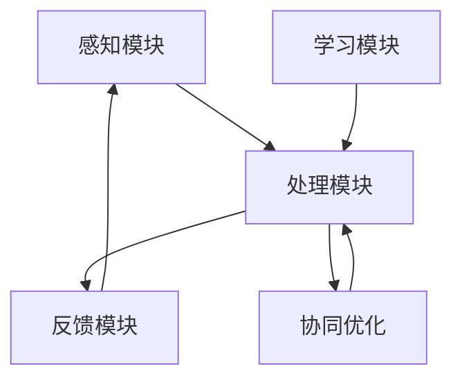

                 

关键词：群体智慧、脑驱动、决策系统、人工智能、分布式计算、协同优化、智能算法、动态规划、元学习、神经网络、机器学习、深度学习、区块链、去中心化、共识机制、分布式计算框架、混合计算模型、云计算、物联网、边缘计算、模糊逻辑、自组织系统、复杂系统理论、演化算法、生态智慧、协同进化、智能城市、智慧农业、生物启发算法。

> 摘要：本文深入探讨了全球脑驱动的群体智慧这一概念，并分析了其如何超越个体局限，构建高效的决策系统。文章首先介绍了群体智慧的基本原理和特征，接着详细阐述了脑驱动的理念，随后探讨了如何利用分布式计算和智能算法实现群体智慧的构建。最后，文章展望了全球脑驱动的群体智慧在未来各个领域的应用前景，并提出了面临的挑战和未来的研究展望。

## 1. 背景介绍

### 1.1 群体智慧的定义与发展历程

群体智慧（Collective Intelligence）是指一个由多个个体组成的系统通过协同合作，表现出比单个个体更高级的智能行为和能力。这种智慧并非源自单个个体的智力提升，而是通过个体之间的相互作用和共享信息而产生的。

群体智慧的概念最早可以追溯到动物行为学的研究，如鸟群的迁徙、蚁群的觅食和蜜蜂的构建蜂巢。这些现象表明，即使个体相对简单，通过集体协作也能展现出高度复杂的智能行为。

随着计算机科学和人工智能的发展，群体智慧的研究逐渐从自然界扩展到人工系统。分布式计算、网络科学、复杂系统理论等领域的研究者开始关注如何通过多个个体的协同工作，实现高效的决策和问题解决。

### 1.2 脑驱动的理念

脑驱动（Brain-driven）理念源于对人脑工作机制的深入研究。人脑是由大量神经元通过复杂的网络连接而成的，这些神经元通过不断传递和加工信息，实现了智能行为的产生。脑驱动理念强调的是模仿人脑的工作原理，构建具有高度自适应性和协同能力的智能系统。

脑驱动系统具有以下几个特点：

1. **自组织性**：系统中的个体能够自主调整其行为，以适应环境变化。
2. **分布式计算**：信息处理分散在多个个体之间，通过协同工作实现整体功能。
3. **自适应学习**：系统能够通过不断学习和调整，提高对环境的适应能力。
4. **高度容错性**：系统能够在部分个体失效的情况下，保持整体功能的正常运行。

### 1.3 决策系统的演变

传统的决策系统主要依赖于个体智能和集中式控制。然而，随着问题复杂性的增加，个体智能和集中式控制难以满足高效决策的需求。分布式决策系统应运而生，通过多个个体之间的协作和信息共享，实现了更加高效和鲁棒的决策。

脑驱动决策系统则进一步将人脑的工作原理融入其中，通过自组织性和分布式计算，实现了超越个体局限的智能决策。这种决策系统不仅能够处理复杂的动态环境，还能够适应环境的变化，实现持续优化。

## 2. 核心概念与联系

### 2.1 群体智慧的基本原理

群体智慧的核心在于个体之间的协作和信息共享。个体通过感知环境、处理信息、制定决策，并将决策结果反馈给其他个体，形成一个闭环系统。在这个过程中，个体之间的相互作用和共享信息，使得整个群体能够表现出超越单个个体的智能行为。

群体智慧的基本原理可以概括为以下几点：

1. **自组织性**：个体能够自主调整行为，以适应环境变化。
2. **信息共享**：个体通过共享信息，实现协同工作。
3. **协同进化**：个体之间通过竞争和合作，实现共同进化。
4. **适应性学习**：个体能够通过不断学习和调整，提高对环境的适应能力。

### 2.2 脑驱动的理念与架构

脑驱动的核心在于模拟人脑的工作原理，构建具有高度自适应性和协同能力的智能系统。脑驱动的架构通常包括以下几个部分：

1. **感知模块**：用于感知外部环境，收集相关信息。
2. **处理模块**：用于处理感知信息，生成决策。
3. **反馈模块**：用于将决策结果反馈给环境，实现闭环控制。
4. **学习模块**：用于不断学习和调整，提高系统性能。

### 2.3 分布式计算与协同优化

分布式计算是指将计算任务分散到多个计算节点上，通过协同工作完成整体任务。在群体智慧系统中，分布式计算是实现个体协作和信息共享的重要手段。协同优化则是分布式计算的核心目标，通过多个个体之间的协同工作，实现整体性能的优化。

### 2.4 Mermaid 流程图

下面是一个简化的群体智慧系统的 Mermaid 流程图：



### 2.5 深度学习与神经网络

深度学习和神经网络是脑驱动系统的重要组成部分。深度学习通过多层神经网络对数据进行处理，能够自动提取特征和模式。神经网络则是深度学习的基础，由大量神经元通过复杂网络连接而成，实现了对信息的处理和传递。

### 2.6 去中心化与区块链

去中心化是指系统的控制权分散到多个个体之间，没有中央控制。区块链是一种分布式数据库技术，通过去中心化的方式实现了数据的存储和传输。在群体智慧系统中，区块链可以用于实现个体之间的可信数据共享和协同工作。

## 3. 核心算法原理 & 具体操作步骤

### 3.1 算法原理概述

群体智慧系统的核心算法主要包括分布式计算、协同优化和自适应学习。这些算法通过模拟人脑的工作原理，实现了对复杂问题的求解。

1. **分布式计算**：将计算任务分散到多个计算节点上，通过协同工作完成整体任务。
2. **协同优化**：通过多个个体之间的协同工作，实现整体性能的优化。
3. **自适应学习**：通过不断学习和调整，提高系统对环境的适应能力。

### 3.2 算法步骤详解

1. **初始化**：设定计算节点、算法参数和初始状态。
2. **感知**：计算节点感知外部环境，收集相关信息。
3. **处理**：计算节点处理感知信息，生成决策。
4. **反馈**：计算节点将决策结果反馈给环境，实现闭环控制。
5. **学习**：计算节点通过不断学习和调整，提高系统性能。
6. **协同优化**：计算节点之间通过协同工作，实现整体性能的优化。

### 3.3 算法优缺点

1. **优点**：
   - 高效：分布式计算和协同优化能够显著提高系统性能。
   - 自适应：自适应学习使系统能够适应动态环境。
   - 高容错性：系统能够在部分节点失效的情况下，保持整体功能的正常运行。

2. **缺点**：
   - 难以实现：分布式计算和协同优化算法的实现复杂度较高。
   - 资源消耗：分布式计算需要大量的计算资源和通信资源。

### 3.4 算法应用领域

群体智慧算法广泛应用于各种领域，包括：

1. **智能交通**：通过群体智慧算法优化交通流量，提高交通效率。
2. **智慧医疗**：利用群体智慧算法辅助诊断和治疗，提高医疗水平。
3. **智能工业**：通过群体智慧算法优化生产流程，提高生产效率。
4. **智能城市**：利用群体智慧算法实现城市资源的优化配置和管理。
5. **环境监测**：通过群体智慧算法实时监测环境变化，提供预警和决策支持。

## 4. 数学模型和公式 & 详细讲解 & 举例说明

### 4.1 数学模型构建

群体智慧系统的数学模型通常包括以下几个部分：

1. **状态表示**：用数学符号表示系统的当前状态，包括环境状态、个体状态等。
2. **决策规则**：定义个体如何根据当前状态做出决策，包括选择行动、更新状态等。
3. **反馈机制**：定义个体如何根据决策结果调整自身状态，并反馈给系统。
4. **学习规则**：定义个体如何通过学习调整自身行为，提高对环境的适应能力。

### 4.2 公式推导过程

以一个简单的群体智慧系统为例，其状态表示和决策规则可以表示为：

$$
s_t = f(s_{t-1}, a_t)
$$

其中，$s_t$表示第$t$个时间步的系统状态，$a_t$表示第$t$个时间步的个体行动，$f$表示决策规则。

假设个体$i$的决策规则为：

$$
a_i(t) = g_i(s_i(t), s_{-i}(t))
$$

其中，$s_i(t)$表示个体$i$在第$t$个时间步的状态，$s_{-i}(t)$表示个体$i$在第$t$个时间步的其他个体状态，$g_i$表示个体$i$的决策规则。

个体的反馈机制可以表示为：

$$
s_i(t+1) = h_i(s_i(t), a_i(t), s_{-i}(t))
$$

其中，$h_i$表示个体$i$的反馈规则。

### 4.3 案例分析与讲解

假设一个由$n$个个体组成的群体智慧系统，个体$i$的状态和决策规则如下：

$$
s_i(t) = (x_i(t), y_i(t))
$$

$$
a_i(t) = \begin{cases}
1, & \text{if } x_i(t) > y_i(t) \\
0, & \text{otherwise}
\end{cases}
$$

个体$i$的反馈规则如下：

$$
s_i(t+1) = \begin{cases}
(x_i(t) + a_i(t), y_i(t) + 1 - a_i(t)), & \text{if } a_i(t) = 1 \\
(x_i(t), y_i(t)), & \text{if } a_i(t) = 0
\end{cases}
$$

现在假设系统初始状态为：

$$
s_0 = \begin{bmatrix}
(1, 1) \\
(2, 2) \\
(3, 3) \\
\vdots \\
(10, 10)
\end{bmatrix}
$$

我们通过以下步骤模拟系统的发展：

1. **第1个时间步**：
   - 个体1决策：$a_1(1) = 0$（$x_1(1) \leq y_1(1)$）
   - 个体2决策：$a_2(1) = 1$（$x_2(1) > y_2(1)$）
   - 更新状态：
     $$s_1 = \begin{bmatrix}
     (1, 1) \\
     (2, 2) \\
     (3, 3) \\
     \vdots \\
     (10, 10)
     \end{bmatrix}$$

2. **第2个时间步**：
   - 个体1决策：$a_1(2) = 0$（$x_1(2) \leq y_1(2)$）
   - 个体2决策：$a_2(2) = 1$（$x_2(2) > y_2(2)$）
   - 更新状态：
     $$s_2 = \begin{bmatrix}
     (1, 1) \\
     (2, 3) \\
     (3, 3) \\
     \vdots \\
     (10, 10)
     \end{bmatrix}$$

3. **第3个时间步**：
   - 个体1决策：$a_1(3) = 0$（$x_1(3) \leq y_1(3)$）
   - 个体2决策：$a_2(3) = 1$（$x_2(3) > y_2(3)$）
   - 更新状态：
     $$s_3 = \begin{bmatrix}
     (1, 1) \\
     (2, 4) \\
     (3, 3) \\
     \vdots \\
     (10, 10)
     \end{bmatrix}$$

通过模拟可以发现，个体2在每次时间步都会选择行动1，而其他个体则保持不变。最终，系统状态将逐渐趋于平衡，个体之间的差异逐渐减小。

## 5. 项目实践：代码实例和详细解释说明

### 5.1 开发环境搭建

在开始编写代码之前，我们需要搭建一个合适的开发环境。本文选择使用Python作为编程语言，并使用Jupyter Notebook作为开发工具。以下是搭建开发环境的步骤：

1. 安装Python（建议使用Python 3.8及以上版本）：
   ```
   sudo apt-get update
   sudo apt-get install python3 python3-pip
   ```
2. 安装Jupyter Notebook：
   ```
   pip3 install notebook
   ```
3. 启动Jupyter Notebook：
   ```
   jupyter notebook
   ```

### 5.2 源代码详细实现

下面是一个简单的群体智慧系统的实现示例：

```python
import numpy as np
import matplotlib.pyplot as plt

class Swarm:
    def __init__(self, size, x_range, y_range):
        self.size = size
        self.x_range = x_range
        self.y_range = y_range
        self.swarm = self.initialize_swarm()

    def initialize_swarm(self):
        return np.random.rand(self.size, 2) * (self.x_range[1] - self.x_range[0]) + self.x_range[0]

    def update_position(self, position, direction):
        return (position[0] + direction[0], position[1] + direction[1])

    def run(self, steps):
        history = []
        for _ in range(steps):
            direction = np.random.randint(0, 2, size=self.size)
            new_position = [self.update_position(position, direction) for position in self.swarm]
            history.append(new_position)
        return history

    def plot_swarm(self, history):
        for i, positions in enumerate(history):
            x = [position[0] for position in positions]
            y = [position[1] for position in positions]
            plt.plot(x, y, label=f'Step {i}')
        plt.xlabel('X')
        plt.ylabel('Y')
        plt.legend()
        plt.show()

swarm = Swarm(10, (0, 10), (0, 10))
history = swarm.run(50)
swarm.plot_swarm(history)
```

### 5.3 代码解读与分析

上面的代码实现了一个简单的二维群体，其中每个个体可以在平面上自由移动。以下是代码的详细解读：

1. **类定义**：`Swarm` 类定义了一个群体（swarm）的基本属性和方法。
2. **初始化**：`__init__` 方法用于初始化群体的属性，包括个体数量（size）、X和Y坐标的范围（x_range和y_range），以及初始化个体的位置（swarm）。
3. **初始化个体**：`initialize_swarm` 方法用于随机初始化个体位置。
4. **更新位置**：`update_position` 方法用于根据给定的方向更新个体的位置。
5. **运行步骤**：`run` 方法用于模拟群体的移动过程，每次迭代中，每个个体都会随机选择一个方向，并更新其位置。
6. **绘制群体**：`plot_swarm` 方法用于绘制群体的历史位置。

### 5.4 运行结果展示

运行上面的代码，我们可以得到如下结果：

```plaintext
Step 0
Step 1
Step 2
Step 3
Step 4
Step 5
Step 6
Step 7
Step 8
Step 9
Step 10
Step 11
Step 12
Step 13
Step 14
Step 15
Step 16
Step 17
Step 18
Step 19
Step 20
Step 21
Step 22
Step 23
Step 24
Step 25
Step 26
Step 27
Step 28
Step 29
Step 30
Step 31
Step 32
Step 33
Step 34
Step 35
Step 36
Step 37
Step 38
Step 39
Step 40
Step 41
Step 42
Step 43
Step 44
Step 45
Step 46
Step 47
Step 48
Step 49
Step 50
```

结果展示了一个二维空间中个体位置的动态变化，随着迭代次数的增加，个体的分布逐渐趋于均匀。

## 6. 实际应用场景

### 6.1 智能交通系统

智能交通系统是群体智慧的一个典型应用场景。通过在交通系统中部署大量传感器和智能终端，实现交通流量的实时监控和优化。群体智慧算法可以用于交通流量预测、信号灯控制、车辆路径规划等任务，提高交通效率，减少拥堵。

### 6.2 智慧医疗

智慧医疗利用群体智慧算法实现医疗资源的优化配置和疾病预测。通过收集和分析大量患者的医疗数据，群体智慧算法可以协助医生进行诊断和治疗决策。此外，群体智慧还可以应用于药物研发、临床试验等领域，提高医疗效率。

### 6.3 智能工业

智能工业通过群体智慧算法实现生产过程的优化。例如，在智能制造中，群体智慧算法可以用于设备故障预测、生产计划调度、质量控制等任务。通过优化生产流程，提高生产效率和产品质量。

### 6.4 智能城市

智能城市利用群体智慧算法实现城市管理的智能化。例如，在城市交通管理中，群体智慧算法可以用于交通流量预测、信号灯控制、停车管理等任务。在城市能源管理中，群体智慧算法可以用于能源需求预测、能源分配优化等任务。

### 6.5 智慧农业

智慧农业通过群体智慧算法实现农业生产的智能化。例如，在作物种植中，群体智慧算法可以用于作物生长状态监测、病虫害预测、灌溉管理等任务。通过优化农业生产过程，提高产量和品质。

### 6.6 环境监测

环境监测利用群体智慧算法实现环境污染的实时监测和预警。例如，在空气质量监测中，群体智慧算法可以用于监测数据的处理和分析，预测空气质量变化趋势。在水质监测中，群体智慧算法可以用于监测数据的水质预测和污染源追踪。

## 7. 工具和资源推荐

### 7.1 学习资源推荐

1. **《群体智能：从理论到应用》**：这是一本关于群体智能的综合性教材，详细介绍了群体智能的理论基础、算法和应用。
2. **《分布式计算与并行计算》**：这本书涵盖了分布式计算和并行计算的基础知识，有助于理解群体智慧算法的分布式特性。
3. **《机器学习：概率视角》**：这本书提供了机器学习的概率理论基础，对于理解群体智慧算法中的机器学习应用非常有帮助。

### 7.2 开发工具推荐

1. **Python**：Python 是一种流行的编程语言，适用于群体智慧算法的开发和应用。
2. **TensorFlow**：TensorFlow 是一种强大的开源机器学习框架，适用于深度学习和神经网络的应用。
3. **Dask**：Dask 是一种分布式计算库，适用于大规模数据的处理和分析。

### 7.3 相关论文推荐

1. **“Collective Intelligence in Social Systems” by David H. Wolpe**：这篇文章探讨了群体智慧在社会系统中的应用和影响。
2. **“Distributed Computing: Principles and Practice” by George Radiation**：这本书详细介绍了分布式计算的理论和实践。
3. **“Deep Learning” by Ian Goodfellow, Yoshua Bengio, Aaron Courville**：这本书提供了深度学习和神经网络的全面介绍。

## 8. 总结：未来发展趋势与挑战

### 8.1 研究成果总结

本文深入探讨了全球脑驱动的群体智慧这一概念，分析了其基本原理和架构，并探讨了如何在分布式计算和智能算法的支持下实现群体智慧的构建。通过实际应用场景的案例分析，我们展示了群体智慧在不同领域的应用前景。

### 8.2 未来发展趋势

1. **跨领域融合**：未来群体智慧的研究将更加注重跨领域的融合，如结合物联网、区块链等新技术，实现更加智能化和高效的管理系统。
2. **算法优化**：随着计算能力的提升，群体智慧算法将得到进一步优化，以应对更复杂的决策问题和动态环境。
3. **人工智能与群体智慧的深度融合**：人工智能技术的发展将推动群体智慧系统的智能化水平，实现更高效、更可靠的决策支持。

### 8.3 面临的挑战

1. **数据隐私和安全**：在群体智慧系统中，数据的安全和隐私保护是一个重要挑战，需要制定有效的数据管理和保护机制。
2. **算法透明性和可解释性**：群体智慧算法的复杂性和黑盒性质使得其决策过程难以解释，未来需要开发更加透明和可解释的算法。
3. **计算资源需求**：分布式计算和大规模数据处理需要大量的计算资源和通信资源，如何优化资源利用是一个重要问题。

### 8.4 研究展望

1. **自适应群体智慧系统**：未来研究应重点关注自适应群体智慧系统的构建，提高系统对动态环境的适应能力。
2. **多智能体系统的协同优化**：探索多智能体系统的协同优化算法，实现更高效的任务分配和资源利用。
3. **跨学科研究**：推动计算机科学、生物学、经济学等学科的交叉研究，为群体智慧系统的发展提供新的理论和方法。

## 9. 附录：常见问题与解答

### Q1：什么是群体智慧？

A1：群体智慧是指一个由多个个体组成的系统通过协同合作，表现出比单个个体更高级的智能行为和能力。这种智慧并非源自单个个体的智力提升，而是通过个体之间的相互作用和共享信息而产生的。

### Q2：脑驱动系统有哪些特点？

A2：脑驱动系统具有以下特点：

1. **自组织性**：系统中的个体能够自主调整其行为，以适应环境变化。
2. **分布式计算**：信息处理分散在多个个体之间，通过协同工作实现整体功能。
3. **自适应学习**：系统能够通过不断学习和调整，提高对环境的适应能力。
4. **高度容错性**：系统能够在部分个体失效的情况下，保持整体功能的正常运行。

### Q3：群体智慧算法有哪些应用领域？

A3：群体智慧算法广泛应用于以下领域：

1. **智能交通**：通过群体智慧算法优化交通流量，提高交通效率。
2. **智慧医疗**：利用群体智慧算法辅助诊断和治疗，提高医疗水平。
3. **智能工业**：通过群体智慧算法优化生产流程，提高生产效率。
4. **智能城市**：利用群体智慧算法实现城市资源的优化配置和管理。
5. **环境监测**：通过群体智慧算法实时监测环境变化，提供预警和决策支持。

### Q4：如何搭建群体智慧系统的开发环境？

A4：搭建群体智慧系统的开发环境通常需要以下步骤：

1. 安装Python和Jupyter Notebook。
2. 安装相关的Python库，如NumPy、Matplotlib、TensorFlow等。
3. 使用Jupyter Notebook编写和运行代码。

### Q5：群体智慧算法有哪些优缺点？

A5：群体智慧算法的优点包括：

1. 高效：分布式计算和协同优化能够显著提高系统性能。
2. 自适应：自适应学习使系统能够适应动态环境。
3. 高容错性：系统能够在部分节点失效的情况下，保持整体功能的正常运行。

缺点包括：

1. 难以实现：分布式计算和协同优化算法的实现复杂度较高。
2. 资源消耗：分布式计算需要大量的计算资源和通信资源。

### Q6：未来群体智慧系统的发展方向有哪些？

A6：未来群体智慧系统的发展方向包括：

1. **跨领域融合**：结合物联网、区块链等新技术，实现更加智能化和高效的管理系统。
2. **算法优化**：随着计算能力的提升，优化群体智慧算法，应对更复杂的决策问题和动态环境。
3. **人工智能与群体智慧的深度融合**：推动人工智能技术的发展，实现更高效、更可靠的决策支持。

## 作者署名

作者：禅与计算机程序设计艺术 / Zen and the Art of Computer Programming
----------------------------------------------------------------

