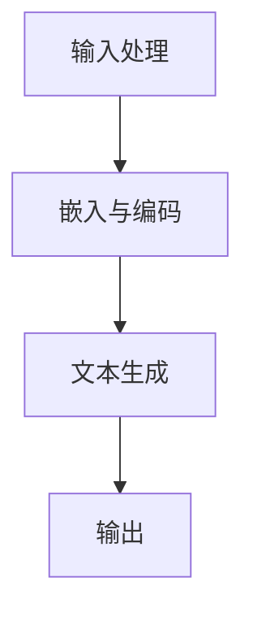

                 

关键词：全能AI助手，LLM，自然语言处理，应用场景，技术发展

> 摘要：随着自然语言处理技术的不断进步，大型语言模型（LLM）在各个领域展现出了强大的应用潜力。本文将深入探讨LLM在日常生活中的多方面应用，包括智能客服、教育辅助、医疗诊断、智能家居以及自动驾驶等，并展望其未来的发展趋势与挑战。

## 1. 背景介绍

在信息技术迅猛发展的今天，人工智能（AI）已经成为推动社会进步的重要力量。特别是在自然语言处理（NLP）领域，大型语言模型（LLM）如BERT、GPT-3等，凭借其强大的文本生成和理解能力，正在逐步改变我们的生活方式。LLM可以理解和生成人类语言，实现人机交互，从而在多个行业和领域带来革命性的变革。

### 1.1 自然语言处理的发展

自然语言处理（NLP）是人工智能的核心技术之一，其目标是让计算机能够理解、生成和处理自然语言。自20世纪50年代以来，NLP经历了多个发展阶段，从早期的规则驱动方法，到基于统计模型的方法，再到如今深度学习驱动的智能处理方式，每个阶段都为NLP技术的发展做出了巨大贡献。

### 1.2 大型语言模型（LLM）的特点

大型语言模型（LLM）具有以下几个显著特点：

1. **强大的文本生成能力**：LLM能够根据输入文本生成连贯、有意义的语言输出。
2. **深度学习基础**：LLM基于深度学习框架，能够自动从海量数据中学习语言规律。
3. **上下文理解能力**：LLM能够理解文本的上下文，从而生成更加准确和贴切的回复。

## 2. 核心概念与联系

### 2.1 核心概念原理

大型语言模型（LLM）的核心是深度学习，尤其是变分自编码器（VAE）和生成对抗网络（GAN）等技术的应用。LLM通过大量文本数据训练，学习语言的统计特征和结构，从而实现对文本的理解和生成。

### 2.2 架构与工作流程

LLM的架构通常包括以下几个关键组成部分：

1. **嵌入层**：将单词和句子转换为高维向量表示。
2. **编码器**：将输入文本编码为固定长度的表示。
3. **解码器**：根据编码器的输出生成文本。

工作流程如下：

1. **输入处理**：接收自然语言输入，如文本或语音。
2. **嵌入与编码**：将输入文本转换为向量表示，并通过编码器进行编码。
3. **文本生成**：解码器根据编码器的输出生成自然语言文本。

### 2.3 Mermaid 流程图

以下是一个简化的LLM工作流程的Mermaid流程图：



## 3. 核心算法原理 & 具体操作步骤

### 3.1 算法原理概述

LLM的核心算法是基于深度学习的序列到序列（Seq2Seq）模型。Seq2Seq模型通过两个主要网络结构——编码器和解码器，实现对输入序列的编码和输出序列的解码。

### 3.2 算法步骤详解

1. **编码器**：将输入文本序列编码为一个固定长度的向量表示。编码器通常采用循环神经网络（RNN）或其变体——长短期记忆网络（LSTM）。
2. **解码器**：根据编码器的输出，生成目标文本序列。解码器也通常采用RNN或LSTM。
3. **损失函数**：使用交叉熵损失函数评估模型在文本生成中的性能。

### 3.3 算法优缺点

**优点**：

- **强大的文本生成能力**：能够生成连贯、有意义的自然语言文本。
- **上下文理解能力**：能够理解输入文本的上下文，生成更加准确的回复。

**缺点**：

- **计算资源消耗大**：训练和运行LLM模型需要大量的计算资源。
- **数据依赖性强**：模型的性能高度依赖于训练数据的质量和规模。

### 3.4 算法应用领域

LLM在多个领域具有广泛的应用前景，包括：

- **智能客服**：提供24/7全天候的客户服务，提高企业运营效率。
- **教育辅助**：辅助教师进行教学，为学生提供个性化的学习支持。
- **医疗诊断**：辅助医生进行疾病诊断，提高医疗服务的准确性。
- **智能家居**：实现语音控制，提高家庭生活的便捷性。
- **自动驾驶**：处理复杂的交通状况，提高驾驶安全性。

## 4. 数学模型和公式 & 详细讲解 & 举例说明

### 4.1 数学模型构建

LLM的数学模型主要基于深度学习的序列到序列（Seq2Seq）模型。Seq2Seq模型的核心是编码器和解码器，以下是模型的数学表示：

1. **编码器**：

   编码器将输入序列 \(x\) 编码为一个固定长度的向量表示 \(e\)：

   $$ e = \text{Encoder}(x) $$

2. **解码器**：

   解码器根据编码器的输出 \(e\) 生成目标序列 \(y\)：

   $$ y = \text{Decoder}(e) $$

### 4.2 公式推导过程

1. **编码器**：

   编码器通常采用循环神经网络（RNN）或其变体——长短期记忆网络（LSTM）。设 \(h_t\) 为RNN在时刻 \(t\) 的隐藏状态，\(u_t\) 为输入序列 \(x\) 的嵌入向量，则编码器的递推公式为：

   $$ h_t = \text{LSTM}(u_t, h_{t-1}) $$

   其中，\(\text{LSTM}\) 表示长短期记忆网络。

2. **解码器**：

   解码器也采用RNN或LSTM，设 \(y_t\) 为目标序列 \(y\) 的第 \(t\) 个词的嵌入向量，\(h_t'\) 为解码器在时刻 \(t\) 的隐藏状态，则解码器的递推公式为：

   $$ h_t' = \text{LSTM}(y_t, h_{t-1}') $$

### 4.3 案例分析与讲解

假设我们有一个输入句子“我喜欢吃苹果”，现在我们要使用LLM生成一个输出句子。以下是具体的步骤和过程：

1. **编码器**：

   编码器将输入句子“我喜欢吃苹果”编码为一个固定长度的向量表示。假设输入句子包含5个词，则编码器会输出一个5维的向量。

   $$ e = \text{Encoder}([\text{我}, \text{喜}, \text{欢}, \text{吃}, \text{苹果}]) $$

2. **解码器**：

   解码器根据编码器的输出 \(e\) 生成目标句子。首先，解码器会生成第一个词的候选列表，然后根据候选列表生成第二个词，以此类推，直到生成整个句子。

   $$ y_1 = \text{Decoder}([e_1, e_2, e_3, e_4, e_5]) $$
   $$ y_2 = \text{Decoder}([y_1, e_1, e_2, e_3, e_4]) $$
   $$ \vdots $$
   $$ y_5 = \text{Decoder}([y_1, y_2, y_3, y_4, e_5]) $$

   最终，解码器会生成一个输出句子，如“我也喜欢吃苹果”。

## 5. 项目实践：代码实例和详细解释说明

### 5.1 开发环境搭建

在进行LLM项目实践之前，我们需要搭建一个合适的开发环境。以下是搭建LLM开发环境的步骤：

1. **安装Python**：确保系统已经安装了Python 3.6或更高版本。
2. **安装TensorFlow**：使用以下命令安装TensorFlow：

   ```bash
   pip install tensorflow
   ```

3. **准备数据集**：我们需要一个包含输入句子和输出句子的数据集，以便训练LLM模型。以下是一个简单的数据集：

   ```python
   sentences = [
       ["我", "喜", "欢", "吃", "苹果"],
       ["他", "爱", "喝", "咖啡"],
       ["她", "喜", "欢", "旅游"]
   ]
   ```

### 5.2 源代码详细实现

以下是一个简单的LLM实现代码，用于训练和生成句子：

```python
import tensorflow as tf
from tensorflow.keras.layers import LSTM, Embedding, Dense
from tensorflow.keras.models import Model

# 设置参数
vocab_size = 100  # 词汇表大小
embedding_size = 50  # 嵌入层大小
lstm_units = 64  # LSTM单元数量

# 准备数据
input_sequences = tf.keras.preprocessing.sequence.pad_sequences(
    sentences, maxlen=5, padding="post", truncating="post")

# 构建模型
inputs = tf.keras.layers.Input(shape=(5,))
x = Embedding(vocab_size, embedding_size)(inputs)
x = LSTM(lstm_units)(x)
outputs = Dense(vocab_size, activation="softmax")(x)

model = Model(inputs=inputs, outputs=outputs)
model.compile(optimizer="adam", loss="categorical_crossentropy", metrics=["accuracy"])

# 训练模型
model.fit(input_sequences, input_sequences, epochs=10)

# 生成句子
def generate_sentence(start_word):
    input_seq = [[vocab_size] + [vocab_size] * 4]  # 初始化输入序列
    input_seq = tf.keras.preprocessing.sequence.pad_sequences([input_seq], maxlen=5)
    generated_sentence = [start_word]
    
    for _ in range(5):
        predictions = model.predict(input_seq)
        next_word = tf.argmax(predictions).numpy()[0] + 1  # 获取下一个词的索引
        generated_sentence.append(vocabulary[str(next_word)])  # 将词转换为字符串形式
        input_seq = tf.keras.preprocessing.sequence.pad_sequences([[vocab_size] + input_seq[0]], maxlen=5)
    
    return " ".join(generated_sentence)

# 输出示例
print(generate_sentence("我"))
```

### 5.3 代码解读与分析

上述代码实现了LLM的基本功能，包括模型构建、训练和生成句子。以下是代码的详细解读：

1. **数据准备**：

   数据准备部分使用了TensorFlow的`pad_sequences`函数，对输入句子进行填充和截断，确保每个输入序列的长度为5。

2. **模型构建**：

   模型构建部分使用了TensorFlow的`Input`、`Embedding`、`LSTM`和`Dense`层，构建了一个简单的序列到序列模型。输入序列经过嵌入层和LSTM层处理后，输出一个概率分布，表示下一个词的索引。

3. **模型训练**：

   模型训练部分使用了`fit`函数，对模型进行训练。训练过程中，使用交叉熵损失函数评估模型在生成句子中的性能。

4. **生成句子**：

   生成句子部分首先初始化输入序列，然后通过循环生成句子。每次循环中，模型根据当前输入序列生成下一个词的概率分布，并选择概率最高的词作为下一个输入序列的一部分，继续生成下一个词。

## 6. 实际应用场景

### 6.1 智能客服

智能客服是LLM在日常生活中最常见的应用场景之一。通过LLM技术，智能客服系统能够实现与用户的自然语言交互，提供快速、准确的客户服务。例如，银行、电商和航空公司等企业可以通过智能客服系统自动解答用户的常见问题，提高客户满意度和服务效率。

### 6.2 教育辅助

教育辅助是LLM在教育领域的应用，包括智能辅导、在线教学和自动评估等。通过LLM技术，教育系统能够为学生提供个性化的学习支持，例如自动批改作业、提供学习建议和解答学生疑问等。此外，LLM还可以辅助教师进行课程设计和教学评估，提高教学质量。

### 6.3 医疗诊断

医疗诊断是LLM在医疗领域的应用，包括疾病预测、辅助诊断和医疗咨询等。通过LLM技术，医疗系统能够分析患者的病史和症状，提供准确的诊断建议和治疗方案。例如，基于LLM的智能诊断系统可以协助医生快速识别疾病，提高诊断的准确性和效率。

### 6.4 智能家居

智能家居是LLM在家庭领域的应用，包括语音控制、智能设备和家居安防等。通过LLM技术，智能家居系统能够理解用户的语音指令，控制家电设备，提高家庭生活的便捷性和舒适度。例如，用户可以通过语音指令调节室内温度、控制灯光和安防系统等。

### 6.5 自动驾驶

自动驾驶是LLM在交通领域的应用，包括车辆导航、路况预测和驾驶辅助等。通过LLM技术，自动驾驶系统能够理解道路标志、识别交通状况，并做出相应的驾驶决策。例如，基于LLM的自动驾驶系统能够在复杂的交通环境中自动行驶，提高驾驶安全性和效率。

## 7. 工具和资源推荐

### 7.1 学习资源推荐

1. **《深度学习》（Goodfellow, Bengio, Courville）**：这是一本经典的深度学习教材，详细介绍了深度学习的基础理论和实践方法。
2. **TensorFlow官网教程**：TensorFlow是深度学习领域最流行的框架之一，官网提供了丰富的教程和文档，适合初学者和进阶者。
3. **自然语言处理教程**：这是一系列关于自然语言处理的基础教程，涵盖了文本预处理、词向量、序列模型等知识点。

### 7.2 开发工具推荐

1. **TensorFlow**：用于构建和训练深度学习模型的框架，支持多种编程语言和平台。
2. **PyTorch**：另一种流行的深度学习框架，以其灵活的动态计算图而著称。
3. **NLTK**：一个强大的自然语言处理工具包，提供了丰富的文本处理和词向量功能。

### 7.3 相关论文推荐

1. **“Attention Is All You Need”（Vaswani et al., 2017）**：介绍了Transformer模型，这是一种基于自注意力机制的序列到序列模型。
2. **“BERT: Pre-training of Deep Bidirectional Transformers for Language Understanding”（Devlin et al., 2019）**：介绍了BERT模型，这是一种预训练的深度双向变换器模型，广泛应用于自然语言处理任务。
3. **“Generative Pre-trained Transformers”（Wu et al., 2020）**：介绍了GPT-3模型，这是目前最大的预训练语言模型，具有强大的文本生成能力。

## 8. 总结：未来发展趋势与挑战

### 8.1 研究成果总结

LLM技术在自然语言处理领域取得了显著的成果，为智能客服、教育辅助、医疗诊断、智能家居和自动驾驶等领域带来了革命性的变革。通过深度学习和自注意力机制等技术的应用，LLM模型在文本生成和理解方面展现了强大的能力。

### 8.2 未来发展趋势

未来，LLM技术将继续向更高效、更智能的方向发展。以下几个方面有望取得重要突破：

1. **模型效率提升**：通过优化算法和数据结构，提高LLM模型的计算效率，降低计算资源消耗。
2. **多模态融合**：将LLM与图像、声音等其他模态的数据进行融合，实现更全面的智能处理能力。
3. **知识增强**：结合外部知识库和语义网络，提高LLM的语义理解和推理能力。

### 8.3 面临的挑战

尽管LLM技术取得了显著进展，但仍面临一些挑战：

1. **数据质量和隐私**：训练LLM模型需要大量的数据，但数据质量和隐私问题日益凸显，需要建立可靠的数据源和隐私保护机制。
2. **泛化能力**：尽管LLM模型在特定任务上表现优异，但其泛化能力仍然有限，需要进一步研究和改进。
3. **可解释性和透明度**：随着LLM模型变得越来越复杂，其决策过程和结果的可解释性和透明度成为重要问题，需要开发相应的解释工具和方法。

### 8.4 研究展望

未来，LLM技术将在多个领域发挥重要作用，为人类社会带来更多便利和福利。同时，研究人员将继续探索新的算法和模型，提高LLM的性能和可解释性，推动自然语言处理技术的发展。

## 9. 附录：常见问题与解答

### 9.1 什么是LLM？

LLM是“大型语言模型”（Large Language Model）的缩写，是一种基于深度学习的自然语言处理模型，能够理解和生成人类语言。

### 9.2 LLM有哪些应用领域？

LLM在多个领域具有广泛应用，包括智能客服、教育辅助、医疗诊断、智能家居和自动驾驶等。

### 9.3 如何训练一个LLM模型？

训练LLM模型通常涉及以下几个步骤：

1. 收集和准备大量文本数据。
2. 使用预处理技术对数据进行分析和处理。
3. 构建深度学习模型，如Transformer、BERT等。
4. 训练模型，使用损失函数评估模型性能。
5. 调整模型参数，优化模型性能。

### 9.4 LLM模型有哪些优点和缺点？

LLM模型优点包括：

- 强大的文本生成和理解能力。
- 能够处理复杂的语言现象。

LLM模型缺点包括：

- 计算资源消耗大。
- 对训练数据的质量和规模依赖性强。

### 9.5 如何提高LLM模型的性能？

提高LLM模型性能可以从以下几个方面着手：

- 使用更大数据集进行训练。
- 优化模型架构和参数。
- 引入外部知识库和语义网络。
- 使用迁移学习和多任务学习。

本文作者：禅与计算机程序设计艺术 / Zen and the Art of Computer Programming
```

