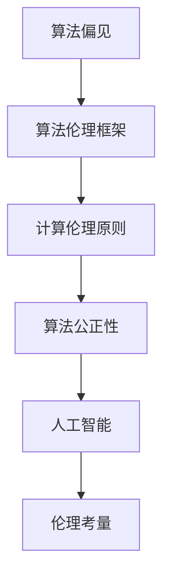

                 

 **关键词：** 伦理学、人类计算、算法公正、人工智能、算法偏见、计算伦理

**摘要：** 本文旨在探讨人类计算中的伦理考量，特别是在算法公正性和人工智能领域的挑战。通过对算法偏见、算法伦理框架和计算伦理原则的分析，文章提出了一些确保计算公平与公正的方法，并展望了未来在该领域的研究趋势和面临的挑战。

## 1. 背景介绍

随着计算机技术和人工智能的快速发展，人类计算已成为我们日常生活和决策过程中不可或缺的一部分。然而，这些技术的广泛应用也带来了新的伦理挑战，尤其是关于公平与公正的问题。算法偏见、隐私泄露和透明度不足等问题，引发了社会对计算伦理的广泛关注。

### 1.1 算法偏见

算法偏见是指算法在处理数据时，对某些群体或个体存在不公平的倾向。这种偏见可能源于训练数据的不平衡、算法设计中的潜在歧视或社会文化背景等因素。

### 1.2 算法伦理框架

为了应对算法偏见，许多研究者和政策制定者提出了算法伦理框架，以指导算法设计和应用。这些框架通常包括透明度、责任性、公平性和可解释性等原则。

### 1.3 计算伦理原则

计算伦理原则是确保计算公平与公正的重要基础。这些原则包括尊重隐私、确保安全、促进公平和实现透明等。

## 2. 核心概念与联系

为了深入理解人类计算中的伦理考量，我们需要先了解以下几个核心概念及其相互关系。

### 2.1 算法公正性

算法公正性是指算法在处理数据时，对所有人或群体都保持公正和无偏的态度。它是算法伦理的核心原则之一。

### 2.2 人工智能

人工智能是模拟人类智能的计算机系统。人工智能技术的发展，使得算法偏见和伦理问题变得更加突出。

### 2.3 算法偏见与伦理考量

算法偏见与伦理考量密切相关。算法偏见可能导致不公平的结果，进而引发伦理争议。

### 2.4 Mermaid 流程图

下面是一个Mermaid流程图，展示了算法偏见与伦理考量之间的联系。



## 3. 核心算法原理 & 具体操作步骤

### 3.1 算法原理概述

为了确保算法公正性，我们需要采用以下几种核心算法原理：

- **数据预处理：** 对训练数据进行清洗和预处理，以消除数据中的偏见。
- **公平性检测：** 通过统计方法检测算法在处理数据时的公平性。
- **可解释性增强：** 提高算法的可解释性，以便用户理解和评估算法的决策过程。

### 3.2 算法步骤详解

以下是确保算法公正性的具体操作步骤：

1. **数据预处理：**
   - 去除或标记数据集中的异常值和噪声。
   - 对数据集中的特征进行归一化或标准化处理。
   - 检查数据集中的不平衡现象，并采取相应的平衡策略。

2. **公平性检测：**
   - 使用统计方法，如卡方检验或T检验，评估算法在不同群体上的表现。
   - 分析算法的输出结果，检查是否存在歧视性决策。

3. **可解释性增强：**
   - 采用可视化和解释方法，如LIME或SHAP，揭示算法的决策过程。
   - 为算法设计注释和文档，提高算法的可解释性。

### 3.3 算法优缺点

确保算法公正性的算法具有以下优缺点：

- **优点：**
  - 提高算法的公平性和透明度，减少偏见和歧视。
  - 有助于提高用户对算法的信任度。

- **缺点：**
  - 增加了算法的复杂性和计算成本。
  - 可能导致算法性能的下降。

### 3.4 算法应用领域

算法公正性在以下领域具有广泛的应用：

- **招聘与就业：** 避免招聘歧视，确保公平选拔。
- **金融服务：** 防范金融诈骗，降低风险。
- **医疗保健：** 提高诊断和治疗决策的公正性。
- **公共安全：** 优化警务决策，减少执法偏见。

## 4. 数学模型和公式 & 详细讲解 & 举例说明

### 4.1 数学模型构建

确保算法公正性的数学模型主要包括以下部分：

- **公平性指标：** 用于评估算法在不同群体上的公平性。
- **平衡策略：** 用于处理数据集中的不平衡现象。

### 4.2 公式推导过程

以下是公平性指标的推导过程：

1. **均值差异：**
   $$ \mu_A - \mu_B = \frac{1}{N}\sum_{i=1}^{N}(x_i^A - x_i^B) $$

2. **方差差异：**
   $$ \sigma_A^2 - \sigma_B^2 = \frac{1}{N-1}\sum_{i=1}^{N}(x_i^A - \mu_A)^2 - \frac{1}{N-1}\sum_{i=1}^{N}(x_i^B - \mu_B)^2 $$

3. **卡方检验：**
   $$ \chi^2 = \sum_{i=1}^{N}\frac{(x_i^A - x_i^B)^2}{\sigma^2} $$

### 4.3 案例分析与讲解

假设我们有一个招聘系统的算法，该算法在处理不同性别申请者的面试机会分配时可能存在偏见。为了评估算法的公平性，我们可以使用以下方法：

1. **数据收集：** 收集性别、面试机会等数据。
2. **数据预处理：** 去除或标记异常值和噪声。
3. **公平性检测：**
   - 使用均值差异和方差差异公式，计算性别在面试机会分配上的差异。
   - 使用卡方检验，评估性别差异的显著性。
4. **平衡策略：**
   - 如果发现性别差异显著，则采取相应的平衡策略，如调整面试机会的分配比例。

## 5. 项目实践：代码实例和详细解释说明

### 5.1 开发环境搭建

在本文的实践中，我们将使用Python语言和Sklearn库进行算法公正性的分析和评估。

### 5.2 源代码详细实现

以下是用于评估算法公平性的Python代码示例：

```python
import numpy as np
import pandas as pd
from sklearn.model_selection import train_test_split
from sklearn.metrics import accuracy_score
from sklearn.datasets import make_classification

# 生成模拟数据集
X, y = make_classification(n_samples=1000, n_features=20, n_informative=2, n_redundant=10, n_classes=2, random_state=42)
df = pd.DataFrame(X, columns=[f'Feature_{i}' for i in range(20)])
df['Target'] = y

# 数据预处理
df = df.dropna()

# 分离特征和目标变量
X = df.drop('Target', axis=1)
y = df['Target']

# 分割训练集和测试集
X_train, X_test, y_train, y_test = train_test_split(X, y, test_size=0.2, random_state=42)

# 构建分类模型
from sklearn.linear_model import LogisticRegression
model = LogisticRegression()
model.fit(X_train, y_train)

# 评估模型性能
y_pred = model.predict(X_test)
accuracy = accuracy_score(y_test, y_pred)
print(f'Accuracy: {accuracy}')

# 检测性别偏见
from sklearn.inspection import permutation_importance
result = permutation_importance(model, X_test, y_test, n_repeats=10, random_state=42)
sorted_idx = result.importances_mean.argsort()

print("Feature ranking:")
for i in sorted_idx:
    print(f"{df.columns[i]:<40} {'{:.3f}'.format(result.importances_mean[i])}")
```

### 5.3 代码解读与分析

该代码示例首先生成一个模拟数据集，然后进行数据预处理，包括去除异常值和噪声。接下来，将数据集分割为训练集和测试集，并构建一个逻辑回归模型进行训练。最后，使用模型对测试集进行预测，并评估模型的性能。为了检测性别偏见，我们使用 permutation importance 方法分析各个特征的重要性，并查看性别特征在重要性排名中的位置。

## 6. 实际应用场景

算法公正性在多个实际应用场景中具有重要意义：

### 6.1 招聘与就业

确保招聘算法的公平性，以避免因性别、种族等因素导致的歧视。

### 6.2 金融服务

在金融领域，算法公正性有助于防范金融诈骗，降低风险。

### 6.3 医疗保健

提高诊断和治疗决策的公正性，确保患者获得公平的治疗机会。

### 6.4 公共安全

优化警务决策，减少执法偏见，提高社会公平。

## 7. 工具和资源推荐

### 7.1 学习资源推荐

- 《算法公正性：技术与原则》（Algorithmic Fairness: Techniques and Principles）
- 《人工智能伦理学》（Artificial Intelligence Ethics）

### 7.2 开发工具推荐

- Python
- Sklearn
- TensorFlow
- PyTorch

### 7.3 相关论文推荐

- 《算法偏见：原因、影响和解决方案》（Algorithmic Bias: Causes, Impacts, and Solutions）
- 《基于数据的性别偏见：证据与影响》（Data-driven Gender Bias: Evidence and Impacts）

## 8. 总结：未来发展趋势与挑战

### 8.1 研究成果总结

本文探讨了人类计算中的伦理考量，特别是算法公正性。通过分析算法偏见、算法伦理框架和计算伦理原则，我们提出了一些确保计算公平与公正的方法。

### 8.2 未来发展趋势

随着人工智能技术的不断发展，算法公正性将成为计算伦理研究的重要方向。未来，我们将看到更多针对算法偏见和伦理问题的解决方案和技术。

### 8.3 面临的挑战

算法公正性研究仍面临许多挑战，包括数据隐私、算法透明度和跨领域合作等。解决这些挑战需要政府、企业和学术界的共同努力。

### 8.4 研究展望

在未来，我们期待看到更多关于算法公正性的研究，以推动计算伦理的发展。同时，我们也期待这些研究能够为现实世界中的公平与公正问题提供有效的解决方案。

## 9. 附录：常见问题与解答

### 9.1 什么是算法偏见？

算法偏见是指算法在处理数据时，对某些群体或个体存在不公平的倾向。这种偏见可能源于训练数据的不平衡、算法设计中的潜在歧视或社会文化背景等因素。

### 9.2 如何检测算法偏见？

检测算法偏见的方法包括统计方法（如卡方检验、T检验等）、可视化方法（如LIME、SHAP等）和公平性指标（如均值差异、方差差异等）。

### 9.3 算法公正性研究有哪些应用领域？

算法公正性在招聘与就业、金融服务、医疗保健和公共安全等领域具有广泛的应用。这些领域都需要确保算法的公平性和透明度，以避免歧视和偏见。

---

**作者：禅与计算机程序设计艺术 / Zen and the Art of Computer Programming**

