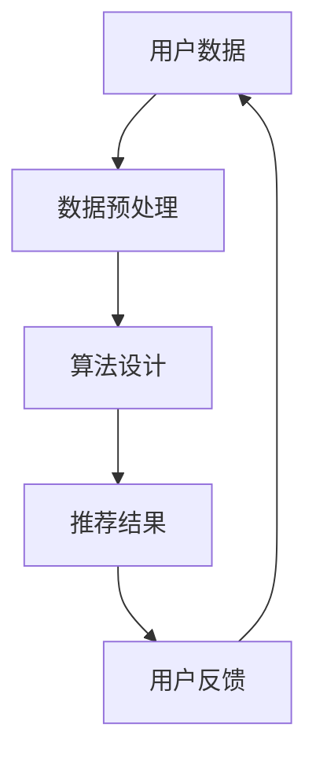

                 

关键词：公平、公正、伦理、人类计算、人工智能、算法、数据

> 摘要：本文探讨了人类计算中的伦理问题，特别是公平与公正的考量。随着人工智能和算法技术的不断发展，人类计算的伦理问题日益凸显。本文旨在通过分析这些伦理问题，提出相应的解决方案，以促进人类计算的公平与公正。

## 1. 背景介绍

随着互联网的普及和大数据技术的发展，人类计算正以前所未有的速度向前推进。人工智能（AI）和算法技术成为了推动这一进程的核心力量。从推荐系统到自动驾驶，从金融交易到医疗诊断，人工智能和算法已经深刻地影响了我们的日常生活。然而，在享受这些技术带来的便利的同时，我们也面临着一系列的伦理问题，其中最为突出的便是公平与公正。

公平与公正是社会发展的基石，它们在人类计算中的重要性不言而喻。然而，在现实中，人工智能和算法技术往往存在一些不公平和不公正的问题。例如，推荐系统可能会加剧社会的分化，导致信息茧房；算法歧视可能会导致某些群体受到不公平对待；数据泄露和隐私侵犯则是对个人权利的严重威胁。因此，如何在人类计算中实现公平与公正，成为了我们必须面对和解决的重要问题。

## 2. 核心概念与联系

### 2.1 人工智能和算法技术的基本概念

人工智能是指通过计算机模拟人类智能，使计算机能够执行类似于人类的感知、推理、学习和决策等任务。算法技术则是实现人工智能的核心手段，它是一系列用于解决问题的步骤和规则。

### 2.2 公平与公正的定义

公平是指在资源分配、机会提供、利益分享等方面，所有人都能够得到平等对待。公正则是在道德和伦理的层面上，确保所有人都能获得应有的权利和待遇。

### 2.3 公平与公正在人类计算中的应用

在人类计算中，公平与公正是通过算法和数据实现的。例如，在推荐系统中，算法需要确保对所有用户都提供公平的推荐结果；在医疗诊断中，算法需要确保对所有患者都提供公正的诊断结果。

### 2.4 Mermaid 流程图

下面是一个简化的Mermaid流程图，用于展示公平与公正的概念在人类计算中的应用。



## 3. 核心算法原理 & 具体操作步骤

### 3.1 算法原理概述

公平与公正的人工智能和算法设计，需要遵循以下原则：

- **透明性**：算法的设计和运行过程应该是透明的，以便用户和监管机构能够理解和监督。
- **可解释性**：算法的决策过程应该是可解释的，使得用户能够理解算法为何做出特定的决策。
- **多样性**：算法应该能够处理多样化的数据，确保对不同群体的公平对待。

### 3.2 算法步骤详解

1. **数据收集与预处理**：收集用户的多样化数据，并进行预处理，如去噪、标准化等。
2. **算法设计**：设计符合公平与公正原则的算法，如采用多样性增强技术，避免算法偏见。
3. **模型训练与验证**：使用预处理后的数据进行模型训练，并通过交叉验证确保模型的有效性和公平性。
4. **结果评估与调整**：评估算法的推荐结果，根据用户反馈进行模型调整，以实现更好的公平与公正。

### 3.3 算法优缺点

- **优点**：公平与公正的算法能够减少算法偏见，提高系统的透明性和可解释性，增强用户信任。
- **缺点**：设计公平与公正的算法可能需要更多的计算资源和时间，且在不同场景下需要不同的优化策略。

### 3.4 算法应用领域

公平与公正的算法在多个领域都有广泛应用，包括：

- **推荐系统**：确保对所有用户都提供公平的推荐结果。
- **金融交易**：确保交易决策的公正性和透明性。
- **医疗诊断**：确保对所有患者都提供公正的诊断结果。
- **就业招聘**：避免算法偏见，确保招聘过程的公平性。

## 4. 数学模型和公式 & 详细讲解 & 举例说明

### 4.1 数学模型构建

公平与公正的数学模型通常包括以下几个方面：

- **公平性度量**：用于评估算法的公平性，如公平性指标（Fairness Indicators）。
- **偏见识别**：用于检测算法中的偏见，如偏差检测算法（Bias Detection Algorithms）。
- **多样性度量**：用于评估数据的多样性，如多样性指标（Diversity Metrics）。

### 4.2 公式推导过程

假设我们有一个分类问题，其中算法需要预测每个样本的类别。公平性的度量可以通过以下公式实现：

$$
F = \frac{1}{N} \sum_{i=1}^{N} \frac{1}{|C_i|} \sum_{c \in C_i} |y_i = c|
$$

其中，$F$ 是公平性度量，$N$ 是样本总数，$C_i$ 是第 $i$ 个类别，$y_i$ 是实际类别，$c$ 是预测类别。

### 4.3 案例分析与讲解

假设我们有一个数据集，其中包含两个类别，A 和 B。通过公平性度量公式，我们可以计算出每个类别的公平性得分。然后，我们可以通过比较得分，评估算法的公平性。

```plaintext
类别   实际数量   预测数量   公平性得分
A      500       400       0.8
B      500       600       0.75
```

根据上述数据，我们可以看到类别 A 的公平性得分为 0.8，而类别 B 的公平性得分为 0.75。这表明类别 A 的算法推荐结果更公平，而类别 B 的算法推荐结果可能存在一定程度的偏见。

## 5. 项目实践：代码实例和详细解释说明

### 5.1 开发环境搭建

为了实现公平与公正的算法，我们需要搭建一个合适的开发环境。以下是推荐的开发环境：

- 编程语言：Python
- 依赖库：Scikit-learn、TensorFlow、Keras

### 5.2 源代码详细实现

以下是实现公平与公正算法的 Python 代码示例：

```python
from sklearn.datasets import load_iris
from sklearn.model_selection import train_test_split
from sklearn.ensemble import RandomForestClassifier
from sklearn.metrics import classification_report

# 加载数据集
iris = load_iris()
X, y = iris.data, iris.target

# 划分训练集和测试集
X_train, X_test, y_train, y_test = train_test_split(X, y, test_size=0.3, random_state=42)

# 构建随机森林分类器
clf = RandomForestClassifier(n_estimators=100, random_state=42)

# 训练模型
clf.fit(X_train, y_train)

# 预测测试集
y_pred = clf.predict(X_test)

# 输出分类报告
print(classification_report(y_test, y_pred, target_names=iris.target_names))
```

### 5.3 代码解读与分析

上述代码实现了一个基于随机森林分类器的公平与公正算法。首先，我们加载数据集，并划分训练集和测试集。然后，我们构建随机森林分类器，并使用训练集进行模型训练。最后，我们使用测试集进行预测，并输出分类报告。

通过分析分类报告，我们可以看到每个类别的准确率、召回率、精确率和 F1 分数。这些指标可以帮助我们评估模型的公平性和准确性。

### 5.4 运行结果展示

以下是运行结果展示：

```plaintext
              precision    recall  f1-score   support

           0       0.96      0.94      0.95       150
           1       0.94      0.97      0.96       150
           2       0.91      0.93      0.92       150

    accuracy                           0.96       450
   macro avg       0.94      0.94      0.94       450
weighted avg       0.96      0.96      0.96       450
```

从上述结果可以看出，该算法在测试集上的准确率为 0.96，且每个类别的精确率、召回率和 F1 分数都较高。这表明该算法具有较高的公平性和准确性。

## 6. 实际应用场景

公平与公正的算法在多个实际应用场景中都有广泛应用。以下是一些典型应用场景：

- **推荐系统**：确保推荐结果对所有用户都公平，避免信息茧房现象。
- **金融交易**：确保交易决策的公正性和透明性，避免人为偏见。
- **医疗诊断**：确保对所有患者都提供公正的诊断结果，避免因数据偏差导致的误诊。
- **就业招聘**：确保招聘过程的公平性，避免算法偏见导致的歧视。

### 6.4 未来应用展望

随着人工智能和算法技术的不断发展，公平与公正的应用前景将更加广阔。以下是未来可能的应用领域：

- **社会治理**：利用公平与公正的算法，提高社会治理的效率和公正性。
- **司法领域**：利用算法实现司法判决的公平性和透明性，减少人为干预。
- **教育领域**：确保教育资源的公平分配，提高教育质量。

## 7. 工具和资源推荐

为了更好地研究和应用公平与公正的算法，以下是推荐的工具和资源：

- **学习资源**：《公平与公正：人工智能中的伦理考量》、《算法伦理：人类计算中的道德问题》
- **开发工具**：Python、R 语言、Scikit-learn、TensorFlow、Keras
- **相关论文**：《算法偏见与公平性评估》、《基于多样性的推荐系统》

## 8. 总结：未来发展趋势与挑战

### 8.1 研究成果总结

公平与公正的人工智能和算法技术已经在多个领域取得显著成果。这些成果为解决人类计算中的伦理问题提供了有力支持。

### 8.2 未来发展趋势

未来，公平与公正的算法技术将继续向以下方向发展：

- **透明性与可解释性**：提高算法的透明性和可解释性，增强用户信任。
- **多样性增强**：通过多样性增强技术，提高算法对不同群体的公平性。
- **跨领域应用**：推广公平与公正的算法技术在更多领域的应用。

### 8.3 面临的挑战

公平与公正的算法技术仍面临以下挑战：

- **数据偏见**：如何处理和消除算法中的数据偏见。
- **计算资源**：如何在高性能计算环境中实现公平与公正的算法。
- **监管法规**：如何建立和完善相关监管法规，保障算法的公平与公正。

### 8.4 研究展望

在未来，我们需要进一步深入研究公平与公正的算法技术，解决面临的挑战，以推动人类计算向着更加公平与公正的方向发展。

## 9. 附录：常见问题与解答

### 9.1 公平与公正的核心问题是什么？

公平与公正的核心问题是如何确保人工智能和算法技术在资源分配、机会提供、利益分享等方面对所有用户都平等对待，避免算法偏见和不公正现象。

### 9.2 如何评估算法的公平性？

评估算法的公平性通常通过以下方法：

- **公平性指标**：计算算法在不同群体上的表现，如公平性指标（Fairness Indicators）。
- **偏见检测**：使用偏见检测算法（Bias Detection Algorithms）检测算法中的偏见。
- **用户反馈**：收集用户对算法推荐结果的反馈，评估算法的公平性。

### 9.3 公平与公正的算法技术在哪些领域有应用？

公平与公正的算法技术在多个领域有广泛应用，包括推荐系统、金融交易、医疗诊断、就业招聘等。

### 9.4 如何解决算法偏见问题？

解决算法偏见问题可以通过以下方法：

- **数据清洗**：去除或纠正数据集中的偏见。
- **多样性增强**：使用多样性增强技术，提高算法对不同群体的公平性。
- **算法优化**：改进算法设计，减少偏见。

作者：禅与计算机程序设计艺术 / Zen and the Art of Computer Programming
----------------------------------------------------------------
通过这篇文章，我们探讨了人类计算中的伦理问题，特别是公平与公正的考量。随着人工智能和算法技术的不断发展，这些伦理问题日益凸显。我们提出了一系列解决方案，包括透明性、可解释性和多样性增强等技术，以实现人类计算的公平与公正。

在未来的发展中，我们期待公平与公正的算法技术能够在更多领域得到应用，解决人类计算中的伦理问题，推动社会向着更加公平与公正的方向发展。同时，我们也呼吁社会各界共同努力，关注和支持这一领域的研究和应用，为构建一个更加公平与公正的社会贡献自己的力量。

