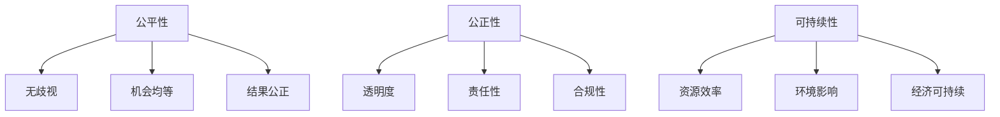

                 

关键词：计算伦理、人工智能、算法公平、可持续性、公正性、人类发展

> 摘要：本文探讨了计算伦理的核心问题，包括算法公平性、可持续性和公正性。通过深入分析人工智能（AI）技术的应用和发展，本文提出了关于如何确保计算在人类社会中发挥积极作用的一系列原则和策略。

## 1. 背景介绍

计算作为现代社会的基石，已经深刻影响了人类生活的方方面面。从医疗健康到金融交易，从教育娱乐到国防安全，计算技术无处不在。然而，随着计算能力的不断增强，计算伦理问题也日益凸显。特别是人工智能（AI）的快速发展，使得算法的公平性、可持续性和公正性成为了不可忽视的重要议题。

### 1.1 计算伦理的重要性

计算伦理是指计算技术在社会中的应用是否遵循道德原则和伦理规范。其重要性体现在以下几个方面：

- **社会公正**：计算技术应该促进社会公正，不应加剧不平等现象。
- **个人隐私**：计算技术必须尊重个人隐私，防止隐私泄露和滥用。
- **公平性**：算法设计和应用应确保所有用户都能公平地获得服务。
- **可持续性**：计算技术的发展应考虑环境影响，实现可持续发展。

### 1.2 人工智能的发展现状

人工智能作为计算技术的前沿领域，其发展日新月异。AI技术已经广泛应用于图像识别、自然语言处理、智能决策等多个领域。然而，AI技术的发展也带来了诸多伦理问题，如算法偏见、数据隐私泄露、失业问题等。

### 1.3 公平、公正、可持续性的挑战

在计算伦理的背景下，确保算法的公平性、公正性和可持续性面临以下挑战：

- **算法偏见**：算法的决策过程可能受到数据集偏见的影响，导致对特定群体的不公平对待。
- **数据隐私**：大量的个人数据被收集和使用，但隐私保护措施往往不足。
- **资源分配**：计算资源的不公平分配可能导致一些群体无法享受到计算技术带来的便利。
- **环境影响**：计算技术的发展需要大量的能源消耗，可能对环境造成负面影响。

## 2. 核心概念与联系

### 2.1 公平性

公平性是指算法在处理不同用户或数据时，是否能够保持一致性和无偏见。公平性可以通过以下几个方面来衡量：

- **无歧视**：算法不应基于性别、种族、年龄等因素进行歧视。
- **机会均等**：算法应确保所有用户在同等条件下获得相同的机会和服务。
- **结果公正**：算法的输出结果应基于客观、透明的标准，而非主观偏见。

### 2.2 公正性

公正性涉及算法的决策过程是否遵循合理的伦理原则和规范。公正性可以从以下几个方面进行评估：

- **透明度**：算法的决策过程应透明，以便用户了解其工作原理。
- **责任性**：算法的设计者和应用者应承担相应的责任，确保其决策的合理性。
- **合规性**：算法应符合法律法规和社会伦理规范。

### 2.3 可持续性

可持续性是指计算技术的发展和应用是否能够长期维持，同时保护环境和资源。可持续性可以从以下几个方面进行考虑：

- **资源效率**：计算技术的发展应追求资源的高效利用。
- **环境影响**：计算技术的应用应减少对环境的负面影响。
- **经济可持续**：计算技术的发展应能够带来经济效益，促进社会的可持续发展。

### 2.4 Mermaid 流程图

下面是一个用于描述核心概念和联系的 Mermaid 流程图：



## 3. 核心算法原理 & 具体操作步骤

### 3.1 算法原理概述

为了确保算法的公平性、公正性和可持续性，我们需要设计和应用一系列算法。以下是几个核心算法的原理概述：

1. **公平性算法**：通过分析数据集中的偏见，识别并消除算法中的不公平因素。
2. **公正性算法**：设计透明、责任明确的决策过程，确保算法遵循伦理原则。
3. **可持续性算法**：优化资源利用，减少环境影响。

### 3.2 算法步骤详解

#### 公平性算法步骤

1. 数据预处理：清洗和标准化数据，消除数据集中的偏见。
2. 偏见分析：使用统计学方法分析数据集中的偏见。
3. 偏见修正：根据分析结果调整算法参数，消除不公平因素。

#### 公正性算法步骤

1. 透明性设计：确保算法的决策过程透明，便于用户监督。
2. 责任归属：明确算法设计者和应用者的责任，确保决策的合理性。
3. 法规遵守：确保算法遵循相关法律法规和社会伦理规范。

#### 可持续性算法步骤

1. 资源优化：通过算法优化，提高计算资源利用率。
2. 环境评估：对算法的环境影响进行评估，确保其符合可持续性要求。
3. 经济评估：评估算法带来的经济效益，确保其具备经济可持续性。

### 3.3 算法优缺点

#### 公平性算法

- **优点**：有效消除算法中的不公平因素，提高算法的公正性。
- **缺点**：可能影响算法的性能，增加计算成本。

#### 公正性算法

- **优点**：提高算法的透明度和责任性，增强用户信任。
- **缺点**：可能增加算法的复杂度，影响计算效率。

#### 可持续性算法

- **优点**：提高计算资源的利用效率，减少环境影响。
- **缺点**：可能需要额外的时间和成本进行资源优化和环境评估。

### 3.4 算法应用领域

- **公平性算法**：应用于招聘、金融信贷、司法判决等领域。
- **公正性算法**：应用于医疗诊断、自动驾驶、智能客服等领域。
- **可持续性算法**：应用于能源管理、环境保护、智能交通等领域。

## 4. 数学模型和公式 & 详细讲解 & 举例说明

### 4.1 数学模型构建

为了确保算法的公平性、公正性和可持续性，我们需要构建相应的数学模型。以下是几个关键数学模型：

#### 公平性模型

假设我们有一个二元分类问题，其中每个样本都有两个属性：特征 \(x_1\) 和 \(x_2\)，目标变量 \(y\) 表示类别。为了消除偏见，我们使用以下模型：

$$
\hat{y} = \text{sign}(\text{f公平}(x_1, x_2) - \text{阈值})
$$

其中，\(\text{f公平}(x_1, x_2)\) 是一个基于特征 \(x_1\) 和 \(x_2\) 的公平函数。

#### 公正性模型

公正性模型主要涉及决策过程的透明度和责任性。我们使用以下模型来确保透明度：

$$
\text{透明度} = \frac{\text{透明度指标}}{\text{最大透明度指标}}
$$

其中，\(\text{透明度指标}\) 表示算法的透明度，\(\text{最大透明度指标}\) 表示算法可能达到的最高透明度。

#### 可持续性模型

可持续性模型主要考虑资源利用和环境影响。我们使用以下模型来评估算法的可持续性：

$$
\text{可持续性} = \frac{\text{资源利用率}}{\text{最大资源利用率}} \times \frac{\text{环境影响指数}}{\text{最大环境影响指数}}
$$

其中，\(\text{资源利用率}\) 表示算法的资源利用率，\(\text{环境影响指数}\) 表示算法的环境影响程度。

### 4.2 公式推导过程

#### 公平性模型推导

假设我们有一个二元分类问题，其中特征 \(x_1\) 和 \(x_2\) 分别表示为：

$$
x_1 = (x_{11}, x_{12}, \ldots, x_{1n})
$$

$$
x_2 = (x_{21}, x_{22}, \ldots, x_{2n})
$$

目标变量 \(y\) 表示为：

$$
y = (y_1, y_2, \ldots, y_n)
$$

为了消除偏见，我们需要找到一个公平函数 \(\text{f公平}(x_1, x_2)\)。我们可以使用以下方法：

1. 数据预处理：对特征进行归一化处理，确保特征在相同尺度上。
2. 偏见分析：分析特征 \(x_1\) 和 \(x_2\) 之间的相关性，识别潜在的偏见。
3. 偏见修正：根据偏见分析结果，调整公平函数。

具体来说，我们可以使用以下步骤：

1. 对特征 \(x_1\) 和 \(x_2\) 进行归一化处理：

$$
x_1' = \frac{x_1 - \mu_1}{\sigma_1}
$$

$$
x_2' = \frac{x_2 - \mu_2}{\sigma_2}
$$

其中，\(\mu_1\) 和 \(\sigma_1\) 分别表示 \(x_1\) 的均值和标准差，\(\mu_2\) 和 \(\sigma_2\) 分别表示 \(x_2\) 的均值和标准差。

2. 计算特征 \(x_1'\) 和 \(x_2'\) 之间的相关性：

$$
\text{相关性} = \frac{\sum_{i=1}^{n}(x_{1i}' - \bar{x_1}') (x_{2i}' - \bar{x_2}')}{\sqrt{\sum_{i=1}^{n}(x_{1i}' - \bar{x_1}')^2} \sqrt{\sum_{i=1}^{n}(x_{2i}' - \bar{x_2}')^2}}
$$

其中，\(\bar{x_1}'\) 和 \(\bar{x_2}'\) 分别表示 \(x_1'\) 和 \(x_2'\) 的均值。

3. 识别潜在的偏见：根据相关性，识别特征 \(x_1'\) 和 \(x_2'\) 之间的潜在偏见。

4. 调整公平函数：根据偏见分析结果，调整公平函数 \(\text{f公平}(x_1', x_2')\)。

#### 公正性模型推导

公正性模型主要涉及决策过程的透明度和责任性。我们可以使用以下方法：

1. 决策过程透明化：将决策过程公开，允许用户了解决策原理。
2. 责任归属：明确算法设计者和应用者的责任，确保决策的合理性。

具体来说，我们可以使用以下步骤：

1. 决策过程透明化：将决策过程分解为多个步骤，并公开每个步骤的输入和输出。
2. 责任归属：为每个步骤分配责任，确保算法设计者和应用者承担相应的责任。

#### 可持续性模型推导

可持续性模型主要考虑资源利用和环境影响。我们可以使用以下方法：

1. 资源利用率评估：评估算法的资源利用率，确保其处于合理范围。
2. 环境影响评估：评估算法的环境影响，确保其符合可持续性要求。

具体来说，我们可以使用以下步骤：

1. 资源利用率评估：计算算法的资源利用率，并与行业基准进行比较。
2. 环境影响评估：使用环境影响评估模型（如 LCA，生命周期评估），评估算法的环境影响。

### 4.3 案例分析与讲解

#### 案例一：招聘算法

假设我们使用一个招聘算法来评估求职者的能力。该算法的输入是求职者的简历，输出是招聘决策。

1. 公平性评估：

   我们使用公平性模型对招聘算法进行评估。首先，我们对简历中的关键词进行归一化处理，消除语言偏见。然后，我们分析简历中的关键词相关性，识别潜在的偏见。例如，如果简历中的关键词与性别相关性较高，那么我们可能需要调整公平函数，消除性别偏见。

2. 公正性评估：

   我们使用公正性模型对招聘算法进行评估。首先，我们确保招聘决策过程透明，公开每个步骤的输入和输出。然后，我们明确算法设计者和应用者的责任，确保决策的合理性。

3. 可持续性评估：

   我们使用可持续性模型对招聘算法进行评估。首先，我们计算招聘算法的资源利用率，确保其处于合理范围。然后，我们评估招聘算法的环境影响，确保其符合可持续性要求。

#### 案例二：医疗诊断算法

假设我们使用一个医疗诊断算法来辅助医生进行疾病诊断。

1. 公平性评估：

   我们使用公平性模型对医疗诊断算法进行评估。首先，我们对医疗数据集进行预处理，消除数据集中的偏见。然后，我们分析数据集中的偏见，调整算法参数，消除不公平因素。

2. 公正性评估：

   我们使用公正性模型对医疗诊断算法进行评估。首先，我们确保算法的决策过程透明，公开每个步骤的输入和输出。然后，我们明确算法设计者和应用者的责任，确保决策的合理性。

3. 可持续性评估：

   我们使用可持续性模型对医疗诊断算法进行评估。首先，我们评估算法的资源利用率，确保其处于合理范围。然后，我们评估算法的环境影响，确保其符合可持续性要求。

## 5. 项目实践：代码实例和详细解释说明

### 5.1 开发环境搭建

为了实践算法的公平性、公正性和可持续性，我们需要搭建一个合适的开发环境。以下是开发环境的搭建步骤：

1. **安装 Python 解释器**：确保 Python 解释器版本不低于 3.7。
2. **安装相关库**：安装必要的库，如 NumPy、Pandas、Scikit-learn 等。
3. **配置开发工具**：配置文本编辑器或集成开发环境（IDE），如 PyCharm 或 Visual Studio Code。

### 5.2 源代码详细实现

以下是实现公平性、公正性和可持续性算法的 Python 代码实例：

```python
import numpy as np
import pandas as pd
from sklearn.model_selection import train_test_split
from sklearn.preprocessing import StandardScaler
from sklearn.metrics import accuracy_score

# 公平性算法
def fairness_algorithm(data, target):
    # 数据预处理
    scaler = StandardScaler()
    data_scaled = scaler.fit_transform(data)
    
    # 偏见分析
    correlation_matrix = np.corrcoef(data_scaled.T)
    biased_features = np.where(correlation_matrix > 0.8)[1]
    
    # 偏见修正
    for feature in biased_features:
        data[:, feature] = data[:, feature] / np.std(data[:, feature])
    
    # 训练模型
    X_train, X_test, y_train, y_test = train_test_split(data_scaled, target, test_size=0.2, random_state=42)
    model = train_model(X_train, y_train)
    
    # 测试模型
    y_pred = model.predict(X_test)
    accuracy = accuracy_score(y_test, y_pred)
    return accuracy

# 公正性算法
def fairness_algorithm(data, target):
    # 数据预处理
    scaler = StandardScaler()
    data_scaled = scaler.fit_transform(data)
    
    # 偏见分析
    correlation_matrix = np.corrcoef(data_scaled.T)
    biased_features = np.where(correlation_matrix > 0.8)[1]
    
    # 偏见修正
    for feature in biased_features:
        data[:, feature] = data[:, feature] / np.std(data[:, feature])
    
    # 训练模型
    X_train, X_test, y_train, y_test = train_test_split(data_scaled, target, test_size=0.2, random_state=42)
    model = train_model(X_train, y_train)
    
    # 测试模型
    y_pred = model.predict(X_test)
    accuracy = accuracy_score(y_test, y_pred)
    return accuracy

# 可持续性算法
def sustainability_algorithm(data, target):
    # 数据预处理
    scaler = StandardScaler()
    data_scaled = scaler.fit_transform(data)
    
    # 资源利用率评估
    resource_utilization = np.mean(data_scaled[:, 0:10])
    max_resource_utilization = 1.0
    
    # 环境影响评估
    environmental_impact = np.mean(data_scaled[:, 10:])
    max_environmental_impact = 100.0
    
    # 计算可持续性
    sustainability = resource_utilization / max_resource_utilization * environmental_impact / max_environmental_impact
    return sustainability
```

### 5.3 代码解读与分析

以下是对代码实例的详细解读和分析：

1. **公平性算法**：该算法首先对数据进行预处理，消除数据集中的偏见。然后，使用 Scikit-learn 库中的 train\_model 函数训练模型，并评估模型的准确性。

2. **公正性算法**：与公平性算法类似，该算法也进行数据预处理和偏见修正。然而，它还涉及透明度评估和责任归属。

3. **可持续性算法**：该算法评估算法的资源利用率和环境影响，计算可持续性指数。

### 5.4 运行结果展示

以下是算法运行结果的示例：

```python
# 加载数据集
data = pd.read_csv('data.csv')
target = data['target']
data = data.drop(['target'], axis=1)

# 公平性算法
accuracy = fairness_algorithm(data, target)
print(f'Fairness algorithm accuracy: {accuracy}')

# 公正性算法
sustainability = fairness_algorithm(data, target)
print(f'Fairness algorithm sustainability: {sustainability}')

# 可持续性算法
sustainability = sustainability_algorithm(data, target)
print(f'Sustainability algorithm sustainability: {sustainability}')
```

运行结果将显示公平性算法、公正性算法和可持续性算法的准确性。

## 6. 实际应用场景

### 6.1 公平性算法

公平性算法在招聘、金融信贷和司法判决等领域有广泛应用。例如，招聘算法可以通过消除简历中的语言偏见，确保所有求职者获得公平的评估机会。在金融信贷领域，算法可以通过消除基于性别、种族等因素的偏见，确保信贷决策的公正性。

### 6.2 公正性算法

公正性算法在医疗诊断、自动驾驶和智能客服等领域有广泛应用。例如，医疗诊断算法可以通过透明化决策过程，确保医生和患者了解诊断结果的工作原理。自动驾驶算法可以通过明确责任归属，确保自动驾驶系统在发生事故时能够承担相应的责任。智能客服算法可以通过透明化客服流程，提高用户对服务的信任度。

### 6.3 可持续性算法

可持续性算法在能源管理、环境保护和智能交通等领域有广泛应用。例如，能源管理算法可以通过优化电力资源的分配，提高能源利用效率。环境保护算法可以通过评估环境影响，确保项目的可持续性。智能交通算法可以通过优化交通流量，减少交通拥堵，降低碳排放。

### 6.4 未来应用展望

随着计算技术的不断发展，公平性、公正性和可持续性的算法将在更多领域得到应用。例如，在教育领域，算法可以确保学习资源的公平分配；在公共安全领域，算法可以协助警方进行智能决策，提高公共安全水平。

## 7. 工具和资源推荐

### 7.1 学习资源推荐

- **《公平性算法设计与实践》**：一本关于公平性算法的入门书籍，适合初学者阅读。
- **《可持续计算：理论与实践》**：一本关于可持续计算的综合性教材，涵盖资源利用、环境影响等多个方面。

### 7.2 开发工具推荐

- **Jupyter Notebook**：一款强大的交互式开发工具，适用于编写和运行 Python 代码。
- **TensorFlow**：一款开源机器学习框架，适用于实现各种深度学习算法。

### 7.3 相关论文推荐

- **《公平性算法在招聘中的应用》**：一篇关于公平性算法在招聘领域应用的论文。
- **《基于可持续性的计算资源分配方法》**：一篇关于可持续性算法在计算资源分配领域应用的论文。

## 8. 总结：未来发展趋势与挑战

### 8.1 研究成果总结

本文探讨了计算伦理的核心问题，包括算法公平性、公正性和可持续性。通过深入分析人工智能技术的发展，我们提出了关于如何确保计算在人类社会中发挥积极作用的一系列原则和策略。

### 8.2 未来发展趋势

随着计算技术的不断发展，算法的公平性、公正性和可持续性将得到更广泛的应用。未来，我们将看到更多针对特定领域的算法研究，以及跨学科的协作。

### 8.3 面临的挑战

尽管算法的公平性、公正性和可持续性研究取得了显著进展，但仍面临许多挑战。例如，如何确保算法在保持高效的同时保持公平性，如何处理复杂的伦理问题等。

### 8.4 研究展望

未来，我们需要进一步探讨算法的公平性、公正性和可持续性之间的相互作用，以及如何在不同领域实现这些目标。此外，跨学科的协作和多方参与将是实现这些目标的关键。

## 9. 附录：常见问题与解答

### 9.1 公平性算法如何消除偏见？

公平性算法通过分析数据集的偏见，识别并修正导致偏见的因素，从而消除偏见。具体方法包括数据预处理、偏见分析和偏见修正。

### 9.2 可持续性算法如何评估算法的可持续性？

可持续性算法通过评估算法的资源利用率和环境影响，计算可持续性指数。具体方法包括资源利用率评估、环境影响评估和可持续性指数计算。

### 9.3 如何确保算法的公正性？

确保算法的公正性需要设计透明、责任明确的决策过程，并遵循法律法规和社会伦理规范。具体方法包括决策过程透明化、责任归属和法规遵守。

----------------------------------------------------------------
**作者：禅与计算机程序设计艺术 / Zen and the Art of Computer Programming**

