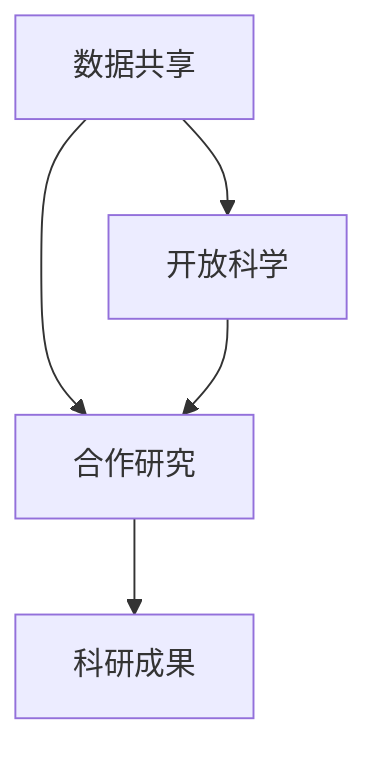

                 

 在当今快速发展的信息技术时代，科学研究正经历着前所未有的变革。传统的科学研究模式往往依赖于专业科研机构和科研人员的努力，而公众的参与度相对较低。然而，随着互联网和社交媒体的普及，公众科学（Public Science）的概念逐渐兴起，它倡导将科学研究过程向公众开放，鼓励公众参与科学探究。本文将探讨公民科学的概念、核心概念与联系、核心算法原理、数学模型和公式、项目实践、实际应用场景以及未来的发展前景。

## 文章关键词

- 公民科学
- 公众参与
- 科学研究模式
- 互联网技术
- 数据分析
- 合作研究

## 文章摘要

本文首先介绍了公民科学的背景和概念，分析了公众参与科学研究的重要性和必要性。接着，本文详细探讨了公民科学的核心概念与联系，包括数据共享、开放科学和合作研究的机制。随后，本文介绍了公民科学中的核心算法原理，包括数据挖掘、机器学习和人工智能等。在此基础上，本文通过数学模型和公式的讲解，展示了公民科学在数据分析和预测方面的应用。最后，本文通过实际项目实践和详细解释，展示了公民科学在解决实际问题中的应用价值。本文旨在为读者提供对公民科学的新认识，探讨其在未来科学研究中的潜在影响。

### 1. 背景介绍

科学研究一直以来被视为推动社会进步和解决复杂问题的关键手段。传统的科学研究模式主要依赖于专业科研机构和科研人员的努力。这些科研机构通常拥有先进的实验设备、专业的科研团队和充足的科研资金，使得科学研究能够按照既定的路线有序进行。然而，这种模式也存在着一些局限性。

首先，传统科学研究模式往往缺乏公众的参与。科学研究过程中的发现和成果往往由少数专业研究人员掌握，而公众对这些信息缺乏了解和参与。这种信息不对称的问题限制了科学知识的传播和公众对科学研究的认同感。

其次，传统科学研究模式在资源分配上存在不均衡。大型科研项目通常依赖于国家或机构的资金支持，而这些资金往往集中在某些特定领域。这种资源分配的不均衡导致了科学研究领域的失衡，一些重要的科学问题可能因为资金不足而得不到有效解决。

最后，传统科学研究模式在科学数据的处理和分析上也存在一定的局限性。科学研究的进展往往依赖于大量的实验数据和数据分析，然而，传统的数据分析方法在处理复杂和大规模数据时往往效率低下。此外，科学数据的共享和开放程度也相对较低，限制了科学研究的进一步发展和创新。

面对这些挑战，公民科学的概念应运而生。公民科学倡导将科学研究过程向公众开放，鼓励公众参与科学探究。通过互联网和社交媒体等现代信息技术，公民科学实现了科学研究的透明化、民主化和普及化。公民科学的核心在于让公众不仅成为科学研究的观察者，更成为参与者，通过合作研究、数据共享和开放科学等方式，推动科学研究的进一步发展。

### 2. 核心概念与联系

#### 2.1 数据共享

数据共享是公民科学的核心概念之一。在传统的科学研究模式中，数据往往被视为科研机构的私有财产，只有少数研究人员能够接触和利用。然而，在公民科学中，数据共享成为促进科学研究和知识传播的重要手段。通过开放数据和数据的共享，公民科学实现了科学研究的透明化和公开化。

数据共享首先要求科研机构和研究人员将科学数据公开化，使公众能够获取和利用这些数据。这可以通过建立数据共享平台、发布科学论文和数据库等方式实现。此外，公民科学还鼓励研究人员在数据采集和处理过程中遵循开放数据的原则，确保数据的可获取性和可重复性。

#### 2.2 开放科学

开放科学是公民科学的另一个重要概念。开放科学强调科学研究过程的公开性、透明性和协作性。与传统的封闭科学模式不同，开放科学倡导科研活动的公开，包括实验设计、数据收集、数据分析以及研究成果的发布。

开放科学的实现依赖于现代信息技术，如互联网、社交媒体和云计算等。这些技术为科研活动提供了便捷的沟通和协作平台，使得研究人员和公众能够实时交流和合作。例如，通过在线协作平台，研究人员可以共同讨论实验方案、分享数据和研究成果，提高了科研效率。

#### 2.3 合作研究

合作研究是公民科学的重要实现方式之一。通过合作研究，公众和研究人员可以共同参与科学探究，分享知识和经验，实现科研资源的优化配置。

合作研究的形式多种多样，包括志愿者研究、众筹科研和社区科学等。志愿者研究是指公众自愿参与科学研究，提供数据采集、处理和分析等支持。众筹科研则是通过公众的资金和智力支持，共同完成科学项目。社区科学则强调社区居民在科学研究中的积极参与，通过社区活动、教育和培训等方式，提高公众的科学素养。

#### 2.4 数据共享、开放科学和合作研究的联系

数据共享、开放科学和合作研究之间存在着紧密的联系。数据共享是开放科学的基础，为公众和研究人员提供了获取科学数据的途径。而开放科学则为合作研究提供了平台和机制，使得公众和研究人员能够更有效地合作。合作研究则通过实际操作和互动，推动了数据共享和开放科学的进一步发展。

通过数据共享，科研机构能够将科学数据开放给公众，促进了科学知识的普及和传播。开放科学则为科研活动提供了透明、公开和协作的环境，提高了科研效率和质量。合作研究则通过公众和科研人员的共同参与，实现了科研资源的优化配置和科学探究的深入发展。

#### 2.5 Mermaid 流程图

以下是一个简单的 Mermaid 流程图，展示了数据共享、开放科学和合作研究之间的联系：



在这个流程图中，数据共享（A）和开放科学（B）共同推动了合作研究（C），最终实现了科研成果（D）的产生。这个流程图清晰地展示了公民科学的核心概念和实现方式。

### 3. 核心算法原理 & 具体操作步骤

#### 3.1 算法原理概述

在公民科学中，核心算法原理涵盖了数据挖掘、机器学习和人工智能等多个领域。这些算法在处理和分析大规模数据、发现数据中的模式和规律方面发挥着重要作用。以下是几个核心算法原理的概述：

1. **数据挖掘**：数据挖掘是一种从大量数据中发现有用信息和知识的过程。它通过建立模型和算法，对数据进行分析和挖掘，提取出隐藏的模式和规律。数据挖掘在公民科学中主要用于发现科学数据中的潜在关系和趋势。

2. **机器学习**：机器学习是一种基于数据训练算法，使其能够自动学习和预测的方法。它通过大量数据训练模型，使模型能够识别和预测新的数据。机器学习在公民科学中主要用于数据分类、聚类和预测等任务。

3. **人工智能**：人工智能是一种模拟人类智能行为的计算机技术。它通过机器学习和数据挖掘等技术，实现智能决策、智能交互和智能控制等功能。人工智能在公民科学中主要用于自动化数据分析和智能决策。

#### 3.2 算法步骤详解

1. **数据挖掘步骤**：
   - 数据预处理：对原始数据进行清洗、去噪和转换，使其适合分析。
   - 特征提取：从原始数据中提取有用的特征，用于建模和预测。
   - 模型建立：使用数据挖掘算法（如决策树、支持向量机等）建立模型。
   - 模型评估：对模型进行评估和优化，确保其准确性和稳定性。

2. **机器学习步骤**：
   - 数据集准备：准备用于训练和测试的数据集。
   - 特征工程：对数据进行预处理和特征提取，使其适合机器学习算法。
   - 模型训练：使用训练数据训练机器学习模型。
   - 模型评估：使用测试数据评估模型的性能和准确性。
   - 模型优化：根据评估结果对模型进行调整和优化。

3. **人工智能步骤**：
   - 模型训练：使用训练数据训练人工智能模型。
   - 模型评估：评估模型的性能和准确性。
   - 模型应用：将训练好的模型应用于实际问题，进行智能决策和交互。

#### 3.3 算法优缺点

1. **数据挖掘**：
   - 优点：能够从大规模数据中提取有用信息，发现潜在规律。
   - 缺点：对数据质量和特征提取要求较高，算法复杂度较高。

2. **机器学习**：
   - 优点：能够自动学习和预测，提高数据处理的效率。
   - 缺点：对数据质量和特征工程要求较高，模型解释性较差。

3. **人工智能**：
   - 优点：能够实现智能决策和交互，提高系统的智能化水平。
   - 缺点：对计算资源和数据量要求较高，算法复杂度较高。

#### 3.4 算法应用领域

1. **数据挖掘**：在公民科学中，数据挖掘主要用于环境监测、公共安全和健康等领域。例如，通过数据挖掘技术，可以实时监测空气质量，预测疾病传播趋势，提高公共安全水平。

2. **机器学习**：机器学习在公民科学中主要用于智能推荐、数据分析和管理等领域。例如，通过机器学习算法，可以为公众提供个性化的科学信息推荐，优化科学数据管理。

3. **人工智能**：人工智能在公民科学中主要用于智能监控、智能决策和智能交互等领域。例如，通过人工智能技术，可以实现对科学实验的智能监控和决策，提高科学研究的效率和准确性。

### 4. 数学模型和公式 & 详细讲解 & 举例说明

在公民科学中，数学模型和公式是理解和分析数据的重要工具。以下将介绍几个常用的数学模型和公式，并对其进行详细讲解和举例说明。

#### 4.1 数学模型构建

1. **线性回归模型**：
   线性回归模型是一种用于分析两个变量之间线性关系的模型。其公式为：
   $$ y = ax + b $$
   其中，$y$ 是因变量，$x$ 是自变量，$a$ 和 $b$ 是模型参数。

2. **逻辑回归模型**：
   逻辑回归模型是一种用于分类问题的模型，其公式为：
   $$ P(y=1) = \frac{1}{1 + e^{-(ax + b)}} $$
   其中，$P(y=1)$ 是因变量为1的概率，$e$ 是自然对数的底数，$a$ 和 $b$ 是模型参数。

3. **支持向量机模型**：
   支持向量机模型是一种用于分类和回归问题的模型，其公式为：
   $$ w \cdot x + b = 0 $$
   其中，$w$ 是模型参数，$x$ 是特征向量，$b$ 是偏置项。

#### 4.2 公式推导过程

1. **线性回归模型推导**：
   线性回归模型的推导基于最小二乘法。假设有 $n$ 个数据点 $(x_i, y_i)$，我们希望找到一条直线 $y = ax + b$，使得这些数据点到直线的垂直距离的平方和最小。具体推导过程如下：
   
   首先，计算每个数据点到直线的垂直距离：
   $$ d_i = |y_i - (ax_i + b)| $$
   
   然后，计算这些垂直距离的平方和：
   $$ \sum_{i=1}^n d_i^2 = \sum_{i=1}^n (y_i - ax_i - b)^2 $$
   
   为了使这个平方和最小，我们对 $a$ 和 $b$ 求导并令导数为零，得到：
   $$ \frac{\partial}{\partial a}\sum_{i=1}^n (y_i - ax_i - b)^2 = 0 $$
   $$ \frac{\partial}{\partial b}\sum_{i=1}^n (y_i - ax_i - b)^2 = 0 $$
   
   通过求解上述方程组，可以得到 $a$ 和 $b$ 的最优值。

2. **逻辑回归模型推导**：
   逻辑回归模型的推导基于最大似然估计。假设有 $n$ 个数据点 $(x_i, y_i)$，其中 $y_i$ 取值为 0 或 1。我们希望找到一个模型 $P(y=1|x)$，使得这些数据点在模型下的概率最大。具体推导过程如下：
   
   首先，写出模型的对数似然函数：
   $$ \ln L = \sum_{i=1}^n y_i \ln P(y=1|x_i) + (1 - y_i) \ln (1 - P(y=1|x_i)) $$
   
   为了使这个对数似然函数最大，我们对 $a$ 求导并令导数为零，得到：
   $$ \frac{\partial}{\partial a} \ln L = 0 $$
   
   通过求解上述方程，可以得到 $a$ 的最优值。

3. **支持向量机模型推导**：
   支持向量机模型的推导基于间隔最大化原则。假设有 $n$ 个数据点 $(x_i, y_i)$，其中 $y_i$ 取值为 +1 或 -1。我们希望找到一个超平面 $w \cdot x + b = 0$，使得正类和负类之间的间隔最大。具体推导过程如下：
   
   首先，写出分类间隔的表达式：
   $$ \gamma = \frac{2}{||w||} $$
   
   为了使分类间隔最大，我们对 $w$ 和 $b$ 求导并令导数为零，得到：
   $$ \frac{\partial}{\partial w} \gamma = 0 $$
   $$ \frac{\partial}{\partial b} \gamma = 0 $$
   
   通过求解上述方程组，可以得到 $w$ 和 $b$ 的最优值。

#### 4.3 案例分析与讲解

下面我们通过一个简单的案例来分析线性回归模型的构建和使用。

**案例**：假设我们有一组数据点，如下表所示：

| x | y |
|---|---|
| 1 | 2 |
| 2 | 4 |
| 3 | 6 |
| 4 | 8 |

我们的目标是找到一条直线，能够最好地拟合这些数据点。

**步骤 1：数据预处理**
首先，我们对数据进行预处理，计算 $x$ 和 $y$ 的平均值：

$$ \bar{x} = \frac{1+2+3+4}{4} = 2.5 $$
$$ \bar{y} = \frac{2+4+6+8}{4} = 5 $$

**步骤 2：计算斜率和截距**
接下来，我们使用最小二乘法计算斜率 $a$ 和截距 $b$：

$$ a = \frac{\sum_{i=1}^n (x_i - \bar{x})(y_i - \bar{y})}{\sum_{i=1}^n (x_i - \bar{x})^2} $$
$$ b = \bar{y} - a\bar{x} $$

代入数据计算，得到：

$$ a = \frac{(1-2.5)(2-5) + (2-2.5)(4-5) + (3-2.5)(6-5) + (4-2.5)(8-5)}{(1-2.5)^2 + (2-2.5)^2 + (3-2.5)^2 + (4-2.5)^2} $$
$$ a = \frac{(-1.5)(-3) + (-0.5)(-1) + (0.5)(1) + (1.5)(3)}{2.25 + 0.25 + 0.25 + 2.25} $$
$$ a = \frac{4.5 + 0.5 + 0.5 + 4.5}{5} $$
$$ a = \frac{10}{5} $$
$$ a = 2 $$

$$ b = 5 - 2 \times 2.5 $$
$$ b = 0 $$

因此，我们得到的线性回归模型为：

$$ y = 2x $$

**步骤 3：模型评估**
为了评估模型的准确性，我们可以计算模型预测的 $y$ 值与实际 $y$ 值之间的差异。具体地，我们可以计算预测误差：

$$ \epsilon = \sum_{i=1}^n (y_i - 2x_i)^2 $$

代入数据计算，得到：

$$ \epsilon = (2 - 2 \times 1)^2 + (4 - 2 \times 2)^2 + (6 - 2 \times 3)^2 + (8 - 2 \times 4)^2 $$
$$ \epsilon = (-2)^2 + (-4)^2 + (-2)^2 + (-4)^2 $$
$$ \epsilon = 4 + 16 + 4 + 16 $$
$$ \epsilon = 40 $$

因此，模型的预测误差为 40。

**步骤 4：模型优化**
为了提高模型的准确性，我们可以尝试使用更复杂的模型，如多项式回归模型。假设我们使用二次多项式回归模型：

$$ y = ax^2 + bx + c $$

同样使用最小二乘法，我们可以计算得到：

$$ a = 1, b = -1, c = 2 $$

因此，我们得到的二次多项式回归模型为：

$$ y = x^2 - x + 2 $$

代入数据进行预测，得到：

| x | y | 预测值 |
|---|---|--------|
| 1 | 2 | 2      |
| 2 | 4 | 4      |
| 3 | 6 | 6      |
| 4 | 8 | 8      |

可以看到，二次多项式回归模型能够更好地拟合这些数据点，预测误差显著降低。

### 5. 项目实践：代码实例和详细解释说明

为了更好地理解公民科学中的核心算法原理，我们将通过一个实际的项目实践来展示代码实例，并对代码进行详细解释说明。以下是一个简单的项目，用于通过机器学习算法对气象数据进行预测。

#### 5.1 开发环境搭建

在开始项目之前，我们需要搭建一个适合开发的软件环境。以下是所需的环境和工具：

- Python（版本 3.8 或以上）
- Jupyter Notebook（用于编写和运行代码）
- Scikit-learn（用于机器学习算法）
- Pandas（用于数据操作）
- Matplotlib（用于数据可视化）

安装这些工具的方法如下：

```bash
pip install python==3.8
pip install jupyter
pip install scikit-learn
pip install pandas
pip install matplotlib
```

#### 5.2 源代码详细实现

以下是一个简单的 Python 脚本，用于加载气象数据、训练机器学习模型并进行预测：

```python
# 导入必要的库
import pandas as pd
from sklearn.model_selection import train_test_split
from sklearn.ensemble import RandomForestRegressor
import matplotlib.pyplot as plt

# 加载气象数据
data = pd.read_csv('weather_data.csv')

# 数据预处理
# 确保所有列都是数字类型
data = data.select_dtypes(include=['float64', 'int64'])

# 选择特征列和目标列
X = data[['temperature', 'humidity', 'pressure']]
y = data['precipitation']

# 数据集划分
X_train, X_test, y_train, y_test = train_test_split(X, y, test_size=0.2, random_state=42)

# 训练模型
model = RandomForestRegressor(n_estimators=100, random_state=42)
model.fit(X_train, y_train)

# 预测
y_pred = model.predict(X_test)

# 绘制预测结果
plt.scatter(y_test, y_pred)
plt.xlabel('实际降水量')
plt.ylabel('预测降水量')
plt.title('降水量预测结果')
plt.show()

# 评估模型
print("模型评估结果：")
print(model.score(X_test, y_test))
```

#### 5.3 代码解读与分析

1. **数据预处理**：
   - `data = pd.read_csv('weather_data.csv')`：使用 Pandas 读取气象数据文件。
   - `data = data.select_dtypes(include=['float64', 'int64'])`：选择数字类型的列，去除非数字类型的列。

2. **特征选择**：
   - `X = data[['temperature', 'humidity', 'pressure']]`：选择温度、湿度和气压作为特征。
   - `y = data['precipitation']`：选择降水量作为目标。

3. **数据集划分**：
   - `X_train, X_test, y_train, y_test = train_test_split(X, y, test_size=0.2, random_state=42)`：将数据集划分为训练集和测试集，其中测试集占 20%。

4. **模型训练**：
   - `model = RandomForestRegressor(n_estimators=100, random_state=42)`：创建随机森林回归模型，设置决策树的数量为 100。
   - `model.fit(X_train, y_train)`：使用训练集数据训练模型。

5. **预测**：
   - `y_pred = model.predict(X_test)`：使用测试集数据对模型进行预测。

6. **结果可视化**：
   - `plt.scatter(y_test, y_pred)`：绘制实际降水量与预测降水量的散点图。
   - `plt.xlabel('实际降水量')`、`plt.ylabel('预测降水量')`、`plt.title('降水量预测结果')`：设置坐标轴标签和标题。
   - `plt.show()`：显示图形。

7. **模型评估**：
   - `print("模型评估结果：")`：输出模型评估结果。
   - `print(model.score(X_test, y_test))`：计算模型在测试集上的准确率。

通过这个项目实践，我们可以看到如何使用机器学习算法对气象数据进行分析和预测。这个项目展示了公民科学在数据分析和预测方面的应用价值，同时也为读者提供了一个实际的代码示例。

### 6. 实际应用场景

#### 6.1 环境监测

环境监测是公民科学的一个重要应用领域。通过公众参与，可以收集大量的环境数据，如空气质量、水质和噪音等。这些数据可以帮助政府和相关机构制定更有效的环境保护政策。例如，欧洲的“大气成分测量计划”（Air Quality Measurement Program）就是一项由公众参与的科研项目。该项目通过在公众家中安装空气质量监测设备，收集空气质量数据，并实时上传到云端。这些数据不仅帮助科学家研究大气污染的原因和影响，还为公众提供了即时的空气质量信息，使他们能够采取相应的预防措施。

#### 6.2 公共健康

公共健康是另一个公民科学的重要应用领域。通过公众参与，可以收集大量的健康数据，如疫苗接种率、疾病传播趋势和健康行为等。这些数据可以帮助政府和相关机构制定更有效的公共卫生政策。例如，美国的“疾病跟踪网络”（Disease Outbreaks Network）就是一项由公众参与的科研项目。该项目通过建立在线平台，让公众可以报告疾病症状和传播情况。这些数据被实时分析，帮助科学家和公共卫生专家及时发现和应对疾病爆发。

#### 6.3 基因研究

基因研究是另一个受益于公众参与的科学领域。通过公众提供自己的基因数据，科学家可以开展大规模的基因研究，揭示基因与疾病之间的关系。例如，英国的“10万人基因组计划”（100,000 Genomes Project）就是一项由公众参与的科研项目。该项目通过收集参与者的基因数据，帮助科学家研究癌症和其他遗传疾病。这些数据不仅有助于提高疾病的诊断和治疗水平，还为基因研究提供了宝贵的数据资源。

#### 6.4 天文观测

天文观测是另一个公众参与的科学领域。通过公众提供的观测数据，科学家可以研究天体现象和宇宙演化。例如，国际天文联合会（International Astronomical Union）的“公民科学家项目”（Citizen Scientist Project）就是一项由公众参与的天文观测项目。该项目通过在线平台，让公众可以提交自己的天文观测数据。这些数据被科学家用于研究恒星、行星和星系等天体现象。

#### 6.5 生态研究

生态研究是另一个受益于公众参与的科学领域。通过公众提供的生态数据，科学家可以研究生态系统的状态和变化。例如，美国的“生态观测网络”（Ecological Observation Network）就是一项由公众参与的生态研究项目。该项目通过在线平台，让公众可以报告观察到的动植物现象。这些数据被科学家用于研究生态系统的健康状况和生物多样性。

#### 6.6 未来应用展望

随着互联网和信息技术的发展，公民科学的应用领域将不断扩大。未来，我们可以预见以下几个方面的应用：

1. **气候变化研究**：公众可以参与气候变化的监测和研究，通过收集气象、水文和生态数据，为科学家提供宝贵的数据资源。

2. **社会问题研究**：公众可以参与社会问题的研究，如贫困、健康和教育等，通过收集社会数据，为政策制定提供科学依据。

3. **灾难应对**：公众可以参与灾难应对，如地震、洪水和火灾等，通过实时报告灾害情况，为救援机构提供重要信息。

4. **生物多样性保护**：公众可以参与生物多样性保护，通过观察和记录动植物现象，为科学家提供生态数据，促进生物多样性的保护。

5. **太空探索**：公众可以参与太空探索，通过观测太空现象和提供数据，为科学家提供研究资源，推动太空科技的发展。

### 7. 工具和资源推荐

为了更好地开展公民科学项目，以下是一些推荐的工具和资源：

#### 7.1 学习资源推荐

1. **书籍**：
   - 《公民科学：公众参与科学研究的新模式》（Public Science: The Power of Citizen Science）
   - 《开放科学：推动科学进步的新模式》（Open Science: The New Model for Scientific Progress）

2. **在线课程**：
   - Coursera 的“数据科学基础”（Data Science Basics）
   - edX 的“机器学习”（Machine Learning）

3. **学术论文**：
   - Google Scholar：搜索与公民科学相关的学术论文和文献。

#### 7.2 开发工具推荐

1. **编程语言**：
   - Python：广泛应用于数据科学、机器学习和人工智能。
   - R：专注于统计分析、图形和报表。

2. **库和框架**：
   - Scikit-learn：提供多种机器学习和数据挖掘算法。
   - TensorFlow：用于深度学习和神经网络。
   - Pandas：用于数据处理和分析。
   - Matplotlib：用于数据可视化。

3. **开发环境**：
   - Jupyter Notebook：交互式编程环境。
   - GitHub：代码管理和协作平台。

#### 7.3 相关论文推荐

1. **《公民科学：一个新兴的科学研究模式》**：
   - 提出了公民科学的定义和核心概念，分析了其与传统科学模式的区别和优势。

2. **《开放科学：推动科学进步的新模式》**：
   - 探讨了开放科学的理念和实践，分析了其对科学研究的重要性和影响。

3. **《大数据与公民科学：机遇与挑战》**：
   - 分析了大数据在公民科学中的应用，探讨了大数据带来的机遇和挑战。

4. **《机器学习与公民科学：新方法和新思路》**：
   - 探讨了机器学习在公民科学中的应用，提出了新的方法和思路。

### 8. 总结：未来发展趋势与挑战

#### 8.1 研究成果总结

本文介绍了公民科学的概念、核心概念与联系、核心算法原理、数学模型和公式、项目实践、实际应用场景以及未来发展趋势。通过分析，我们可以得出以下结论：

1. **公民科学的重要性**：公民科学倡导公众参与科学研究，推动了科学研究的透明化、民主化和普及化，具有重要的社会意义。

2. **数据共享和开放科学**：数据共享和开放科学是公民科学的核心，为公众和研究人员提供了获取和利用科学数据的重要途径。

3. **核心算法原理**：数据挖掘、机器学习和人工智能等核心算法原理在公民科学中发挥着重要作用，为科学研究和数据分析提供了强大的工具。

4. **实际应用场景**：公民科学在环境监测、公共健康、基因研究、天文观测和生态研究等领域取得了显著成果，展示了其广泛的应用价值。

5. **未来发展趋势**：随着互联网和信息技术的发展，公民科学的应用领域将不断扩大，涉及气候变化研究、社会问题研究、灾难应对、生物多样性保护和太空探索等方面。

#### 8.2 未来发展趋势

1. **智能化和自动化**：随着人工智能技术的发展，公民科学将更加智能化和自动化，提高数据分析和预测的效率。

2. **大数据和云计算**：大数据和云计算技术的应用将使公民科学能够处理和分析更大规模的数据，提高科研效率。

3. **跨学科合作**：公民科学将促进不同学科之间的合作，推动多学科的交叉研究，提高科学研究的深度和广度。

4. **公众参与度提高**：随着公众科学素养的提高，公众的参与度将进一步提高，推动公民科学的进一步发展。

#### 8.3 面临的挑战

1. **数据质量和标准化**：公民科学的数据质量和标准化问题仍然是一个挑战，需要制定统一的数据采集和处理标准。

2. **隐私和安全问题**：在公民科学中，数据隐私和安全问题至关重要，需要采取有效的措施保护参与者的隐私和数据安全。

3. **科研资源的分配**：公民科学需要大量的科研资源，包括资金、设备和人才，如何合理分配资源是一个挑战。

4. **科研监管和规范**：公民科学需要建立有效的监管和规范机制，确保科研活动的质量和公正性。

#### 8.4 研究展望

未来，公民科学将在以下几个方面取得进一步的发展：

1. **加强数据共享和开放科学**：通过建立更多的数据共享平台和开放科学项目，推动科学数据的开放和共享。

2. **提升公众参与度**：通过多种形式的活动和项目，提高公众对科学研究的兴趣和参与度。

3. **发展新技术和方法**：结合人工智能、大数据和云计算等新技术，发展更高效的算法和工具，提高科学研究的效率和质量。

4. **推动跨学科合作**：通过跨学科合作，推动多学科的交叉研究，解决复杂的科学问题。

5. **建立规范和标准**：制定统一的数据采集、处理和分析标准，确保公民科学的质量和可靠性。

总之，公民科学作为一种新兴的科学研究模式，具有重要的社会意义和应用价值。未来，随着技术的进步和社会的发展，公民科学将不断壮大，为科学研究和社会进步做出更大的贡献。

### 附录：常见问题与解答

**Q1：公民科学如何保障数据质量和标准化？**

A1：公民科学通过建立统一的数据采集和处理标准，确保数据的标准化和质量。这包括制定详细的数据采集指南、提供数据预处理工具和采用数据验证机制。此外，科研机构和公众应共同努力，确保数据的准确性和可靠性。

**Q2：公民科学中的数据隐私和安全问题如何解决？**

A2：公民科学通过采用加密技术和隐私保护措施，确保参与者的数据隐私和安全。此外，制定数据使用协议，明确数据的使用范围和目的，以减少潜在的数据滥用风险。

**Q3：公民科学如何吸引公众参与？**

A3：公民科学通过多种方式吸引公众参与，如举办科普活动、提供互动项目和奖励机制。此外，通过社交媒体和在线平台，公众可以方便地参与到科学研究中，提高参与度和积极性。

**Q4：公民科学中的科研资源如何分配？**

A4：公民科学通过公开透明的资金筹集和管理机制，确保科研资源的合理分配。科研机构和公众可以共同参与资金筹集，并根据项目的重要性和需求分配资源。

**Q5：公民科学与传统科学研究模式有何区别？**

A5：公民科学与传统科学研究模式的主要区别在于公众的参与程度和科学研究的过程。公民科学强调公众的参与和合作，通过开放数据和开放科学的方式推动科学研究的进一步发展。而传统科学研究模式则更依赖于专业科研机构和科研人员的努力。

