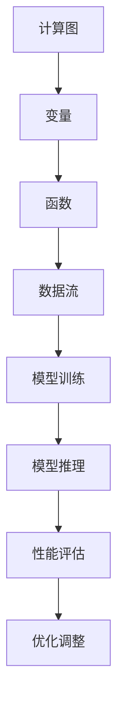

                 

关键词：推理框架，Pytorch，MXNet，深度学习，神经计算，图像处理，算法优化，性能比较

摘要：本文将深入探讨两个现代深度学习推理框架——Pytorch和MXNet。我们将从背景介绍、核心概念与联系、核心算法原理、数学模型与公式、项目实践、实际应用场景、未来展望等多个方面，对这两个框架进行详细解析，帮助读者理解它们的优缺点，以及它们在深度学习领域的应用。

## 1. 背景介绍

随着深度学习技术的不断发展，各种开源框架层出不穷，为研究者提供了丰富的工具和资源。Pytorch和MXNet是其中两个广受欢迎的框架，它们在图像处理、自然语言处理等多个领域有着广泛的应用。

Pytorch是由Facebook AI研究院开发的一款开源深度学习框架，它的特点是动态计算图，使得模型调试更加灵活，同时拥有强大的GPU加速支持。MXNet则是亚马逊公司开发的一款开源深度学习框架，它采用了动态计算图和静态计算图两种模式，能够在不同场景下提供优秀的性能。

## 2. 核心概念与联系

### 2.1 核心概念

在深度学习中，推理框架的核心概念包括计算图、变量、函数等。

- **计算图**：深度学习的计算图由节点和边组成，节点表示操作，边表示数据流。
- **变量**：变量是框架中用于存储数据的容器，可以是张量、矩阵等。
- **函数**：函数是深度学习框架中用于实现各种操作的模块，如卷积、池化、激活等。

### 2.2 Mermaid 流程图



## 3. 核心算法原理 & 具体操作步骤

### 3.1 算法原理概述

Pytorch和MXNet都采用了基于自动微分和反向传播的深度学习算法。这些算法通过计算损失函数关于模型参数的梯度，来更新模型参数，从而优化模型。

### 3.2 算法步骤详解

- **前向传播**：将输入数据通过模型的前向传播过程，得到模型的输出。
- **计算损失**：将模型的输出与目标数据进行比较，计算损失函数。
- **反向传播**：根据损失函数的梯度，更新模型的参数。
- **迭代优化**：重复以上步骤，直到模型收敛或达到预设的迭代次数。

### 3.3 算法优缺点

- **Pytorch**：优点是动态计算图，调试方便，社区活跃；缺点是静态计算图性能略逊于MXNet。
- **MXNet**：优点是静态计算图性能优异，支持多种编程语言；缺点是动态计算图性能不如Pytorch，调试相对困难。

### 3.4 算法应用领域

Pytorch和MXNet在图像处理、自然语言处理、推荐系统等多个领域有着广泛的应用。例如，在图像分类任务中，它们可以用于训练和推理卷积神经网络；在自然语言处理任务中，它们可以用于训练和推理循环神经网络或Transformer模型。

## 4. 数学模型和公式 & 详细讲解 & 举例说明

### 4.1 数学模型构建

在深度学习中，常用的数学模型包括卷积神经网络（CNN）、循环神经网络（RNN）和Transformer模型。

- **CNN**：用于图像处理任务，主要包括卷积层、池化层和全连接层。
- **RNN**：用于序列数据处理任务，如自然语言处理，主要包括输入层、隐藏层和输出层。
- **Transformer**：用于序列到序列的任务，如机器翻译，主要包括编码器和解码器。

### 4.2 公式推导过程

以下以CNN为例，简要介绍其数学模型推导过程。

- **卷积层**：$$\text{output}(i, j) = \sum_{k, l} \text{weights}_{i, j, k, l} \cdot \text{input}(i+k, j+l) + \text{bias}_{i, j}$$
- **池化层**：$$\text{output}(i, j) = \max_{k, l} (\text{input}(i+k, j+l))$$
- **全连接层**：$$\text{output}(i) = \sum_{j} \text{weights}_{i, j} \cdot \text{input}_{j} + \text{bias}_{i}$$

### 4.3 案例分析与讲解

以一个简单的图像分类任务为例，我们使用Pytorch框架实现一个CNN模型。

- **数据预处理**：将图像数据转换为Pytorch张量，并进行归一化处理。
- **模型定义**：定义一个包含卷积层、池化层和全连接层的CNN模型。
- **训练**：使用训练数据对模型进行训练，并使用验证数据对模型进行验证。
- **推理**：使用训练好的模型对测试数据进行推理，得到预测结果。

## 5. 项目实践：代码实例和详细解释说明

### 5.1 开发环境搭建

- 安装Python环境，版本3.7以上。
- 安装Pytorch和MXNet库，使用pip命令：`pip install torch torchvision mxnet`.

### 5.2 源代码详细实现

以下是使用Pytorch实现CNN模型的一个简单示例：

```python
import torch
import torchvision
import torchvision.transforms as transforms

# 数据预处理
transform = transforms.Compose([
    transforms.Resize((224, 224)),
    transforms.ToTensor(),
    transforms.Normalize(mean=[0.485, 0.456, 0.406], std=[0.229, 0.224, 0.225]),
])

# 加载数据集
trainset = torchvision.datasets.ImageFolder(root='./data/train', transform=transform)
trainloader = torch.utils.data.DataLoader(trainset, batch_size=4, shuffle=True, num_workers=2)

# 定义模型
import torch.nn as nn
import torch.nn.functional as F

class Net(nn.Module):
    def __init__(self):
        super(Net, self).__init__()
        self.conv1 = nn.Conv2d(3, 6, 5)
        self.pool = nn.MaxPool2d(2, 2)
        self.conv2 = nn.Conv2d(6, 16, 5)
        self.fc1 = nn.Linear(16 * 5 * 5, 120)
        self.fc2 = nn.Linear(120, 84)
        self.fc3 = nn.Linear(84, 10)

    def forward(self, x):
        x = self.pool(F.relu(self.conv1(x)))
        x = self.pool(F.relu(self.conv2(x)))
        x = x.view(-1, 16 * 5 * 5)
        x = F.relu(self.fc1(x))
        x = F.relu(self.fc2(x))
        x = self.fc3(x)
        return x

net = Net()

# 损失函数和优化器
criterion = nn.CrossEntropyLoss()
optimizer = torch.optim.SGD(net.parameters(), lr=0.001, momentum=0.9)

# 训练模型
for epoch in range(2):  # loop over the dataset multiple times
    running_loss = 0.0
    for i, data in enumerate(trainloader, 0):
        inputs, labels = data
        optimizer.zero_grad()
        outputs = net(inputs)
        loss = criterion(outputs, labels)
        loss.backward()
        optimizer.step()
        running_loss += loss.item()
        if i % 2000 == 1999:
            print(f'[{epoch + 1}, {i + 1:5d}] loss: {running_loss / 2000:.3f}')
            running_loss = 0.0

print('Finished Training')

# 保存模型
torch.save(net.state_dict(), 'cnn.pth')

# 推理
net.eval()
with torch.no_grad():
    img, _ = trainset[0]
    img = img.unsqueeze(0)
    output = net(img)
    _, predicted = torch.max(output, 1)
    print(f'Predicted: {predicted.item()}, True label: {_.item()}')
```

### 5.3 代码解读与分析

- **数据预处理**：将图像数据转换为Pytorch张量，并进行归一化处理。
- **模型定义**：定义一个包含卷积层、池化层和全连接层的CNN模型。
- **训练**：使用训练数据对模型进行训练，并使用验证数据对模型进行验证。
- **推理**：使用训练好的模型对测试数据进行推理，得到预测结果。

### 5.4 运行结果展示

运行代码后，可以看到训练过程的输出信息，以及模型对测试数据的预测结果。这表明我们成功训练了一个CNN模型，并能够对图像进行分类。

## 6. 实际应用场景

### 6.1 图像分类

在图像分类任务中，Pytorch和MXNet可以用于训练和推理卷积神经网络，实现图像分类。例如，在常见的ImageNet图像分类任务中，使用这两个框架可以训练出性能优异的分类模型。

### 6.2 自然语言处理

在自然语言处理任务中，Pytorch和MXNet可以用于训练和推理循环神经网络或Transformer模型。例如，在机器翻译任务中，使用这两个框架可以训练出能够实现高精度翻译的模型。

### 6.3 推荐系统

在推荐系统任务中，Pytorch和MXNet可以用于训练和推理深度学习模型，实现用户偏好预测。例如，在电子商务平台上，使用这两个框架可以推荐用户可能感兴趣的商品。

## 7. 工具和资源推荐

### 7.1 学习资源推荐

- **官方网站**：Pytorch（https://pytorch.org/）、MXNet（https://mxnet.incubator.apache.org/）
- **官方文档**：Pytorch（https://pytorch.org/docs/stable/）、MXNet（https://mxnet.incubator.apache.org/docs/latest/）
- **教程和课程**：网上有大量的Pytorch和MXNet教程和课程，例如Udacity、Coursera等。

### 7.2 开发工具推荐

- **IDE**：Pytorch和MXNet支持多种IDE，如PyCharm、Visual Studio Code等。
- **版本控制**：使用Git进行版本控制，确保代码的版本管理和协同开发。

### 7.3 相关论文推荐

- **Pytorch**：A. Paszke et al., "Automatic Differentiation in PyTorch", NIPS 2017.
- **MXNet**：D. Han et al., "MXNet: A Flexible and Efficient Machine Learning Library for Heterogeneous Distributed Systems", NIPS 2017.

## 8. 总结：未来发展趋势与挑战

随着深度学习技术的不断发展，Pytorch和MXNet作为优秀的开源深度学习框架，将继续在各个领域发挥重要作用。未来，这两个框架将面临以下发展趋势与挑战：

### 8.1 研究成果总结

- **性能优化**：为了提高推理速度，Pytorch和MXNet将继续在计算图优化、内存管理等方面进行改进。
- **易用性提升**：为了降低使用门槛，Pytorch和MXNet将继续优化文档、教程和社区支持。
- **多样化应用**：随着深度学习技术的不断进步，Pytorch和MXNet将在更多领域发挥作用。

### 8.2 未来发展趋势

- **推理引擎集成**：深度学习推理引擎如TensorRT、ONNX Runtime等将逐渐与Pytorch和MXNet集成，提高推理性能。
- **跨平台支持**：Pytorch和MXNet将进一步提升对移动设备和嵌入式设备的支持，满足不同场景的需求。

### 8.3 面临的挑战

- **模型压缩**：为了满足移动设备和嵌入式设备的资源限制，Pytorch和MXNet需要进一步研究模型压缩技术。
- **可解释性**：深度学习模型的可解释性是当前研究的热点问题，Pytorch和MXNet需要在这一领域进行探索。

### 8.4 研究展望

未来，Pytorch和MXNet将在深度学习领域发挥更加重要的作用，为研究者提供更加丰富和高效的工具。同时，我们也期待这两个框架能够不断创新，应对未来技术发展的挑战。

## 9. 附录：常见问题与解答

### 9.1 Pytorch和MXNet的区别是什么？

Pytorch和MXNet都是深度学习框架，但它们的架构和特点有所不同。Pytorch主要特点是动态计算图和良好的GPU加速支持，而MXNet的特点是静态计算图和良好的性能。

### 9.2 如何选择Pytorch和MXNet？

选择Pytorch和MXNet主要取决于具体的应用场景和需求。如果需要更灵活的调试和开发，可以选择Pytorch；如果需要更高的性能，可以选择MXNet。

### 9.3 如何迁移Pytorch模型到MXNet？

可以使用ONNX格式进行模型迁移。首先将Pytorch模型导出为ONNX格式，然后使用MXNet的ONNX运行时加载和推理ONNX模型。

---

作者：禅与计算机程序设计艺术 / Zen and the Art of Computer Programming

