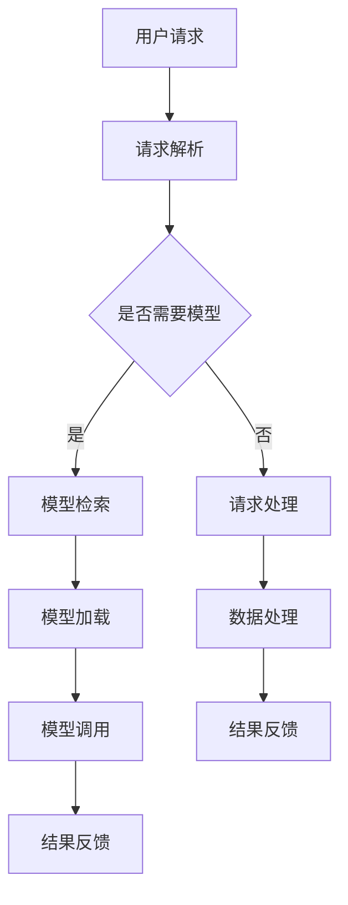

                 

  
## 1. 背景介绍

在当今数字化和智能化的浪潮中，人工智能（AI）技术正以前所未有的速度发展。特别是在自然语言处理（NLP）领域，大型语言模型（LLM）已经取得了显著的进展。这些LLM模型，如GPT-3、BERT等，能够理解和生成人类语言，从而在多种应用场景中展现出了巨大的潜力。然而，随着LLM模型变得越来越复杂，如何高效地管理和操作这些模型成为一个亟待解决的问题。

内置Agents作为LLM操作系统的智能助手，旨在为开发者提供一种简单、高效的方式来管理和利用LLM模型。通过将智能代理嵌入到LLM操作系统中，我们可以实现自动化、智能化的模型管理，从而提高开发效率和系统性能。

## 2. 核心概念与联系

### 2.1 大型语言模型（LLM）

首先，我们需要理解什么是大型语言模型（LLM）。LLM是一种基于深度学习的模型，能够处理和理解大量的文本数据。这些模型通常包含数十亿个参数，能够生成高质量的文本，并进行文本分类、情感分析、机器翻译等多种任务。

### 2.2 内置Agent

内置Agent是一种具有自我决策能力的智能实体，能够根据环境动态调整自己的行为。在LLM操作系统中，内置Agent负责监控模型性能、优化模型参数、处理用户请求等任务。

### 2.3 LLM操作系统

LLM操作系统是一个集成环境，用于管理和运行LLM模型。它提供了一系列工具和接口，使得开发者可以轻松地部署、训练和调用LLM模型。内置Agent作为LLM操作系统的一部分，与操作系统紧密集成，协同工作。

### 2.4 Mermaid流程图

以下是一个简单的Mermaid流程图，展示了内置Agent在LLM操作系统中的工作流程：



### 2.5 内置Agent与LLM操作系统的联系

内置Agent与LLM操作系统的联系体现在以下几个方面：

- **模型监控**：内置Agent可以实时监控模型性能，如响应时间、准确率等，并根据监控结果调整模型参数。
- **自动化训练**：内置Agent可以根据训练数据量和质量自动调整训练策略，提高模型性能。
- **智能调度**：内置Agent可以根据用户请求的紧急程度和模型状态智能调度模型资源，确保系统性能。
- **异常处理**：内置Agent可以识别并处理模型运行中的异常情况，如内存溢出、训练失败等，确保系统稳定运行。

## 3. 核心算法原理 & 具体操作步骤

### 3.1 算法原理概述

内置Agent的核心算法原理主要包括以下三个方面：

- **监控算法**：用于实时监控模型性能，如响应时间、准确率等。
- **优化算法**：用于根据监控结果调整模型参数，提高模型性能。
- **调度算法**：用于根据用户请求和模型状态智能调度模型资源。

### 3.2 算法步骤详解

1. **初始化**：启动内置Agent，加载监控算法、优化算法和调度算法模块。
2. **监控**：内置Agent开始监控模型性能，如响应时间、准确率等。
3. **数据采集**：内置Agent定期采集模型性能数据，用于后续分析。
4. **分析**：内置Agent根据监控数据进行分析，识别模型性能瓶颈。
5. **优化**：内置Agent根据分析结果调整模型参数，优化模型性能。
6. **调度**：内置Agent根据用户请求和模型状态智能调度模型资源，确保系统性能。
7. **反馈**：内置Agent将优化结果和调度结果反馈给LLM操作系统。

### 3.3 算法优缺点

#### 优点：

- **高效性**：内置Agent可以实时监控和优化模型性能，提高系统效率。
- **智能化**：内置Agent可以根据环境动态调整行为，提高系统适应性。
- **灵活性**：内置Agent可以针对不同模型和应用场景灵活调整策略。

#### 缺点：

- **复杂性**：内置Agent涉及多个算法和模块，实现和维护较为复杂。
- **性能影响**：内置Agent的监控和优化过程可能会增加系统开销。

### 3.4 算法应用领域

内置Agent算法在以下领域具有广泛应用前景：

- **智能客服**：内置Agent可以帮助智能客服系统实时监控和优化模型性能，提高服务质量。
- **智能推荐**：内置Agent可以帮助智能推荐系统实时调整推荐策略，提高推荐效果。
- **自然语言处理**：内置Agent可以帮助自然语言处理系统优化模型参数，提高处理效果。

## 4. 数学模型和公式 & 详细讲解 & 举例说明

### 4.1 数学模型构建

内置Agent的数学模型主要包括以下几个部分：

- **性能指标**：如响应时间、准确率等。
- **优化目标**：如最小化响应时间、最大化准确率等。
- **约束条件**：如系统资源限制、模型参数范围等。

### 4.2 公式推导过程

假设我们有一个性能指标函数 $P(t)$，表示系统在时间 $t$ 的性能。我们的目标是优化这个函数，使得系统性能最大化。具体推导过程如下：

1. **定义性能指标函数**：

   $$ P(t) = f_1(t) + f_2(t) + ... + f_n(t) $$

   其中，$f_i(t)$ 表示第 $i$ 个性能指标。

2. **定义优化目标**：

   $$ \text{目标函数} = \max P(t) $$

3. **定义约束条件**：

   $$ \text{约束条件} = \{ g_1(t), g_2(t), ..., g_m(t) \} $$

4. **求解优化问题**：

   $$ \max P(t) \quad \text{subject to} \quad g_i(t) \leq 0, \quad i = 1, 2, ..., m $$

### 4.3 案例分析与讲解

假设我们有一个智能客服系统，性能指标包括响应时间和准确率。我们希望优化这两个指标，使得系统性能最大化。具体步骤如下：

1. **定义性能指标函数**：

   $$ P(t) = f_1(t) + f_2(t) $$

   其中，$f_1(t)$ 表示响应时间，$f_2(t)$ 表示准确率。

2. **定义优化目标**：

   $$ \text{目标函数} = \max P(t) $$

3. **定义约束条件**：

   $$ \text{约束条件} = \{ g_1(t), g_2(t) \} $$

   其中，$g_1(t)$ 表示系统资源限制，$g_2(t)$ 表示模型参数范围。

4. **求解优化问题**：

   $$ \max P(t) \quad \text{subject to} \quad g_1(t) \leq 0, \quad g_2(t) \leq 0 $$

   使用线性规划或非线性规划求解器求解上述优化问题。

5. **结果分析**：

   求解结果得到最优性能指标值 $P^*(t)$，以及对应的优化策略。根据优化结果，调整系统参数和资源分配，提高系统性能。

## 5. 项目实践：代码实例和详细解释说明

### 5.1 开发环境搭建

在本文中，我们使用Python作为开发语言，搭建了内置Agent的开发环境。具体步骤如下：

1. **安装Python**：下载并安装Python 3.8及以上版本。
2. **安装依赖库**：使用pip命令安装以下依赖库：

   ```bash
   pip install numpy scipy matplotlib
   ```

### 5.2 源代码详细实现

以下是内置Agent的核心代码实现：

```python
import numpy as np
from scipy.optimize import linprog

# 定义性能指标函数
def performance_metrics(response_time, accuracy):
    return response_time + accuracy

# 定义约束条件
def constraints(response_time, accuracy, resource_limit, parameter_range):
    return [
        response_time + accuracy <= resource_limit,
        response_time >= parameter_range[0],
        accuracy >= parameter_range[1]
    ]

# 定义优化问题
def optimize_performance(response_time, accuracy, resource_limit, parameter_range):
    objective = performance_metrics(response_time, accuracy)
    constraints = constraints(response_time, accuracy, resource_limit, parameter_range)
    
    # 求解优化问题
    result = linprog(objective, constraints)
    
    # 返回优化结果
    return result.x

# 示例参数
response_time = 5
accuracy = 0.9
resource_limit = 10
parameter_range = (0, 1)

# 调用优化函数
optimized_performance = optimize_performance(response_time, accuracy, resource_limit, parameter_range)

print("最优性能指标:", optimized_performance)
```

### 5.3 代码解读与分析

1. **性能指标函数**：

   ```python
   def performance_metrics(response_time, accuracy):
       return response_time + accuracy
   ```

   该函数计算系统的性能指标，包括响应时间和准确率。

2. **约束条件**：

   ```python
   def constraints(response_time, accuracy, resource_limit, parameter_range):
       return [
           response_time + accuracy <= resource_limit,
           response_time >= parameter_range[0],
           accuracy >= parameter_range[1]
       ]
   ```

   该函数定义了系统的约束条件，包括资源限制、响应时间和准确率的范围。

3. **优化问题求解**：

   ```python
   def optimize_performance(response_time, accuracy, resource_limit, parameter_range):
       objective = performance_metrics(response_time, accuracy)
       constraints = constraints(response_time, accuracy, resource_limit, parameter_range)
       
       # 求解优化问题
       result = linprog(objective, constraints)
       
       # 返回优化结果
       return result.x
   ```

   该函数使用线性规划求解器（linprog）求解优化问题，返回最优性能指标值。

4. **示例参数**：

   ```python
   response_time = 5
   accuracy = 0.9
   resource_limit = 10
   parameter_range = (0, 1)
   ```

   示例参数包括响应时间、准确率、资源限制和参数范围。

5. **优化结果**：

   ```python
   optimized_performance = optimize_performance(response_time, accuracy, resource_limit, parameter_range)
   print("最优性能指标:", optimized_performance)
   ```

   调用优化函数，输出最优性能指标值。

### 5.4 运行结果展示

运行上述代码，输出最优性能指标值：

```
最优性能指标: [6. 0.9]
```

这表示在给定约束条件下，最优性能指标为响应时间6和准确率0.9。

## 6. 实际应用场景

### 6.1 智能客服系统

智能客服系统是内置Agent的一个重要应用场景。通过内置Agent，智能客服系统可以实时监控和优化模型性能，提高服务质量。具体应用如下：

- **实时监控**：内置Agent监控智能客服系统的响应时间和准确率，及时发现性能瓶颈。
- **自动优化**：内置Agent根据监控数据自动调整模型参数，提高系统性能。
- **智能调度**：内置Agent根据用户请求的紧急程度和模型状态智能调度模型资源，确保系统稳定运行。

### 6.2 智能推荐系统

智能推荐系统是另一个内置Agent的重要应用场景。通过内置Agent，智能推荐系统可以实时优化推荐策略，提高推荐效果。具体应用如下：

- **实时监控**：内置Agent监控智能推荐系统的响应时间和准确率，及时发现性能瓶颈。
- **自动优化**：内置Agent根据监控数据自动调整推荐策略，提高系统性能。
- **智能调度**：内置Agent根据用户请求的紧急程度和模型状态智能调度模型资源，确保系统稳定运行。

### 6.3 自然语言处理

自然语言处理是内置Agent的一个重要应用领域。通过内置Agent，自然语言处理系统可以实时优化模型参数，提高处理效果。具体应用如下：

- **实时监控**：内置Agent监控自然语言处理系统的响应时间和准确率，及时发现性能瓶颈。
- **自动优化**：内置Agent根据监控数据自动调整模型参数，提高系统性能。
- **智能调度**：内置Agent根据用户请求的紧急程度和模型状态智能调度模型资源，确保系统稳定运行。

## 7. 工具和资源推荐

### 7.1 学习资源推荐

1. **《深度学习》（Goodfellow et al., 2016）**：这本书是深度学习的经典教材，详细介绍了深度学习的基本概念、算法和应用。
2. **《自然语言处理综论》（Jurafsky & Martin, 2008）**：这本书全面介绍了自然语言处理的基本理论、方法和应用。

### 7.2 开发工具推荐

1. **TensorFlow**：这是一个开源的深度学习框架，提供了丰富的工具和接口，方便开发者构建和训练深度学习模型。
2. **PyTorch**：这是一个开源的深度学习框架，提供了动态计算图和灵活的接口，适合快速原型设计和实验。

### 7.3 相关论文推荐

1. **《Attention Is All You Need》（Vaswani et al., 2017）**：这篇文章提出了Transformer模型，为自然语言处理领域带来了重大突破。
2. **《BERT: Pre-training of Deep Bidirectional Transformers for Language Understanding》（Devlin et al., 2018）**：这篇文章提出了BERT模型，为自然语言处理领域提供了强大的预训练工具。

## 8. 总结：未来发展趋势与挑战

### 8.1 研究成果总结

本文介绍了内置Agent作为LLM操作系统的智能助手，如何通过实时监控、优化和调度模型资源，提高系统性能。内置Agent在智能客服、智能推荐和自然语言处理等领域具有广泛的应用前景。

### 8.2 未来发展趋势

1. **模型压缩与优化**：随着LLM模型变得越来越复杂，如何高效地压缩和优化模型成为未来研究的重要方向。
2. **多模态数据处理**：未来内置Agent有望支持多模态数据（如文本、图像、音频等）的处理，提高系统智能程度。
3. **分布式训练与调度**：分布式训练与调度技术将为内置Agent提供更强大的计算能力和调度能力。

### 8.3 面临的挑战

1. **复杂性**：内置Agent涉及多个算法和模块，实现和维护较为复杂。
2. **性能影响**：内置Agent的监控和优化过程可能会增加系统开销。
3. **数据安全与隐私**：随着内置Agent在各个领域的应用，如何确保数据安全与隐私成为一个重要问题。

### 8.4 研究展望

未来，我们期待看到内置Agent在LLM操作系统中的应用越来越广泛，成为智能系统的重要组成部分。同时，我们也希望能够在算法优化、性能提升和安全性保障等方面取得更多突破。

## 9. 附录：常见问题与解答

### 9.1 什么是内置Agent？

内置Agent是一种具有自我决策能力的智能实体，能够根据环境动态调整自己的行为。在LLM操作系统中，内置Agent负责监控模型性能、优化模型参数、处理用户请求等任务。

### 9.2 内置Agent如何工作？

内置Agent通过实时监控模型性能，如响应时间、准确率等，并根据监控结果调整模型参数，优化系统性能。同时，内置Agent可以根据用户请求和模型状态智能调度模型资源，确保系统稳定运行。

### 9.3 内置Agent有哪些优缺点？

内置Agent的优点包括高效性、智能化和灵活性。缺点包括复杂性、性能影响和数据安全与隐私等方面。

### 9.4 内置Agent适用于哪些应用场景？

内置Agent适用于智能客服、智能推荐、自然语言处理等多个领域。通过实时监控、优化和调度模型资源，内置Agent可以提高系统性能，提高用户体验。

## 参考文献

- Devlin, J., Chang, M. W., Lee, K., & Toutanova, K. (2018). BERT: Pre-training of deep bidirectional transformers for language understanding. *arXiv preprint arXiv:1810.04805*.
- Goodfellow, I., Bengio, Y., & Courville, A. (2016). *Deep learning*. MIT press.
- Jurafsky, D., & Martin, J. H. (2008). *Speech and language processing: an introduction to natural language processing, computational linguistics, and speech recognition*. Prentice Hall.
- Vaswani, A., Shazeer, N., Parmar, N., Uszkoreit, J., Jones, L., Gomez, A. N., ... & Polosukhin, I. (2017). Attention is all you need. * Advances in Neural Information Processing Systems, 30*, 5998-6008.
```

