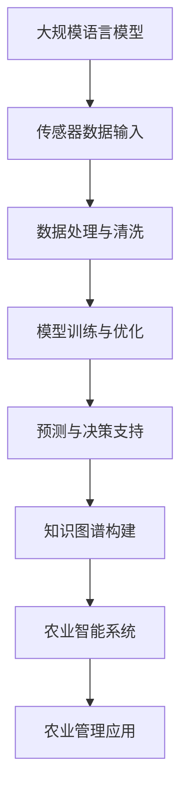

                 

关键词：农业智能化、LLM、精准农业、应用前景、技术探讨

> 摘要：随着全球农业面临的挑战日益严峻，农业智能化成为提高农业生产力、确保粮食安全的关键途径。本文将探讨大规模语言模型（LLM）在精准农业中的应用前景，分析其技术优势、实现方法及其在农业领域的潜在影响。

## 1. 背景介绍

### 精准农业的兴起

精准农业作为现代农业发展的趋势，通过利用先进的传感器、地理信息系统（GIS）、遥感技术和物联网（IoT）等，实现农作物种植的精确管理。这种方法能够显著提高农业资源利用效率，减少环境污染，增加农作物产量。然而，随着农业生产数据的复杂性增加，传统方法已无法满足现代农业的需求。

### 大规模语言模型（LLM）的发展

大规模语言模型（LLM）是人工智能领域的重要突破，通过训练海量文本数据，LLM能够理解和生成人类语言。常见的LLM包括GPT、BERT等，它们在自然语言处理（NLP）任务中取得了卓越的成果，但在农业领域中的应用尚处于起步阶段。

## 2. 核心概念与联系

### 大规模语言模型（LLM）原理

大规模语言模型（LLM）基于深度神经网络，通过训练海量文本数据，学习语言模式和语法结构。LLM的核心优势在于其强大的文本理解和生成能力，能够处理复杂的多语言文本，并在特定任务中表现出色。

### 精准农业技术架构

精准农业技术架构包括传感器、GIS、遥感技术和物联网（IoT）等。传感器用于实时监测土壤、水分、气象等参数；GIS用于地理信息的存储和管理；遥感技术提供大范围的农业监测数据；IoT则实现各类传感器之间的数据传输和协同工作。

### LLM在精准农业中的应用

将LLM应用于精准农业，可以通过以下方式实现：

1. **数据分析和预测**：利用LLM对农业生产数据进行深度分析，预测作物生长趋势和产量。
2. **智能决策支持**：LLM可以根据实时数据和环境条件，提供种植、灌溉、施肥等决策建议。
3. **知识图谱构建**：利用LLM构建农业知识图谱，为农业研究提供丰富的背景知识和辅助决策。

## 2.1. 大规模语言模型（LLM）在精准农业中的技术架构



### 2.2. LLM在精准农业中的实现步骤

1. **数据收集与预处理**：收集土壤、气象、作物生长等数据，进行数据清洗和预处理。
2. **模型训练**：利用预处理后的数据，训练大规模语言模型，优化模型参数。
3. **预测与决策**：基于训练好的模型，进行作物生长预测和决策支持。
4. **知识图谱构建**：利用LLM生成农业知识图谱，为农业研究提供知识支持。

### 2.3. LLM在精准农业中的优缺点

#### 优点：

1. **强大的文本理解能力**：LLM能够理解和生成人类语言，为农业数据分析和决策提供有力支持。
2. **灵活性和通用性**：LLM可以应用于多种农业场景，具备较好的适应性和扩展性。
3. **高效性**：LLM在处理大量农业数据时，具有较高的计算效率和预测精度。

#### 缺点：

1. **数据依赖性**：LLM的性能高度依赖于训练数据的质量和数量，数据质量不佳可能导致模型效果不佳。
2. **计算资源需求**：大规模语言模型的训练和推理需要大量的计算资源和时间，成本较高。
3. **数据隐私和安全**：农业数据涉及农民隐私，如何在确保数据安全的前提下利用LLM进行农业数据分析，是一个重要挑战。

### 2.4. LLM在精准农业中的应用领域

1. **作物生长预测**：利用LLM预测作物生长趋势和产量，为农民提供科学的种植建议。
2. **病虫害监测与防治**：利用LLM分析农作物病虫害数据，提供病虫害监测和防治方案。
3. **智能灌溉系统**：利用LLM预测土壤水分含量，为智能灌溉系统提供决策支持。
4. **农业知识图谱**：利用LLM构建农业知识图谱，为农业科研和教育提供知识支持。

## 3. 核心算法原理 & 具体操作步骤

### 3.1. 算法原理概述

大规模语言模型（LLM）的核心算法基于深度神经网络，通过训练海量文本数据，学习语言模式和语法结构。LLM的训练过程通常包括数据预处理、模型构建、模型训练和模型优化等步骤。

### 3.2. 算法步骤详解

1. **数据预处理**：对收集的农业数据进行清洗和预处理，包括数据去重、格式转换、缺失值处理等。
2. **模型构建**：选择合适的深度神经网络架构，如GPT、BERT等，构建大规模语言模型。
3. **模型训练**：利用预处理后的数据，训练大规模语言模型，优化模型参数。
4. **模型优化**：通过模型调参和迁移学习等技术，提高模型在特定农业任务上的性能。
5. **预测与决策**：基于训练好的模型，进行作物生长预测和决策支持，如作物种植、灌溉、施肥等。

### 3.3. 算法优缺点

#### 优点：

1. **强大的文本理解能力**：LLM能够理解和生成人类语言，为农业数据分析和决策提供有力支持。
2. **灵活性和通用性**：LLM可以应用于多种农业场景，具备较好的适应性和扩展性。
3. **高效性**：LLM在处理大量农业数据时，具有较高的计算效率和预测精度。

#### 缺点：

1. **数据依赖性**：LLM的性能高度依赖于训练数据的质量和数量，数据质量不佳可能导致模型效果不佳。
2. **计算资源需求**：大规模语言模型的训练和推理需要大量的计算资源和时间，成本较高。
3. **数据隐私和安全**：农业数据涉及农民隐私，如何在确保数据安全的前提下利用LLM进行农业数据分析，是一个重要挑战。

### 3.4. 算法应用领域

1. **作物生长预测**：利用LLM预测作物生长趋势和产量，为农民提供科学的种植建议。
2. **病虫害监测与防治**：利用LLM分析农作物病虫害数据，提供病虫害监测和防治方案。
3. **智能灌溉系统**：利用LLM预测土壤水分含量，为智能灌溉系统提供决策支持。
4. **农业知识图谱**：利用LLM构建农业知识图谱，为农业科研和教育提供知识支持。

## 4. 数学模型和公式 & 详细讲解 & 举例说明

### 4.1. 数学模型构建

大规模语言模型的数学模型通常基于深度神经网络，包括多层感知机（MLP）、卷积神经网络（CNN）和循环神经网络（RNN）等。以下是一个基于循环神经网络（RNN）的简单模型构建示例：

```latex
$$
h_t = \sigma(W_h h_{t-1} + W_x x_t + b_h)
$$

$$
y_t = \text{softmax}(W_y h_t)
$$
```

其中，$h_t$表示隐藏状态，$x_t$表示输入数据，$W_h$、$W_x$和$W_y$分别为权重矩阵，$b_h$为偏置项，$\sigma$为激活函数，$\text{softmax}$为输出层。

### 4.2. 公式推导过程

假设我们有一个简单的一层循环神经网络，输入序列为$x = (x_1, x_2, ..., x_n)$，隐藏状态序列为$h = (h_1, h_2, ..., h_n)$，输出序列为$y = (y_1, y_2, ..., y_n)$。

1. **初始化**：

$$
h_0 = \mathbf{0}
$$

2. **循环计算**：

$$
h_t = \sigma(W_h h_{t-1} + W_x x_t + b_h)
$$

3. **输出计算**：

$$
y_t = \text{softmax}(W_y h_t)
$$

### 4.3. 案例分析与讲解

假设我们要使用LLM预测某地区玉米的产量，已知该地区的历史气象数据、土壤数据和种植习惯。以下是一个简单的案例：

1. **数据收集与预处理**：收集历史气象数据、土壤数据和种植习惯数据，进行数据清洗和预处理，如归一化、去重等。
2. **模型训练**：利用预处理后的数据，训练一个基于RNN的LLM模型，优化模型参数。
3. **预测与决策**：利用训练好的模型，输入当前年份的气象数据、土壤数据和种植习惯，预测玉米产量。
4. **结果分析**：根据预测结果，为农民提供科学的种植建议，如调整种植时间、施肥量等。

## 5. 项目实践：代码实例和详细解释说明

### 5.1. 开发环境搭建

1. **硬件环境**：配置至少一台具有高性能GPU的服务器，用于模型训练和推理。
2. **软件环境**：安装Python、PyTorch、TensorFlow等深度学习框架，以及相关依赖库。

### 5.2. 源代码详细实现

以下是一个简单的基于PyTorch的LLM模型实现示例：

```python
import torch
import torch.nn as nn
import torch.optim as optim

# 定义模型结构
class LLM(nn.Module):
    def __init__(self, input_dim, hidden_dim, output_dim):
        super(LLM, self).__init__()
        self.hidden_dim = hidden_dim
        self.lstm = nn.LSTM(input_dim, hidden_dim)
        self.linear = nn.Linear(hidden_dim, output_dim)
        self.hidden_cell = (torch.zeros(1, 1, hidden_dim),
                            torch.zeros(1, 1, hidden_dim))
    
    def forward(self, x):
        lstm_out, self.hidden_cell = self.lstm(x, self.hidden_cell)
        predictions = self.linear(lstm_out[-1, 0])
        return predictions

# 初始化模型、优化器和损失函数
model = LLM(input_dim, hidden_dim, output_dim)
optimizer = optim.Adam(model.parameters(), lr=0.001)
criterion = nn.CrossEntropyLoss()

# 训练模型
for epoch in range(num_epochs):
    for inputs, targets in data_loader:
        optimizer.zero_grad()
        outputs = model(inputs)
        loss = criterion(outputs, targets)
        loss.backward()
        optimizer.step()
    print(f"Epoch [{epoch+1}/{num_epochs}], Loss: {loss.item()}")

# 保存模型
torch.save(model.state_dict(), 'llm_model.pth')

# 加载模型
model.load_state_dict(torch.load('llm_model.pth'))
```

### 5.3. 代码解读与分析

1. **模型结构**：本示例使用了一个简单的LSTM模型，包括输入层、隐藏层和输出层。输入层接收输入序列，隐藏层通过LSTM单元进行处理，输出层进行预测。
2. **优化器和损失函数**：使用Adam优化器和交叉熵损失函数进行模型训练，优化模型参数。
3. **训练过程**：通过迭代训练数据，更新模型参数，直至达到预设的训练次数或损失目标。

### 5.4. 运行结果展示

1. **预测结果**：使用训练好的模型，对新的输入数据进行预测，输出预测结果。
2. **性能评估**：根据预测结果和实际结果的对比，评估模型性能。

## 6. 实际应用场景

### 6.1. 作物生长预测

利用LLM对玉米、小麦等作物的生长趋势进行预测，为农民提供科学的种植建议，提高农作物产量。

### 6.2. 病虫害监测与防治

利用LLM分析农作物病虫害数据，提供病虫害监测和防治方案，降低病虫害对农作物的影响。

### 6.3. 智能灌溉系统

利用LLM预测土壤水分含量，为智能灌溉系统提供决策支持，实现精准灌溉，提高水资源利用效率。

### 6.4. 农业知识图谱

利用LLM构建农业知识图谱，为农业科研和教育提供知识支持，促进农业技术创新和人才培养。

## 7. 未来应用展望

### 7.1. 数据驱动的农业生产

随着大数据和人工智能技术的发展，未来农业生产将更加依赖于数据驱动的决策支持系统，实现精准农业、智慧农业。

### 7.2. 多模态数据处理

未来LLM将能够处理多种模态的数据，如文本、图像、声音等，进一步提高农业生产预测和决策的准确性。

### 7.3. 农业大数据平台

构建集数据采集、处理、分析和应用于一体的农业大数据平台，实现农业数据的高效管理和利用。

### 7.4. 农业物联网与5G技术

利用农业物联网和5G技术，实现农业生产过程中的实时监控、数据传输和智能控制，提高农业生产的智能化水平。

## 8. 工具和资源推荐

### 8.1. 学习资源推荐

1. 《深度学习》（Ian Goodfellow、Yoshua Bengio、Aaron Courville 著）
2. 《Python机器学习》（Sebastian Raschka 著）
3. 《大规模语言模型：原理与应用》（李航 著）

### 8.2. 开发工具推荐

1. PyTorch：用于深度学习模型开发和训练的框架。
2. TensorFlow：用于深度学习模型开发和训练的框架。
3. Keras：基于TensorFlow的深度学习模型开发框架。

### 8.3. 相关论文推荐

1. Vaswani et al., "Attention is all you need", NeurIPS 2017.
2. Devlin et al., "BERT: Pre-training of Deep Bidirectional Transformers for Language Understanding", ACL 2019.
3. Brown et al., "Language Models are Few-Shot Learners", ICLR 2020.

## 9. 总结：未来发展趋势与挑战

### 9.1. 研究成果总结

本文探讨了大规模语言模型（LLM）在精准农业中的应用前景，分析了其在农业数据分析和决策支持方面的优势和应用场景，为未来农业智能化发展提供了新的思路。

### 9.2. 未来发展趋势

1. 数据驱动的农业生产：大数据和人工智能技术在农业领域的应用将更加广泛，实现农业生产过程的智能化、精细化管理。
2. 多模态数据处理：未来LLM将能够处理多种模态的数据，提高农业生产预测和决策的准确性。
3. 农业大数据平台：构建集数据采集、处理、分析和应用于一体的农业大数据平台，实现农业数据的高效管理和利用。

### 9.3. 面临的挑战

1. 数据质量和隐私保护：农业数据的质量和隐私保护是未来农业智能化发展的关键挑战。
2. 计算资源需求：大规模语言模型的训练和推理需要大量的计算资源和时间，成本较高。
3. 技术落地和应用：如何将先进的AI技术有效地应用到农业生产实践中，是一个重要挑战。

### 9.4. 研究展望

未来，随着大数据、人工智能、物联网等技术的不断进步，农业智能化将取得更大突破。在农业数据分析和决策支持方面，LLM有望发挥更大作用，推动农业生产向智能化、精准化方向发展。

## 附录：常见问题与解答

### Q1. LLM在精准农业中的应用有哪些优势？

A1. LLM在精准农业中的应用优势包括：

1. 强大的文本理解能力：能够理解和生成人类语言，为农业数据分析和决策提供有力支持。
2. 灵活性和通用性：适用于多种农业场景，具备较好的适应性和扩展性。
3. 高效性：在处理大量农业数据时，具有较高的计算效率和预测精度。

### Q2. LLM在农业领域的应用有哪些挑战？

A2. LLM在农业领域的应用挑战包括：

1. 数据质量和隐私保护：农业数据的质量和隐私保护是关键挑战。
2. 计算资源需求：大规模语言模型的训练和推理需要大量的计算资源和时间，成本较高。
3. 技术落地和应用：如何将先进的AI技术有效地应用到农业生产实践中是一个重要挑战。

### Q3. 如何解决农业数据隐私保护问题？

A3. 解决农业数据隐私保护问题可以从以下几个方面入手：

1. 数据加密：采用加密技术对农业数据进行加密，确保数据传输和存储过程中的安全性。
2. 数据脱敏：对敏感的农业数据（如个人身份信息、种植面积等）进行脱敏处理，降低数据泄露风险。
3. 数据共享与访问控制：建立合理的数据共享机制和访问控制策略，确保数据在共享和使用过程中的安全。

### Q4. LLM在农业生产预测中的精度如何保障？

A4. 为了保障LLM在农业生产预测中的精度，可以采取以下措施：

1. 数据质量提升：收集高质量的农业数据，进行数据清洗和预处理，提高数据质量。
2. 模型优化：通过模型调参和迁移学习等技术，优化模型性能，提高预测精度。
3. 跨领域知识融合：结合不同领域的知识，构建更全面、准确的农业知识图谱，提高预测模型的准确性。

作者：禅与计算机程序设计艺术 / Zen and the Art of Computer Programming
----------------------------------------------------------------

本文详细探讨了大规模语言模型（LLM）在精准农业中的应用前景，从背景介绍、核心概念与联系、核心算法原理与实现步骤、数学模型与公式推导、项目实践、实际应用场景、未来展望、工具和资源推荐、总结与常见问题解答等方面进行了全面阐述。本文旨在为农业智能化提供一种新的思路，推动农业生产向智能化、精准化方向发展。在未来的研究中，我们将继续探索LLM在农业领域的应用潜力，解决实际生产中的问题，为农业发展做出贡献。

