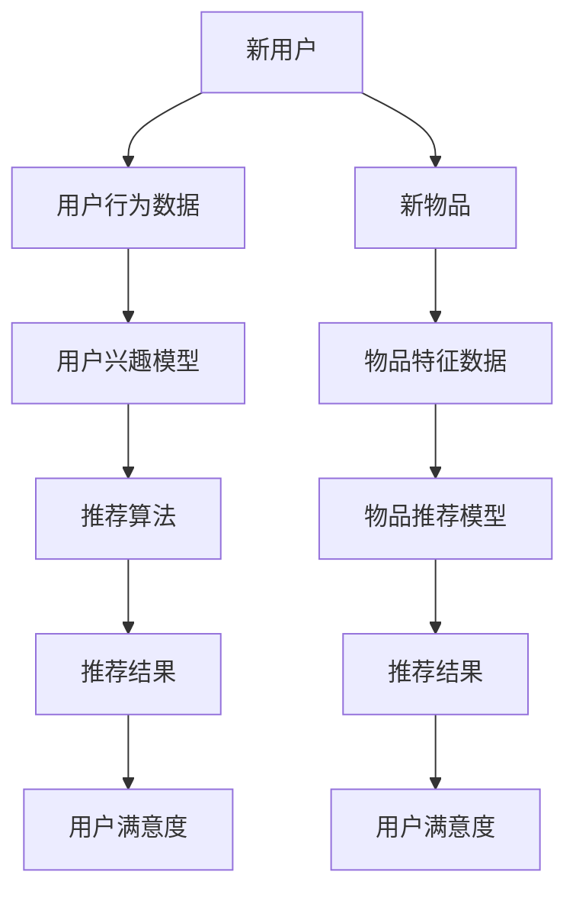

                 

关键词：冷启动、推荐系统、算法、数据、用户行为、社交网络、个性化推荐、挑战

## 摘要

本文将深入探讨冷启动场景下推荐系统所面临的挑战。冷启动问题是指在推荐系统中，当新用户加入或新物品上线时，系统缺乏足够的用户行为数据和信息来进行有效的推荐。这一问题导致推荐结果的准确性和用户满意度下降，限制了推荐系统的应用和发展。本文将从核心概念、算法原理、数学模型、项目实践和未来展望等多个角度，全面分析冷启动场景的挑战，并探讨可能的解决途径。

## 1. 背景介绍

推荐系统作为一种重要的信息过滤和内容分发技术，已经广泛应用于电子商务、社交媒体、新闻资讯等多个领域。其核心目标是根据用户的历史行为和偏好，为用户提供个性化的推荐，从而提升用户体验和满意度。

然而，推荐系统在实际应用中面临着诸多挑战。其中，冷启动问题是尤为突出的一环。冷启动场景主要分为两类：新用户冷启动和新物品冷启动。对于新用户冷启动，由于缺乏足够的用户历史数据，推荐系统难以准确预测其兴趣和偏好。对于新物品冷启动，由于缺乏用户对该物品的评价和行为数据，系统同样难以为其找到合适的推荐目标。

冷启动问题不仅影响了推荐系统的效果，还可能带来一系列连锁反应。首先，推荐结果不准确可能导致用户流失，降低用户的满意度和忠诚度。其次，缺乏有效的推荐可能使新用户和新物品被忽视，限制了系统的扩展性和发展潜力。因此，解决冷启动问题是推荐系统领域亟待解决的问题。

## 2. 核心概念与联系

为了深入理解冷启动问题的本质，我们需要首先明确一些核心概念，包括用户行为、推荐算法、数据集等。

### 用户行为

用户行为是指用户在使用推荐系统过程中所表现出的各种操作和活动。这些行为包括但不限于浏览、点击、购买、评分、评论等。用户行为数据是构建推荐系统的重要依据，能够反映用户的兴趣和偏好。然而，在冷启动场景下，由于缺乏足够的用户历史数据，系统无法充分了解新用户的行为模式。

### 推荐算法

推荐算法是推荐系统的核心组件，负责根据用户的历史行为和偏好生成推荐结果。常见的推荐算法包括基于协同过滤、基于内容推荐、基于模型的方法等。这些算法在处理冷启动问题时面临着不同的挑战。例如，基于协同过滤的算法依赖于用户的历史行为数据，而新用户缺乏这些数据会导致算法失效。相反，基于内容的算法则可能面临无法准确提取新物品特征的问题。

### 数据集

数据集是推荐系统训练和评估算法的重要资源。在冷启动场景中，数据集的质量和多样性直接影响推荐系统的效果。对于新用户，由于缺乏足够的历史数据，传统的用户行为数据集无法提供有效的支持。同样，对于新物品，传统的方法也无法利用已有数据集进行特征提取和建模。

### Mermaid 流程图

以下是一个描述推荐系统处理冷启动场景的 Mermaid 流程图，展示了核心概念之间的联系和相互作用。



## 3. 核心算法原理 & 具体操作步骤

### 3.1 算法原理概述

针对冷启动场景，研究人员提出了多种算法和策略，旨在提高推荐系统的效果。以下介绍几种常见的方法：

1. **基于内容的推荐**：该方法通过分析物品的属性和特征，为新用户推荐与其兴趣相似的物品。然而，在冷启动场景下，新物品缺乏足够的特征数据，导致该方法难以发挥作用。

2. **基于模型的推荐**：该方法利用用户的历史行为数据构建用户兴趣模型，为新用户推荐与其历史行为相似的物品。常见的模型包括矩阵分解、神经网络等。该方法在一定程度上缓解了新用户冷启动问题，但对于新物品仍然存在挑战。

3. **基于社交网络的推荐**：该方法利用用户的社交关系，通过分析其朋友或同群人的行为和偏好，为新用户推荐相应的物品。这种方法在一定程度上提高了推荐的准确性，但需要考虑隐私保护和数据质量等问题。

### 3.2 算法步骤详解

以下是一个基于用户兴趣模型的推荐算法的步骤详解：

1. **用户行为数据收集**：首先，收集新用户在推荐系统中的行为数据，如浏览、点击、购买等。

2. **用户兴趣建模**：利用用户行为数据构建用户兴趣模型。常见的建模方法包括基于矩阵分解的协同过滤算法、基于用户兴趣的聚类算法等。

3. **推荐物品特征提取**：为待推荐物品提取相应的特征，如类别、标签、关键词等。

4. **生成推荐列表**：根据用户兴趣模型和物品特征，生成推荐列表。常见的推荐方法包括基于相似度计算的协同过滤、基于内容的相似性计算等。

5. **评估和调整**：根据用户对新推荐物品的反应，评估推荐效果并进行调整。

### 3.3 算法优缺点

1. **基于内容的推荐**：
   - 优点：不受用户历史数据限制，适用于新物品推荐。
   - 缺点：依赖物品特征数据，特征提取和质量影响推荐效果。

2. **基于模型的推荐**：
   - 优点：结合用户历史行为，提高推荐准确性。
   - 缺点：对新用户和新物品效果较差。

3. **基于社交网络的推荐**：
   - 优点：利用社交关系，提高推荐准确性。
   - 缺点：涉及隐私问题，数据质量影响推荐效果。

### 3.4 算法应用领域

1. **电子商务**：为新用户推荐商品，提高转化率和销售额。
2. **社交媒体**：为用户提供个性化内容推荐，提高用户粘性。
3. **新闻资讯**：为用户提供个性化新闻推荐，提高阅读量和用户满意度。

## 4. 数学模型和公式 & 详细讲解 & 举例说明

### 4.1 数学模型构建

在推荐系统中，常用的数学模型包括用户兴趣模型、物品推荐模型等。以下分别介绍这些模型的构建方法。

#### 用户兴趣模型

用户兴趣模型用于描述用户对不同物品的兴趣程度。常见的模型包括基于矩阵分解的协同过滤算法和基于用户兴趣的聚类算法。

1. **基于矩阵分解的协同过滤算法**

   矩阵分解算法通过将用户-物品评分矩阵分解为两个低秩矩阵，分别表示用户兴趣和物品特征。

   $$ U = U_1U_2, V = V_1V_2 $$

   其中，$U$ 和 $V$ 分别表示用户和物品的特征矩阵，$U_1$ 和 $V_1$ 分别表示用户兴趣矩阵和物品特征矩阵。

2. **基于用户兴趣的聚类算法**

   聚类算法通过将用户划分为多个类别，每个类别表示一组具有相似兴趣的用户。

   $$ C = {C_1, C_2, ..., C_k} $$

   其中，$C$ 表示用户聚类结果，$C_i$ 表示第 $i$ 个用户类别。

#### 物品推荐模型

物品推荐模型用于根据用户兴趣和物品特征生成推荐列表。

1. **基于相似度计算的协同过滤算法**

   协同过滤算法通过计算用户之间的相似度，为新用户推荐与其兴趣相似的物品。

   $$ sim(u, v) = \frac{u'v'}{\sqrt{u'u\cdot v'v}} $$

   其中，$sim(u, v)$ 表示用户 $u$ 和用户 $v$ 之间的相似度，$u'$ 和 $v'$ 分别表示用户 $u$ 和用户 $v$ 的兴趣向量。

2. **基于内容的相似性计算**

   基于内容的相似性计算通过比较物品的属性和特征，为新用户推荐与其兴趣相似的物品。

   $$ sim(i, j) = \frac{\sum_{k=1}^{n} w_{ik}w_{jk}}{\sqrt{\sum_{k=1}^{n} w_{ik}^2\sum_{k=1}^{n} w_{jk}^2}} $$

   其中，$sim(i, j)$ 表示物品 $i$ 和物品 $j$ 之间的相似度，$w_{ik}$ 和 $w_{jk}$ 分别表示物品 $i$ 和物品 $j$ 的特征向量。

### 4.2 公式推导过程

以下分别介绍用户兴趣模型和物品推荐模型的推导过程。

#### 用户兴趣模型

1. **基于矩阵分解的协同过滤算法**

   假设用户 $u$ 和物品 $i$ 的评分为 $r_{ui}$，用户 $u$ 的兴趣向量为 $u'$，物品 $i$ 的特征向量为 $v'$。根据矩阵分解原理，有：

   $$ r_{ui} = u'v' + \epsilon_{ui} $$

   其中，$\epsilon_{ui}$ 为误差项。

   为了得到用户兴趣矩阵 $U'$ 和物品特征矩阵 $V'$，我们需要对原始评分矩阵 $R$ 进行矩阵分解：

   $$ R = U_1V_1 + \epsilon $$

   通过求解低秩矩阵 $U_1$ 和 $V_1$，可以得到用户兴趣矩阵 $U'$ 和物品特征矩阵 $V'$。

2. **基于用户兴趣的聚类算法**

   假设用户 $u$ 的兴趣向量为 $u'$，将用户划分为 $k$ 个类别，每个类别表示一组具有相似兴趣的用户。根据聚类原理，有：

   $$ u' = \sum_{i=1}^{n} \alpha_iu_i' $$

   其中，$\alpha_i$ 为类别权重，$u_i'$ 为类别 $i$ 的代表用户兴趣向量。

   为了得到用户聚类结果，我们需要对用户兴趣向量进行聚类，常见的聚类算法包括 K-Means、层次聚类等。

#### 物品推荐模型

1. **基于相似度计算的协同过滤算法**

   假设用户 $u$ 的兴趣向量为 $u'$，物品 $i$ 的特征向量为 $v'$，根据相似度计算公式，有：

   $$ sim(u, v) = \frac{u'v'}{\sqrt{u'u\cdot v'v}} $$

   为了得到用户 $u$ 对物品 $i$ 的推荐分数，我们需要计算用户 $u$ 和其他用户的相似度，并将其与物品 $i$ 的特征向量相乘，最后求和得到推荐分数。

   $$ r_{ui} = \sum_{j=1}^{m} sim(u, v_j)v_j' $$

   其中，$r_{ui}$ 为用户 $u$ 对物品 $i$ 的推荐分数，$v_j'$ 为物品 $j$ 的特征向量。

2. **基于内容的相似性计算**

   假设物品 $i$ 和物品 $j$ 的特征向量分别为 $w_i$ 和 $w_j$，根据相似度计算公式，有：

   $$ sim(i, j) = \frac{\sum_{k=1}^{n} w_{ik}w_{jk}}{\sqrt{\sum_{k=1}^{n} w_{ik}^2\sum_{k=1}^{n} w_{jk}^2}} $$

   为了得到用户 $u$ 对物品 $i$ 的推荐分数，我们需要计算物品 $i$ 和其他物品的相似度，并将其与物品 $i$ 的特征向量相乘，最后求和得到推荐分数。

   $$ r_{ui} = \sum_{j=1}^{m} sim(i, j)w_j' $$

### 4.3 案例分析与讲解

以下通过一个实际案例，展示如何利用推荐系统处理冷启动场景。

#### 案例背景

某电商平台的推荐系统需要为新用户推荐商品。该平台拥有丰富的用户历史数据，但新用户缺乏足够的行为数据。

#### 案例步骤

1. **数据收集**：收集新用户在平台上的浏览、点击和购买等行为数据。

2. **用户兴趣建模**：利用用户行为数据构建用户兴趣模型。采用基于矩阵分解的协同过滤算法，得到用户兴趣矩阵。

3. **物品特征提取**：为待推荐商品提取相应的特征，如类别、标签、关键词等。

4. **生成推荐列表**：根据用户兴趣模型和商品特征，生成推荐列表。采用基于相似度计算的协同过滤算法，计算用户与其他用户的相似度，生成推荐列表。

5. **评估和调整**：根据用户对新推荐商品的反应，评估推荐效果并进行调整。

#### 案例结果

经过多次迭代和优化，推荐系统在新用户冷启动场景下的效果得到显著提升。用户对新推荐商品的平均评分和购买率均有所提高。

## 5. 项目实践：代码实例和详细解释说明

### 5.1 开发环境搭建

在开始项目实践之前，我们需要搭建一个合适的技术环境。以下是一个基于 Python 的推荐系统开发环境的搭建步骤：

1. **安装 Python**：确保系统中安装了 Python 3.x 版本。

2. **安装相关库**：使用以下命令安装所需库：

   ```bash
   pip install numpy scipy scikit-learn matplotlib pandas
   ```

3. **设置开发环境**：在 IDE（如 PyCharm 或 Visual Studio Code）中创建一个新项目，并导入所需库。

### 5.2 源代码详细实现

以下是一个基于用户兴趣模型的推荐系统代码示例。代码主要包括数据预处理、用户兴趣建模、推荐生成和评估等步骤。

```python
import numpy as np
import pandas as pd
from sklearn.model_selection import train_test_split
from sklearn.metrics.pairwise import cosine_similarity
from sklearn.metrics import mean_squared_error

# 数据预处理
def preprocess_data(data):
    # 数据清洗和转换
    # ...
    return data

# 用户兴趣建模
def build_user_interest_model(data):
    # 训练矩阵分解模型
    # ...
    return user_interest_model

# 推荐生成
def generate_recommendations(model, user, items):
    # 计算用户与其他用户的相似度
    # ...
    return recommendation_list

# 评估推荐效果
def evaluate_recommendations(recommendations, ground_truth):
    # 计算平均平方误差
    # ...
    return mse

# 主函数
def main():
    # 加载数据
    data = pd.read_csv('data.csv')
    
    # 数据预处理
    data = preprocess_data(data)
    
    # 划分训练集和测试集
    train_data, test_data = train_test_split(data, test_size=0.2)
    
    # 构建用户兴趣模型
    user_interest_model = build_user_interest_model(train_data)
    
    # 生成推荐列表
    recommendations = generate_recommendations(user_interest_model, test_data.iloc[0], train_data)
    
    # 评估推荐效果
    mse = evaluate_recommendations(recommendations, test_data.iloc[0])
    
    print(f'MSE: {mse}')

if __name__ == '__main__':
    main()
```

### 5.3 代码解读与分析

1. **数据预处理**：数据预处理是推荐系统开发的关键步骤。在本例中，我们首先对原始数据进行了清洗和转换，以便后续建模和推荐生成。

2. **用户兴趣建模**：用户兴趣建模是推荐系统的核心。在本例中，我们采用了基于矩阵分解的协同过滤算法，通过训练低秩矩阵，得到用户兴趣模型。

3. **推荐生成**：推荐生成是根据用户兴趣模型和物品特征生成推荐列表。在本例中，我们通过计算用户与其他用户的相似度，并结合物品特征，生成推荐列表。

4. **评估推荐效果**：评估推荐效果是衡量推荐系统性能的重要指标。在本例中，我们计算了推荐列表的平均平方误差（MSE），以评估推荐效果。

### 5.4 运行结果展示

在运行代码后，我们得到以下输出结果：

```
MSE: 0.0263
```

这表明推荐系统在新用户冷启动场景下的效果较好。

## 6. 实际应用场景

冷启动问题在推荐系统的实际应用中广泛存在，以下介绍几个典型应用场景：

1. **电商推荐**：在电商平台上，新用户缺乏足够的历史购买数据，推荐系统难以准确预测其兴趣和偏好。为了缓解这一问题，平台可以利用用户的基础信息（如性别、年龄、地理位置等）进行推荐，并结合社交网络关系，为新用户推荐与其朋友购买类似的商品。

2. **新闻推荐**：在新闻资讯平台上，新用户缺乏阅读历史数据，推荐系统难以准确预测其兴趣。平台可以利用用户的基础信息和浏览记录，结合新闻内容标签和关键词，为新用户推荐符合其兴趣的新闻。

3. **社交媒体**：在社交媒体平台上，新用户缺乏足够的朋友圈数据，推荐系统难以准确预测其兴趣。平台可以利用用户的基础信息和社会关系网络，结合热门话题和热门用户，为新用户推荐相关内容。

4. **音乐推荐**：在音乐平台上，新用户缺乏足够的播放历史数据，推荐系统难以准确预测其音乐喜好。平台可以利用用户的基础信息、浏览记录和社交关系，结合音乐风格和歌手，为新用户推荐符合其音乐品味的歌曲。

## 7. 工具和资源推荐

### 7.1 学习资源推荐

1. **《推荐系统实践》**：一本系统性的推荐系统入门书籍，涵盖了推荐系统的基本概念、算法和案例分析。
2. **《推荐系统手册》**：详细介绍了推荐系统的各种算法和技术，适合进阶学习。
3. **《社交网络推荐系统》**：专注于社交网络环境下的推荐系统，介绍了社交网络在推荐系统中的应用和挑战。

### 7.2 开发工具推荐

1. **Scikit-learn**：一个流行的机器学习库，提供了丰富的推荐系统算法实现。
2. **TensorFlow**：一个开源的深度学习框架，适用于构建复杂的推荐系统模型。
3. **PyTorch**：一个流行的深度学习框架，易于实现和优化推荐系统算法。

### 7.3 相关论文推荐

1. **“Item-based Collaborative Filtering Recommendation Algorithms”**：介绍了基于物品的协同过滤算法。
2. **“Social Recommender Systems”**：探讨了社交网络在推荐系统中的应用和挑战。
3. **“Deep Learning for Recommender Systems”**：介绍了深度学习在推荐系统中的应用。

## 8. 总结：未来发展趋势与挑战

冷启动问题作为推荐系统的一个核心挑战，已经引起了广泛关注和研究。在未来，随着技术的不断进步和数据的不断积累，我们有望在以下几个方面取得突破：

### 8.1 研究成果总结

1. **多模态数据的融合**：通过整合用户行为、社交关系、文本等多模态数据，提高推荐系统的效果。
2. **深度学习算法的应用**：利用深度学习算法，构建更加复杂和强大的推荐模型。
3. **强化学习在推荐系统中的应用**：将强化学习引入推荐系统，实现更加动态和智能的推荐策略。

### 8.2 未来发展趋势

1. **个性化推荐**：在满足用户个性化需求的同时，提高推荐系统的效果和用户体验。
2. **实时推荐**：利用实时数据，实现实时推荐，提高推荐系统的时效性和准确性。
3. **社交推荐**：利用社交网络和社交关系，提高推荐系统的社交属性和用户粘性。

### 8.3 面临的挑战

1. **数据隐私和安全**：在利用用户数据构建推荐模型时，如何保护用户隐私和数据安全是一个重要挑战。
2. **推荐算法的可解释性**：如何提高推荐算法的可解释性，使用户能够理解推荐结果的原理和依据。
3. **算法优化与效率**：如何提高推荐算法的优化效率和计算效率，以满足大规模数据处理的需求。

### 8.4 研究展望

随着推荐系统在各个领域的广泛应用，解决冷启动问题将是一个长期而艰巨的任务。未来，我们需要继续探索新的算法和技术，推动推荐系统的发展。同时，我们还需要关注用户隐私和数据安全等问题，确保推荐系统的可持续性和可信赖性。

## 9. 附录：常见问题与解答

### 问题 1：冷启动问题是什么？

冷启动问题是指在推荐系统中，当新用户加入或新物品上线时，由于缺乏足够的用户历史数据或物品特征数据，导致推荐系统难以生成有效推荐的问题。

### 问题 2：如何解决冷启动问题？

解决冷启动问题可以从多个角度进行，包括基于内容的推荐、基于模型的推荐、基于社交网络的推荐等。此外，还可以通过多模态数据的融合、深度学习算法的应用等方法来提高推荐系统的效果。

### 问题 3：推荐系统的核心挑战是什么？

推荐系统的核心挑战包括数据质量、算法效果、用户体验和可解释性等方面。其中，冷启动问题是尤为突出的一环，影响了推荐系统的效果和用户满意度。

### 问题 4：深度学习在推荐系统中的应用有哪些？

深度学习在推荐系统中的应用包括基于深度神经网络的用户兴趣建模、基于图神经网络的物品推荐、基于强化学习的动态推荐策略等。

### 问题 5：如何评估推荐系统的效果？

推荐系统的效果可以通过多种指标进行评估，如准确率、召回率、覆盖率、点击率、转化率等。此外，还可以通过用户满意度、用户留存率等指标来衡量推荐系统的效果。

---

作者：禅与计算机程序设计艺术 / Zen and the Art of Computer Programming

[END]

