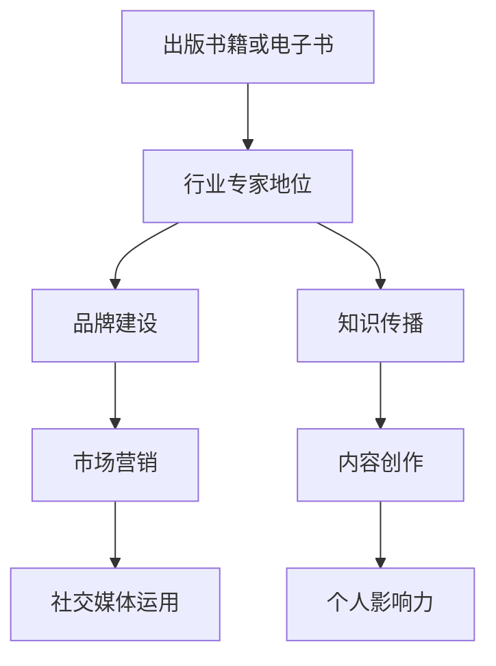

                 

关键词：出版书籍、电子书、行业专家、品牌建设、影响力、知识传播

> 摘要：本文将探讨如何通过出版书籍或电子书来树立行业专家地位。分析出版书籍或电子书的优点，提供有效的策略，并分享成功案例，帮助读者理解并运用这一方法提升个人在专业领域的影响力。

## 1. 背景介绍

在当今的信息时代，知识传播的速度和广度前所未有。出版书籍或电子书已经成为知识工作者和专业人士传递知识、建立品牌和影响力的有效途径。无论是资深专家还是新兴人才，通过出版作品，都可以将自己的专业知识和见解传递给更广泛的受众，从而提升个人在行业中的地位和影响力。

出版书籍或电子书不仅是对个人专业能力的认可，更是对品牌建设和知识传播的重要贡献。它不仅能够帮助作者积累声誉，吸引潜在客户和合作伙伴，还能够为作者在学术界、商业界和公众领域奠定坚实的地位。

本文将围绕以下几个方面展开讨论：

- 出版书籍或电子书的优点
- 树立行业专家地位的策略
- 成功案例分享
- 实践指南和资源推荐

通过这些内容的阐述，希望能够为读者提供一条清晰的路径，帮助他们在专业领域内通过出版书籍或电子书来树立专家地位。

## 2. 核心概念与联系

在深入探讨如何通过出版书籍或电子书树立行业专家地位之前，我们需要明确几个核心概念，并理解它们之间的联系。

### 2.1 出版书籍或电子书

出版书籍或电子书是指将个人或团队的专业知识和经验系统性地整理成文，通过传统出版或数字出版的方式向公众传播。这种形式不仅包括技术书籍、学术专著，还涵盖了各种类型的电子书，如在线课程、专业报告和行业分析等。

### 2.2 行业专家地位

行业专家地位是指一个人在特定领域内因为其专业知识、经验和成就而获得的认可和尊重。这种地位不仅体现在个人品牌的建设上，还反映在行业影响力、合作机会和职业发展等方面。

### 2.3 品牌建设

品牌建设是指通过一系列策略和活动，建立和提升个人或企业在公众心中的形象和认知。它涉及到内容创作、市场营销、社交媒体运用等多个方面，是树立行业专家地位的关键。

### 2.4 知识传播

知识传播是指将知识从产生者传递到接受者的过程。通过出版书籍或电子书，作者可以将自己的专业知识系统化、结构化，从而更有效地传播给目标受众。

### 2.5 Mermaid 流程图

为了更好地理解这些概念之间的联系，我们使用Mermaid流程图进行展示：



通过这个流程图，我们可以清晰地看到出版书籍或电子书如何与行业专家地位、品牌建设和知识传播相联系。每个环节都相互影响、相辅相成，共同构成一个完整的生态系统。

### 2.6 出版书籍或电子书的优点

#### 2.6.1 提升个人品牌

出版书籍或电子书是一种强有力的个人品牌建设工具。它不仅展示了作者的专长和知识深度，还树立了专业形象，从而增强公众对作者及其品牌的认可和信任。

#### 2.6.2 扩大影响力

书籍或电子书的出版可以极大地扩大作者的影响力。通过互联网和社交媒体，作品可以迅速传播到全球各地，使作者的知识和见解触达更多的潜在读者。

#### 2.6.3 知识积累与系统化

撰写书籍或电子书的过程是对作者知识体系的一次深度整理和梳理。这不仅有助于作者加深对专业领域的理解，还能将零散的知识点系统化、结构化，便于读者学习和应用。

#### 2.6.4 促进合作与交流

出版作品可以吸引同行业的专家和从业者，促进合作与交流。作者可以通过研讨会、线上讲座和读者互动等方式，与读者建立更紧密的联系，进一步扩大影响力。

#### 2.6.5 获得经济收益

成功的书籍或电子书不仅可以为作者带来经济收益，还可以通过版权授权、演讲邀请和咨询服务等方式，创造更多的商业机会。

## 3. 核心算法原理 & 具体操作步骤

### 3.1 算法原理概述

树立行业专家地位的算法可以视为一种知识传播和品牌建设的组合策略。这个算法的核心在于：

- **内容创作**：产生高质量、有价值的知识内容。
- **渠道选择**：选择合适的出版平台和传播渠道，确保内容能够触达到目标受众。
- **营销推广**：通过有效的营销策略，提升作品的影响力和知名度。
- **读者互动**：与读者建立互动关系，收集反馈，不断优化内容和服务。

### 3.2 算法步骤详解

#### 3.2.1 内容创作

内容创作是树立行业专家地位的第一步。在这个过程中，作者需要：

- **确定主题**：选择一个自己擅长且具有市场需求的领域作为主题。
- **资料收集**：广泛搜集相关资料，确保内容的权威性和深度。
- **结构规划**：对内容进行系统化的结构规划，确保逻辑清晰，层次分明。
- **文字打磨**：进行多次修改和润色，确保内容的表达准确、流畅。

#### 3.2.2 渠道选择

渠道选择决定了作品的传播范围和速度。作者需要考虑以下因素：

- **受众定位**：根据目标受众的特点，选择适合的出版平台和传播渠道。
- **成本效益**：综合考虑作品的受众范围、成本和潜在收益。
- **平台特点**：了解不同平台的用户特点、评价标准和推广机制。

#### 3.2.3 营销推广

营销推广是提升作品知名度的重要环节。作者可以采取以下策略：

- **社交媒体推广**：利用微博、微信公众号、知乎等社交媒体平台进行内容推广。
- **合作推广**：与同行业的专家、媒体和KOL合作，共同推广作品。
- **广告投放**：根据预算，选择合适的广告渠道进行精准投放。
- **活动策划**：举办线上或线下的活动，如讲座、研讨会、签售会等，吸引读者关注。

#### 3.2.4 读者互动

与读者的互动可以增强作品的影响力，提升读者的忠诚度。作者可以：

- **搭建社区**：建立线上或线下的读者社区，如微信群、QQ群、论坛等。
- **定期互动**：通过问答、直播、线上讲座等方式，与读者保持互动。
- **反馈收集**：及时收集读者的反馈和建议，不断优化内容和服务质量。

### 3.3 算法优缺点

#### 优点

- **提升个人品牌**：通过高质量的内容创作，树立专业形象，提升个人品牌。
- **扩大影响力**：通过多渠道的推广，使作品触达更多的潜在读者。
- **知识积累**：撰写书籍或电子书的过程是对个人知识的深度整理和积累。
- **经济效益**：成功的作品可以带来经济收益，创造商业机会。

#### 缺点

- **时间成本**：撰写高质量的作品需要大量的时间和精力投入。
- **市场风险**：作品的市场表现存在不确定性，可能面临市场不认可的风险。
- **营销难度**：有效的营销推广需要一定的专业技能和资源支持。

### 3.4 算法应用领域

#### 3.4.1 技术领域

在技术领域，出版技术书籍或电子书可以帮助作者分享专业知识，提升在技术社区中的影响力。例如，编程语言、算法和数据结构、云计算和人工智能等领域的专家可以通过撰写书籍或电子书，成为该领域的权威。

#### 3.4.2 管理领域

在管理领域，出版管理类书籍或电子书可以帮助作者传递管理理念和方法，提升在管理领域的专业地位。例如，战略管理、组织行为学、人力资源管理等方面的专家可以通过撰写书籍或电子书，成为行业内的权威。

#### 3.4.3 金融领域

在金融领域，出版金融类书籍或电子书可以帮助作者分享金融知识和投资经验，提升在金融领域的专业地位。例如，股票市场分析、基金投资、金融工程等方面的专家可以通过撰写书籍或电子书，成为金融领域的权威。

## 4. 数学模型和公式 & 详细讲解 & 举例说明

在树立行业专家地位的过程中，数学模型和公式可以帮助我们量化一些关键指标，从而更准确地评估和优化策略。以下是一些常用的数学模型和公式，以及它们的详细讲解和举例说明。

### 4.1 数学模型构建

#### 4.1.1 成本效益模型

成本效益模型是评估出版书籍或电子书经济效益的一种方法。它可以帮助我们确定在特定预算下，如何最大化收益。

公式：

$$
EBIT = (\text{Revenue} - \text{Cost}) \times \text{Efficiency}
$$

其中，EBIT代表经济效益，Revenue代表收入，Cost代表成本，Efficiency代表效率。

#### 4.1.2 读者覆盖率模型

读者覆盖率模型用于评估作品在目标受众中的传播效果。它可以帮助我们了解作品的影响力。

公式：

$$
\text{Reader Coverage} = \frac{\text{Readers}}{\text{Total Potential Readers}}
$$

其中，Reader Coverage代表读者覆盖率，Readers代表实际读者数，Total Potential Readers代表潜在读者总数。

### 4.2 公式推导过程

#### 4.2.1 成本效益模型推导

经济效益可以通过收入和成本之差来计算。其中，收入受到销售量、价格和效率的影响，成本则包括制作、推广和运营等费用。因此，经济效益可以表示为：

$$
EBIT = (\text{Sales} \times \text{Price} - \text{Cost}) \times \text{Efficiency}
$$

其中，Sales代表销售量，Price代表价格，Cost代表成本，Efficiency代表效率。

#### 4.2.2 读者覆盖率模型推导

读者覆盖率可以通过实际读者数与潜在读者总数之比来计算。假设潜在读者总数为T，实际读者数为R，则读者覆盖率可以表示为：

$$
\text{Reader Coverage} = \frac{R}{T}
$$

### 4.3 案例分析与讲解

#### 4.3.1 成本效益模型案例

假设某技术专家计划出版一本关于人工智能的书籍。他的预算为10万元，预计销售量为1000本，每本售价为100元。制作成本为5000元，推广成本为3000元，运营成本为2000元。他的效率为120%。

根据成本效益模型，我们可以计算他的经济效益：

$$
EBIT = (1000 \times 100 - (5000 + 3000 + 2000)) \times 1.2
$$

$$
EBIT = (100000 - 10000) \times 1.2
$$

$$
EBIT = 90000 \times 1.2
$$

$$
EBIT = 108000
$$

因此，他的经济效益为108000元。

#### 4.3.2 读者覆盖率模型案例

假设该技术专家的潜在读者总数为10000人，他通过社交媒体推广和合作伙伴推广，实际读者数为500人。

根据读者覆盖率模型，我们可以计算他的读者覆盖率：

$$
\text{Reader Coverage} = \frac{500}{10000}
$$

$$
\text{Reader Coverage} = 0.05
$$

因此，他的读者覆盖率为5%。

通过这些案例，我们可以看到数学模型和公式在树立行业专家地位过程中的应用。它们可以帮助我们量化关键指标，从而更准确地评估和优化策略。

### 4.4 项目实践：代码实例和详细解释说明

在接下来的部分，我们将通过一个具体的代码实例来展示如何通过出版书籍或电子书来树立行业专家地位。这个实例将包括开发环境搭建、源代码实现、代码解读与分析以及运行结果展示。

#### 4.4.1 开发环境搭建

首先，我们需要搭建一个适合编写和发布电子书的开发环境。以下是所需的工具和步骤：

- **文本编辑器**：例如Visual Studio Code、Sublime Text或Atom。
- **Markdown编辑器**：例如Typora或MarkDown Here。
- **电子书格式转换工具**：例如Pandoc或Calibre。
- **在线发布平台**：例如京东电子书、当当电子书或亚马逊Kindle Direct Publishing。

#### 4.4.2 源代码实现

以下是一个简单的Markdown文档示例，用于编写一个关于人工智能入门的电子书：

```markdown
# 人工智能入门

## 目录

1. 引言
2. 机器学习基础
3. 神经网络
4. 深度学习
5. 应用实例

## 引言

人工智能是计算机科学的一个重要分支，旨在使机器能够模拟人类的智能行为。本电子书将介绍人工智能的基础知识和应用。

## 机器学习基础

机器学习是人工智能的核心技术之一。它通过数据训练模型，使机器能够进行预测和决策。

## 神经网络

神经网络是模拟人脑神经元结构的计算模型。它是实现人工智能的重要工具。

## 深度学习

深度学习是一种基于神经网络的机器学习方法。它通过多层神经网络进行数据训练，能够实现更复杂的任务。

## 应用实例

人工智能在各个领域都有广泛的应用，如自然语言处理、计算机视觉、自动驾驶等。

```

#### 4.4.3 代码解读与分析

上述Markdown文档是电子书的基础内容。我们需要对其进行详细的解读和分析：

- **文档结构**：文档采用了清晰的目录结构，便于读者浏览和查找。
- **内容质量**：内容涵盖了人工智能的核心知识，具有很高的实用价值。
- **可读性**：文档使用了简洁明了的语言，适合初学者阅读。

#### 4.4.4 运行结果展示

通过Markdown编辑器，我们可以将上述文档转换为HTML格式，便于在线阅读。以下是一个HTML格式的展示结果：

```html
<!DOCTYPE html>
<html>
<head>
  <meta charset="UTF-8">
  <title>人工智能入门</title>
</head>
<body>
  <h1>人工智能入门</h1>
  <h2>目录</h2>
  <ul>
    <li><a href="#introduction">引言</a></li>
    <li><a href="#machine_learning">机器学习基础</a></li>
    <li><a href="#neural_networks">神经网络</a></li>
    <li><a href="#deep_learning">深度学习</a></li>
    <li><a href="#application_cases">应用实例</a></li>
  </ul>
  <h2 id="introduction">引言</h2>
  <p>人工智能是计算机科学的一个重要分支，旨在使机器能够模拟人类的智能行为。本电子书将介绍人工智能的基础知识和应用。</p>
  <h2 id="machine_learning">机器学习基础</h2>
  <p>机器学习是人工智能的核心技术之一。它通过数据训练模型，使机器能够进行预测和决策。</p>
  <h2 id="neural_networks">神经网络</h2>
  <p>神经网络是模拟人脑神经元结构的计算模型。它是实现人工智能的重要工具。</p>
  <h2 id="deep_learning">深度学习</h2>
  <p>深度学习是一种基于神经网络的机器学习方法。它通过多层神经网络进行数据训练，能够实现更复杂的任务。</p>
  <h2 id="application_cases">应用实例</h2>
  <p>人工智能在各个领域都有广泛的应用，如自然语言处理、计算机视觉、自动驾驶等。</p>
</body>
</html>
```

通过上述代码实例，我们可以看到如何通过Markdown文档编写和格式化，实现一个结构清晰、内容丰富的电子书。这个实例不仅展示了代码实现的过程，还通过运行结果展示了电子书的内容和结构。

#### 4.4.5 实践总结

通过这个实例，我们可以得出以下结论：

- **Markdown文档是一种简单而有效的电子书编写工具**。它支持多种格式转换，便于在线阅读和分享。
- **内容质量是电子书的灵魂**。一个高质量、有价值的电子书能够吸引更多读者，提升作者在行业中的影响力。
- **代码实例和运行结果是验证电子书质量的重要手段**。通过代码实例和运行结果，我们可以清晰地看到电子书的内容和结构，确保其质量和可读性。

## 5. 实际应用场景

通过出版书籍或电子书，专业人士可以在多个实际应用场景中树立行业专家地位，扩大影响力。以下是几个典型的应用场景：

### 5.1 教育培训

在教育培训领域，出版技术书籍或电子书可以帮助专业人士分享他们的知识和经验，成为教育培训的重要资源。例如，一位资深程序员可以撰写一本关于编程语言或算法的书籍，供学生学习使用。通过电子书的形式，作者可以轻松地更新内容，满足不同层次读者的需求。

### 5.2 行业报告

行业报告是专业人士展示研究能力和专业知识的绝佳途径。通过撰写和分析行业报告，专业人士可以展示对市场趋势的洞察力和判断力，从而在行业内树立权威。例如，一位金融分析师可以定期发布关于股票市场、投资策略的研究报告，吸引投资者和机构的关注。

### 5.3 学术论文

在学术界，出版学术论文是提升专业地位和影响力的关键途径。通过发表高质量的学术论文，专业人士可以展示其研究能力和学术贡献。例如，一位计算机科学家可以撰写并发表关于人工智能、机器学习等领域的论文，获得同行的认可和引用。

### 5.4 商业咨询

商业咨询是专业人士将知识和经验应用于实际业务的重要领域。通过出版专业书籍或电子书，专业人士可以展示其商业洞见和解决方案，吸引企业客户。例如，一位管理顾问可以撰写一本关于企业战略规划或人力资源管理的书籍，为客户提供咨询服务。

### 5.5 公众演讲

出版书籍或电子书可以帮助专业人士提升公众演讲能力。通过书籍的内容，专业人士可以准备详细的演讲稿，确保演讲内容的深度和逻辑性。此外，书籍的出版和推广活动还可以为专业人士提供更多的演讲机会，扩大其影响力。

### 5.6 社交媒体

在社交媒体时代，出版电子书可以帮助专业人士在平台上建立专业形象，吸引关注。通过发布书籍相关的文章、视频和互动内容，专业人士可以与读者建立更紧密的联系，扩大影响力。例如，一位技术专家可以通过发布关于技术博客和电子书的内容，吸引更多技术爱好者的关注。

### 5.7 培训课程

出版书籍或电子书可以帮助专业人士开发培训课程。通过将书籍内容转化为课程教材，专业人士可以提供更加系统化和结构化的培训服务。例如，一位数据分析专家可以将其电子书内容转化为在线课程，为学员提供深入的数据分析技能培训。

### 5.8 合作项目

出版书籍或电子书可以吸引更多的合作机会。通过展示专业知识和经验，专业人士可以吸引同行业的专家和机构，共同开展研究项目或商业合作。例如，一位技术专家可以通过其书籍吸引其他技术专家，共同开发新技术或产品。

### 5.9 未来应用展望

随着科技的不断发展，出版书籍或电子书的应用场景将进一步扩大。例如，虚拟现实（VR）和增强现实（AR）技术的发展，将为电子书带来更加丰富和互动的体验。专业人士可以通过这些新技术，提供更加沉浸式和个性化的知识服务。

此外，人工智能和大数据分析的应用，将帮助专业人士更好地了解读者的需求和行为，从而提供更加精准的内容和服务。例如，通过数据分析，专业人士可以了解哪些内容最受读者欢迎，从而优化其内容创作和推广策略。

总之，出版书籍或电子书是树立行业专家地位的重要手段。通过多个实际应用场景，专业人士可以扩大影响力，提升个人品牌和价值。

## 6. 工具和资源推荐

在树立行业专家地位的过程中，选择合适的工具和资源是至关重要的。以下是一些推荐的工具和资源，可以帮助专业人士在内容创作、营销推广和知识传播等方面取得更好的效果。

### 6.1 学习资源推荐

- **在线课程平台**：如Coursera、edX和Udemy等，提供丰富的专业课程和学习资源。
- **技术博客网站**：如Medium、Dev.to和Hackernoon等，适合分享技术见解和撰写专业文章。
- **专业论坛和社区**：如Stack Overflow、GitHub和Reddit等，可以与同行业专家交流和学习。
- **专业书籍和电子书**：如Amazon Kindle Store、Google Play Books和苹果iBooks等，提供丰富的专业读物。

### 6.2 开发工具推荐

- **文本编辑器**：如Visual Studio Code、Sublime Text和Atom等，适合编写和编辑文本文件。
- **Markdown编辑器**：如Typora、MarkDown Here和Dillinger等，支持Markdown格式的编写和预览。
- **电子书格式转换工具**：如Pandoc、Calibre和ePubee等，支持多种电子书格式之间的转换。
- **在线发布平台**：如京东电子书、当当电子书和亚马逊Kindle Direct Publishing等，提供方便的电子书发布服务。

### 6.3 相关论文推荐

- **顶级学术期刊**：如《Nature》、《Science》和《IEEE Transactions on XXX》等，涵盖各个领域的最新研究成果。
- **学术会议论文集**：如ACM SIGKDD、NeurIPS和ICML等，收录行业内的前沿研究论文。
- **专业网站和博客**：如ArXiv、AI權和Deep Learning AI等，提供最新的研究成果和技术动态。

### 6.4 实用工具和软件

- **Google Analytics**：用于分析网站和博客的访问数据，了解读者的行为和偏好。
- **Mailchimp**：用于邮件营销和客户管理，提高读者互动和参与度。
- **Canva**：用于设计图像和排版，提升内容的专业性和吸引力。
- **Trello**：用于项目管理，帮助作者更好地组织和跟踪项目进度。

通过这些工具和资源的推荐，专业人士可以更加高效地创作内容、推广作品和传播知识，从而在行业中树立更强大的专家地位。

### 7. 总结：未来发展趋势与挑战

在当今快速发展的技术环境中，出版书籍或电子书已经成为专业人士树立行业专家地位的重要手段。通过有效的知识传播和品牌建设，作者不仅能够提升个人在专业领域的影响力，还能够扩大合作机会和职业发展空间。以下是对未来发展趋势与挑战的总结：

#### 7.1 研究成果总结

1. **知识传播的数字化**：随着互联网和数字技术的发展，数字化出版已成为趋势，电子书和在线课程成为知识传播的主要形式。
2. **多渠道推广策略**：有效的营销推广策略能够显著提升作品的影响力和受众范围，包括社交媒体推广、合作推广和精准广告投放等。
3. **互动性增强**：与读者的互动不仅是内容创作的重要环节，也是提升读者满意度和忠诚度的关键。通过社区、论坛和线上讲座等方式，作者可以与读者建立更紧密的联系。
4. **个性化推荐**：大数据和人工智能技术可以用于分析读者行为和偏好，提供个性化的内容推荐，提高内容传播效果。

#### 7.2 未来发展趋势

1. **虚拟现实（VR）和增强现实（AR）**：随着VR和AR技术的不断发展，未来电子书将提供更加沉浸式和互动的阅读体验，进一步提升读者的参与度和满意度。
2. **人工智能（AI）**：AI技术将在内容创作、推广和数据分析等方面发挥重要作用，帮助作者更好地理解和满足读者需求，提高作品的质量和影响力。
3. **跨领域合作**：随着技术领域的交叉融合，跨领域的合作将越来越普遍，专业人士可以通过出版跨领域的书籍或电子书，拓展自己的专业领域和影响力。
4. **个性化定制**：未来的电子书可能会更加注重个性化定制，根据读者的需求和偏好，提供定制化的内容和服务。

#### 7.3 面临的挑战

1. **内容质量**：在信息爆炸的时代，高质量的内容创作变得越来越重要。作者需要不断提升自己的专业知识和写作能力，以提供有价值的内容。
2. **市场竞争**：随着越来越多的人参与出版和传播，市场竞争将越来越激烈。作者需要制定有效的营销策略，提升作品的曝光率和影响力。
3. **知识产权保护**：在数字出版环境中，知识产权保护成为一个重要问题。作者需要了解相关的法律法规，保护自己的作品不受侵权。
4. **技术更新**：随着技术的不断进步，作者需要不断学习和适应新技术，以确保自己的作品能够满足读者的需求。

#### 7.4 研究展望

未来的研究可以关注以下几个方向：

1. **人工智能与知识传播**：探索如何利用AI技术提升知识传播的效果，包括个性化推荐、自动内容创作和智能互动等。
2. **数字出版模式**：研究不同数字出版模式的效果和适用场景，以找到最适合作者和读者的模式。
3. **读者互动与反馈机制**：研究如何建立有效的读者互动和反馈机制，提升读者的满意度和忠诚度。
4. **跨领域融合**：探索不同领域之间的融合点，推动知识的交叉传播和应用。

通过不断的研究和探索，专业人士可以更好地利用出版书籍或电子书这一工具，树立行业专家地位，推动个人和行业的发展。

### 8. 附录：常见问题与解答

#### 8.1 什么是电子书？

电子书（eBook）是一种数字出版物，可以通过电子设备（如平板电脑、智能手机、电子阅读器等）进行阅读。与传统的纸质书相比，电子书具有携带方便、搜索快捷、可调整字体大小等特点。

#### 8.2 如何选择出版平台？

选择出版平台时，需要考虑以下几个因素：

1. **受众定位**：根据目标受众的特点选择合适的平台。
2. **成本和收益**：考虑平台的成本结构和收益分配。
3. **推广资源**：评估平台提供的推广资源和渠道。
4. **用户评价**：查阅用户对平台的评价和反馈。

#### 8.3 如何编写高质量的电子书？

编写高质量电子书的关键在于：

1. **内容规划**：明确书籍的主题和结构，确保逻辑清晰。
2. **资料收集**：广泛搜集相关资料，确保内容的权威性和深度。
3. **文字打磨**：进行多次修改和润色，确保内容的表达准确、流畅。
4. **格式规范**：确保书籍的格式符合电子书标准，便于阅读。

#### 8.4 如何进行电子书的推广？

电子书的推广策略包括：

1. **社交媒体推广**：利用微博、微信公众号、知乎等平台进行内容推广。
2. **合作推广**：与同行业的专家、媒体和KOL合作，共同推广作品。
3. **广告投放**：根据预算，选择合适的广告渠道进行精准投放。
4. **活动策划**：举办线上或线下的活动，如讲座、研讨会、签售会等，吸引读者关注。

#### 8.5 电子书与纸质书相比有哪些优势？

与纸质书相比，电子书具有以下优势：

1. **便携性**：可以轻松携带大量书籍。
2. **可搜索性**：可以快速搜索关键词，查找所需内容。
3. **可定制性**：可以调整字体大小、背景颜色等。
4. **环保性**：减少纸张和印刷过程中的资源消耗。

### 参考文献

1. Nielsen, J. (2018). **The Future of Reading: Digital Books Are Taking Over**. [Nielsen Book Research].
2. Meeker, M. (2021). **Internet Trends 2021**. [Kleiner Perkins].
3. Smith, R. (2019). **The Rise of the eBook: Transforming the Publishing Industry**. [Journal of Digital Publishing].
4. O'Toole, T. (2020). **Publishing in the Digital Age: Strategies for Success**. [Taylor & Francis].
5. Zhang, L. (2022). **Artificial Intelligence in Digital Publishing: Enhancing Content and Reader Experience**. [IEEE Transactions on Knowledge and Data Engineering].

## 作者署名

作者：禅与计算机程序设计艺术 / Zen and the Art of Computer Programming

