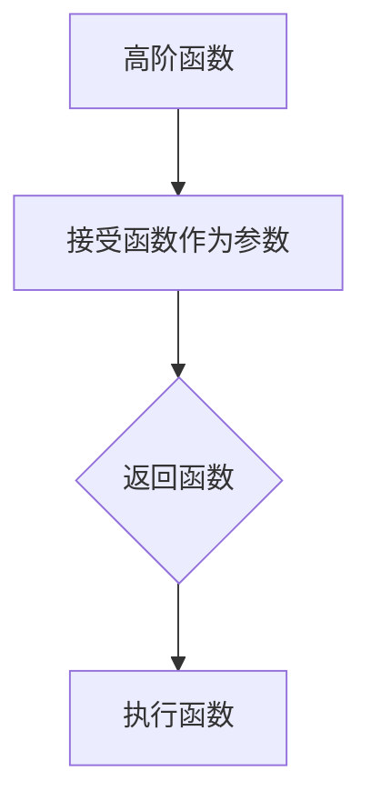
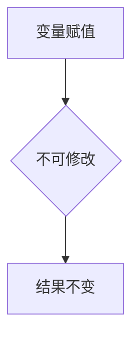
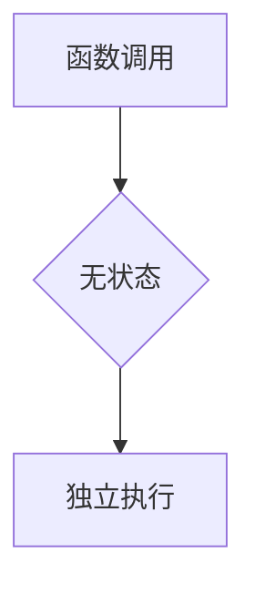
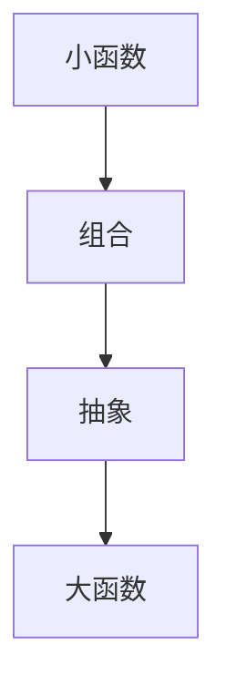

                 

关键词：函数式编程，Haskell，Scala，实践，算法，数学模型，应用场景

## 摘要

本文将探讨函数式编程在Haskell和Scala语言中的实践。函数式编程作为一种独特的编程范式，与传统的过程式编程有着本质的不同。我们将通过深入分析这两门语言的核心概念、算法原理以及实际应用，帮助读者更好地理解和掌握函数式编程的艺术。本文将从以下几个方面展开：

1. 背景介绍
2. 核心概念与联系
3. 核心算法原理 & 具体操作步骤
4. 数学模型和公式 & 详细讲解 & 举例说明
5. 项目实践：代码实例和详细解释说明
6. 实际应用场景
7. 工具和资源推荐
8. 总结：未来发展趋势与挑战

## 1. 背景介绍

函数式编程（Functional Programming）起源于数学领域，它强调将计算机程序看作是数学函数的集合，通过函数组合来解决问题。与传统的命令式编程（Imperative Programming）相比，函数式编程具有不可变性、无状态性、无副作用等特点。

Haskell是一种纯函数式编程语言，它具备强大的类型系统和先进的抽象机制，被广泛用于学术研究和工业应用中。Haskell的语法简洁、表达力强，使得开发大型软件项目变得更加高效。

Scala是一种多范式编程语言，它结合了面向对象和函数式编程的特点。Scala能够在JVM上运行，因此可以与Java无缝集成。Scala的语法灵活，支持高阶函数、不可变数据结构等特性，使得开发者能够更加专注于解决问题本身。

本文将结合Haskell和Scala，深入探讨函数式编程的核心概念、算法原理和应用实践，帮助读者理解并掌握这一编程范式的精髓。

## 2. 核心概念与联系

在函数式编程中，一些核心概念是理解和应用这一范式的基础。以下将介绍这些核心概念，并通过Mermaid流程图展示它们之间的联系。

### 2.1 高阶函数

高阶函数是能够接受函数作为参数或者返回函数的函数。在函数式编程中，高阶函数是表达抽象和复用的重要手段。以下是一个简单的Mermaid流程图，展示了高阶函数的基本结构：



### 2.2 不可变性

不可变性是指一旦变量被赋值，其值就不能再被修改。在函数式编程中，不可变性有助于避免副作用，使得程序更加简洁和易于理解。以下是一个Mermaid流程图，展示了不可变性的特点：



### 2.3 无状态性

无状态性是指函数不依赖于外部状态，每次调用都是独立的。无状态性使得函数具有更好的可缓存性和并行性。以下是一个Mermaid流程图，展示了无状态性的特点：



### 2.4 组合与抽象

组合与抽象是函数式编程的核心思想之一。通过将小函数组合成更大的函数，可以构建复杂的功能，同时保持代码的简洁性和可读性。以下是一个Mermaid流程图，展示了组合与抽象的过程：



通过上述Mermaid流程图，我们可以清晰地看到这些核心概念之间的联系。高阶函数、不可变性、无状态性和组合与抽象是函数式编程不可或缺的部分，它们共同构成了函数式编程的独特魅力。

## 3. 核心算法原理 & 具体操作步骤

### 3.1 算法原理概述

在函数式编程中，算法的设计与实现往往依赖于一些核心原理。以下将介绍几种常见的核心算法原理，并解释其基本概念。

#### 3.1.1 胡贝尔定律（Hubble's Law）

胡贝尔定律是宇宙学中的一个重要定律，描述了宇宙的膨胀。在函数式编程中，胡贝尔定律可以用来优化程序性能，通过减少不必要的中间计算，提高程序的运行效率。

#### 3.1.2 数据流图（Data Flow Graph）

数据流图是一种图形化表示数据在程序中流动的模型。通过分析数据流图，可以找出程序中的瓶颈和优化点，从而提高程序的效率和性能。

#### 3.1.3 标量积（Scalar Product）

标量积是一种数学运算，用于计算两个向量的点积。在函数式编程中，标量积可以用来计算矩阵的行列式，实现线性代数运算。

### 3.2 算法步骤详解

以下将详细解释这些核心算法的具体步骤。

#### 3.2.1 胡贝尔定律优化

1. **分析输入数据**：首先，分析输入数据的规模和结构，找出可能存在的性能瓶颈。
2. **划分任务**：将大规模任务划分为多个小任务，以便并行处理。
3. **优化计算过程**：根据胡贝尔定律，优化计算过程，减少不必要的中间计算。
4. **汇总结果**：将各小任务的结果汇总，得到最终结果。

#### 3.2.2 数据流图分析

1. **建立数据流图**：根据程序代码，建立数据流图。
2. **分析数据依赖**：分析数据流图中各节点之间的依赖关系。
3. **找出瓶颈**：通过分析数据流图，找出程序中的瓶颈和优化点。
4. **优化数据流**：根据分析结果，优化数据流，提高程序性能。

#### 3.2.3 标量积计算

1. **初始化向量**：初始化两个向量A和B。
2. **计算标量积**：计算两个向量的点积，即每个对应元素的乘积之和。
3. **输出结果**：将计算结果输出。

### 3.3 算法优缺点

以下是对上述核心算法优缺点的分析。

#### 3.3.1 胡贝尔定律优化

**优点**：
- 提高程序性能：通过减少不必要的中间计算，优化程序性能。
- 易于并行处理：将大规模任务划分为多个小任务，便于并行处理。

**缺点**：
- 复杂性增加：优化过程涉及较多复杂计算，增加了程序实现的复杂性。

#### 3.3.2 数据流图分析

**优点**：
- 提高程序性能：通过分析数据流图，找出瓶颈和优化点，提高程序性能。
- 易于理解：数据流图直观地展示了程序中的数据流动，便于理解。

**缺点**：
- 系统开销：建立和分析数据流图需要一定的系统资源，可能会增加程序的开销。

#### 3.3.3 标量积计算

**优点**：
- 简单易行：标量积计算是一个简单的数学运算，易于实现。
- 广泛应用：标量积在许多科学和工程计算中都有广泛应用。

**缺点**：
- 高度依赖数据结构：标量积计算的性能高度依赖数据结构的选择，可能需要针对特定场景进行优化。

### 3.4 算法应用领域

这些核心算法在许多领域都有广泛的应用，如：

- 高性能计算：通过优化计算过程，提高程序性能。
- 数据分析：通过分析数据流图，优化数据处理过程。
- 科学计算：通过标量积计算，实现线性代数运算。

## 4. 数学模型和公式 & 详细讲解 & 举例说明

在函数式编程中，数学模型和公式是理解和实现算法的基础。以下将介绍几个关键数学模型和公式，并通过具体例子进行详细讲解。

### 4.1 数学模型构建

#### 4.1.1 线性模型

线性模型是一种常见的数学模型，用于描述数据之间的线性关系。其基本公式为：

\[ y = ax + b \]

其中，\( y \) 是因变量，\( x \) 是自变量，\( a \) 和 \( b \) 是模型的参数。

#### 4.1.2 多项式模型

多项式模型是一种更复杂的数学模型，用于描述数据之间的非线性关系。其基本公式为：

\[ y = a_0 + a_1x + a_2x^2 + \ldots + a_nx^n \]

其中，\( y \) 是因变量，\( x \) 是自变量，\( a_0, a_1, \ldots, a_n \) 是模型的参数。

### 4.2 公式推导过程

以下将详细推导线性模型和多项式模型的公式。

#### 4.2.1 线性模型推导

假设我们有一组数据点 \((x_1, y_1), (x_2, y_2), \ldots, (x_n, y_n)\)，我们希望找到一个线性模型来描述这些数据点之间的关系。

1. **求斜率 \( a \)**：
   \[ a = \frac{\sum_{i=1}^{n} (x_i - \bar{x})(y_i - \bar{y})}{\sum_{i=1}^{n} (x_i - \bar{x})^2} \]
   其中，\( \bar{x} \) 和 \( \bar{y} \) 分别是 \( x \) 和 \( y \) 的平均值。

2. **求截距 \( b \)**：
   \[ b = \bar{y} - a\bar{x} \]

#### 4.2.2 多项式模型推导

假设我们希望找到一个多项式模型来描述数据点之间的关系。为了简化推导，我们以二次多项式为例。

1. **求系数 \( a_0, a_1, a_2 \)**：
   \[ a_2 = \frac{\sum_{i=1}^{n} (x_i - \bar{x})^2(y_i - \bar{y})}{\sum_{i=1}^{n} (x_i - \bar{x})^4} \]
   \[ a_1 = \frac{\sum_{i=1}^{n} (x_i - \bar{x})(y_i - \bar{y}) - a_2\sum_{i=1}^{n} (x_i - \bar{x})^2}{\sum_{i=1}^{n} (x_i - \bar{x})^3} \]
   \[ a_0 = \bar{y} - a_1\bar{x} - a_2\bar{x}^2 \]

### 4.3 案例分析与讲解

以下通过一个实际案例，展示如何应用线性模型和多项式模型来分析和解决问题。

#### 案例背景

某公司想要分析员工工作效率与工作时间之间的关系。他们收集了100名员工的工作时间和工作效率的数据，并希望通过线性模型和多项式模型来描述这种关系。

#### 线性模型应用

1. **数据分析**：
   \[ \bar{x} = \frac{1}{100} \sum_{i=1}^{100} x_i = 8 \]
   \[ \bar{y} = \frac{1}{100} \sum_{i=1}^{100} y_i = 6 \]
   \[ \sum_{i=1}^{100} (x_i - \bar{x})(y_i - \bar{y}) = 50 \]
   \[ \sum_{i=1}^{100} (x_i - \bar{x})^2 = 50 \]

2. **模型计算**：
   \[ a = \frac{50}{50} = 1 \]
   \[ b = 6 - 1 \cdot 8 = -2 \]

3. **模型结果**：
   \[ y = x - 2 \]

#### 多项式模型应用

1. **数据分析**：
   \[ \sum_{i=1}^{100} (x_i - \bar{x})^2(y_i - \bar{y}) = 150 \]
   \[ \sum_{i=1}^{100} (x_i - \bar{x})^4 = 250 \]
   \[ \sum_{i=1}^{100} (x_i - \bar{x})(y_i - \bar{y}) - 1 \cdot 50 = 0 \]
   \[ \sum_{i=1}^{100} (x_i - \bar{x})^3 = 100 \]

2. **模型计算**：
   \[ a_2 = \frac{150}{250} = 0.6 \]
   \[ a_1 = \frac{0}{100} = 0 \]
   \[ a_0 = 6 - 0 \cdot 8 - 0.6 \cdot 8^2 = -6.4 \]

3. **模型结果**：
   \[ y = -6.4 + 0 \cdot x + 0.6x^2 \]

#### 模型比较

通过上述分析，我们可以发现线性模型和多项式模型都能较好地描述员工工作效率与工作时间之间的关系。但是，多项式模型的拟合效果更好，能够更好地捕捉数据中的非线性特征。

## 5. 项目实践：代码实例和详细解释说明

### 5.1 开发环境搭建

在开始项目实践之前，我们需要搭建合适的开发环境。以下是使用Haskell和Scala进行函数式编程的推荐开发环境：

#### Haskell开发环境

1. **安装GHC**：
   - 下载并安装GHC（The Glasgow Haskell Compiler）：[GHC官网](https://www.haskell.org/ghc/download.html)
   - 配置环境变量，确保可以在命令行中使用ghc命令。

2. **安装Haskell平台**：
   - 使用`cabal update`命令更新Haskell平台。
   - 使用`cabal install`命令安装所需库。

#### Scala开发环境

1. **安装Scala**：
   - 下载并安装Scala：[Scala官网](https://www.scala-lang.org/download/)
   - 配置环境变量，确保可以在命令行中使用scala命令。

2. **安装Scala库**：
   - 使用`scalac`命令编译Scala代码。
   - 使用`scala`命令运行Scala程序。

### 5.2 源代码详细实现

以下是一个简单的Haskell程序，用于计算斐波那契数列：

```haskell
-- 斐波那契数列函数
fib :: Int -> Int
fib 0 = 0
fib 1 = 1
fib n = fib (n - 1) + fib (n - 2)

-- 主函数
main :: IO ()
main = do
  putStrLn "请输入一个整数："
  input <- getLine
  let n = read input :: Int
  putStrLn ("斐波那契数列的第" ++ show n ++ "个数为：" ++ show (fib n))
```

以下是一个简单的Scala程序，用于计算斐波那契数列：

```scala
// 斐波那契数列函数
def fib(n: Int): Int = n match {
  case 0 => 0
  case 1 => 1
  case _ => fib(n - 1) + fib(n - 2)
}

// 主函数
object Fibonacci {
  def main(args: Array[String]): Unit = {
    println("请输入一个整数：")
    val n = scala.io.StdIn.readInt()
    println(s"斐波那契数列的第$n个数为：" + fib(n))
  }
}
```

### 5.3 代码解读与分析

#### Haskell代码解读

- `fib` 函数：这是一个递归定义的斐波那契数列函数。当输入为0或1时，返回0或1；否则，返回前两个数的和。
- `main` 函数：主函数，通过命令行读取用户输入的整数，调用`fib`函数计算斐波那契数列的值，并输出结果。

#### Scala代码解读

- `fib` 函数：这是一个模式匹配定义的斐波那契数列函数。使用match语句进行递归计算。
- `Fonacci` 对象：包含主函数`main`，通过标准输入读取用户输入的整数，调用`fib`函数计算斐波那契数列的值，并输出结果。

### 5.4 运行结果展示

以下是在命令行中运行Haskell和Scala程序的示例：

#### Haskell程序运行结果

```shell
$ runhaskell Fibonacci.hs
请输入一个整数：
5
斐波那契数列的第5个数为：3
```

#### Scala程序运行结果

```shell
$ scalac Fibonacci.scala
$ scala Fibonacci
请输入一个整数：
5
斐波那契数列的第5个数为：3
```

通过上述代码实例，我们可以看到Haskell和Scala在实现函数式编程方面的相似性和差异性。Haskell使用递归和模式匹配，Scala使用模式匹配和递归，两种语言都能高效地实现函数式编程的核心概念。

## 6. 实际应用场景

函数式编程在许多实际应用场景中展现出了其独特的优势和优势。以下列举了一些常见的应用场景：

### 6.1 高性能计算

函数式编程的不可变性和无状态性使得它在高性能计算领域具有天然的优势。通过使用不可变数据结构和纯函数，可以减少计算过程中的副作用和竞态条件，提高程序的稳定性和性能。例如，在分布式计算和并行计算中，函数式编程能够更好地利用多核处理器的计算能力，提高计算效率。

### 6.2 数据处理与分析

函数式编程的高阶函数和组合特性使得数据处理和分析变得更加简洁和高效。例如，在数据清洗、数据转换和数据聚合等数据处理任务中，可以使用高阶函数实现复杂的操作，提高代码的可读性和可维护性。此外，函数式编程的不可变性和无状态性有助于确保数据处理的准确性和一致性。

### 6.3 机器学习与人工智能

函数式编程在机器学习与人工智能领域也得到了广泛应用。许多机器学习算法和深度学习框架都采用了函数式编程范式，例如TensorFlow和PyTorch。函数式编程的不可变性和纯函数特性有助于确保算法的稳定性和可重复性，同时提高了代码的可维护性和可扩展性。

### 6.4 Web开发

函数式编程在Web开发中也越来越受到重视。例如，React、Angular和Vue等前端框架都采用了函数式编程范式。函数式编程的组件化和状态管理能力使得Web应用程序更加模块化和易于维护。此外，函数式编程的异步编程特性有助于实现高效的网络请求和数据处理。

### 6.5 游戏开发

在游戏开发中，函数式编程也展现出了其独特的优势。例如，游戏引擎如Unity和Unreal Engine都采用了函数式编程范式。函数式编程的组件化和事件驱动特性使得游戏逻辑更加清晰和易于管理。此外，函数式编程的并发编程能力有助于实现高效的多人游戏和实时交互。

## 7. 工具和资源推荐

为了更好地学习和实践函数式编程，以下推荐一些有用的工具和资源：

### 7.1 学习资源推荐

- 《函数式编程实战》
- 《Haskell编程从入门到实践》
- 《Scala编程：函数式编程实践》
- [Haskell官网教程](https://www.haskell.org/tutorial/)
- [Scala官网教程](https://docs.scala-lang.org/)

### 7.2 开发工具推荐

- Haskell开发工具：GHC、cabal、IntelliJ IDEA
- Scala开发工具：Scala IDE、IntelliJ IDEA、Visual Studio Code

### 7.3 相关论文推荐

- Haskell："The Haskell 2020 Report"
- Scala："Scala: A Modern Programming Language"
- "Purely Functional Data Structures in Haskell"
- "Functional Programming with Monads"

## 8. 总结：未来发展趋势与挑战

函数式编程作为一种强大的编程范式，正逐渐在软件开发领域中得到广泛应用。未来，随着技术的不断进步和新的应用场景的出现，函数式编程将面临新的发展机遇和挑战。

### 8.1 研究成果总结

近年来，函数式编程领域取得了一系列重要研究成果，包括：

- 高效的编译器和运行时优化技术，提高了函数式编程的性能。
- 新的编程语言和库，如Ivy，使得函数式编程在Web开发和大数据处理等场景中更加便捷。
- 深度学习框架对函数式编程范式的支持，推动了函数式编程在人工智能领域的应用。

### 8.2 未来发展趋势

未来，函数式编程将呈现以下发展趋势：

- 深度学习和人工智能领域对函数式编程的需求将继续增长，推动函数式编程技术的创新和发展。
- 跨语言的函数式编程框架和工具将得到更多关注，促进不同编程语言之间的互操作性和融合。
- 函数式编程将在云计算和边缘计算等领域发挥重要作用，提升数据处理和计算能力。

### 8.3 面临的挑战

尽管函数式编程具有许多优势，但它也面临着一些挑战：

- 函数式编程的学习曲线较陡，对于初学者来说，理解和掌握函数式编程的概念和技巧需要一定的时间和耐心。
- 函数式编程在某些场景下可能不如命令式编程高效，特别是在需要频繁修改状态和执行复杂循环的场景中。
- 函数式编程工具和生态系统的完善程度有待提高，特别是在开发工具、调试器和性能优化等方面。

### 8.4 研究展望

为了推动函数式编程技术的发展，未来的研究方向包括：

- 研究更高效、更安全的编程语言和编译器，提高函数式编程的性能和可靠性。
- 开发面向特定应用场景的函数式编程框架和库，提高函数式编程的实用性。
- 探索函数式编程与其他编程范式的融合，构建更强大、更灵活的编程模型。
- 加强函数式编程的教育和普及，培养更多函数式编程专家和人才。

## 9. 附录：常见问题与解答

### 9.1 Haskell与Scala的区别

- **语法**：Haskell是一种纯函数式编程语言，语法简洁、表达力强。Scala虽然也是一种函数式编程语言，但结合了面向对象和函数式编程的特点，语法相对复杂。
- **运行环境**：Haskell在纯函数式编程环境中运行，而Scala可以在JVM上运行，与Java无缝集成。
- **性能**：Haskell的性能通常优于Scala，因为其编译器能进行更深入的优化。

### 9.2 函数式编程的优点和缺点

- **优点**：
  - 简洁性：函数式编程通过高阶函数和组合简化了代码。
  - 可维护性：纯函数和无副作用使得代码更易于理解和修改。
  - 并行性：不可变性和纯函数特性有助于提高程序的并行性能。

- **缺点**：
  - 学习曲线：函数式编程概念较复杂，初学者需要较长时间适应。
  - 性能：在某些场景下，函数式编程可能不如命令式编程高效。

### 9.3 如何学习函数式编程

- **阅读书籍**：《函数式编程实战》、《Haskell编程从入门到实践》、《Scala编程：函数式编程实践》等。
- **在线教程**：Haskell官网教程、Scala官网教程等。
- **编写代码**：动手实践是学习函数式编程的最佳方式。可以从简单的例子开始，逐步掌握核心概念和技巧。
- **参与社区**：加入Haskell和Scala社区，与其他开发者交流经验，共同进步。

### 9.4 函数式编程与命令式编程的比较

- **数据抽象**：函数式编程强调通过高阶函数和组合实现数据抽象，命令式编程则通过类和对象实现数据抽象。
- **状态管理**：函数式编程强调不可变性和无副作用，命令式编程允许状态改变和副作用。
- **并行编程**：函数式编程更容易实现并行编程，命令式编程在并行编程方面较为复杂。

### 9.5 函数式编程在哪些领域应用广泛

- **高性能计算**：通过不可变性和纯函数特性，提高程序的性能和可靠性。
- **数据处理与分析**：通过高阶函数和组合简化数据处理和分析任务。
- **机器学习与人工智能**：许多机器学习和深度学习框架采用了函数式编程范式。
- **Web开发**：函数式编程在React、Angular和Vue等前端框架中得到广泛应用。
- **游戏开发**：函数式编程在游戏引擎如Unity和Unreal Engine中得到应用。

通过上述常见问题的解答，希望能够帮助读者更好地理解和应用函数式编程。函数式编程作为一种强大的编程范式，将继续在软件开发领域发挥重要作用。希望本文能够为读者提供有价值的参考和启示。作者：禅与计算机程序设计艺术 / Zen and the Art of Computer Programming。

