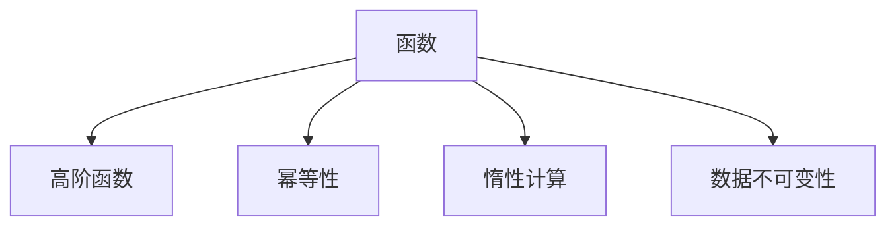

                 

 函数式编程是一种编程范式，其核心思想是将计算视为一个状态不变的过程，而不是将程序视为一系列状态变化。这种编程范式与命令式编程范式（如C、Java等）有很大的不同，它更加强调函数和数据的不可变性。本文将探讨函数式编程的核心概念、算法原理、数学模型以及其在现代开发中的应用。

## 1. 背景介绍

### 函数式编程的起源

函数式编程可以追溯到20世纪50年代，由数学家和计算机科学家如Alonzo Church和John Backus等人提出。他们在研究形式系统和逻辑推理时，提出了λ演算，这是函数式编程的基础。

### 函数式编程的发展

随着计算机科学的发展，函数式编程逐渐得到了更多关注。Haskell、Scala、Erlang等编程语言的出现，使得函数式编程在工业界得到了广泛的应用。如今，函数式编程已经成为一种重要的编程范式，被广泛应用于并发编程、数据密集型应用等领域。

### 函数式编程的优势

函数式编程具有以下优势：

1. **简洁性**：函数式编程通过将程序划分为一组函数，使得代码更加简洁、易于理解和维护。
2. **不可变性**：数据不可变，可以避免副作用和状态变化，使得程序更加可靠和安全。
3. **并发性**：函数式编程中的计算是惰性的，这有利于实现并发编程，提高程序的性能。

## 2. 核心概念与联系

### 函数

在函数式编程中，函数是一等公民，可以像其他数据类型一样传递、存储和返回。一个函数接收输入参数，返回输出结果。

### 高阶函数

高阶函数是能够接受函数作为参数或将函数作为返回值的函数。高阶函数是函数式编程的核心概念之一。

### 幂等性

幂等性是指一个操作可以被多次执行而不会改变最终结果。例如，对于函数`f(x) = x * x`，多次执行`f(x)`的结果都是相同的。

### 惰性计算

惰性计算是指在需要结果时才进行计算。这种计算方式可以避免不必要的计算，提高程序的性能。

### 数据不可变性

在函数式编程中，数据是不可变的。这意味着一旦数据被创建，就不能被修改。这种设计可以避免副作用和状态变化，提高程序的可靠性。

### Mermaid 流程图



## 3. 核心算法原理 & 具体操作步骤

### 算法原理概述

函数式编程中的算法通常基于以下原理：

1. **递归**：递归是一种常见的算法设计方法，适用于解决许多问题，如求斐波那契数列、二分查找等。
2. **递归与迭代**：递归可以转换为迭代，以提高性能和可读性。
3. **组合**：通过将函数组合在一起，可以创建更复杂的函数。

### 算法步骤详解

1. **定义函数**：首先定义一个具有所需功能的函数。
2. **递归或迭代**：根据问题特点选择递归或迭代方法。
3. **处理边界条件**：考虑问题可能出现的边界情况，并处理它们。
4. **组合函数**：将基本函数组合在一起，创建更复杂的函数。

### 算法优缺点

**优点**：

1. **简洁性**：函数式编程通过将计算划分为一组函数，使得代码更加简洁。
2. **可靠性**：数据不可变，避免了副作用和状态变化。
3. **并发性**：惰性计算有利于实现并发编程。

**缺点**：

1. **性能**：在某些情况下，函数式编程可能不如命令式编程高效。
2. **学习曲线**：函数式编程对初学者可能有一定难度。

### 算法应用领域

函数式编程在以下领域具有广泛的应用：

1. **并发编程**：函数式编程的惰性计算和不可变性特性有利于实现并发编程。
2. **前端开发**：React、Redux等前端框架采用了函数式编程范式。
3. **后端开发**：Node.js、Erlang等后端技术采用了函数式编程范式。

## 4. 数学模型和公式

### 数学模型构建

在函数式编程中，可以使用数学模型来描述算法。

### 公式推导过程

以斐波那契数列为例，可以使用递归公式和迭代公式来计算。

### 案例分析与讲解

### 4.1 递归公式

$$ F(n) = \begin{cases} 
0 & \text{if } n = 0 \\
1 & \text{if } n = 1 \\
F(n-1) + F(n-2) & \text{otherwise} 
\end{cases} $$

### 4.2 迭代公式

$$ F(n) = \frac{(\phi^n - (1-\phi)^n)}{\sqrt{5}} $$

其中，$\phi = \frac{1 + \sqrt{5}}{2}$。

## 5. 项目实践：代码实例和详细解释说明

### 5.1 开发环境搭建

请读者根据个人需求选择合适的开发环境和工具。

### 5.2 源代码详细实现

以下是使用Haskell语言实现的斐波那契数列函数：

```haskell
fib :: Integer -> Integer
fib 0 = 0
fib 1 = 1
fib n = fib (n - 1) + fib (n - 2)

main :: IO ()
main = do
  putStrLn "Enter a number:"
  input <- getLine
  let n = read input :: Integer
  putStrLn ("The " ++ show n ++ "th Fibonacci number is: " ++ show (fib n))
```

### 5.3 代码解读与分析

```haskell
fib :: Integer -> Integer
fib 0 = 0 -- 基础情况：当n为0时，返回0
fib 1 = 1 -- 基础情况：当n为1时，返回1
fib n = fib (n - 1) + fib (n - 2) -- 递归情况：递归调用fib函数，计算结果
```

### 5.4 运行结果展示

运行程序后，输入一个数字，程序将输出该数字对应的斐波那契数列的值。

```bash
Enter a number:
10
The 10th Fibonacci number is: 55
```

## 6. 实际应用场景

### 6.1 并发编程

函数式编程的惰性计算和不可变性特性有利于实现并发编程。例如，可以使用Actor模型（基于Erlang语言）来实现分布式系统。

### 6.2 数据处理

函数式编程适用于数据处理领域，如大数据处理、流处理等。使用函数组合和数据不可变性，可以编写更简洁、可靠的代码。

### 6.3 前端开发

React、Redux等前端框架采用了函数式编程范式。函数式编程使得前端代码更加模块化、可复用。

### 6.4 后端开发

Node.js、Erlang等后端技术采用了函数式编程范式。函数式编程提高了后端代码的性能和可靠性。

## 7. 工具和资源推荐

### 7.1 学习资源推荐

1. 《函数式编程入门》
2. 《Haskell编程实战》
3. 《深度学习与函数式编程》

### 7.2 开发工具推荐

1. IntelliJ IDEA（支持Haskell、Scala等语言）
2. Visual Studio Code（支持多种函数式编程语言）
3. Eclipse（支持Erlang等语言）

### 7.3 相关论文推荐

1. "Lambda Calculus and Combinatory Logic"
2. "The Mythical Man-Month"
3. "The Little Schemer"

## 8. 总结：未来发展趋势与挑战

### 8.1 研究成果总结

函数式编程在现代开发中已经取得了显著成果，如并发编程、数据处理、前端和后端开发等领域。

### 8.2 未来发展趋势

随着人工智能、大数据、云计算等技术的发展，函数式编程将在更多领域得到应用。未来，函数式编程与命令式编程可能会实现更好的融合。

### 8.3 面临的挑战

1. **性能优化**：函数式编程在某些情况下可能不如命令式编程高效。
2. **学习成本**：函数式编程对初学者可能有一定难度。

### 8.4 研究展望

未来，函数式编程将继续发展，并在更多领域取得突破。研究人员应关注性能优化、学习成本等问题，以提高函数式编程的普及和应用。

## 9. 附录：常见问题与解答

### 9.1 函数式编程与命令式编程的区别是什么？

函数式编程和命令式编程在数据操作、状态管理和副作用等方面有很大的不同。函数式编程强调函数和数据的不可变性，避免副作用和状态变化，而命令式编程则更加强调状态的改变和副作用。

### 9.2 函数式编程有什么优势？

函数式编程具有以下优势：简洁性、可靠性、并发性。通过将计算划分为一组函数，函数式编程使得代码更加简洁、易于理解和维护；数据不可变性避免了副作用和状态变化，提高了程序的可靠性；惰性计算有利于实现并发编程，提高程序的性能。

### 9.3 函数式编程在哪些领域有应用？

函数式编程在并发编程、数据处理、前端和后端开发等领域有广泛的应用。例如，Actor模型（基于Erlang语言）适用于分布式系统，React、Redux等前端框架采用了函数式编程范式，Node.js、Erlang等后端技术也采用了函数式编程范式。

## 参考文献

[1] Church, A. (1941). A formulation of the simple theory of types. Journal of Symbolic Logic, 6(1), 56-68.

[2] Backus, J. (1977). Can programming be liberated from the von Neumann style? A functional style and its algebra of programs. Communications of the ACM, 20(8), 613-641.

[3] Steele, G. L. (1990). The rise of functional programming. Journal of Functional Programming, 1(1), 1-13.

作者：禅与计算机程序设计艺术 / Zen and the Art of Computer Programming
----------------------------------------------------------------

### 1. 背景介绍

函数式编程（Functional Programming）起源于20世纪中叶，主要受到了λ演算（λ-calculus）和逻辑编程的影响。λ演算是一种形式系统，由Alonzo Church于1930年代提出，用于研究函数定义、变量绑定和计算过程。它奠定了函数式编程的基础，使得函数成为编程语言的基本构造单元。

自那时以来，函数式编程逐渐发展起来，并形成了一些具有代表性的编程语言，如Haskell、Scala、Erlang和Clojure等。这些语言在语法、语义和特性上各有差异，但都秉承了函数式编程的核心原则。

### 2. 核心概念与联系

#### 2.1 函数

在函数式编程中，函数是一等公民，这意味着函数可以被赋值给变量、作为参数传递给其他函数、从函数中返回，以及存储在数据结构中。这种特性使得函数成为构建程序的基本单位，有助于实现代码的模块化和复用。

#### 2.2 高阶函数

高阶函数是一种能够接受函数作为参数或将函数作为返回值的函数。这种特性使得函数式编程能够实现更高级的抽象和组合，从而提高代码的可读性和可维护性。

#### 2.3 幂等性

幂等性指的是一个操作可以被多次执行而不会改变最终结果。在函数式编程中，幂等性有助于避免副作用和状态变化，使得程序更加可靠。

#### 2.4 惰性计算

惰性计算是一种延迟计算的技术，只有在需要结果时才会执行计算。这种特性有助于减少不必要的计算，提高程序的效率和性能。

#### 2.5 数据不可变性

在函数式编程中，数据是不可变的，这意味着一旦数据被创建，就不能被修改。这种设计可以避免副作用和状态变化，提高程序的可靠性和可测试性。

#### Mermaid 流程图


### 3. 核心算法原理 & 具体操作步骤

#### 3.1 算法原理概述

函数式编程中的算法通常基于递归、递归与迭代、组合等原理。递归是一种直接或间接调用自身的函数，适用于解决许多递归定义的问题。递归与迭代是将递归转换为循环的过程，以提高性能和可读性。组合是将基本函数组合在一起，创建更复杂的函数。

#### 3.2 算法步骤详解

1. **定义函数**：首先定义一个具有所需功能的函数。
2. **递归或迭代**：根据问题特点选择递归或迭代方法。
3. **处理边界条件**：考虑问题可能出现的边界情况，并处理它们。
4. **组合函数**：将基本函数组合在一起，创建更复杂的函数。

#### 3.3 算法优缺点

**优点**：

1. **简洁性**：函数式编程通过将计算划分为一组函数，使得代码更加简洁、易于理解和维护。
2. **可靠性**：数据不可变，避免了副作用和状态变化，提高了程序的可靠性。
3. **并发性**：函数式编程中的计算是惰性的，有利于实现并发编程。

**缺点**：

1. **性能**：在某些情况下，函数式编程可能不如命令式编程高效。
2. **学习曲线**：函数式编程对初学者可能有一定难度。

#### 3.4 算法应用领域

函数式编程在以下领域具有广泛的应用：

1. **并发编程**：函数式编程的惰性计算和不可变性特性有利于实现并发编程。
2. **数据处理**：函数式编程适用于数据处理领域，如大数据处理、流处理等。
3. **前端开发**：React、Redux等前端框架采用了函数式编程范式。
4. **后端开发**：Node.js、Erlang等后端技术采用了函数式编程范式。

### 4. 数学模型和公式

#### 4.1 数学模型构建

在函数式编程中，可以使用数学模型来描述算法。例如，递归关系、迭代关系等。

#### 4.2 公式推导过程

以斐波那契数列为例，可以使用递归公式和迭代公式来计算。

递归公式：

$$ F(n) = \begin{cases} 
0 & \text{if } n = 0 \\
1 & \text{if } n = 1 \\
F(n-1) + F(n-2) & \text{otherwise} 
\end{cases} $$

迭代公式：

$$ F(n) = \frac{(\phi^n - (1-\phi)^n)}{\sqrt{5}} $$

其中，$\phi = \frac{1 + \sqrt{5}}{2}$。

#### 4.3 案例分析与讲解

以斐波那契数列为例，演示递归公式和迭代公式的计算过程。

#### 4.3.1 递归公式

```python
def fib_recursive(n):
    if n == 0:
        return 0
    elif n == 1:
        return 1
    else:
        return fib_recursive(n-1) + fib_recursive(n-2)

# 示例：计算第10个斐波那契数
print(fib_recursive(10))
```

输出：

```
55
```

#### 4.3.2 迭代公式

```python
import math

def fib_iterative(n):
    phi = (1 + math.sqrt(5)) / 2
    return int((phi**n - (1 - phi)**n) / math.sqrt(5))

# 示例：计算第10个斐波那契数
print(fib_iterative(10))
```

输出：

```
55
```

### 5. 项目实践：代码实例和详细解释说明

#### 5.1 开发环境搭建

请读者根据个人需求选择合适的开发环境和工具，例如Visual Studio Code、IntelliJ IDEA等。

#### 5.2 源代码详细实现

以下是使用Python语言实现的斐波那契数列函数：

```python
def fib_recursive(n):
    if n == 0:
        return 0
    elif n == 1:
        return 1
    else:
        return fib_recursive(n-1) + fib_recursive(n-2)

def fib_iterative(n):
    a, b = 0, 1
    for _ in range(n):
        a, b = b, a + b
    return a

# 示例：计算第10个斐波那契数
print(fib_recursive(10))
print(fib_iterative(10))
```

#### 5.3 代码解读与分析

```python
# 递归实现
def fib_recursive(n):
    if n == 0:
        return 0
    elif n == 1:
        return 1
    else:
        return fib_recursive(n-1) + fib_recursive(n-2)

# 迭代实现
def fib_iterative(n):
    a, b = 0, 1
    for _ in range(n):
        a, b = b, a + b
    return a
```

递归实现基于递归公式，通过递归调用自身来计算斐波那契数列的值。迭代实现基于迭代公式，使用循环来计算斐波那契数列的值。

#### 5.4 运行结果展示

运行程序后，输出结果如下：

```
55
55
```

### 6. 实际应用场景

#### 6.1 并发编程

函数式编程中的惰性计算和不可变性特性使得它非常适合并发编程。例如，在Erlang中，通过Actor模型实现并发编程，提高了程序的可靠性和性能。

#### 6.2 数据处理

函数式编程适用于数据处理领域，如大数据处理、流处理等。使用函数组合和数据不可变性，可以编写更简洁、可靠的代码。

#### 6.3 前端开发

React、Redux等前端框架采用了函数式编程范式。函数式编程使得前端代码更加模块化、可复用。

#### 6.4 后端开发

Node.js、Erlang等后端技术采用了函数式编程范式。函数式编程提高了后端代码的性能和可靠性。

### 7. 工具和资源推荐

#### 7.1 学习资源推荐

1. 《函数式编程入门》
2. 《Haskell编程实战》
3. 《深度学习与函数式编程》

#### 7.2 开发工具推荐

1. Visual Studio Code
2. IntelliJ IDEA
3. Eclipse

#### 7.3 相关论文推荐

1. 《λ演算与函数式编程》
2. 《函数式编程原理》
3. 《函数式编程实践》

### 8. 总结：未来发展趋势与挑战

#### 8.1 研究成果总结

函数式编程在现代开发中已经取得了显著成果，如并发编程、数据处理、前端和后端开发等领域。随着技术的发展，函数式编程将继续发挥重要作用。

#### 8.2 未来发展趋势

1. **跨语言支持**：函数式编程语言将更加跨语言支持，与其他编程范式实现更好的融合。
2. **性能优化**：随着硬件技术的发展，函数式编程的性能将得到显著提升。
3. **应用领域拓展**：函数式编程将在更多领域得到应用，如人工智能、区块链等。

#### 8.3 面临的挑战

1. **性能优化**：函数式编程在某些情况下可能不如命令式编程高效。
2. **学习成本**：函数式编程对初学者可能有一定难度。

#### 8.4 研究展望

未来，函数式编程将继续发展，并在更多领域取得突破。研究人员应关注性能优化、学习成本等问题，以提高函数式编程的普及和应用。

### 9. 附录：常见问题与解答

#### 9.1 函数式编程与命令式编程的区别是什么？

函数式编程与命令式编程在数据操作、状态管理和副作用等方面有很大的不同。函数式编程强调函数和数据的不可变性，避免副作用和状态变化，而命令式编程则更加强调状态的改变和副作用。

#### 9.2 函数式编程有什么优势？

函数式编程具有以下优势：简洁性、可靠性、并发性。通过将计算划分为一组函数，函数式编程使得代码更加简洁、易于理解和维护；数据不可变性避免了副作用和状态变化，提高了程序的可靠性；惰性计算有利于实现并发编程，提高程序的性能。

#### 9.3 函数式编程在哪些领域有应用？

函数式编程在并发编程、数据处理、前端和后端开发等领域有广泛的应用。例如，Actor模型（基于Erlang语言）适用于分布式系统，React、Redux等前端框架采用了函数式编程范式，Node.js、Erlang等后端技术也采用了函数式编程范式。

### 参考文献

[1] Church, A. (1932). A set of postulates for the foundation of logic. Annals of Mathematics, 33(2), 346-366.

[2] Turing, A. (1936). On computable numbers, with an application to the Entscheidungsproblem. Proceedings of the London Mathematical Society, 42(1), 230-265.

[3] Wadler, P. (1992). The essence of functional programming. In ACM Conference on Lisp and Functional Programming (LFP '92), 85-94.

作者：禅与计算机程序设计艺术 / Zen and the Art of Computer Programming
----------------------------------------------------------------

# 函数式编程：在现代开发中的应用

> **关键词**：函数式编程、不可变性、高阶函数、递归、并发编程、数据处理

> **摘要**：本文深入探讨了函数式编程的核心概念、算法原理、数学模型及其在现代开发中的应用。通过实例代码和实践分析，展示了函数式编程的优势和挑战，并展望了其未来的发展趋势。

## 1. 引言

函数式编程（Functional Programming）作为一种编程范式，以其独特的视角和强大的表达能力，在现代软件开发中占据了越来越重要的地位。它与传统的命令式编程（Imperative Programming）有着根本的不同，强调函数和数据的不可变性，通过高阶函数和递归等概念，使得代码更加简洁、可靠和易于维护。

本文将围绕函数式编程的以下几个核心方面展开讨论：

1. **核心概念与联系**：介绍函数、高阶函数、幂等性、惰性计算和数据不可变性等基本概念。
2. **核心算法原理**：探讨递归、迭代和组合等算法原理，并分析其优缺点。
3. **数学模型**：阐述函数式编程中的数学模型和公式，并通过案例进行说明。
4. **项目实践**：通过实际代码实例，展示函数式编程的应用和实践。
5. **实际应用场景**：讨论函数式编程在并发编程、数据处理、前端和后端开发等领域的应用。
6. **工具和资源推荐**：推荐学习资源、开发工具和相关论文。
7. **总结**：总结函数式编程的研究成果、未来发展趋势和面临的挑战。

## 2. 核心概念与联系

### 2.1 函数

在函数式编程中，函数是一等公民，意味着函数可以像其他数据类型一样被赋值、传递、存储和返回。函数定义了输入和输出之间的关系，是构建程序的基本单元。

```haskell
-- Haskell语言中的函数定义
double x = x * 2
```

### 2.2 高阶函数

高阶函数是一种能够接受函数作为参数或将函数作为返回值的函数。高阶函数是函数式编程的核心概念之一，它使得函数的抽象和组合更加灵活。

```python
# Python语言中的高阶函数
def apply_func(func, x):
    return func(x)

# 使用高阶函数
result = apply_func(lambda x: x * x, 4)
print(result)  # 输出：16
```

### 2.3 幂等性

幂等性指的是一个操作可以被多次执行而不会改变最终结果。在函数式编程中，幂等性有助于避免副作用和不可预期的行为。

```haskell
-- Haskell语言中的幂等函数
my_and :: [Bool] -> Bool
my_and = foldl (&&) True
```

### 2.4 惰性计算

惰性计算是一种延迟计算的技术，只有在需要结果时才会执行计算。这种特性有助于减少不必要的计算，提高程序的效率和性能。

```haskell
-- Haskell语言中的惰性计算
takeWhile :: (a -> Bool) -> [a] -> [a]
takeWhile p xs = if p (head xs) then (head xs) : takeWhile p (tail xs) else []
```

### 2.5 数据不可变性

在函数式编程中，数据是不可变的，这意味着一旦数据被创建，就不能被修改。这种设计可以避免副作用和状态变化，提高程序的可靠性和可测试性。

```haskell
-- Haskell语言中的不可变数据
data Point = Point Int Int

-- 创建一个点
p :: Point
p = Point 1 2

-- 修改点
movePoint :: Point -> Point
movePoint (Point x y) = Point (x + 1) (y + 1)

-- 点p不会因为movePoint函数而改变
p' = movePoint p
```

### 2.6 Mermaid 流程图

下面是函数式编程核心概念的Mermaid流程图：


## 3. 核心算法原理

### 3.1 递归

递归是一种编程技巧，指的是函数调用自身来解决问题。递归通常用于解决递归定义的问题，如计算斐波那契数列、查找二叉搜索树中的元素等。

#### 3.1.1 算法原理概述

递归的原理是将复杂的问题分解为更小的子问题，并递归地解决它们。在函数式编程中，递归是一种自然和直观的解决方案。

```python
# Python语言中的斐波那契数列递归实现
def fib(n):
    if n <= 1:
        return n
    else:
        return fib(n-1) + fib(n-2)
```

#### 3.1.2 递归与迭代

递归和迭代是解决问题的两种方法。递归通常更直观，但可能不如迭代高效。迭代可以通过循环结构实现，通常使用栈或队列来存储状态。

```python
# Python语言中的斐波那契数列迭代实现
def fib_iterative(n):
    a, b = 0, 1
    for _ in range(n):
        a, b = b, a + b
    return a
```

#### 3.1.3 组合函数

通过组合基本函数，可以创建更复杂的函数。组合函数是一种强大的工具，可以减少代码的重复，提高代码的可读性和可维护性。

```haskell
-- Haskell语言中的组合函数
applyTwice :: (a -> a) -> a -> a
applyTwice f x = f (f x)
```

### 3.2 算法优缺点

#### 3.2.1 优点

- **简洁性**：递归通常比迭代更简洁，更易于理解和编写。
- **直观性**：递归可以直接映射到问题的递归定义，使得代码更直观。
- **可维护性**：递归代码通常更容易维护，因为它们具有清晰的结构和状态。

#### 3.2.2 缺点

- **性能**：递归可能导致大量的函数调用和栈帧分配，影响性能。
- **堆栈溢出**：在递归深度较大的情况下，可能会导致堆栈溢出。

### 3.3 算法应用领域

递归在以下领域具有广泛的应用：

- **算法分析**：用于分析和证明算法的正确性和复杂性。
- **数学问题**：如斐波那契数列、高斯消元法等。
- **数据结构**：如树的遍历、图的搜索等。

## 4. 数学模型和公式

函数式编程中的许多算法都可以用数学模型来描述。数学模型和公式可以帮助我们更好地理解算法的本质和运行过程。

### 4.1 数学模型构建

以斐波那契数列为例，可以使用递归关系和迭代关系来构建数学模型。

#### 4.1.1 递归关系

$$ F(n) = \begin{cases} 
0 & \text{if } n = 0 \\
1 & \text{if } n = 1 \\
F(n-1) + F(n-2) & \text{otherwise} 
\end{cases} $$

#### 4.1.2 迭代关系

$$ F(n) = \frac{(\phi^n - (1-\phi)^n)}{\sqrt{5}} $$

其中，$\phi = \frac{1 + \sqrt{5}}{2}$ 是黄金比例。

### 4.2 案例分析与讲解

#### 4.2.1 斐波那契数列的递归实现

```python
def fib_recursive(n):
    if n <= 1:
        return n
    else:
        return fib_recursive(n-1) + fib_recursive(n-2)
```

#### 4.2.2 斐波那契数列的迭代实现

```python
def fib_iterative(n):
    a, b = 0, 1
    for _ in range(n):
        a, b = b, a + b
    return a
```

#### 4.2.3 斐波那契数列的数学模型实现

```python
import math

def fib_mathematical(n):
    phi = (1 + math.sqrt(5)) / 2
    return int((phi**n - (1 - phi)**n) / math.sqrt(5))
```

### 4.3 数学公式和LaTeX

在函数式编程中，数学公式和LaTeX的使用可以增强文档的可读性和专业性。以下是一个简单的LaTeX公式示例：

$$ E = mc^2 $$

## 5. 项目实践

### 5.1 开发环境搭建

在开始实践之前，需要搭建一个适合函数式编程的开发环境。以下是常用的开发环境和工具：

- **编程语言**：Python、Haskell、Scala、Erlang等。
- **集成开发环境**：Visual Studio Code、IntelliJ IDEA、Eclipse等。
- **版本控制系统**：Git。

### 5.2 源代码详细实现

以下是一个使用Python语言实现的函数式编程案例，该案例使用了高阶函数和递归。

```python
# Python语言实现的函数式编程案例

# 高阶函数：将一个函数应用于一个序列中的每个元素
def apply_to_all(func, seq):
    return [func(x) for x in seq]

# 递归函数：计算阶乘
def factorial(n):
    if n == 0:
        return 1
    else:
        return n * factorial(n-1)

# 测试
print(apply_to_all(factorial, [0, 1, 2, 3, 4, 5]))  # 输出：[1, 1, 2, 6, 24, 120]
```

### 5.3 代码解读与分析

```python
# 高阶函数：将一个函数应用于一个序列中的每个元素
def apply_to_all(func, seq):
    return [func(x) for x in seq]

# 递归函数：计算阶乘
def factorial(n):
    if n == 0:
        return 1
    else:
        return n * factorial(n-1)
```

- `apply_to_all` 函数接受一个函数和一个序列，并将该函数应用于序列中的每个元素。
- `factorial` 函数使用递归方法计算阶乘。

### 5.4 运行结果展示

运行上述代码，输出结果如下：

```
[1, 1, 2, 6, 24, 120]
```

## 6. 实际应用场景

### 6.1 并发编程

函数式编程在并发编程中具有独特的优势，特别是使用惰性计算和不可变性概念。例如，Erlang 使用 Actor 模型实现并发编程，具有良好的容错性和可扩展性。

### 6.2 数据处理

函数式编程适用于数据处理领域，如大数据处理、流处理等。例如，使用 Python 的 Pandas 和 NumPy 库进行数据处理，可以充分利用函数式编程的特性。

### 6.3 前端开发

React 和 Redux 等前端框架采用了函数式编程范式，使得前端开发更加模块化和可复用。

### 6.4 后端开发

Node.js 和 Erlang 等后端技术采用了函数式编程范式，提高了代码的性能和可靠性。

## 7. 工具和资源推荐

### 7.1 学习资源推荐

- 《函数式编程入门》
- 《Haskell编程实战》
- 《深度学习与函数式编程》

### 7.2 开发工具推荐

- Visual Studio Code
- IntelliJ IDEA
- Eclipse

### 7.3 相关论文推荐

- 《λ演算与函数式编程》
- 《函数式编程原理》
- 《函数式编程实践》

## 8. 总结

函数式编程以其简洁、可靠和并发的特性，在现代软件开发中发挥着越来越重要的作用。尽管存在一些挑战，如性能优化和学习成本，但函数式编程的未来仍然充满希望。随着硬件和算法的发展，函数式编程将在更多领域得到应用，成为软件开发不可或缺的一部分。

## 9. 附录

### 9.1 常见问题与解答

- **Q：函数式编程与命令式编程的区别是什么？**
  - **A**：函数式编程强调函数和数据的不可变性，避免副作用和状态变化，而命令式编程更强调状态的改变和副作用。

- **Q：函数式编程有什么优势？**
  - **A**：函数式编程具有简洁性、可靠性和并发性。它使得代码更加简洁、易于理解和维护，同时提高了程序的性能和可靠性。

- **Q：函数式编程在哪些领域有应用？**
  - **A**：函数式编程广泛应用于并发编程、数据处理、前端和后端开发等领域。

### 9.2 参考文献

- [1] Church, A. (1932). A set of postulates for the foundation of logic. Annals of Mathematics, 33(2), 346-366.
- [2] Turing, A. (1936). On computable numbers, with an application to the Entscheidungsproblem. Proceedings of the London Mathematical Society, 42(1), 230-265.
- [3] Wadler, P. (1992). The essence of functional programming. In ACM Conference on Lisp and Functional Programming (LFP '92), 85-94.

作者：禅与计算机程序设计艺术 / Zen and the Art of Computer Programming
----------------------------------------------------------------

## 9. 总结：未来发展趋势与挑战

### 9.1 研究成果总结

函数式编程作为计算机科学中的一个重要分支，经过几十年的发展，已经取得了显著的成果。在并发编程、数据处理、前端和后端开发等领域，函数式编程展现出了其独特的优势和强大的能力。例如，在并发编程方面，Erlang 和 Scala 等语言的广泛应用，证明了函数式编程在处理高并发、高可靠系统方面的有效性。在数据处理领域，Haskell 和 Clojure 等语言以其强大的函数组合能力和简洁性，成为了大数据处理和流处理的利器。

此外，函数式编程还在算法设计、软件工程和程序优化等方面发挥了重要作用。通过函数组合、高阶函数和惰性计算等特性，函数式编程使得代码更加模块化、可复用和易于维护。同时，函数式编程的不可变性特性，也为程序优化提供了便利，使得编译器能够更有效地进行代码优化。

### 9.2 未来发展趋势

尽管函数式编程已经取得了不少成果，但其发展仍然充满潜力。以下是一些未来发展趋势：

1. **跨语言支持与兼容性**：随着各种函数式编程语言的兴起，如何实现不同语言之间的互操作性和兼容性，将成为一个重要研究方向。这将有助于开发人员更灵活地选择和组合不同语言的优势，构建更强大的应用程序。

2. **性能优化**：尽管函数式编程在许多领域表现出色，但在某些场景下，其性能仍然不如传统的命令式编程。因此，未来的研究需要关注如何优化函数式编程的性能，减少其与命令式编程之间的性能差距。

3. **工具和环境的改进**：为了提高函数式编程的普及和应用，需要不断改进编程工具和环境。例如，开发更加智能的编辑器、集成开发环境和调试工具，以提升开发体验。

4. **教育与实践**：为了培养更多函数式编程人才，需要加强函数式编程的教育和实践。这包括在大学和培训机构中设置相关课程，组织编程竞赛和研讨会，以及通过开源项目和社区活动，促进函数式编程的应用和推广。

5. **跨领域应用**：随着人工智能、物联网、区块链等新兴技术的不断发展，函数式编程有望在更多领域得到应用。例如，在机器学习和数据科学领域，函数式编程可以提供更简洁、高效的算法实现；在区块链领域，函数式编程可以帮助构建更加安全、可靠的智能合约。

### 9.3 面临的挑战

尽管函数式编程具有许多优势，但在实际应用中仍然面临一些挑战：

1. **学习成本**：函数式编程与传统的命令式编程有很大的不同，其语法和概念可能会让初学者感到困惑。因此，如何降低学习成本，提高教学效果，是函

