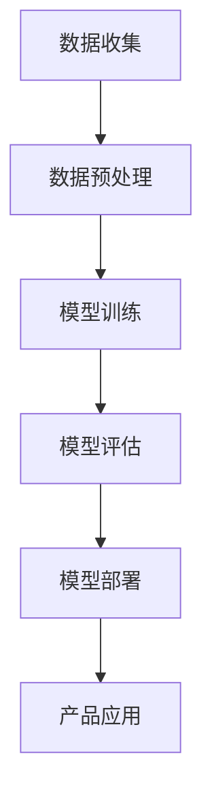

                 

关键词：AI大模型、创业产品、解决方案、技术深度、应用实践

> 摘要：本文将探讨创业产品中引入AI大模型的解决方案，分析其核心概念、算法原理、数学模型及实际应用。通过详细的项目实践案例和代码解释，为创业者提供一套实用的AI大模型开发与应用指南。

## 1. 背景介绍

在当今数字化时代，人工智能（AI）已经深入到各行各业，成为推动创新和发展的关键力量。创业公司为了在竞争激烈的市场中脱颖而出，越来越多的将AI技术融入其产品和服务中。然而，AI大模型的应用不仅需要深厚的理论基础，还需解决实际开发中的诸多技术难题。本文旨在为创业产品提供一套完整的AI大模型解决方案，帮助创业者更好地利用AI技术实现商业价值。

## 2. 核心概念与联系

### 2.1 AI大模型的基本概念

AI大模型是指具有巨大参数量和复杂结构的机器学习模型，能够通过深度学习从海量数据中提取特征，实现高精度的预测和分类。典型的大模型如Transformer、BERT等，具有强大的表达能力和泛化能力。

### 2.2 创业产品中的AI应用场景

创业产品中的AI大模型应用场景包括但不限于：

- **自然语言处理（NLP）**：文本分类、情感分析、机器翻译等。
- **计算机视觉**：图像识别、目标检测、图像生成等。
- **推荐系统**：个性化推荐、商品推荐等。
- **语音识别**：语音识别、语音合成等。

### 2.3 Mermaid流程图

下面是一个简化的AI大模型在创业产品中的流程图：



## 3. 核心算法原理 & 具体操作步骤

### 3.1 算法原理概述

AI大模型的算法原理主要基于深度学习和神经网络。通过多层神经网络，模型能够自动学习输入数据的特征表示，实现从原始数据到高维度特征空间的映射。

### 3.2 算法步骤详解

#### 3.2.1 数据收集

数据收集是AI大模型开发的基础。创业公司需要根据业务需求收集大量高质量的数据，包括文本、图像、语音等。

#### 3.2.2 数据预处理

数据预处理包括数据清洗、数据转换和数据归一化等步骤，以确保数据的质量和一致性。

#### 3.2.3 模型训练

模型训练是AI大模型开发的核心步骤。创业公司需要选择合适的模型架构，如Transformer、BERT等，并利用海量数据进行训练。

#### 3.2.4 模型评估

模型评估用于评估模型在测试集上的性能。常用的评估指标包括准确率、召回率、F1值等。

#### 3.2.5 模型部署

模型部署是将训练好的模型应用到实际产品中。创业公司需要选择合适的服务器或云平台进行模型部署，并提供API接口供产品调用。

### 3.3 算法优缺点

#### 优点：

- 强大的特征提取能力
- 高度的泛化能力
- 自动化处理复杂任务

#### 缺点：

- 需要大量的计算资源和时间
- 对数据质量和规模要求较高

### 3.4 算法应用领域

AI大模型在创业产品中的应用领域非常广泛，如自然语言处理、计算机视觉、推荐系统等。通过AI大模型，创业公司可以实现产品智能化、个性化，提升用户体验和竞争力。

## 4. 数学模型和公式 & 详细讲解 & 举例说明

### 4.1 数学模型构建

AI大模型的数学模型主要包括神经网络架构、损失函数和优化算法。

#### 神经网络架构

神经网络架构通常由输入层、隐藏层和输出层组成。每个层由多个神经元（节点）构成，神经元之间通过权重连接。

#### 损失函数

损失函数用于衡量模型预测值与真实值之间的差距。常见的损失函数包括均方误差（MSE）、交叉熵损失等。

#### 优化算法

优化算法用于调整模型参数，以最小化损失函数。常见的优化算法包括梯度下降、Adam等。

### 4.2 公式推导过程

以下是一个简化的神经网络损失函数的推导过程：

$$
\begin{aligned}
L &= \frac{1}{2} \sum_{i=1}^{n} (y_i - \hat{y}_i)^2 \\
dL &= \sum_{i=1}^{n} (y_i - \hat{y}_i) \cdot \frac{\partial \hat{y}_i}{\partial \theta} \\
&= \sum_{i=1}^{n} (y_i - \hat{y}_i) \cdot \frac{\partial \hat{y}_i}{\partial z} \cdot \frac{\partial z}{\partial \theta} \\
&= \sum_{i=1}^{n} (y_i - \hat{y}_i) \cdot \frac{\partial \hat{y}_i}{\partial z} \cdot \frac{\partial z}{\partial x} \cdot \frac{\partial x}{\partial \theta}
\end{aligned}
$$

其中，$L$为损失函数，$y_i$为真实值，$\hat{y}_i$为预测值，$\theta$为模型参数。

### 4.3 案例分析与讲解

以下是一个简单的文本分类案例，使用神经网络进行情感分析。

#### 数据集

使用IMDB电影评论数据集，包含正负两类的评论文本。

#### 模型架构

采用简单的卷积神经网络（CNN）结构，包括卷积层、池化层和全连接层。

#### 损失函数

采用交叉熵损失函数，用于衡量模型预测值与真实值之间的差距。

#### 优化算法

采用Adam优化算法，用于调整模型参数。

#### 代码实现

以下是Python代码实现：

```python
import tensorflow as tf

# 构建模型
model = tf.keras.Sequential([
    tf.keras.layers.Embedding(input_dim=vocab_size, output_dim=embedding_dim),
    tf.keras.layers.Conv1D(filters=128, kernel_size=5, activation='relu'),
    tf.keras.layers.GlobalMaxPooling1D(),
    tf.keras.layers.Dense(units=1, activation='sigmoid')
])

# 编译模型
model.compile(optimizer='adam', loss='binary_crossentropy', metrics=['accuracy'])

# 训练模型
model.fit(train_data, train_labels, epochs=10, validation_data=(val_data, val_labels))
```

## 5. 项目实践：代码实例和详细解释说明

### 5.1 开发环境搭建

开发环境包括Python、TensorFlow等工具。创业者可以参考相关教程进行环境搭建。

### 5.2 源代码详细实现

以下是简单的文本分类项目代码实现：

```python
# 导入库
import tensorflow as tf
from tensorflow.keras.preprocessing.sequence import pad_sequences
from tensorflow.keras.layers import Embedding, Conv1D, GlobalMaxPooling1D, Dense

# 构建模型
model = tf.keras.Sequential([
    Embedding(input_dim=vocab_size, output_dim=embedding_dim),
    Conv1D(filters=128, kernel_size=5, activation='relu'),
    GlobalMaxPooling1D(),
    Dense(units=1, activation='sigmoid')
])

# 编译模型
model.compile(optimizer='adam', loss='binary_crossentropy', metrics=['accuracy'])

# 训练模型
model.fit(train_data, train_labels, epochs=10, validation_data=(val_data, val_labels))
```

### 5.3 代码解读与分析

代码主要分为三个部分：模型构建、模型编译和模型训练。

- **模型构建**：定义模型结构，包括嵌入层、卷积层、全局池化层和全连接层。
- **模型编译**：设置优化器和损失函数。
- **模型训练**：使用训练数据和标签进行模型训练，并使用验证数据评估模型性能。

### 5.4 运行结果展示

在完成模型训练后，可以通过以下代码评估模型性能：

```python
# 评估模型
test_loss, test_acc = model.evaluate(test_data, test_labels)
print(f"Test accuracy: {test_acc:.4f}")
```

## 6. 实际应用场景

AI大模型在创业产品中具有广泛的应用场景，如自然语言处理、计算机视觉、推荐系统等。以下是一些实际应用场景：

- **智能客服**：利用自然语言处理技术实现智能客服，提升客户满意度。
- **图像识别**：在电商领域实现商品识别和推荐，提升用户体验。
- **个性化推荐**：根据用户行为和喜好进行个性化推荐，提高转化率。

## 7. 工具和资源推荐

### 7.1 学习资源推荐

- **书籍**：《深度学习》（Goodfellow, Bengio, Courville）、《Python机器学习》（Sebastian Raschka）。
- **在线课程**：Coursera、Udacity、edX等平台提供的深度学习和机器学习课程。

### 7.2 开发工具推荐

- **TensorFlow**：开源深度学习框架，适用于多种应用场景。
- **PyTorch**：另一种流行的深度学习框架，具有灵活的动态计算图。

### 7.3 相关论文推荐

- **Transformer**：Attention Is All You Need（Vaswani et al., 2017）
- **BERT**：BERT: Pre-training of Deep Bidirectional Transformers for Language Understanding（Devlin et al., 2019）

## 8. 总结：未来发展趋势与挑战

### 8.1 研究成果总结

AI大模型在深度学习领域取得了显著的研究成果，为创业产品提供了强大的技术支持。然而，仍有许多挑战需要克服。

### 8.2 未来发展趋势

- **更高效的算法**：研究更高效的算法以减少计算资源和时间消耗。
- **更丰富的数据集**：收集更多高质量的数据，提升模型性能。
- **跨领域应用**：探索AI大模型在更多领域的应用，实现跨界融合。

### 8.3 面临的挑战

- **数据隐私和安全**：保护用户隐私和数据安全是关键挑战。
- **模型解释性**：提高模型的可解释性，提升用户信任。
- **资源消耗**：优化算法以减少计算资源和时间消耗。

### 8.4 研究展望

AI大模型在创业产品中的应用前景广阔，未来将不断涌现更多创新应用。创业者需要紧跟技术发展趋势，充分利用AI大模型实现商业价值。

## 9. 附录：常见问题与解答

### 9.1 问题1：AI大模型需要大量数据吗？

是的，AI大模型通常需要大量高质量的数据进行训练，以获得良好的性能。

### 9.2 问题2：如何处理数据缺失和异常值？

处理数据缺失和异常值可以通过数据清洗、数据填充和数据变换等技术进行。

### 9.3 问题3：如何评估AI大模型的性能？

评估AI大模型的性能可以通过准确率、召回率、F1值等指标进行。

作者：禅与计算机程序设计艺术 / Zen and the Art of Computer Programming
----------------------------------------------------------------


