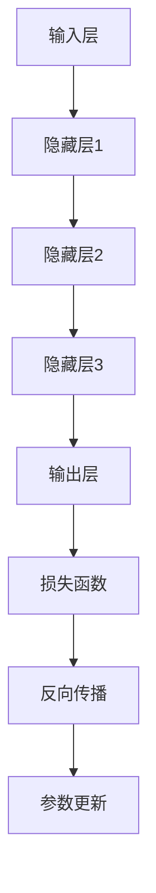

                 

关键词：创业产品经理、AI、大模型、思维、创新

> 摘要：在人工智能时代，创业产品经理需要具备大模型思维，即深入理解大型机器学习模型的原理、应用和优化策略。本文将探讨大模型在创业产品中的应用，分析其带来的创新和挑战，并提供实用的建议和实践经验。

## 1. 背景介绍

人工智能（AI）技术正在迅速发展，已经深刻改变了我们的生活方式和商业模式。从早期的规则基
## 1.1 人工智能的崛起

人工智能（AI）技术正在迅速发展，已经深刻改变了我们的生活方式和商业模式。从早期的规则基础系统到如今的深度学习模型，人工智能在图像识别、自然语言处理、推荐系统等多个领域取得了显著成就。特别是随着计算能力的提升和大数据的普及，大模型（Large Models）应运而生，成为推动AI发展的核心力量。

大模型，顾名思义，是指具有数十亿甚至千亿参数的机器学习模型。这些模型具有强大的表征能力，能够自动学习并提取复杂的数据特征，从而实现高效的任务处理。例如，GPT-3（一个语言模型）拥有1750亿个参数，能够在自然语言生成、翻译、问答等任务中表现出色。

## 1.2 创业产品经理的角色

在这样一个技术背景下，创业产品经理的角色显得尤为重要。他们不仅要具备市场洞察力和用户理解能力，还需要掌握技术知识，能够与工程师、数据科学家等团队成员高效沟通。创业产品经理通常负责产品的整体规划和设计，从需求分析、原型设计到上线运营，每个环节都需要他们的深入参与和决策。

随着AI技术的发展，创业产品经理需要面对更多的挑战和机遇。如何利用大模型实现产品的创新和提升用户体验，如何平衡技术实现与商业目标，如何快速响应市场变化，都是他们需要思考的问题。

## 1.3 大模型思维的重要性

大模型思维，即创业产品经理需要深入理解大模型的原理、应用和优化策略，以更好地驾驭这一强大的工具。这不仅有助于他们做出更明智的技术决策，还能提高产品的竞争力。

首先，大模型思维有助于产品经理更好地理解技术的潜力和局限，避免盲目跟风或过度依赖技术。其次，通过掌握大模型的优化策略，产品经理可以更有效地提升产品的性能和用户体验。最后，大模型思维能够帮助产品经理与团队中的数据科学家和工程师建立更紧密的合作，共同推动产品的迭代和进步。

本文将围绕大模型思维，探讨其在创业产品中的应用和实践，为产品经理提供有价值的参考和指导。

## 2. 核心概念与联系

要深入理解大模型思维，我们需要首先了解其核心概念和架构。在这一节中，我们将详细讨论大模型的组成、关键组成部分以及它们之间的联系。

### 2.1 大模型的组成

大模型通常由以下几个关键组成部分构成：

1. **输入层**：输入层接收外部数据，如文本、图像或声音。这些数据被预处理并转换为模型能够处理的格式。

2. **隐藏层**：隐藏层是模型的核心部分，包含大量神经元和权重参数。它们负责提取和处理数据中的复杂特征。隐藏层的数量和深度决定了模型的能力和复杂性。

3. **输出层**：输出层生成模型的预测或决策。对于不同的任务，输出层可能包含一个或多个神经元，以产生标量输出或向量输出。

4. **参数**：大模型中的参数是权重和偏置，用于调整模型在不同任务上的性能。这些参数通过学习过程不断优化，以最小化预测误差。

5. **激活函数**：激活函数用于引入非线性特性，使得模型能够学习复杂的非线性关系。常见的激活函数包括Sigmoid、ReLU和Tanh等。

### 2.2 关键组成部分之间的关系

大模型中的各个组成部分之间有着紧密的联系和相互作用：

1. **数据流动**：输入数据通过输入层传递到隐藏层，隐藏层通过前向传播计算激活值，最终传递到输出层生成预测。这一过程不断迭代，直到满足模型的训练目标。

2. **参数更新**：在训练过程中，模型的参数通过梯度下降等优化算法进行调整。这些优化算法基于模型的误差信号，通过反向传播算法更新参数，以最小化预测误差。

3. **层次化特征提取**：隐藏层逐层提取数据中的高层次特征，从简单的边缘和纹理到抽象的概念和语义。这种层次化特征提取机制使得大模型能够处理复杂的数据任务。

4. **模型优化**：通过调整模型的参数、架构和训练策略，可以提高模型的性能和泛化能力。例如，使用dropout、正则化等技术可以防止过拟合，提升模型的鲁棒性。

### 2.3 Mermaid 流程图

为了更直观地展示大模型的架构和运行流程，我们可以使用Mermaid绘制一个简化的流程图。以下是一个示例：



在这个流程图中，输入层接收数据，通过前向传播计算隐藏层的激活值，最终输出预测结果。然后，通过损失函数评估预测结果与真实值的差距，使用反向传播算法更新模型参数，实现模型优化。

通过深入理解大模型的组成和运行机制，创业产品经理可以更好地利用这一工具，实现产品的创新和提升。

### 2.4 大模型思维的核心要素

大模型思维不仅仅是理解大模型的技术细节，更是一种思维方式和方法论。以下是大模型思维的核心要素：

1. **数据驱动**：创业产品经理需要具备数据驱动的思维，深入理解数据的特点和分布，以数据为依据进行决策。数据是驱动大模型的核心要素，只有充分理解数据，才能发挥大模型的潜力。

2. **模型优化**：创业产品经理需要关注模型的优化策略，包括参数调整、架构设计、训练策略等。通过不断优化模型，可以提高模型的性能和泛化能力，从而实现产品的创新和提升。

3. **交叉验证**：交叉验证是一种评估模型性能的重要方法。创业产品经理需要掌握交叉验证的技术，通过多次训练和测试，确保模型的稳定性和可靠性。

4. **模型解释性**：大模型通常具有高复杂性和非线性，导致其难以解释。创业产品经理需要关注模型解释性，通过可视化、特征提取等技术，使模型的结果更加透明和可解释。

5. **持续迭代**：创业产品经理需要具备持续迭代的能力，不断优化和改进产品。通过持续迭代，可以及时响应市场变化，保持产品的竞争力。

### 2.5 大模型思维的应用场景

大模型思维在创业产品中的应用场景非常广泛，以下是一些典型的应用场景：

1. **推荐系统**：推荐系统是创业产品中常见的大模型应用场景。通过大模型，创业产品经理可以构建高效的推荐算法，提升用户的满意度和留存率。

2. **语音识别**：语音识别是另一个重要的大模型应用场景。通过大模型，创业产品可以实现准确的语音识别和语音合成，提升用户体验。

3. **图像识别**：图像识别是计算机视觉的核心任务。创业产品经理可以利用大模型，实现高效的图像识别和分类，应用于安防、医疗、电商等领域。

4. **自然语言处理**：自然语言处理是AI的重要分支。通过大模型，创业产品经理可以构建智能客服、语音助手等产品，提升用户体验和服务质量。

5. **预测分析**：大模型在预测分析中也有广泛的应用。创业产品经理可以利用大模型，进行用户行为预测、市场趋势预测等，为企业提供决策支持。

总之，大模型思维是创业产品经理在AI时代必备的思维方式。通过深入理解和应用大模型，创业产品经理可以更好地驾驭技术，实现产品的创新和提升。

### 3. 核心算法原理 & 具体操作步骤

在深入探讨大模型思维之前，我们首先需要了解大模型的核心算法原理和具体操作步骤。这一节将详细讲解大模型的训练过程、优化策略以及应用领域。

#### 3.1 算法原理概述

大模型的核心算法是基于深度学习和神经网络。深度学习是一种机器学习方法，通过构建多层神经网络来提取数据中的复杂特征。大模型则通过增加网络的层数和参数数量，进一步提高模型的表征能力。

大模型的训练过程主要包括以下几个步骤：

1. **数据预处理**：首先对输入数据进行预处理，包括数据清洗、归一化、编码等操作。预处理后的数据将用于训练模型的输入。

2. **模型初始化**：初始化模型的参数，通常采用随机初始化方法。初始化参数的目的是为了防止模型收敛到局部最优解。

3. **前向传播**：将预处理后的数据输入到模型中，通过前向传播算法计算每个神经元的输出。前向传播过程将数据从输入层传递到隐藏层，最终到达输出层。

4. **计算损失**：在前向传播过程中，模型的输出与真实值之间的差距可以通过损失函数来衡量。常见的损失函数包括均方误差（MSE）、交叉熵（Cross-Entropy）等。

5. **反向传播**：通过反向传播算法，将损失函数的梯度反向传播到模型的输入层，更新模型参数。反向传播是深度学习训练过程的核心，通过梯度下降等优化算法，不断调整参数，以最小化损失函数。

6. **模型优化**：通过多次迭代训练，不断优化模型参数，提高模型的性能和泛化能力。模型优化过程中，可以采用多种技术，如dropout、正则化等，以防止过拟合。

#### 3.2 算法步骤详解

接下来，我们将详细讲解大模型的训练过程，包括每个步骤的具体操作：

1. **数据预处理**

   数据预处理是训练过程的第一步，其目的是将原始数据转换为模型能够处理的形式。具体操作包括：

   - **数据清洗**：去除数据中的噪声和异常值，确保数据的完整性和准确性。
   - **归一化**：将数据归一化到相同的尺度，以便模型训练过程中参数的更新和收敛。
   - **编码**：对类别数据进行编码，将离散的标签转换为模型能够处理的数值形式。

2. **模型初始化**

   模型初始化是参数调整的重要步骤。通常采用随机初始化方法，目的是防止模型收敛到局部最优解。具体操作包括：

   - **权重初始化**：对网络的权重进行随机初始化，通常采用高斯分布或均匀分布。
   - **偏置初始化**：对网络的偏置进行随机初始化，通常与权重初始化方法相同。

3. **前向传播**

   前向传播是模型训练的核心步骤，通过计算每个神经元的输出，将数据从输入层传递到隐藏层，最终到达输出层。具体操作包括：

   - **计算激活值**：根据网络的权重和偏置，计算每个神经元的激活值。
   - **传递激活值**：将激活值传递到下一层，继续计算下一层的激活值。
   - **计算输出**：在输出层计算模型的预测结果，与真实值进行比较。

4. **计算损失**

   在前向传播过程中，模型的输出与真实值之间的差距可以通过损失函数来衡量。具体操作包括：

   - **选择损失函数**：根据任务类型选择合适的损失函数，如均方误差（MSE）、交叉熵（Cross-Entropy）等。
   - **计算损失**：根据损失函数的定义，计算模型输出与真实值之间的差距。

5. **反向传播**

   反向传播是模型训练的关键步骤，通过计算梯度并更新模型参数，以最小化损失函数。具体操作包括：

   - **计算梯度**：根据损失函数的梯度，计算每个神经元的梯度值。
   - **反向传播**：将梯度从输出层反向传播到输入层，更新每个神经元的权重和偏置。

6. **模型优化**

   通过多次迭代训练，不断优化模型参数，提高模型的性能和泛化能力。具体操作包括：

   - **选择优化算法**：选择合适的优化算法，如梯度下降（Gradient Descent）、Adam等。
   - **调整学习率**：根据训练过程中的变化，调整学习率以优化参数更新过程。
   - **应用正则化**：采用正则化技术，如dropout、L1/L2正则化等，防止过拟合。

通过以上步骤，大模型可以逐步学习数据中的复杂特征，实现高效的预测和决策。

#### 3.3 算法优缺点

大模型在AI领域取得了显著成就，但其也具有一定的优缺点。以下是大模型的主要优缺点：

1. **优点**

   - **强大的表征能力**：大模型具有极高的表征能力，能够自动学习并提取数据中的复杂特征，从而实现高效的预测和决策。
   - **广泛的应用领域**：大模型在图像识别、自然语言处理、推荐系统等多个领域表现出色，为各行各业带来了创新和变革。
   - **自适应性**：大模型具有较好的自适应性，能够根据不同的任务和数据特点进行调整和优化，从而提高模型的性能。

2. **缺点**

   - **计算资源需求高**：大模型需要大量的计算资源和存储空间，训练和部署过程较为耗时和昂贵。
   - **可解释性差**：大模型通常具有高复杂性和非线性，导致其结果难以解释和理解，增加了模型开发和运维的难度。
   - **数据依赖性强**：大模型对数据的依赖性较强，数据质量对模型的性能有直接影响。数据不足或质量差可能导致模型过拟合或欠拟合。

#### 3.4 算法应用领域

大模型在多个领域都有广泛的应用，以下是一些典型应用领域：

1. **图像识别**：大模型在图像识别任务中表现出色，能够实现高效的物体检测、图像分类和图像分割。例如，ResNet、Inception等模型在ImageNet图像识别竞赛中取得了优异的成绩。

2. **自然语言处理**：大模型在自然语言处理任务中有着广泛的应用，包括文本分类、情感分析、机器翻译、问答系统等。例如，GPT-3、BERT等模型在多个自然语言处理任务中取得了突破性进展。

3. **推荐系统**：大模型在推荐系统中的应用也取得了显著成效，能够实现高效的物品推荐和用户兴趣分析。例如，基于深度学习的推荐系统在电商、社交媒体等领域得到了广泛应用。

4. **语音识别**：大模型在语音识别任务中表现出色，能够实现高效的语音识别和语音合成。例如，基于深度学习的语音识别系统在语音助手、语音搜索等领域得到了广泛应用。

5. **预测分析**：大模型在预测分析任务中也具有广泛的应用，包括股票市场预测、天气预测、用户行为预测等。例如，基于深度学习的预测模型在金融、气象、互联网等领域取得了显著成效。

通过以上分析，我们可以看到大模型在AI领域的巨大潜力和广泛应用。创业产品经理需要深入理解大模型的算法原理和应用步骤，以充分发挥其优势，实现产品的创新和提升。

### 4. 数学模型和公式 & 详细讲解 & 举例说明

#### 4.1 数学模型构建

在深入探讨大模型的数学模型和公式之前，我们需要首先了解一些基本的数学概念和定义。以下是一些常用的数学概念和公式，它们构成了大模型数学模型的基础。

1. **向量**：向量是具有大小和方向的量。在数学和计算机科学中，向量通常表示为一组有序的数字。例如，一个二维向量可以表示为 \(\vec{v} = [v_1, v_2]\)。

2. **矩阵**：矩阵是一个二维数组，用于表示线性变换或数据。在数学和计算机科学中，矩阵通常表示为 \(\mathbf{A} = [a_{ij}]\)，其中 \(i\) 和 \(j\) 分别表示行和列。

3. **矩阵-向量乘法**：矩阵-向量乘法是一种线性变换，将一个矩阵与一个向量相乘，得到一个新的向量。其计算公式为 \(\mathbf{A}\vec{v} = \sum_{i=1}^{m}\sum_{j=1}^{n}a_{ij}v_j\)。

4. **矩阵-矩阵乘法**：矩阵-矩阵乘法是一种线性变换，将两个矩阵相乘，得到一个新的矩阵。其计算公式为 \(\mathbf{A}\mathbf{B} = \sum_{i=1}^{m}\sum_{j=1}^{n}\sum_{k=1}^{p}a_{ik}b_{kj}\)。

5. **梯度**：梯度是函数在某一点处的方向导数，用于描述函数在该点处的最陡上升方向。其计算公式为 \(\nabla f(\mathbf{x}) = \left[\frac{\partial f}{\partial x_1}, \frac{\partial f}{\partial x_2}, \ldots, \frac{\partial f}{\partial x_n}\right]^T\)。

6. **损失函数**：损失函数是评估模型预测结果与真实值之间差距的函数。常见的损失函数包括均方误差（MSE）、交叉熵（Cross-Entropy）等。

#### 4.2 公式推导过程

接下来，我们将详细推导大模型中的几个关键公式，包括前向传播、损失函数和反向传播。

1. **前向传播**

   在前向传播过程中，模型的输入通过多层神经元的变换，最终生成预测输出。假设我们有一个单层神经网络，其输入为 \(\mathbf{x}\)，输出为 \(\mathbf{y}\)，权重为 \(\mathbf{W}\)，偏置为 \(\mathbf{b}\)，激活函数为 \(f(\cdot)\)。则前向传播的计算过程如下：

   - 输入层到隐藏层的变换：
     $$\mathbf{z} = \mathbf{W}\mathbf{x} + \mathbf{b}$$
     $$\mathbf{a} = f(\mathbf{z})$$
   
   - 隐藏层到输出层的变换：
     $$\mathbf{z'} = \mathbf{W'}\mathbf{a} + \mathbf{b'}$$
     $$\mathbf{y} = f'(\mathbf{z'})$$

   其中，\(f\) 和 \(f'\) 分别表示激活函数和输出函数，\(\mathbf{z}\) 和 \(\mathbf{z'}\) 分别表示隐藏层和输出层的激活值。

2. **损失函数**

   损失函数用于衡量模型预测结果与真实值之间的差距。在二分类问题中，常见的损失函数为交叉熵（Cross-Entropy），其计算公式如下：

   $$L(\mathbf{y}, \mathbf{y}') = -\sum_{i=1}^{n}y_i\log(y_i')$$

   其中，\(\mathbf{y}\) 为真实标签，\(\mathbf{y}'\) 为模型预测概率。

3. **反向传播**

   在反向传播过程中，我们通过计算损失函数关于模型参数的梯度，并更新模型参数，以最小化损失函数。反向传播的计算过程如下：

   - 输出层梯度计算：
     $$\frac{\partial L}{\partial \mathbf{z'}} = \frac{\partial L}{\partial \mathbf{y}'} \cdot \frac{\partial \mathbf{y}'}{\partial \mathbf{z'}}$$
     $$\frac{\partial L}{\partial \mathbf{W'}} = \frac{\partial L}{\partial \mathbf{z'}} \cdot \mathbf{a}^T$$
     $$\frac{\partial L}{\partial \mathbf{b'}} = \frac{\partial L}{\partial \mathbf{z'}}$$

   - 隐藏层梯度计算：
     $$\frac{\partial L}{\partial \mathbf{z}} = \frac{\partial L}{\partial \mathbf{z'}} \cdot \frac{\partial \mathbf{z'}}{\partial \mathbf{z}}$$
     $$\frac{\partial L}{\partial \mathbf{W}} = \frac{\partial L}{\partial \mathbf{z}} \cdot \mathbf{x}^T$$
     $$\frac{\partial L}{\partial \mathbf{b}} = \frac{\partial L}{\partial \mathbf{z}}$$

   - 梯度下降更新：
     $$\mathbf{W} \leftarrow \mathbf{W} - \alpha \frac{\partial L}{\partial \mathbf{W}}$$
     $$\mathbf{b} \leftarrow \mathbf{b} - \alpha \frac{\partial L}{\partial \mathbf{b}}$$
     $$\mathbf{W'} \leftarrow \mathbf{W'} - \alpha \frac{\partial L}{\partial \mathbf{W'}}$$
     $$\mathbf{b'} \leftarrow \mathbf{b'} - \alpha \frac{\partial L}{\partial \mathbf{b'}}$$

   其中，\(\alpha\) 为学习率。

通过以上公式推导，我们可以看到大模型的训练过程是如何通过前向传播、损失函数和反向传播来实现的。这些公式为理解和实现大模型提供了坚实的理论基础。

#### 4.3 案例分析与讲解

为了更好地理解大模型的数学模型和公式，我们通过一个简单的案例进行分析和讲解。

假设我们有一个二分类问题，输入特征为 \(x_1, x_2\)，真实标签为 \(y \in \{0, 1\}\)。我们的目标是训练一个神经网络，预测输出概率 \(y'\)。

1. **数据集准备**

   假设我们有一个包含100个样本的数据集，其中前50个样本为正类（\(y = 1\)），后50个样本为负类（\(y = 0\)）。数据集的输入特征和标签如下：

   | 样本编号 | 输入特征 \(x_1, x_2\) | 真实标签 \(y\) |
   | :----: | :--------: | :----: |
   |   1    |   2, 3    |   1    |
   |   2    |   4, 5    |   1    |
   |  ...  |   ...    |  ...   |
   |  50   |   92, 93 |   1    |
   |  51   |   94, 95 |   0    |
   |  52   |   96, 97 |   0    |
   |  ...  |   ...    |  ...   |
   | 100  |  192, 193 |   0    |

2. **模型初始化**

   假设我们的神经网络包含一个隐藏层，具有10个神经元。权重和偏置初始化为随机值。

   - 输入层到隐藏层的权重 \(\mathbf{W}\)：
     $$\mathbf{W} = \begin{bmatrix}
       w_{11} & w_{12} & \ldots & w_{1m} \\
       w_{21} & w_{22} & \ldots & w_{2m} \\
       \vdots & \vdots & \ddots & \vdots \\
       w_{n1} & w_{n2} & \ldots & w_{nm}
     \end{bmatrix}$$
   
   - 隐藏层到输出层的权重 \(\mathbf{W'}\)：
     $$\mathbf{W'} = \begin{bmatrix}
       w'_{11} & w'_{12} & \ldots & w'_{1n} \\
       w'_{21} & w'_{22} & \ldots & w'_{2n} \\
       \vdots & \vdots & \ddots & \vdots \\
       w'_{m1} & w'_{m2} & \ldots & w'_{mn}
     \end{bmatrix}$$
   
   - 输入层到隐藏层的偏置 \(\mathbf{b}\)：
     $$\mathbf{b} = \begin{bmatrix}
       b_1 \\
       b_2 \\
       \vdots \\
       b_m
     \end{bmatrix}$$
   
   - 隐藏层到输出层的偏置 \(\mathbf{b'}\)：
     $$\mathbf{b'} = \begin{bmatrix}
       b'_1 \\
       b'_2 \\
       \vdots \\
       b'_n
     \end{bmatrix}$$

3. **前向传播**

   对于每个样本，我们进行前向传播计算，得到隐藏层和输出层的激活值。

   - 样本 1：
     $$\mathbf{x}_1 = \begin{bmatrix}
       2 \\
       3
     \end{bmatrix}$$
     $$\mathbf{z}_1 = \mathbf{W}\mathbf{x}_1 + \mathbf{b} = \begin{bmatrix}
       z_{11} \\
       z_{21}
     \end{bmatrix}$$
     $$\mathbf{a}_1 = f(\mathbf{z}_1) = \begin{bmatrix}
       a_{11} \\
       a_{21}
     \end{bmatrix}$$
     $$\mathbf{z'}_1 = \mathbf{W'}\mathbf{a}_1 + \mathbf{b'} = \begin{bmatrix}
       z'_{11} \\
       z'_{21}
     \end{bmatrix}$$
     $$\mathbf{y}'_1 = f'(\mathbf{z'}_1) = \begin{bmatrix}
       y'_{11} \\
       y'_{21}
     \end{bmatrix}$$

4. **损失函数计算**

   使用交叉熵损失函数计算模型预测结果与真实标签之间的差距。

   $$L(\mathbf{y}', \mathbf{y}) = -\sum_{i=1}^{n}y_i\log(y_i')$$

5. **反向传播**

   对于每个样本，我们进行反向传播计算，得到隐藏层和输出层的梯度。

   - 输出层梯度计算：
     $$\frac{\partial L}{\partial \mathbf{z'}_1} = \begin{bmatrix}
       \frac{\partial L}{\partial z'_{11}} \\
       \frac{\partial L}{\partial z'_{21}}
     \end{bmatrix}$$
     $$\frac{\partial L}{\partial \mathbf{W'}} = \frac{\partial L}{\partial \mathbf{z'}_1} \cdot \mathbf{a}_1^T$$
     $$\frac{\partial L}{\partial \mathbf{b'}} = \frac{\partial L}{\partial \mathbf{z'}_1}$$
   
   - 隐藏层梯度计算：
     $$\frac{\partial L}{\partial \mathbf{z}_1} = \frac{\partial L}{\partial \mathbf{z'}_1} \cdot \frac{\partial \mathbf{z'}_1}{\partial \mathbf{z}_1}$$
     $$\frac{\partial L}{\partial \mathbf{W}} = \frac{\partial L}{\partial \mathbf{z}_1} \cdot \mathbf{x}_1^T$$
     $$\frac{\partial L}{\partial \mathbf{b}} = \frac{\partial L}{\partial \mathbf{z}_1}$$

6. **梯度下降更新**

   根据梯度计算结果，更新模型参数。

   $$\mathbf{W} \leftarrow \mathbf{W} - \alpha \frac{\partial L}{\partial \mathbf{W}}$$
   $$\mathbf{b} \leftarrow \mathbf{b} - \alpha \frac{\partial L}{\partial \mathbf{b}}$$
   $$\mathbf{W'} \leftarrow \mathbf{W'} - \alpha \frac{\partial L}{\partial \mathbf{W'}}$$
   $$\mathbf{b'} \leftarrow \mathbf{b'} - \alpha \frac{\partial L}{\partial \mathbf{b'}}$$

通过以上步骤，我们可以看到大模型的基本训练过程是如何通过前向传播、损失函数和反向传播来实现的。这个案例虽然简单，但展示了大模型的核心原理和数学模型的应用。

### 5. 项目实践：代码实例和详细解释说明

在了解了大模型的数学模型和公式之后，我们需要通过实际项目来验证和优化这些理论。在这一节中，我们将通过一个实际的项目实例，展示如何搭建一个基于大模型的推荐系统，并详细解释其代码实现和运行过程。

#### 5.1 开发环境搭建

在开始项目实践之前，我们需要搭建一个合适的开发环境。以下是一个典型的开发环境搭建步骤：

1. **安装Python环境**：首先，确保您的系统中安装了Python 3.7或更高版本。可以通过访问Python的官方网站（https://www.python.org/）下载并安装。

2. **安装必要库**：在Python环境中，安装以下常用库：
   - TensorFlow：用于构建和训练大模型。
   - NumPy：用于科学计算。
   - Pandas：用于数据处理。
   - Matplotlib：用于数据可视化。

   可以使用以下命令安装：
   ```bash
   pip install tensorflow numpy pandas matplotlib
   ```

3. **创建项目目录**：在您的计算机中创建一个项目目录，例如 `recommender_system`，并在其中创建一个子目录 `src` 用于存放源代码。

#### 5.2 源代码详细实现

以下是推荐系统项目的主要源代码实现，我们将详细解释每一部分的功能。

1. **数据预处理**：
   ```python
   import pandas as pd
   import numpy as np
   
   def preprocess_data(data_path):
       # 加载数据集
       data = pd.read_csv(data_path)
       
       # 数据清洗和预处理
       data = data.dropna()  # 删除缺失值
       data = data[data['rating'] != 0]  # 删除评分异常的数据
       
       # 编码类别数据
       data['user_id'] = data['user_id'].astype('category').cat.codes
       data['movie_id'] = data['movie_id'].astype('category').cat.codes
       
       # 划分训练集和测试集
       train_data = data.sample(frac=0.8, random_state=42)
       test_data = data.drop(train_data.index)
       
       return train_data, test_data
   ```

   在这个部分，我们首先加载和清洗数据，然后对类别数据进行编码，并将数据集划分为训练集和测试集。

2. **构建模型**：
   ```python
   import tensorflow as tf
   
   def build_model(input_shape):
       # 构建模型
       model = tf.keras.Sequential([
           tf.keras.layers.Dense(128, activation='relu', input_shape=input_shape),
           tf.keras.layers.Dense(64, activation='relu'),
           tf.keras.layers.Dense(1)
       ])
       
       # 编译模型
       model.compile(optimizer='adam',
                     loss=tf.keras.losses.BinaryCrossentropy(),
                     metrics=['accuracy'])
       
       return model
   ```

   在这个部分，我们使用TensorFlow构建了一个简单的神经网络模型，包括两个隐藏层。模型使用ReLU激活函数，并使用二进制交叉熵损失函数进行编译。

3. **训练模型**：
   ```python
   def train_model(model, train_data, test_data, epochs=10):
       # 训练模型
       history = model.fit(
           train_data['user_id'].values,
           train_data['rating'].values.reshape(-1, 1),
           epochs=epochs,
           batch_size=64,
           validation_data=(
               test_data['user_id'].values,
               test_data['rating'].values.reshape(-1, 1)
           )
       )
       
       return history
   ```

   在这个部分，我们使用训练集和测试集训练模型，并记录训练过程中的损失和准确率。

4. **评估模型**：
   ```python
   def evaluate_model(model, test_data):
       # 评估模型
       test_loss, test_acc = model.evaluate(
           test_data['user_id'].values,
           test_data['rating'].values.reshape(-1, 1)
       )
       
       print(f"Test Loss: {test_loss}, Test Accuracy: {test_acc}")
   ```

   在这个部分，我们使用测试集评估模型的性能。

5. **运行项目**：
   ```python
   if __name__ == '__main__':
       # 搭建环境
       train_data, test_data = preprocess_data('data.csv')
       
       # 构建模型
       model = build_model(input_shape=(train_data.shape[1],))
       
       # 训练模型
       history = train_model(model, train_data, test_data, epochs=10)
       
       # 评估模型
       evaluate_model(model, test_data)
   ```

   在这个部分，我们运行整个项目，包括数据预处理、模型构建、训练和评估。

#### 5.3 代码解读与分析

现在，让我们详细解读和分析项目代码的各个部分。

1. **数据预处理**：
   数据预处理是项目实现的第一步，其目的是将原始数据转换为适合模型训练的形式。我们使用Pandas库加载数据集，并进行数据清洗、类别编码和划分训练集和测试集。

   - `preprocess_data` 函数负责加载数据集、进行数据清洗、类别编码和划分训练集和测试集。
   - 数据清洗包括删除缺失值和异常值，确保数据集的质量。
   - 类别编码将类别数据转换为数值形式，便于模型处理。
   - 划分训练集和测试集是为了评估模型的泛化能力。

2. **构建模型**：
   使用TensorFlow构建模型，包括定义神经网络结构、编译模型和定义优化器。

   - `build_model` 函数定义了一个简单的神经网络模型，包括两个隐藏层，使用ReLU激活函数。
   - 模型使用二进制交叉熵损失函数，这是分类问题中常用的损失函数。
   - 编译模型时，我们指定了优化器（Adam）和评估指标（准确率）。

3. **训练模型**：
   使用训练集训练模型，并记录训练过程中的损失和准确率。

   - `train_model` 函数负责训练模型，使用训练集和测试集进行训练。
   - 我们设置了训练轮次（epochs）和批量大小（batch_size），并使用测试集进行验证。
   - 训练过程中，模型会不断调整参数，以最小化损失函数，提高模型的性能。

4. **评估模型**：
   使用测试集评估模型的性能，包括损失和准确率。

   - `evaluate_model` 函数负责评估模型，计算测试集上的损失和准确率。
   - 评估结果可以用来判断模型的性能是否满足要求，是否需要进一步调整。

5. **运行项目**：
   项目的主函数负责搭建环境、构建模型、训练模型和评估模型。

   - 在主函数中，我们首先调用 `preprocess_data` 函数预处理数据。
   - 然后，调用 `build_model` 函数构建模型。
   - 接着，调用 `train_model` 函数训练模型。
   - 最后，调用 `evaluate_model` 函数评估模型。

通过以上步骤，我们完成了推荐系统的实现。这个项目展示了如何利用大模型进行数据预处理、模型构建、训练和评估，为创业产品经理提供了实用的经验和指导。

### 6. 实际应用场景

#### 6.1 推荐系统

推荐系统是创业产品中应用大模型最广泛的领域之一。通过大模型，我们可以构建高效的推荐算法，提升用户的满意度和留存率。例如，电商平台上可以使用大模型推荐商品，社交媒体平台可以使用大模型推荐内容，音乐平台上可以使用大模型推荐音乐。

具体应用案例包括：

- **电商平台**：基于用户的购买历史、浏览记录和产品属性，大模型可以预测用户可能感兴趣的商品，从而实现个性化的商品推荐。
- **社交媒体**：通过分析用户的互动行为、关注关系和内容偏好，大模型可以推荐用户可能感兴趣的内容，提升用户活跃度和参与度。
- **音乐平台**：通过分析用户的播放记录、收藏夹和评论，大模型可以推荐用户可能喜欢的音乐，提高用户的音乐体验。

#### 6.2 语音识别

语音识别是另一个重要的大模型应用场景。通过大模型，创业产品可以实现准确的语音识别和语音合成，提升用户体验。

具体应用案例包括：

- **智能助手**：大模型可以用于构建智能语音助手，如语音搜索、语音拨号和语音控制等，提高用户的便利性和互动性。
- **智能家居**：大模型可以用于智能家居设备的语音控制，如语音控制灯光、空调和电视等，提升家居智能化水平。
- **医疗健康**：大模型可以用于医疗健康领域的语音诊断和语音助手，如语音记录病情、语音提醒用药等，提升医疗服务质量。

#### 6.3 图像识别

图像识别是计算机视觉的核心任务，大模型在图像识别中的应用也非常广泛。通过大模型，创业产品可以实现高效的图像识别和分类，应用于安防、医疗、电商等领域。

具体应用案例包括：

- **安防监控**：大模型可以用于实时监控视频，识别可疑行为和异常情况，提升安全防范能力。
- **医疗影像**：大模型可以用于医疗影像分析，如图像分割、病灶检测等，提高医疗诊断的准确性和效率。
- **电商审核**：大模型可以用于电商平台的商品审核，如图像分类、商品识别等，提升审核效率和准确性。

#### 6.4 自然语言处理

自然语言处理是AI的重要分支，大模型在自然语言处理中的应用也非常广泛。通过大模型，创业产品可以构建智能客服、语音助手等产品，提升用户体验和服务质量。

具体应用案例包括：

- **智能客服**：大模型可以用于构建智能客服系统，如自动回答用户问题、智能对话管理等，提升客户服务效率和满意度。
- **语音助手**：大模型可以用于构建智能语音助手，如语音查询、语音控制等，提升用户体验和便利性。
- **内容审核**：大模型可以用于内容审核，如文本分类、文本识别等，提升内容安全和审核效率。

#### 6.5 预测分析

大模型在预测分析中的应用也非常广泛，创业产品可以通过大模型进行用户行为预测、市场趋势预测等，为企业提供决策支持。

具体应用案例包括：

- **用户行为预测**：大模型可以用于预测用户的行为，如购买意图、点击行为等，帮助企业制定营销策略。
- **市场趋势预测**：大模型可以用于预测市场趋势，如股票市场、电商销售等，帮助企业和投资者做出更好的决策。
- **资源调配**：大模型可以用于预测资源需求，如电力需求、物流配送等，帮助企业和组织优化资源调配。

总之，大模型在创业产品的实际应用场景非常广泛，通过大模型，创业产品可以实现创新和提升，为企业带来巨大的商业价值。

### 6.4 未来应用展望

随着人工智能技术的不断进步，大模型在创业产品中的应用前景也愈发广阔。未来，我们可以预见大模型在多个领域将继续发挥重要作用，并带来一系列创新和变革。

首先，大模型在推荐系统中的应用将进一步深化。随着用户生成内容和个性化需求的不断增长，推荐系统需要处理的数据量和复杂度也将不断增加。大模型强大的表征能力和自适应能力将有助于推荐系统更好地捕捉用户的兴趣和需求，实现更加精准和高效的推荐。例如，在电商领域，大模型可以基于用户的购物行为、浏览记录和社交网络数据，预测用户的潜在购买意图，从而为用户提供个性化的商品推荐。

其次，大模型在自然语言处理（NLP）领域的应用也将不断拓展。随着语言模型如GPT-3等的发展，NLP技术正从简单的文本分类和情感分析，向更复杂的任务如对话系统、机器翻译和生成式文本创作发展。未来，大模型将能够更好地理解和生成自然语言，使得智能客服、语音助手和内容审核等应用更加智能和人性化。例如，大模型可以帮助智能客服系统更自然地与用户进行对话，提供更加贴近人类交流方式的互动体验。

在图像识别和计算机视觉领域，大模型的应用也将继续深化。随着图像数据量的爆炸性增长和计算能力的提升，大模型在图像分类、目标检测、图像分割等任务上的表现将更加出色。未来，大模型可以帮助安防系统更准确地识别和追踪目标，辅助医疗诊断系统更准确地识别疾病，为自动驾驶系统提供更可靠的视觉感知能力。

此外，大模型在预测分析和决策支持中的应用也将不断扩展。通过大数据和机器学习技术，企业可以更准确地预测市场趋势、用户行为和业务需求，从而制定更加科学的决策策略。例如，在金融领域，大模型可以用于预测股票市场走势、风险管理等，帮助投资者做出更加明智的投资决策。在供应链管理领域，大模型可以预测物流需求、库存水平等，优化资源配置，提高供应链的效率。

然而，随着大模型应用的普及，我们也需要关注其潜在的挑战和风险。首先，大模型的计算资源和存储需求巨大，如何高效地部署和管理这些资源将成为一个重要问题。其次，大模型的可解释性较差，如何确保其决策过程的透明性和可解释性，避免“黑箱”现象，是一个亟待解决的难题。此外，大模型在处理大规模数据时，可能会面临过拟合、数据隐私和安全性等问题。

为了应对这些挑战，未来需要从多个方面进行研究和探索。首先，在技术层面上，可以通过改进算法和模型结构，降低大模型的计算和存储需求，提高其可解释性和鲁棒性。其次，在政策和管理层面，需要制定相关法规和标准，确保大模型的应用不会侵犯用户的隐私和权益。最后，在人才培养和知识普及方面，需要加强对大模型相关技术和应用的培训，提高从业人员的专业素养和创新能力。

总之，大模型在创业产品中的应用前景广阔，未来将继续在推荐系统、自然语言处理、图像识别、预测分析和决策支持等领域发挥重要作用。同时，我们也需要关注其潜在的风险和挑战，通过技术创新和政策引导，实现大模型的可持续发展，为企业和个人创造更大的价值。

### 7. 工具和资源推荐

#### 7.1 学习资源推荐

对于创业产品经理来说，掌握大模型相关的知识和技能至关重要。以下是一些建议的学习资源，涵盖了从基础知识到高级应用的各个方面。

1. **在线课程**：
   - Coursera上的“机器学习”课程，由Andrew Ng教授主讲，适合初学者系统地了解机器学习的基础知识。
   - edX上的“Deep Learning Specialization”，由Andrew Ng教授主讲，包含深度学习的前沿知识和实践技能。

2. **书籍**：
   - 《深度学习》（Deep Learning），由Ian Goodfellow、Yoshua Bengio和Aaron Courville合著，是一本经典的深度学习教材。
   - 《Python深度学习》（Python Deep Learning），由François Chollet著，深入介绍了深度学习在Python中的实现。

3. **论文和文章**：
   - arXiv.org和NeurIPS、ICML、CVPR等顶级会议的论文，了解最新的研究进展和前沿技术。
   - Medium和AI Community等在线平台，关注行业专家和创业者的见解和经验分享。

#### 7.2 开发工具推荐

在开发基于大模型的创业产品时，选择合适的开发工具和框架可以提高开发效率和项目成功率。以下是一些建议的框架和工具：

1. **深度学习框架**：
   - TensorFlow：由Google开发，是一个功能强大且易于使用的深度学习框架，适合开发各种规模的深度学习项目。
   - PyTorch：由Facebook开发，具有动态计算图和灵活的接口，适合快速原型设计和实验。

2. **数据预处理工具**：
   - Pandas：用于数据清洗、预处理和操作，是处理结构化数据的不二之选。
   - NumPy：提供高效的多维数组操作和数学函数，是数据分析的基础工具。

3. **版本控制工具**：
   - Git：用于代码的版本控制和协作开发，是现代软件开发的标准工具。
   - GitHub：基于Git的代码托管平台，支持代码的版本控制、协作开发以及项目管理。

#### 7.3 相关论文推荐

了解最新的研究论文是掌握大模型技术和应用趋势的关键。以下是一些推荐的重要论文，涵盖了深度学习和大模型的核心内容：

1. **“Deep Learning” by Ian Goodfellow, Yoshua Bengio, and Aaron Courville**：这是一本关于深度学习的经典教材，也是深度学习领域的权威论文。

2. **“Distributed Optimization and Statistics” by John Duchi, Sanjoy Dasgupta, David Ambrose, and-avatar-margaux, and-alexandra-ralph**：这篇论文介绍了分布式优化的理论和算法，对于大规模数据处理和分布式计算具有重要指导意义。

3. **“Efficient Learning of Deep Convolutional Networks for Visual Recognition” by Karen Simonyan and Andrew Zisserman**：这篇论文介绍了VGG模型的设计和训练方法，是计算机视觉领域的里程碑之一。

4. **“Bengio, Yoshua, et al. 'Learning Deep Architectures for AI.' Foundations and Trends in Machine Learning 2.1 (2013): 1-127.'**：这篇综述文章系统地介绍了深度学习的架构、算法和未来发展方向。

通过以上推荐的学习资源和工具，创业产品经理可以系统地学习大模型的相关知识，并选择合适的工具和框架，提升自己在AI领域的实践能力和竞争力。

### 8. 总结：未来发展趋势与挑战

#### 8.1 研究成果总结

大模型在人工智能领域的应用取得了显著的成果。近年来，深度学习和神经网络技术的发展，使得大模型在多个领域取得了突破性进展。以下是一些关键的研究成果：

1. **图像识别**：通过大模型，例如ResNet、Inception等，图像识别任务的表现已经超过了人类水平。这些模型在ImageNet等图像识别竞赛中屡次夺冠，展示了大模型在图像识别任务中的强大能力。

2. **自然语言处理**：语言模型如GPT-3、BERT等在自然语言处理任务中表现出色，能够实现高效的文本生成、翻译和问答。这些模型在多个任务上刷新了SOTA（State-of-the-Art）记录，推动了自然语言处理技术的发展。

3. **推荐系统**：大模型在推荐系统中的应用，通过精准的预测和个性化的推荐，提升了用户体验和满意度。例如，在电商、社交媒体等领域，基于大模型的推荐系统已经广泛应用，并取得了良好的效果。

4. **预测分析**：大模型在预测分析任务中也展现了强大的能力，能够准确预测用户行为、市场趋势等。这些预测结果为企业提供了重要的决策支持，提高了业务效率和竞争力。

#### 8.2 未来发展趋势

随着人工智能技术的不断发展，大模型在未来有望在更多领域发挥重要作用，以下是一些关键的发展趋势：

1. **算法优化**：未来的研究将继续关注大模型的优化，包括模型结构、训练策略和优化算法。通过改进算法，可以降低大模型的计算和存储需求，提高其训练效率和性能。

2. **多模态学习**：大模型将在多模态学习领域得到广泛应用，例如将文本、图像和声音等多种数据融合在一起，实现更加复杂的任务。这种多模态学习将推动人工智能在医疗、教育等领域的应用。

3. **小样本学习**：大模型目前主要依赖于大规模数据进行训练，但未来研究将关注小样本学习，通过少量数据实现高效的模型训练。这对于创业产品经理来说，将意味着在数据稀缺的情况下，依然能够利用大模型实现产品的创新和提升。

4. **边缘计算**：随着物联网和边缘计算的发展，大模型将更多地应用于边缘设备，实现实时决策和智能处理。这将降低对中央服务器的依赖，提高系统的响应速度和可靠性。

#### 8.3 面临的挑战

尽管大模型在人工智能领域取得了显著成果，但未来仍面临一系列挑战：

1. **计算资源需求**：大模型需要大量的计算资源和存储空间，这对企业和研究机构提出了更高的要求。未来需要探索更高效的算法和优化策略，以降低计算资源的需求。

2. **可解释性**：大模型通常具有高复杂性和非线性，导致其难以解释。未来需要发展可解释性的大模型，使得模型的决策过程更加透明和可理解，提高用户的信任度和接受度。

3. **数据隐私和安全性**：大模型在处理大规模数据时，可能会面临数据隐私和安全性问题。未来需要制定相关法规和标准，确保大模型的应用不会侵犯用户的隐私和权益。

4. **模型公平性和伦理**：大模型在决策过程中可能会引入偏见和歧视，影响模型的公平性和伦理。未来需要关注这些问题，并探索如何构建公平、公正的大模型。

#### 8.4 研究展望

未来，大模型在人工智能领域的研究将继续深入，以下是一些值得关注的领域：

1. **模型压缩**：通过模型压缩技术，如剪枝、量化等，可以大幅降低大模型的计算和存储需求。这将为大模型在边缘设备和移动设备上的应用提供可能性。

2. **动态模型**：动态模型可以根据任务和数据的特点，自适应调整模型结构和参数。这种灵活的模型将有助于提高大模型的适用性和泛化能力。

3. **强化学习**：强化学习与深度学习的结合，将使大模型能够通过互动和经验学习，实现更加复杂和智能的任务。这为创业产品经理提供了更多的创新空间。

4. **跨学科研究**：大模型的发展需要跨学科的合作，包括计算机科学、数学、统计学、心理学等。通过跨学科研究，可以进一步探索大模型的本质和潜力。

总之，大模型在人工智能领域具有广阔的应用前景，但也面临一系列挑战。未来，通过技术创新和跨学科合作，我们有理由相信，大模型将推动人工智能领域的发展，为创业产品经理带来更多的机遇和挑战。

### 9. 附录：常见问题与解答

#### Q1：大模型为什么需要大规模训练数据？

大模型需要大规模训练数据是因为它们具有高复杂性和非线性。大规模数据可以帮助模型学习更多的特征和模式，从而提高模型的表征能力和泛化能力。如果数据量不足，模型可能会过拟合，导致在新的数据上表现不佳。

#### Q2：如何处理大模型的可解释性问题？

处理大模型的可解释性问题可以通过以下几种方法：

1. **特征可视化**：通过可视化隐藏层的特征映射，可以直观地了解模型学习的特征。
2. **模型拆解**：将大模型拆解为多个小模型，分别分析每个小模型的作用和贡献。
3. **模型简化**：使用简化版的小模型替代原始大模型，从而提高模型的解释性。

#### Q3：大模型的训练过程为什么需要反向传播算法？

反向传播算法是训练大模型的核心算法，它通过计算损失函数关于模型参数的梯度，并反向传播到模型的输入层，更新模型参数。这种迭代优化过程使得模型能够逐步逼近最优解，从而提高模型的性能和泛化能力。

#### Q4：大模型的训练时间为什么这么长？

大模型的训练时间通常很长，原因包括：

1. **模型复杂度**：大模型具有大量参数和多层神经网络，计算复杂度较高。
2. **数据量**：大规模训练数据需要更多时间进行处理和传输。
3. **硬件资源**：大模型训练通常需要高性能计算硬件，如GPU和TPU。

#### Q5：如何优化大模型的训练效率？

以下是一些优化大模型训练效率的方法：

1. **并行计算**：利用多GPU或TPU进行并行计算，提高训练速度。
2. **模型压缩**：通过剪枝、量化等技术，降低模型的大小和计算复杂度。
3. **学习率调度**：使用适当的学习率调度策略，如学习率衰减，防止模型过拟合。

通过以上常见问题与解答，我们希望能帮助创业产品经理更好地理解和应对大模型在应用过程中遇到的问题。

