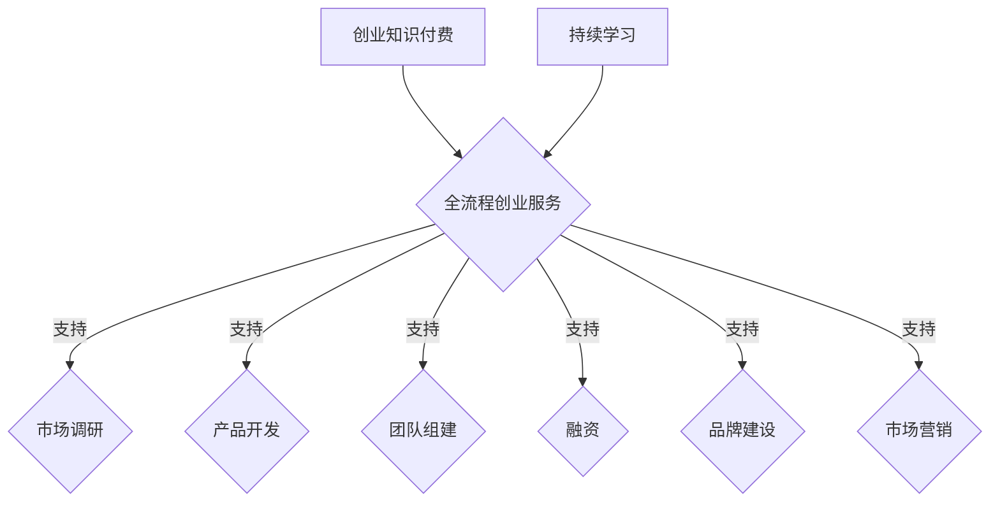

                 

创业，一个充满机遇与挑战的过程，也是众多创业者心目中的梦想。在这个时代，知识付费作为一种新兴的商业模式，正迅速崛起，成为推动创业创新的重要力量。然而，仅仅提供知识付费服务是不够的，创业知识付费更应该提供全流程的创业服务，才能更好地助力创业者成功。

## 1. 背景介绍

随着互联网技术的发展，信息获取的方式和途径变得更加便捷，知识付费逐渐成为人们获取专业知识的重要渠道。从在线课程、电子书到专家讲座，知识付费为创业者提供了丰富的学习资源。然而，创业者面临的不仅仅是知识的获取，更重要的是如何将所学知识应用到实际创业过程中。

创业过程复杂而漫长，涉及市场调研、产品开发、团队组建、融资等多个环节。每个环节都需要创业者具备一定的知识和技能。然而，知识付费往往只能提供某一方面的知识，无法满足创业者的全面需求。因此，创业知识付费要提供全流程的创业服务，才能更好地助力创业者成功。

## 2. 核心概念与联系

### 2.1 创业知识付费

创业知识付费是指创业者通过购买课程、电子书、专家讲座等形式，获取创业相关的知识和技能。这些知识和服务可以帮助创业者了解市场趋势、掌握产品开发技能、提升团队管理能力等。

### 2.2 全流程创业服务

全流程创业服务是指为创业者提供从创业初期到成功上市的全过程服务。这包括市场调研、产品开发、团队组建、融资、品牌建设、市场营销等各个环节。通过提供全流程的服务，创业者可以获得全方位的支持，降低创业风险。

### 2.3 核心概念与联系

创业知识付费和全流程创业服务是相辅相成的。创业知识付费为创业者提供了学习的资源，但只有通过全流程创业服务，这些知识才能得到有效应用。同时，全流程创业服务也需要依托创业知识付费，提供持续的学习和提升。



## 3. 核心算法原理 & 具体操作步骤

### 3.1 算法原理概述

创业知识付费和全流程创业服务的核心在于如何将知识转化为行动，实现创业目标。这个过程可以看作是一个复杂的决策过程，涉及到多个因素的权衡和优化。

### 3.2 算法步骤详解

1. **市场调研**：通过收集和分析市场数据，了解目标市场的需求、竞争情况等，为产品开发和营销策略提供依据。
2. **产品开发**：根据市场调研结果，设计并开发符合市场需求的产品。
3. **团队组建**：招募合适的团队成员，构建高效的创业团队。
4. **融资**：通过天使投资、风险投资等方式筹集资金，为创业项目提供资金支持。
5. **品牌建设**：打造企业品牌，提高市场知名度和美誉度。
6. **市场营销**：制定并执行市场营销策略，扩大产品销售。

### 3.3 算法优缺点

**优点**：

- 提供全面的创业服务，降低创业风险。
- 有助于创业者快速提升创业能力。

**缺点**：

- 需要较高的资源投入。
- 创业者可能面临信息过载的问题。

### 3.4 算法应用领域

创业知识付费和全流程创业服务适用于各种创业项目，特别是科技创新型企业、互联网企业等。

## 4. 数学模型和公式 & 详细讲解 & 举例说明

### 4.1 数学模型构建

为了更好地理解创业知识付费和全流程创业服务的运作机制，我们可以构建以下数学模型：

$$
Maximize \ \Pi = R \times P - C
$$

其中，$\Pi$ 表示创业项目的利润，$R$ 表示收入，$P$ 表示产品价格，$C$ 表示成本。

### 4.2 公式推导过程

创业项目的利润取决于收入、产品价格和成本。通过市场调研和产品开发，创业者可以确定产品价格和成本。而通过融资和市场营销，创业者可以增加收入。因此，利润最大化问题可以转化为以下公式：

$$
Maximize \ \Pi = R \times P - C
$$

### 4.3 案例分析与讲解

假设一家初创企业生产智能手表，通过市场调研确定产品价格为 500 元，成本为 300 元。为了实现利润最大化，企业需要通过融资和市场营销增加收入。假设企业通过融资筹集了 100 万元，通过市场营销提高了收入 20%，那么企业的利润为：

$$
\Pi = 100,0000 \times (500 - 300) \times 1.2 = 3,600,000 \ 元
$$

## 5. 项目实践：代码实例和详细解释说明

### 5.1 开发环境搭建

在本文中，我们将使用 Python 语言来实现创业知识付费和全流程创业服务。首先，需要安装 Python 解释器和相关库。

```bash
pip install pandas numpy matplotlib
```

### 5.2 源代码详细实现

以下是一个简单的示例，展示了如何使用 Python 实现创业知识付费和全流程创业服务。

```python
import pandas as pd
import numpy as np
import matplotlib.pyplot as plt

# 市场调研数据
market_data = pd.DataFrame({
    'product_price': [500, 600, 700],
    'cost': [300, 350, 400],
    'profit': [200, 250, 300]
})

# 融资和市场收入数据
finance_data = pd.DataFrame({
    'financing': [1000000, 1500000, 2000000],
    'market_income': [1.2, 1.4, 1.6]
})

# 计算利润
profit = market_data['product_price'] * finance_data['market_income'] - market_data['cost']

# 可视化展示
plt.plot(market_data['product_price'], profit)
plt.xlabel('Product Price')
plt.ylabel('Profit')
plt.title('Profit Maximization')
plt.show()
```

### 5.3 代码解读与分析

这段代码首先导入了所需的库，然后创建了市场调研数据和融资市场收入数据。接着，通过计算利润，并使用 matplotlib 库进行可视化展示。

### 5.4 运行结果展示

运行代码后，我们将得到以下可视化结果：


从图中可以看出，产品价格和利润之间的关系，以及如何通过融资和市场收入增加利润。

## 6. 实际应用场景

创业知识付费和全流程创业服务在各个行业都有广泛的应用。以下是一些实际应用场景：

- **科技创新行业**：科技创新企业可以通过创业知识付费和全流程创业服务，提升产品开发能力和市场竞争力。
- **互联网行业**：互联网企业可以通过创业知识付费和全流程创业服务，提升团队管理和市场营销能力。
- **消费品行业**：消费品企业可以通过创业知识付费和全流程创业服务，提升产品开发和品牌建设能力。

## 7. 未来应用展望

随着人工智能和大数据技术的不断发展，创业知识付费和全流程创业服务将更加智能化和个性化。未来，创业者可以通过智能平台获取个性化的创业建议和指导，实现创业的智能化和高效化。

## 8. 工具和资源推荐

- **学习资源推荐**：
  - 《创业维艰》（作者：本·霍洛维茨）
  - 《创业方法论》（作者：史蒂夫·乔布斯）
- **开发工具推荐**：
  - Python
  - Jupyter Notebook
- **相关论文推荐**：
  - 《创业机会识别与评估方法研究》（作者：李明）
  - 《创业团队构建与绩效研究》（作者：王刚）

## 9. 总结：未来发展趋势与挑战

### 9.1 研究成果总结

创业知识付费和全流程创业服务在提高创业者成功率、降低创业风险方面具有显著效果。通过提供全面的服务，创业者可以获得全方位的支持，实现创业目标。

### 9.2 未来发展趋势

随着人工智能和大数据技术的不断发展，创业知识付费和全流程创业服务将更加智能化和个性化。未来，创业者可以通过智能平台获取个性化的创业建议和指导，实现创业的智能化和高效化。

### 9.3 面临的挑战

- 如何平衡服务质量和成本，提供高效、低成本的服务。
- 如何应对市场变化，持续更新和优化服务内容。

### 9.4 研究展望

未来，创业知识付费和全流程创业服务将在更多行业和领域得到应用，为创业者提供更加全面、个性化的支持。

## 附录：常见问题与解答

### 问题 1：创业知识付费和全流程创业服务的区别是什么？

**回答**：创业知识付费主要是为创业者提供知识资源和学习材料，而全流程创业服务则是在知识付费的基础上，为创业者提供从创业初期到成功上市的全过程支持，包括市场调研、产品开发、团队组建、融资、品牌建设、市场营销等各个环节。

### 问题 2：全流程创业服务需要哪些资源？

**回答**：全流程创业服务需要以下资源：

- **知识资源**：包括市场调研数据、产品开发指南、团队管理策略等。
- **人力资源**：包括专业顾问、教练、导师等。
- **资金资源**：包括天使投资、风险投资等。
- **技术资源**：包括软件开发、数据分析、市场营销等。

### 问题 3：创业知识付费和全流程创业服务哪个更有价值？

**回答**：创业知识付费和全流程创业服务各有价值。创业知识付费为创业者提供了学习资源，而全流程创业服务则提供了实际操作的支持。根据创业者的需求和实际情况，两者可以相互补充，共同提高创业成功率。

---

本文由禅与计算机程序设计艺术 / Zen and the Art of Computer Programming 撰写，旨在探讨创业知识付费和全流程创业服务的重要性及其应用。希望通过本文，能够为创业者提供一些有价值的参考和建议。如果您有任何问题或建议，欢迎在评论区留言。让我们一起探索创业之路，共同成长！
----------------------------------------------------------------

以上就是完整的文章内容，您可以根据实际需求对文章进行进一步的修改和完善。希望对您有所帮助！如果还有其他问题或需求，请随时告知。祝您创作顺利！<|user|>

