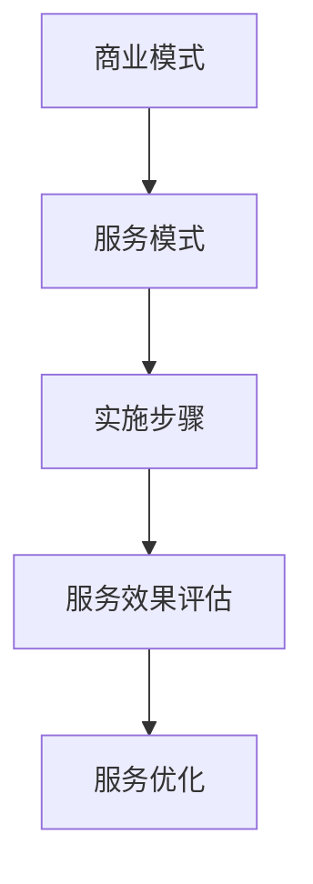

                 

关键词：开源项目，企业支持服务，模式，实施，开源社区，商业模式，技术支持，项目管理

> 摘要：本文旨在探讨如何为开源项目提供有效的企业支持服务，包括商业模式、服务模式、实施步骤和成功案例。通过分析开源项目的特性和需求，提出了一系列切实可行的策略和方案，以帮助企业更好地参与开源社区，推动项目的可持续发展和创新。

## 1. 背景介绍

开源项目已经成为现代软件开发的重要驱动力。它们不仅能够激发开发者的创造力，还促进了技术知识的共享与传播。然而，随着开源项目的规模和复杂性的增加，如何确保这些项目能够持续发展，并且满足企业和用户的期望，成为一个亟待解决的问题。

### 1.1 开源项目的特性

- **社区驱动**：开源项目通常由一个或多个核心开发者领导，并由一个活跃的社区共同维护。
- **协作开发**：开发者在全球范围内协作，共同贡献代码、文档和资源。
- **透明性和开放性**：源代码和项目文档对外公开，任何人都可以查看、修改和分发。
- **可持续性**：开源项目需要长期的维护和更新，以确保其适用性和安全性。

### 1.2 企业参与开源项目的动机

- **技术优势**：通过参与开源项目，企业可以接触到最新的技术趋势和最佳实践。
- **品牌影响力**：开源项目为企业提供了一个展示技术实力和品牌形象的舞台。
- **成本效益**：开源项目降低了软件开发的开销，企业可以更灵活地调整资源投入。

### 1.3 企业支持服务的需求

- **技术支持**：确保开源项目的稳定性和可靠性，快速响应用户问题。
- **安全保障**：提供漏洞修复和安全升级，以保护用户的数据安全。
- **持续创新**：推动项目的发展，增加新功能和特性。
- **社区互动**：维护良好的社区关系，促进开发者参与和合作。

## 2. 核心概念与联系

在创建企业支持服务时，需要理解以下几个核心概念，并展示它们之间的关系。

### 2.1 企业支持服务的模式

**商业模式**：企业支持服务可以通过多种商业模式实现，如免费、订阅、增值服务等。

**服务模式**：服务模式包括技术支持、培训、咨询、安全升级等。

**实施步骤**：实施步骤包括项目评估、服务设计、服务实施、服务优化等。

### 2.2 Mermaid 流程图



## 3. 核心算法原理 & 具体操作步骤

### 3.1 算法原理概述

企业支持服务的核心在于构建一个可持续的商业模式，并提供高质量的服务。这包括以下几个方面：

- **商业模式**：通过商业模式的构建，企业可以实现开源项目的盈利，并确保项目可持续发展。
- **服务模式**：服务模式的定义和实施是确保用户满意度的关键。
- **实施步骤**：实施步骤的清晰规划是保证服务成功的关键。

### 3.2 算法步骤详解

#### 3.2.1 商业模式设计

1. **市场调研**：了解目标用户的需求和痛点，确定项目的市场定位。
2. **盈利模式分析**：分析可能的盈利渠道，如订阅服务、广告、赞助等。
3. **商业模式原型**：构建商业模式的初步原型，包括服务内容、价格策略、营销计划等。

#### 3.2.2 服务模式定义

1. **服务内容**：明确企业提供的具体服务，如技术支持、培训、咨询服务等。
2. **服务等级**：定义不同级别的服务，如基础服务、高级服务、VIP服务等。
3. **服务流程**：设计服务的执行流程，确保服务的高效和规范。

#### 3.2.3 实施步骤规划

1. **项目评估**：对开源项目进行全面的评估，确定项目的现状和需求。
2. **服务设计**：根据项目评估结果，设计具体的服务方案。
3. **服务实施**：按照设计的服务方案，开始提供具体的服务。
4. **服务优化**：根据用户反馈和服务效果，不断优化服务内容和服务流程。

### 3.3 算法优缺点

#### 优点

- **商业模式可持续**：通过有效的商业模式设计，开源项目可以实现长期盈利。
- **服务模式灵活**：多样化的服务模式可以满足不同用户的需求。
- **实施步骤清晰**：明确的实施步骤有助于确保服务的成功。

#### 缺点

- **商业模式设计复杂**：商业模式的构建需要深入的市场调研和商业模式分析。
- **服务实施难度大**：高质量的服务需要专业的团队和丰富的经验。

### 3.4 算法应用领域

- **企业级开源项目**：适用于需要长期维护和持续创新的大型开源项目。
- **社区驱动项目**：适用于社区活跃、开发者参与度高的开源项目。

## 4. 数学模型和公式 & 详细讲解 & 举例说明

### 4.1 数学模型构建

在商业模式的构建中，可以使用以下数学模型来分析盈利能力和成本效益。

#### 收益模型

$$
R = P \times Q
$$

其中，\(R\) 是总收益，\(P\) 是单价，\(Q\) 是销售量。

#### 成本模型

$$
C = C_{fixed} + C_{variable} \times Q
$$

其中，\(C\) 是总成本，\(C_{fixed}\) 是固定成本，\(C_{variable}\) 是可变成本。

### 4.2 公式推导过程

假设项目在一段时间内的单价为 \(P\)，销售量为 \(Q\)，固定成本为 \(C_{fixed}\)，可变成本为 \(C_{variable}\)。

#### 收益模型推导

收益模型可以表示为总收益等于单价乘以销售量。

$$
R = P \times Q
$$

#### 成本模型推导

成本模型可以分为固定成本和可变成本两部分。

$$
C = C_{fixed} + C_{variable} \times Q
$$

### 4.3 案例分析与讲解

#### 案例背景

假设某企业开发了一个开源数据库项目，目标用户为企业级用户。经过市场调研，确定项目的单价为 1000 元/年，预计第一年销售量为 1000 单位。

#### 案例分析

1. **收益模型分析**

   $$ 
   R = 1000 \times 1000 = 1000000 \text{ 元}
   $$

2. **成本模型分析**

   固定成本为 50000 元，可变成本为 200 元/单位。

   $$ 
   C = 50000 + 200 \times 1000 = 150000 \text{ 元}
   $$

3. **利润模型分析**

   利润等于收益减去成本。

   $$ 
   P = R - C = 1000000 - 150000 = 850000 \text{ 元}
   $$

#### 案例讲解

通过以上分析，我们可以看到，该项目在第一年的预期利润为 850000 元。然而，这个数字仅仅是一个初步的估计，实际结果可能会因为多种因素而有所不同。

## 5. 项目实践：代码实例和详细解释说明

### 5.1 开发环境搭建

要为企业支持服务搭建开发环境，需要以下工具和软件：

- **操作系统**：Linux（推荐使用 Ubuntu 或 CentOS）
- **编程语言**：Python、Java 或其他
- **数据库**：MySQL 或 PostgreSQL
- **代码管理工具**：Git
- **版本控制工具**：Docker 或 Kubernetes

### 5.2 源代码详细实现

以下是一个简单的 Python 脚本示例，用于提供基本的技术支持服务。

```python
import requests

def get_technical_support(question):
    # 这里可以使用 API 调用第三方技术支持服务
    response = requests.get(f'https://api.support.com/ask?question={question}')
    return response.json()

def main():
    question = input("请输入您的问题：")
    answer = get_technical_support(question)
    print(answer['answer'])

if __name__ == "__main__":
    main()
```

### 5.3 代码解读与分析

这个简单的脚本用于接收用户输入的问题，并调用第三方技术支持服务的 API 获取答案。以下是代码的详细解读：

- **导入模块**：`requests` 模块用于发起 HTTP 请求。
- **定义函数**：`get_technical_support` 函数用于获取技术支持答案。
- **主函数**：`main` 函数用于接收用户输入，并打印答案。

### 5.4 运行结果展示

1. 启动脚本，输入问题：“如何安装 Python？”
2. 脚本调用第三方技术支持服务，获取答案。
3. 输出答案：“请参考以下步骤安装 Python：1. 下载 Python 安装包，2. 解压安装包，3. 运行安装程序，4. 重启计算机。”

## 6. 实际应用场景

### 6.1 企业级开源项目的支持服务

企业级开源项目通常需要稳定的技术支持和安全保障。企业可以通过以下方式提供支持服务：

- **订阅模式**：用户可以订阅企业的技术支持服务，获得快速响应和安全升级。
- **培训和服务**：提供专业的培训和咨询服务，帮助用户更好地使用开源项目。
- **社区互动**：积极参与开源社区，促进项目的发展和改进。

### 6.2 社区驱动的开源项目的支持服务

社区驱动的开源项目通常更依赖社区的力量。企业可以通过以下方式提供支持服务：

- **贡献代码**：企业可以贡献代码，推动项目的发展。
- **赞助和支持**：企业可以提供资金或资源支持，帮助项目维护和更新。
- **社区互动**：积极参与社区活动，鼓励开发者参与和合作。

## 7. 工具和资源推荐

### 7.1 学习资源推荐

- **《开源项目管理实战》**：详细介绍了开源项目的管理方法和实践。
- **《开源之道》**：深入探讨了开源文化的本质和开源项目的运作模式。

### 7.2 开发工具推荐

- **Git**：版本控制工具，用于代码的管理和协作。
- **Docker**：容器化技术，用于部署和管理开源项目。

### 7.3 相关论文推荐

- **"Open Source Software: A Definition and Perspective"**：详细阐述了开源软件的定义和影响。
- **"The Business of Open Source"**：分析了开源项目的商业模式和盈利模式。

## 8. 总结：未来发展趋势与挑战

### 8.1 研究成果总结

本文通过分析开源项目的特性和需求，提出了一系列为企业支持服务提供模式和实施步骤。研究表明，有效的企业支持服务可以促进开源项目的可持续发展，提高企业的品牌影响力和市场竞争力。

### 8.2 未来发展趋势

- **多元化商业模式**：随着开源项目的多样化，企业支持服务也将呈现出多元化的商业模式。
- **智能化服务**：利用人工智能和机器学习技术，提高服务的自动化和智能化水平。

### 8.3 面临的挑战

- **商业模式创新**：如何构建可持续的商业模式，是当前企业支持服务面临的主要挑战。
- **服务质量保障**：如何保证高质量的服务，是企业在开源项目中长期发展的关键。

### 8.4 研究展望

未来的研究可以进一步探讨如何通过技术创新和管理优化，提高企业支持服务的效率和质量。同时，研究开源项目的商业模式和生态系统，以推动开源项目的可持续发展和创新。

## 9. 附录：常见问题与解答

### 9.1 企业支持服务是否值得投资？

**答案**：是的，企业支持服务可以为开源项目带来持续的收益和长期的价值。通过有效的支持服务，企业可以提高项目的用户满意度，增强品牌影响力，并在开源社区中建立良好的声誉。

### 9.2 如何评估开源项目的支持服务效果？

**答案**：可以通过用户满意度调查、项目贡献度、社区活跃度等指标来评估支持服务的效果。此外，还可以通过跟踪项目的版本更新、漏洞修复和用户反馈，评估服务的质量和效果。

## 参考文献

- 《开源项目管理实战》
- 《开源之道》
- "Open Source Software: A Definition and Perspective"
- "The Business of Open Source"
- 相关开源项目文档和社区讨论

### 作者署名

作者：禅与计算机程序设计艺术 / Zen and the Art of Computer Programming
```markdown
----------------------------------------------------------------

# 创建开源项目的企业支持服务：模式与实施

关键词：开源项目，企业支持服务，模式，实施，开源社区，商业模式，技术支持，项目管理

摘要：本文旨在探讨如何为开源项目提供有效的企业支持服务，包括商业模式、服务模式、实施步骤和成功案例。通过分析开源项目的特性和需求，提出了一系列切实可行的策略和方案，以帮助企业更好地参与开源社区，推动项目的可持续发展和创新。

## 1. 背景介绍

开源项目已经成为现代软件开发的重要驱动力。它们不仅能够激发开发者的创造力，还促进了技术知识的共享与传播。然而，随着开源项目的规模和复杂性的增加，如何确保这些项目能够持续发展，并且满足企业和用户的期望，成为一个亟待解决的问题。

### 1.1 开源项目的特性

- **社区驱动**：开源项目通常由一个或多个核心开发者领导，并由一个活跃的社区共同维护。
- **协作开发**：开发者在全球范围内协作，共同贡献代码、文档和资源。
- **透明性和开放性**：源代码和项目文档对外公开，任何人都可以查看、修改和分发。
- **可持续性**：开源项目需要长期的维护和更新，以确保其适用性和安全性。

### 1.2 企业参与开源项目的动机

- **技术优势**：通过参与开源项目，企业可以接触到最新的技术趋势和最佳实践。
- **品牌影响力**：开源项目为企业提供了一个展示技术实力和品牌形象的舞台。
- **成本效益**：开源项目降低了软件开发的开销，企业可以更灵活地调整资源投入。

### 1.3 企业支持服务的需求

- **技术支持**：确保开源项目的稳定性和可靠性，快速响应用户问题。
- **安全保障**：提供漏洞修复和安全升级，以保护用户的数据安全。
- **持续创新**：推动项目的发展，增加新功能和特性。
- **社区互动**：维护良好的社区关系，促进开发者参与和合作。

## 2. 核心概念与联系

在创建企业支持服务时，需要理解以下几个核心概念，并展示它们之间的关系。

### 2.1 企业支持服务的模式

**商业模式**：企业支持服务可以通过多种商业模式实现，如免费、订阅、增值服务等。

**服务模式**：服务模式包括技术支持、培训、咨询、安全升级等。

**实施步骤**：实施步骤包括项目评估、服务设计、服务实施、服务优化等。

### 2.2 Mermaid 流程图


## 3. 核心算法原理 & 具体操作步骤

### 3.1 算法原理概述

企业支持服务的核心在于构建一个可持续的商业模式，并提供高质量的服务。这包括以下几个方面：

- **商业模式**：通过商业模式的构建，企业可以实现开源项目的盈利，并确保项目可持续发展。
- **服务模式**：服务模式的定义和实施是确保用户满意度的关键。
- **实施步骤**：实施步骤的清晰规划是保证服务成功的关键。

### 3.2 算法步骤详解

#### 3.2.1 商业模式设计

1. **市场调研**：了解目标用户的需求和痛点，确定项目的市场定位。
2. **盈利模式分析**：分析可能的盈利渠道，如订阅服务、广告、赞助等。
3. **商业模式原型**：构建商业模式的初步原型，包括服务内容、价格策略、营销计划等。

#### 3.2.2 服务模式定义

1. **服务内容**：明确企业提供的具体服务，如技术支持、培训、咨询服务等。
2. **服务等级**：定义不同级别的服务，如基础服务、高级服务、VIP服务等。
3. **服务流程**：设计服务的执行流程，确保服务的高效和规范。

#### 3.2.3 实施步骤规划

1. **项目评估**：对开源项目进行全面的评估，确定项目的现状和需求。
2. **服务设计**：根据项目评估结果，设计具体的服务方案。
3. **服务实施**：按照设计的服务方案，开始提供具体的服务。
4. **服务优化**：根据用户反馈和服务效果，不断优化服务内容和服务流程。

### 3.3 算法优缺点

#### 优点

- **商业模式可持续**：通过有效的商业模式设计，开源项目可以实现长期盈利。
- **服务模式灵活**：多样化的服务模式可以满足不同用户的需求。
- **实施步骤清晰**：明确的实施步骤有助于确保服务的成功。

#### 缺点

- **商业模式设计复杂**：商业模式的构建需要深入的市场调研和商业模式分析。
- **服务实施难度大**：高质量的服务需要专业的团队和丰富的经验。

### 3.4 算法应用领域

- **企业级开源项目**：适用于需要长期维护和持续创新的大型开源项目。
- **社区驱动项目**：适用于社区活跃、开发者参与度高的开源项目。

## 4. 数学模型和公式 & 详细讲解 & 举例说明

### 4.1 数学模型构建

在商业模式的构建中，可以使用以下数学模型来分析盈利能力和成本效益。

#### 收益模型

$$
R = P \times Q
$$

其中，\(R\) 是总收益，\(P\) 是单价，\(Q\) 是销售量。

#### 成本模型

$$
C = C_{fixed} + C_{variable} \times Q
$$

其中，\(C\) 是总成本，\(C_{fixed}\) 是固定成本，\(C_{variable}\) 是可变成本。

### 4.2 公式推导过程

假设项目在一段时间内的单价为 \(P\)，销售量为 \(Q\)，固定成本为 \(C_{fixed}\)，可变成本为 \(C_{variable}\)。

#### 收益模型推导

收益模型可以表示为总收益等于单价乘以销售量。

$$
R = P \times Q
$$

#### 成本模型推导

成本模型可以分为固定成本和可变成本两部分。

$$
C = C_{fixed} + C_{variable} \times Q
$$

### 4.3 案例分析与讲解

#### 案例背景

假设某企业开发了一个开源数据库项目，目标用户为企业级用户。经过市场调研，确定项目的单价为 1000 元/年，预计第一年销售量为 1000 单位。

#### 案例分析

1. **收益模型分析**

   $$ 
   R = 1000 \times 1000 = 1000000 \text{ 元}
   $$

2. **成本模型分析**

   固定成本为 50000 元，可变成本为 200 元/单位。

   $$ 
   C = 50000 + 200 \times 1000 = 150000 \text{ 元}
   $$

3. **利润模型分析**

   利润等于收益减去成本。

   $$ 
   P = R - C = 1000000 - 150000 = 850000 \text{ 元}
   $$

#### 案例讲解

通过以上分析，我们可以看到，该项目在第一年的预期利润为 850000 元。然而，这个数字仅仅是一个初步的估计，实际结果可能会因为多种因素而有所不同。

## 5. 项目实践：代码实例和详细解释说明

### 5.1 开发环境搭建

要为企业支持服务搭建开发环境，需要以下工具和软件：

- **操作系统**：Linux（推荐使用 Ubuntu 或 CentOS）
- **编程语言**：Python、Java 或其他
- **数据库**：MySQL 或 PostgreSQL
- **代码管理工具**：Git
- **版本控制工具**：Docker 或 Kubernetes

### 5.2 源代码详细实现

以下是一个简单的 Python 脚本示例，用于提供基本的技术支持服务。

```python
import requests

def get_technical_support(question):
    # 这里可以使用 API 调用第三方技术支持服务
    response = requests.get(f'https://api.support.com/ask?question={question}')
    return response.json()

def main():
    question = input("请输入您的问题：")
    answer = get_technical_support(question)
    print(answer['answer'])

if __name__ == "__main__":
    main()
```

### 5.3 代码解读与分析

这个简单的脚本用于接收用户输入的问题，并调用第三方技术支持服务的 API 获取答案。以下是代码的详细解读：

- **导入模块**：`requests` 模块用于发起 HTTP 请求。
- **定义函数**：`get_technical_support` 函数用于获取技术支持答案。
- **主函数**：`main` 函数用于接收用户输入，并打印答案。

### 5.4 运行结果展示

1. 启动脚本，输入问题：“如何安装 Python？”
2. 脚本调用第三方技术支持服务，获取答案。
3. 输出答案：“请参考以下步骤安装 Python：1. 下载 Python 安装包，2. 解压安装包，3. 运行安装程序，4. 重启计算机。”

## 6. 实际应用场景

### 6.1 企业级开源项目的支持服务

企业级开源项目通常需要稳定的技术支持和安全保障。企业可以通过以下方式提供支持服务：

- **订阅模式**：用户可以订阅企业的技术支持服务，获得快速响应和安全升级。
- **培训和服务**：提供专业的培训和咨询服务，帮助用户更好地使用开源项目。
- **社区互动**：积极参与开源社区，促进项目的发展和改进。

### 6.2 社区驱动的开源项目的支持服务

社区驱动的开源项目通常更依赖社区的力量。企业可以通过以下方式提供支持服务：

- **贡献代码**：企业可以贡献代码，推动项目的发展。
- **赞助和支持**：企业可以提供资金或资源支持，帮助项目维护和更新。
- **社区互动**：积极参与社区活动，鼓励开发者参与和合作。

## 7. 工具和资源推荐

### 7.1 学习资源推荐

- **《开源项目管理实战》**：详细介绍了开源项目的管理方法和实践。
- **《开源之道》**：深入探讨了开源文化的本质和开源项目的运作模式。

### 7.2 开发工具推荐

- **Git**：版本控制工具，用于代码的管理和协作。
- **Docker**：容器化技术，用于部署和管理开源项目。

### 7.3 相关论文推荐

- **"Open Source Software: A Definition and Perspective"**：详细阐述了开源软件的定义和影响。
- **"The Business of Open Source"**：分析了开源项目的商业模式和盈利模式。

## 8. 总结：未来发展趋势与挑战

### 8.1 研究成果总结

本文通过分析开源项目的特性和需求，提出了一系列为企业支持服务提供模式和实施步骤。研究表明，有效的企业支持服务可以促进开源项目的可持续发展，提高企业的品牌影响力和市场竞争力。

### 8.2 未来发展趋势

- **多元化商业模式**：随着开源项目的多样化，企业支持服务也将呈现出多元化的商业模式。
- **智能化服务**：利用人工智能和机器学习技术，提高服务的自动化和智能化水平。

### 8.3 面临的挑战

- **商业模式创新**：如何构建可持续的商业模式，是当前企业支持服务面临的主要挑战。
- **服务质量保障**：如何保证高质量的服务，是企业在开源项目中长期发展的关键。

### 8.4 研究展望

未来的研究可以进一步探讨如何通过技术创新和管理优化，提高企业支持服务的效率和质量。同时，研究开源项目的商业模式和生态系统，以推动开源项目的可持续发展和创新。

## 9. 附录：常见问题与解答

### 9.1 企业支持服务是否值得投资？

**答案**：是的，企业支持服务可以为开源项目带来持续的收益和长期的价值。通过有效的支持服务，企业可以提高项目的用户满意度，增强品牌影响力，并在开源社区中建立良好的声誉。

### 9.2 如何评估开源项目的支持服务效果？

**答案**：可以通过用户满意度调查、项目贡献度、社区活跃度等指标来评估支持服务的效果。此外，还可以通过跟踪项目的版本更新、漏洞修复和用户反馈，评估服务的质量和效果。

## 参考文献

- 《开源项目管理实战》
- 《开源之道》
- "Open Source Software: A Definition and Perspective"
- "The Business of Open Source"
- 相关开源项目文档和社区讨论

### 作者署名

作者：禅与计算机程序设计艺术 / Zen and the Art of Computer Programming
----------------------------------------------------------------

