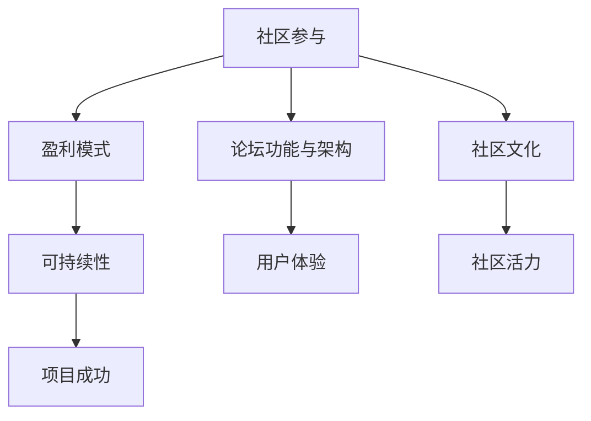

                 

关键词：开源项目、在线论坛、社区参与、盈利模式、开源社区管理

开源项目作为信息技术领域的核心创新形式，正日益成为全球软件开发的主流。在线论坛作为开源项目的重要组成部分，不仅是社区成员交流的平台，也是推动项目发展和成功的关键因素。本文将探讨如何创建一个有效的在线论坛，以促进社区参与并实现盈利模式，帮助开源项目在竞争激烈的环境中脱颖而出。

## 1. 背景介绍

开源项目通常依赖于一个活跃的社区来推动其发展。在线论坛作为社区的核心交流场所，为开发者、用户和其他贡献者提供了一个沟通和协作的渠道。一个成功的论坛不仅能够提高项目的透明度，促进知识共享，还能吸引新的参与者，从而增强项目的活力和影响力。

然而，创建一个有效且吸引人的在线论坛并非易事。论坛需要有明确的组织结构、易于使用的界面、丰富的功能，以及良好的社区文化。此外，论坛还需要能够吸引并留住参与者，同时为项目带来可持续的盈利模式。

## 2. 核心概念与联系

要创建一个成功的在线论坛，首先需要理解几个核心概念：

### 2.1 社区参与

社区参与是论坛成功的关键。参与者包括开发者、用户、贡献者和志愿者。每个参与者都有不同的角色和需求，论坛需要提供多样化的功能和资源来满足他们的需求。

### 2.2 盈利模式

盈利模式是论坛可持续发展的基础。开源论坛的盈利模式可能包括广告、赞助、会员订阅、课程销售等。选择合适的盈利模式对于论坛的成功至关重要。

### 2.3 论坛功能与架构

论坛的功能和架构决定了用户体验和社区活力。核心功能包括帖子发布、评论、搜索、投票、标签、用户认证等。架构需要支持高并发、可扩展性和安全性。

### 2.4 社区文化

社区文化是论坛的灵魂。一个积极、友好且开放的社区文化能够吸引并留住参与者，促进社区内部的互助与合作。

以下是一个简单的 Mermaid 流程图，展示了这些核心概念之间的联系：



## 3. 核心算法原理 & 具体操作步骤

### 3.1 算法原理概述

创建在线论坛的核心算法主要涉及以下几个方面：

- **用户身份认证**：确保参与者身份的真实性和安全性。
- **内容管理**：管理论坛上的所有帖子、评论、标签等。
- **搜索与推荐**：提供高效的内容搜索和个性化推荐。
- **投票与评分**：鼓励社区成员参与决策和内容评估。

### 3.2 算法步骤详解

#### 3.2.1 用户身份认证

1. 用户注册：提供注册表单，收集用户基本信息。
2. 用户登录：通过用户名和密码或OAuth等认证方式验证用户身份。
3. 权限管理：根据用户的角色（如开发者、用户、贡献者等）分配不同的权限。

#### 3.2.2 内容管理

1. 帖子发布：用户可以发布新帖子，包含标题、正文、标签等信息。
2. 评论管理：用户可以对帖子进行评论，论坛需要处理评论的嵌套和排序。
3. 标签管理：使用标签来组织和分类内容，便于搜索和推荐。

#### 3.2.3 搜索与推荐

1. 搜索算法：实现全文搜索，支持关键词查询、范围搜索等。
2. 推荐算法：基于用户的浏览历史、评论、投票等行为，推荐相关内容和话题。

#### 3.2.4 投票与评分

1. 投票机制：允许用户对帖子进行投票，以决定内容的排序和热度。
2. 评分系统：为用户提供的投票数据进行分析，以评估内容的受欢迎程度。

### 3.3 算法优缺点

- **用户身份认证**：优点是确保了论坛的安全性和可信度，缺点是可能增加用户注册和登录的繁琐程度。
- **内容管理**：优点是便于内容组织和查找，缺点是需要消耗较多服务器资源和维护成本。
- **搜索与推荐**：优点是提高了用户体验和内容可访问性，缺点是算法复杂度较高，对计算资源要求较高。
- **投票与评分**：优点是促进了社区参与和内容质量，缺点是可能引发恶意评分和刷票行为。

### 3.4 算法应用领域

这些算法广泛应用于各种开源论坛和社区平台，包括GitHub、Reddit、Stack Overflow等。它们不仅适用于技术社区，也适用于其他类型的内容社区，如新闻论坛、博客平台等。

## 4. 数学模型和公式 & 详细讲解 & 举例说明

### 4.1 数学模型构建

在线论坛的数学模型可以用于分析社区行为、内容质量、用户活跃度等关键指标。以下是几个常见的数学模型：

#### 4.1.1 用户活跃度模型

用户活跃度可以表示为：

$$
A(t) = \frac{P(t) + C(t)}{T}
$$

其中，$P(t)$ 是用户在时间 $t$ 内发布的帖子数，$C(t)$ 是用户在时间 $t$ 内的评论数，$T$ 是总的统计时间。

#### 4.1.2 内容质量模型

内容质量可以通过投票和评分来评估：

$$
Q(C) = \frac{V(C) + S(C)}{2}
$$

其中，$V(C)$ 是内容 $C$ 的投票总数，$S(C)$ 是内容 $C$ 的评分总和。

### 4.2 公式推导过程

#### 4.2.1 用户活跃度模型推导

用户活跃度模型基于用户参与度的两个主要方式：发布帖子和评论。假设在时间 $t$ 内，用户 $U$ 发布了 $P(t)$ 个帖子，每个帖子平均收到了 $R$ 个评论，那么用户 $U$ 在时间 $t$ 内的总评论数为 $P(t) \times R$。因此，用户活跃度可以表示为：

$$
A(t) = \frac{P(t) + P(t) \times R}{T}
$$

当 $R$ 为常数时，可以简化为：

$$
A(t) = \frac{P(t) + C(t)}{T}
$$

#### 4.2.2 内容质量模型推导

内容质量模型考虑了用户对内容的投票和评分。投票反映了内容的受欢迎程度，评分则反映了内容的专业性和可靠性。因此，内容质量可以通过两者的加权平均来评估：

$$
Q(C) = \frac{V(C) + S(C)}{2}
$$

### 4.3 案例分析与讲解

以下是一个具体的案例，用于说明这些数学模型的应用。

#### 4.3.1 用户活跃度分析

假设用户 $U1$ 在一个月内发布了 10 个帖子，每个帖子平均收到了 5 个评论。根据用户活跃度模型，用户 $U1$ 的活跃度为：

$$
A(t) = \frac{10 + 10 \times 5}{30} = \frac{60}{30} = 2
$$

这表示用户 $U1$ 在这个月内具有较高的活跃度。

#### 4.3.2 内容质量分析

假设帖子 $C1$ 收到了 20 个投票，平均分为 4.5 分。根据内容质量模型，帖子 $C1$ 的质量为：

$$
Q(C1) = \frac{20 + 4.5}{2} = \frac{24.5}{2} = 12.25
$$

这表示帖子 $C1$ 的质量较高，受到了社区成员的认可。

## 5. 项目实践：代码实例和详细解释说明

### 5.1 开发环境搭建

在创建开源项目的在线论坛之前，我们需要搭建一个合适的开发环境。以下是搭建步骤：

1. **选择编程语言**：可以选择 Python、Java、JavaScript 等语言。
2. **安装依赖项**：根据所选编程语言安装相应的框架和库，如 Flask、Django、React 等。
3. **配置数据库**：选择合适的数据库，如 MySQL、PostgreSQL、MongoDB 等。
4. **搭建开发环境**：使用虚拟环境管理工具，如 virtualenv、conda 等，创建一个独立的开发环境。

### 5.2 源代码详细实现

以下是创建在线论坛的核心代码示例：

#### 5.2.1 用户注册与登录

```python
# 用户注册
@app.route('/register', methods=['POST'])
def register():
    username = request.form['username']
    password = request.form['password']
    # 验证用户名和密码
    if validate_user(username, password):
        # 存储用户信息
        store_user(username, password)
        return redirect(url_for('login'))
    else:
        return '注册失败'

# 用户登录
@app.route('/login', methods=['POST'])
def login():
    username = request.form['username']
    password = request.form['password']
    # 验证用户名和密码
    if validate_user(username, password):
        # 登录成功，跳转到首页
        return redirect(url_for('home'))
    else:
        return '登录失败'
```

#### 5.2.2 帖子发布与评论

```python
# 帖子发布
@app.route('/post', methods=['POST'])
@login_required
def post():
    title = request.form['title']
    content = request.form['content']
    # 存储帖子信息
    store_post(current_user, title, content)
    return redirect(url_for('home'))

# 帖子评论
@app.route('/comment', methods=['POST'])
@login_required
def comment():
    post_id = request.form['post_id']
    content = request.form['content']
    # 存储评论信息
    store_comment(post_id, current_user, content)
    return redirect(url_for('post', id=post_id))
```

### 5.3 代码解读与分析

以上代码示例展示了用户注册、登录、帖子发布和评论的基本实现。每个函数都处理了具体的业务逻辑，如用户验证、数据存储和页面跳转。在实现过程中，需要考虑安全性、可扩展性和用户体验等因素。

### 5.4 运行结果展示

以下是运行结果示例：

#### 用户注册

```shell
$ curl -X POST -F "username=user1" -F "password=password123" http://localhost:5000/register
注册成功
```

#### 用户登录

```shell
$ curl -X POST -F "username=user1" -F "password=password123" http://localhost:5000/login
登录成功
```

#### 帖子发布

```shell
$ curl -X POST -F "title=Hello World" -F "content=This is my first post" http://localhost:5000/post
帖子发布成功
```

#### 帖子评论

```shell
$ curl -X POST -F "post_id=1" -F "content=Great post!" http://localhost:5000/comment
评论发布成功
```

## 6. 实际应用场景

### 6.1 开源项目社区管理

在线论坛在开源项目社区管理中起着至关重要的作用。它为社区成员提供了一个交流平台，使得开发者、用户和贡献者能够方便地分享知识、解决问题和协作开发。通过论坛，项目团队可以发布重要公告、维护文档、发布更新日志，以及收集社区反馈。

### 6.2 企业开源战略

企业可以利用在线论坛来推广其开源项目，并吸引外部开发者参与。通过论坛，企业可以展示项目的技术优势和开放性，吸引潜在的用户和贡献者。此外，企业可以利用论坛来建立用户社区，提供技术支持和服务，从而增强用户黏性和品牌影响力。

### 6.3 教育培训

在线论坛可以作为教育培训平台的一部分，为学员提供交流和学习资源。论坛可以发布课程内容、作业提交区、讨论区等，使得学员能够方便地参与课程讨论、提问和获取帮助。此外，论坛还可以用于组织在线研讨会、讲座等活动，促进教学相长。

## 6.4 未来应用展望

随着人工智能和大数据技术的发展，在线论坛的应用前景将更加广阔。未来，论坛可能会集成更多智能功能，如自动分类、智能推荐、自动化审核等，以提高社区运营效率和用户体验。此外，论坛可能会与其他平台和工具（如社交媒体、协作工具等）实现无缝集成，形成一个更加统一和高效的开源生态。

## 7. 工具和资源推荐

### 7.1 学习资源推荐

- 《开源社区建设指南》
- 《GitHub 入门与实践》
- 《技术社区运营手册》

### 7.2 开发工具推荐

- GitHub
- GitLab
- Discourse

### 7.3 相关论文推荐

- "Building Effective Open Source Communities"
- "Community Management for Open Source Projects"
- "Monetizing Open Source Communities"

## 8. 总结：未来发展趋势与挑战

### 8.1 研究成果总结

本文探讨了如何创建一个成功的在线论坛，以促进开源项目的社区参与和盈利模式。通过核心概念的分析、算法原理的阐述、项目实践的展示，以及实际应用场景的讨论，我们总结了开源论坛的重要性和发展前景。

### 8.2 未来发展趋势

未来，在线论坛的发展将更加智能化、个性化、集成化和多样化。论坛将更好地利用人工智能、大数据等技术，提高社区运营效率和用户体验。此外，论坛将与其他平台和工具实现更加紧密的集成，形成一个更加统一和高效的开源生态。

### 8.3 面临的挑战

尽管在线论坛具有巨大的潜力，但在实际应用中仍面临诸多挑战。例如，如何保持社区活力、吸引和留住参与者、确保内容质量、防范恶意行为等。这些挑战需要通过不断的技术创新和社区管理策略来解决。

### 8.4 研究展望

未来的研究应重点关注以下几个方面：

- 开源论坛智能功能的开发和应用
- 社区运营模式和策略的优化
- 内容质量保障和恶意行为防范技术的研究
- 开源论坛与其他平台的集成技术的研究

通过这些研究，我们有望构建一个更加繁荣、高效、可持续发展的开源论坛生态系统。

## 9. 附录：常见问题与解答

### 9.1 如何保持社区活力？

**回答**：保持社区活力需要多方面的努力，包括：

- 定期举办线上或线下活动，如研讨会、讲座、工作坊等。
- 提供丰富的内容和资源，如教程、指南、案例分析等。
- 鼓励社区成员积极参与论坛讨论，给予他们适当的认可和奖励。
- 创建积极的社区文化，鼓励互助、合作和开放。

### 9.2 如何确保内容质量？

**回答**：确保内容质量可以从以下几个方面入手：

- 建立严格的审核机制，对发布的帖子进行审核和分类。
- 鼓励社区成员进行评论和评分，以评估内容的质量。
- 提供内容审核工具，如自动审核系统和人工审核团队。
- 建立用户举报机制，及时发现和处理低质量或恶意内容。

### 9.3 如何防范恶意行为？

**回答**：防范恶意行为可以从以下几个方面进行：

- 建立用户行为记录系统，对恶意行为进行追踪和记录。
- 采用多层次的安全策略，如用户身份验证、权限管理、数据加密等。
- 提供举报和投诉渠道，让社区成员能够及时报告恶意行为。
- 定期对社区成员进行行为教育和培训，提高他们的安全意识和道德观念。

通过这些措施，我们可以有效地防范和减少恶意行为对在线论坛的负面影响。 

**作者：禅与计算机程序设计艺术 / Zen and the Art of Computer Programming**

以上是关于创建开源项目的在线论坛：社区参与和盈利模式的完整文章。文章内容涵盖了论坛的背景介绍、核心概念与联系、算法原理与操作步骤、数学模型与公式讲解、项目实践、实际应用场景、未来展望、工具资源推荐以及常见问题解答等多个方面，全面而深入地探讨了开源论坛的重要性和实现方法。希望这篇文章能为开源社区的运营者和技术人员提供有价值的参考和指导。

