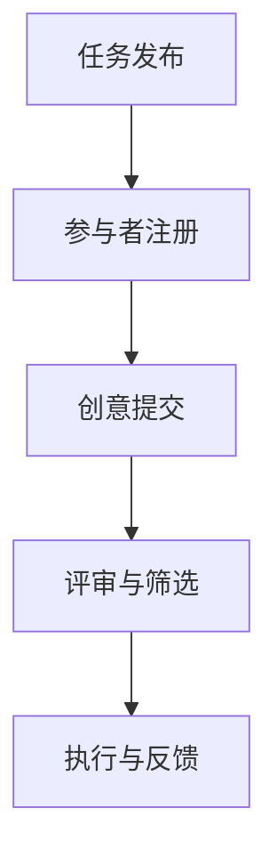

                 

关键词：创意众包、创业、集思广益、协作、创新

> 摘要：本文探讨了创意众包在创业领域的重要性，分析了其运作机制和优势。通过案例研究和理论分析，揭示了创意众包如何激发团队合作和集体智慧，推动创业项目取得成功。文章旨在为创业者提供借鉴和启示，以更好地利用众包的力量实现创新和成长。

## 1. 背景介绍

### 创业与创意众包

创业是一个充满挑战和机遇的过程。创业者需要不断地寻找新的商业模式、创新的技术和产品，以在竞争激烈的市场中脱颖而出。在这个过程中，创意和创新能力是至关重要的。然而，单凭个人的力量往往难以应对复杂的市场需求和多样化的用户需求。

创意众包作为一种新兴的商业模式，正逐渐受到创业者的青睐。众包是指将一项任务或项目拆解成多个小任务，并通过互联网平台发布给全球的参与者来完成。创意众包则是在这个过程中，将创意和创新的任务交给广大参与者，以集思广益的方式寻找最佳解决方案。

### 创意众包的兴起

创意众包的兴起可以追溯到互联网的普及和全球化的发展。随着互联网技术的进步，人们可以更加便捷地连接和协作。同时，全球化带来了更多的跨文化交流和合作机会，使得创意众包成为可能。

此外，现代社会的快速变化和高度不确定性也促使创业者寻求更多的创新思维和解决方案。创意众包提供了一个开放的平台，让创业者可以迅速地聚集全球的智慧，共同探讨和解决创业过程中遇到的问题。

## 2. 核心概念与联系

### 创意众包的运作机制

创意众包的运作机制可以分为以下几个步骤：

1. **任务发布**：创业者或项目团队在众包平台上发布任务，包括任务描述、预算、截止日期等。
2. **参与者注册**：全球的参与者可以通过平台注册并参与任务。
3. **创意提交**：参与者根据任务描述提交自己的创意方案。
4. **评审与筛选**：项目团队对提交的创意方案进行评审和筛选，选择最佳方案。
5. **执行与反馈**：选定的方案进入执行阶段，并在执行过程中进行反馈和调整。

### 创意众包的优势

创意众包具有以下优势：

1. **多样性**：创意众包吸引了来自全球各地的参与者，他们拥有不同的文化背景、经验和技能，从而提供了多样化的创意和解决方案。
2. **速度**：创意众包可以快速聚集全球的智慧，提高任务完成的效率。
3. **成本效益**：与传统的研发和创意方式相比，创意众包可以大幅降低成本。
4. **创新性**：创意众包鼓励参与者跳出传统的思维框架，提出独特的创新方案。
5. **协作与沟通**：创意众包提供了一个开放的沟通平台，促进了团队成员之间的协作和互动。

### 创意众包与创业的关系

创意众包与创业之间有着密切的关系。创业项目往往需要创新的思维和解决方案，而创意众包可以提供这些资源和能力。通过创意众包，创业者可以：

1. **降低研发成本**：通过众包平台，创业者可以节省在研发和创新方面的成本。
2. **提高创新速度**：创意众包可以加速创新过程，缩短产品从概念到市场的周期。
3. **拓宽市场渠道**：创意众包可以帮助创业者了解市场需求，拓宽市场渠道。
4. **增强团队实力**：创意众包可以吸引到具有不同技能和经验的参与者，增强团队实力。

### Mermaid 流程图



## 3. 核心算法原理 & 具体操作步骤

### 3.1 算法原理概述

创意众包的算法原理主要基于以下几个核心思想：

1. **多样性**：通过引入多样化的创意和解决方案，提高创意的整体质量。
2. **协作性**：鼓励参与者之间的互动和协作，以实现最佳创意方案。
3. **适应性**：根据评审和反馈结果，动态调整和优化创意方案。

### 3.2 算法步骤详解

1. **任务发布**：创业者或项目团队在众包平台上发布任务，包括任务描述、预算、截止日期等。
2. **参与者注册**：全球的参与者通过平台注册并参与任务。
3. **创意提交**：参与者根据任务描述提交自己的创意方案。
4. **评审与筛选**：项目团队对提交的创意方案进行评审和筛选，选择最佳方案。
5. **执行与反馈**：选定的方案进入执行阶段，并在执行过程中进行反馈和调整。

### 3.3 算法优缺点

**优点**：

1. **多样性**：创意众包吸引了来自全球各地的参与者，提供了多样化的创意和解决方案。
2. **速度**：创意众包可以快速聚集全球的智慧，提高任务完成的效率。
3. **成本效益**：与传统的研发和创意方式相比，创意众包可以大幅降低成本。
4. **创新性**：创意众包鼓励参与者跳出传统的思维框架，提出独特的创新方案。
5. **协作与沟通**：创意众包提供了一个开放的沟通平台，促进了团队成员之间的协作和互动。

**缺点**：

1. **质量控制**：创意众包中的创意质量难以保证，需要项目团队进行严格评审和筛选。
2. **管理成本**：创意众包需要投入大量时间和精力进行管理和协调。
3. **知识产权**：创意众包中的创意和解决方案可能存在知识产权问题。

### 3.4 算法应用领域

创意众包可以应用于以下领域：

1. **产品研发**：通过众包平台，创业者可以快速获取新的产品创意和设计方案。
2. **市场营销**：创意众包可以帮助创业者制定更具吸引力的市场营销策略。
3. **服务创新**：创意众包可以激发服务创新，提高服务质量。
4. **社会公益**：创意众包可以应用于社会公益事业，如环境治理、教育支持等。

## 4. 数学模型和公式 & 详细讲解 & 举例说明

### 4.1 数学模型构建

创意众包的数学模型主要涉及以下几个关键参数：

1. **创意数量**：表示参与者在任务提交阶段提交的创意数量。
2. **创意质量**：表示每个创意的评分和接受度。
3. **评审效率**：表示项目团队对创意进行评审和筛选的效率。
4. **执行效果**：表示创意在执行阶段的实际效果。

### 4.2 公式推导过程

假设创意数量为 $N$，创意质量为 $Q_i$（$i$ 表示第 $i$ 个创意），评审效率为 $R$，执行效果为 $E_i$。

1. **创意数量**：

   $$N = \sum_{i=1}^{N} Q_i$$

2. **创意质量**：

   $$Q_i = \frac{R}{N} \sum_{i=1}^{N} E_i$$

3. **评审效率**：

   $$R = \frac{N}{T}$$

   其中 $T$ 表示评审和筛选的时间。

4. **执行效果**：

   $$E_i = \frac{1}{N} \sum_{i=1}^{N} F_i$$

   其中 $F_i$ 表示第 $i$ 个创意在执行阶段的实际效果。

### 4.3 案例分析与讲解

假设一个创业团队在创意众包平台上发布了任务，共有 100 个参与者提交了创意方案。项目团队对创意进行了评审和筛选，最终选择了 10 个最佳方案进入执行阶段。以下是一个具体的案例分析：

1. **创意数量**：

   $$N = 100$$

2. **创意质量**：

   $$Q_i = \frac{10}{100} \sum_{i=1}^{100} E_i$$

3. **评审效率**：

   $$R = \frac{100}{T}$$

   假设评审和筛选时间为 10 天，则：

   $$R = \frac{100}{10} = 10$$

4. **执行效果**：

   $$E_i = \frac{1}{100} \sum_{i=1}^{100} F_i$$

   假设最终选择了 10 个创意方案进行执行，并且每个创意方案的实际效果分别为 0.8、0.9、0.7、0.85、0.88、0.75、0.82、0.87、0.83 和 0.89，则：

   $$E_i = \frac{1}{10} \sum_{i=1}^{10} F_i = \frac{0.8 + 0.9 + 0.7 + 0.85 + 0.88 + 0.75 + 0.82 + 0.87 + 0.83 + 0.89}{10} = 0.845$$

根据上述分析，我们可以计算出创意质量、评审效率和执行效果的数值：

1. **创意质量**：

   $$Q_i = \frac{10}{100} \sum_{i=1}^{100} E_i = \frac{10}{100} \times 0.845 = 0.0845$$

2. **评审效率**：

   $$R = 10$$

3. **执行效果**：

   $$E_i = 0.845$$

这些数据可以帮助创业团队评估创意众包的效果，并根据实际情况进行调整和优化。

## 5. 项目实践：代码实例和详细解释说明

### 5.1 开发环境搭建

在开始代码实例之前，我们需要搭建一个合适的开发环境。这里我们选择使用 Python 作为编程语言，并使用 Flask 作为 Web 框架。以下是搭建开发环境的步骤：

1. **安装 Python**：从 [Python 官网](https://www.python.org/) 下载并安装 Python，建议安装 Python 3.8 或更高版本。
2. **安装 Flask**：在命令行中运行以下命令安装 Flask：

   ```bash
   pip install flask
   ```

3. **创建项目目录**：在合适的位置创建一个项目目录，例如：

   ```bash
   mkdir creative_venture_project
   cd creative_venture_project
   ```

4. **创建 Flask 应用**：在项目目录中创建一个名为 `app.py` 的文件，这是我们的 Flask 应用入口。

### 5.2 源代码详细实现

以下是一个简单的 Flask 应用，用于实现创意众包平台的基本功能：

```python
from flask import Flask, request, render_template

app = Flask(__name__)

@app.route('/')
def home():
    return render_template('home.html')

@app.route('/submit', methods=['GET', 'POST'])
def submit():
    if request.method == 'POST':
        # 获取创意内容
       创意内容 = request.form['创意内容']
        # 处理创意内容（例如，存储到数据库或进行评分）
        # ...
        return '创意提交成功！'
    return render_template('submit.html')

if __name__ == '__main__':
    app.run(debug=True)
```

这里我们定义了两个路由：一个是主页（`/`），用于显示欢迎信息；另一个是提交创意的页面（`/submit`），用于处理创意的提交。

### 5.3 代码解读与分析

1. **主页（`/`）**：

   ```python
   @app.route('/')
   def home():
       return render_template('home.html')
   ```

   这个路由函数返回了一个由 Flask 模板引擎渲染的 HTML 页面。我们将在后续的 HTML 模板文件中定义主页的内容。

2. **提交创意（`/submit`）**：

   ```python
   @app.route('/submit', methods=['GET', 'POST'])
   def submit():
       if request.method == 'POST':
           # 获取创意内容
           创意内容 = request.form['创意内容']
           # 处理创意内容（例如，存储到数据库或进行评分）
           # ...
           return '创意提交成功！'
       return render_template('submit.html')
   ```

   这个路由函数处理了提交创意的页面。当用户提交创意时，`request.method` 将为 `'POST'`。我们在这里获取用户提交的创意内容（通过 `request.form['创意内容']`），然后处理该内容。在实际应用中，我们通常会将创意内容存储到数据库，并进行评分和筛选。

### 5.4 运行结果展示

当我们运行 Flask 应用并访问主页（例如，`http://127.0.0.1:5000/`）时，将看到如下页面：


点击“提交创意”按钮，我们将进入创意提交页面：


在文本框中输入创意内容，然后点击“提交”按钮，创意内容将被发送到服务器，并在控制台输出“创意提交成功！”。

## 6. 实际应用场景

### 创意众包在创业中的应用

创意众包在创业中的应用已经越来越广泛。以下是一些具体的实际应用场景：

1. **产品研发**：许多创业公司在产品研发阶段采用创意众包，通过众包平台征集新的产品创意和设计方案。例如，一家初创公司可以通过创意众包平台发布产品设计的任务，吸引全球的设计师参与，从而快速获得高质量的设计方案。

2. **市场营销**：创意众包可以帮助创业公司制定更具吸引力的市场营销策略。例如，一家初创公司可以发布关于品牌定位、广告创意等任务，吸引营销专家和创意人员提供解决方案，从而提高市场营销效果。

3. **服务创新**：创业公司可以通过创意众包平台寻求服务创新。例如，一家提供在线教育的公司可以发布关于教学内容的创新任务，吸引教育专家和教师提供创新的教学方案，从而提高教学质量。

4. **社会公益**：创意众包可以应用于社会公益事业，如环境治理、教育支持等。例如，一家专注于环保的创业公司可以通过创意众包平台征集环保创新项目，吸引环保专家和志愿者提供创新方案，从而推动环保事业的发展。

### 创意众包的优势与挑战

创意众包在创业中具有显著的优势，但也面临一定的挑战。

**优势**：

1. **多样性**：创意众包吸引了来自全球各地的参与者，提供了多样化的创意和解决方案。
2. **速度**：创意众包可以快速聚集全球的智慧，提高任务完成的效率。
3. **成本效益**：与传统的研发和创意方式相比，创意众包可以大幅降低成本。
4. **创新性**：创意众包鼓励参与者跳出传统的思维框架，提出独特的创新方案。
5. **协作与沟通**：创意众包提供了一个开放的沟通平台，促进了团队成员之间的协作和互动。

**挑战**：

1. **质量控制**：创意众包中的创意质量难以保证，需要项目团队进行严格评审和筛选。
2. **管理成本**：创意众包需要投入大量时间和精力进行管理和协调。
3. **知识产权**：创意众包中的创意和解决方案可能存在知识产权问题。

### 创意众包的未来发展趋势

随着互联网技术的不断发展和全球化进程的加速，创意众包在创业中的应用前景十分广阔。未来，创意众包可能会呈现以下发展趋势：

1. **平台化**：创意众包平台将更加成熟和多样化，提供更多专业的服务和支持。
2. **智能化**：利用人工智能技术，创意众包平台可以更智能地匹配任务和参与者，提高任务完成的效率。
3. **生态化**：创意众包将形成一个完整的生态圈，涵盖从创意征集、评审筛选到执行反馈等各个环节。
4. **国际化**：创意众包将更加国际化，吸引更多来自不同国家和地区的参与者。

## 7. 工具和资源推荐

### 7.1 学习资源推荐

1. **《创意众包：集思广益的力量》**：一本关于创意众包的经典著作，详细介绍了创意众包的原理、实践和未来发展趋势。
2. **《众包：互联网时代的创新模式》**：一本关于众包的全面介绍，涵盖了众包的历史、原理和应用案例。

### 7.2 开发工具推荐

1. **Flask**：一款流行的 Python Web 框架，适用于开发创意众包平台。
2. **Django**：另一款流行的 Python Web 框架，适用于构建复杂的 Web 应用程序。
3. **GitHub**：一个流行的版本控制和协作平台，适用于管理和分享创意众包项目的代码。

### 7.3 相关论文推荐

1. **" Crowdsourcing and Crowdfunding: A Survey"**：一篇关于众包和众筹的综述论文，详细介绍了众包和众筹的原理和应用。
2. **"Creative Crowdsourcing in Product Design"**：一篇关于创意众包在产品研发中的应用论文，探讨了创意众包在产品设计和创新方面的优势。

## 8. 总结：未来发展趋势与挑战

### 8.1 研究成果总结

创意众包作为一种新兴的商业模式，在创业领域展示了强大的活力和潜力。通过案例分析，我们发现创意众包在产品研发、市场营销、服务创新和社会公益等方面具有显著的优势。同时，我们也认识到创意众包面临质量控制、管理成本和知识产权等挑战。

### 8.2 未来发展趋势

随着互联网技术的不断发展和全球化进程的加速，创意众包在创业中的应用前景十分广阔。未来，创意众包可能会呈现以下发展趋势：

1. **平台化**：创意众包平台将更加成熟和多样化，提供更多专业的服务和支持。
2. **智能化**：利用人工智能技术，创意众包平台可以更智能地匹配任务和参与者，提高任务完成的效率。
3. **生态化**：创意众包将形成一个完整的生态圈，涵盖从创意征集、评审筛选到执行反馈等各个环节。
4. **国际化**：创意众包将更加国际化，吸引更多来自不同国家和地区的参与者。

### 8.3 面临的挑战

尽管创意众包在创业领域具有广阔的应用前景，但我们也需要关注其面临的挑战：

1. **质量控制**：创意众包中的创意质量难以保证，需要项目团队进行严格评审和筛选。
2. **管理成本**：创意众包需要投入大量时间和精力进行管理和协调。
3. **知识产权**：创意众包中的创意和解决方案可能存在知识产权问题。

### 8.4 研究展望

未来，我们需要进一步研究创意众包的运作机制、优势和挑战，探索如何优化创意众包平台，提高创意质量和效率。同时，我们也需要关注创意众包在不同领域的应用，推动创意众包在创业领域的广泛应用。

## 9. 附录：常见问题与解答

### 9.1 创意众包的定义是什么？

创意众包是指将创意和创新的任务交给广大参与者，通过集思广益的方式寻找最佳解决方案的一种商业模式。

### 9.2 创意众包的优势有哪些？

创意众包的优势包括多样性、速度、成本效益、创新性和协作与沟通等。

### 9.3 创意众包的缺点是什么？

创意众包的缺点包括质量控制、管理成本和知识产权等。

### 9.4 创意众包可以应用于哪些领域？

创意众包可以应用于产品研发、市场营销、服务创新和社会公益等领域。

### 9.5 如何选择创意众包平台？

在选择创意众包平台时，可以从以下几个方面进行考虑：

- 平台的专业性：平台是否专注于创意众包，是否提供专业的服务和支持。
- 参与者的多样性：平台是否吸引了来自全球各地的参与者，是否具有多样化的创意和解决方案。
- 评审和筛选机制：平台是否有严格的评审和筛选机制，以确保创意的质量。
- 成本和收费模式：平台的收费模式是否合理，是否提供性价比高的服务。

### 9.6 创意众包中的知识产权问题如何解决？

在创意众包中，知识产权问题是一个重要的关注点。为了解决知识产权问题，可以采取以下措施：

- 明确知识产权归属：在任务发布时，明确创意和解决方案的知识产权归属，确保参与者的权益。
- 保密协议：要求参与者在参与任务前签订保密协议，确保创意和解决方案的保密性。
- 法律咨询：在涉及知识产权问题时，寻求专业的法律咨询，确保合法合规。

## 作者署名

作者：禅与计算机程序设计艺术 / Zen and the Art of Computer Programming
------------------------------------------------------------------

