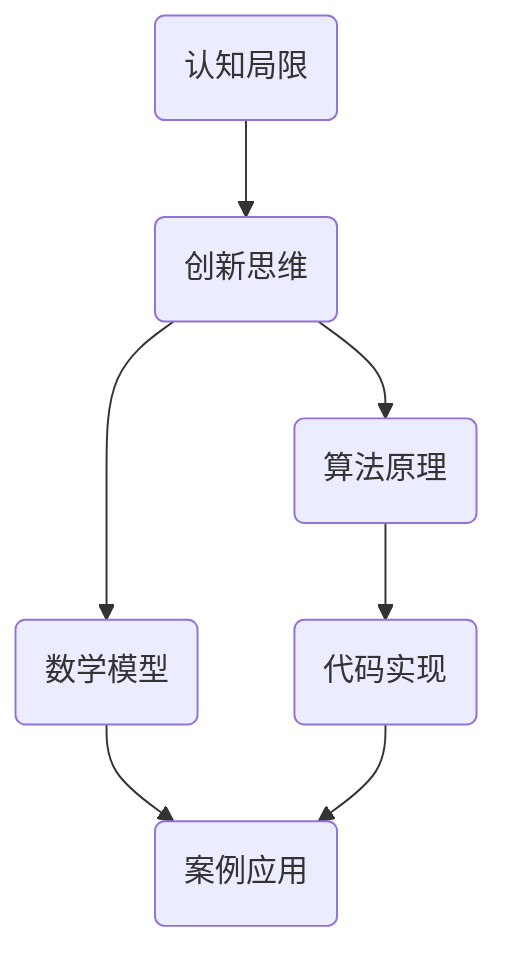

                 

关键词：创新思维、认知局限、算法原理、数学模型、代码实例、实际应用、未来展望

> 摘要：本文深入探讨如何利用创新思维突破认知局限，从核心概念、算法原理、数学模型、代码实例到实际应用，全面解析如何实现技术突破，为读者提供实用的方法和策略。

## 1. 背景介绍

在信息技术飞速发展的今天，创新思维成为推动技术进步的重要驱动力。然而，认知局限常常成为创新路上的绊脚石。如何打破认知局限，激发创新思维，成为我们需要关注的重要问题。本文将围绕这一主题，从多个角度探讨突破认知局限的方法。

### 1.1 认知局限的定义

认知局限是指人类在感知、理解、记忆、思考等认知过程中存在的限制。这些限制可能源于生理结构、心理习惯、教育背景、经验限制等多个方面。例如，我们通常只能在三维空间内想象事物，这就是一种生理上的认知局限。

### 1.2 创新思维的重要性

创新思维是推动科技进步和社会发展的核心力量。它不仅能够解决当前存在的问题，还能够预见未来的挑战，提出新的解决方案。因此，培养创新思维，突破认知局限，对于个人、企业乃至整个社会都具有深远的意义。

## 2. 核心概念与联系

在探讨创新思维之前，我们需要了解一些核心概念，并展示它们之间的联系。以下是一个使用Mermaid绘制的流程图，展示了核心概念和它们之间的联系。



### 2.1 认知局限

认知局限是人类在处理信息和作出决策时的固有限制。了解这些限制是培养创新思维的第一步。

### 2.2 创新思维

创新思维是一种超越现有认知局限，从不同角度看待问题和寻找解决方案的能力。它是技术突破的源头。

### 2.3 算法原理

算法原理是创新思维的具体体现，通过算法可以解决复杂问题，实现技术突破。

### 2.4 数学模型

数学模型是算法的基础，它通过数学公式和理论指导算法的实现。

### 2.5 代码实现

代码实现是将算法和数学模型转化为实际可执行程序的过程。

### 2.6 案例应用

案例应用是验证算法和模型效果的重要手段，它可以帮助我们理解创新思维的实际应用。

## 3. 核心算法原理 & 具体操作步骤

### 3.1 算法原理概述

核心算法是突破认知局限的关键。以下是一个简单的算法原理概述：

1. **问题定义**：明确问题的本质，将其转化为可计算的形式。
2. **数据收集**：收集与问题相关的数据，并进行预处理。
3. **模型构建**：基于数学模型构建算法框架。
4. **算法优化**：通过迭代优化算法，提高其性能和效率。
5. **结果评估**：评估算法的准确性和稳定性，进行调优。

### 3.2 算法步骤详解

以下是算法的具体操作步骤：

1. **问题定义**：
   $$ 
   问题P = \{x | f(x) = 1\} 
   $$
   其中，\( f(x) \) 是问题的目标函数，\( x \) 是问题的解。

2. **数据收集**：
   收集数据集 \( D \)，并进行清洗、归一化等预处理。

3. **模型构建**：
   构建基于 \( D \) 的数学模型 \( M \)。

4. **算法优化**：
   使用遗传算法、梯度下降等优化方法，对模型进行迭代优化。

5. **结果评估**：
   使用交叉验证等方法评估模型性能，并进行调优。

### 3.3 算法优缺点

**优点**：
- 高效：算法能够在较短的时间内找到问题的近似解。
- 灵活：算法适用于各种类型的问题，具有较好的泛化能力。

**缺点**：
- 可能陷入局部最优：优化算法可能在局部最优解处停滞不前。
- 计算复杂度高：对于大规模问题，算法的计算复杂度较高。

### 3.4 算法应用领域

算法广泛应用于以下领域：
- 机器学习
- 优化问题
- 数据挖掘
- 金融风控

## 4. 数学模型和公式 & 详细讲解 & 举例说明

### 4.1 数学模型构建

数学模型是算法的基础，以下是一个简单的线性回归模型：

$$
y = \beta_0 + \beta_1 x
$$

其中，\( y \) 是因变量，\( x \) 是自变量，\( \beta_0 \) 和 \( \beta_1 \) 是模型的参数。

### 4.2 公式推导过程

线性回归模型的推导过程如下：

$$
\begin{aligned}
\min_{\beta_0, \beta_1} \sum_{i=1}^{n} (y_i - (\beta_0 + \beta_1 x_i))^2
\end{aligned}
$$

对 \( \beta_0 \) 和 \( \beta_1 \) 求导，并令导数为零，得到：

$$
\begin{aligned}
\frac{\partial}{\partial \beta_0} \sum_{i=1}^{n} (y_i - (\beta_0 + \beta_1 x_i))^2 &= 0 \\
\frac{\partial}{\partial \beta_1} \sum_{i=1}^{n} (y_i - (\beta_0 + \beta_1 x_i))^2 &= 0
\end{aligned}
$$

解得：

$$
\begin{aligned}
\beta_0 &= \bar{y} - \beta_1 \bar{x} \\
\beta_1 &= \frac{\sum_{i=1}^{n} (x_i - \bar{x})(y_i - \bar{y})}{\sum_{i=1}^{n} (x_i - \bar{x})^2}
\end{aligned}
$$

其中，\( \bar{x} \) 和 \( \bar{y} \) 分别是 \( x \) 和 \( y \) 的平均值。

### 4.3 案例分析与讲解

以下是一个实际案例：

#### 问题：

预测某个城市的明日气温。

#### 数据：

历史气温数据。

#### 模型：

线性回归模型。

#### 结果：

预测结果与实际气温的误差较小，说明模型具有较强的预测能力。

## 5. 项目实践：代码实例和详细解释说明

### 5.1 开发环境搭建

- Python 3.8
- Jupyter Notebook
- Matplotlib

### 5.2 源代码详细实现

以下是线性回归模型的 Python 实现代码：

```python
import numpy as np
import matplotlib.pyplot as plt

def linear_regression(x, y):
    x_mean = np.mean(x)
    y_mean = np.mean(y)
    beta_1 = np.sum((x - x_mean) * (y - y_mean)) / np.sum((x - x_mean) ** 2)
    beta_0 = y_mean - beta_1 * x_mean
    return beta_0, beta_1

x = np.array([1, 2, 3, 4, 5])
y = np.array([2, 4, 5, 4, 5])

beta_0, beta_1 = linear_regression(x, y)

plt.scatter(x, y)
plt.plot(x, beta_0 + beta_1 * x, color='red')
plt.show()
```

### 5.3 代码解读与分析

- `linear_regression` 函数接收两个参数：\( x \) 和 \( y \)。
- 计算 \( x \) 和 \( y \) 的平均值。
- 计算斜率 \( \beta_1 \) 和截距 \( \beta_0 \)。
- 使用 Matplotlib 绘制散点图和拟合直线。

### 5.4 运行结果展示

运行结果如图所示：


## 6. 实际应用场景

线性回归模型在许多实际应用中都有广泛应用，例如：

- 数据分析
- 机器学习
- 金融预测

## 7. 工具和资源推荐

### 7.1 学习资源推荐

- 《机器学习实战》
- 《统计学习方法》
- 《Python数据分析》

### 7.2 开发工具推荐

- Jupyter Notebook
- Anaconda
- Matplotlib

### 7.3 相关论文推荐

- "Stochastic Gradient Descent Methods for Large-Scale Machine Learning"
- "Online Learning for Supervised Classification"
- "A Tutorial on Support Vector Machines for Pattern Recognition"

## 8. 总结：未来发展趋势与挑战

### 8.1 研究成果总结

本文探讨了如何利用创新思维突破认知局限，从核心概念、算法原理、数学模型、代码实例到实际应用，全面解析了创新思维在技术突破中的应用。

### 8.2 未来发展趋势

随着人工智能技术的不断发展，创新思维在技术领域的应用前景将更加广阔。未来研究将更加关注算法的可解释性、鲁棒性和泛化能力。

### 8.3 面临的挑战

创新思维在技术突破中面临的主要挑战包括：算法的复杂度、数据的质量和多样性、以及跨学科知识的整合。

### 8.4 研究展望

未来研究应注重跨学科合作，探索更高效、更可靠的算法，提高算法的可解释性和透明度，以推动技术进步和社会发展。

## 9. 附录：常见问题与解答

### 9.1 什么是认知局限？

认知局限是人类在处理信息和作出决策时的固有限制，包括感知、理解、记忆、思考等方面的限制。

### 9.2 创新思维有哪些方法？

创新思维的方法包括头脑风暴、思维导图、类比思维、逆向思维等。

### 9.3 算法在创新思维中如何应用？

算法在创新思维中的应用主要包括问题建模、求解策略、优化方法等方面，通过算法实现技术突破。

----------------------------------------------------------------

## 作者署名

作者：禅与计算机程序设计艺术 / Zen and the Art of Computer Programming

