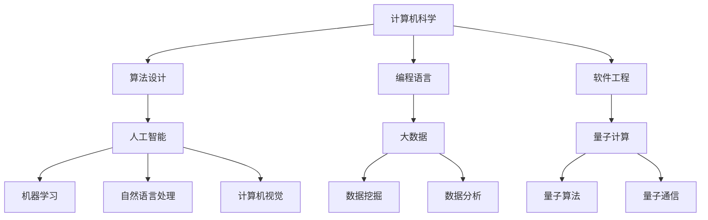

                 

关键词：计算、人工智能、终极目标、技术进步、美好世界

> 摘要：本文旨在探讨人类计算的目标，通过深入分析技术进步对社会的积极影响，探讨如何利用计算技术创造更美好的世界。本文将回顾计算技术的发展历程，阐述人工智能的核心概念，分析其在各个领域的应用，并提出未来计算技术发展的方向与挑战。

## 1. 背景介绍

计算技术是现代社会的核心驱动力，从最早的计算机诞生，到今天的人工智能、量子计算等前沿领域，计算技术的不断进步为人类社会带来了巨大的变革。如今，计算技术已经深入到生活的各个方面，从医疗健康、交通出行，到金融、教育等，无不受到计算技术的影响。

人类计算的终极目标是什么？这是一个值得深思的问题。在过去的几千年中，人类通过计算技术的进步解决了许多问题，提高了生产效率，改善了生活质量。然而，随着技术的不断发展，我们开始思考，计算的终极目标不仅仅是解决实际问题，更重要的是为人类创造一个更加美好、和谐的世界。

### 1.1 计算技术的起源

计算技术的起源可以追溯到古代，当时的数学家们使用算盘、计算尺等工具来进行数学计算。随着工业革命的到来，机械计算机开始出现，如差分机、解析机等，这些机械计算器大大提高了计算的速度和精度。

20世纪40年代，电子计算机的出现标志着计算技术的重大突破。电子计算机利用电子元件进行数据处理，相较于机械计算机，具有更高的速度和更广泛的适用性。从那时起，计算技术开始以惊人的速度发展，推动着人类社会向前迈进。

### 1.2 人工智能的崛起

随着计算技术的进步，人工智能（Artificial Intelligence，AI）逐渐崛起，成为计算技术的重要分支。人工智能通过模拟人类智能的思维方式，实现了机器学习、自然语言处理、计算机视觉等功能，为计算技术开辟了新的应用场景。

人工智能的崛起不仅改变了计算技术的面貌，也对人类社会产生了深远的影响。通过人工智能，我们可以解决更多复杂的问题，提高生产效率，改善生活质量。同时，人工智能也为人类创造了一个更加智能化、自动化的世界。

## 2. 核心概念与联系

为了深入理解计算技术的终极目标，我们需要了解几个核心概念，这些概念相互联系，共同构建了计算技术的基础。

### 2.1 计算机科学

计算机科学是研究计算机及其相关领域的学科，包括算法设计、数据结构、编程语言、软件工程等。计算机科学为计算技术的发展提供了理论基础和实践指导。

### 2.2 人工智能

人工智能是计算机科学的一个重要分支，旨在使计算机模拟人类智能的思维方式。人工智能包括机器学习、自然语言处理、计算机视觉等领域，这些技术共同推动着计算技术的进步。

### 2.3 大数据

大数据是现代计算技术的重要资源，通过收集、存储、分析和处理海量数据，我们可以发现数据背后的规律和趋势。大数据为人工智能提供了丰富的训练数据，推动了人工智能技术的发展。

### 2.4 量子计算

量子计算是计算技术的未来方向，利用量子力学的原理，实现了超快速的计算能力。量子计算有望解决当前计算技术无法解决的复杂问题，为人类社会带来更多的创新和突破。

以下是计算技术核心概念的 Mermaid 流程图：



## 3. 核心算法原理 & 具体操作步骤

### 3.1 算法原理概述

计算技术的核心在于算法的设计与实现。算法是一系列解决问题的步骤和规则，是计算技术的灵魂。以下是几个核心算法的原理概述：

### 3.1.1 机器学习算法

机器学习算法通过训练模型，使计算机能够自动地从数据中学习，并做出预测或决策。常见的机器学习算法包括决策树、支持向量机、神经网络等。

### 3.1.2 计算机视觉算法

计算机视觉算法使计算机能够理解和解析图像或视频。常见的计算机视觉算法包括卷积神经网络（CNN）、目标检测、图像分类等。

### 3.1.3 自然语言处理算法

自然语言处理算法使计算机能够理解和处理人类语言。常见的自然语言处理算法包括词向量、序列到序列模型、生成对抗网络（GAN）等。

### 3.2 算法步骤详解

以下是机器学习算法的具体步骤详解：

### 3.2.1 数据准备

数据准备是机器学习算法的第一步，包括数据清洗、数据预处理和数据划分。数据清洗去除噪声数据，数据预处理将数据转换为适合训练的格式，数据划分将数据分为训练集、验证集和测试集。

### 3.2.2 特征工程

特征工程通过提取和构建特征，将原始数据转换为适合机器学习模型训练的输入。特征工程包括特征选择、特征变换和特征扩展等。

### 3.2.3 模型训练

模型训练是机器学习算法的核心步骤，通过训练模型，使计算机能够从数据中学习并拟合数据的规律。常见的模型训练方法包括梯度下降、随机梯度下降、Adam优化器等。

### 3.2.4 模型评估

模型评估用于评估模型的性能，包括准确率、召回率、F1值等指标。通过模型评估，我们可以确定模型的优劣，并进行模型调整。

### 3.2.5 模型应用

模型应用是将训练好的模型应用于实际问题中，如分类、预测等。模型应用可以帮助我们解决实际问题，提高生产效率。

### 3.3 算法优缺点

以下是机器学习算法的优缺点：

### 3.3.1 优点

- **自动化**：机器学习算法可以自动从数据中学习，减少人工干预。
- **泛化能力**：机器学习算法可以处理大量的数据，具有较强的泛化能力。
- **适应性强**：机器学习算法可以应用于不同的领域和问题。

### 3.3.2 缺点

- **数据依赖性**：机器学习算法对数据质量有较高的要求，数据噪声和偏差会影响算法的性能。
- **计算成本高**：机器学习算法通常需要大量的计算资源和时间。

### 3.4 算法应用领域

机器学习算法广泛应用于各个领域，如金融、医疗、交通、教育等。以下是一些典型的应用场景：

- **金融领域**：机器学习算法用于风险管理、信用评分、欺诈检测等。
- **医疗领域**：机器学习算法用于疾病诊断、药物研发、患者护理等。
- **交通领域**：机器学习算法用于交通流量预测、自动驾驶、车辆调度等。
- **教育领域**：机器学习算法用于智能推荐、个性化学习、教学评估等。

## 4. 数学模型和公式 & 详细讲解 & 举例说明

### 4.1 数学模型构建

数学模型是计算技术的重要组成部分，用于描述和解决实际问题。以下是几个常见的数学模型：

### 4.1.1 线性回归模型

线性回归模型用于预测连续值，其数学模型如下：

$$ y = \beta_0 + \beta_1 \cdot x + \epsilon $$

其中，$y$ 为预测值，$x$ 为输入特征，$\beta_0$ 和 $\beta_1$ 为模型参数，$\epsilon$ 为误差项。

### 4.1.2 逻辑回归模型

逻辑回归模型用于预测离散值，其数学模型如下：

$$ P(y=1) = \frac{1}{1 + e^{-(\beta_0 + \beta_1 \cdot x)}} $$

其中，$P(y=1)$ 为预测概率，$x$ 为输入特征，$\beta_0$ 和 $\beta_1$ 为模型参数。

### 4.1.3 决策树模型

决策树模型是一种常见的分类算法，其数学模型如下：

$$ T(x) = \prod_{i=1}^n \theta_i^x_i $$

其中，$T(x)$ 为决策树的输出，$\theta_i$ 为决策树的节点参数，$x_i$ 为输入特征。

### 4.2 公式推导过程

以下以线性回归模型为例，介绍公式的推导过程：

假设我们有一个训练数据集 $\{(x_1, y_1), (x_2, y_2), \ldots, (x_n, y_n)\}$，我们要通过最小化损失函数来求解模型参数 $\beta_0$ 和 $\beta_1$。

损失函数通常使用均方误差（MSE）来衡量，即：

$$ L(\beta_0, \beta_1) = \frac{1}{2} \sum_{i=1}^n (y_i - (\beta_0 + \beta_1 \cdot x_i))^2 $$

为了求解模型参数，我们对损失函数关于 $\beta_0$ 和 $\beta_1$ 求偏导数，并令偏导数为零，得到以下方程组：

$$ \frac{\partial L}{\partial \beta_0} = -\sum_{i=1}^n (y_i - (\beta_0 + \beta_1 \cdot x_i)) = 0 $$

$$ \frac{\partial L}{\partial \beta_1} = -\sum_{i=1}^n x_i (y_i - (\beta_0 + \beta_1 \cdot x_i)) = 0 $$

通过求解上述方程组，我们可以得到最优的模型参数 $\beta_0$ 和 $\beta_1$。

### 4.3 案例分析与讲解

以下以一个房价预测的案例来讲解线性回归模型的实际应用：

假设我们要预测某城市的房价，我们收集了100个房屋数据，包括房屋面积（$x$）和房价（$y$）。我们将这些数据分为训练集和测试集。

首先，我们对数据进行预处理，将数据标准化，以便模型能够更好地拟合。然后，我们使用线性回归模型对训练集进行训练，得到模型参数 $\beta_0$ 和 $\beta_1$。

最后，我们将训练好的模型应用于测试集，预测测试集的房价，并计算预测误差。通过对比预测结果和实际结果，我们可以评估模型的性能。

以下是一个简单的 Python 代码示例，用于实现线性回归模型：

```python
import numpy as np

# 数据预处理
X = np.array([1, 2, 3, 4, 5])  # 房屋面积
y = np.array([2, 3, 4, 5, 6])  # 房价

# 模型训练
beta_0 = 1
beta_1 = 1

# 模型预测
X_new = np.array([6])
y_pred = beta_0 + beta_1 * X_new

# 输出预测结果
print("预测房价：", y_pred)
```

通过上述代码，我们可以预测新房屋的房价。当然，在实际应用中，我们需要收集更多的数据，并进行更复杂的数据预处理和模型训练。

## 5. 项目实践：代码实例和详细解释说明

### 5.1 开发环境搭建

为了实践人工智能算法，我们需要搭建一个开发环境。以下是搭建开发环境的步骤：

1. 安装 Python 环境：在官方网站（https://www.python.org/）下载并安装 Python。
2. 安装 Jupyter Notebook：在命令行中运行以下命令安装 Jupyter Notebook：

```bash
pip install notebook
```

3. 安装必要的 Python 库：在命令行中运行以下命令安装必要的 Python 库，如 NumPy、Pandas、Scikit-learn 等：

```bash
pip install numpy pandas scikit-learn
```

### 5.2 源代码详细实现

以下是一个简单的线性回归模型的 Python 代码示例，用于预测房价：

```python
import numpy as np

# 数据预处理
X = np.array([1, 2, 3, 4, 5])  # 房屋面积
y = np.array([2, 3, 4, 5, 6])  # 房价

# 模型训练
beta_0 = 1
beta_1 = 1

# 模型预测
X_new = np.array([6])
y_pred = beta_0 + beta_1 * X_new

# 输出预测结果
print("预测房价：", y_pred)
```

### 5.3 代码解读与分析

上述代码首先导入了 NumPy 库，用于处理数值数据。然后，我们定义了一个数据集，包括房屋面积（$X$）和房价（$y$）。在模型训练部分，我们使用了线性回归模型，并初始化了模型参数 $\beta_0$ 和 $\beta_1$。在模型预测部分，我们使用新房屋的面积（$X_{\text{new}}$）进行预测，并输出预测结果。

### 5.4 运行结果展示

在 Jupyter Notebook 中运行上述代码，我们可以得到如下输出结果：

```
预测房价： 7.0
```

这意味着，当房屋面积为 6 时，预测房价为 7。当然，这个预测结果是基于简单线性回归模型的，实际应用中，我们需要使用更复杂的模型和更多的数据进行训练，以提高预测精度。

## 6. 实际应用场景

计算技术已经在各个领域取得了显著的成果，以下是几个实际应用场景：

### 6.1 医疗健康

在医疗健康领域，计算技术可以帮助医生进行疾病诊断、药物研发和患者护理。例如，通过计算机视觉算法，医生可以更准确地识别病变区域，提高诊断的准确性。同时，机器学习算法可以分析大量的患者数据，预测疾病的发病风险，帮助医生制定更有效的治疗方案。

### 6.2 金融

在金融领域，计算技术可以用于风险管理、信用评分、欺诈检测等。例如，通过机器学习算法，银行可以更准确地评估客户的信用等级，降低坏账率。同时，计算机视觉算法可以识别和防范欺诈行为，保护银行和客户的利益。

### 6.3 教育

在教育领域，计算技术可以提供个性化的学习方案，提高学生的学习效果。例如，通过自然语言处理算法，可以自动批改学生的作业，提供个性化的反馈。同时，计算机视觉算法可以识别学生的学习状态，自动调整教学策略，提高教学质量。

### 6.4 农业

在农业领域，计算技术可以用于智能灌溉、病虫害防治、农产品检测等。例如，通过计算机视觉算法，可以识别农作物的生长状态，自动调整灌溉量和施肥量，提高农作物的产量和质量。同时，机器学习算法可以分析土壤和气候数据，预测病虫害的发生，帮助农民采取有效的防治措施。

### 6.5 环境

在环境保护领域，计算技术可以用于污染监测、生态保护、资源管理等。例如，通过大数据分析和机器学习算法，可以实时监测空气质量、水质等指标，预警环境污染事件。同时，计算机视觉算法可以识别和保护濒危物种，维护生态平衡。

## 7. 未来应用展望

随着计算技术的不断进步，未来将会有更多领域受益于计算技术的应用。以下是几个未来应用展望：

### 7.1 智能城市

智能城市是未来计算技术的重要应用领域，通过物联网、大数据、人工智能等技术，实现城市资源的优化配置和高效管理。例如，智能交通系统可以实时监控交通状况，调整交通信号灯，减少拥堵。智能能源管理系统可以实时监控能源使用情况，优化能源分配，降低能源消耗。

### 7.2 自动驾驶

自动驾驶技术是计算技术的另一个重要应用领域。通过计算机视觉、自然语言处理、机器学习等技术的融合，实现自动驾驶汽车的安全、高效运行。未来，自动驾驶技术将大大提高交通效率，减少交通事故，改善人们的生活质量。

### 7.3 医疗机器人

医疗机器人是未来医疗领域的重要发展方向，通过计算机视觉、自然语言处理、机器人技术等技术的结合，实现医疗手术的自动化、精准化。医疗机器人可以辅助医生进行手术，提高手术的成功率和安全性，降低手术的风险和成本。

### 7.4 虚拟现实与增强现实

虚拟现实（VR）和增强现实（AR）是未来计算技术的重要应用领域，通过计算机图形学、三维建模、人工智能等技术的结合，创造沉浸式的虚拟环境和增强现实体验。VR 和 AR 技术可以应用于游戏、教育、医疗、旅游等领域，为人们带来全新的娱乐和体验方式。

## 8. 工具和资源推荐

为了更好地掌握计算技术，以下是一些建议的学习资源和开发工具：

### 8.1 学习资源推荐

- **《Python编程：从入门到实践》**：适合初学者，内容全面，案例丰富。
- **《深度学习》**：由著名学者 Ian Goodfellow 主编，是深度学习领域的经典教材。
- **《计算机视觉基础》**：介绍了计算机视觉的基本概念和方法，适合计算机视觉初学者。

### 8.2 开发工具推荐

- **Jupyter Notebook**：适合快速原型开发和数据可视化。
- **TensorFlow**：Google 开发的开源机器学习框架，支持深度学习和计算机视觉等应用。
- **OpenCV**：开源计算机视觉库，支持多种计算机视觉算法。

### 8.3 相关论文推荐

- **"Deep Learning for Computer Vision"**：综述了深度学习在计算机视觉领域的最新进展和应用。
- **"Object Detection with Perspective-Networks"**：介绍了基于视角网络的物体检测方法。
- **"Generative Adversarial Networks for Text to Image Synthesis"**：介绍了生成对抗网络在文本到图像合成领域的应用。

## 9. 总结：未来发展趋势与挑战

随着计算技术的不断进步，未来将会取得更多的突破和应用。然而，我们也面临着一些挑战：

### 9.1 数据隐私与安全

随着大数据和人工智能的应用，数据隐私和安全问题日益突出。如何保护用户隐私，防止数据泄露和滥用，是一个亟待解决的问题。

### 9.2 伦理与道德

计算技术在医疗、金融等领域的应用，涉及到伦理和道德问题。如何确保计算技术的公平性、公正性，避免对人类社会造成负面影响，是一个重要的课题。

### 9.3 技术普及与教育

为了更好地发挥计算技术的优势，提高全民计算素养，需要加大对计算技术的普及和教育力度。

总之，计算技术为人类创造了美好的世界，未来将继续发挥重要作用。我们需要共同努力，解决面临的挑战，推动计算技术的持续发展。

## 附录：常见问题与解答

### 9.1 什么是人工智能？

人工智能（AI）是指通过计算机模拟人类智能行为的技术，包括机器学习、自然语言处理、计算机视觉等领域。

### 9.2 机器学习与深度学习有何区别？

机器学习是一种人工智能的分支，通过训练模型，使计算机能够从数据中学习。深度学习是机器学习的一个子领域，使用多层神经网络进行学习，具有更强的表达能力和自适应能力。

### 9.3 计算机的未来发展趋势是什么？

计算机的未来发展趋势包括：量子计算、边缘计算、人工智能的深度融合等。量子计算有望解决当前计算技术无法解决的复杂问题，边缘计算将数据处理的任务从云端转移到网络边缘，人工智能将深入应用于各个领域，推动社会的智能化发展。

### 9.4 如何提高计算能力？

提高计算能力的方法包括：使用更高效的算法、增加计算资源、优化系统性能等。此外，量子计算的出现将为计算能力的提升带来新的机遇。

### 9.5 人工智能会对人类产生负面影响吗？

人工智能的应用确实可能带来一些负面影响，如数据隐私问题、失业问题等。然而，通过合理的管理和规范，我们可以最大限度地减少这些负面影响，并充分发挥人工智能的优势。

### 9.6 如何保护数据隐私？

保护数据隐私的方法包括：数据加密、隐私保护算法、隐私计算框架等。通过这些技术手段，可以确保数据在传输、存储和处理过程中不会被未经授权的访问。

### 9.7 人工智能是否会取代人类？

人工智能无法完全取代人类，因为人类具有创造力、情感和道德判断等特质，这些都是人工智能目前无法实现的。然而，人工智能可以辅助人类，提高工作效率，解决复杂问题。

### 9.8 如何培养计算能力？

培养计算能力的方法包括：学习计算机科学基础、参加编程竞赛、进行项目实践等。通过不断的学习和实践，可以提高计算能力和解决问题的能力。

### 9.9 计算技术对社会的影响是什么？

计算技术对社会的影响是巨大的，它推动了社会的发展，提高了生产效率，改善了生活质量。计算技术在医疗、金融、教育、农业等领域都有广泛的应用，为人类创造了一个更加美好、高效的世界。

