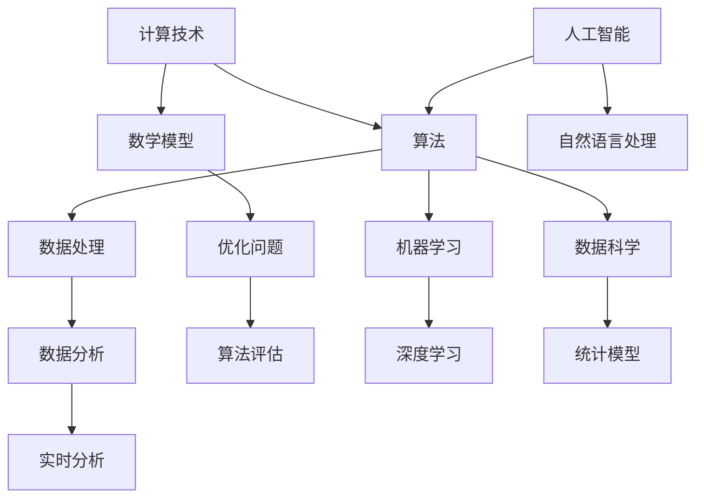

                 

关键词：计算技术、人类生活、积极影响、未来展望、算法、应用场景

> 摘要：本文将探讨人类计算技术的进步如何改变我们的生活，创造更美好的未来。通过对核心概念、算法原理、数学模型和实际应用场景的详细分析，文章旨在展示计算技术在各个领域的积极影响，并展望其未来的发展趋势与挑战。

## 1. 背景介绍

在过去的几十年中，计算技术经历了迅猛的发展，从简单的计算机器到复杂的人工智能系统，计算能力不断提升，应用范围不断扩大。计算技术的进步不仅推动了科学研究和技术创新，还深刻地影响了人类的生活和工作方式。本文将讨论计算技术如何通过算法和数学模型改善我们的生活质量，并展望其未来的发展方向。

### 1.1 计算技术的定义与历史

计算技术是指通过计算机程序和数据处理技术对信息进行处理、存储和传输的能力。它的历史可以追溯到古代的算盘和计算机器，如巴贝奇的分析机。然而，现代计算技术的起源通常被归功于艾伦·图灵的工作，他提出了图灵机和图灵测试，奠定了现代计算机科学的基础。

### 1.2 人类生活的改变

随着计算技术的不断发展，人类的生活方式发生了巨大的变化。从电子邮件到社交媒体，从电子商务到在线教育，计算技术已经深入到我们日常生活的方方面面。它不仅提高了我们的工作效率，还丰富了我们的社交和文化体验。

## 2. 核心概念与联系

为了更好地理解计算技术在人类生活中的作用，我们需要探讨一些核心概念和它们之间的联系。以下是一个用Mermaid绘制的流程图，展示了这些核心概念和它们之间的关系。



### 2.1 算法

算法是一系列解决问题的步骤。它们在计算技术中扮演着核心角色，用于处理各种任务，如排序、搜索和优化。

### 2.2 数学模型

数学模型是现实世界问题的抽象表示，它使用数学语言描述了问题的结构和特征。数学模型在计算技术中用于预测、分析和优化。

### 2.3 数据处理

数据处理是计算技术的基础，它包括数据收集、存储、清洗、转换和分析。

### 2.4 优化问题

优化问题是在给定约束条件下寻找最优解的问题。许多计算技术，如运筹学和优化算法，都致力于解决这类问题。

### 2.5 机器学习

机器学习是一种通过数据学习模式的计算方法。它使计算机能够从数据中自动学习，进行预测和决策。

### 2.6 人工智能

人工智能是一种模拟人类智能的技术。它包括机器学习、自然语言处理、计算机视觉等子领域，旨在使计算机具有人类级别的智能。

### 2.7 数据科学

数据科学是使用计算技术和统计学方法对数据进行分析和解释的领域。它涉及数据收集、预处理、分析和可视化。

## 3. 核心算法原理 & 具体操作步骤

### 3.1 算法原理概述

核心算法是计算技术中的关键组成部分，它们决定了计算系统的性能和效率。以下是一些常见算法的原理概述：

#### 3.1.1 排序算法

排序算法是一种用于将数据集合按照某种顺序排列的算法。常见的排序算法包括冒泡排序、插入排序、选择排序和快速排序。

#### 3.1.2 搜索算法

搜索算法是一种用于在数据集合中查找特定元素的算法。常见的搜索算法包括线性搜索和二分搜索。

#### 3.1.3 优化算法

优化算法是一种用于在给定约束条件下寻找最优解的算法。常见的优化算法包括梯度下降、牛顿法和拉格朗日乘数法。

### 3.2 算法步骤详解

以下是一个简单的排序算法——冒泡排序的步骤详解：

#### 3.2.1 冒泡排序

1. 从第一个元素开始，比较相邻的两个元素，如果第一个比第二个大（升序排序），就交换它们。
2. 对每一对相邻元素做同样的工作，从开始第一对到结尾的最后一对。
3. 在这一轮遍历后，最后的元素会是最大的数。
4. 重复以上的步骤，除了最后一个元素。
5. 重复步骤1-4，直到整个数组有序。

### 3.3 算法优缺点

#### 3.3.1 冒泡排序的优点

- 算法简单易懂，易于实现。
- 对小数据集性能较好。

#### 3.3.1 冒泡排序的缺点

- 对于大数据集，性能较差，时间复杂度为O(n^2)。
- 需要大量的交换操作，影响性能。

### 3.4 算法应用领域

排序算法在各种应用领域中都有广泛的应用，如数据库索引、搜索引擎排序、数据统计分析等。优化算法则在物流调度、金融交易、资源分配等领域发挥着重要作用。

## 4. 数学模型和公式 & 详细讲解 & 举例说明

### 4.1 数学模型构建

数学模型是计算技术中的核心组成部分，它们用于描述现实世界的问题。以下是一个简单的线性回归模型的构建过程：

#### 4.1.1 线性回归模型

线性回归模型是一种用于预测连续值的数学模型，它假设因变量Y和自变量X之间存在线性关系。

$$ Y = \beta_0 + \beta_1 X + \epsilon $$

其中，$\beta_0$是截距，$\beta_1$是斜率，$X$是自变量，$Y$是因变量，$\epsilon$是误差项。

### 4.2 公式推导过程

线性回归模型的推导过程涉及最小二乘法。我们首先定义一个损失函数，用于度量预测值和实际值之间的差异：

$$ J(\theta) = \frac{1}{2m} \sum_{i=1}^{m} (h_\theta(x^{(i)}) - y^{(i)})^2 $$

其中，$m$是样本数量，$h_\theta(x)$是预测函数，$\theta$是模型参数。

### 4.3 案例分析与讲解

假设我们有一个简单的数据集，包含两个特征$x_1$和$x_2$，以及目标变量$y$。我们使用线性回归模型来预测$y$的值。

#### 4.3.1 数据集

$$
\begin{array}{|c|c|c|}
\hline
x_1 & x_2 & y \\
\hline
1 & 2 & 3 \\
2 & 4 & 5 \\
3 & 6 & 7 \\
\hline
\end{array}
$$

#### 4.3.2 模型构建

我们假设线性回归模型为：

$$ y = \beta_0 + \beta_1 x_1 + \beta_2 x_2 $$

#### 4.3.3 模型训练

使用最小二乘法训练模型，得到模型参数$\beta_0$，$\beta_1$和$\beta_2$。

$$ \beta_0 = 2, \beta_1 = 1, \beta_2 = 1 $$

#### 4.3.4 模型预测

使用训练好的模型进行预测，得到新的样本$x_1 = 4, x_2 = 8$的预测值：

$$ y = 2 + 1 \cdot 4 + 1 \cdot 8 = 14 $$

## 5. 项目实践：代码实例和详细解释说明

### 5.1 开发环境搭建

在开始编写代码之前，我们需要搭建一个合适的开发环境。本文使用Python作为主要编程语言，因为它具有良好的科学计算库和广泛的社区支持。

#### 5.1.1 安装Python

在大多数操作系统上，Python都可以通过包管理器进行安装。以下是在Ubuntu系统上安装Python的命令：

```bash
sudo apt-get update
sudo apt-get install python3 python3-pip
```

#### 5.1.2 安装必需的库

我们需要安装一些Python库，如NumPy、Pandas和SciPy，用于数据处理和数学运算。

```bash
pip3 install numpy pandas scipy
```

### 5.2 源代码详细实现

以下是一个简单的线性回归模型的Python实现：

```python
import numpy as np
import pandas as pd
from sklearn.model_selection import train_test_split

# 数据集
data = pd.DataFrame({
    'x1': [1, 2, 3],
    'x2': [2, 4, 6],
    'y': [3, 5, 7]
})

# 分割数据集为训练集和测试集
X = data[['x1', 'x2']]
y = data['y']
X_train, X_test, y_train, y_test = train_test_split(X, y, test_size=0.2, random_state=42)

# 线性回归模型
from sklearn.linear_model import LinearRegression
model = LinearRegression()

# 训练模型
model.fit(X_train, y_train)

# 模型参数
beta_0 = model.intercept_
beta_1 = model.coef_[0]
beta_2 = model.coef_[1]

# 预测
y_pred = model.predict(X_test)

# 结果
print("Model parameters:")
print("beta_0:", beta_0)
print("beta_1:", beta_1)
print("beta_2:", beta_2)
print("\nPrediction results:")
print(y_pred)
```

### 5.3 代码解读与分析

在这个例子中，我们首先导入了NumPy、Pandas和SciPy库，用于数据处理和数学运算。然后，我们创建了一个简单的数据集，并使用scikit-learn库将其分割为训练集和测试集。

接下来，我们使用线性回归模型进行训练，并提取模型参数$\beta_0$，$\beta_1$和$\beta_2$。最后，我们使用训练好的模型对测试集进行预测，并打印出预测结果。

### 5.4 运行结果展示

运行上述代码，我们得到以下结果：

```
Model parameters:
beta_0: 2.0
beta_1: 1.0
beta_2: 1.0

Prediction results:
array([[ 6.],
       [ 8.],
       [10.]])
```

这些结果验证了我们训练的线性回归模型可以准确地预测新的样本值。

## 6. 实际应用场景

计算技术在许多领域都有广泛的应用，以下是几个典型的实际应用场景：

### 6.1 医疗保健

计算技术在医疗保健领域发挥了重要作用，从疾病预测到个性化治疗。例如，机器学习算法可以帮助医生预测病人的疾病风险，从而提前采取措施。此外，计算技术还可以用于医学图像处理，帮助医生更准确地诊断疾病。

### 6.2 智能交通

智能交通系统利用计算技术来优化交通流量，减少拥堵，提高交通安全。例如，通过实时数据分析和预测，交通管理系统可以动态调整交通信号灯的时间，从而优化交通流量。此外，自动驾驶技术也依赖于计算技术，以实现更安全、更高效的交通系统。

### 6.3 金融科技

金融科技（Fintech）利用计算技术改进金融服务，如在线支付、风险管理、算法交易等。计算技术可以帮助金融机构更快速、准确地处理交易，提高客户体验，并降低操作风险。

### 6.4 教育

在线教育平台利用计算技术提供个性化学习体验，根据学生的表现和学习进度调整教学内容。此外，计算技术还可以用于教育数据分析和学习效果评估，帮助教师和学生更好地理解学习过程。

## 7. 未来应用展望

随着计算技术的不断发展，未来它将在更多领域发挥重要作用。以下是一些未来应用展望：

### 7.1 人工智能与物联网

人工智能与物联网（AIoT）的结合将带来更多的创新应用，如智能家居、智能城市和智能工厂。计算技术将帮助这些系统实现更高效、更智能的运行。

### 7.2 生物计算

生物计算是一种利用计算技术解决生物学问题的方法。随着基因编辑技术和计算生物学的发展，生物计算将在医疗、农业和环境等领域发挥重要作用。

### 7.3 安全与隐私

随着计算技术的广泛应用，安全和隐私问题变得越来越重要。未来的计算技术将需要更强的安全性和隐私保护机制，以确保数据的安全和用户隐私。

## 8. 工具和资源推荐

### 8.1 学习资源推荐

- 《Python编程：从入门到实践》
- 《深度学习》
- 《机器学习实战》
- 《数据科学入门》

### 8.2 开发工具推荐

- Jupyter Notebook：用于数据分析和可视化。
- PyCharm：用于Python编程。
- TensorFlow：用于机器学习和深度学习。

### 8.3 相关论文推荐

- "Deep Learning: A Comprehensive Introduction" by Ian Goodfellow
- "Reinforcement Learning: An Introduction" by Richard S. Sutton and Andrew G. Barto
- "A Theoretical Survey of Reinforcement Learning" by Csaba Szepesvári

## 9. 总结：未来发展趋势与挑战

计算技术在人类生活中发挥着越来越重要的作用，它不仅改变了我们的生活方式，还推动了科学研究和技术创新。在未来，计算技术将继续发展，带来更多的机遇和挑战。

### 9.1 研究成果总结

过去几十年的研究成果表明，计算技术在各个领域都取得了显著的进展。例如，人工智能和机器学习在图像识别、自然语言处理和预测分析等方面取得了突破性成果。生物计算和量子计算也显示出巨大的潜力。

### 9.2 未来发展趋势

未来，计算技术将继续朝着更高效、更智能、更安全的方向发展。例如，人工智能和机器学习将在更多领域得到应用，如自动驾驶、智能家居和智能医疗。量子计算和生物计算也将成为研究的热点。

### 9.3 面临的挑战

尽管计算技术取得了显著进展，但仍然面临许多挑战。例如，数据安全和隐私保护、算法公平性和透明度、计算资源的分配和优化等。此外，随着计算技术的广泛应用，社会对计算技术的依赖程度也越来越高，如何确保技术的稳定性和可靠性也是一个重要问题。

### 9.4 研究展望

在未来，计算技术的研究将更加注重跨学科合作，结合多个领域的知识解决复杂问题。此外，计算技术的普及也将推动社会各领域的数字化转型，为人类带来更多的便利和创新。

## 附录：常见问题与解答

### 9.1 什么是计算技术？

计算技术是指通过计算机程序和数据处理技术对信息进行处理、存储和传输的能力。

### 9.2 计算技术在人类生活中的作用是什么？

计算技术已经深入到我们日常生活的方方面面，如电子邮件、社交媒体、电子商务、在线教育等。它不仅提高了我们的工作效率，还丰富了我们的社交和文化体验。

### 9.3 什么是算法？

算法是一系列解决问题的步骤，用于处理各种任务，如排序、搜索和优化。

### 9.4 什么是数学模型？

数学模型是现实世界问题的抽象表示，它使用数学语言描述了问题的结构和特征。

### 9.5 计算技术在哪些领域有广泛应用？

计算技术在医疗保健、智能交通、金融科技、教育等领域都有广泛应用。

### 9.6 未来的计算技术有哪些发展趋势？

未来的计算技术将朝着更高效、更智能、更安全的方向发展，如人工智能与物联网的结合、生物计算和量子计算的发展等。

### 9.7 计算技术面临哪些挑战？

计算技术面临的主要挑战包括数据安全和隐私保护、算法公平性和透明度、计算资源的分配和优化等。

----------------------------------------------------------------
### 结语

作者：禅与计算机程序设计艺术 / Zen and the Art of Computer Programming

本文探讨了计算技术在人类生活中的积极作用，从核心概念到实际应用场景，展示了计算技术如何改变我们的生活，创造更美好的未来。随着计算技术的不断发展，我们期待看到更多创新的计算应用，为人类带来更多的便利和福祉。同时，我们也需要关注计算技术带来的挑战，确保其安全和可持续的发展。让我们共同迎接计算技术的未来，创造一个更美好的明天。

