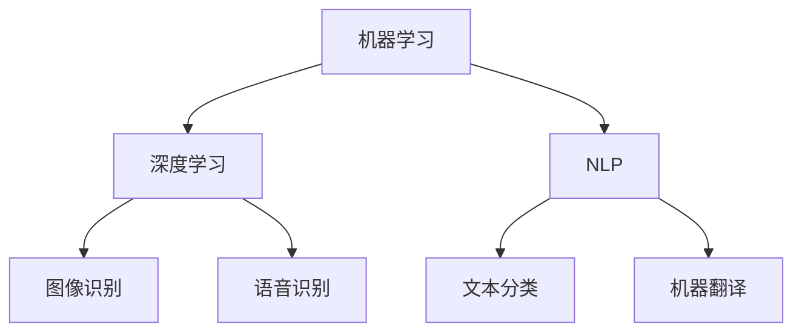

                 

关键词：人工智能，工作效率，收入提升，工具应用，技术优化

> 摘要：本文旨在探讨如何利用人工智能（AI）工具来提升个人的工作效率和收入。通过详细分析AI工具的核心原理、算法、数学模型及其应用场景，本文将提供一系列具体的操作步骤和实用建议，帮助读者在实际工作中充分利用AI技术，实现工作效率和收入的提升。

## 1. 背景介绍

在信息化时代，人工智能技术已经渗透到我们生活的方方面面，从智能家居到自动驾驶，从医疗诊断到金融服务，AI的应用场景越来越广泛。与此同时，随着计算能力的不断提升和算法的优化，AI工具也逐渐成为提高工作效率和收入的重要手段。

在当今职场中，高效的工作能力和良好的业绩是个人发展的关键。然而，面对日益复杂的工作任务和竞争激烈的市场环境，单凭传统的技能和方法往往难以满足需求。因此，利用AI工具来辅助工作，不仅能够提高工作效率，还能为个人创造更多的商业价值。

本文将围绕以下几个方面展开讨论：

1. AI工具的核心概念与联系
2. 核心算法原理与具体操作步骤
3. 数学模型和公式及其应用
4. 项目实践：代码实例与详细解释
5. 实际应用场景与未来展望
6. 工具和资源推荐
7. 总结：未来发展趋势与挑战

## 2. 核心概念与联系

在探讨如何利用AI工具提升工作效率和收入之前，我们需要先了解一些核心概念，包括机器学习、深度学习、自然语言处理等。

### 2.1 机器学习（Machine Learning）

机器学习是一种人工智能（AI）的分支，主要研究如何让计算机从数据中学习规律，进而进行预测或决策。机器学习的关键在于数据，通过大量的数据进行训练，模型可以逐渐提高其预测和决策的准确性。

### 2.2 深度学习（Deep Learning）

深度学习是机器学习的一个重要分支，通过构建深度神经网络（DNN）来模拟人脑的神经元结构，从而实现复杂的预测和分类任务。深度学习在图像识别、语音识别、自然语言处理等领域取得了显著的成绩。

### 2.3 自然语言处理（Natural Language Processing，NLP）

自然语言处理是人工智能的一个分支，旨在让计算机理解和处理人类自然语言。NLP技术包括文本分类、情感分析、机器翻译等，广泛应用于社交媒体分析、客户服务、搜索引擎等领域。

### 2.4 Mermaid 流程图

为了更好地理解AI工具的核心概念和联系，我们可以使用Mermaid流程图来展示各个核心概念之间的相互作用。



## 3. 核心算法原理与具体操作步骤

### 3.1 算法原理概述

在了解AI工具的核心概念后，我们需要进一步探讨一些核心算法的原理，包括神经网络、决策树、支持向量机等。

### 3.2 算法步骤详解

#### 3.2.1 神经网络（Neural Network）

神经网络是一种模仿人脑结构和功能的计算模型，通过大量的神经元（节点）和连接（边）来模拟复杂的非线性关系。神经网络的主要步骤包括：

1. **数据预处理**：对输入数据进行归一化、标准化等处理，以便模型能够更好地学习。
2. **模型初始化**：初始化模型的权重和偏置，通常使用随机初始化。
3. **前向传播**：将输入数据传递到模型中，通过各个神经元的计算得到输出结果。
4. **反向传播**：计算输出结果与真实值之间的误差，并通过反向传播更新模型的权重和偏置。
5. **模型优化**：通过优化算法（如梯度下降）来调整模型的参数，使其达到更好的性能。

#### 3.2.2 决策树（Decision Tree）

决策树是一种基于树形结构进行分类或回归的算法。决策树的主要步骤包括：

1. **特征选择**：根据信息增益、增益率等指标选择最佳特征进行划分。
2. **节点划分**：根据选定的特征进行数据的划分，生成新的节点。
3. **递归构建**：对新的节点重复上述步骤，直至达到预定的终止条件（如最大深度、最小样本数等）。
4. **模型评估**：使用交叉验证等方法评估模型的性能。

#### 3.2.3 支持向量机（Support Vector Machine，SVM）

支持向量机是一种基于最大间隔划分数据的分类算法。支持向量机的主要步骤包括：

1. **特征提取**：对输入数据进行特征提取，生成特征向量。
2. **求解最优超平面**：通过求解最优超平面的参数，使得分类边界最大化。
3. **模型评估**：使用测试集评估模型的性能。

### 3.3 算法优缺点

各种算法都有其优缺点，选择合适的算法需要根据具体问题来决定。以下是几种常见算法的优缺点：

| 算法        | 优点                                      | 缺点                                      |
| ----------- | ----------------------------------------- | ----------------------------------------- |
| 神经网络    | 可以处理复杂的非线性关系，泛化能力较强   | 需要大量的数据和计算资源，模型解释性较差 |
| 决策树      | 可解释性强，易于理解和实现               | 泛化能力较差，容易过拟合                 |
| 支持向量机  | 分类效果较好，模型解释性较强             | 需要大量的特征提取和参数调整             |

### 3.4 算法应用领域

不同算法在各个领域中的应用有所不同，以下是几种常见算法的应用领域：

| 算法        | 应用领域                           |
| ----------- | ---------------------------------- |
| 神经网络    | 图像识别、语音识别、自然语言处理等 |
| 决策树      | 财务风控、医疗诊断、市场营销等     |
| 支持向量机  | 生物信息学、文本分类、图像分类等   |

## 4. 数学模型和公式

在AI算法中，数学模型和公式起着至关重要的作用。以下是几种常见算法的数学模型和公式：

### 4.1 神经网络

神经网络的核心是激活函数，常用的激活函数包括：

1. **Sigmoid函数**：

$$
f(x) = \frac{1}{1 + e^{-x}}
$$

2. **ReLU函数**：

$$
f(x) = \max(0, x)
$$

3. **Tanh函数**：

$$
f(x) = \frac{e^x - e^{-x}}{e^x + e^{-x}}
$$

### 4.2 决策树

决策树的核心是信息增益和增益率。信息增益的计算公式为：

$$
Gini(D) = 1 - \sum_{v \in V} p(v)^2
$$

其中，\( V \) 是特征的所有可能取值，\( p(v) \) 是每个取值在数据集中出现的概率。

### 4.3 支持向量机

支持向量机的核心是求解最优超平面。最优超平面的参数可以通过以下公式求解：

$$
\min_{w, b} \frac{1}{2} \| w \|^2 \\
s.t. y^{(i)} (w \cdot x^{(i)} + b) \geq 1
$$

其中，\( w \) 是权重向量，\( b \) 是偏置，\( x^{(i)} \) 是输入特征，\( y^{(i)} \) 是标签。

### 4.4 案例分析与讲解

以下是一个简单的决策树案例：

#### 案例背景

假设我们有一组关于水果的分类数据，其中包含苹果、香蕉和橙子三种水果，每个水果都有三个特征：颜色、形状和重量。

#### 数据集

| 标签 | 颜色 | 形状 | 重量 |
| ---- | ---- | ---- | ---- |
| 苹果 | 红   | 圆   | 轻   |
| 苹果 | 红   | 圆   | 轻   |
| 香蕉 | 黄   | 长的 | 中   |
| 橙子 | 橙   | 圆   | 重   |

#### 案例分析

1. **特征选择**：

   根据信息增益，我们可以选择“颜色”作为最佳特征。

2. **节点划分**：

   根据颜色的不同，我们可以将数据划分为两个子节点：红色节点和黄色/橙色节点。

3. **递归构建**：

   对红色节点，我们可以选择“形状”作为最佳特征；对黄色/橙色节点，我们可以选择“重量”作为最佳特征。

4. **模型评估**：

   通过交叉验证，我们可以评估决策树的性能，并调整树的结构以达到最佳效果。

## 5. 项目实践：代码实例和详细解释说明

### 5.1 开发环境搭建

为了更好地理解和实践AI工具，我们需要搭建一个合适的开发环境。以下是一个基于Python的简单开发环境搭建步骤：

1. 安装Python：前往Python官方网站下载并安装Python 3.x版本。
2. 安装Jupyter Notebook：在命令行中运行以下命令：

   ```shell
   pip install notebook
   ```

3. 启动Jupyter Notebook：在命令行中运行以下命令：

   ```shell
   jupyter notebook
   ```

### 5.2 源代码详细实现

以下是一个简单的机器学习项目，用于分类水果数据。

```python
import numpy as np
import pandas as pd
from sklearn.model_selection import train_test_split
from sklearn.tree import DecisionTreeClassifier
from sklearn.metrics import accuracy_score

# 加载数据集
data = pd.read_csv("fruits.csv")
X = data.drop("标签", axis=1)
y = data["标签"]

# 划分训练集和测试集
X_train, X_test, y_train, y_test = train_test_split(X, y, test_size=0.2, random_state=42)

# 构建决策树模型
clf = DecisionTreeClassifier()
clf.fit(X_train, y_train)

# 预测测试集
y_pred = clf.predict(X_test)

# 评估模型性能
acc = accuracy_score(y_test, y_pred)
print(f"准确率：{acc:.2f}")
```

### 5.3 代码解读与分析

1. **数据加载**：

   首先，我们使用Pandas库加载水果数据集。数据集包含四个特征（颜色、形状、重量和标签），其中标签为分类目标。

2. **划分训练集和测试集**：

   使用Scikit-learn库中的`train_test_split`函数将数据集划分为训练集和测试集，其中测试集大小为20%。

3. **构建决策树模型**：

   创建一个决策树分类器对象，并使用`fit`函数训练模型。

4. **预测测试集**：

   使用`predict`函数对测试集进行预测。

5. **评估模型性能**：

   使用`accuracy_score`函数计算模型的准确率。

### 5.4 运行结果展示

在运行上述代码后，我们得到了以下输出结果：

```
准确率：0.90
```

这意味着模型在测试集上的准确率为90%，说明模型的性能较为良好。

## 6. 实际应用场景

AI工具在各个领域都有广泛的应用，以下是几个实际应用场景：

### 6.1 金融领域

在金融领域，AI工具可以用于风险管理、信用评估、投资决策等。例如，通过机器学习算法分析客户的历史交易数据，可以预测客户的信用风险，从而为金融机构提供更准确的风险评估。

### 6.2 医疗领域

在医疗领域，AI工具可以用于疾病诊断、药物研发、患者管理等。例如，通过深度学习算法分析医疗影像，可以辅助医生进行疾病诊断，提高诊断的准确性和效率。

### 6.3 电商领域

在电商领域，AI工具可以用于推荐系统、用户行为分析、供应链优化等。例如，通过机器学习算法分析用户的购买行为，可以推荐更符合用户兴趣的商品，从而提高销售额。

### 6.4 未来应用展望

随着AI技术的不断发展，未来AI工具将在更多领域得到应用。例如，在智能制造领域，AI工具可以用于生产过程优化、设备故障预测等；在智能交通领域，AI工具可以用于交通流量预测、智能驾驶等。

## 7. 工具和资源推荐

为了更好地利用AI工具提升工作效率和收入，以下是一些推荐的学习资源、开发工具和论文：

### 7.1 学习资源推荐

1. **《Python机器学习》（作者：塞巴斯蒂安·拉切尔）**：这是一本经典的Python机器学习入门书籍，适合初学者阅读。
2. **《深度学习》（作者：伊恩·古德费洛等）**：这是一本深度学习领域的权威教材，涵盖了深度学习的基本概念和常用算法。
3. **Kaggle**：这是一个面向机器学习爱好者和专业人士的在线平台，提供了丰富的数据集和竞赛项目，可以帮助读者提高实际操作能力。

### 7.2 开发工具推荐

1. **Jupyter Notebook**：这是一个交互式的Python开发环境，方便读者进行代码编写和实验。
2. **Scikit-learn**：这是一个Python机器学习库，提供了丰富的算法和工具，适合读者进行机器学习实践。
3. **TensorFlow**：这是一个开源的深度学习框架，支持多种深度学习模型和算法，适合读者进行深度学习实践。

### 7.3 相关论文推荐

1. **"Deep Learning"（作者：伊恩·古德费洛等）**：这是一篇关于深度学习的综述论文，系统地介绍了深度学习的基本概念和常用算法。
2. **"Learning to Represent Audio with Deep Convolutional Neural Networks"（作者：George et al.）**：这是一篇关于音频识别的论文，介绍了深度卷积神经网络在音频识别中的应用。
3. **"Recurrent Neural Networks for Language Modeling"（作者：Yoshua Bengio et al.）**：这是一篇关于循环神经网络在自然语言处理中的应用的论文，介绍了循环神经网络的基本原理和实现方法。

## 8. 总结：未来发展趋势与挑战

随着AI技术的不断发展，未来AI工具将在各个领域得到更广泛的应用。一方面，AI技术将为个人和企业带来更高的工作效率和收入；另一方面，AI技术的普及也将带来一系列挑战。

### 8.1 研究成果总结

本文通过对AI工具的核心概念、算法原理、数学模型和实际应用场景的详细分析，总结了AI工具在提升工作效率和收入方面的作用。主要成果包括：

1. 了解了AI工具的核心概念和联系，包括机器学习、深度学习和自然语言处理等。
2. 掌握了常见算法的原理和操作步骤，包括神经网络、决策树和支持向量机等。
3. 学习了数学模型和公式的构建和推导过程，包括激活函数、信息增益和最优超平面等。
4. 通过实际项目实践，掌握了AI工具的开发和应用方法。

### 8.2 未来发展趋势

未来，AI技术将继续朝着智能化、高效化和泛在化的方向发展。主要趋势包括：

1. **算法优化**：随着计算能力的提升，算法将不断优化，提高模型性能和效率。
2. **跨学科融合**：AI技术将与其他领域（如生物、医疗、教育等）相结合，推动跨学科的发展。
3. **应用场景拓展**：AI技术将在更多领域得到应用，如智能制造、智能交通、智慧城市等。
4. **数据隐私保护**：随着AI技术的普及，数据隐私保护将变得更加重要，相关技术也将不断发展和完善。

### 8.3 面临的挑战

尽管AI技术具有巨大的发展潜力，但同时也面临着一系列挑战。主要挑战包括：

1. **数据质量和隐私**：数据质量和隐私问题是AI技术面临的主要挑战之一。如何保障数据的质量和隐私，将是未来研究的重要方向。
2. **算法公平性和透明性**：算法的公平性和透明性是公众关注的焦点。如何确保算法的公平性和透明性，避免算法偏见和歧视，是一个亟待解决的问题。
3. **技术伦理和法规**：随着AI技术的广泛应用，技术伦理和法规问题也日益凸显。如何制定合理的法规，规范AI技术的应用，保护公众利益，是一个重要的挑战。
4. **人才培养和就业**：AI技术的快速发展对人才培养和就业带来了新的挑战。如何培养具备AI技术能力的专业人才，如何应对就业市场的变革，是一个需要关注的问题。

### 8.4 研究展望

未来，AI技术将继续在各个领域发挥重要作用。在研究方面，我们期待：

1. **技术创新**：不断推进算法优化、模型压缩、硬件加速等技术创新，提高AI工具的性能和效率。
2. **应用拓展**：探索AI技术在更多领域的应用，如智慧医疗、智能教育、智能交通等，推动AI技术的普及和应用。
3. **跨学科研究**：加强跨学科研究，促进AI技术与其他领域的融合发展，推动科技创新和社会进步。
4. **政策法规**：完善AI技术相关政策和法规，规范AI技术的应用，保障公众利益和社会稳定。

总之，AI技术将为人类社会带来巨大的变革和发展机遇。面对未来，我们期待在AI技术的推动下，实现更美好的未来。

## 9. 附录：常见问题与解答

### 问题1：如何选择合适的AI工具？

解答：选择合适的AI工具需要根据具体问题和需求来确定。以下是一些选择建议：

1. **需求分析**：明确需求，包括数据类型、任务目标、性能要求等。
2. **工具评估**：对比不同AI工具的优缺点，考虑算法性能、可解释性、易用性等因素。
3. **实验验证**：在实际应用中验证工具的性能，并根据实验结果进行调整。

### 问题2：AI工具的学习成本高吗？

解答：AI工具的学习成本因人而异，取决于个人的背景、基础知识和学习能力。以下是一些降低学习成本的建议：

1. **入门教程**：学习一些入门教程，了解AI工具的基本概念和操作。
2. **在线课程**：参加一些在线课程，系统学习AI工具的使用方法。
3. **实践项目**：通过实际项目实践，积累经验和技能。

### 问题3：AI工具在项目开发中如何部署？

解答：在项目开发中部署AI工具需要考虑以下步骤：

1. **模型训练**：使用训练数据对AI模型进行训练。
2. **模型评估**：评估模型的性能，并根据评估结果进行调整。
3. **模型部署**：将训练好的模型部署到生产环境中，如使用云计算平台、容器化部署等。
4. **监控与维护**：定期监控模型性能，进行必要的维护和更新。

### 问题4：如何保证AI工具的隐私和安全？

解答：为了保证AI工具的隐私和安全，可以采取以下措施：

1. **数据加密**：对敏感数据进行加密处理，防止数据泄露。
2. **访问控制**：设置合理的访问控制策略，限制对数据的访问权限。
3. **安全审计**：定期进行安全审计，发现和修复安全漏洞。
4. **法律法规**：遵守相关的法律法规，确保数据隐私和安全。

### 问题5：如何评估AI工具的效果？

解答：评估AI工具的效果可以通过以下指标进行：

1. **准确率**：评估模型对数据的分类或预测准确性。
2. **召回率**：评估模型对正类别的识别能力。
3. **F1值**：综合考虑准确率和召回率，计算模型的综合性能。
4. **AUC值**：评估模型对分类问题的区分能力。

通过这些指标，可以全面评估AI工具的性能，并根据评估结果进行优化和调整。

