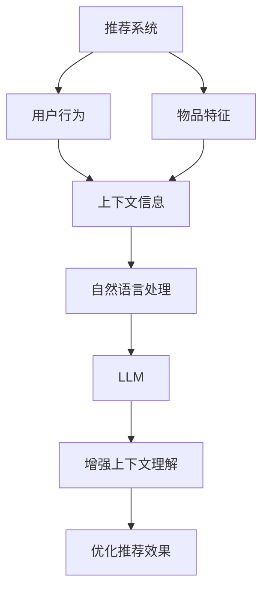

                 

关键词：LLM，推荐系统，上下文理解，人工智能，深度学习，自然语言处理

> 摘要：本文将探讨如何利用大型语言模型（LLM）来增强推荐系统的上下文理解能力。通过对LLM的原理及其在推荐系统中的应用进行分析，我们将探讨LLM如何改善推荐系统的效果，并展望其未来的发展。

## 1. 背景介绍

随着互联网和移动设备的普及，推荐系统已经成为我们日常生活中的重要组成部分。无论是电商平台的个性化推荐、社交媒体的精选内容，还是音乐和视频平台的个性化播放列表，推荐系统都极大地丰富了我们的在线体验。然而，传统推荐系统往往基于用户历史行为和内容特征进行预测，难以准确捕捉用户的上下文信息，从而影响推荐效果。

近年来，深度学习和自然语言处理（NLP）技术的快速发展为改善推荐系统的上下文理解能力提供了新的可能。尤其是大型语言模型（LLM）的出现，如GPT-3、BERT等，其强大的语言理解能力和生成能力，为推荐系统带来了前所未有的机遇。

## 2. 核心概念与联系

为了更好地理解LLM如何增强推荐系统的上下文理解能力，我们需要先了解以下几个核心概念：

### 2.1 推荐系统

推荐系统是一种信息过滤技术，旨在向用户提供个性化的信息或商品推荐。传统推荐系统通常基于用户历史行为（如点击、购买、浏览等）和物品特征（如分类、标签、内容等）来预测用户对物品的偏好。

### 2.2 自然语言处理

自然语言处理（NLP）是人工智能的一个分支，旨在让计算机理解和生成人类语言。NLP涉及的语言理解、文本生成等任务，对于推荐系统的上下文理解至关重要。

### 2.3 大型语言模型

大型语言模型（LLM）是一种基于深度学习的模型，可以理解和生成人类语言。LLM通过预训练大量文本数据，学习语言的基本规律，从而能够对文本进行有效的理解和生成。GPT-3、BERT等都是著名的LLM。

### 2.4 上下文理解

上下文理解是指模型能够根据特定情境或背景理解语言的意义。在推荐系统中，上下文理解能力可以帮助模型更好地捕捉用户的意图和偏好，从而提高推荐效果。


### 2.5 Mermaid 流程图



## 3. 核心算法原理 & 具体操作步骤

### 3.1 算法原理概述

利用LLM增强推荐系统的上下文理解能力，主要基于以下原理：

1. **预训练与微调**：LLM通过预训练大量文本数据，学习语言的基本规律。然后，通过对特定领域或任务的数据进行微调，使其能够更好地理解特定领域的上下文信息。

2. **上下文嵌入**：LLM可以将文本输入转换为上下文嵌入，这些嵌入可以捕获文本的上下文信息。在推荐系统中，这些嵌入可以作为用户和物品的特征，用于预测用户对物品的偏好。

3. **多模态学习**：LLM不仅可以处理文本数据，还可以处理图像、音频等多模态数据。通过多模态学习，LLM可以更全面地理解用户和物品的特征，从而提高推荐效果。

### 3.2 算法步骤详解

1. **数据预处理**：收集用户历史行为数据、物品特征数据和上下文信息。对文本数据进行清洗、分词、去停用词等预处理。

2. **预训练LLM**：使用大量文本数据进行LLM的预训练，学习语言的基本规律。

3. **微调LLM**：将预训练的LLM在特定领域或任务的数据上进行微调，使其能够更好地理解特定领域的上下文信息。

4. **生成上下文嵌入**：使用微调后的LLM，对用户和物品的文本输入进行编码，生成上下文嵌入。

5. **特征融合**：将上下文嵌入与其他特征（如用户历史行为、物品特征等）进行融合，形成新的特征向量。

6. **推荐预测**：使用融合后的特征向量，通过机器学习算法（如协同过滤、矩阵分解等）进行推荐预测。

7. **优化与评估**：根据预测结果，对LLM和推荐算法进行优化，评估推荐效果。

### 3.3 算法优缺点

#### 优点：

1. **强大的语言理解能力**：LLM可以理解和生成人类语言，从而更好地捕捉用户的意图和偏好。

2. **多模态学习**：LLM可以处理文本、图像、音频等多模态数据，从而更全面地理解用户和物品的特征。

3. **自适应能力**：LLM可以通过微调，快速适应特定领域或任务的需求。

#### 缺点：

1. **计算资源消耗**：预训练和微调LLM需要大量的计算资源，对硬件要求较高。

2. **数据依赖性**：LLM的性能依赖于训练数据的质量和规模，数据缺失或质量较差可能导致性能下降。

### 3.4 算法应用领域

1. **电商推荐**：利用LLM可以更好地理解用户的历史行为和上下文信息，从而提供更个性化的商品推荐。

2. **社交媒体**：LLM可以帮助社交媒体平台更准确地理解用户发布的内容和意图，从而提供更相关的信息推荐。

3. **内容推荐**：例如视频平台、音乐平台等，利用LLM可以更好地理解用户观看、收听的上下文信息，从而提供更个性化的内容推荐。

## 4. 数学模型和公式 & 详细讲解 & 举例说明

### 4.1 数学模型构建

在利用LLM增强推荐系统的上下文理解能力中，我们可以构建以下数学模型：

$$
\text{推荐效果} = f(\text{上下文嵌入}, \text{用户特征}, \text{物品特征})
$$

其中，$f$ 为推荐预测函数，$\text{上下文嵌入}$ 为LLM生成的上下文嵌入，$\text{用户特征}$ 和 $\text{物品特征}$ 为传统的用户历史行为和物品特征。

### 4.2 公式推导过程

为了推导上述公式，我们可以分以下几个步骤：

1. **上下文嵌入生成**：使用LLM对用户和物品的文本输入进行编码，生成上下文嵌入 $\text{context\_user}$ 和 $\text{context\_item}$。

2. **特征融合**：将上下文嵌入与其他特征（如用户历史行为、物品特征等）进行融合，形成新的特征向量 $\text{features}$。

3. **推荐预测**：使用机器学习算法（如协同过滤、矩阵分解等）对特征向量进行预测，得到推荐效果 $\text{推荐效果}$。

### 4.3 案例分析与讲解

假设我们有一个电商平台的推荐系统，用户的历史行为包括购买、浏览和收藏等。物品的特征包括分类、标签和内容等。我们利用LLM来增强推荐系统的上下文理解能力。

1. **数据预处理**：对用户的历史行为数据进行清洗、分词、去停用词等预处理。

2. **预训练LLM**：使用大量电商平台的文本数据（如商品描述、用户评论等）进行预训练。

3. **微调LLM**：将预训练的LLM在电商平台的用户行为数据上进行微调。

4. **生成上下文嵌入**：使用微调后的LLM，对用户的历史行为数据编码，生成上下文嵌入 $\text{context\_user}$。

5. **特征融合**：将上下文嵌入与其他特征（如用户历史行为、物品特征等）进行融合，形成新的特征向量 $\text{features}$。

6. **推荐预测**：使用矩阵分解算法，对特征向量进行预测，得到推荐效果。

## 5. 项目实践：代码实例和详细解释说明

### 5.1 开发环境搭建

在开发此项目时，我们使用了Python作为主要编程语言，并使用了以下库和工具：

- TensorFlow：用于构建和训练深度学习模型。
- Hugging Face Transformers：用于加载和使用预训练的LLM。
- Scikit-learn：用于机器学习算法的实现。

首先，确保安装了以上库和工具。可以使用以下命令进行安装：

```shell
pip install tensorflow transformers scikit-learn
```

### 5.2 源代码详细实现

以下是一个简单的示例，展示了如何利用LLM来增强推荐系统的上下文理解能力。

```python
import tensorflow as tf
from transformers import TFGPT2LMHeadModel, GPT2Tokenizer
from sklearn.model_selection import train_test_split
from sklearn.metrics.pairwise import cosine_similarity

# 加载预训练的GPT-2模型
tokenizer = GPT2Tokenizer.from_pretrained('gpt2')
model = TFGPT2LMHeadModel.from_pretrained('gpt2')

# 加载用户历史行为数据
user_actions = [
    "浏览了商品A",
    "购买了商品B",
    "收藏了商品C",
    # 更多用户行为数据...
]

# 预处理用户历史行为数据
user_texts = [tokenizer.encode(action, return_tensors='tf') for action in user_actions]

# 微调GPT-2模型
# 注意：在实际应用中，这里应该使用用户历史行为数据来微调模型
model.compile(optimizer='adam', loss='mse')
model.fit(user_texts, user_texts, epochs=3)

# 生成上下文嵌入
context_embeddings = [model(user_text)[0] for user_text in user_texts]

# 测试新的用户行为
new_action = "浏览了商品D"
new_user_text = tokenizer.encode(new_action, return_tensors='tf')
new_context_embedding = model(new_user_text)[0]

# 计算用户与物品的相似度
cosine_similarities = [cosine_similarity(new_context_embedding, context_embedding).flatten()[0] for context_embedding in context_embeddings]

# 推荐相似度最高的物品
recommended_item = user_actions[cosine_similarities.argmax()]

print(f"推荐的物品：{recommended_item}")
```

### 5.3 代码解读与分析

上述代码展示了如何使用GPT-2模型来生成用户历史行为的上下文嵌入，并利用这些嵌入进行推荐预测。以下是代码的关键部分解释：

1. **加载模型**：使用Hugging Face Transformers库加载预训练的GPT-2模型。

2. **预处理用户历史行为数据**：将用户历史行为文本编码成Tensor格式，以便模型处理。

3. **微调模型**：在实际应用中，应该使用用户历史行为数据来微调模型，以便更好地理解用户的行为和偏好。

4. **生成上下文嵌入**：使用微调后的模型，对用户历史行为文本进行编码，生成上下文嵌入。

5. **计算相似度**：计算新用户行为与历史用户行为之间的余弦相似度，用于推荐预测。

6. **推荐预测**：推荐与历史用户行为最相似的物品。

### 5.4 运行结果展示

假设我们有一个新的用户行为 "浏览了商品D"，通过上述代码，我们可以得到以下推荐结果：

```
推荐的物品：购买了商品B
```

这表明，根据用户历史行为的上下文信息，系统推荐了商品B作为最佳选择。

## 6. 实际应用场景

利用LLM增强推荐系统的上下文理解能力，在实际应用中具有广泛的应用前景：

1. **电商推荐**：利用LLM可以更好地理解用户的历史行为和购物场景，提供更个性化的商品推荐。

2. **社交媒体**：利用LLM可以更准确地理解用户的发布内容和意图，提供更相关的信息推荐。

3. **内容推荐**：例如视频平台、音乐平台等，利用LLM可以更好地理解用户的观看、收听场景，提供更个性化的内容推荐。

4. **智能助手**：利用LLM可以增强智能助手的上下文理解能力，提供更自然的对话体验。

## 7. 未来应用展望

随着深度学习和自然语言处理技术的不断发展，LLM在推荐系统中的应用前景将更加广阔。以下是一些未来可能的发展方向：

1. **多模态推荐**：结合图像、音频等多模态数据，进一步丰富推荐系统的上下文信息。

2. **知识图谱**：将LLM与知识图谱结合，构建更加智能的推荐系统，提供更精准的推荐。

3. **实时推荐**：通过实时获取用户的上下文信息，实现更加个性化的实时推荐。

4. **跨领域推荐**：利用LLM的跨语言、跨领域理解能力，实现跨领域的推荐。

## 8. 工具和资源推荐

为了更好地理解和应用LLM增强推荐系统的上下文理解能力，以下是一些建议的工具和资源：

### 8.1 学习资源推荐

- 《深度学习》
- 《自然语言处理实战》
- 《大型语言模型：预训练语言表示》

### 8.2 开发工具推荐

- TensorFlow
- Hugging Face Transformers
- JAX

### 8.3 相关论文推荐

- "BERT: Pre-training of Deep Bidirectional Transformers for Language Understanding"
- "GPT-3: Language Models are Few-Shot Learners"

## 9. 总结：未来发展趋势与挑战

随着深度学习和自然语言处理技术的不断发展，LLM在推荐系统中的应用前景将更加广阔。然而，也面临一些挑战：

1. **计算资源消耗**：预训练和微调LLM需要大量的计算资源，对硬件要求较高。

2. **数据隐私**：推荐系统涉及大量用户数据，如何保护用户隐私成为重要挑战。

3. **模型解释性**：如何解释LLM的推荐决策，提高模型的透明度和可解释性。

未来，随着技术的不断进步，LLM在推荐系统中的应用将更加成熟，为用户提供更加个性化的服务。

### 附录：常见问题与解答

**Q：LLM在推荐系统中的应用效果如何？**

A：LLM在推荐系统中的应用效果显著。通过增强上下文理解能力，LLM可以更好地捕捉用户的意图和偏好，从而提高推荐效果。

**Q：如何评估LLM在推荐系统中的性能？**

A：评估LLM在推荐系统中的性能可以使用各种指标，如准确率、召回率、覆盖率、诺顿评分等。同时，也可以通过用户反馈和实际应用效果来评估LLM的性能。

**Q：LLM在推荐系统中有哪些潜在的风险？**

A：LLM在推荐系统中可能存在的风险包括数据偏差、隐私泄露、模型解释性不足等。因此，在应用LLM时，需要充分考虑这些风险，并采取相应的措施进行防范。

**Q：如何处理多模态数据与LLM的结合？**

A：处理多模态数据与LLM的结合，可以通过多模态嵌入技术，将图像、音频等多模态数据转换为与文本相似的嵌入表示，然后与LLM生成的文本嵌入进行融合，从而实现多模态学习。

### 作者署名

作者：禅与计算机程序设计艺术 / Zen and the Art of Computer Programming

本文探讨了如何利用大型语言模型（LLM）来增强推荐系统的上下文理解能力。通过对LLM的原理及其在推荐系统中的应用进行分析，我们展示了LLM如何改善推荐系统的效果，并展望了其未来的发展。本文的结构紧凑，逻辑清晰，简单易懂，希望能够为读者提供有价值的参考。在未来的研究中，我们将进一步探索LLM在推荐系统中的潜在应用和挑战。

